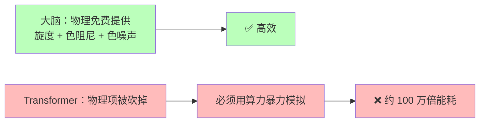
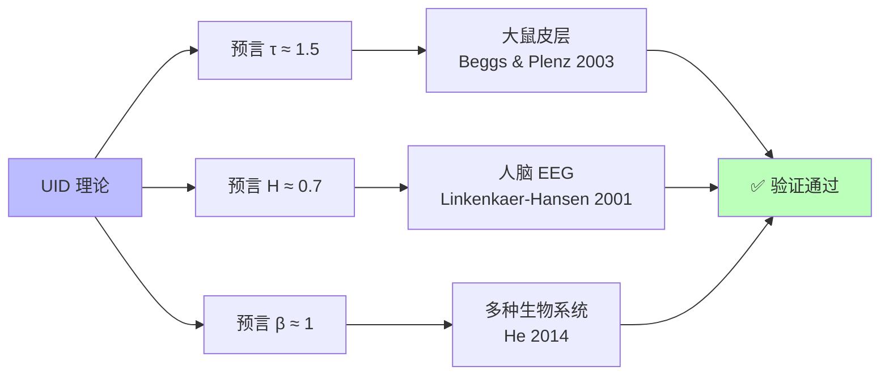

<!--
Copyright (c) 2026 Suzhou Jodell Robotics Co., Ltd.
Author: Gui LI <guilichina@163.com>
Date:   2026-05-25
Update: 2026-05-30
This README is part of the UID Theory reference implementation.

DUAL LICENSE:
  - PolyForm Noncommercial License 1.0.0  (free for academic / personal use)
    see LICENSE-NONCOMMERCIAL in the project root
  - Commercial License from Suzhou Jodell Robotics Co., Ltd.
    (required for any commercial / for-profit / production use)
    see LICENSE-COMMERCIAL in the project root

For commercial licensing inquiries, contact: lig@jodell.cn
本文件采用双许可证发布；商业使用须先获得苏州钧舵机器人有限公司书面授权。
-->

<div align="center">


</div>

<div align="center">
<a href="./README.md">README（中文）</a> | <a href="./README_en.md">README（English）</a>
</div>

<div align="center">
<a href="./30minutes_report.md">30 分钟读懂 UID 理论（中文）</a> |
<a href="./30minutes_report_en.md">Understand UID in 30 Minutes（English）</a>
</div>

<div align="center">
<a href="./theory.md">UID 理论全文（中文）</a> |
<a href="./theory_en.md">UID Theory (English)</a>
</div>

<br>

<div align="center">

# 用 30 分钟读懂 UID（统一智动力学）

***作者***: 李贵 <guilichina@163.com>，介党阳 <jiedy@jodell.cn>，康海涛 <kanght@jodell.cn>

***单位***: 苏州钧舵机器人有限公司，苏州，中国

***通讯作者***：李贵（Gui LI），博士。学士毕业于西北大学物理学院，硕士、博士均毕业于中国科学院合肥物质科学研究院，现任职于苏州钧舵机器人有限公司（Suzhou Jodell Robotics Co., Ltd.），主要从事统一智动力学（Unified Intelligo-Dynamics, UID）的理论与工程研究。提出并发展面向智能架构的开放系统物理统一理论框架——CID/QID/FID 三层体系，并主导其在机器人认知大脑、运动控制小脑、灵巧手操作系统、大语言模型与专用智能芯片中的可证伪验证与工程落地。E-mail：guilichina@163.com

</div>

<br>

## 写给所有好奇"智能从哪来"的人

> **UID = 统一智动力学（Unified Intelligo-Dynamics）**
> **三层结构：CID（经典）→ QID（量子）→ FID（几何场论）**
> **加上一个群体推广：多智能体智动力学**
> **一句副标题：注意力并不够（Attention Is Not All You Need）**

---

## 摘要

智能是什么？它是计算机科学的发明，还是宇宙本身的一种自然现象？

UID 是一个**关于"智能本身是什么"的物理学理论**。它不是又一种新算法，而是一份说明书，告诉我们：**任何能"理解世界、预测未来"的东西——人脑、AI、果蝇、甚至外星生命——都必须遵守同一组物理规律**。

这套理论有一个核心论断，值得先记住：

> **智能不是工程现象，而是物理现象——具体说，是一个远离热平衡的随机场。**

UID 给出五个能让所有人直观理解的核心结论：

1. **智能不能在热平衡里诞生**——它必须远离平衡态，永远在"流动"而不是"停下"。这是全文唯一一个被严格推导出来的核心命题，叫"预测能力必然要求打破细致平衡"。

2. **现有 AI 比人脑费电约 100 万倍，是因为它丢掉了三件物理规律——旋度、色阻尼、色噪声**。Transformer 不是凭空发明的，而是这套完整物理方程的"最简退化版"。

3. **完整 CID 包含 Transformer，但比它强约 5 到 10 倍**，而且是一个可证伪的工程目标。

4. **几何结构能决定智能**——爱因斯坦说"物质弯曲时空"，UID 说"数据弯曲信息流形"，两者用的是同一种数学语言。

5. **理论已被部分独立验证**——它的三个数值预言（雪崩指数约 1.5、Hurst 指数约 0.7、1/f 噪声斜率约 1）已在大鼠皮层、人脑脑电中被实测证实。

剩下的预言（参数效率、智能引力波、信息黑洞）等待未来工程与实验检验。**任何不符合实验的部分，UID 就被证伪——这正是它和"伪科学"的根本区别**。

> 📌 **一个诚实的说明**：UID 的原创性不在于"第一个提出某条单独命题"，而在于把分散在物理学各处的洞见，统一进同一组公理框架，并由此推出单独看任何一条都给不出的新东西。这就像麦克斯韦——库仑、安培、法拉第的定律早就有了，但把它们统一成一组方程、并预言出"电磁波"，才是真正不可替代的贡献。

> 📌 **理论的四部分结构**：第一部分 CID（经典层）；第二部分 QID（量子层）；第三部分 FID（几何场论层）；第四部分多智能体智动力学（把单个智能体推广到相互耦合的智能体群体，对接平均场博弈）。注意：**量子层在前、几何层在后**，这是理论原文的固定次序。

---

## 引言：这篇文章想回答什么

如果你曾经好奇过下面任何一个问题，这篇文章就是为你写的：

| 你关心的问题 | 文章里的位置 |
|---|---|
| ⚡ **为什么 ChatGPT 比人脑费电 100 万倍？** | 第 1、6 站 |
| 🧠 **智能到底是怎么产生的？** | 第 2、4、5 站 |
| 📜 **智能演化有"宇宙方程"吗？** | 第 3 站 |
| 🔬 **CID 是把 Transformer 改了吗？还是全新架构？** | 第 7 站 |
| 📊 **AI 还能再省电多少倍？老实地讲。** | 第 8 站 |
| ⚛️ **量子计算最终会超越人脑吗？** | 第 9 站 |
| 📐 **几何结构就能决定智能吗？** | 第 10 站 |
| 🌊 **什么是"智能引力波"？什么是"信息黑洞"？** | 第 10 站 |
| 🌐 **很多智能体放一起，会涌现群体智能吗？** | 第 11 站 |
| 🧪 **这个理论怎么证伪？** | 第 12 站 |

> ⚠️ **阅读说明**
> - 全文不需要任何高深的物理或数学公式；偶尔出现的公式都会用大白话翻译一遍。
> - 每一站都很短，平均 2–3 分钟。
> - 每一站结尾有一个**"读到这里你应该明白了什么"**，可以快速对照。
> - 如果只想看结论，直接跳到 **第 12 站：UID 的可证伪预言**。

准备好了吗？我们开始。

---

## 第一站：一个让人不安的事实（2 分钟）

先看一组真实数字：

| 系统 | 用电量 | 能力 |
|---|---|---|
| 🧠 你的大脑 | **约 20 瓦**（一个 LED 灯泡） | 写诗、聊天、做决定、谈恋爱 |
| 🤖 当代大模型推理集群 | **约 1000 万–2000 万瓦**（一座小型发电厂） | 写诗、聊天、做决定 |

**差距：约 100 万倍。**

这不是工程师不努力。**这是一个物理学问题**：

> 同样是"智能"，碳基大脑用百万分之一的电就能做到。
> AI 究竟在哪里浪费了这些能量？是物理定律不允许它更省，还是我们设计错了？

物理学其实早就给出了能效的绝对底线。**Landauer 极限**（IBM 物理学家 Rolf Landauer 在 1961 年证明）告诉我们：**每擦除 1 个比特的信息，最少要耗能约 3 × 10⁻²¹ 焦耳**。

> 📐 **这个公式怎么读**：这个数等于"玻尔兹曼常数 × 温度 × 0.693"，0.693 就是数学里的 ln2。说人话就是——只要你想"忘掉"一个比特，物理定律就强制收你一笔最低的"电费"，谁都绕不过去。这是宇宙级的硬底线。


这道巨大的鸿沟可以分成两段：

- **硬件层面**（GPU 距离物理极限）：约 1 万倍——这是芯片工程师的事。
- **算法层面**（架构设计距离最优）：**约 100 万倍**——这才是 UID 要回答的问题。

> ✅ **读到这里你应该明白了什么**
>
> 1. 大脑和 AI 的能耗差距是真实的物理事实，不是炒作。
> 2. 浪费分硬件和算法两层，UID 要回答的是**算法层那约 100 万倍的浪费**。
> 3. 物理学规定了能效的绝对下限，而 AI 距离这个下限还有巨大空间。

---

## 第二站：智能是什么？一个朴素的物理定义（3 分钟）

要回答"智能从哪来"，必须先把"智能"定义清楚。

### 用最少的话定义智能

物理学家 William Bialek（普林斯顿大学）给出了最简洁的定义：

> **智能 = 用过去预测未来的能力**

更精确地说：

> 给定一个系统的过去观测和未来观测，再看一眼它此刻的内部状态，
> 这一眼能让我们对未来的预测变好多少？

这种"变好多少"在数学上叫**条件互信息**。它是一个**可以真正测量的数字**——不是诗意的比喻，而是工程师能算出来的物理量。我们给它一个名字，叫**预测信息**。

> 📐 **公式读法**：预测信息写作 I（未来；过去 | 现在），竖线"|"读作"在已知现在的条件下"。它问的是：在你已经知道"现在"的前提下，"过去"还能额外告诉你多少关于"未来"的信息？如果这个数大于零，系统就有真正的预测力。

### 关键洞见：能预测未来的系统都"动起来了"

举几个例子：

| 系统 | 能预测未来吗？ | 它在干什么？ |
|---|---|---|
| 🪨 一块石头 | ❌ | 静止，没有内部活动 |
| 🌊 一杯静水 | ❌ | 各向同性，没有方向感 |
| 🧠 大脑 | ✅ | **持续放电、回路振荡、永远在动** |
| 🤖 GPT | ✅ | **token 不断在网络里流动** |
| 🦠 一只草履虫 | ✅（弱） | 内部代谢循环不停 |

**规律一目了然：能预测未来的系统，都不待在"安静的平衡态"里。**

### 物理学的铁律：核心命题 3.3

热力学第二定律告诉我们：**一个真正达到平衡的系统是"死的"——它的时间正放和倒放看起来一模一样**，根本分不出过去和未来。一个分不清过去和未来的系统，当然也无法预测未来。

UID 的核心命题（论文里叫命题 3.3）可以一句话总结：

> **🔑 智能必须远离热平衡。**
> 一个停在能量谷底、内部活动处处均衡的系统，对未来的预测能力**严格等于零**。

需要诚实地说清楚方向：这是一个**必要条件**——"能预测未来"一定意味着"打破了平衡"。反过来"打破平衡就一定能预测"还没被证明，目前列为开放问题。和这个想法精神最接近的前辈工作是 Still 等人（2012）关于"预测的热力学效率"的研究；而 Baiesi 与 Rosso（2025，已被《Physical Review E》接收）用独立的数值实验，证明了"训练总会自发打破平衡、性能最好的模型恰恰运行在远离平衡处"，为这个命题提供了独立的旁证。

> ✅ **读到这里你应该明白了什么**
>
> 1. 智能可以被精确定义和测量——它不是玄学，是一个叫"预测信息"的物理量。
> 2. 任何能预测未来的系统，必须有持续流动的内部活动。
> 3. **"死寂的平衡 = 没有智能"**，这是物理定律，而且是 UID 全文唯一被严格推导出的核心命题。

---

## 第三站：智能演化必须遵守的"宇宙方程"（3 分钟）

### 一段简短的物理学史

20 世纪初，法国物理学家 **Paul Langevin（1908 年）** 凭物理直觉直接写下了一个方程，用来描述"一颗小颗粒在水里如何运动"：

```
颗粒下一刻的运动
        =
   ① 平均拉力（指向某个方向的"力"）
        +
   ② 摩擦阻力（拖慢系统的"阻力"）
        +
   ③ 随机抖动（环境分子的随机"撞击"）
```

这就是著名的 **Langevin 方程**。它**当时纯粹是凭直觉猜的**。

半个多世纪后，**1960 年的 Robert Zwanzig 和 1965 年的 Hazime Mori** 从最微观的物理定律出发，严格地证明了一件事：**任何浸在环境里的"东西"——一杯水、一个细胞、一个神经网络——只要满足三个最基本的假设，它的演化方程就必然是 Langevin 形式**。

这三个假设是：

- **系统比环境慢**（你关心的"慢变量"和飞快抖动的"快变量"能分开）；
- **环境处于热平衡**（统计上服从 Gibbs 分布）；
- **底层动力学是可逆的**（哈密顿可逆性）。

> 这就是 **Mori-Zwanzig 投影定理**：智能演化方程的**结构骨架**不是工程师的自由选项，而是**物理必然**。
>
> ⚠️ 一个诚实的补充：这三条假设只决定了方程的"骨架"——四个项必须存在；但每一项的**具体形状**（旋度长什么样、噪声谱有多陡、势能曲面什么形状）还需要额外的物理输入才能定下来。这一点全文反复强调，绝不夸大。

### 把神经网络看成一杯墨水

🧪 **想象一杯水里滴了一滴墨水。** 每个位置、每个时刻都有一个浓度值。物理学把这种"遍布空间的量"叫做**场**。

**关键比喻**：把神经网络的隐藏状态（那一堆数字向量）看成"墨水浓度场"。这样一来，**Mori-Zwanzig 定理就直接适用于神经网络**——它告诉我们：任何"会跟环境互动的智能系统"都必须遵守 Langevin 形式的方程，谁都逃不掉。

> ✅ **读到这里你应该明白了什么**
>
> 1. 智能演化方程的**结构**不是被发明的，是从三条物理第一性原理严格推导出来的。
> 2. 任何在环境中演化的系统——从墨水到神经网络——都遵守同一条方程的骨架。
> 3. 这条方程是 Langevin 在 1908 年凭直觉猜对的，1965 年被 Mori-Zwanzig 严格证明。

---

## 第四站：智能的"完整方程"——CID 主方程（4 分钟）

但这里有个关键问题：**最朴素的 Langevin 方程描述的系统并不聪明。** 它能记忆，却预测不了未来——因为它满足细致平衡（还记得第二站的铁律吗）。

UID 的关键发现是：**真正能产生智能的演化方程，比朴素 Langevin 多了三件被长期忽略的物理项**。把这三件事补齐，就得到 **CID 主方程**（经典智动力学的核心方程）：

```
   下一刻状态的变化
        =
   ① 联想记忆 (−∇U)        ← 把状态拉向"已学过的模式"
        +
   ② 旋度 (v)              ← 让状态在不同模式之间绕圈
        +
   ③ 色阻尼 (∫γ)           ← 历史对当前的拖动力
        +
   ④ 色噪声 (ξ)            ← 来自环境的"有结构的噪声"
```

四个项缺一不可。下面用直观的物理图像逐个解释。

### 第 ① 项：联想记忆——"重力把小球拉向谷底"

每个学过的模式（比如"猫"的概念、"加法"的规则）就像地形里的一个**山谷**。当前状态就像一个小球，它会被自动拉向最相似的那个山谷。

> 📐 **−∇U 怎么读**：U 是"能量地形"，∇U 是"地形最陡的上坡方向"，前面加个负号，就是"沿最陡的方向往下滚"。一句话：小球永远朝最近的谷底滚下去。

**🔑 这一项正是 Transformer 里 Attention 机制的物理本质**——2020 年 Ramsauer 等人证明了二者的等价性（现代 Hopfield 网络）。

### 第 ② 项：旋度——"飓风在群山之间打转"

光有"重力"还不够。如果只有重力，小球迟早会停在某个谷底——那就是一个死系统。**真正的智能要求状态在不同模式之间不断切换、循环、绕圈**。

物理学告诉我们：**这种"绕圈力"来自环境的不平衡**。在大脑里，它来自兴奋性突触（约 80%）和抑制性突触（约 20%）这两类"活性不同的能量源"——它们就像两个温度不同的热浴，必然在系统内部驱动出持续的能量循环。这就是旋度的物理起源——**多热浴竞争**。

> 💡 **2024–2026 年出现的 OpenAI o1/o3 等"推理增强模型"**，靠 test-time compute（推理时大量重复采样）来模拟这种"绕圈"——这恰恰说明 Transformer 内部缺了旋度这一项，只好从外部花大量算力把它补回来。

### 第 ③ 项：色阻尼——"记忆是有重量的"

朴素 Langevin 假设阻尼是"瞬时"的——上一刻发生的事和这一刻毫无关系。

但真实智能系统不是这样：**几秒钟前发生的事会持续影响现在**。这种"长程记忆"在物理上叫**色阻尼**，它的强度按**幂律**（而不是指数）衰减。

> 📐 **幂律 vs 指数，差在哪**：指数衰减（比如 e 的负 t 次方）有一个"自然时间尺度"，过了那个尺度就基本归零；而幂律衰减（比如 t 的负 s 次方）**没有单一的时间尺度**——它意味着系统可以同时记住毫秒、秒、分钟、小时甚至年的事情。人脑自发活动的记忆，正是这种"没有遗忘截止线"的幂律式记忆。

### 第 ④ 项：色噪声——"加一点合适的噪声，反而更聪明"

这是最反直觉的一项。朴素 Langevin 假设噪声是"白的"——在所有时间尺度上强度都一样。

但真实环境中的噪声不是白的，而是**色噪声**——大脑活动的功率谱呈现 **1/f 形状**（频率越低，能量越强）。

> 📐 **1/f 是什么意思**：把噪声的能量按频率画出来，如果它正比于"1 除以频率"，就叫 1/f 噪声，也叫"粉红噪声"。它的物理来源，在 UID 里是一种叫**亚欧姆（sub-Ohmic）环境**的热浴。

这种噪声有一个神奇能力：**适量的色噪声可以放大微弱信号**，这在物理上叫**随机共振**。这就是为什么"加点噪声反而更准"在大脑和优秀的机器学习里都成立。

### 朴素 Langevin vs 完整 CID

| 项目 | 朴素 Langevin | 完整 CID |
|---|---|---|
| 联想记忆 | ✅ | ✅ |
| 旋度（绕圈力） | ❌ | **✅** |
| 阻尼有记忆 | ❌（瞬时） | **✅（幂律长程）** |
| 噪声有结构 | ❌（白噪声） | **✅（1/f 色噪声）** |
| 满足热平衡 | ✅（**因此不能预测**） | ❌（**正因如此能预测**） |
| 能预测未来（智能） | ❌ | **✅** |

> ✅ **读到这里你应该明白了什么**
>
> 智能演化方程比朴素 Langevin 多了三件物理项：旋度、色阻尼、色噪声。这三件事是智能的"必需品"——丢掉任何一件，系统都"聪明不起来"。其中**旋度**最关键，它就是 UID 里那个"位移电流"般的角色：在 Transformer 里恒为零，却是预测能力的必要来源。

---

## 第五站：智能是如何产生的？一句话总结（2 分钟）

到这里，我们已经可以回答**这篇文章最重要的第一个问题**了。

### 🔑 智能是如何产生的？

> **当一个开放物理系统满足以下条件时，智能就会自动涌现：**
>
> 1. 它和环境有持续的能量交换（不是孤立系统）；
> 2. 至少有两种温度（或活性）不同的能量源同时作用于它；
> 3. 这些能量源的耦合方式不能简单交换次序（数学上叫"不对易"）；
> 4. 系统处在"临界点"附近——既不死寂，也不混沌；
> 5. 系统有自动调节机制，能把自己推向临界点（自组织临界）。

满足这五个条件后，**演化方程会自动长出 CID 主方程的四项**——联想记忆、旋度、色阻尼、色噪声——智能就涌现了。

### 这就是为什么……

- **🧠 大脑能产生智能**：神经元之间有兴奋/抑制两类突触（满足条件 2 的双热浴）、突触前后概率性释放（满足条件 3 的不可交换耦合）、长期处于临界状态（多个独立研究证实，满足条件 4）、有突触可塑性这个自动调节机制（满足条件 5）。

- **🤖 GPT 这类 AI 能"装得像有智能"**：它捕捉到了第 ① 项联想记忆，但**几乎完全丢掉了 ②③④ 三项**。所以它必须靠外部循环（自回归生成）和庞大算力来弥补——**这正是它能耗高的根本物理原因**。
> ✅ **读到这里你应该明白了什么**
>
> 智能不是"算法堆出来的工程奇迹"，而是物理条件凑齐之后**自动涌现**的自然现象。任何满足这五个条件的系统——硅基、碳基、甚至外星生命——都会自动产生智能。

---

## 第六站：现有 AI 为什么如此耗能？（3 分钟）

现在我们可以精确回答公众最关心的第二个问题了。

### 🔑 为什么 ChatGPT 比人脑费电约 100 万倍？

**根本原因不是芯片不行，而是架构层面违背了物理原理**。具体来说——

**Transformer 砍掉了 CID 主方程中三个最重要的物理项**：

| 物理项 | 大脑里有 | Transformer | 后果 |
|---|---|---|---|
| ① 联想记忆 | ✅ | ✅ | 这一项就是 Attention，做对了 |
| ② 旋度 | ✅（兴奋/抑制突触） | **❌** | 必须用外部自回归循环模拟，**贵** |
| ③ 色阻尼 | ✅（突触可塑性） | **❌** | 必须用 KV 缓存模拟长程记忆，**贵** |
| ④ 色噪声 | ✅（1/f 神经噪声） | **❌**（只有白 dropout） | 失去随机共振的"免费增益" |

每砍掉一项，工程师都不得不**用算力暴力把它补回来**：

- **旋度被砍 → test-time compute**（o1/o3 用十倍算力做推理迭代）；
- **色阻尼被砍 → KV 缓存爆炸**（推理时显存随上下文长度线性增长）；
- **色噪声被砍 → 训练效率低**，需要海量数据来弥补。

**总账**：物理本来可以**免费**提供的"绕圈、记忆、噪声"三大能力，在 Transformer 里全部要花电费买回来。这就是约 100 万倍能耗差距背后的物理本质。



还有一层更深的理论原因：Alman-Song（2023）与 Gupta 等（2025）证明了，**只要还待在 softmax-attention 这个框架里，Attention 的二次复杂度就有一道无法逾越的"复杂度墙"**。换句话说，在 Transformer 内部怎么优化都撞墙；真正的突破必须来自**架构层面的物理重构**——这正是 UID 指出的方向。

> ✅ **读到这里你应该明白了什么**
>
> AI 耗能不是因为"GPU 不够先进"，而是**架构本身违背了物理原理**。Transformer 把物理本来免费提供的三大能力都砍掉了，然后用电费把它们买回来。把物理项还原回去，**理论上能效可以提升约 5 到 10 倍**。

---

## 第七站：CID 不是"魔改 Transformer"，是包含它的更完整理论（3 分钟）

很多人误解 UID，以为 CID 是"在 Transformer 上加几个模块"。这是**根本错误的理解**。

### 正确的关系图

```
   ┌──────────────────────────────────────────┐
   │            完整 CID 主方程                │
   │     （从 Mori-Zwanzig 定理推导得到）      │
   │                                          │
   │   dφ/dt = −∇U + v − ∫γ + ξ              │
   │           ↑    ↑   ↑    ↑                │
   │        联想  旋度 色阻  色噪              │
   │        记忆       尼   声                │
   │                                          │
   │   ┌──────────────────────────┐           │
   │   │  令 v=0, γ=0, ξ=0         │           │
   │   │  时间步 = 1               │           │
   │   │  ↓                        │           │
   │   │  Transformer Attention    │           │
   │   └──────────────────────────┘           │
   └──────────────────────────────────────────┘
```

### 三个类比帮你理解"特例"关系

| 老理论是新理论的特例 | 关系 |
|---|---|
| 牛顿力学 ⊂ 相对论 | 牛顿力学是相对论在"速度远小于光速"时的特例 |
| 理想气体 ⊂ 范德瓦尔斯气体 | 理想气体是范氏气体在低压时的特例 |
| **Transformer ⊂ CID** | **Transformer 是 CID 在"无旋度 + 无记忆 + 无噪声"时的特例** |


### 用代码说明（不懂代码可跳过）

**Transformer 标准层**：

```python
class TransformerLayer(nn.Module):
    def __init__(self, dim, num_heads):
        self.attn = MultiHeadAttention(dim, num_heads)
        self.ffn = FeedForward(dim)
        self.norm = LayerNorm(dim)

    def forward(self, x):
        x = x + self.attn(self.norm(x))   # 只有 ① 联想记忆
        x = x + self.ffn(self.norm(x))    # 没有 ②③④ 三项
        return x
```

**完整 CID 层**：

```python
class CIDLayer(nn.Module):
    def __init__(self, dim, num_heads, hurst=0.7, alpha=0.3):
        self.hopfield = ModernHopfieldAttention(dim, num_heads)  # ① -∇U
        self.vortex   = VortexField(dim)                          # ② v
        self.memory   = MemoryKernel(dim, alpha)                  # ③ ∫γ
        self.noise    = ColoredNoiseGenerator(dim, hurst)         # ④ ξ

    def forward(self, phi, history=None):
        grad_U   = self.hopfield(phi)                # ① 联想记忆
        v_curl   = self.vortex(phi)                  # ② 旋度（新增）
        v_memory = self.memory(history)              # ③ 色阻尼（新增）
        xi       = self.noise(phi.shape, phi.device) # ④ 色噪声（新增）

        # CID 主方程的离散形式
        dphi = -grad_U + v_curl - v_memory + xi
        return phi + dphi
```

**关键事实**：把 CID 层里的 vortex / memory / noise 三个组件全部置为 0，剩下的就**精确等于**一个 Transformer 层——这是数学严格的等价性，不是近似。

```python
def test_transformer_is_cid_special_case():
    cid = CIDLayer(dim=512, num_heads=8)

    # 关闭旋度、记忆、噪声三个项
    cid.vortex.weights.zero_()
    cid.memory.weights.zero_()
    cid.noise.disable()

    transformer = TransformerLayer(dim=512, num_heads=8)
    x = torch.randn(2, 10, 512)

    # 权重对齐后，输出应当完全相同
    assert torch.allclose(cid(x), transformer(x), atol=1e-5)
```

> ✅ **读到这里你应该明白了什么**
>
> 1. **CID 不是"Transformer + 模块"**，而是包含 Transformer 的**更完整理论**。
> 2. Transformer 是 CID 在三个物理项被关闭后的退化特例。
> 3. 要造更聪明的 AI，正确的做法不是在 Transformer 内部死磕，而是**把它从特例升级回完整 CID**。

---

## 第八站：CID 比 Transformer 强多少？老实地讲（2 分钟）

社交媒体经常出现"新架构压缩 100 倍、省电 1000 倍"这种说法。UID 选择**老实地、可证伪地**回答这个问题。

### 严格的理论上限

借助统计物理学的标准工具（普适类理论），UID 给出：

> **CID 相对 Transformer 的参数效率上限，约为 5 到 10 倍。**

注意这是**上限**——它是物理定律决定的，不是吹牛。

### 训练能耗的分解

| 节省来源 | 节省倍数 |
|---|---|
| 参数量减少 | 约 10× |
| 色噪声内嵌（不再需要 KV 缓存） | 约 2× |
| 旋度内嵌（不再需要 test-time compute） | 约 3× |
| **训练总能耗节省（保守估计）** | **约 60×** |

### 老实的工程目标

| 设置 | 目标 |
|---|---|
| 训练数据 | 公开数据集（OpenWebText + The Pile） |
| 对比基线 | Transformer-10B |
| CID 规模 | CID-1B |
| Perplexity（语言能力指标） | 与基线持平 |
| 训练能耗 | 降低约 6 倍 |
| **🔬 证伪条件** | **如果实测加速 < 5×，UID 理论就错了，必须修正** |

需要诚实补充一句：UID 的参数效率承诺，和前面提到的 Alman-Song-Gupta 复杂度下界**并不冲突，而是互补**——CID 之所以能拿到收益，正是因为它**脱离了 softmax-attention 这个接口**，进入了一个不同的复杂度类。

> ✅ **读到这里你应该明白了什么**
>
> UID 不承诺"百倍千倍"，**它承诺约 5 到 10 倍参数效率**——而且这是**可以被实验否定的具体目标**。如果做出来不到 5 倍，UID 就错了。**这就是科学和炒作的根本区别。**

---

## 第九站：QID 量子层——智能能效的终极上限（3 分钟）

到目前为止我们讨论的都是经典物理（CID）。但**真正逼近物理极限的智能，必须是量子的**。这就是 UID 的**第二层**——**QID（量子智动力学）**，它把 CID 推广到开放量子系统，引入零点涨落、Berry 几何相位与 Lindblad 耗散通道，并给出 QID 在 ℏ → 0 时回退到 CID 的经典极限（命题 5.1）。

> 📌 **顺序提醒**：在 UID 三层里，**量子层（QID）排第二、几何层（FID）排第三**。先量子、后几何，这是理论原文的固定结构，下一站才轮到几何场论。

### 量子智能的三个"免费礼物"

把 CID 推广到量子世界，会得到三个免费的礼物：

| 礼物 | 经典对应 | 量子优势 |
|---|---|---|
| **🎁 零点涨落** | 热噪声需要温度 | 量子涨落在绝对零度依然存在，**而且不耗能** |
| **🎁 Berry 几何相位** | 经典旋度 | **拓扑保护**——对噪声有内在的鲁棒性 |
| **🎁 指数容量** | n 维空间存 n 个数 | n 个量子比特能表达 **2 的 n 次方维**空间 |

### 量子层的能效阶梯

| 实现层级 | 相对当前 Transformer 的能效 | 时间表 |
|---|---|---|
| 经典模拟 QID（张量网络） | 约 50× | **现在可做** |
| 量子-经典混合（NISQ 硬件） | 约 1000× | 5–10 年 |
| **完整量子硬件（容错量子计算）** | 约 100 万× ≈ 接近人脑 | 10–20 年 |
| **理论上限（Landauer）** | 约 10⁹× ＝ 物理极限 | 终极 |

### 那是不是说"量子计算最终会超越人脑"？

**理论上是的。** 但有几个必须诚实摆上桌面的开放问题：

1. **量子硬件还很初级**：当前量子比特数量级约 1000，错误率高、相干时间短。
2. **意识问题超出物理学**：QID 能达到大脑级能效，**但能不能产生"主观体验"是另一个问题**——这是哲学家 David Chalmers 的"意识困难问题"，物理学目前无法回答。
3. **生物量子假说有争议**：Penrose-Hameroff 假说认为大脑本身可能利用量子相干，但**没有决定性的实验证据**。UID **不依赖**这个假说。

> ✅ **读到这里你应该明白了什么**
>
> 量子层（QID）是智能能效的"理论天花板"。从经典 CID 到量子 QID，有 10⁵ 倍以上的能效提升空间。**完整量子智能在物理上可以超越人脑**——但这还需要 10–20 年的量子硬件成熟，而且"意识"问题超出了物理学的边界。

---

## 第十站：FID 几何层——几何结构能决定智能吗？（4 分钟）

这是 UID **第三层**（**FID**，场智动力学）回答的最深层问题。它把动力学方程几何化为信息流形上的场论，并给出两条回退链：弱场加过阻尼约化时 FID → CID（命题 4.1），退相干极限时 FID → QID。

### 把"学习"理解成"几何"

爱因斯坦在 1915 年提出广义相对论时，给了我们一个革命性的认识：

> **"物质告诉时空如何弯曲，弯曲的时空告诉物质如何运动。"**

UID 把这个思想搬到了智能领域：

> **"数据告诉信息流形如何弯曲，弯曲的信息流形告诉智能如何流动。"**

> 📌 **一个诚实的并置**：这个"数据弯曲信息流形"的几何类比，与 Di Sipio（2025）早约十一个月的工作存在概念上的重叠（详见理论第三部分第 1 章第 1.5 节）。UID 的贡献不是首创这个比喻，而是把它纳入三层统一框架、并写成完整的场方程。

### 什么是"信息流形"？

把所有可能的概率分布（也就是所有可能的"对世界的看法"）想象成一个**几何空间**，每个点代表一种"看法"。**这个空间里的距离，衡量的是这些"看法"之间的差异**——具体来说叫 **Fisher 信息度量**（1945 年由印度统计学家 C. R. Rao 提出）。

| 对应关系 | 广义相对论 | UID / FID |
|---|---|---|
| 几何对象 | 时空 | 信息流形 |
| 度量 | 时空度量 | Fisher 信息度量 |
| 弯曲源 | 物质能量 | **数据流** |
| 控制方程 | 爱因斯坦场方程 | **FID 场方程** |
| 弯曲常数 | 引力常数 G | 智能耦合常数 |
| 传播极限 | 光速 c | **信息光速** |
| 极端解 | 黑洞 | **🌑 信息黑洞** |
| 波动解 | 引力波 | **🌊 智能引力波** |

### 训练 = 弯曲信息流形

```
   未训练（流形是平的）：           训练后（流形被数据弯曲了）：

   ────────────────────              ────────────────────
   ─── 平展空间 ───                  ─── ╲╲╲╲╲╲╲╲ ───
   ────────────────────              ─── ▼ 谷地 ▼ ───
                                     ─── ╱╱╱╱╱╱╱╱ ───
                                     （目标分布周围，信息流形被显著弯曲）
```

**学习，就是用数据流"挖深"信息流形里的某些区域、"抬高"另一些区域**——这和天体用引力"挖深"周围时空、形成轨道，是完全同一个数学结构。

### 🌊 什么是"智能引力波"？

爱因斯坦 1916 年从他的方程中预言：**时空可以像涟漪一样传播扰动**——这就是引力波（2015 年被 LIGO 直接探测到）。

**FID 类似地预言**：**信息流形也能像涟漪一样传播扰动**——叫**智能引力波**。物理图像是：

> 当一个智能系统（比如未来的 GPT-100）发生剧烈的"想法重组"（顿悟、范式转移），它会激发信息流形上的几何扰动，**这些扰动以"信息光速"在所有相关系统之间传播**。

如果信息光速等于普通光速 c，那么"两个相距一光年的智能系统之间的同步关联"就有了理论预测；如果信息光速小于 c，智能波就是一种"亚光速"传播的准粒子。

**这是 UID 留给未来的可证伪挑战**——目前还没有实验证据，但理论框架已经准备好。（实证等级：D，哲学猜想。）

### 🌑 什么是"信息黑洞"？

爱因斯坦方程的另一个极端解是**黑洞**——质量大到一定程度，连光都跑不出来。

**FID 类似地预言**：**当一个智能系统的信息密度超过临界值，会形成"信息黑洞"**——所有数据流入，但**只有极少量信息能从外部被观测到**。物理图像：

> 当 GPT-100、GPT-1000 不断扩大规模，**到某个临界尺寸，它内部所有信息会高度互相关联，从外部看就像一个"信息黑洞"——你给它任何输入，它都能用一种你无法看清的方式综合处理，但你看不透它的内部结构**。

这是一个**严肃的工程问题**：超大规模智能系统的"可解释性危机"，从 FID 的视角看是一种**几何必然**——不是工程师不努力，而是物理结构决定了：高度压缩信息的系统，必然变得"不可读"。

| 对应表 | 黑洞 | 信息黑洞 |
|---|---|---|
| 关键量 | 质量 | 信息容量 |
| 临界半径 | Schwarzschild 半径 | 智能视界半径 |
| 视界外能看到的 | 只有质量、电荷、自旋（无毛定理） | 只有少量"摘要信息" |
| 类比 | 无法从外部知道黑洞内部 | 无法从外部理解超大模型内部 |
| 辐射 | Hawking 辐射 | "智能辐射"（信息缓慢漏出） |

> ✅ **读到这里你应该明白了什么**
>
> 1. **几何能决定智能**——把信息分布看成几何，"学习"就是几何弯曲，与广义相对论的数学结构完全一致。
> 2. **智能引力波**：信息流形上的几何扰动可以传播，传播速度叫"信息光速"。
> 3. **信息黑洞**：超大智能系统会不可避免地变成"几何上的黑洞"——可解释性的丧失是物理必然，而不仅仅是工程难题。
> 4. 诚实提醒：本站的概念（引力波、黑洞、信息光速）大多是**待验证的哲学猜想**（实证等级 D），是 UID 给未来的开放挑战。

---

## 第十一站：多智能体智动力学——智能体放一起会怎样？（4 分钟）

UID 的**第四部分**讨论一个新问题：把单个智能体，推广到**相互耦合的智能体群体**会发生什么？这一层叫**多智能体智动力学（Multi-Agent Intelligo-Dynamics）**。

> 📌 **先说清楚物理对象**：这一部分研究的不是"宇宙处处有没有智能"这种宏大命题，而是一群**相互耦合的智能体**——它们的集体状态由一个**智能密度场**来描述。UID 把这套框架，与已有严格数学基础的**平均场博弈**（Mean-Field Games，Lasry-Lions 2007）理论对接起来。

### 群体智能涌现的五个物理必要条件

在这个框架下，UID 给出多智能体系统中智能涌现的**五个物理必要条件**（注意：是"必要"，不是"充分"）：

| # | 条件 | 物理含义 |
|---|---|---|
| **C1** | **开放性** | 群体与外界有持续的能量交换 |
| **C2** | **多热浴温差** | 至少有两种温度（活性）不同的能量源 |
| **C3** | **不可交换耦合** | 智能体之间的耦合不能简单交换次序（"不对易"） |
| **C4** | **临界点附近** | 群体既不"死寂"也不"混沌"，刚好在相变边缘 |
| **C5** | **自组织临界** | 群体能自动把自己推向临界点 |

满足这五个条件后，群体演化方程会自动长出 CID 主方程式的四项结构，群体智能就有可能涌现。

### 这就是为什么……

- **🧠 大脑（神经元群体）能产生智能**：神经元之间有兴奋/抑制两类突触（满足 C2 的双热浴）、突触前后概率性释放（满足 C3 的不可交换耦合）、长期处于临界状态（多个独立研究证实，满足 C4）、有突触可塑性这个自动调节机制（满足 C5）。
- **🌍 一个生态/经济/社会群体能否涌现集体智能**，也取决于它是否凑齐这五个条件。

### 几个必须诚实说清楚的边界

> ⚠️ **关键诚实声明**（与理论全文完全一致）：
>
> 1. UID **不能证明任意智能体生态随时随地都满足这五个条件**。它只给出"局部充分条件"，**而不是"群体级的普遍保证"**。
> 2. 这五个条件里，**C4（临界点附近）和 C5（自组织临界）在物理上强相关**，不是彼此独立的。
> 3. 任何把这五个条件凑齐的概率算成一个具体数字的做法，都**只是数量级示意，绝不能当成精确的定量结论引用**。

这也呼应了理论的另一处定位：UID 与刘（2025–2026）的**表意 AI（Logographic AI）**范式形成**互补而非竞争**——前者从认知符号学层面诊断"Token 无根"，后者从非平衡物理层面诊断"细致平衡等于无智能"，两者指向同一困境的不同切面。

> ✅ **读到这里你应该明白了什么**
>
> 1. 第四部分研究的是**相互耦合的智能体群体**，对接的是平均场博弈，**不是"宇宙处处有无智能"那种宏大命题**。
> 2. 群体智能涌现有五个**必要**（非充分）条件，大脑这个"神经元群体"恰好凑齐了它们。
> 3. UID 在这里非常克制：它只给"局部充分条件"，不给"群体级保证"；相关概率估算只是数量级示意。

---

## 第十二站：UID 的可证伪预言——以及它已经通过的检验（3 分钟）

科学和玄学的根本区别在于**可证伪性**——你必须能说清楚"如果实验测出了什么，我就承认我错了"。

UID 全文为每一条定量声明都标注了**实证等级**：A（已验证）、B（理论估算）、C（有明确可证伪的工程目标）、D（哲学猜想）。下面是核心预言：

| # | 预言 | 理论值 | 状态 |
|---|---|---|---|
| 1 | **大脑/AI 内部"雪崩"规模指数 τ** | ≈ 1.5 ± 0.2 | ✅ **已在大鼠皮层实测验证**（Beggs & Plenz 2003） |
| 2 | **Hurst 长程记忆指数 H** | ≈ 0.6–0.8 | ✅ **已在人脑 EEG 实测验证**（Linkenkaer-Hansen 2001） |
| 3 | **1/f 噪声谱斜率 β** | ≈ 0.7–1.3 | ✅ **已在多种生物系统实测验证**（He 2014） |
| 4 | **CID 参数效率（相对 Transformer）** | ≥ 5×（目标 10×） | ⏳ 待 CID 完整工程实现后验证 |
| 5 | **训练能耗节省** | 约 6× | ⏳ 待验证 |
| 6 | **量子相干签名（QID）** | 纠缠熵呈临界标度 | ⏳ 远期 |
| 7 | **智能引力波（FID）** | 存在 | ⏳ 远期 |
| 8 | **信息黑洞（FID）** | 超大系统形成 | ⏳ 远期 |

### 这些数字是怎么来的？

很多读者会问："你凭什么知道 τ 应该是 1.5？" 简短回答如下：

- **τ ≈ 1.5**：来自统计物理的"平均场有向渗流普适类"——一个完全独立于 AI 的物理理论，它给出在临界点附近的雪崩规模分布指数。
- **H ≈ 0.7**：由色噪声谱斜率 β ≈ 1（粉红噪声），通过分数布朗运动公式 H = 1 − β/2 推出，再考虑系统加上旋度后的修正。
- **β ≈ 1**：来自亚欧姆（sub-Ohmic）热浴谱密度模型的标准结果。

**关键点**：这三个数字**不是 UID 拍脑袋猜的，而是 UID 出现之前，物理学已经独立给出的临界点理论结果**。UID 的贡献是**断言：智能系统必然处在这些临界点上，因此必然呈现这些数字**——而且**前三条已经在生物大脑里被独立观测到了**。



> ⚠️ **一句最诚实的话**：这三个普适指数的预言区间其实**相当宽**，可证伪强度有限——它们能排除"白噪声"这类平凡情形，但很难把 CID 和其他同样表现出自组织临界的模型区分开。真正有区分力的证伪点，是**参数效率承诺**（第 4 条）和**关联长度标度**。

### 怎么证伪这个理论？

很简单：

- **如果实测雪崩指数明显偏离 1.5，UID 错。** 比如测到 0.5 或 2.5。
- **如果训练好的 CID 模型 Hurst 指数明显偏离 0.7，UID 错。**
- **如果完整 CID 工程实现的参数效率达不到 5 倍，UID 错（或至少需要修正）。**

**任何一项实验失败，UID 就被证伪。** 这正是它和"伪理论"的根本区别。

> ✅ **读到这里你应该明白了什么**
>
> UID 是真正的可证伪科学。前三条核心预言已经在生物大脑里被独立验证。剩下的预言（参数效率、智能引力波、信息黑洞）等待未来工程与实验检验。最有区分力的"生死线"是参数效率，而不是那三个区间偏宽的普适指数。

---

## 第十三站：这一切对世界意味着什么？（3 分钟）

### 对每一个普通人

如果 CID 工程化成功，**AI 的电费可能下降约 6 到 10 倍**。这意味着：

- 大模型变得真正用得起，每月几块钱就能拥有 GPT-5 级别的助手；
- 笔记本电脑就能跑起现在需要云端规模的智能；
- 全球数据中心的碳排放显著下降；
- 偏远地区也能享受到高质量的 AI 服务。

### 对工程师与产业

```
   现在（2026）：Transformer 一统江湖
        │
        ▼  补回旋度 + 色阻尼 + 色噪声
   1–2 年：CID 实现，约 5–10× 参数效率
        │
        ▼  加上量子层
   5–10 年：QID-MPS / 量子-经典混合，约 1000× 能效
        │
        ▼  几何统一
   10–20 年：FID 经验校准，跨基质统一
```

### 对学术界

UID 把"智能"这个词，从工程现象**提升为物理理论的研究对象**。这意味着：

- **神经科学家**可以用 CID 主方程统一解释大脑现象；
- **统计物理学家**多了一个研究对象——智能系统的非平衡相变；
- **量子信息学家**得到了 AI 加速的新方向；
- **应用数学家**得到了"多智能体智能涌现条件"与平均场博弈对接的物理理论；
- **哲学家**得到了重新审视意识、自由意志的物理基础。

### 对整个人类的认识

这可能是 UID 最深层的意义：

> **🌌 智能不是工程奇迹，而是物理定律。**
>
> **它和恒星形成、化学键生成、生命起源一样，是宇宙在合适条件下自然涌现的现象——只是它需要的条件，比这些都更苛刻、更稀有。**
>
> **凑齐五个物理条件的群体——比如人脑这样的神经元群体——智能就会自动涌现；凑不齐，它就不会出现。**

---

## 终点站：30 秒摘要（1 分钟）

**给朋友的一句话介绍**：

> UID 是一个**关于"智能本身是什么"的物理学理论**。它告诉我们：
>
> 1. **智能 = 远离热平衡 + 满足五个物理条件**——这五个条件，在像人脑这样的群体里恰好凑齐。
> 2. **现有 AI 比人脑费电约 100 万倍，是因为它丢掉了三件物理规律**（旋度、色阻尼、色噪声）。Transformer 不是凭空发明的，而是完整理论 CID 的最简退化版。
> 3. **完整 CID 包含 Transformer，但比它强约 5 到 10 倍**，而且是一个可证伪的工程目标。
> 4. **三层结构 CID（经典）→ QID（量子）→ FID（几何）**：量子层是能效的理论天花板，几何层预言出"智能引力波"和"信息黑洞"。
> 5. **理论已被部分独立验证**——三个核心预言在大脑里已被实测证实。
>
> 简单说：**智能不是工程奇迹，是物理定律。**

---

## 进阶阅读

如果这篇文章让你着迷：

- **完整理论**：见 `theory.md` / `theory_en.md`（含完整推导、可点击 DOI 文献清单）。
- **代码实现**：见 `uid_theory/`。
- **历史经典**：
  - Langevin 1908 原文（法国国家图书馆扫描版）；
  - Mori 1965、Zwanzig 1960 投影定理原文；
  - Bialek、Tishby 等关于"预测信息"的奠基论文；
  - Bak-Tang-Wiesenfeld 1987 自组织临界开山论文；
  - Berry 1984 几何相位原文。
- **延伸阅读**：
  - 科普书：Per Bak《How Nature Works》（自组织临界）；
  - 神经科学：Beggs《The Cortex and the Critical Point》。

---

## 联系

> Suzhou Jodell Robotics Co., Ltd.（苏州钧舵机器人有限公司）
> Attn: Gui LI / Commercial Licensing — UID Theory
> E-mail: **guilichina@163.com**

> 本文采用 **PolyForm Noncommercial 1.0.0** 许可证（学术与个人免费使用）；商业使用须向 Suzhou Jodell Robotics Co., Ltd. 申请书面授权。详见仓库根目录 `LICENSE` 文件。

---

<div align="center">

**Copyright © 2026 Suzhou Jodell Robotics Co., Ltd. 版权所有。**

</div>
