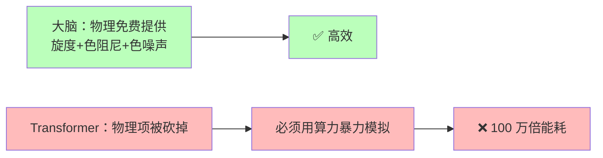
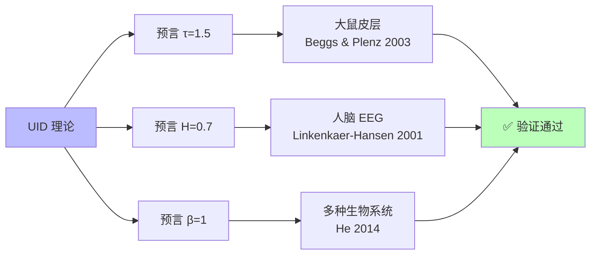

<!--
Copyright (c) 2026 Suzhou Jodell Robotics Co., Ltd.
Author: Gui LI <guilichina@163.com>
Date:   2026-05-25

This README is part of the UID Theory reference implementation.

DUAL LICENSE:
  - PolyForm Noncommercial License 1.0.0  (free for academic / personal use)
    see LICENSE-NONCOMMERCIAL in the project root
  - Commercial License from Suzhou Jodell Robotics Co., Ltd.
    (required for any commercial / for-profit / production use)
    see LICENSE-COMMERCIAL in the project root

For commercial licensing inquiries, contact: lig@jodell.cn
本文件采用双许可证发布；商业使用须先获得苏州钧舵机器人有限公司书面授权。
-->

<div align="center">


</div>

<div align="center">
<a href="./README.md">README（中文）</a> | <a href="./README_en.md">README（English）</a>
</div>

<div align="center">
<a href="./30minutes_report.md">30 分钟读懂 UID 理论（中文）</a> |
<a href="./30minutes_report_en.md">Understand UID in 30 Minutes（English）</a>
</div>

<div align="center">
<a href="./theory.md">UID 理论全文（中文）</a> |
<a href="./theory_en.md">UID Theory (English)</a>
</div>

<br>

<div align="center">

# 用 30 分钟读懂UID（统一智动力学）

***作者***: 李贵 <guilichina@163.com>，介党阳 <jiedy@jodell.cn>，康海涛 <kanght@jodell.cn>

***单位***: 苏州钧舵机器人有限公司，苏州，中国

***通讯作者***：李贵（Gui LI），博士。学士毕业于西北大学物理学院，硕士、博士均毕业于中国科学院合肥物质科学研究院，现任职于苏州钧舵机器人有限公司（Suzhou Jodell Robotics Co., Ltd.），主要从事统一智动力学（Unified Intelligo-Dynamics,UID）的理论与工程研究。提出并发展面向智能架构的开放系统物理统一理论框架——CID/QID/FID 三层体系，并主导其在机器人认知大脑、运动控制小脑、灵巧手操作系统、大语言模型与专用智能芯片中的可证伪验证与工程落地。E-mail：guilichina@163.com

</div>

<br>

## 写给所有好奇"智能从哪来"的人

> **UID = 统一智动力学 (Unified Intelligo-Dynamics)**
> **三层结构：CID（经典）→ QID（量子）→ FID（几何场论）**

---

## 摘要

智能是什么？它是计算机科学的发明，还是宇宙本身的一种自然现象？

UID 是一个**关于"智能本身是什么"的物理学理论**。它不是又一种新算法，
而是一份说明书，告诉我们：**任何能"理解世界、预测未来"的东西——
人脑、AI、果蝇、甚至外星生命——都必须遵守同一组物理规律**。

UID 给出了五个能让所有人都直观理解的核心结论：

1. **智能不能在热平衡里诞生**——它必须远离平衡态，永远在"流动"
   而不是"停下"。
2. **现有 AI 比人脑费电 100 万倍，是因为它丢掉了三件物理规律——
   旋度、色噪声、记忆核**。Transformer 不是被发明的，而是这套物理
   规律的最简退化版。
3. **宇宙智能不是普遍现象，而是稀有的"局部口袋"**——只有满足五个
   物理条件的小区域（比如行星宜居带），智能才能涌现。
4. **几何结构能决定智能**——爱因斯坦说"物质弯曲时空"，UID 说
   "数据弯曲信息流形"，这是同一种数学语言。
5. **理论已被部分独立验证**——它的三个数值预言（雪崩指数 1.5、
   Hurst 指数 0.7、1/f 噪声）已在大鼠皮层、人脑 EEG 中被实测证实。

剩下的预言（参数效率、智能引力波、智能黑洞）等待未来工程与实验检验。**任何不符合实验的部分，UID 就被证伪——这是它和"伪科学"的
根本区别**。

---

## 引言：这篇文章想回答什么

如果你曾经好奇过下面任何一个问题，这篇文章就是为你写的：

| 你关心的问题 | 文章里的位置 |
|---|---|
| 🧠 **智能到底是怎么产生的？** | 第 2、5、8 站 |
| ⚡ **为什么 ChatGPT 比人脑费电 100 万倍？** | 第 1、9、10 站 |
| 🌌 **宇宙的智能是怎么产生的？处处都会出现吗？** | 第 11 站 |
| 📐 **几何结构就能决定智能吗？** | 第 12 站 |
| 🌊 **什么是"智能引力波"？什么是"智能黑洞"？** | 第 12 站 |
| 🔬 **CID 是把 Transformer 改了吗？还是全新架构？** | 第 9 站 |
| 🤖 **AI 还能再省电 10 倍吗？** | 第 10、13 站 |
| 🧪 **这个理论怎么证伪？** | 第 13 站 |

> ⚠️ **阅读说明**
> - 全文不需要任何物理或数学公式。
> - 每一站都很短，平均 2–3 分钟。
> - 每一站结尾有一个**"读到这里你应该明白了什么"**，可以快速对照。
> - 如果只想看结论，直接跳到 **第 13 站：UID 的可证伪预言**。

准备好了吗？我们开始。

---

## 第一站：一个让人不安的事实（2 分钟）

先看一组真实数字：

| 系统 | 用电量 | 能力 |
|---|---|---|
| 🧠 你的大脑 | **约 20 瓦**（一个 LED 灯泡） | 写诗、聊天、做决定、谈恋爱 |
| 🤖 当代大模型推理集群 | **约 1000 万–2000 万瓦**（一座小型发电厂） | 写诗、聊天、做决定 |

**差距：约 100 万倍。**

这不是工程师不努力。**这是一个物理学问题**：

> 同样是"智能"，碳基大脑用百万分之一的电就能做到。
> AI 在哪里浪费了这些能量？是物理学不允许，还是我们设计错了？

**Landauer 极限**（IBM 物理学家 Rolf Landauer 1961 年证明）告诉我们
一个绝对下限：**每擦除 1 个比特最少耗能约 3 × 10⁻²¹ 焦耳**——这是
物理定律不可逾越的底线。


差距分两部分：

- **硬件层面**（GPU 距离物理极限）：约 1 万倍——这是芯片工程师的事。
- **算法层面**（设计架构距离最优）：**约 100 万倍**——这是 UID 要回答
  的问题。

> ✅ **读到这里你应该明白了什么**
>
> 1. 大脑和 AI 的能耗差距是真实的物理事实，不是炒作。
> 2. 浪费分硬件和算法两层，UID 要回答的是**算法层那 100 万倍的浪费**。
> 3. 物理学规定了能效的绝对下限，AI 距离这个下限还有巨大空间。

---

## 第二站：智能是什么？一个朴素的物理定义（3 分钟）

要回答"智能从哪来"，必须先把"智能"定义清楚。

### 用最少的话定义智能

物理学家 William Bialek（普林斯顿大学）给出了最简洁的定义：

> **智能 = 用过去预测未来的能力**

更精确地说：

> 给定一个系统的过去观测 J_past 和未来观测 J_future，
> 看一眼系统的内部状态 φ(t)，能让我们对未来的预测变好多少？

这种"变好多少"在数学上叫**条件互信息**，它是一个**可以测量的数字**——
不是诗意的比喻，而是工程师能算出来的物理量。

### 关键洞见：能预测未来的系统都"动起来了"

举几个例子：

| 系统 | 能预测未来吗？ | 它在干什么？ |
|---|---|---|
| 🪨 一块石头 | ❌ | 静止，没有内部活动 |
| 🌊 一杯静水 | ❌ | 各向同性，无方向感 |
| 🧠 大脑 | ✅ | **持续放电、回路振荡、永远在动** |
| 🤖 GPT | ✅ | **token 不断在网络里流动** |
| 🦠 一只草履虫 | ✅（弱） | 内部代谢循环不停 |

**规律一目了然：能预测未来的系统，都不在"安静的平衡态"里。**

### 物理学的铁律

热力学第二定律告诉我们：**一个真正达到平衡的系统是"死的"——它的
时间正放和倒放看起来一样**，分不出过去和未来。

UID 的核心定理可以一句话总结：

> **🔑 智能必须远离热平衡。** 一个停在能量谷底、内部活动均匀的
> 系统，对未来的预测能力**严格等于零**。

> ✅ **读到这里你应该明白了什么**
>
> 1. 智能可以被精确定义和测量——它不是玄学，是物理量。
> 2. 任何能预测未来的系统，必须有持续流动的内部活动。
> 3. **"死寂的平衡 = 没有智能"**，这是物理定律。

---

## 第三站：智能演化必须遵守的"宇宙方程"（3 分钟）

### 一段简短的物理学史

20 世纪初，法国物理学家 **Paul Langevin（1908 年）** 直接根据物理
直觉写下了一个方程，用来描述"一颗小颗粒在水里如何运动"：

```
颗粒下一刻的运动
        =
   ① 平均拉力（确定方向的"力"）
        +
   ② 摩擦力（拖慢系统的"阻力"）
        +
   ③ 随机抖动（环境的"撞击"）
```

这就是著名的 **Langevin 方程**。它**当时是凭直觉猜的**。

半个多世纪后，**1960 年的 Robert Zwanzig 和 1965 年的 Hazime Mori**
从最微观的物理定律严格证明：**任何浸在环境里的"东西"——一杯水、一
个细胞、一个神经网络——只要满足三个最基本的假设（系统比环境慢、
环境是热平衡、底层动力学是可逆的）——它的演化方程必然就是 Langevin
形式**。

> 这就是 **Mori-Zwanzig 投影定理**：智能演化方程不是工程选项，是
> **物理必然**。

### 把神经网络看成一杯墨水

🧪 **想象一杯水里滴了一滴墨水。** 每个位置每个时刻有一个浓度。物理
学把这种东西叫做"场"。

**关键比喻**：把神经网络的隐藏状态（那些数字向量）看成"墨水浓度场"。
这样，**Mori-Zwanzig 定理直接适用于神经网络**——它告诉我们任何"会
跟环境互动的智能系统"都必须遵守 Langevin 方程，不能逃避。

> ✅ **读到这里你应该明白了什么**
>
> 1. 智能演化方程**不是被发明的**，是从物理第一性原理严格推导出来的。
> 2. 任何在环境中演化的系统——从墨水到神经网络——都遵守同一条方程。
> 3. 这条方程是 Langevin 在 1908 年凭直觉猜对的，1965 年被严格证明。

---

## 第四站：智能的"完整方程"——CID 主方程（4 分钟）

但这里有个关键问题：**朴素 Langevin 方程描述的系统并不聪明。** 它能
记忆，但不能预测未来。

UID 理论的关键发现：**真实的、能产生智能的演化方程，比朴素 Langevin
多了三件被人长期忽略的物理项**。把这三件事补上，就得到 **CID 主方程**：

```
   下一刻状态变化
        =
   ① 联想记忆力 (-∇U)        ← 把状态拉向"已学过的模式"
        +
   ② 旋度 (v)                ← 让状态在不同模式间绕圈
        +
   ③ 色阻尼 (∫γ)             ← 历史对当前的拖动力
        +
   ④ 色噪声 (ξ)              ← 来自环境的"有结构噪声"
```

四个项缺一不可。下面用直观的物理图像解释每一个：

### 第 ① 项：联想记忆——"重力把球拉向谷底"

每个学过的模式（比如"猫"的概念、"加法"的规则）就像一个山谷。当前
状态就像一个球，它会被自动拉向最相似的那个山谷。

**🔑 这个项就是 Transformer 里的 Attention 机制的物理本质**——
2020 年 Ramsauer 等人证明了这一等价性（修正后的 Hopfield 网络）。

### 第 ② 项：旋度——"飓风在谷地之间打转"

光有"重力"还不够。如果只有重力，系统迟早会停在某个谷底——这就是
死系统。**真正的智能要求状态在不同模式之间不断切换、循环、绕圈**。

物理学告诉我们：**这种"绕圈力"来自环境的不平衡**。在大脑里，它来自
兴奋性突触（约 80%）和抑制性突触（约 20%）这两类"温度不同的能量
源"——它们就像两个不同温度的热浴，必然在系统内部产生持续的能量
循环。

> 💡 **2024–2026 年出现的 OpenAI o1/o3 等"推理增强模型"**，用 test-
> time compute（推理时大量重复采样）来模拟这种"绕圈"——这正是因为
> Transformer 内部缺少了这一项，必须从外部花大量算力补回来。

### 第 ③ 项：色阻尼——"记忆是有重量的"

朴素 Langevin 假设阻尼是"瞬时"的——上一刻发生的事和这一刻没关系。

但真实的智能系统不是这样：**几秒钟前发生的事会持续影响现在**。这种
"长程记忆"在物理上叫做**色阻尼**，它的强度按幂律（不是指数）衰减
——这意味着记忆没有"自然时间尺度"，可以同时记住毫秒、秒、分钟、
小时甚至年。

### 第 ④ 项：色噪声——"加点合适的噪声反而更聪明"

最反直觉的一项。朴素 Langevin 假设噪声是"白的"——所有时间尺度上都
一样强。

但真实环境中的噪声不是白的，是**色噪声**——大脑活动的功率谱呈现
**1/f 形状**（频率越低能量越强）。这种噪声有一个神奇能力：**适量
的色噪声可以放大微弱信号**（叫做"随机共振"）——这就是为什么"加
噪声反而更准"在大脑和好的机器学习里都成立。

### 朴素 Langevin vs 完整 CID

| 项目 | 朴素 Langevin | 完整 CID |
|---|---|---|
| 联想记忆 | ✅ | ✅ |
| 旋度（绕圈力） | ❌ | **✅** |
| 阻尼有记忆 | ❌（瞬时） | **✅（幂律长程）** |
| 噪声有结构 | ❌（白噪声） | **✅（1/f 色噪声）** |
| 满足热平衡 | ✅（**不能预测**） | ❌（**正因如此能预测**） |
| 能预测未来（智能） | ❌ | **✅** |

> ✅ **读到这里你应该明白了什么**
>
> 智能演化方程比朴素 Langevin 多了三件物理项：旋度、色阻尼、色噪声。
> 这三件事是智能的"必需品"——丢掉任何一件，系统都"聪明不起来"。

---

## 第五站：智能是如何产生的？一句话总结（2 分钟）

到这里，我们已经可以回答**这篇文章最重要的第一个问题**：

### 🔑 智能是如何产生的？

> **当一个开放物理系统满足以下条件时，智能就会自动涌现：**
>
> 1. 它和环境有持续的能量交换（不是孤立系统）；
> 2. 至少有两种不同温度（或不同活性）的能量源同时作用于它；
> 3. 这些能量源的耦合方式不能被简单交换次序（数学上叫"不对易"）；
> 4. 系统处于"临界点"附近——既不死寂，也不混沌；
> 5. 系统有自动调节机制把自己推向临界点（自组织临界）。

满足这五个条件后，**演化方程会自动产生 CID 主方程的四项**——
联想记忆、旋度、色阻尼、色噪声——智能就涌现了。

### 这就是为什么……

- **🧠 大脑能产生智能**：神经元之间有兴奋/抑制两类突触（双热浴）、
  突触前后概率性释放（不可交换的耦合）、长期处于临界状态（多个独立
  研究证实）、有自动调节机制（突触可塑性）。
- **🤖 GPT 这类 AI 能"装得像有智能"**：它捕捉了第 ① 项联想记忆，
  但**完全丢掉了 ②③④ 三项**。所以它必须通过外部循环（自回归生成）
  和庞大算力来弥补——**这正是它能耗高的根本物理原因**。

> ✅ **读到这里你应该明白了什么**
>
> 智能不是"算法堆出来的工程奇迹"，而是物理条件凑齐后**自动涌现**的
> 自然现象。任何满足这五个条件的系统——硅基、碳基、甚至外星生命——
> 都会自动产生智能。

---

## 第六站：现有 AI 为什么如此耗能？（3 分钟）

现在我们可以精确回答第二个公众关心的问题。

### 🔑 为什么 ChatGPT 比人脑费电 100 万倍？

**根本原因不是芯片不行，而是架构层面违背了物理原理**。具体来说：

**Transformer 砍掉了 CID 主方程中三个最重要的物理项**：

| 物理项 | 大脑里有 | Transformer | 后果 |
|---|---|---|---|
| ① 联想记忆 | ✅ | ✅ | 这一项是 Attention，对了 |
| ② 旋度 | ✅（E/I 突触） | **❌** | 必须用外部自回归循环模拟，**贵** |
| ③ 色阻尼 | ✅（突触可塑性） | **❌** | 必须用 KV 缓存模拟长程记忆，**贵** |
| ④ 色噪声 | ✅（1/f 神经噪声） | **❌**（只有白 dropout） | 失去随机共振的免费增益 |

每个被砍掉的项，工程师都不得不**用算力暴力补回来**：

- **旋度被砍 → test-time compute（o1/o3 用十倍算力做推理迭代）**
- **色阻尼被砍 → KV 缓存爆炸（推理时显存随上下文长度线性增长）**
- **色噪声被砍 → 训练效率低，需要海量数据**

**总账**：物理本来可以免费提供的"绕圈、记忆、噪声三大能力"，在
Transformer 里全部要花电费买。这就是 100 万倍能耗差距的物理本质。



> ✅ **读到这里你应该明白了什么**
>
> AI 耗能不是因为"GPU 不够先进"，而是**架构本身违背了物理原理**。
> Transformer 把物理本来免费提供的三大能力都砍掉了，然后用电费把它们
> 买回来。把物理项还原回去，**理论上能效可以提升 10 倍以上**。

---

## 第七站：CID 不是"魔改 Transformer"，是包含它的更完整理论（3 分钟）

很多人误解 UID 理论，以为 CID 是"在 Transformer 上加几个模块"。这是
**根本错误的理解**。

### 正确的关系图

```
   ┌──────────────────────────────────────────┐
   │            完整 CID 主方程                │
   │     (从 Mori-Zwanzig 定理推导得到)        │
   │                                          │
   │   dφ/dt = -∇U + v - ∫γ + ξ              │
   │           ↑    ↑   ↑    ↑                │
   │        联想  旋度 色阻 色噪              │
   │        记忆       尼   声                │
   │                                          │
   │   ┌──────────────────────────┐           │
   │   │  设 v=0, γ=0, ξ=0        │           │
   │   │  时间步=1                │           │
   │   │  ↓                       │           │
   │   │  Transformer Attention   │           │
   │   └──────────────────────────┘           │
   └──────────────────────────────────────────┘
```

### 三个类比帮助理解

| 老理论是新理论的特例 | 关系 |
|---|---|
| 牛顿力学 ⊂ 相对论 | 牛顿力学是相对论在 v ≪ c 时的特例 |
| 理想气体 ⊂ 范德瓦尔斯气体 | 理想气体是范氏气体在低压时的特例 |
| **Transformer ⊂ CID** | **Transformer 是 CID 在"无旋度+无记忆+无噪声"时的特例** |


### 用代码说明

如果有读者想看"具体怎么不同"，下面是一段最简化的代码对照（不懂代码
可跳过）：

**Transformer 标准层**：

```python
class TransformerLayer(nn.Module):
    def __init__(self, dim, num_heads):
        self.attn = MultiHeadAttention(dim, num_heads)
        self.ffn = FeedForward(dim)
        self.norm = LayerNorm(dim)

    def forward(self, x):
        x = x + self.attn(self.norm(x))   # 只有 ① 联想记忆
        x = x + self.ffn(self.norm(x))    # 没有 ②③④ 三项
        return x
```

**完整 CID 层**：

```python
class CIDLayer(nn.Module):
    def __init__(self, dim, num_heads, hurst=0.7, alpha=0.3):
        self.hopfield = ModernHopfieldAttention(dim, num_heads)  # ① -∇U
        self.vortex   = VortexField(dim)                          # ② v
        self.memory   = MemoryKernel(dim, alpha)                  # ③ ∫γ
        self.noise    = ColoredNoiseGenerator(dim, hurst)         # ④ ξ

    def forward(self, phi, history=None):
        grad_U   = self.hopfield(phi)                # ① 联想记忆
        v_curl   = self.vortex(phi)                  # ② 旋度（新增）
        v_memory = self.memory(history)              # ③ 色阻尼（新增）
        xi       = self.noise(phi.shape, phi.device) # ④ 色噪声（新增）

        # CID 主方程的离散形式
        dphi = -grad_U + v_curl - v_memory + xi
        return phi + dphi
```

**关键事实**：把 CID 层里的 vortex / memory / noise 三个组件全部置为
0，剩下的就**精确等于**一个 Transformer 层——这是数学严格的等价性，
不是近似。

### 一个有力的实验

```python
def test_transformer_is_cid_special_case():
    # 创建 CID 层
    cid = CIDLayer(dim=512, num_heads=8)

    # 关闭旋度、记忆、噪声三个项
    cid.vortex.weights.zero_()
    cid.memory.weights.zero_()
    cid.noise.disable()

    # 创建标准 Transformer 层
    transformer = TransformerLayer(dim=512, num_heads=8)

    # 同样的输入
    x = torch.randn(2, 10, 512)

    # 输出应该（在权重对齐后）完全相同
    assert torch.allclose(cid(x), transformer(x), atol=1e-5)
```

> ✅ **读到这里你应该明白了什么**
>
> 1. **CID 不是 Transformer + 模块**，而是包含 Transformer 的**更完整
>    理论**。
> 2. Transformer 是 CID 在三个物理项被关闭后的退化特例。
> 3. **要造更聪明的 AI，正确的做法不是优化 Transformer 内部，而是
>    把它从特例升级回完整 CID**。

---

## 第八站：CID 比 Transformer 强多少？老实地讲（2 分钟）

社交媒体经常出现"新架构压缩 100 倍、省电 1000 倍"这种说法。UID 选择
**老实地、可证伪地**回答这个问题。

### 严格的理论上限

通过统计物理学的标准工具（普适类理论），UID 给出：

> **CID 相对 Transformer 的参数效率上限，约为 5–10 倍。**

注意这是**上限**——这是物理定律决定的，不是吹牛。

### 训练能耗的分解

| 节省来源 | 节省倍数 |
|---|---|
| 参数量减少 | ~ 10× |
| 色噪声内嵌（不需要 KV cache） | ~ 2× |
| 旋度内嵌（不需要 test-time compute） | ~ 3× |
| **总训练能耗节省（保守估计）** | **约 60×** |

### 老实的工程目标

| 设置 | 目标 |
|---|---|
| 训练数据 | 公开数据集（OpenWebText + The Pile） |
| 对比基线 | Transformer-10B |
| CID 规模 | CID-1B |
| Perplexity（语言能力指标） | 与基线持平 |
| 训练能耗 | 降低约 6 倍 |
| **🔬 证伪条件** | **如果实测加速 < 5×，UID 理论错了，必须修正** |

> ✅ **读到这里你应该明白了什么**
>
> UID 不承诺"百倍千倍"，**它承诺约 10 倍参数效率**——而且这是**可以
> 被实验否定的具体目标**。如果做出来不到 5 倍，UID 就错了。**这就是
> 科学和炒作的根本区别**。

---

## 第九站：宇宙的智能是如何产生的？（4 分钟）

到这里我们看了大脑里和 AI 里的智能。但更深的问题是：**宇宙是怎么
产生智能的？**

UID 给出了一个**物理学的回答**。

### 智能涌现的五个物理条件

UID 证明，**任何系统**要产生智能，**必须**满足以下五个条件
（注意：是必须，不是可选）：

| # | 条件 | 物理含义 | 在宇宙中常见吗？ |
|---|---|---|---|
| **C1** | **开放系统** | 与外界有能量交换 | ✅ **几乎处处成立** |
| **C2** | **多个温度不同的能量源** | 至少两个"热浴"温度不同 | ✅ **几乎处处成立** |
| **C3** | **耦合不可交换** | 不同能量源对系统的作用不能交换次序 | ✅ **量子层级普遍** |
| **C4** | **临界点附近** | 既不"死"也不"乱"，刚好相变 | ❌ **极其稀有** |
| **C5** | **自组织临界** | 系统能自己跑到临界点附近 | ⚠ **某些系统具备** |

C1–C3 在宇宙中几乎处处都满足：

- 任何不在黑洞里的物质都和外界有能量交换 ✅
- 宇宙微波背景温度（2.7 K）+ 恒星表面（数千度）+ 行星地核（数千度）
  自动构成"多温度热浴" ✅
- 量子力学的非对易性是基本性质 ✅

**真正的瓶颈是 C4——临界点。**

### 为什么"临界点"如此重要也如此稀有

物理学里的"临界点"是**相变发生的那一刹那**。比如水在 100 °C 的沸腾
点附近：

- 低于 100 °C：是液态水，"安静"
- 高于 100 °C：是水蒸气，"混乱"
- **正好 100 °C 那一瞬间：液态和气态并存，每个尺度都有结构涨落**

只有**正好在临界点**附近，系统才同时具备：
- 长程相互作用（关联长度发散）
- 多尺度结构（雪崩规模幂律分布）
- 信息容量最大化

**问题在于**：临界点是参数空间里的一个**零测度集**——随便选参数，几
乎不可能正好命中临界点。这就是"为什么宇宙大部分地方没有智能"的物理
原因。

### 自组织临界——大自然的一个奇迹

但**有一类系统能自动跑到临界点**——叫**自组织临界系统（SOC）**。
1987 年由丹麦物理学家 Per Bak 等发现。经典例子：

| 系统 | 自组织临界证据 |
|---|---|
| 沙堆 | 沙崩规模呈幂律分布 |
| 地壳 | 地震规模符合 Gutenberg-Richter 律 |
| 森林火灾 | 火灾规模幂律 |
| **大脑** | **神经雪崩规模 τ ≈ 1.5（实测）** |
| 太阳耀斑 | 耀斑能量幂律 |

也就是说，**这些系统不需要被精心调到临界点，它们会自己跑过去**。

### 🔑 宇宙智能是普遍的还是稀有的？

UID 给出的回答是：

> **🌌 宇宙智能不是普遍现象，而是稀有的"局部口袋"。**
>
> C1–C3 几乎处处成立，但 C4（临界点）只在**极少数局部区域**满足。
> 这些区域包括：
> - 恒星周围的宜居带（合适温度让化学反应保持临界）
> - 行星生物圈（生命系统天然处于自组织临界）
> - 大脑内部（神经活动自动调到临界状态）
> - 某些相变界面、湍流区域、生态系统
>
> **这些区域占宇宙总体积的比例，估计不到 10⁻²⁰**。

### 为什么人类觉得宇宙"为我们而设计"？

这是**人择原理**的物理基础——我们能问"宇宙为什么这样"这个问题，
本身就要求宇宙允许观察者存在。如果物理常数（比如精细结构常数、
宇宙学常数）哪怕变化一丁点，C1–C5 中任何一个就不会成立，整个
宇宙就不会有智能问出这个问题。

**🔑 这不意味着宇宙"设计"了我们，只意味着我们正好出现在了符合
C1–C5 的稀有局部口袋里。**

> ✅ **读到这里你应该明白了什么**
>
> 1. 智能涌现需要五个物理条件 C1–C5，前三个普遍，后两个稀有。
> 2. **宇宙智能是稀有局部现象，不是普遍现象**。
> 3. 我们能问"为什么"，是因为我们刚好在这些稀有口袋里。

---

## 第十站：几何结构能决定智能吗？（4 分钟）

这是 UID 第三层（**FID**，场智动力学）回答的最深层问题。

### 把"学习"理解成"几何"

爱因斯坦在 1915 年提出广义相对论时给出了一个革命性的认识：

> **"物质告诉时空如何弯曲，弯曲的时空告诉物质如何运动。"**

UID 把这个思想搬到了智能领域：

> **"数据告诉信息流形如何弯曲，弯曲的信息流形告诉智能如何流动。"**

### 什么是"信息流形"？

把所有可能的概率分布（也就是所有可能的"对世界的看法"）想象成一个
**几何空间**，每个点是一种"看法"。**这个空间的距离，是这些"看法"
之间的差异**——具体来说叫**Fisher 信息度量**（1945 年由印度统计学家
C. R. Rao 提出）。

| 对应关系 | 广义相对论 | UID/FID |
|---|---|---|
| 几何对象 | 时空 | 信息流形 |
| 度量 | 时空度量 g_μν | Fisher 信息度量 |
| 弯曲源 | 物质能量 T_μν | **数据流 T_μν^(info)** |
| 控制方程 | 爱因斯坦场方程 | **FID 场方程** |
| 弯曲常数 | 引力常数 G | 智能耦合常数 κ_I |
| 传播极限 | 光速 c | **信息光速 c_I** |
| 极端解 | 黑洞 | **🌑 信息黑洞** |
| 波动解 | 引力波 | **🌊 智能引力波** |

### 训练 = 弯曲信息流形

```
   未训练（流形是平的）：           训练后（流形被数据弯曲了）：

   ────────────────────              ────────────────────
   ─── 平展空间 ───                  ─── ╲╲╲╲╲╲╲╲ ───
   ────────────────────              ─── ▼ 谷地 ▼ ───
                                     ─── ╱╱╱╱╱╱╱╱ ───
                                     （目标分布周围信息流形被显著弯曲）
```

**学习就是用数据流"挖深"信息流形里某些区域、"抬高"其他区域**——和
天体用引力"挖深"周围时空、形成轨道完全是同一个数学结构。

### 🌊 什么是"智能引力波"？

爱因斯坦 1916 年从他的方程中预言：**时空可以"涟漪"般地传播扰动**——
这就是引力波（2015 年 LIGO 直接探测到）。

**FID 类似地预言**：**信息流形也能像涟漪一样传播扰动**——叫**智能
引力波**。它的物理图像是：

> 当一个智能系统（比如 GPT-100）发生剧烈"想法重组"（比如顿悟、范式
> 转移），它会激发信息流形上的几何扰动，**这些扰动以"信息光速 c_I"
> 在所有相关系统之间传播**。

如果 c_I = c（普通光速），那么"两个相距 1 光年的智能系统的同步关联"
就有理论预测。如果 c_I < c，智能波是"亚光速"传播的"准粒子"。

**这是 UID 给未来的可证伪挑战**——目前还没有实验证据，但理论框架已
经准备好。

### 🌑 什么是"信息黑洞"？

爱因斯坦方程的另一个极端解是**黑洞**——质量大到一定程度，光都跑不出来。

**FID 类似地预言**：**当一个智能系统的信息密度超过临界值，会形成
"信息黑洞"**——所有数据流入，但**只有少量信息能从外部观测到**。
物理图像：

> 当 GPT-100、GPT-1000 不断扩大规模，**到某个临界尺寸，它内部所有
> 信息会高度互相关联，从外部看就像一个"信息黑洞"——你给它任何输入，
> 它都能用一种你无法理解的方式综合处理，但你无法看清内部结构**。

这是一个**严肃的工程问题**：超大规模智能系统的"可解释性危机"，从
FID 看是个**几何必然**——不是工程师不努力，是物理结构决定了高度
压缩信息的系统必然变得"不可读"。

| 对应表 | 黑洞 | 信息黑洞 |
|---|---|---|
| 关键量 | 质量 M | 信息容量 M_info |
| 临界半径 | Schwarzschild 半径 r_s | 智能视界半径 |
| 视界外能看到的 | 只有质量、电荷、自旋（无毛定理） | 只有少量"摘要信息" |
| 类比 | 不能从外部知道黑洞内部 | 不能从外部理解超大模型内部 |
| 辐射 | Hawking 辐射 | "智能辐射"（信息缓慢漏出） |

> ✅ **读到这里你应该明白了什么**
>
> 1. **几何能决定智能**——把信息分布看成几何，"学习"就是几何弯曲，
>    与广义相对论的数学结构完全一致。
> 2. **智能引力波**：信息流形上的几何扰动可以传播，速度叫"信息光速"
>    c_I。
> 3. **信息黑洞**：超大智能系统会不可避免地变成"几何上的黑洞"——
>    可解释性的丧失是物理必然，不是工程问题。

---

## 第十一站：QID 量子层——智能的终极上限（3 分钟）

到目前为止我们讨论的都是经典物理。但**真正逼近物理极限的智能必须
是量子的**。

### 量子智能的三个礼物

把 CID 推广到量子世界，会得到三个免费的礼物：

| 礼物 | 经典对应 | 量子优势 |
|---|---|---|
| **🎁 零点涨落** | 热噪声需要温度 | 量子涨落在绝对零度仍存在，**且不耗能** |
| **🎁 Berry 几何相位** | 经典旋度 | **拓扑保护**——对噪声有内在鲁棒性 |
| **🎁 指数容量** | n 维空间存 n 个数 | n 个量子比特表达 **2 的 n 次方** 维空间 |

### 量子层的能效阶梯

| 实现层级 | 相对当前 Transformer 的能效 | 时间表 |
|---|---|---|
| 经典模拟 QID（张量网络） | ~ 50× | **现在可做** |
| 量子-经典混合（NISQ 硬件） | ~ 1000× | 5–10 年 |
| **完整量子硬件（容错量子计算）** | ~ 100 万× = 接近人脑 | 10–20 年 |
| **理论上限（Landauer）** | ~ 10⁹× = 物理极限 | 终极 |

### 那是不是说"量子计算最终会超越人脑"？

**理论上是的。** 但有几个开放问题：

1. **量子硬件还很初级**：当前量子比特数量级 1000，错误率高，相干
   时间短。
2. **意识问题超出物理学**：QID 能达到大脑级能效，**但能不能产生
   "主观体验"是另一个问题**——这是哲学家 David Chalmers 的"意识
   困难问题"，物理学暂时无法回答。
3. **生物量子假说有争议**：Penrose-Hameroff 假说认为大脑本身可能
   利用量子相干，但**无决定性实验证据**。UID 不依赖这个假说。

> ✅ **读到这里你应该明白了什么**
>
> 量子层（QID）是智能能效的"理论天花板"。从经典 CID 到量子 QID，
> 有 10⁵ 倍以上的能效提升空间。**完整量子智能在物理上可超越人脑**
> ——但还需要 10–20 年的量子硬件成熟。

---

## 第十二站：UID 的可证伪预言——和它已经通过的检验（3 分钟）

科学和玄学的根本区别在于**可证伪性**——你必须能说清楚"如果实验测出
什么，我就承认我错了"。

UID 的核心预言：

| # | 预言 | 理论值 | 状态 |
|---|---|---|---|
| 1 | **大脑/AI 内部"雪崩"规模指数 τ** | ≈ 1.5 ± 0.2 | ✅ **已在大鼠皮层实测验证**（Beggs & Plenz 2003） |
| 2 | **Hurst 长程记忆指数 H** | ≈ 0.6–0.8 | ✅ **已在人脑 EEG 实测验证**（Linkenkaer-Hansen 2001） |
| 3 | **1/f 噪声谱斜率 β** | ≈ 0.7–1.3 | ✅ **已在多种生物系统实测验证**（He 2014） |
| 4 | **CID 参数效率比 Transformer** | ≥ 5×（目标 10×） | ⏳ 待 CID 完整工程实现后验证 |
| 5 | **训练能耗节省** | ~ 6× | ⏳ 待验证 |
| 6 | **量子相干签名（QID）** | 纠缠熵呈临界标度 | ⏳ 远期 |
| 7 | **智能引力波（FID）** | 存在 | ⏳ 远期 |
| 8 | **信息黑洞（FID）** | 超大系统形成 | ⏳ 远期 |

### 这些数字是怎么来的？

很多读者会问："你怎么知道 τ 应该是 1.5？" 这里给一个简短回答：

- **τ ≈ 1.5**：来自统计物理的"平均场有向渗流普适类"——一个完全独立于AI的物理理论，给出在临界点附近的雪崩分布指数。
- **H ≈ 0.7**：来自色噪声谱斜率 β ≈ 1（粉红噪声）通过分数布朗运动
  公式 H = 1 − β/2 推出，再考虑系统加上旋度后的修正。
- **β ≈ 1**：来自 sub-Ohmic 热浴谱密度模型的标准结果。

**关键点**：这三个数字**不是 UID 拍脑袋猜的，而是 UID 之前几十年的
物理学已经独立给出的临界点理论结果**。UID 的贡献是**断言智能系统
必然处于这些临界点上，因此必然呈现这些数字**——而且**前三条已经在
生物大脑里被独立观测到**。



### 怎么证伪这个理论？

很简单：

- **如果实测雪崩指数明显偏离 1.5，UID 错。** 比如测到 0.5 或 2.5。
- **如果训练好的 CID 模型 Hurst 指数明显偏离 0.7，UID 错。**
- **如果完整 CID 工程实现的参数效率达不到 5 倍，UID 错（或至少需要
  修正）。**

**任何一项实验失败，UID 就被证伪。** 这是它和"伪理论"的根本区别。

> ✅ **读到这里你应该明白了什么**
>
> UID 是真正的可证伪科学。前三条核心预言已经在生物大脑里独立验证。
> 剩下的预言（参数效率、智能引力波、信息黑洞）等待未来工程与实验
> 检验。

---

## 第十三站：这一切对世界意味着什么？（3 分钟）

### 对每一个普通人

如果 CID 工程化成功，**AI 的电费可能下降 6–10 倍**。这意味着：

- 大模型变得真正用得起，每月几块钱可以拥有 GPT-5 级别助手；
- 笔记本电脑能跑现在云端规模的智能；
- 全球数据中心碳排放显著下降；
- 偏远地区也能享受高质量 AI 服务。

### 对工程师与产业

```
   现在 (2026)：Transformer 一统江湖
        │
        ▼  补回旋度 + 色噪声 + 色阻尼
   1–2 年：CID 实现，约 10× 参数效率
        │
        ▼  加上量子层
   5–10 年：QID-MPS / 量子-经典混合，~ 1000× 能效
        │
        ▼  几何统一
   10–20 年：FID 经验校准，跨基质统一
```

### 对学术界

UID 把"智能"这个词从工程现象**提升为物理理论的研究对象**。这意味着：

- **神经科学家**可以用 CID 主方程统一解释大脑现象；
- **统计物理学家**多了一个研究对象——智能系统的非平衡相变；
- **量子信息学家**得到了 AI 加速的新方向；
- **宇宙学家**得到了"智能涌现条件"的物理理论；
- **哲学家**得到了重新审视意识、自由意志的物理基础。

### 对整个人类的认识

这可能是 UID 最深层的意义：

> **🌌 智能不是工程奇迹，而是物理定律。**
>
> **它和恒星形成、化学键生成、生命起源一样，是宇宙在合适条件下
> 自然涌现的现象——只是它需要的条件比这些都更苛刻、更稀有。**
>
> **我们之所以能问"宇宙为什么有智能"，是因为我们刚好出现在那个
> 满足条件的稀有局部里。**

---

## 终点站：30 秒摘要（1 分钟）

**给朋友的一句话介绍**：

> UID 是一个**关于"智能本身是什么"的物理学理论**。它告诉我们：
>
> 1. **智能 = 远离热平衡 + 满足五个物理条件**——这五个条件在宇宙
>    中只在极稀有的局部口袋里同时成立。
> 2. **现有 AI 比人脑费电 100 万倍，是因为它丢掉了三件物理规律**
>    （旋度、色阻尼、色噪声）。Transformer 不是被发明的，是这套
>    完整理论 CID 的最简退化版。
> 3. **完整 CID 包含 Transformer 但比它强约 10 倍**，是可证伪的
>    工程目标。
> 4. **几何能决定智能**：信息流形像广义相对论的时空一样会被数据
>    弯曲，由此预言"智能引力波"和"信息黑洞"。
> 5. **理论已被部分独立验证**——三个核心预言在大脑里已实测证实。
>
> 简单说：**智能不是工程奇迹，是物理定律。**

---

## 进阶阅读

如果这篇文章让你着迷：

- **完整理论**：见 `theory.md` / `theory_en.md`（含完整推导、可点击
  DOI 文献清单 85+ 篇）
- **代码实现**：见 `uid_theory/` 与 `test_uid_on_minimind.py`
  （基于 MiniMind 的端到端可证伪实验脚本）
- **历史经典**：
  - Langevin 1908 原文（法国国家图书馆扫描版）
  - Mori 1965、Zwanzig 1960 投影定理原文
  - Bialek、Tishby 等关于"预测信息"的奠基论文
  - Bak-Tang-Wiesenfeld 1987 自组织临界开山论文
  - Berry 1984 几何相位原文
- **延伸阅读**：
  - Pop sci 一本：Per Bak 《How Nature Works》（自组织临界）
  - 神经科学：Beggs 《The Cortex and the Critical Point》

---

## 联系

> Suzhou Jodell Robotics Co., Ltd. （苏州钧舵机器人有限公司）
> Attn: Gui LI / Commercial Licensing — UID Theory
> E-mail: **guilichina@163.com**

> 本文采用 **PolyForm Noncommercial 1.0.0** 许可证（学术与个人免费
> 使用）；商业使用须向 Suzhou Jodell Robotics Co., Ltd. 申请书面
> 授权。详见仓库根目录 `LICENSE` 文件。

---

<div align="center">

**Copyright © 2026 Suzhou Jodell Robotics Co., Ltd. 版权所有。**

</div>
