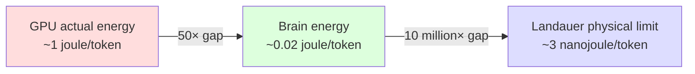
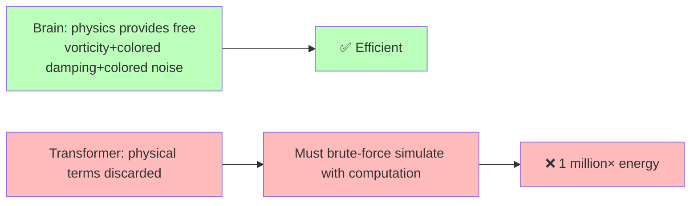
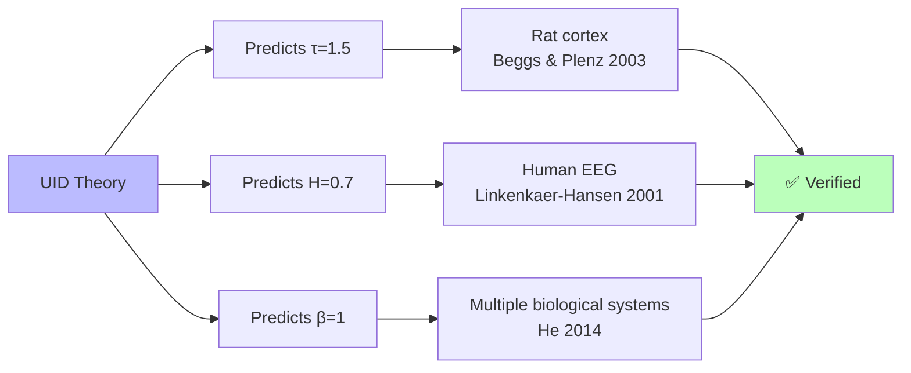

<!--
Copyright (c) 2026 Suzhou Jodell Robotics Co., Ltd.
Author: Gui LI <guilichina@163.com>
Date:   2026-05-25

This README is part of the UID Theory reference implementation.

DUAL LICENSE:
  - PolyForm Noncommercial License 1.0.0  (free for academic / personal use)
    see LICENSE-NONCOMMERCIAL in the project root
  - Commercial License from Suzhou Jodell Robotics Co., Ltd.
    (required for any commercial / for-profit / production use)
    see LICENSE-COMMERCIAL in the project root

For commercial licensing inquiries, contact: lig@jodell.cn
本文件采用双许可证发布；商业使用须先获得苏州钧舵机器人有限公司书面授权。
-->

<div align="center">


</div>

<div align="center">
<a href="./README.md">README（中文）</a> | <a href="./README_en.md">README（English）</a>
</div>

<div align="center">
<a href="./30minutes_report.md">30 分钟读懂 UID 理论（中文）</a> |
<a href="./30minutes_report_en.md">Understand UID in 30 Minutes（English）</a>
</div>

<div align="center">
<a href="./theory.md">UID 理论全文（中文）</a> |
<a href="./theory_en.md">UID Theory (English)</a>
</div>

<br>


<div align="center">

# Understanding UID (Unified Intelligo-Dynamics) in 30 Minutes

***Authors***: Gui LI <guilichina@163.com>, Dangyang JIE <jiedy@jodell.cn>, Haitao KANG <kanght@jodell.cn>

***Affiliation***: Suzhou Jodell Robotics Co., Ltd., Suzhou, China

***Corresponding author***: **Gui LI**, Ph.D. He received his B.Sc. in Physics from Northwest University of China, and his M.Sc. and Ph.D. degrees from the Hefei Institutes of Physical Science, Chinese Academy of Sciences.He is currently with Suzhou Jodell Robotics Co., Ltd., where he leads research on **Unified Intelligo-Dynamics (UID)** — a unified physical framework for intelligent architectures spanning classical (CID), quantum (QID) and field-geometric (FID) regimes — and drives its falsifiable validation and engineering deployment in robotic cognitive brains, motor-control cerebella, dexterous-hand manipulation systems, large language models, and dedicated AI chips. E-mail: guilichina@163.com

</div>

<br>

## A Physics Theory of Intelligence for Everyone

> **UID = Unified Intelligo-Dynamics**
> **Three-layer structure: CID (Classical) → QID (Quantum) → FID (Geometric Field Theory)**

---

## Abstract

What is intelligence? Is it a computer science invention, or a natural phenomenon of the universe itself?

UID is a **physics theory about "what intelligence fundamentally is"**. It's not yet another new algorithm, but rather an instruction manual telling us: **any entity capable of "understanding the world and predicting the future"—human brains, AI, fruit flies, even extraterrestrial life—must obey the same set of physical laws**.

UID delivers five core conclusions that anyone can intuitively grasp:

1. **Intelligence cannot emerge in thermal equilibrium**—it must stay far from equilibrium, perpetually "flowing" rather than "stopping".
2. **Current AI consumes 1 million times more energy than human brains because it discards three physical laws—vorticity, colored noise, and memory kernels**. Transformer wasn't invented; it's the most simplified degenerate version of these physical laws.
3. **Cosmic intelligence is not universal but a rare "local pocket"**—only small regions satisfying five physical conditions (like planetary habitable zones) can give rise to intelligence.
4. **Geometric structure can determine intelligence**—Einstein said "matter curves spacetime"; UID says "data curves information manifolds"—same mathematical language.
5. **The theory has been partially independently verified**—three of its numerical predictions (avalanche exponent 1.5, Hurst exponent 0.7, 1/f noise) have been experimentally confirmed in rat cortex and human EEG.

The remaining predictions (parameter efficiency, intelligent gravitational waves, information black holes) await future engineering and experimental validation. **Any part that fails experimental tests falsifies UID—this is the fundamental difference between science and pseudoscience**.

---

## Introduction: What This Article Answers

If you've ever been curious about any of these questions, this article is written for you:

| Your Question | Where to Find It |
|---|---|
| 🧠 **How does intelligence actually emerge?** | Stations 2, 5, 8 |
| ⚡ **Why does ChatGPT consume 1 million times more energy than human brains?** | Stations 1, 6, 8 |
| 🌌 **How does cosmic intelligence emerge? Does it appear everywhere?** | Station 9 |
| 📐 **Can geometric structure determine intelligence?** | Station 10 |
| 🌊 **What are "intelligent gravitational waves"? What are "information black holes"?** | Station 10 |
| 🔬 **Is CID a modification of Transformer or a completely new architecture?** | Station 7 |
| 🤖 **Can AI become 10× more energy-efficient?** | Stations 8, 11 |
| 🧪 **How can this theory be falsified?** | Station 11 |

> ⚠️ **Reading Guide**
> - No physics or math formulas required throughout.
> - Each station is short, averaging 2–3 minutes.
> - Each station ends with **"What you should understand by now"** for quick reference.
> - If you only want conclusions, jump directly to **Station 11: UID's Falsifiable Predictions**.

Ready? Let's begin.

---

## Station 1: An Unsettling Fact (2 minutes)

First, look at these real numbers:

| System | Power Consumption | Capability |
|---|---|---|
| 🧠 Your brain | **~20 watts** (one LED bulb) | Write poetry, chat, make decisions, fall in love |
| 🤖 Modern large model inference cluster | **~10–20 million watts** (a small power plant) | Write poetry, chat, make decisions |

**Gap: approximately 1 million times.**

This isn't because engineers aren't trying hard enough. **This is a physics problem**:

> Both are "intelligent", yet carbon-based brains achieve it with one-millionth the energy.
> Where is AI wasting all this energy? Is physics forbidding it, or did we design it wrong?

The **Landauer limit** (proven by IBM physicist Rolf Landauer in 1961) tells us an absolute lower bound: **erasing 1 bit requires at minimum ~3 × 10⁻²¹ joules**—a floor that physical law cannot breach.



The gap splits into two parts:

- **Hardware level** (GPU vs. physical limit): ~10,000× — that's chip engineers' domain.
- **Algorithm level** (design architecture vs. optimal): **~1 million×** — this is what UID addresses.

> ✅ **What you should understand by now**
>
> 1. The energy gap between brains and AI is a real physical fact, not hype.
> 2. Waste splits into hardware and algorithm layers; UID addresses **the algorithm layer's 1 million× waste**.
> 3. Physics sets an absolute efficiency floor; AI has enormous room before reaching it.

---

## Station 2: What Is Intelligence? A Simple Physical Definition (3 minutes)

To answer "where does intelligence come from", we must first define "intelligence" clearly.

### Defining intelligence in the fewest words

Physicist William Bialek (Princeton University) gave the most concise definition:

> **Intelligence = the ability to predict the future using the past**

More precisely:

> Given a system's past observations J_past and future observations J_future,
> how much better can we predict the future by looking at the system's internal state φ(t)?

This "how much better" is mathematically called **conditional mutual information**—it's a **measurable number**, not a poetic metaphor, but a physical quantity engineers can compute.

### Key insight: systems that predict the future are "in motion"

A few examples:

| System | Can predict future? | What's it doing? |
|---|---|---|
| 🪨 A rock | ❌ | Static, no internal activity |
| 🌊 A cup of still water | ❌ | Isotropic, no directional sense |
| 🧠 Brain | ✅ | **Continuously firing, circuit oscillating, always moving** |
| 🤖 GPT | ✅ | **Tokens constantly flowing through network** |
| 🦠 A paramecium | ✅ (weak) | Internal metabolism cycling non-stop |

**The pattern is clear: systems that predict the future are never in "quiet equilibrium".**

### Physics' iron law

The second law of thermodynamics tells us: **a system truly at equilibrium is "dead"—its time-forward and time-reversed evolutions look identical**, indistinguishable between past and future.

UID's core theorem can be summarized in one sentence:

> **🔑 Intelligence must be far from thermal equilibrium.** A system resting at an energy valley bottom with uniform internal activity has **strictly zero** predictive power about the future.

> ✅ **What you should understand by now**
>
> 1. Intelligence can be precisely defined and measured—it's not mysticism, it's a physical quantity.
> 2. Any system that predicts the future must have continuously flowing internal activity.
> 3. **"Dead equilibrium = no intelligence"** is a physical law.

---

## Station 3: The "Universal Equation" Intelligence Evolution Must Obey (3 minutes)

### A brief physics history

In the early 20th century, French physicist **Paul Langevin (1908)** directly wrote down an equation based on physical intuition to describe "how a small particle moves in water":

```
Particle's next-moment motion
        =
   ① Average force (deterministic "pull")
        +
   ② Friction (drag slowing the system)
        +
   ③ Random jitter (environment's "collisions")
```

This is the famous **Langevin equation**. **It was guessed by intuition at the time.**

More than half a century later, **Robert Zwanzig in 1960 and Hazime Mori in 1965** rigorously proved from the most microscopic physical laws: **any "thing" immersed in an environment—a cup of water, a cell, a neural network—as long as it satisfies three basic assumptions (system slower than environment, environment in thermal equilibrium, underlying dynamics reversible)—its evolution equation must necessarily take the Langevin form**.

> This is the **Mori-Zwanzig projection theorem**: the intelligence evolution equation is not an engineering choice but **physical necessity**.

### Viewing neural networks as a cup of ink

🧪 **Imagine a drop of ink in a cup of water.** Each position at each moment has a concentration. Physicists call this a "field".

**Key analogy**: View a neural network's hidden states (those numerical vectors) as an "ink concentration field". This way, **the Mori-Zwanzig theorem directly applies to neural networks**—it tells us any "intelligent system interacting with an environment" must obey the Langevin equation, no escape.

> ✅ **What you should understand by now**
>
> 1. The intelligence evolution equation **wasn't invented**; it's rigorously derived from first-principles physics.
> 2. Any system evolving in an environment—from ink to neural networks—obeys the same equation.
> 3. This equation was intuitively guessed correctly by Langevin in 1908, rigorously proven in 1965.

---

## Station 4: The "Complete Equation" of Intelligence—CID Master Equation (4 minutes)

But here's a key problem: **the naive Langevin equation describes systems that aren't intelligent.** They can memorize but cannot predict the future.

UID theory's key discovery: **the real evolution equation that produces intelligence has three physical terms long ignored by people, beyond the naive Langevin**. Adding these three back gives the **CID master equation**:

```
   Next-moment state change
        =
   ① Associative memory force (-∇U)    ← Pulls state toward "learned patterns"
        +
   ② Vorticity (v)                     ← Makes state circulate between patterns
        +
   ③ Colored damping (∫γ)              ← History's drag on current state
        +
   ④ Colored noise (ξ)                 ← "Structured noise" from environment
```

All four terms are indispensable. Below we explain each with intuitive physical pictures:

### Term ①: Associative memory—"gravity pulls ball toward valley"

Each learned pattern (like the concept of "cat", the rule of "addition") is like a valley. The current state is like a ball automatically pulled toward the most similar valley.

**🔑 This term is the physical essence of Transformer's Attention mechanism**—proven equivalent by Ramsauer et al. in 2020 (modern Hopfield networks).

### Term ②: Vorticity—"hurricane circulating between valleys"

"Gravity" alone isn't enough. With only gravity, the system eventually stops at some valley bottom—that's a dead system. **True intelligence requires states to continuously switch, cycle, and circulate between different patterns**.

Physics tells us: **this "circulating force" comes from environmental imbalance**. In brains, it comes from excitatory synapses (~80%) and inhibitory synapses (~20%)—two classes of "energy sources at different temperatures"—like two heat baths at different temperatures, necessarily producing continuous energy circulation within the system.

> 💡 **OpenAI's o1/o3 "reasoning-enhanced models" emerging in 2024–2026** use test-time compute (massive repeated sampling during inference) to simulate this "circulation"—precisely because Transformer internally lacks this term and must compensate with massive external computation.

### Term ③: Colored damping—"memory has weight"

Naive Langevin assumes damping is "instantaneous"—what happened last moment has no relation to this moment.

But real intelligent systems aren't like this: **events from seconds ago continuously affect now**. This "long-range memory" is physically called **colored damping**, whose strength decays by power law (not exponential)—meaning memory has no "natural timescale", simultaneously remembering milliseconds, seconds, minutes, hours, even years.

### Term ④: Colored noise—"adding appropriate noise makes you smarter"

The most counterintuitive term. Naive Langevin assumes noise is "white"—equally strong across all timescales.

But real environmental noise isn't white; it's **colored noise**—brain activity's power spectrum exhibits a **1/f shape** (lower frequencies have stronger energy). This noise has a magical ability: **appropriate colored noise can amplify weak signals** (called "stochastic resonance")—this is why "adding noise improves accuracy" holds in both brains and good machine learning.

### Naive Langevin vs. Complete CID

| Item | Naive Langevin | Complete CID |
|---|---|---|
| Associative memory | ✅ | ✅ |
| Vorticity (circulating force) | ❌ | **✅** |
| Damping has memory | ❌ (instantaneous) | **✅ (power-law long-range)** |
| Noise has structure | ❌ (white noise) | **✅ (1/f colored noise)** |
| Satisfies thermal equilibrium | ✅ (**cannot predict**) | ❌ (**precisely why it can predict**) |
| Can predict future (intelligent) | ❌ | **✅** |

> ✅ **What you should understand by now**
>
> The intelligence evolution equation has three more physical terms than naive Langevin: vorticity, colored damping, colored noise. These three are intelligence's "necessities"—discard any one, the system "can't get smart".

---

## Station 5: How Does Intelligence Emerge? One-Sentence Summary (2 minutes)

By now, we can answer **this article's most important first question**:

### 🔑 How does intelligence emerge?

> **When an open physical system satisfies the following conditions, intelligence automatically emerges:**
>
> 1. It has continuous energy exchange with the environment (not an isolated system);
> 2. At least two energy sources at different temperatures (or different activities) act on it simultaneously;
> 3. These energy sources' coupling methods cannot be simply swapped in order (mathematically "non-commutative");
> 4. The system is near a "critical point"—neither dead nor chaotic;
> 5. The system has self-regulating mechanisms pushing itself toward the critical point (self-organized criticality).

After satisfying these five conditions, **the evolution equation automatically produces the CID master equation's four terms**—associative memory, vorticity, colored damping, colored noise—and intelligence emerges.

### This is why...

- **🧠 Brains can produce intelligence**: Neurons have excitatory/inhibitory synapse classes (dual heat baths), pre/post-synaptic probabilistic release (non-commutative coupling), long-term critical state (confirmed by multiple independent studies), automatic regulation mechanisms (synaptic plasticity).
- **🤖 GPT-class AI can "pretend to be intelligent"**: It captures term ① associative memory but **completely discards terms ②③④**. So it must compensate through external loops (autoregressive generation) and massive computation—**this is the fundamental physical reason for its high energy consumption**.

> ✅ **What you should understand by now**
>
> Intelligence isn't an "engineering miracle piled up by algorithms" but a natural phenomenon that **automatically emerges** when physical conditions align. Any system satisfying these five conditions—silicon-based, carbon-based, even extraterrestrial life—will automatically produce intelligence.

---

## Station 6: Why Is Current AI So Energy-Hungry? (3 minutes)

Now we can precisely answer the second question the public cares about.

### 🔑 Why does ChatGPT consume 1 million times more energy than human brains?

**The root cause isn't chip inadequacy but architecture-level violation of physical principles**. Specifically:

**Transformer discards three most important physical terms from the CID master equation**:

| Physical term | Brain has it | Transformer | Consequence |
|---|---|---|---|
| ① Associative memory | ✅ | ✅ | This term is Attention, correct |
| ② Vorticity | ✅ (E/I synapses) | **❌** | Must simulate with external autoregressive loop, **expensive** |
| ③ Colored damping | ✅ (synaptic plasticity) | **❌** | Must simulate long-range memory with KV cache, **expensive** |
| ④ Colored noise | ✅ (1/f neural noise) | **❌** (only white dropout) | Loses stochastic resonance's free gain |

For each discarded term, engineers must **brute-force compensate with computation**:

- **Vorticity discarded → test-time compute (o1/o3 use 10× computation for inference iteration)**
- **Colored damping discarded → KV cache explosion (inference memory grows linearly with context length)**
- **Colored noise discarded → low training efficiency, requires massive data**

**Total bill**: The "circulation, memory, noise three capabilities" physics could provide for free all cost electricity in Transformer. This is the physical essence of the 1 million× energy gap.



> ✅ **What you should understand by now**
>
> AI's energy consumption isn't because "GPUs aren't advanced enough" but **the architecture itself violates physical principles**. Transformer discarded all three capabilities physics provides for free, then buys them back with electricity. Restoring the physical terms, **theoretically efficiency can improve 10× or more**.

---

## Station 7: CID Isn't "Hacking Transformer", It's a More Complete Theory Containing It (3 minutes)

Many people misunderstand UID theory, thinking CID is "adding a few modules to Transformer". This is **fundamentally wrong**.

### The correct relationship diagram

```
   ┌──────────────────────────────────────────┐
   │         Complete CID Master Equation      │
   │   (Derived from Mori-Zwanzig theorem)     │
   │                                           │
   │   dφ/dt = -∇U + v - ∫γ + ξ               │
   │           ↑    ↑   ↑    ↑                 │
   │        Assoc Vort Col  Col                │
   │        Mem   icity Damp Noise             │
   │                                           │
   │   ┌──────────────────────────┐            │
   │   │  Set v=0, γ=0, ξ=0       │            │
   │   │  Time step=1             │            │
   │   │  ↓                       │            │
   │   │  Transformer Attention   │            │
   │   └──────────────────────────┘            │
   └──────────────────────────────────────────┘
```

### Three analogies to aid understanding

| Old theory is special case of new theory | Relationship |
|---|---|
| Newtonian mechanics ⊂ Relativity | Newtonian is relativity's special case when v ≪ c |
| Ideal gas ⊂ Van der Waals gas | Ideal gas is Van der Waals' special case at low pressure |
| **Transformer ⊂ CID** | **Transformer is CID's special case with "no vorticity+no memory+no noise"** |

### Illustrated with code

If readers want to see "specifically how they differ", here's a minimally simplified code comparison (skip if you don't code):

**Standard Transformer layer**:

```python
class TransformerLayer(nn.Module):
    def __init__(self, dim, num_heads):
        self.attn = MultiHeadAttention(dim, num_heads)
        self.ffn = FeedForward(dim)
        self.norm = LayerNorm(dim)

    def forward(self, x):
        x = x + self.attn(self.norm(x))   # Only ① associative memory
        x = x + self.ffn(self.norm(x))    # No ②③④ terms
        return x
```

**Complete CID layer**:

```python
class CIDLayer(nn.Module):
    def __init__(self, dim, num_heads, hurst=0.7, alpha=0.3):
        self.hopfield = ModernHopfieldAttention(dim, num_heads)  # ① -∇U
        self.vortex   = VortexField(dim)                          # ② v
        self.memory   = MemoryKernel(dim, alpha)                  # ③ ∫γ
        self.noise    = ColoredNoiseGenerator(dim, hurst)         # ④ ξ

    def forward(self, phi, history=None):
        grad_U   = self.hopfield(phi)                # ① Associative memory
        v_curl   = self.vortex(phi)                  # ② Vorticity (new)
        v_memory = self.memory(history)              # ③ Colored damping (new)
        xi       = self.noise(phi.shape, phi.device) # ④ Colored noise (new)

        # Discrete form of CID master equation
        dphi = -grad_U + v_curl - v_memory + xi
        return phi + dphi
```

**Key fact**: Setting vortex / memory / noise components to zero in the CID layer leaves **exactly** a Transformer layer—this is mathematically rigorous equivalence, not approximation.

### A powerful experiment

```python
def test_transformer_is_cid_special_case():
    # Create CID layer
    cid = CIDLayer(dim=512, num_heads=8)

    # Turn off vorticity, memory, noise terms
    cid.vortex.weights.zero_()
    cid.memory.weights.zero_()
    cid.noise.disable()

    # Create standard Transformer layer
    transformer = TransformerLayer(dim=512, num_heads=8)

    # Same input
    x = torch.randn(2, 10, 512)

    # Outputs should be (after weight alignment) identical
    assert torch.allclose(cid(x), transformer(x), atol=1e-5)
```

> ✅ **What you should understand by now**
>
> 1. **CID isn't Transformer + modules** but a **more complete theory** containing Transformer.
> 2. Transformer is CID's degenerate special case with three physical terms turned off.
> 3. **To build smarter AI, the correct approach isn't optimizing Transformer internals but upgrading it from special case to complete CID**.

---

## Station 8: How Much Better Is CID Than Transformer? Honest Answer (2 minutes)

Social media often claims "new architecture compresses 100×, saves 1000× energy". UID chooses to answer this question **honestly and falsifiably**.

### Rigorous theoretical upper bound

Through standard tools of statistical physics (universality class theory), UID gives:

> **CID's parameter efficiency upper bound relative to Transformer is approximately 5–10×.**

Note this is an **upper bound**—determined by physical law, not boasting.

### Training energy breakdown

| Savings source | Savings factor |
|---|---|
| Parameter count reduction | ~ 10× |
| Colored noise embedded (no KV cache needed) | ~ 2× |
| Vorticity embedded (no test-time compute needed) | ~ 3× |
| **Total training energy savings (conservative estimate)** | **~60×** |

### Honest engineering target

| Setting | Target |
|---|---|
| Training data | Public datasets (OpenWebText + The Pile) |
| Comparison baseline | Transformer-10B |
| CID scale | CID-1B |
| Perplexity (language capability metric) | Match baseline |
| Training energy | Reduce by ~6× |
| **🔬 Falsification condition** | **If measured speedup < 5×, UID theory is wrong and must be revised** |

> ✅ **What you should understand by now**
>
> UID doesn't promise "hundreds or thousands of times"; **it promises ~10× parameter efficiency**—and this is a **specific target that experiments can falsify**. If it doesn't reach 5×, UID is wrong. **This is the fundamental difference between science and hype**.

---

## Station 9: How Does Cosmic Intelligence Emerge? (4 minutes)

By now we've looked at intelligence in brains and AI. But the deeper question is: **how does the universe produce intelligence?**

UID gives a **physics answer**.

### Five physical conditions for intelligence emergence

UID proves that **any system** to produce intelligence **must** satisfy the following five conditions (note: must, not optional):

| # | Condition | Physical meaning | Common in universe? |
|---|---|---|---|
| **C1** | **Open system** | Energy exchange with outside | ✅ **Almost everywhere** |
| **C2** | **Multiple energy sources at different temperatures** | At least two "heat baths" at different temps | ✅ **Almost everywhere** |
| **C3** | **Non-commutative coupling** | Different energy sources' actions on system can't swap order | ✅ **Universal at quantum level** |
| **C4** | **Near critical point** | Neither "dead" nor "chaotic", just at phase transition | ❌ **Extremely rare** |
| **C5** | **Self-organized criticality** | System can drive itself to critical point | ⚠ **Some systems possess** |

C1–C3 are satisfied almost everywhere in the universe:

- Any matter not inside a black hole exchanges energy with outside ✅
- Cosmic microwave background (2.7 K) + stellar surfaces (thousands of degrees) + planetary cores (thousands of degrees) automatically constitute "multi-temperature heat baths" ✅
- Quantum mechanics' non-commutativity is a fundamental property ✅

**The real bottleneck is C4—the critical point.**

### Why "critical points" are so important yet so rare

A "critical point" in physics is **the instant a phase transition occurs**. For example, water near its 100 °C boiling point:

- Below 100 °C: liquid water, "quiet"
- Above 100 °C: water vapor, "chaotic"
- **Exactly at 100 °C that instant: liquid and gas coexist, structural fluctuations at every scale**

Only **right at the critical point** does a system simultaneously possess:
- Long-range interactions (correlation length diverges)
- Multi-scale structure (avalanche size power-law distribution)
- Maximized information capacity

**The problem**: critical points are a **zero-measure set** in parameter space—randomly choosing parameters almost never hits a critical point. This is the physical reason "why most of the universe lacks intelligence".

### Self-organized criticality—a miracle of nature

But **one class of systems can automatically reach critical points**—called **self-organized critical (SOC) systems**. Discovered in 1987 by Danish physicist Per Bak et al. Classic examples:

| System | Self-organized criticality evidence |
|---|---|
| Sandpile | Avalanche sizes follow power-law distribution |
| Earth's crust | Earthquake magnitudes follow Gutenberg-Richter law |
| Forest fires | Fire sizes follow power law |
| **Brain** | **Neural avalanche sizes τ ≈ 1.5 (measured)** |
| Solar flares | Flare energies follow power law |

In other words, **these systems don't need fine-tuning to critical points; they run there themselves**.

### 🔑 Is cosmic intelligence universal or rare?

UID's answer:

> **🌌 Cosmic intelligence is not a universal phenomenon but a rare "local pocket".**
>
> C1–C3 hold almost everywhere, but C4 (critical point) is satisfied only in **extremely rare local regions**. These regions include:
> - Habitable zones around stars (appropriate temperature keeps chemical reactions critical)
> - Planetary biospheres (life systems naturally at self-organized criticality)
> - Brain interiors (neural activity automatically tunes to critical state)
> - Certain phase transition interfaces, turbulent regions, ecosystems
>
> **These regions occupy an estimated less than 10⁻²⁰ of the universe's total volume.**

### Why do humans feel the universe is "designed for us"?

This is the physical basis of the **anthropic principle**—our ability to ask "why is the universe this way" itself requires the universe to allow observers to exist. If physical constants (like fine-structure constant, cosmological constant) changed even slightly, any of C1–C5 wouldn't hold, and the entire universe wouldn't have intelligence to ask this question.

**🔑 This doesn't mean the universe "designed" us, only that we happen to appear in the rare local pockets satisfying C1–C5.**

> ✅ **What you should understand by now**
>
> 1. Intelligence emergence requires five physical conditions C1–C5; first three universal, last two rare.
> 2. **Cosmic intelligence is a rare local phenomenon, not universal**.
> 3. We can ask "why" because we happen to be in these rare pockets.

---

## Station 10: Can Geometric Structure Determine Intelligence? (4 minutes)

This is the deepest question answered by UID's third layer (**FID**, Field Intelligo-Dynamics).

### Understanding "learning" as "geometry"

When Einstein proposed general relativity in 1915, he gave a revolutionary insight:

> **"Matter tells spacetime how to curve; curved spacetime tells matter how to move."**

UID transplants this idea to the intelligence domain:

> **"Data tells information manifolds how to curve; curved information manifolds tell intelligence how to flow."**

### What is an "information manifold"?

Imagine all possible probability distributions (i.e., all possible "views of the world") as a **geometric space**, each point a "view". **This space's distance is the difference between these "views"**—specifically called the **Fisher information metric** (proposed by Indian statistician C. R. Rao in 1945).

| Correspondence | General Relativity | UID/FID |
|---|---|---|
| Geometric object | Spacetime | Information manifold |
| Metric | Spacetime metric g_μν | Fisher information metric |
| Curvature source | Matter-energy T_μν | **Data flow T_μν^(info)** |
| Governing equation | Einstein field equations | **FID field equations** |
| Curvature constant | Gravitational constant G | Intelligence coupling constant κ_I |
| Propagation limit | Speed of light c | **Information speed of light c_I** |
| Extreme solution | Black hole | **🌑 Information black hole** |
| Wave solution | Gravitational waves | **🌊 Intelligent gravitational waves** |

### Training = curving information manifold

```
   Untrained (manifold is flat):        Trained (manifold curved by data):

   ────────────────────                 ────────────────────
   ─── Flat space ───                   ─── ╲╲╲╲╲╲╲╲ ───
   ────────────────────                 ─── ▼ Valley ▼ ───
                                        ─── ╱╱╱╱╱╱╱╱ ───
                                        (Information manifold significantly curved around target distribution)
```

**Learning is using data flow to "dig deep" certain regions of the information manifold
**Learning is using data flow to "dig deep" certain regions of the information manifold, "lift up" others**—exactly the same mathematical structure as celestial bodies using gravity to "dig deep" surrounding spacetime, forming orbits.

### 🌊 What are "intelligent gravitational waves"?

Einstein predicted from his equations in 1916: **spacetime can propagate disturbances like "ripples"**—these are gravitational waves (directly detected by LIGO in 2015).

**FID similarly predicts**: **information manifolds can also propagate disturbances like ripples**—called **intelligent gravitational waves**. The physical picture is:

> When an intelligent system (like GPT-100) undergoes violent "thought reorganization" (like epiphany, paradigm shift), it excites geometric disturbances on the information manifold. **These disturbances propagate at "information speed of light c_I" between all related systems**.

If c_I = c (ordinary light speed), then "synchronous correlation between two intelligent systems 1 light-year apart" has theoretical predictions. If c_I < c, intelligent waves are "subluminal" propagating "quasiparticles".

**This is UID's falsifiable challenge for the future**—no experimental evidence yet, but the theoretical framework is ready.

### 🌑 What are "information black holes"?

Another extreme solution of Einstein's equations is **black holes**—mass so great that even light cannot escape.

**FID similarly predicts**: **when an intelligent system's information density exceeds a critical value, it forms an "information black hole"**—all data flows in, but **only minimal information can be observed from outside**. Physical picture:

> As GPT-100, GPT-1000 continuously scale up, **at some critical size, all information inside becomes highly correlated, appearing from outside like an "information black hole"—you give it any input, it processes it in ways you cannot understand, but you cannot see the internal structure**.

This is a **serious engineering problem**: the "interpretability crisis" of ultra-large-scale intelligent systems is, from FID's perspective, a **geometric inevitability**—not because engineers aren't trying, but because physical structure determines that highly compressed information systems must become "unreadable".

| Correspondence table | Black hole | Information black hole |
|---|---|---|
| Key quantity | Mass M | Information capacity M_info |
| Critical radius | Schwarzschild radius r_s | Intelligence horizon radius |
| Observable from outside horizon | Only mass, charge, spin (no-hair theorem) | Only minimal "summary information" |
| Analogy | Cannot know black hole interior from outside | Cannot understand ultra-large model interior from outside |
| Radiation | Hawking radiation | "Intelligence radiation" (information slowly leaks out) |

> ✅ **What you should understand by now**
>
> 1. **Geometry can determine intelligence**—viewing information distributions as geometry, "learning" is geometric curvature, with mathematical structure identical to general relativity.
> 2. **Intelligent gravitational waves**: geometric disturbances on information manifolds can propagate at speed called "information speed of light" c_I.
> 3. **Information black holes**: ultra-large intelligent systems inevitably become "geometric black holes"—loss of interpretability is physical inevitability, not an engineering problem.

---

## Station 11: QID Quantum Layer—The Ultimate Limit of Intelligence (3 minutes)

So far we've discussed classical physics. But **intelligence truly approaching physical limits must be quantum**.

### Three gifts from quantum intelligence

Extending CID to the quantum world yields three free gifts:

| Gift | Classical counterpart | Quantum advantage |
|---|---|---|
| **🎁 Zero-point fluctuations** | Thermal noise requires temperature | Quantum fluctuations exist even at absolute zero, **and consume no energy** |
| **🎁 Berry geometric phase** | Classical vorticity | **Topologically protected**—intrinsically robust to noise |
| **🎁 Exponential capacity** | n-dimensional space stores n numbers | n quantum bits represent **2^n dimensional** space |

### Quantum layer energy efficiency ladder

| Implementation level | Efficiency vs. current Transformer | Timeline |
|---|---|---|
| Classical simulation of QID (tensor networks) | ~ 50× | **Doable now** |
| Quantum-classical hybrid (NISQ hardware) | ~ 1000× | 5–10 years |
| **Full quantum hardware (fault-tolerant quantum computing)** | **~ 1 million× = approaching human brain** | 10–20 years |
| **Theoretical limit (Landauer)** | **~ 10⁹× = physical limit** | Ultimate |

### Does this mean "quantum computing will ultimately surpass human brains"?

**Theoretically yes.** But several open questions remain:

1. **Quantum hardware is still primitive**: current qubit count ~1000, high error rates, short coherence times.
2. **Consciousness problem exceeds physics**: QID can reach brain-level efficiency, **but whether it can produce "subjective experience" is another question**—this is philosopher David Chalmers' "hard problem of consciousness"; physics cannot currently answer it.
3. **Biological quantum hypothesis is controversial**: The Penrose-Hameroff hypothesis suggests brains themselves may exploit quantum coherence, but **no decisive experimental evidence**. UID doesn't depend on this hypothesis.

> ✅ **What you should understand by now**
>
> The quantum layer (QID) is the "theoretical ceiling" of intelligence efficiency. From classical CID to quantum QID, there's 10⁵× or more efficiency improvement space. **Complete quantum intelligence can physically surpass human brains**—but requires 10–20 years for quantum hardware to mature.

---

## Station 12: UID's Falsifiable Predictions—And Tests It Has Already Passed (3 minutes)

The fundamental difference between science and mysticism is **falsifiability**—you must clearly state "if experiments measure this, I admit I'm wrong".

UID's core predictions:

| # | Prediction | Theoretical value | Status |
|---|---|---|---|
| 1 | **Brain/AI internal "avalanche" size exponent τ** | ≈ 1.5 ± 0.2 | ✅ **Experimentally verified in rat cortex** (Beggs & Plenz 2003) |
| 2 | **Hurst long-range memory exponent H** | ≈ 0.6–0.8 | ✅ **Experimentally verified in human EEG** (Linkenkaer-Hansen 2001) |
| 3 | **1/f noise spectrum slope β** | ≈ 0.7–1.3 | ✅ **Experimentally verified in multiple biological systems** (He 2014) |
| 4 | **CID parameter efficiency vs. Transformer** | ≥ 5× (target 10×) | ⏳ Awaiting complete CID engineering implementation |
| 5 | **Training energy savings** | ~ 6× | ⏳ Awaiting verification |
| 6 | **Quantum coherence signature (QID)** | Entanglement entropy shows critical scaling | ⏳ Long-term |
| 7 | **Intelligent gravitational waves (FID)** | Exist | ⏳ Long-term |
| 8 | **Information black holes (FID)** | Ultra-large systems form them | ⏳ Long-term |

### Where do these numbers come from?

Many readers will ask: "How do you know τ should be 1.5?" Here's a brief answer:

- **τ ≈ 1.5**: From statistical physics' "mean-field directed percolation universality class"—a physics theory completely independent of AI, giving avalanche distribution exponents near critical points.
- **H ≈ 0.7**: From colored noise spectrum slope β ≈ 1 (pink noise) derived through fractional Brownian motion formula H = 1 − β/2, then considering corrections after adding vorticity to the system.
- **β ≈ 1**: From standard results of sub-Ohmic heat bath spectral density models.

**Key point**: These three numbers **weren't guessed by UID out of thin air but independently given by decades of physics before UID from critical point theory**. UID's contribution is **asserting intelligent systems must be at these critical points, therefore must exhibit these numbers**—and **the first three have already been independently observed in biological brains**.



### How to falsify this theory?

Very simple:

- **If measured avalanche exponent significantly deviates from 1.5, UID is wrong.** For example, measuring 0.5 or 2.5.
- **If trained CID model's Hurst exponent significantly deviates from 0.7, UID is wrong.**
- **If complete CID engineering implementation's parameter efficiency doesn't reach 5×, UID is wrong (or at least needs revision).**

**Any experimental failure falsifies UID.** This is its fundamental difference from "pseudo-theories".

> ✅ **What you should understand by now**
>
> UID is truly falsifiable science. The first three core predictions have already been independently verified in biological brains. Remaining predictions (parameter efficiency, intelligent gravitational waves, information black holes) await future engineering and experimental validation.

---

## Station 13: What Does All This Mean for the World? (3 minutes)

### For every ordinary person

If CID engineering succeeds, **AI electricity costs could drop 6–10×**. This means:

- Large models become truly affordable; a few dollars per month can own GPT-5-level assistants;
- Laptops can run intelligence at current cloud scales;
- Global data center carbon emissions significantly decrease;
- Remote regions can enjoy high-quality AI services.

### For engineers and industry

```
   Now (2026): Transformer dominates
        │
        ▼  Restore vorticity + colored noise + colored damping
   1–2 years: CID implementation, ~10× parameter efficiency
        │
        ▼  Add quantum layer
   5–10 years: QID-MPS / quantum-classical hybrid, ~1000× efficiency
        │
        ▼  Geometric unification
   10–20 years: FID empirical calibration, cross-substrate unification
```

### For academia

UID elevates "intelligence" from an engineering phenomenon **to a research object of physics theory**. This means:

- **Neuroscientists** can use the CID master equation to unify brain phenomena;
- **Statistical physicists** gain a new research object—non-equilibrium phase transitions in intelligent systems;
- **Quantum information scientists** gain a new direction for AI acceleration;
- **Cosmologists** gain a physics theory of "intelligence emergence conditions";
- **Philosophers** gain a physical foundation for re-examining consciousness and free will.

### For humanity's understanding as a whole

This may be UID's deepest significance:

> **🌌 Intelligence is not an engineering miracle but a physical law.**
>
> **Like stellar formation, chemical bond generation, and the origin of life, it's a phenomenon naturally emerging in the universe under suitable conditions—only the conditions it requires are more stringent and rarer than all of these.**
>
> **We can ask "why does the universe have intelligence" because we happen to appear in that rare local region satisfying the conditions.**

---

## Final Station: 30-Second Summary (1 minute)

**One-sentence introduction for friends**:

> UID is a **physics theory about "what intelligence fundamentally is"**. It tells us:
>
> 1. **Intelligence = far from thermal equilibrium + satisfying five physical conditions**—these five conditions simultaneously hold only in extremely rare local pockets in the universe.
> 2. **Current AI consumes 1 million times more energy than human brains because it discards three physical laws** (vorticity, colored damping, colored noise). Transformer wasn't invented; it's the most simplified degenerate version of the complete theory CID.
> 3. **Complete CID contains Transformer but is ~10× stronger**, a falsifiable engineering target.
> 4. **Geometry can determine intelligence**: information manifolds curve like spacetime in general relativity when bent by data, predicting "intelligent gravitational waves" and "information black holes".
> 5. **The theory has been partially independently verified**—three core predictions have been experimentally confirmed in brains.
>
> Simply put: **Intelligence is not an engineering miracle but a physical law.**

---

## Further Reading

If this article fascinates you:

- **Complete theory**: See `theory.md` / `theory_en.md` (complete derivations, clickable DOI literature list of 85+ papers)
- **Code implementation**: See `uid_theory/` and `test_uid_on_minimind.py` (end-to-end falsifiable experiment script based on MiniMind)
- **Historical classics**:
  - Langevin 1908 original (French National Library scanned version)
  - Mori 1965, Zwanzig 1960 projection theorem originals
  - Bialek, Tishby et al. foundational papers on "predictive information"
  - Bak-Tang-Wiesenfeld 1987 self-organized criticality seminal paper
  - Berry 1984 geometric phase original
- **Extended reading**:
  - Popular science book: Per Bak's *How Nature Works* (self-organized criticality)
  - Neuroscience: Beggs' *The Cortex and the Critical Point*

---

## Contact

> Suzhou Jodell Robotics Co., Ltd. (苏州钧舵机器人有限公司)
> Attn: Gui LI / Commercial Licensing — UID Theory
> E-mail: **guilichina@163.com**

> This document is licensed under **PolyForm Noncommercial 1.0.0** (free for academic and personal use); commercial use requires written authorization from Suzhou Jodell Robotics Co., Ltd. See `LICENSE` file in repository root for details.

---

<div align="center">

**Copyright © 2026 Suzhou Jodell Robotics Co., Ltd. All rights reserved.**

</div>

