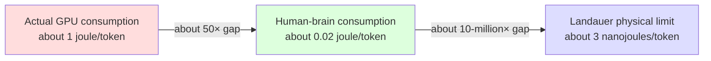
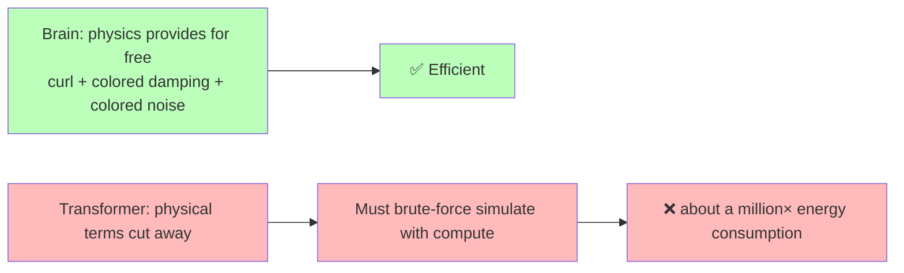
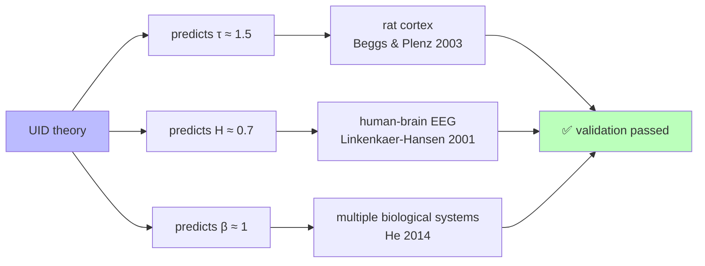

<!--
Copyright (c) 2026 Suzhou Jodell Robotics Co., Ltd.
Author: Gui LI <guilichina@163.com>
Date:   2026-05-25
Update: 2026-05-30
This README is part of the UID Theory reference implementation.

DUAL LICENSE:
  - PolyForm Noncommercial License 1.0.0  (free for academic / personal use)
    see LICENSE-NONCOMMERCIAL in the project root
  - Commercial License from Suzhou Jodell Robotics Co., Ltd.
    (required for any commercial / for-profit / production use)
    see LICENSE-COMMERCIAL in the project root

For commercial licensing inquiries, contact: lig@jodell.cn
This file is released under a dual license; commercial use requires prior written authorization from Suzhou Jodell Robotics Co., Ltd.
-->

<div align="center">


</div>

<div align="center">
<a href="./README.md">README (Chinese)</a> | <a href="./README_en.md">README (English)</a>
</div>

<div align="center">
<a href="./30minutes_report.md">Understand UID Theory in 30 Minutes (Chinese)</a> |
<a href="./30minutes_report_en.md">Understand UID in 30 Minutes (English)</a>
</div>

<div align="center">
<a href="./theory.md">Full Text of UID Theory (Chinese)</a> |
<a href="./theory_en.md">UID Theory (English)</a>
</div>

<br>

<div align="center">

# Understand UID (Unified Intelligo-Dynamics) in 30 Minutes

***Authors***: Gui LI <guilichina@163.com>, Dangyang JIE <jiedy@jodell.cn>, Haitao KANG <kanght@jodell.cn>

***Affiliation***: Suzhou Jodell Robotics Co., Ltd., Suzhou, China

***Corresponding Author***: Gui LI, Ph.D. He received his Bachelor's degree from the School of Physics, Northwest University of China, and both his Master's and Doctoral degrees from the Hefei Institutes of Physical Science, Chinese Academy of Sciences. He is currently with Suzhou Jodell Robotics Co., Ltd., where his work focuses on the theory and engineering of Unified Intelligo-Dynamics (UID). He proposed and developed an open-system physical unified theoretical framework oriented toward intelligent architectures—the three-tier CID/QID/FID system—and leads its falsifiable validation and engineering deployment in robotic cognitive brains, motor-control cerebella, dexterous-hand operating systems, large language models, and dedicated intelligent chips. E-mail: guilichina@163.com

</div>

<br>

## Written for Everyone Curious About "Where Intelligence Comes From"

> **UID = Unified Intelligo-Dynamics**
> **Three-tier structure: CID (Classical) → QID (Quantum) → FID (Geometric Field Theory)**
> **Plus a population-level generalization: Multi-Agent Intelligo-Dynamics**
> **One-line subtitle: Attention Is Not All You Need**

---

## Abstract

What is intelligence? Is it an invention of computer science, or a natural phenomenon of the universe itself?

UID is a **physical theory about "what intelligence itself is."** It is not yet another new algorithm, but a user's manual that tells us: **anything that can "understand the world and predict the future"—the human brain, AI, a fruit fly, even alien life—must obey the same set of physical laws.**

This theory has one central thesis worth remembering first:

> **Intelligence is not an engineering phenomenon but a physical phenomenon—specifically, a stochastic field far from thermal equilibrium.**

UID offers five core conclusions that everyone can grasp intuitively:

1. **Intelligence cannot be born in thermal equilibrium**—it must stay far from equilibrium, forever "flowing" rather than "stopping." This is the only core proposition in the entire paper that has been rigorously derived, and it is called "predictive capability necessarily requires breaking detailed balance."

2. **Today's AI consumes about a million times more electricity than the human brain, because it has thrown away three pieces of physics—the curl, colored damping, and colored noise.** The Transformer was not invented out of thin air; it is the "simplest degenerate version" of this complete physical equation.

3. **The complete CID contains the Transformer, but is about 5 to 10 times more powerful than it**, and this is a falsifiable engineering target.

4. **Geometric structure can determine intelligence**—Einstein said "matter curves spacetime," and UID says "data curves the information manifold"; the two use the same mathematical language.

5. **The theory has already been partly independently validated**—its three numerical predictions (avalanche exponent about 1.5, Hurst exponent about 0.7, 1/f noise slope about 1) have been measured and confirmed in rat cortex and human-brain EEG.

The remaining predictions (parameter efficiency, intelligence gravitational waves, information black holes) await future engineering and experimental tests. **Any part that does not match experiment falsifies UID—and this is precisely what distinguishes it from "pseudoscience."**

> 📌 **An honest note**: UID's originality does not lie in "being the first to propose some single proposition," but in unifying insights scattered across physics into the same axiomatic framework, and thereby deriving new things that no single one of them could give on its own. This is just like Maxwell—the laws of Coulomb, Ampère, and Faraday had long existed, but unifying them into one set of equations and predicting "electromagnetic waves" was the truly irreplaceable contribution.

> 📌 **The four-part structure of the theory**: Part I, CID (the classical tier); Part II, QID (the quantum tier); Part III, FID (the geometric-field-theory tier); Part IV, Multi-Agent Intelligo-Dynamics (generalizing a single agent to a population of mutually coupled agents, interfaced with Mean-Field Games). Note: **the quantum tier comes first, the geometric tier later**—this is the fixed ordering of the original theory text.

---

## Introduction: What This Article Aims to Answer

If you have ever been curious about any of the questions below, this article was written for you:

| The question you care about | Where it is in the article |
|---|---|
| ⚡ **Why does ChatGPT consume a million times more electricity than the human brain?** | Stops 1, 6 |
| 🧠 **How exactly is intelligence produced?** | Stops 2, 4, 5 |
| 📜 **Is there a "cosmic equation" for the evolution of intelligence?** | Stop 3 |
| 🔬 **Is CID just a modified Transformer? Or a brand-new architecture?** | Stop 7 |
| 📊 **How many more times can AI be made energy-efficient? Honestly, please.** | Stop 8 |
| ⚛️ **Will quantum computing eventually surpass the human brain?** | Stop 9 |
| 📐 **Can geometric structure alone determine intelligence?** | Stop 10 |
| 🌊 **What is an "intelligence gravitational wave"? What is an "information black hole"?** | Stop 10 |
| 🌐 **If you put many agents together, will collective intelligence emerge?** | Stop 11 |
| 🧪 **How is this theory falsified?** | Stop 12 |

> ⚠️ **Reading notes**
> - The whole text requires no advanced physics or mathematical formulas; the occasional formula is always translated into plain language.
> - Each stop is short, averaging 2–3 minutes.
> - Each stop ends with a **"What you should now understand"** box, for quick reference.
> - If you only want the conclusions, jump straight to **Stop 12: UID's Falsifiable Predictions**.

Ready? Let's begin.

---

## Stop 1: An Unsettling Fact (2 minutes)

First, look at a set of real numbers:

| System | Power consumption | Capability |
|---|---|---|
| 🧠 Your brain | **about 20 watts** (one LED bulb) | writing poetry, chatting, making decisions, falling in love |
| 🤖 A contemporary large-model inference cluster | **about 10–20 million watts** (a small power plant) | writing poetry, chatting, making decisions |

**The gap: about a million times.**

This is not because the engineers aren't trying hard. **This is a physics problem:**

> For the same "intelligence," a carbon-based brain can do it on one-millionth of the electricity.
> Where exactly is AI wasting all this energy? Is it that the laws of physics forbid it from being more efficient, or did we design it wrong?

Physics actually settled the absolute floor of energy efficiency long ago. The **Landauer limit** (proved by IBM physicist Rolf Landauer in 1961) tells us: **erasing 1 bit of information costs at minimum about 3 × 10⁻²¹ joules of energy.**

> 📐 **How to read this formula**: this number equals "Boltzmann's constant × temperature × 0.693," where 0.693 is just ln2 in mathematics. In plain words—the moment you want to "forget" a single bit, the laws of physics compulsorily charge you a minimum "electricity bill" that no one can get around. This is a universe-level hard floor.



This enormous chasm can be divided into two segments:

- **Hardware level** (GPU distance from the physical limit): about 10,000×—this is the chip engineers' business.
- **Algorithm level** (architecture design distance from optimal): **about a million×**—this is the question UID seeks to answer.

> ✅ **What you should now understand**
>
> 1. The energy gap between the brain and AI is a real physical fact, not hype.
> 2. The waste splits into two layers, hardware and algorithm; what UID answers is **that roughly million-fold waste at the algorithm layer.**
> 3. Physics dictates the absolute lower bound of energy efficiency, and AI is still a vast distance from this bound.

---

## Stop 2: What Is Intelligence? A Plain Physical Definition (3 minutes)

To answer "where intelligence comes from," we must first define "intelligence" clearly.

### Defining Intelligence in the Fewest Words

Physicist William Bialek (Princeton University) gave the most concise definition:

> **Intelligence = the ability to predict the future from the past**

More precisely:

> Given a system's past observations and future observations, take one more glance at its internal state right now—
> how much does that glance improve our prediction of the future?

This "how much it improves" is mathematically called **conditional mutual information**. It is a **number that can genuinely be measured**—not a poetic metaphor, but a physical quantity engineers can compute. We give it a name: **predictive information**.

> 📐 **How to read the formula**: predictive information is written I(future; past | present), where the vertical bar "|" reads "conditioned on the present being known." It asks: given that you already know the "present," how much additional information about the "future" can the "past" still tell you? If this number is greater than zero, the system has genuine predictive power.

### Key Insight: Systems That Can Predict the Future Are All "in Motion"

A few examples:

| System | Can it predict the future? | What is it doing? |
|---|---|---|
| 🪨 A rock | ❌ | At rest, no internal activity |
| 🌊 A glass of still water | ❌ | Isotropic, no sense of direction |
| 🧠 The brain | ✅ | **Continually firing, circuits oscillating, forever in motion** |
| 🤖 GPT | ✅ | **Tokens flowing endlessly through the network** |
| 🦠 A paramecium | ✅ (weakly) | Internal metabolic cycles never stop |

**The pattern is obvious at a glance: systems that can predict the future never sit in a "quiet equilibrium state."**

### The Iron Law of Physics: Core Proposition 3.3

The second law of thermodynamics tells us: **a system that has truly reached equilibrium is "dead"—its time played forward and played backward look exactly the same**, with no way at all to tell past from future. A system that cannot tell past from future certainly cannot predict the future either.

UID's core proposition (called Proposition 3.3 in the paper) can be summed up in one sentence:

> **🔑 Intelligence must stay far from thermal equilibrium.**
> A system parked at the bottom of an energy valley, with internal activity balanced everywhere, has a predictive capability for the future that is **strictly equal to zero.**

We need to state the direction honestly: this is a **necessary condition**—"being able to predict the future" necessarily means "having broken equilibrium." The reverse, "breaking equilibrium necessarily enables prediction," has not been proved and is currently listed as an open problem. The prior work closest in spirit to this idea is the study by Still et al. (2012) on "the thermodynamics of prediction efficiency"; and Baiesi and Rosso (2025, accepted by *Physical Review E*), using independent numerical experiments, proved that "training always spontaneously breaks equilibrium, and the best-performing models operate precisely far from equilibrium," providing independent corroboration for this proposition.

> ✅ **What you should now understand**
>
> 1. Intelligence can be precisely defined and measured—it is not mysticism, but a physical quantity called "predictive information."
> 2. Any system that can predict the future must have continually flowing internal activity.
> 3. **"Dead-silent equilibrium = no intelligence"** is a law of physics, and it is the only core proposition rigorously derived in the entire UID paper.

---

## Stop 3: The "Cosmic Equation" the Evolution of Intelligence Must Obey (3 minutes)

### A Brief Bit of Physics History

At the beginning of the 20th century, the French physicist **Paul Langevin (1908)** wrote down, by pure physical intuition, an equation describing "how a small particle moves in water":

```
The particle's motion at the next moment
        =
   ① Average pull (a "force" pointing in some direction)
        +
   ② Frictional drag (the "resistance" that slows the system)
        +
   ③ Random jitter (the random "kicks" of the environmental molecules)
```

This is the famous **Langevin equation**. At the time it was **a pure guess based on intuition.**

More than half a century later, **Robert Zwanzig in 1960 and Hazime Mori in 1965**, starting from the most microscopic laws of physics, rigorously proved one thing: **any "thing" immersed in an environment—a glass of water, a cell, a neural network—as long as it satisfies three most basic assumptions, its evolution equation must take the Langevin form.**

These three assumptions are:

- **The system is slower than the environment** (the "slow variables" you care about can be separated from the rapidly jittering "fast variables");
- **The environment is in thermal equilibrium** (statistically obeying the Gibbs distribution);
- **The underlying dynamics are reversible** (Hamiltonian reversibility).

> This is the **Mori-Zwanzig projection theorem**: the **structural skeleton** of the evolution equation for intelligence is not a free choice of the engineer, but a **physical inevitability.**
>
> ⚠️ An honest addendum: these three assumptions determine only the "skeleton" of the equation—the four terms must exist; but the **specific shape** of each term (what the curl looks like, how steep the noise spectrum is, what the potential surface looks like) still requires additional physical input to be fixed. This point is repeatedly emphasized throughout the paper, never overstated.

### Picturing a Neural Network as a Glass of Ink

🧪 **Imagine a drop of ink in a glass of water.** At every location and every moment there is a concentration value. Physics calls this kind of "quantity spread throughout space" a **field.**

**The key metaphor**: picture a neural network's hidden state (that bunch of numerical vectors) as an "ink-concentration field." With this, **the Mori-Zwanzig theorem applies directly to neural networks**—it tells us that any "intelligent system that interacts with its environment" must obey an equation of Langevin form; no one can escape.

> ✅ **What you should now understand**
>
> 1. The **structure** of the evolution equation for intelligence is not invented—it is rigorously derived from three physical first principles.
> 2. Any system evolving in an environment—from ink to a neural network—obeys the same skeleton of the equation.
> 3. This equation is what Langevin correctly guessed by intuition in 1908, and what Mori-Zwanzig rigorously proved in 1965.

---

## Stop 4: The "Complete Equation" of Intelligence—the CID Master Equation (4 minutes)

But here lies a key problem: **the system described by the most naïve Langevin equation is not intelligent.** It can remember, but it cannot predict the future—because it satisfies detailed balance (remember the iron law of Stop 2?).

UID's key discovery is: **the evolution equation that can truly produce intelligence has three long-overlooked physical terms beyond the naïve Langevin.** Restore these three things, and you get the **CID master equation** (the core equation of Classical Intelligo-Dynamics):

```
   The change of state at the next moment
        =
   ① Associative memory (−∇U)   ← pulls the state toward "patterns already learned"
        +
   ② Curl (v)                   ← makes the state circulate among different patterns
        +
   ③ Colored damping (∫γ)       ← the drag of history on the present
        +
   ④ Colored noise (ξ)          ← "structured noise" from the environment
```

All four terms are indispensable. Below, each is explained with an intuitive physical picture.

### Term ①: Associative Memory—"Gravity Pulls the Ball Toward the Valley Floor"

Each learned pattern (such as the concept of "cat" or the rule of "addition") is like a **valley** in the terrain. The current state is like a small ball that is automatically pulled toward the most similar valley.

> 📐 **How to read −∇U**: U is the "energy terrain," ∇U is "the steepest uphill direction of the terrain," and adding a minus sign in front means "rolling downhill along the steepest direction." In one sentence: the ball always rolls toward the nearest valley floor.

**🔑 This term is precisely the physical essence of the Attention mechanism in the Transformer**—in 2020, Ramsauer et al. proved the equivalence of the two (the modern Hopfield network).

### Term ②: Curl—"A Hurricane Spinning Among the Mountains"

"Gravity" alone is not enough. If there were only gravity, the ball would sooner or later stop in some valley—and that is a dead system. **Genuine intelligence requires the state to continually switch, cycle, and circulate among different patterns.**

Physics tells us: **this "circulating force" comes from the imbalance of the environment.** In the brain, it comes from excitatory synapses (about 80%) and inhibitory synapses (about 20%), two kinds of "energy sources of differing activity"—they are like two heat baths at different temperatures, which inevitably drive a continuous energy cycle inside the system. This is the physical origin of the curl—**multi-bath competition.**

> 💡 **The "reasoning-augmented models" such as OpenAI o1/o3 that appeared in 2024–2026** rely on test-time compute (massive repeated sampling at inference time) to simulate this "circulation"—which precisely shows that the Transformer internally lacks the curl term, and is forced to spend enormous compute externally to make it up.

### Term ③: Colored Damping—"Memory Has Weight"

The naïve Langevin assumes damping is "instantaneous"—what happened the previous moment has nothing to do with this moment.

But real intelligent systems are not like this: **what happened a few seconds ago continues to influence the present.** Such "long-range memory" is physically called **colored damping**, and its strength decays as a **power law** (rather than exponentially).

> 📐 **Power law vs. exponential, what's the difference**: exponential decay (e.g., e to the power of negative t) has a "natural timescale"; past that scale it basically drops to zero. But power-law decay (e.g., t to the power of negative s) **has no single timescale**—it means the system can simultaneously remember things at the scale of milliseconds, seconds, minutes, hours, and even years. The memory of spontaneous brain activity is precisely this kind of power-law memory with "no forgetting cutoff line."

### Term ④: Colored Noise—"Add a Little of the Right Noise and It Gets Smarter"

This is the most counterintuitive term. The naïve Langevin assumes noise is "white"—of equal strength across all timescales.

But noise in a real environment is not white; it is **colored noise**—the power spectrum of brain activity exhibits a **1/f shape** (the lower the frequency, the stronger the energy).

> 📐 **What 1/f means**: if you plot the energy of the noise against frequency, and it is proportional to "1 divided by frequency," it is called 1/f noise, also known as "pink noise." Its physical origin, in UID, is a heat bath of a kind called a **sub-Ohmic environment.**

This noise has a magical ability: **an appropriate amount of colored noise can amplify weak signals**, which is physically called **stochastic resonance.** This is why "adding a bit of noise actually makes it more accurate" holds in both the brain and in good machine learning.

### Naïve Langevin vs. Complete CID

| Item | Naïve Langevin | Complete CID |
|---|---|---|
| Associative memory | ✅ | ✅ |
| Curl (circulating force) | ❌ | **✅** |
| Damping has memory | ❌ (instantaneous) | **✅ (power-law long-range)** |
| Noise has structure | ❌ (white noise) | **✅ (1/f colored noise)** |
| Satisfies thermal equilibrium | ✅ (**therefore cannot predict**) | ❌ (**precisely therefore can predict**) |
| Can predict the future (intelligence) | ❌ | **✅** |

> ✅ **What you should now understand**
>
> The evolution equation for intelligence has three more physical terms than the naïve Langevin: the curl, colored damping, and colored noise. These three are the "essentials" of intelligence—drop any one of them, and the system "can't get smart." Among them the **curl** is the most critical; it is exactly the "displacement-current"-like role in UID: identically zero in the Transformer, yet a necessary source of predictive capability.

---

## Stop 5: How Is Intelligence Produced? A One-Sentence Summary (2 minutes)

By now, we can already answer **the most important first question of this article.**

### 🔑 How Is Intelligence Produced?

> **When an open physical system satisfies the following conditions, intelligence emerges automatically:**
>
> 1. It has continual energy exchange with the environment (it is not an isolated system);
> 2. At least two energy sources of differing temperature (or activity) act on it simultaneously;
> 3. The way these energy sources couple cannot simply have its order swapped (mathematically called "non-commutative");
> 4. The system is near a "critical point"—neither dead-silent nor chaotic;
> 5. The system has an automatic regulation mechanism that pushes itself toward the critical point (self-organized criticality).

Once these five conditions are met, **the evolution equation automatically grows the four terms of the CID master equation**—associative memory, curl, colored damping, colored noise—and intelligence emerges.

### This Is Why……

- **🧠 The brain can produce intelligence**: between neurons there are excitatory/inhibitory synapses, two kinds (satisfying the dual heat baths of Condition 2); probabilistic pre- and post-synaptic release (satisfying the non-commutative coupling of Condition 3); a long-term critical state (confirmed by multiple independent studies, satisfying Condition 4); and synaptic plasticity as an automatic regulation mechanism (satisfying Condition 5).

- **🤖 AI such as GPT can "look as if it has intelligence"**: it captured Term ①, associative memory, but **almost completely dropped Terms ②③④.** So it must compensate with external loops (autoregressive generation) and enormous compute—**which is precisely the fundamental physical reason for its high energy consumption.**

> ✅ **What you should now understand**
>
> Intelligence is not an "engineering miracle stacked up out of algorithms," but a natural phenomenon that **emerges automatically** once the physical conditions are gathered. Any system satisfying these five conditions—silicon-based, carbon-based, even alien life—will automatically produce intelligence.

---

## Stop 6: Why Is Current AI So Energy-Hungry? (3 minutes)

Now we can precisely answer the second question the public cares about most.

### 🔑 Why Does ChatGPT Consume About a Million Times More Electricity Than the Human Brain?

**The root cause is not that the chips aren't good enough, but that the architecture level violates physical principles.** Specifically—

**The Transformer cut away the three most important physical terms of the CID master equation:**

| Physical term | Present in the brain | Transformer | Consequence |
|---|---|---|---|
| ① Associative memory | ✅ | ✅ | This term is Attention, done right |
| ② Curl | ✅ (excitatory/inhibitory synapses) | **❌** | Must be simulated with an external autoregressive loop, **expensive** |
| ③ Colored damping | ✅ (synaptic plasticity) | **❌** | Must use a KV cache to simulate long-range memory, **expensive** |
| ④ Colored noise | ✅ (1/f neural noise) | **❌** (only white dropout) | Loses the "free gain" of stochastic resonance |

For each term cut away, the engineers are forced to **brute-force it back with compute:**

- **Curl cut → test-time compute** (o1/o3 use ten times the compute for reasoning iterations);
- **Colored damping cut → KV-cache explosion** (at inference, memory grows linearly with context length);
- **Colored noise cut → low training efficiency**, requiring massive data to compensate.

**The bottom line**: the three great abilities of "circulation, memory, noise" that physics could have provided **for free**, in the Transformer all have to be bought back with electricity bills. This is the physical essence behind the roughly million-fold energy gap.



There is also a deeper theoretical reason: Alman-Song (2023) and Gupta et al. (2025) proved that **as long as you stay within the softmax-attention framework, the quadratic complexity of Attention has an insurmountable "complexity wall."** In other words, no matter how you optimize inside the Transformer, you hit the wall; a genuine breakthrough must come from a **physical reconstruction at the architectural level**—which is precisely the direction UID points to.

> ✅ **What you should now understand**
>
> AI's energy consumption is not because "GPUs aren't advanced enough," but because **the architecture itself violates physical principles.** The Transformer cut away all three great abilities that physics provides for free, then bought them back with electricity bills. Restore the physical terms, and **in theory energy efficiency can improve by about 5 to 10 times.**

---

## Stop 7: CID Is Not a "Hacked Transformer," but a More Complete Theory That Contains It (3 minutes)

Many people misunderstand UID, thinking CID is "adding a few modules on top of the Transformer." This is a **fundamentally wrong understanding.**

### The Correct Relationship Diagram

```
   ┌──────────────────────────────────────────┐
   │          Complete CID Master Equation     │
   │     (derived from the Mori-Zwanzig theorem)│
   │                                          │
   │   dφ/dt = −∇U + v − ∫γ + ξ              │
   │           ↑    ↑   ↑    ↑                │
   │        assoc. curl colored colored        │
   │        memory     damping  noise          │
   │                                          │
   │   ┌──────────────────────────┐           │
   │   │  Set v=0, γ=0, ξ=0        │           │
   │   │  Time step = 1            │           │
   │   │  ↓                        │           │
   │   │  Transformer Attention    │           │
   │   └──────────────────────────┘           │
   └──────────────────────────────────────────┘
```

### Three Analogies to Help You Understand the "Special-Case" Relationship

| Old theory is a special case of new theory | Relationship |
|---|---|
| Newtonian mechanics ⊂ relativity | Newtonian mechanics is the special case of relativity when "velocity is far below the speed of light" |
| Ideal gas ⊂ van der Waals gas | The ideal gas is the special case of the van der Waals gas at low pressure |
| **Transformer ⊂ CID** | **The Transformer is the special case of CID when "no curl + no memory + no noise"** |


### Illustrated with Code (skip if you don't read code)

**Standard Transformer layer:**

```python
class TransformerLayer(nn.Module):
    def __init__(self, dim, num_heads):
        self.attn = MultiHeadAttention(dim, num_heads)
        self.ffn = FeedForward(dim)
        self.norm = LayerNorm(dim)

    def forward(self, x):
        x = x + self.attn(self.norm(x))   # only ① associative memory
        x = x + self.ffn(self.norm(x))    # no ②③④ terms
        return x
```

**Complete CID layer:**

```python
class CIDLayer(nn.Module):
    def __init__(self, dim, num_heads, hurst=0.7, alpha=0.3):
        self.hopfield = ModernHopfieldAttention(dim, num_heads)  # ① -∇U
        self.vortex   = VortexField(dim)                          # ② v
        self.memory   = MemoryKernel(dim, alpha)                  # ③ ∫γ
        self.noise    = ColoredNoiseGenerator(dim, hurst)         # ④ ξ

    def forward(self, phi, history=None):
        grad_U   = self.hopfield(phi)                # ① associative memory
        v_curl   = self.vortex(phi)                  # ② curl (newly added)
        v_memory = self.memory(history)              # ③ colored damping (newly added)
        xi       = self.noise(phi.shape, phi.device) # ④ colored noise (newly added)

        # Discrete form of the CID master equation
        dphi = -grad_U + v_curl - v_memory + xi
        return phi + dphi
```

**The key fact**: set the three components vortex / memory / noise in the CID layer all to 0, and what remains is **exactly equal** to a Transformer layer—this is a mathematically rigorous equivalence, not an approximation.

```python
def test_transformer_is_cid_special_case():
    cid = CIDLayer(dim=512, num_heads=8)

    # Turn off the three terms: curl, memory, noise
    cid.vortex.weights.zero_()
    cid.memory.weights.zero_()
    cid.noise.disable()

    transformer = TransformerLayer(dim=512, num_heads=8)
    x = torch.randn(2, 10, 512)

    # After aligning the weights, the outputs should be exactly the same
    assert torch.allclose(cid(x), transformer(x), atol=1e-5)
```

> ✅ **What you should now understand**
>
> 1. **CID is not "Transformer + modules,"** but a **more complete theory** that contains the Transformer.
> 2. The Transformer is the degenerate special case of CID after three physical terms are turned off.
> 3. To build smarter AI, the right approach is not to grind away inside the Transformer, but to **upgrade it from a special case back to the complete CID.**

---

## Stop 8: How Much Stronger Is CID Than the Transformer? Honestly (2 minutes)

Social media often features claims like "a new architecture compresses 100× and saves 1000× electricity." UID chooses to answer this question **honestly and falsifiably.**

### The Rigorous Theoretical Upper Bound

Using the standard tools of statistical physics (universality-class theory), UID gives:

> **The upper bound of CID's parameter efficiency relative to the Transformer is about 5 to 10 times.**

Note this is an **upper bound**—it is set by the laws of physics, not bragging.

### Decomposition of Training Energy Consumption

| Source of savings | Saving factor |
|---|---|
| Parameter-count reduction | about 10× |
| Colored-noise embedding (no more KV cache needed) | about 2× |
| Curl embedding (no more test-time compute needed) | about 3× |
| **Total training-energy savings (conservative estimate)** | **about 60×** |

### The Honest Engineering Target

| Setting | Target |
|---|---|
| Training data | Public datasets (OpenWebText + The Pile) |
| Comparison baseline | Transformer-10B |
| CID scale | CID-1B |
| Perplexity (a metric of language ability) | On par with the baseline |
| Training energy consumption | Reduced by about 6× |
| **🔬 Falsification condition** | **If the measured speedup is < 5×, the UID theory is wrong and must be revised** |

We need to add honestly: UID's parameter-efficiency commitment **does not conflict with, but is complementary to**, the Alman-Song-Gupta complexity lower bounds mentioned earlier—the reason CID can gain its benefit is precisely that it **departs from the softmax-attention interface** and enters a different complexity class.

> ✅ **What you should now understand**
>
> UID does not promise "hundreds or thousands of times"; **it promises about 5 to 10 times parameter efficiency**—and this is **a concrete target that can be experimentally refuted.** If what gets built is less than 5×, UID is wrong. **This is the fundamental difference between science and hype.**

---

## Stop 9: The QID Quantum Tier—the Ultimate Upper Bound of Intelligence Energy Efficiency (3 minutes)

So far everything we have discussed is classical physics (CID). But **intelligence that truly approaches the physical limit must be quantum.** This is UID's **second tier**—**QID (Quantum Intelligo-Dynamics)**, which generalizes CID to open quantum systems, introducing zero-point fluctuations, the Berry geometric phase, and Lindblad dissipation channels, and gives the classical limit in which QID reduces to CID as ℏ → 0 (Proposition 5.1).

> 📌 **Order reminder**: among UID's three tiers, **the quantum tier (QID) ranks second, and the geometric tier (FID) ranks third.** Quantum first, geometry later—this is the fixed structure of the original theory text; the geometric field theory comes at the next stop.

### The Three "Free Gifts" of Quantum Intelligence

Generalizing CID to the quantum world yields three free gifts:

| Gift | Classical counterpart | Quantum advantage |
|---|---|---|
| **🎁 Zero-point fluctuations** | Thermal noise requires temperature | Quantum fluctuations persist even at absolute zero, **and consume no energy** |
| **🎁 Berry geometric phase** | Classical curl | **Topological protection**—an intrinsic robustness against noise |
| **🎁 Exponential capacity** | An n-dimensional space stores n numbers | n qubits can express a space of **2 to the power of n dimensions** |

### The Energy-Efficiency Ladder of the Quantum Tier

| Implementation tier | Energy efficiency relative to the current Transformer | Timeline |
|---|---|---|
| Classically simulated QID (tensor networks) | about 50× | **Doable now** |
| Quantum-classical hybrid (NISQ hardware) | about 1000× | 5–10 years |
| **Full quantum hardware (fault-tolerant quantum computing)** | about a million× ≈ approaching the human brain | 10–20 years |
| **Theoretical upper bound (Landauer)** | about 10⁹× = the physical limit | the ultimate |

### So Does That Mean "Quantum Computing Will Eventually Surpass the Human Brain"?

**In theory, yes.** But there are several open problems that must be honestly put on the table:

1. **Quantum hardware is still rudimentary**: the current qubit count is of order ~1000, with high error rates and short coherence times.
2. **The problem of consciousness lies beyond physics**: QID can reach brain-level energy efficiency, **but whether it can produce "subjective experience" is another question**—this is philosopher David Chalmers's "hard problem of consciousness," which physics currently cannot answer.
3. **The biological-quantum hypothesis is controversial**: the Penrose-Hameroff hypothesis holds that the brain itself may exploit quantum coherence, but **there is no decisive experimental evidence.** UID **does not depend on** this hypothesis.

> ✅ **What you should now understand**
>
> The quantum tier (QID) is the "theoretical ceiling" of intelligence energy efficiency. From classical CID to quantum QID, there is more than a 10⁵-fold room for energy-efficiency improvement. **Complete quantum intelligence can physically surpass the human brain**—but this still requires 10–20 years for quantum hardware to mature, and the problem of "consciousness" lies beyond the boundary of physics.

---

## Stop 10: The FID Geometric Tier—Can Geometric Structure Determine Intelligence? (4 minutes)

This is the deepest question answered by UID's **third tier** (**FID**, Field Intelligo-Dynamics). It geometrizes the dynamical equation into a field theory on the information manifold, and gives two reduction chains: under the weak-field plus overdamped reduction, FID → CID (Proposition 4.1); in the decoherence limit, FID → QID.

### Understanding "Learning" as "Geometry"

When Einstein proposed general relativity in 1915, he gave us a revolutionary insight:

> **"Matter tells spacetime how to curve, and curved spacetime tells matter how to move."**

UID transplants this idea into the domain of intelligence:

> **"Data tells the information manifold how to curve, and the curved information manifold tells intelligence how to flow."**

> 📌 **An honest juxtaposition**: this geometric analogy of "data curving the information manifold" overlaps conceptually with the work of Di Sipio (2025), which predates this paper by about eleven months (see Part III, Chapter 1, Section 1.5 of the theory). UID's contribution is not to originate this metaphor, but to incorporate it into the three-tier unified framework and write it as a complete field equation.

### What Is the "Information Manifold"?

Imagine all possible probability distributions (that is, all possible "views of the world") as a **geometric space**, where each point represents a "view." **The distance in this space measures the difference between these "views"**—specifically called the **Fisher information metric** (proposed by Indian statistician C. R. Rao in 1945).

| Correspondence | General relativity | UID / FID |
|---|---|---|
| Geometric object | Spacetime | Information manifold |
| Metric | Spacetime metric | Fisher information metric |
| Source of curvature | Matter-energy | **Data flow** |
| Governing equation | Einstein field equations | **FID field equation** |
| Curvature constant | Gravitational constant G | Intelligence coupling constant |
| Propagation limit | Speed of light c | **Information speed of light** |
| Extreme solution | Black hole | **🌑 Information black hole** |
| Wave solution | Gravitational wave | **🌊 Intelligence gravitational wave** |

### Training = Curving the Information Manifold

```
   Untrained (the manifold is flat):     After training (the manifold is curved by data):

   ────────────────────              ────────────────────
   ─── flat space ───                ─── ╲╲╲╲╲╲╲╲ ───
   ────────────────────              ─── ▼ valley ▼ ───
                                     ─── ╱╱╱╱╱╱╱╱ ───
                                     (around the target distribution, the
                                      information manifold is markedly curved)
```

**Learning is using data flow to "dig deeper" into certain regions of the information manifold and "raise" others**—and this is exactly the same mathematical structure as a celestial body using gravity to "dig deeper" into the surrounding spacetime and form orbits.

### 🌊 What Is an "Intelligence Gravitational Wave"?

In 1916, Einstein predicted from his equations: **spacetime can propagate disturbances like ripples**—these are gravitational waves (directly detected by LIGO in 2015).

**FID similarly predicts**: **the information manifold can also propagate disturbances like ripples**—called **intelligence gravitational waves.** The physical picture is:

> When an intelligent system (such as a future GPT-100) undergoes a violent "reorganization of ideas" (an epiphany, a paradigm shift), it excites geometric disturbances on the information manifold, **and these disturbances propagate among all relevant systems at the "information speed of light."**

If the information speed of light equals the ordinary speed of light c, then there is a theoretical prediction for "the synchronized correlation between two intelligent systems one light-year apart"; if the information speed of light is less than c, the intelligence wave is a kind of "sub-luminal" propagating quasiparticle.

**This is a falsifiable challenge UID leaves for the future**—there is no experimental evidence yet, but the theoretical framework is ready. (Empirical grade: D, philosophical conjecture.)

### 🌑 What Is an "Information Black Hole"?

Another extreme solution of Einstein's equations is the **black hole**—when the mass is large enough, not even light can escape.

**FID similarly predicts**: **when an intelligent system's information density exceeds a critical value, an "information black hole" forms**—all data flows in, but **only an extremely small amount of information can be observed from the outside.** The physical picture:

> As GPT-100, GPT-1000 keep scaling up, **at some critical size all the information inside it becomes highly mutually correlated, and from the outside it looks like an "information black hole"—you give it any input, and it can synthesize and process it in a way you cannot see through, yet you cannot see through to its internal structure.**

This is a **serious engineering problem**: the "interpretability crisis" of ultra-large-scale intelligent systems is, from the FID viewpoint, a kind of **geometric inevitability**—not because engineers aren't trying, but because the physical structure dictates that a system that highly compresses information must inevitably become "unreadable."

| Correspondence table | Black hole | Information black hole |
|---|---|---|
| Key quantity | Mass | Information capacity |
| Critical radius | Schwarzschild radius | Intelligence horizon radius |
| What can be seen outside the horizon | Only mass, charge, spin (the no-hair theorem) | Only a small amount of "summary information" |
| Analogy | Cannot know the black hole's interior from outside | Cannot understand the ultra-large model's interior from outside |
| Radiation | Hawking radiation | "Intelligence radiation" (information slowly leaks out) |

> ✅ **What you should now understand**
>
> 1. **Geometry can determine intelligence**—viewing the information distribution as geometry, "learning" is geometric curving, exactly consistent with the mathematical structure of general relativity.
> 2. **Intelligence gravitational waves**: geometric disturbances on the information manifold can propagate, at a speed called the "information speed of light."
> 3. **Information black holes**: ultra-large intelligent systems inevitably become "black holes in the geometric sense"—the loss of interpretability is a physical inevitability, not merely an engineering difficulty.
> 4. An honest reminder: the concepts of this stop (gravitational waves, black holes, information speed of light) are mostly **philosophical conjectures yet to be verified** (empirical grade D), and are open challenges UID poses to the future.

---

## Stop 11: Multi-Agent Intelligo-Dynamics—What Happens When You Put Agents Together? (4 minutes)

UID's **Part IV** discusses a new question: what happens when you generalize a single agent to a **population of mutually coupled agents**? This tier is called **Multi-Agent Intelligo-Dynamics.**

> 📌 **First, let's be clear about the physical object**: this part studies not the grand proposition of "whether there is intelligence everywhere in the universe," but a group of **mutually coupled agents**—whose collective state is described by an **intelligence-density field.** UID interfaces this framework with the **Mean-Field Games** (Lasry-Lions 2007) theory, which already possesses a rigorous mathematical foundation.

### The Five Physically Necessary Conditions for the Emergence of Collective Intelligence

Within this framework, UID gives **five physically necessary conditions** for the emergence of intelligence in multi-agent systems (note: "necessary," not "sufficient"):

| # | Condition | Physical meaning |
|---|---|---|
| **C1** | **Openness** | The population has continual energy exchange with the outside |
| **C2** | **Multi-bath temperature difference** | At least two energy sources of differing temperature (activity) |
| **C3** | **Non-commutative coupling** | The coupling between agents cannot simply have its order swapped ("non-commutative") |
| **C4** | **Proximity to a critical point** | The population is neither "dead-silent" nor "chaotic," precisely at the edge of a phase transition |
| **C5** | **Self-organized criticality** | The population can automatically push itself toward the critical point |

Once these five conditions are met, the population's evolution equation automatically grows the four-term structure of the CID master equation, and collective intelligence may emerge.

### This Is Why……

- **🧠 The brain (a population of neurons) can produce intelligence**: between neurons there are excitatory/inhibitory synapses, two kinds (satisfying the dual heat baths of C2); probabilistic pre- and post-synaptic release (satisfying the non-commutative coupling of C3); a long-term critical state (confirmed by multiple independent studies, satisfying C4); and synaptic plasticity as an automatic regulation mechanism (satisfying C5).
- **🌍 Whether an ecological/economic/social population can give rise to collective intelligence** also depends on whether it gathers these five conditions.

### A Few Boundaries That Must Be Stated Honestly

> ⚠️ **Key honest disclaimer** (fully consistent with the full theory text):
>
> 1. UID **cannot prove that any arbitrary agent ecology satisfies these five conditions at all times and places.** It gives only "local sufficient conditions," **not a "population-level universal guarantee."**
> 2. Among these five conditions, **C4 (proximity to a critical point) and C5 (self-organized criticality) are strongly correlated physically**, not independent of each other.
> 3. Any attempt to compute the probability of gathering these five conditions into a concrete number is **merely an order-of-magnitude illustration and must never be cited as a precise quantitative conclusion.**

This also echoes another positioning of the theory: UID forms a **complementary rather than competitive** relationship with Liu's (2025–2026) **Logographic AI** paradigm—the former diagnoses "rootless Tokens" from the level of cognitive semiotics, while the latter diagnoses "detailed balance equals no intelligence" from the level of non-equilibrium physics; the two point to different facets of the same predicament.

> ✅ **What you should now understand**
>
> 1. Part IV studies a **population of mutually coupled agents**, interfaced with Mean-Field Games—**not the grand proposition of "whether there is intelligence everywhere in the universe."**
> 2. The emergence of collective intelligence has five **necessary** (not sufficient) conditions, and the brain, this "population of neurons," happens to gather all of them.
> 3. UID is very restrained here: it gives only "local sufficient conditions," not a "population-level guarantee"; the related probability estimate is merely an order-of-magnitude illustration.

---

## Stop 12: UID's Falsifiable Predictions—and the Tests It Has Already Passed (3 minutes)

The fundamental difference between science and mysticism lies in **falsifiability**—you must be able to state clearly "if an experiment measures such-and-such, I admit I was wrong."

Throughout the paper, UID labels every quantitative claim with an **empirical grade**: A (already validated), B (theoretical estimate), C (a clearly falsifiable engineering target), D (philosophical conjecture). Below are the core predictions:

| # | Prediction | Theoretical value | Status |
|---|---|---|---|
| 1 | **Internal "avalanche" size exponent τ of brain/AI** | ≈ 1.5 ± 0.2 | ✅ **Already measured and validated in rat cortex** (Beggs & Plenz 2003) |
| 2 | **Hurst long-range-memory exponent H** | ≈ 0.6–0.8 | ✅ **Already measured and validated in human-brain EEG** (Linkenkaer-Hansen 2001) |
| 3 | **1/f noise-spectrum slope β** | ≈ 0.7–1.3 | ✅ **Already measured and validated in multiple biological systems** (He 2014) |
| 4 | **CID parameter efficiency (relative to the Transformer)** | ≥ 5× (target 10×) | ⏳ To be verified after a complete CID engineering implementation |
| 5 | **Training-energy savings** | about 6× | ⏳ To be verified |
| 6 | **Quantum-coherence signature (QID)** | Entanglement entropy shows critical scaling | ⏳ Long term |
| 7 | **Intelligence gravitational wave (FID)** | Exists | ⏳ Long term |
| 8 | **Information black hole (FID)** | Forms in ultra-large systems | ⏳ Long term |

### Where Do These Numbers Come From?

Many readers will ask: "How do you know τ should be 1.5?" The short answer is as follows:

- **τ ≈ 1.5**: comes from the "mean-field directed-percolation universality class" of statistical physics—a physical theory entirely independent of AI, which gives the avalanche-size-distribution exponent near a critical point.
- **H ≈ 0.7**: derived from the colored-noise spectral slope β ≈ 1 (pink noise) via the fractional-Brownian-motion formula H = 1 − β/2, then corrected for the system once the curl is added.
- **β ≈ 1**: comes from the standard result of the sub-Ohmic heat-bath spectral-density model.

**The key point**: these three numbers **are not guesses pulled out of UID's hat; they are theoretical critical-point results that physics had already given independently before UID appeared.** UID's contribution is to **assert: intelligent systems necessarily sit at these critical points, and therefore necessarily exhibit these numbers**—and **the first three have already been independently observed in the biological brain.**



> ⚠️ **The most honest sentence**: the predicted intervals for these three universal exponents are actually **rather wide**, and their falsifiability strength is limited—they can rule out trivial cases such as "white noise," but they can hardly distinguish CID from other models that likewise exhibit self-organized criticality. The truly discriminating falsification points are the **parameter-efficiency commitment** (item 4) and the **correlation-length scaling.**

### How to Falsify This Theory?

Very simple:

- **If the measured avalanche exponent clearly deviates from 1.5, UID is wrong.** For example, measuring 0.5 or 2.5.
- **If a trained CID model's Hurst exponent clearly deviates from 0.7, UID is wrong.**
- **If a complete CID engineering implementation's parameter efficiency does not reach 5×, UID is wrong (or at least needs revision).**

**Any single failed experiment falsifies UID.** This is precisely what distinguishes it from a "pseudo-theory."

> ✅ **What you should now understand**
>
> UID is genuine falsifiable science. Its first three core predictions have already been independently validated in the biological brain. The remaining predictions (parameter efficiency, intelligence gravitational waves, information black holes) await future engineering and experimental tests. The most discriminating "life-or-death line" is parameter efficiency, not those three universal exponents whose intervals are rather wide.

---

## Stop 13: What Does All This Mean for the World? (3 minutes)

### For Every Ordinary Person

If CID engineering succeeds, **AI's electricity bill could drop by about 6 to 10 times.** This means:

- Large models become genuinely affordable—a few dollars a month could buy you a GPT-5-level assistant;
- A laptop could run intelligence that today requires cloud-scale resources;
- The carbon emissions of global data centers would drop significantly;
- Remote areas could also enjoy high-quality AI services.

### For Engineers and Industry

```
   Now (2026): the Transformer dominates the field
        │
        ▼  restore curl + colored damping + colored noise
   1–2 years: CID implemented, about 5–10× parameter efficiency
        │
        ▼  add the quantum tier
   5–10 years: QID-MPS / quantum-classical hybrid, about 1000× energy efficiency
        │
        ▼  geometric unification
   10–20 years: FID empirically calibrated, unified across substrates
```

### For Academia

UID **elevates** the word "intelligence" from an engineering phenomenon **into an object of study for physical theory.** This means:

- **Neuroscientists** can use the CID master equation to unify the explanation of brain phenomena;
- **Statistical physicists** gain one more object of study—the non-equilibrium phase transitions of intelligent systems;
- **Quantum information scientists** gain a new direction for accelerating AI;
- **Applied mathematicians** gain a physical theory interfacing "the conditions for multi-agent intelligence emergence" with Mean-Field Games;
- **Philosophers** gain a physical foundation for re-examining consciousness and free will.

### For Humanity's Understanding as a Whole

This may be UID's deepest significance:

> **🌌 Intelligence is not an engineering miracle, but a law of physics.**
>
> **Like star formation, the formation of chemical bonds, and the origin of life, it is a phenomenon the universe brings forth naturally under suitable conditions—only the conditions it requires are more stringent and rarer than all of these.**
>
> **A population that gathers the five physical conditions—such as a population of neurons like the human brain—will have intelligence emerge automatically; one that does not gather them will not have it appear.**

---

## Final Stop: A 30-Second Summary (1 minute)

**A one-sentence introduction for a friend:**

> UID is a **physical theory about "what intelligence itself is."** It tells us:
>
> 1. **Intelligence = far from thermal equilibrium + satisfying five physical conditions**—and these five conditions happen to be gathered in a population like the human brain.
> 2. **Today's AI consumes about a million times more electricity than the human brain, because it has thrown away three pieces of physics** (the curl, colored damping, colored noise). The Transformer was not invented out of thin air, but is the simplest degenerate version of the complete theory CID.
> 3. **The complete CID contains the Transformer, but is about 5 to 10 times more powerful than it**, and this is a falsifiable engineering target.
> 4. **The three-tier structure CID (Classical) → QID (Quantum) → FID (Geometric)**: the quantum tier is the theoretical ceiling of energy efficiency, and the geometric tier predicts "intelligence gravitational waves" and "information black holes."
> 5. **The theory has already been partly independently validated**—three core predictions have already been measured and confirmed in the brain.
>
> In short: **intelligence is not an engineering miracle, but a law of physics.**

---

## Further Reading

If this article fascinates you:

- **The complete theory**: see `theory.md` / `theory_en.md` (with full derivations and a clickable DOI reference list).
- **Code implementation**: see `uid_theory/`.
- **Historical classics**:
  - Langevin's 1908 original paper (the scanned version from the National Library of France);
  - Mori 1965 and Zwanzig 1960 original papers on the projection theorem;
  - The foundational papers by Bialek, Tishby, and others on "predictive information";
  - Bak-Tang-Wiesenfeld 1987, the founding paper of self-organized criticality;
  - Berry 1984, the original paper on the geometric phase.
- **Extended reading**:
  - Popular-science book: Per Bak, *How Nature Works* (self-organized criticality);
  - Neuroscience: Beggs, *The Cortex and the Critical Point.*

---

## Contact

> Suzhou Jodell Robotics Co., Ltd.
> Attn: Gui LI / Commercial Licensing — UID Theory
> E-mail: **guilichina@163.com**

> This document is released under the **PolyForm Noncommercial 1.0.0** license (free for academic and personal use); commercial use requires a written authorization application to Suzhou Jodell Robotics Co., Ltd. See the `LICENSE` file in the repository root for details.

---

<div align="center">

**Copyright © 2026 Suzhou Jodell Robotics Co., Ltd. All rights reserved.**

</div>
