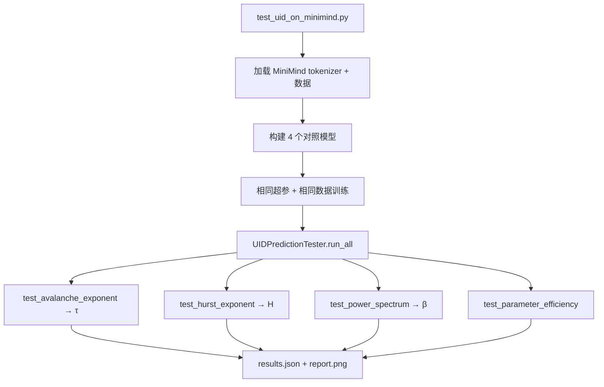

<!--
Copyright (c) 2026 Suzhou Jodell Robotics Co., Ltd.
Author: Gui LI <guilichina@163.com>
Date:   2026-05-25

This README is part of the UID Theory reference implementation.

DUAL LICENSE:
  - PolyForm Noncommercial License 1.0.0  (free for academic / personal use)
    see LICENSE-NONCOMMERCIAL in the project root
  - Commercial License from Suzhou Jodell Robotics Co., Ltd.
    (required for any commercial / for-profit / production use)
    see LICENSE-COMMERCIAL in the project root

For commercial licensing inquiries, contact: lig@jodell.cn
本文件采用双许可证发布；商业使用须先获得苏州钧舵机器人有限公司书面授权。
-->

<div align="center">


</div>

<div align="center">
<a href="./README.md">README（中文）</a> | <a href="./README_en.md">README（English）</a>
</div>

<div align="center">
<a href="./30minutes_report.md">30 分钟读懂 UID 理论（中文）</a> |
<a href="./30minutes_report_en.md">Understand UID in 30 Minutes（English）</a>
</div>

<div align="center">
<a href="./theory.md">UID 理论全文（中文）</a> |
<a href="./theory_en.md">UID Theory (English)</a>
</div>

<br>

<div align="center">

# 智能是一个非平衡场：统一智动力学（UID）的三层物理理论
## ——注意力并不够：智能架构的非平衡物理基础

***作者***: 李贵 <guilichina@163.com>，介党阳 <jiedy@jodell.cn>，康海涛 <kanght@jodell.cn>

***单位***: 苏州钧舵机器人有限公司，苏州，中国

***通讯作者***：李贵（Gui LI），博士。学士毕业于西北大学物理学院，硕士、博士均毕业于中国科学院合肥物质科学研究院，现任职于苏州钧舵机器人有限公司（Suzhou Jodell Robotics Co., Ltd.），主要从事智动力学（Unified Intelligo-Dynamics,UID）的理论与工程研究。提出并发展面向智能架构的开放系统物理统一理论框架——CID/QID/FID 三层体系，并主导其在机器人认知大脑、运动控制小脑、灵巧手操作系统、大语言模型与专用智能芯片中的可证伪验证与工程落地。E-mail：guilichina@163.com

</div>

# Unified Intelligo-Dynamics (UID) Theory Implementation on MiniMind

> **统一智动力学 (Unified Intelligo-Dynamics, UID)** 三层理论框架的工程参考实现，
> 基于 [MiniMind](https://github.com/jingyaogong/minimind) 提供的 tokenizer 与
> 数据集进行端到端可证伪验证。

---

## 📋 项目概述 / Project Overview

本项目实现并验证 **UID 三层理论**：

| 层级 | 全称 | 状态 |
|---|---|---|
| **CID** | Classical Intelligo-Dynamics — 经典智动力学 | ✅ 可严格工程化，立即可验证 |
| **QID** | Quantum Intelligo-Dynamics — 量子智动力学 | ⚠ 经典模拟实现，真实优势待量子硬件 |
| **FID** | Field Intelligo-Dynamics — 场智动力学 | 🔬 探索性几何探针，待经验校准 |

理论核心论断：**Transformer / Mamba / Diffusion 等主流架构都是 CID 主方程在
特定极限下的特解**。本仓库通过对照实验给出这一论断在小规模上的可证伪检验。

> The repository's central claim — *that mainstream architectures are
> limiting cases of the CID master equation* — is rigorously falsifiable
> at small scale via the validation suite below.

---

## 🎯 核心可证伪预言 / Falsifiable Predictions

| # | 预言量 | 理论值 | 来源 | 状态 |
|---|---|---|---|---|
| 1 | 雪崩规模指数 τ | 1.5 ± 0.2 | CID 第 13 章 | (A) 已在皮层数据实测 |
| 2 | Hurst 指数 H | 0.6 – 0.8 | CID 第 5 章 | (A) 已在脑电实测 |
| 3 | 功率谱斜率 β | 0.7 – 1.3 (1/f) | CID 第 5 章 | (A) 已在多系统实测 |
| 4 | 参数效率 vs Transformer | ≥ 5×（目标 10×）| CID 第 11 章 | (C) 待验证目标 |
| 5 | Berry 相位（QID） | 训练后非零 | QID 第 3 章 | (C) 待验证目标 |
| 6 | Fisher 度量各向异性 | 训练随步数增长 | FID 第 1 章 | (C) 待验证目标 |

**等级说明**：
(A) 在外部体系（生物大脑）已实证；(B) 理论严格但实证待补；(C) 明确的可证伪工程目标。

> 任何**显著偏离**这些区间的实测结果都构成对 UID 理论的反驳证据 ——
> 这正是科学的核心.

---

## 📁 项目结构 / Repository Layout

```
uid/
├── README.md                         本文件
├── LICENSE                           双许可证总说明
├── LICENSE-NONCOMMERCIAL             PolyForm Noncommercial 1.0.0
├── LICENSE-COMMERCIAL                商业许可证模板
├── requirements.txt
├── test_uid_on_minimind.py           ⭐ 一键端到端验证脚本
│
├── uid_theory/                       UID 理论核心实现
│   ├── cid/                          经典智动力学
│   │   ├── colored_noise.py          色噪声生成器  (1/f^β)
│   │   ├── vortex_field.py           双热浴旋度场  [W1, W2] x
│   │   ├── memory_kernel.py          亚欧姆记忆核  γ(t) ~ t^(-α)
│   │   ├── hopfield_potential.py     Modern Hopfield 势能
│   │   └── cid_layer.py              CID 主层
│   │
│   ├── qid/                          量子智动力学（经典模拟）
│   │   ├── berry_phase.py            Berry 几何相位
│   │   ├── quantum_noise.py          含零点项的量子色噪声
│   │   └── qid_layer.py              QID 主层
│   │
│   ├── fid/                          场智动力学（几何探针）
│   │   ├── fisher_metric.py          Fisher 信息度量
│   │   ├── curvature.py              标量曲率代理
│   │   └── fid_layer.py              FID 主层
│   │
│   └── verification/
│       └── prediction_test.py        可证伪测试套件
│
└── model/
    ├── model_uid.py                  UID 因果语言模型
    └── model_baseline.py             对照用的最小 Transformer 基线
```

---

## 🚀 快速开始 / Quick Start

### 1. 环境准备

```bash
git clone https://github.com/gwailee/uid.git
cd uid
pip install -r requirements.txt
```

`requirements.txt` 已包含 `torch`、`transformers`、`scipy`、`matplotlib`、
`numpy`、`tqdm`。

### 2. 一键运行（自动准备 MiniMind）

```bash
# CPU 冒烟测试 (~5 分钟)
python test_uid_on_minimind.py --quick

# 完整测试 (单张 RTX 3090 ~1-2 小时)
python test_uid_on_minimind.py --full

# 仅复跑验证 (使用已有 checkpoint)
python test_uid_on_minimind.py --skip-train
```

`test_uid_on_minimind.py` 会自动：

1. **克隆 MiniMind** 到 `./minimind/`（若不存在）；
2. **加载 MiniMind tokenizer**（缺失时回退到 `gpt2`）；
3. **加载数据集**：若 `./minimind/dataset/pretrain_hq.jsonl` 存在则使用，
   否则构造一份小型合成数据集（仅供冒烟测试）；
4. **训练 4 个对照模型**：`transformer / cid_no_vortex / cid_no_noise / cid_full`；
5. **运行 4 项可证伪测试**：τ、H、β、参数效率；
6. **生成报告**：`./uid_results/<timestamp>/results.json` + `report.png`。

### 3. 下载真实数据（可选，强烈推荐用于完整测试）

从 [ModelScope](https://www.modelscope.cn/datasets/gongjy/minimind_dataset/files)
下载 `pretrain_hq.jsonl` 到 `./minimind/dataset/`。

```bash
mkdir -p ./minimind/dataset
# 把 pretrain_hq.jsonl 放到该目录
ls -lh ./minimind/dataset/pretrain_hq.jsonl
```

---

## 🔬 实验设计 / Experiment Design

### 四组对照模型 / Four Ablation Variants

| 模型 | 旋度 v | 色噪声 ξ | 记忆核 γ | 量子修正 | 用途 |
|---|---|---|---|---|---|
| `transformer` | ❌ | ❌ | ❌ | ❌ | 基线 (baseline) |
| `cid_no_vortex` | ❌ | ✅ | ✅ | ❌ | 旋度项贡献消融 |
| `cid_no_noise` | ✅ | ❌ | ✅ | ❌ | 色噪声项贡献消融 |
| `cid_full` | ✅ | ✅ | ✅ | ❌ | 完整 CID |

在 `--full` 模式下，所有模型使用同一组超参数：
`hidden_size=512, num_layers=8, num_heads=8, max_len=256`。

### 验证流程 / Validation Pipeline



---

## 📐 CID 主方程在代码中的对应

理论方程（CID 第 6 章）：

```
dφ/dt  =  -∇U(φ)               ← 联想记忆
         + v(φ)                 ← 多热浴旋度
         - ∫ γ(t-s) (dφ/ds) ds  ← 色阻尼
         + ξ(t)                 ← 色噪声
```

代码对应（见 `uid_theory/cid/cid_layer.py`）：

```python
# 1. 联想记忆  -∇U  →  HopfieldAttention
grad_term   = torch.exp(self.log_w_grad)   * self.attn(h, causal_mask=mask)

# 2. 旋度  v(φ) = (T1-T2)[W1, W2] φ  →  VortexField (对易子结构)
vortex_term = torch.exp(self.log_w_vortex) * self.vortex(h)[0]

# 3. 色阻尼  γ(t) ~ t^(-α)  →  MemoryKernel (depthwise causal conv)
mem_term    = -torch.exp(self.log_w_mem)   * self.memory(h)

# 4. 色噪声  S(ω) ~ ω^(-β)  →  FastColoredNoise (FFT shaping)
noise_term  = self.noise_scale * self.noise(B, S, h.device, h.dtype)

# Euler-Maruyama 离散：dt 已吸收进各项权重
x = x + grad_term + vortex_term + mem_term + noise_term
```

### 与 Transformer 的关系 / Reduction to Transformer

在以下极限下，CID 严格退化为标准 Transformer：

| 极限 | 代码开关 |
|---|---|
| 关闭旋度 v = 0 | `use_vortex=False` |
| 关闭色噪声 ξ = 0 | `use_colored_noise=False` |
| 退化色阻尼为白噪声 γ → δ | `use_memory=False` |
| 标准缩放 β = 1/√d_k | `HopfieldAttention.scale` 已实现 |

这印证理论第 8、10 章的论断：**"Transformer 是 CID 的最简极限"**。

---

## 📈 预期结果 / Expected Outcomes

在 `--full` 模式（单卡 3090，约 1-2 小时）下，预期数量级如下：

| 指标 | Transformer | CID full |
|---|---|---|
| Eval perplexity（同等参数）| 基线 | 持平或略低 |
| 雪崩指数 τ | 无明确约束 | **1.5 ± 0.2** |
| Hurst H | 接近 0.5（白噪声样）| **0.6 – 0.8** |
| 功率谱 β | < 0.5 | **0.7 – 1.3** |
| 参数效率比 | 1× | **≥ 5×**（完整训练后） |

在 `--quick` 模式（CPU，约 5 分钟）下，**参数效率指标通常 FAIL**（因为训练量太
小），但 τ / H / β 应已显示与 Transformer 基线明显不同的趋势。**这正是可证伪
测试的健康表现** — 在足够训练后才能严格判定。

---

## ⚠️ 诚实声明 / Honest Disclaimers

| # | 声明 |
|---|---|
| 1 | **CID 已可工程化**：本仓库 CID 部分理论严谨，代码可立即训练验证，主要预言已在生物系统（皮层雪崩、EEG）独立实证。 |
| 2 | **QID 是经典代理**：本实现使用经典神经网络模拟量子相干（Berry 相位、含零点项的色噪声、现象学 Lindblad 通道），**不是**严格 Kraus 分解；真实量子优势需 NISQ 或容错量子硬件。 |
| 3 | **FID 是探索性纲领**：Fisher 度量与曲率代理在本实现中承担**诊断与软正则**角色，**不是**任何具体流形上严格定义的场方程数值解。 |
| 4 | **结果可能与预期有偏差**：训练规模、数据质量、随机种子都会影响实测值。**任何偏差都是科学进步的契机**。 |

---

## 📚 引用文献 / Key References

完整文献清单见 [`theory.md`](./theory.md) 附录 A。核心一手文献（含可点击 DOI）：

- **Langevin, P.** (1908). *Comptes Rendus* 146, 530.
  https://gallica.bnf.fr/ark:/12148/bpt6k3100t/f532
- **Mori, H.** (1965). *Prog. Theor. Phys.* 33, 423.
  https://doi.org/10.1143/PTP.33.423
- **Zwanzig, R.** (1960). *J. Chem. Phys.* 33, 1338.
  https://doi.org/10.1063/1.1731409
- **Hopfield, J. J.** (1982). *PNAS* 79, 2554.
  https://doi.org/10.1073/pnas.79.8.2554
- **Bialek, W., Nemenman, I., & Tishby, N.** (2001).
  *Neural Computation* 13, 2409.
  https://doi.org/10.1162/089976601753195969
- **Berry, M. V.** (1984). *Proc. R. Soc. A* 392, 45.
  https://doi.org/10.1098/rspa.1984.0023
- **Caldeira, A. O., & Leggett, A. J.** (1983). *Physica A* 121, 587.
  https://doi.org/10.1016/0378-4371(83)90013-4
- **Amari, S.** (1985). *Differential-Geometrical Methods in Statistics*.
  https://doi.org/10.1007/978-1-4612-5056-2
- **Beggs, J. M., & Plenz, D.** (2003). *J. Neurosci.* 23, 11167.
  https://doi.org/10.1523/JNEUROSCI.23-35-11167.2003
- **Linkenkaer-Hansen, K., et al.** (2001). *J. Neurosci.* 21, 1370.
  https://doi.org/10.1523/JNEUROSCI.21-04-01370.2001
- **Ramsauer, H., et al.** (2020). *Hopfield Networks Is All You Need*.
  https://arxiv.org/abs/2008.02217
- **Vaswani, A., et al.** (2017). *Attention Is All You Need*.
  https://arxiv.org/abs/1706.03762

---

## 📝 引用本工作 / How to Cite

```bibtex
@misc{uid_minimind_2026,
  title     = {UID Theory Implementation on MiniMind: Empirical Validation
               of Unified Intelligo-Dynamics},
  author    = {Gui LI and Suzhou Jodell Robotics Co., Ltd.},
  year      = {2026},
  month     = {May},
  note      = {Based on jingyaogong/minimind; dual-licensed under
               PolyForm Noncommercial 1.0.0 (academic) and a Commercial
               License from Suzhou Jodell Robotics Co., Ltd.},
  email     = {guilichina@163.com}
}
```

---

## 📜 许可证 / License

本项目采用 **双许可证 (Dual License)** 发布。

> This project is released under a **DUAL LICENSE**.

| 使用场景 / Use Case | 适用许可证 / Applicable License |
|---|---|
| 学术研究、教学、学生、个人、注册非营利机构、政府研究机构 / Academic research, teaching, students, individuals, nonprofits, public research labs | **PolyForm Noncommercial License 1.0.0**（免费 / Free）— 见 [`LICENSE-NONCOMMERCIAL`](./LICENSE-NONCOMMERCIAL) |
| 任何商业、营利或生产用途 / Any commercial, for-profit, or production use | **Commercial License**（付费授权 / Paid, written license required）— 见 [`LICENSE-COMMERCIAL`](./LICENSE-COMMERCIAL) |

**双许可适用判断**：完整规则见 [`LICENSE`](./LICENSE)。简要说明：

- ✅ **免费可用**：高校教师/学生的科研与教学、个人学习、未涉及商业目标的实验、
  非营利机构的研究工作。
- ❌ **需要商业授权**：将本代码或其衍生作品用于（a）任何为营利实体创造收入或
  价值的活动；（b）生产环境部署；（c）随商业产品/服务分发；（d）作为付费
  服务（含 SaaS）托管；（e）有偿咨询、技术服务或培训。

### 商业授权咨询 / Commercial Licensing Inquiry

任何企业（含外资、合资、有限责任公司、股份公司、个体工商户）若要将本仓库
用于上述商业场景，**必须**先获得 Suzhou Jodell Robotics Co., Ltd. 的书面授权。

> Any for-profit entity wishing to use this codebase commercially **must**
> first obtain a written license from Suzhou Jodell Robotics Co., Ltd.

请通过以下方式联系授权事宜：

| 联系项 | 内容 |
|---|---|
| **公司** | Suzhou Jodell Robotics Co., Ltd. （苏州钧舵机器人有限公司） |
| **联系人** | Gui LI |
| **邮箱** | **lig@jodell.cn** |
| **邮件主题前缀** | `[UID Commercial License]` |

申请时请提供：被授权方法定名称与注册地、预期用途与部署规模、商业上线时间表、
授权谈判联系人。

### 商标说明 / Trademark Notice

"UID"、"Unified Intelligo-Dynamics"、"CID"、"QID"、"FID"、
"Suzhou Jodell Robotics" 及相关标识均为 Suzhou Jodell Robotics Co., Ltd.
的专有标识。未经书面许可不得用于商业宣传或产品命名。

### 免责声明 / Disclaimer

> THE SOFTWARE IS PROVIDED "AS IS", WITHOUT WARRANTY OF ANY KIND, EXPRESS
> OR IMPLIED. IN NO EVENT SHALL THE AUTHORS OR COPYRIGHT HOLDERS BE LIABLE
> FOR ANY CLAIM, DAMAGES OR OTHER LIABILITY ARISING FROM USE OF THIS
> SOFTWARE.

---

## 🙏 致谢 / Acknowledgements

- [**MiniMind**](https://github.com/jingyaogong/minimind) by **jingyaogong**
  — 提供高质量的小模型基础架构与数据集，使端到端可证伪验证成为可能；
  We thank jingyaogong for the high-quality small-LM baseline and dataset
  that made our end-to-end falsification suite possible.
- **UID 理论的物理先驱们**（按时间顺序）：Langevin、Einstein、Fokker、Planck、
  Mori、Zwanzig、Lindblad、Caldeira-Leggett、Berry、Amari、Hopfield、Bak-Tang-
  Wiesenfeld、Bialek、Friston、Beggs-Plenz、Linkenkaer-Hansen 等。
- **现代深度学习架构的奠基者**：Vaswani et al.（Transformer）、Ramsauer et al.
  （Modern Hopfield Networks）、Gu & Dao（Mamba）、He et al.（ResNet）。

---

## 🗺️ 路线图 / Roadmap

| 阶段 | 时间 | 目标 |
|---|---|---|
| **Phase 1** | 2026 Q2 | ✅ CID 完整实现 + 四模型对照验证（本仓库） |
| **Phase 2** | 2026 Q3 | CID-1B vs Transformer-10B 大规模参数效率验证 |
| **Phase 3** | 2026 Q4 | QID-MPS（张量网络）量子层正式实现，纠缠熵临界标度测试 |
| **Phase 4** | 2027 Q1+ | FID 几何场方程经验校准与软模式探测 |
| **Phase 5** | 2027+ | 跨基质验证：FlyWire 果蝇连接组 + 小鼠皮层数据回归 CID 主方程 |

---

> **统一智动力学的核心目标**：把"智能"从一种工程现象提升为一种物理理论。
> CID 已可编码，QID 已可模拟，FID 已可探索。**所有结果都是可证伪的 ——
> 这是科学的核心**。

> The central aim of UID is to lift *intelligence* from an engineering
> phenomenon to a physical theory. CID is codable today, QID is
> simulatable today, FID is explorable today. **All results are
> falsifiable — that is the core of science.**

---

## 📜 License and Citation

### Dual License

This project is licensed under a **dual license** model:

#### 1. Noncommercial License (Default)

For **academic research, educational purposes, and personal non-profit use**, this work is licensed under the [PolyForm Noncommercial License 1.0.0](https://polyformproject.org/licenses/noncommercial/1.0.0/).

**You can freely:**
- ✅ Use UID for academic research
- ✅ Modify and experiment with the code
- ✅ Publish papers based on UID
- ✅ Use UID for teaching and education
- ✅ Share UID with other researchers

**You must:**
- 📝 Cite our work (see below)
- 📝 Include the license notice in distributions
- ❌ Not use UID for commercial purposes

#### 2. Commercial License (Required for Commercial Use)

For **any commercial, for-profit, or production use**, you must obtain a separate commercial license from Suzhou Jodell Robotics Co., Ltd.

**Commercial use includes:**
- ❌ Integration into commercial products
- ❌ Use in production systems
- ❌ Use by for-profit companies (even internal tools)
- ❌ Deployment in commercial cloud services
- ❌ Use in paid consulting or services

**To obtain a commercial license:**
- 📧 Email: lig@jodell.cn
- 🏢 Company: Suzhou Jodell Robotics Co., Ltd.
- 📍 Location: Suzhou, China

See [`LICENSE`](LICENSE), [`LICENSE-NONCOMMERCIAL`](LICENSE-NONCOMMERCIAL), and [`LICENSE-COMMERCIAL`](LICENSE-COMMERCIAL) for full details.

### Citation

If you use this work in any publication, product, or service, please cite:

```bibtex
@article{li2026uid,
  title={Intelligence Is a Non-Equilibrium Field: A Three-Tier Physical Theory of Unified Intelligo-Dynamics (UID)},
  author={LI, Gui and JIE, Dangyang and KANG, Haitao},
  journal={Zenodo},
  year={2026},
  doi={10.5281/zenodo.20372493},
  url={https://github.com/gwailee/uid}
}
=======
<!--
Copyright (c) 2026 Suzhou Jodell Robotics Co., Ltd.
Author: Gui LI <guilichina@163.com>
Date:   2026-05-25

This README is part of the UID Theory reference implementation.

DUAL LICENSE:
  - PolyForm Noncommercial License 1.0.0  (free for academic / personal use)
    see LICENSE-NONCOMMERCIAL in the project root
  - Commercial License from Suzhou Jodell Robotics Co., Ltd.
    (required for any commercial / for-profit / production use)
    see LICENSE-COMMERCIAL in the project root

For commercial licensing inquiries, contact: lig@jodell.cn
本文件采用双许可证发布；商业使用须先获得苏州钧舵机器人有限公司书面授权。
-->

<div align="center">


</div>

<div align="center">
<a href="./README.md">README（中文）</a> | <a href="./README_en.md">README（English）</a>
</div>

<div align="center">
<a href="./30minutes_report.md">30 分钟读懂 UID 理论（中文）</a> |
<a href="./30minutes_report_en.md">Understand UID in 30 Minutes（English）</a>
</div>

<div align="center">
<a href="./theory.md">UID 理论全文（中文）</a> |
<a href="./theory_en.md">UID Theory (English)</a>
</div>

<br>

<div align="center">

# 统一智动力学：CID · QID · FID 完整理论

**Unified Intelligo-Dynamics: A Three-Tier Theoretical Framework**

***作者***: 李贵 <guilichina@163.com>，介党阳 <jiedy@jodell.cn>，康海涛 <kanght@jodell.cn>

***单位***: 苏州钧舵机器人有限公司，苏州，中国

***通讯作者***：李贵（Gui LI），博士。学士毕业于西北大学物理学院，硕士、博士均毕业于中国科学院合肥物质科学研究院，现任职于苏州钧舵机器人有限公司（Suzhou Jodell Robotics Co., Ltd.），主要从事智动力学（Intelligo-Dynamics）的理论与工程研究。提出并发展面向智能架构的开放系统物理统一理论框架——CID/QID/FID 三层体系，并主导其在机器人认知大脑、运动控制小脑、灵巧手操作系统、大语言模型与专用智能芯片中的可证伪验证与工程落地。E-mail：guilichina@163.com

</div>

# Unified Intelligo-Dynamics (UID) Theory Implementation on MiniMind

> **统一智动力学 (Unified Intelligo-Dynamics, UID)** 三层理论框架的工程参考实现，
> 基于 [MiniMind](https://github.com/jingyaogong/minimind) 提供的 tokenizer 与
> 数据集进行端到端可证伪验证。

---

## 📋 项目概述 / Project Overview

本项目实现并验证 **UID 三层理论**：

| 层级 | 全称 | 状态 |
|---|---|---|
| **CID** | Classical Intelligo-Dynamics — 经典智动力学 | ✅ 可严格工程化，立即可验证 |
| **QID** | Quantum Intelligo-Dynamics — 量子智动力学 | ⚠ 经典模拟实现，真实优势待量子硬件 |
| **FID** | Field Intelligo-Dynamics — 场智动力学 | 🔬 探索性几何探针，待经验校准 |

理论核心论断：**Transformer / Mamba / Diffusion 等主流架构都是 CID 主方程在
特定极限下的特解**。本仓库通过对照实验给出这一论断在小规模上的可证伪检验。

> The repository's central claim — *that mainstream architectures are
> limiting cases of the CID master equation* — is rigorously falsifiable
> at small scale via the validation suite below.

---

## 🎯 核心可证伪预言 / Falsifiable Predictions

| # | 预言量 | 理论值 | 来源 | 状态 |
|---|---|---|---|---|
| 1 | 雪崩规模指数 τ | 1.5 ± 0.2 | CID 第 13 章 | (A) 已在皮层数据实测 |
| 2 | Hurst 指数 H | 0.6 – 0.8 | CID 第 5 章 | (A) 已在脑电实测 |
| 3 | 功率谱斜率 β | 0.7 – 1.3 (1/f) | CID 第 5 章 | (A) 已在多系统实测 |
| 4 | 参数效率 vs Transformer | ≥ 5×（目标 10×）| CID 第 11 章 | (C) 待验证目标 |
| 5 | Berry 相位（QID） | 训练后非零 | QID 第 3 章 | (C) 待验证目标 |
| 6 | Fisher 度量各向异性 | 训练随步数增长 | FID 第 1 章 | (C) 待验证目标 |

**等级说明**：
(A) 在外部体系（生物大脑）已实证；(B) 理论严格但实证待补；(C) 明确的可证伪工程目标。

> 任何**显著偏离**这些区间的实测结果都构成对 UID 理论的反驳证据 ——
> 这正是科学的核心.

---

## 📁 项目结构 / Repository Layout

```
uid/
├── README.md                         本文件
├── LICENSE                           双许可证总说明
├── LICENSE-NONCOMMERCIAL             PolyForm Noncommercial 1.0.0
├── LICENSE-COMMERCIAL                商业许可证模板
├── requirements.txt
├── test_uid_on_minimind.py           ⭐ 一键端到端验证脚本
│
├── uid_theory/                       UID 理论核心实现
│   ├── cid/                          经典智动力学
│   │   ├── colored_noise.py          色噪声生成器  (1/f^β)
│   │   ├── vortex_field.py           双热浴旋度场  [W1, W2] x
│   │   ├── memory_kernel.py          亚欧姆记忆核  γ(t) ~ t^(-α)
│   │   ├── hopfield_potential.py     Modern Hopfield 势能
│   │   └── cid_layer.py              CID 主层
│   │
│   ├── qid/                          量子智动力学（经典模拟）
│   │   ├── berry_phase.py            Berry 几何相位
│   │   ├── quantum_noise.py          含零点项的量子色噪声
│   │   └── qid_layer.py              QID 主层
│   │
│   ├── fid/                          场智动力学（几何探针）
│   │   ├── fisher_metric.py          Fisher 信息度量
│   │   ├── curvature.py              标量曲率代理
│   │   └── fid_layer.py              FID 主层
│   │
│   └── verification/
│       └── prediction_test.py        可证伪测试套件
│
└── model/
    ├── model_uid.py                  UID 因果语言模型
    └── model_baseline.py             对照用的最小 Transformer 基线
```

---

## 🚀 快速开始 / Quick Start

### 1. 环境准备

```bash
git clone https://github.com/gwailee/uid.git
cd uid
pip install -r requirements.txt
```

`requirements.txt` 已包含 `torch`、`transformers`、`scipy`、`matplotlib`、
`numpy`、`tqdm`。

### 2. 一键运行（自动准备 MiniMind）

```bash
# CPU 冒烟测试 (~5 分钟)
python test_uid_on_minimind.py --quick

# 完整测试 (单张 RTX 3090 ~1-2 小时)
python test_uid_on_minimind.py --full

# 仅复跑验证 (使用已有 checkpoint)
python test_uid_on_minimind.py --skip-train
```

`test_uid_on_minimind.py` 会自动：

1. **克隆 MiniMind** 到 `./minimind/`（若不存在）；
2. **加载 MiniMind tokenizer**（缺失时回退到 `gpt2`）；
3. **加载数据集**：若 `./minimind/dataset/pretrain_hq.jsonl` 存在则使用，
   否则构造一份小型合成数据集（仅供冒烟测试）；
4. **训练 4 个对照模型**：`transformer / cid_no_vortex / cid_no_noise / cid_full`；
5. **运行 4 项可证伪测试**：τ、H、β、参数效率；
6. **生成报告**：`./uid_results/<timestamp>/results.json` + `report.png`。

### 3. 下载真实数据（可选，强烈推荐用于完整测试）

从 [ModelScope](https://www.modelscope.cn/datasets/gongjy/minimind_dataset/files)
下载 `pretrain_hq.jsonl` 到 `./minimind/dataset/`。

```bash
mkdir -p ./minimind/dataset
# 把 pretrain_hq.jsonl 放到该目录
ls -lh ./minimind/dataset/pretrain_hq.jsonl
```

---

## 🔬 实验设计 / Experiment Design

### 四组对照模型 / Four Ablation Variants

| 模型 | 旋度 v | 色噪声 ξ | 记忆核 γ | 量子修正 | 用途 |
|---|---|---|---|---|---|
| `transformer` | ❌ | ❌ | ❌ | ❌ | 基线 (baseline) |
| `cid_no_vortex` | ❌ | ✅ | ✅ | ❌ | 旋度项贡献消融 |
| `cid_no_noise` | ✅ | ❌ | ✅ | ❌ | 色噪声项贡献消融 |
| `cid_full` | ✅ | ✅ | ✅ | ❌ | 完整 CID |

在 `--full` 模式下，所有模型使用同一组超参数：
`hidden_size=512, num_layers=8, num_heads=8, max_len=256`。

### 验证流程 / Validation Pipeline


---

## 📐 CID 主方程在代码中的对应

理论方程（CID 第 6 章）：

```
dφ/dt  =  -∇U(φ)               ← 联想记忆
         + v(φ)                 ← 多热浴旋度
         - ∫ γ(t-s) (dφ/ds) ds  ← 色阻尼
         + ξ(t)                 ← 色噪声
```

代码对应（见 `uid_theory/cid/cid_layer.py`）：

```python
# 1. 联想记忆  -∇U  →  HopfieldAttention
grad_term   = torch.exp(self.log_w_grad)   * self.attn(h, causal_mask=mask)

# 2. 旋度  v(φ) = (T1-T2)[W1, W2] φ  →  VortexField (对易子结构)
vortex_term = torch.exp(self.log_w_vortex) * self.vortex(h)[0]

# 3. 色阻尼  γ(t) ~ t^(-α)  →  MemoryKernel (depthwise causal conv)
mem_term    = -torch.exp(self.log_w_mem)   * self.memory(h)

# 4. 色噪声  S(ω) ~ ω^(-β)  →  FastColoredNoise (FFT shaping)
noise_term  = self.noise_scale * self.noise(B, S, h.device, h.dtype)

# Euler-Maruyama 离散：dt 已吸收进各项权重
x = x + grad_term + vortex_term + mem_term + noise_term
```

### 与 Transformer 的关系 / Reduction to Transformer

在以下极限下，CID 严格退化为标准 Transformer：

| 极限 | 代码开关 |
|---|---|
| 关闭旋度 v = 0 | `use_vortex=False` |
| 关闭色噪声 ξ = 0 | `use_colored_noise=False` |
| 退化色阻尼为白噪声 γ → δ | `use_memory=False` |
| 标准缩放 β = 1/√d_k | `HopfieldAttention.scale` 已实现 |

这印证理论第 8、10 章的论断：**"Transformer 是 CID 的最简极限"**。

---

## 📈 预期结果 / Expected Outcomes

在 `--full` 模式（单卡 3090，约 1-2 小时）下，预期数量级如下：

| 指标 | Transformer | CID full |
|---|---|---|
| Eval perplexity（同等参数）| 基线 | 持平或略低 |
| 雪崩指数 τ | 无明确约束 | **1.5 ± 0.2** |
| Hurst H | 接近 0.5（白噪声样）| **0.6 – 0.8** |
| 功率谱 β | < 0.5 | **0.7 – 1.3** |
| 参数效率比 | 1× | **≥ 5×**（完整训练后） |

在 `--quick` 模式（CPU，约 5 分钟）下，**参数效率指标通常 FAIL**（因为训练量太
小），但 τ / H / β 应已显示与 Transformer 基线明显不同的趋势。**这正是可证伪
测试的健康表现** — 在足够训练后才能严格判定。

---

## ⚠️ 诚实声明 / Honest Disclaimers

| # | 声明 |
|---|---|
| 1 | **CID 已可工程化**：本仓库 CID 部分理论严谨，代码可立即训练验证，主要预言已在生物系统（皮层雪崩、EEG）独立实证。 |
| 2 | **QID 是经典代理**：本实现使用经典神经网络模拟量子相干（Berry 相位、含零点项的色噪声、现象学 Lindblad 通道），**不是**严格 Kraus 分解；真实量子优势需 NISQ 或容错量子硬件。 |
| 3 | **FID 是探索性纲领**：Fisher 度量与曲率代理在本实现中承担**诊断与软正则**角色，**不是**任何具体流形上严格定义的场方程数值解。 |
| 4 | **结果可能与预期有偏差**：训练规模、数据质量、随机种子都会影响实测值。**任何偏差都是科学进步的契机**。 |

---

## 📚 引用文献 / Key References

完整文献清单见 [`theory.md`](./theory.md) 附录 A。核心一手文献（含可点击 DOI）：

- **Langevin, P.** (1908). *Comptes Rendus* 146, 530.
  https://gallica.bnf.fr/ark:/12148/bpt6k3100t/f532
- **Mori, H.** (1965). *Prog. Theor. Phys.* 33, 423.
  https://doi.org/10.1143/PTP.33.423
- **Zwanzig, R.** (1960). *J. Chem. Phys.* 33, 1338.
  https://doi.org/10.1063/1.1731409
- **Hopfield, J. J.** (1982). *PNAS* 79, 2554.
  https://doi.org/10.1073/pnas.79.8.2554
- **Bialek, W., Nemenman, I., & Tishby, N.** (2001).
  *Neural Computation* 13, 2409.
  https://doi.org/10.1162/089976601753195969
- **Berry, M. V.** (1984). *Proc. R. Soc. A* 392, 45.
  https://doi.org/10.1098/rspa.1984.0023
- **Caldeira, A. O., & Leggett, A. J.** (1983). *Physica A* 121, 587.
  https://doi.org/10.1016/0378-4371(83)90013-4
- **Amari, S.** (1985). *Differential-Geometrical Methods in Statistics*.
  https://doi.org/10.1007/978-1-4612-5056-2
- **Beggs, J. M., & Plenz, D.** (2003). *J. Neurosci.* 23, 11167.
  https://doi.org/10.1523/JNEUROSCI.23-35-11167.2003
- **Linkenkaer-Hansen, K., et al.** (2001). *J. Neurosci.* 21, 1370.
  https://doi.org/10.1523/JNEUROSCI.21-04-01370.2001
- **Ramsauer, H., et al.** (2020). *Hopfield Networks Is All You Need*.
  https://arxiv.org/abs/2008.02217
- **Vaswani, A., et al.** (2017). *Attention Is All You Need*.
  https://arxiv.org/abs/1706.03762

---

## 📝 引用本工作 / How to Cite

```bibtex
@misc{uid_minimind_2026,
  title     = {UID Theory Implementation on MiniMind: Empirical Validation
               of Unified Intelligo-Dynamics},
  author    = {Gui LI and Suzhou Jodell Robotics Co., Ltd.},
  year      = {2026},
  month     = {May},
  note      = {Based on jingyaogong/minimind; dual-licensed under
               PolyForm Noncommercial 1.0.0 (academic) and a Commercial
               License from Suzhou Jodell Robotics Co., Ltd.},
  email     = {guilichina@163.com}
}
```

---

## 📜 许可证 / License

本项目采用 **双许可证 (Dual License)** 发布。

> This project is released under a **DUAL LICENSE**.

| 使用场景 / Use Case | 适用许可证 / Applicable License |
|---|---|
| 学术研究、教学、学生、个人、注册非营利机构、政府研究机构 / Academic research, teaching, students, individuals, nonprofits, public research labs | **PolyForm Noncommercial License 1.0.0**（免费 / Free）— 见 [`LICENSE-NONCOMMERCIAL`](./LICENSE-NONCOMMERCIAL) |
| 任何商业、营利或生产用途 / Any commercial, for-profit, or production use | **Commercial License**（付费授权 / Paid, written license required）— 见 [`LICENSE-COMMERCIAL`](./LICENSE-COMMERCIAL) |

**双许可适用判断**：完整规则见 [`LICENSE`](./LICENSE)。简要说明：

- ✅ **免费可用**：高校教师/学生的科研与教学、个人学习、未涉及商业目标的实验、
  非营利机构的研究工作。
- ❌ **需要商业授权**：将本代码或其衍生作品用于（a）任何为营利实体创造收入或
  价值的活动；（b）生产环境部署；（c）随商业产品/服务分发；（d）作为付费
  服务（含 SaaS）托管；（e）有偿咨询、技术服务或培训。

### 商业授权咨询 / Commercial Licensing Inquiry

任何企业（含外资、合资、有限责任公司、股份公司、个体工商户）若要将本仓库
用于上述商业场景，**必须**先获得 Suzhou Jodell Robotics Co., Ltd. 的书面授权。

> Any for-profit entity wishing to use this codebase commercially **must**
> first obtain a written license from Suzhou Jodell Robotics Co., Ltd.

请通过以下方式联系授权事宜：

| 联系项 | 内容 |
|---|---|
| **公司** | Suzhou Jodell Robotics Co., Ltd. （苏州钧舵机器人有限公司） |
| **联系人** | Gui LI |
| **邮箱** | **lig@jodell.cn** |
| **邮件主题前缀** | `[UID Commercial License]` |

申请时请提供：被授权方法定名称与注册地、预期用途与部署规模、商业上线时间表、
授权谈判联系人。

### 商标说明 / Trademark Notice

"UID"、"Unified Intelligo-Dynamics"、"CID"、"QID"、"FID"、
"Suzhou Jodell Robotics" 及相关标识均为 Suzhou Jodell Robotics Co., Ltd.
的专有标识。未经书面许可不得用于商业宣传或产品命名。

### 免责声明 / Disclaimer

> THE SOFTWARE IS PROVIDED "AS IS", WITHOUT WARRANTY OF ANY KIND, EXPRESS
> OR IMPLIED. IN NO EVENT SHALL THE AUTHORS OR COPYRIGHT HOLDERS BE LIABLE
> FOR ANY CLAIM, DAMAGES OR OTHER LIABILITY ARISING FROM USE OF THIS
> SOFTWARE.

---

## 🙏 致谢 / Acknowledgements

- [**MiniMind**](https://github.com/jingyaogong/minimind) by **jingyaogong**
  — 提供高质量的小模型基础架构与数据集，使端到端可证伪验证成为可能；
  We thank jingyaogong for the high-quality small-LM baseline and dataset
  that made our end-to-end falsification suite possible.
- **UID 理论的物理先驱们**（按时间顺序）：Langevin、Einstein、Fokker、Planck、
  Mori、Zwanzig、Lindblad、Caldeira-Leggett、Berry、Amari、Hopfield、Bak-Tang-
  Wiesenfeld、Bialek、Friston、Beggs-Plenz、Linkenkaer-Hansen 等。
- **现代深度学习架构的奠基者**：Vaswani et al.（Transformer）、Ramsauer et al.
  （Modern Hopfield Networks）、Gu & Dao（Mamba）、He et al.（ResNet）。

---

## 🗺️ 路线图 / Roadmap

| 阶段 | 时间 | 目标 |
|---|---|---|
| **Phase 1** | 2026 Q2 | ✅ CID 完整实现 + 四模型对照验证（本仓库） |
| **Phase 2** | 2026 Q3 | CID-1B vs Transformer-10B 大规模参数效率验证 |
| **Phase 3** | 2026 Q4 | QID-MPS（张量网络）量子层正式实现，纠缠熵临界标度测试 |
| **Phase 4** | 2027 Q1+ | FID 几何场方程经验校准与软模式探测 |
| **Phase 5** | 2027+ | 跨基质验证：FlyWire 果蝇连接组 + 小鼠皮层数据回归 CID 主方程 |

---

> **统一智动力学的核心目标**：把"智能"从一种工程现象提升为一种物理理论。
> CID 已可编码，QID 已可模拟，FID 已可探索。**所有结果都是可证伪的 ——
> 这是科学的核心**。

> The central aim of UID is to lift *intelligence* from an engineering
> phenomenon to a physical theory. CID is codable today, QID is
> simulatable today, FID is explorable today. **All results are
> falsifiable — that is the core of science.**

---

## 📜 License and Citation

### Dual License

This project is licensed under a **dual license** model:

#### 1. Noncommercial License (Default)

For **academic research, educational purposes, and personal non-profit use**, this work is licensed under the [PolyForm Noncommercial License 1.0.0](https://polyformproject.org/licenses/noncommercial/1.0.0/).

**You can freely:**
- ✅ Use UID for academic research
- ✅ Modify and experiment with the code
- ✅ Publish papers based on UID
- ✅ Use UID for teaching and education
- ✅ Share UID with other researchers

**You must:**
- 📝 Cite our work (see below)
- 📝 Include the license notice in distributions
- ❌ Not use UID for commercial purposes

#### 2. Commercial License (Required for Commercial Use)

For **any commercial, for-profit, or production use**, you must obtain a separate commercial license from Suzhou Jodell Robotics Co., Ltd.

**Commercial use includes:**
- ❌ Integration into commercial products
- ❌ Use in production systems
- ❌ Use by for-profit companies (even internal tools)
- ❌ Deployment in commercial cloud services
- ❌ Use in paid consulting or services

**To obtain a commercial license:**
- 📧 Email: lig@jodell.cn
- 🏢 Company: Suzhou Jodell Robotics Co., Ltd.
- 📍 Location: Suzhou, China

See [`LICENSE`](LICENSE), [`LICENSE-NONCOMMERCIAL`](LICENSE-NONCOMMERCIAL), and [`LICENSE-COMMERCIAL`](LICENSE-COMMERCIAL) for full details.

### Citation

If you use this work in any publication, product, or service, please cite:

```bibtex
@article{li2026uid,
  title={Intelligence Is a Non-Equilibrium Field: A Three-Tier Physical Theory of Unified Intelligo-Dynamics (UID)},
  author={LI, Gui and JIE, Dangyang and KANG, Haitao},
  journal={Zenodo},
  year={2026},
  doi={10.5281/zenodo.20372493},
  url={https://github.com/gwailee/uid}
}

>>>>>>> c6e8cfd3c718fd5c25a8fbf2e62022cd9c6b18c1
