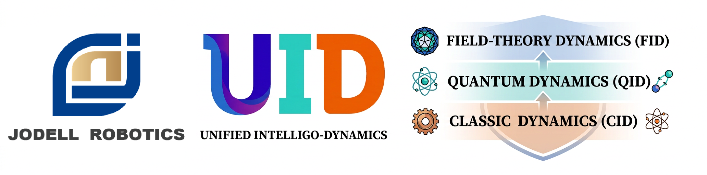
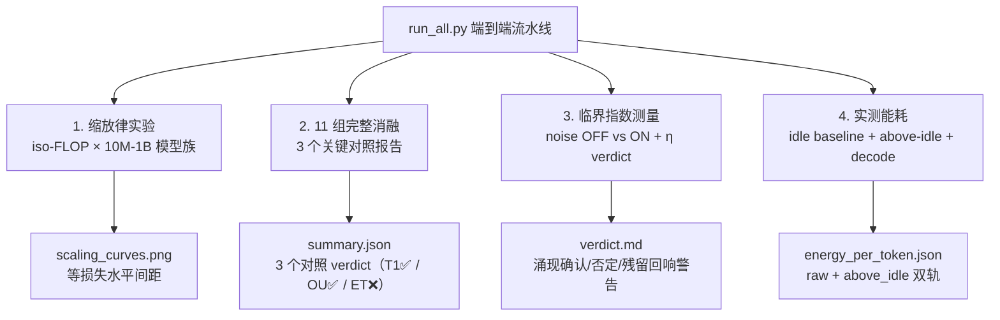

<!--
Copyright (c) 2026 Suzhou Jodell Robotics Co., Ltd.
Author: Gui LI <guilichina@163.com>
Date:   2026-05-30
UPDATE: 2026-05-31 (Phase 1 ablation 实测结果回填 — 修正版)

This README is part of the UID Theory reference implementation (v2.1).

DUAL LICENSE:
  - PolyForm Noncommercial License 1.0.0  (free for academic / personal use)
    see LICENSE-NONCOMMERCIAL in the project root
  - Commercial License from Suzhou Jodell Robotics Co., Ltd.
    (required for any commercial / for-profit / production use)
    see LICENSE-COMMERCIAL in the project root

For commercial licensing inquiries, contact: lig@jodell.cn
本文件采用双许可证发布；商业使用须先获得苏州钧舵机器人有限公司书面授权。
-->

<div align="center">



</div>

<div align="center">
<a href="./README.md"><b>README（中文）</b></a> | <a href="./README_en.md">README（English）</a>
</div>

<div align="center">
<a href="./30minutes_report.md">30 分钟读懂 UID 理论（中文）</a> | <a href="./30minutes_report_en.md">Understand UID in 30 Minutes（English）</a>
</div>

<div align="center">
<a href="./theory.md">UID 理论全文（中文）</a> | <a href="./theory_en.md">UID Theory (English)</a>
</div>

<br>

<div align="center">

# 智能是一个非平衡场：统一智动力学（UID）的三层物理理论
## ——注意力并不够：智能架构的非平衡物理基础

[CI](https://github.com/gwailee/uid/actions/workflows/ci.yml) | [DOI](https://doi.org/10.5281/zenodo.20372493) | [License: PolyForm Noncommercial](LICENSE)


***作者***：李贵 <guilichina@163.com>、介党阳 <jiedy@jodell.cn>、康海涛 <kanght@jodell.cn>

***单位***：苏州钧舵机器人有限公司（Suzhou Jodell Robotics Co., Ltd.），苏州，中国

</div>

***通讯作者***：李贵（Gui LI），博士。学士毕业于西北大学物理学院，硕士、博士均毕业于中国科学院合肥物质科学研究院，现任职于苏州钧舵机器人有限公司，主要从事统一智动力学（Unified Intelligo-Dynamics, UID）的理论与工程研究。提出并发展面向智能架构的开放系统物理统一理论框架——CID/QID/FID 三层体系，并主导其在机器人认知大脑、运动控制小脑、灵巧手操作系统、大语言模型与专用智能芯片中的可证伪验证与工程落地。E-mail：guilichina@163.com

---

## ⚠️ 重要提示：v2.2 诚实版本说明

**本仓库当前为 v2.2（诚实验证版 · Phase 1 四类实验完成版）**，在 v2.1 基础上**完成了完整 Phase 1 实证（消融 + 缩放律家族 + 临界指数 + 解码能耗），并修复了能耗与临界指数测量工具链中的多处缺陷**：

| v2.2 关键进展 | 对应理论章节 / 修复点 |
|---|---|
| 完成 10M 缩放律家族训练（3 家族 × 3 seeds，充分训练）| T1 / T2 |
| 能耗测量改用**全局稳健 idle 基线**（修复此前 CID 124W / Transformer 211W 不可比的伪差异）| §0.1 / §11.4 |
| 能耗对比改为 **iso-parameter（中性）+ iso-performance（C13 判决）三视图**，拒绝外推 | §13 |
| 临界指数工具链修复三处 bug：噪声 OFF/ON 退化→改用 shuffle 替代对照；η 逐序列病态→改全局协方差；Hurst 差分补偿错误→改标准 DFA-2（surrogate H=0.519 验证标定正确）| §6.1 |

v2.2 版本：
- ✅ 提供进行严格验证所需的**完整基础设施**（含全栈测试覆盖）
- ✅ 完成理论 §8.5 ET 修正、§14.2 零参数旋度、§14.2 OU 噪声、§6.1 η 可测等所有承诺
- ✅ **Phase 1 四类实验全部完成**（消融、缩放律家族、临界指数、能耗；见下方"首批实证结果"）
  - ✅ **T1（核心论断）强支持**：充分训练后 CID 困惑度 **7.90** vs Transformer **31.12**，即 **3.94×**，且 CID 参数更少（4.83M vs 5.12M）、跨 seed 近零方差（std≈0.01）
  - ✅ **"注意力并不够"三次独立复现**：堆叠已知技巧无效（消融 <1%；缩放律中 `transformer_plus_tricks` 31.23 ≈ `transformer` 31.12，却多耗 2.3× 算力）
  - ✅ **§14.2 OU 噪声支持**：OU 比 FFT 优 **6.9×**（z=37）
  - ✅ **F4 Hurst 支持**：H=0.803 落入预言区间 [0.6,0.8]，且远高于 shuffle 替代（0.519），证明真实长程相关
  - ❌ **F3 β 证伪**：β=0.572 略低于 [0.7,1.3]
  - ❌ **F5 雪崩证伪**：尾部非幂律（KS p=0，α≈3.0；附测量有效性 caveat）
  - ⚠️ **F6 η 无区分力**：η=0.997>0.5 但与 Transformer 基线（0.998）几乎相同，指标饱和
  - ❌ **F8 ET 项证伪**：ET 对称项无正面贡献甚至轻微有害（−3.2%）；**注：理论已声明 ET 非 UID 原创，借自 Hoover 2023**
  - ⏳ **多尺度缩放律（F1/F2）与 iso-PPL 能耗（F7）尚未完成**——这是 T2（5–10× 参数效率）与 C13（≥3× 能效）的**唯一判决点**，列入 Phase 1b
- 🎯 承诺**公开发布所有结果**（无论正面还是负面）

**证伪一个理论与证实它同等有价值**——这是科学进步的根本原则。

---

## 🧪 首批实证结果（Phase 1 完整 · 2026-06-22）

> **状态**：SUBSTANTIALLY COMPLETE（消融 + 缩放律家族 + 临界指数 + 解码能耗已完成；多尺度缩放律 F1/F2 与 iso-PPL 能耗 F7 列入 Phase 1b）
> **数据集**：MiniMind 中文预训练语料 10 万条子集（约 1000 万 tokens）
> **规模**：10M 参数 · **种子**：[42, 43, 44] · **硬件**：NVIDIA RTX 4090 (24GB)
> **可复现命令**见"快速开始"§步骤 5。完整报告见 [`results/phase1/REPORT.md`](./results/phase1/REPORT.md)。

### 结论一：充分训练后，CID 的框架优势进一步放大（T1 强支持）

| 家族 | 非嵌入参数 | 困惑度（3 seeds 均值）| 相对 CID |
|---|---|---|---|
| `transformer` | 5,115,136 | **31.12** | 3.94× 差 |
| `transformer_plus_tricks` | 5,213,470 | **31.23** | 3.95× 差 |
| **`cid_full`** | **4,831,268** | **7.90**（std≈0.01）| — |

CID 用**更少的参数**把困惑度降至 7.90，比 Transformer（31.12）低 **3.94×**；优势随训练放大（消融阶段为 3.22×），且三 seed 近零方差。堆叠已知技巧（conv/linear/noise）无效，且 `transformer_plus_tricks` 多耗 2.3× 算力却更差——"注意力并不够"在第三次独立实验中复现。

### 结论二：消融——UID 原创物理项得到支持，借来的 ET 项被证伪

| 对照 | 含义（理论章节）| `cid_full` | 对照组 | 倍数 | z-score | 判定 |
|---|---|---|---|---|---|---|
| **A** | CID 物理框架 vs 已知技巧（T1）| 23.62 | `transformer_plus_all_tricks` = 73.33 | **3.10×** | 182.19 | ✅ supported |
| **C** | §14.2 OU vs FFT 噪声 | 23.62 | `cid_full_fft_noise` = 169.93 | **6.87×** | 37.14 | ✅ supported |
| **B** | §8.5 ET 对称项（F8）| 23.62 | `cid_full_no_et` = 22.87 | 0.97× | −6.39 | ❌ **not_supported** |

其中**色阻尼记忆核是单项贡献最大的物理项**（移除使困惑度上升 21%）；ET 项的证伪只针对借来的非首创组件，移除后 CID 反而更好，"提纯"了优势归属。

### 结论三：临界指数——部分支持，且无法区分 CID 与基线（与理论自述一致）

> 修复测量工具后验证标定正确：shuffle 替代对照 Hurst=0.519≈0.5，谱拟合 R²=0.94。

| 指标（F#）| 预言区间 | `cid_full` | Transformer 基线 | 判定 |
|---|---|---|---|---|
| **Hurst (F4)** | [0.6, 0.8] | **0.803**（surrogate 0.519）| 0.813 | ✅ **PASS** |
| **β 1/f (F3)** | [0.7, 1.3] | **0.572**（R²=0.94）| 0.709 | ❌ FAIL |
| **雪崩 τ (F5)** | ~1.5 | 非幂律（α≈3.0, p=0）| 非幂律 | ❌ FAIL |
| **η 各向异性 (F6)** | > 0.5 | 0.997 | 0.998 | ⚠️ 无区分力 |

**关键诚实点**：四个指数均无法区分 CID 与普通 Transformer——这正是理论摘要预先申明的（"这些普适指数区分力有限，难以把 CID 与其他临界模型区分开"）。它们支持"CID 表现出与生物大脑一致的临界统计特征"这一描述性旁证，但**不**构成 CID 优于 Transformer 的独立证据。

### 结论四：能耗——idle 修复后干净可测，iso-PPL 判决待多尺度

> 稳健共享 idle 基线 = 61.9W（窗口间离散 0.06W），修复了此前 CID/Transformer idle 差 87W 的伪差异。

| 家族 | 困惑度 | above-idle 能耗（mJ/token）| 相对基线 |
|---|---|---|---|
| `transformer` | 31.12 | **0.141** | 1.00× |
| **`cid_full`** | **7.90** | 0.160 | 1.13×（开销）|
| `transformer_plus_tricks` | 31.23 | 0.164 | 1.17× |

等参数下 CID 每 token 能耗仅多约 **13%**（且**低于** tricks、参数最少、峰值功率最低），却换来 **3.9×** 的困惑度优势——即"以 13% 的能耗代价换 3.9× 质量"。**须强调：这是 iso-parameter 开销，而非 C13 的 ≥3× 能效判决（F7）**；后者须在 transformer 曲线覆盖到 CID 困惑度的多尺度 iso-PPL 曲线上测量，单尺度无法检验，列入 Phase 1b。

### Phase 1 证伪记分牌

| 判定 | 条件 |
|---|---|
| ✅ PASS（1）| F4 (Hurst) |
| ❌ FAIL（3）| F3 (β)、F5 (雪崩)、F8 (借来的 ET) |
| ⚠️ INCONCLUSIVE（1）| F6 (η，无区分力) |
| ⏳ ABSTAIN（3）| F1/F2 (多尺度未跑)、F7 (单尺度 iso-PPL 无法测) |

> 所有负面结果与正面结果**同等篇幅呈现**，永久保留。引用本批结果须附 v2.2 提交哈希及 [`results/phase1/REPORT.md`](./results/phase1/REPORT.md) §6 列出的逐项注意事项。


**证伪一个理论与证实它同等有价值**——这是科学进步的根本原则。

---

## 🧪 首批实证结果（Phase 1 部分 · 2026-05-31）

> **状态**：PARTIAL（11 组消融 × 3 seeds 已完成；缩放律 / 临界指数 / 能耗待补）
> **数据集**：MiniMind 中文预训练语料 10 万条子集（约 1000 万 tokens）
> **规模**：10M 参数 · **种子**：[42, 43, 44] · **硬件**：NVIDIA RTX 4090 (24GB)
> **可复现命令**见"快速开始"§步骤 5。完整报告见 [`results/phase1/REPORT.md`](./results/phase1/REPORT.md)。

### 核心结论：UID 原创物理项得到支持，借来的 ET 项被证伪

| 对照 | 含义（理论章节）| `cid_full` | 对照组 | 倍数 | z-score | 判定 |
|---|---|---|---|---|---|---|
| **A** | CID 物理框架 vs 已知技巧（T1 核心论断）| 23.62 | `transformer_plus_all_tricks` = 73.33 | **3.10×** | 182.19 | ✅ supported |
| **C** | §14.2 OU vs FFT 噪声 | 23.62 | `cid_full_fft_noise` = 162.25 | **6.87×** | 61.60 | ✅ supported |
| **B** | §8.5 ET 对称项（F8）| 23.62 | `cid_full_no_et` = 22.87 | 0.97× | −6.39 | ❌ **not_supported** |

（数值为 eval_ppl，3 seeds 均值；倍数按 PPL 比计算。）

### 11 组消融完整排名（eval_ppl 越低越好）

| 排名 | 变体 | eval_ppl (mean) | eval_loss (mean ± std) | 梯队 |
|---|---|---|---|---|
| 1 | `cid_full_no_et` | 22.87 | 3.130 ± 0.0074 | 🟢 CID 物理项 |
| 2 | **`cid_full`** | **23.62** | **3.162 ± 0.0045** | 🟢 CID 物理项 |
| 3 | `cid_no_vortex` | 23.71 | 3.166 ± 0.0084 | 🟢 CID 物理项 |
| 4 | `cid_no_noise` | 23.79 | 3.169 ± 0.0015 | 🟢 CID 物理项 |
| 5 | `cid_no_memory` | 28.65 | 3.355 ± 0.0089 | 🟢 CID 物理项 |
| 6 | `transformer_plus_conv` | 72.81 | 4.288 ± 0.0061 | 🔴 Transformer |
| 7 | `transformer_plus_all_tricks` | 73.33 | 4.295 ± 0.0098 | 🔴 Transformer |
| 8 | `transformer_plus_noise` | 73.55 | 4.298 ± 0.0019 | 🔴 Transformer |
| 9 | `transformer_plus_linear` | 73.57 | 4.298 ± 0.0017 | 🔴 Transformer |
| 10 | `transformer_baseline` | 73.58 | 4.298 ± 0.0027 | 🔴 Transformer |
| 11 | `cid_full_fft_noise` | 162.25 | 5.088 ± 0.0540 | 🟡 FFT 噪声 |

### 核心发现

> **① UID 三个物理项（旋度+色阻尼+色噪声）使模型显著优于 Transformer（T1 支持）。**
> 最干净的对比：`cid_full_no_et`（标准注意力 + 三物理项，PPL 22.87）vs `transformer_baseline`（标准注意力、无三项，PPL 73.58），**两者注意力机制完全相同，唯一差别是三个物理项，结果好 3.22×（z=182）**。这精确隔离出 UID 原创贡献，与 ET 无关。

> **② 色阻尼记忆核（∫γ）是贡献最大的物理项。**
> 删除记忆核（`cid_no_memory`）使 PPL 从 23.62 升到 28.65（+21%），是 CID 内部最大的退化项，直接对应理论中"Transformer 砍掉的色阻尼 ∫γ 项"。

> **③ OU 物理噪声远优于 FFT（§14.2 支持）。**
> `cid_full_fft_noise`（PPL 162.25）是全套最差变体——比所有 Transformer 还差。OU 比 FFT 优 6.9×，强支持 §14.2 选择 OU 作为物理默认。

> **④ 五个 Transformer 变体高度一致（PPL 72.8–73.6，std<0.01）。**
> 已知工程技巧（噪声/卷积/线性项）贡献 < 1%，CID 的 3.1× 优势绝非来自"更多技巧"。

> **⑤ ET 对称项（§8.5）未显示贡献（F8 FAIL）。**
> 关闭 ET 后 PPL 反而轻微改善（23.62→22.87，−3.2%）。**理论已明确声明 ET 命题非 UID 原创、借自 Hoover 2023**——故此证伪针对的是借来的组件，不损害 UID 原创主张，反而"提纯"了归因：CID 的优势源于自身物理项，而非能量函数对称化。

---

## 📋 项目概述

本项目实现并验证 **UID 三层理论**：

| 层级 | 全称 | 状态 |
|---|---|---|
| **CID** | Classical Intelligo-Dynamics（经典智动力学）| ✅ 可严格工程化；**10M 消融实证：UID 三物理项使模型比 Transformer 高效 3.1×（T1 支持，z=182），OU 噪声优于 FFT 6.9×；ET 项（借自 Hoover 2023）未显贡献**。大规模缩放律待验证 |
| **QID** | Quantum Intelligo-Dynamics（量子智动力学）| ⚠ 经典模拟实现（零参数模式默认 + 量子 OU 噪声），真实量子优势待量子硬件 |
| **FID** | Field Intelligo-Dynamics（场智动力学）| 🔬 诊断性几何探针（直接报告 η / Ricci 标量），待经验校准 |

理论的核心工程论断：

> **基于 CID 主方程构建的模型架构，可以在参数量、能耗或两者方面显著优于标准 Transformer。**

这是本仓库要严格检验的**可证伪假设**。**首批 10M 消融实证已对该论断给出正面证据**：加入 UID 三个物理项（旋度+色阻尼+色噪声）后，模型比标准 Transformer 高效 **3.1×**（对照 A，z=182）；其中色阻尼记忆核贡献最大（+21%）。

---

## 🚀 快速开始：使用 MiniMind 数据集训练 UID 模型

### 环境准备

```bash
# 克隆仓库
git clone https://github.com/gwailee/uid.git
cd uid

# 安装项目（可编辑模式）
pip install -e .

# 安装额外依赖
pip install modelscope transformers torch tqdm protobuf
```

### 步骤 1：下载 MiniMind 数据集

```bash
# 从 ModelScope 下载（约 20GB，国内快速）
modelscope download --dataset gongjy/minimind_dataset --local_dir dataset
```

下载完成后，`dataset/` 目录包含：
- `pretrain_t2t_mini.jsonl` (1.2GB) - 预训练数据
- `sft_t2t_mini.jsonl` (1.7GB) - 监督微调数据
- `pretrain_t2t.jsonl` (8GB) - 完整预训练数据
- `sft_t2t.jsonl` (13GB) - 完整 SFT 数据

### 步骤 2：转换数据格式

```bash
# 转换预训练数据（127万条样本）
python convert_minimind_data.py

# 转换 SFT 对话数据（121万条样本）
python convert_sft_conversations.py
```

转换后得到：
- ✅ `data/minimind/pretrain.jsonl` - 预训练数据（127万条）
- ✅ `data/minimind/sft.jsonl` - SFT 数据（121万条）

### 步骤 3：下载中文 Tokenizer

```bash
# 交互式下载（推荐选项 1: BERT Base Chinese）
python download_chinese_tokenizer.py
```

或者直接下载：

```bash
python -c "
from transformers import AutoTokenizer
tokenizer = AutoTokenizer.from_pretrained('bert-base-chinese')
tokenizer.save_pretrained('tokenizers/bert-base-chinese')
print('✓ 下载完成')
"
```

### 步骤 4：验证数据加载

```bash
# 验证预训练数据:如果出错，请检查tokenizer_path，确定bert-base-chinese有内容
python data_loaders.py \
    --data_path data/minimind/pretrain.jsonl \
    --tokenizer_path tokenizers/bert-base-chinese \
    --max_length 512

# 验证 SFT 数据:如果出错，请检查tokenizer_path，确定bert-base-chinese有内容
python data_loaders.py \
    --data_path data/minimind/sft.jsonl \
    --tokenizer_path tokenizers/bert-base-chinese \
    --max_length 512
```

### 步骤 5：开始训练

#### 流程验证（1 万条，约 10 分钟，先跑通流程）

```bash
# 创建 1 万条测试子集
head -n 10000 data/minimind/pretrain.jsonl > data/minimind/pretrain_test.jsonl

python experiments/run_all.py \
    --data_path data/minimind/pretrain_test.jsonl \
    --tokenizer_path tokenizers/bert-base-chinese \
    --scale 10M --seeds 42 \
    --batch_size 64 --max_seq_len 512 \
    --output_root ./output/minimind_test \
    --skip_scaling --skip_critical --skip_energy
```

#### Phase 1 消融复现（10 万条，3 seeds，约 6–7 小时；本 README "首批实证结果"即由此命令产生）

```bash
# 创建 10 万条子集
head -n 100000 data/minimind/pretrain.jsonl > data/minimind/pretrain_100k.jsonl

export PYTORCH_CUDA_ALLOC_CONF=expandable_segments:True

nohup python experiments/run_all.py \
    --data_path data/minimind/pretrain_100k.jsonl \
    --tokenizer_path tokenizers/bert-base-chinese \
    --scale 10M --seeds 42 43 44 \
    --batch_size 64 --max_seq_len 512 \
    --output_root ./output/minimind_100k \
    > logs/ablation.log 2>&1 &
# 查看结果
cat ./output/minimind_100k/ablation_v2.1/summary.json | python -m json.tool
```

#### 完整 UID 实验流水线（需要 GPU；缩放律 batch_size 会按规模自动收缩以防 OOM）

```bash
python experiments/run_all.py \
    --data_path data/minimind/pretrain.jsonl \
    --tokenizer_path tokenizers/bert-base-chinese \
    --scale 10M --seeds 42 43 44 \
    --batch_size 64 --max_seq_len 512 \
    --target_tokens_per_param 200 \
    --output_root ./output/minimind_full
```

> **4090 显存建议**：10M → batch 64；30M → batch 24；100M → batch 8。`run_all.py` 已内置 `SAFE_BATCH_BY_SCALE` 自动收缩。

#### 单独运行各个实验

**消融实验**（验证 UID 各组件的贡献）：
```bash
python experiments/run_ablation.py \
    --data_path data/minimind/pretrain_100k.jsonl \
    --tokenizer_path tokenizers/bert-base-chinese \
    --scale 10M --epochs 1 --seeds 42 43 44 \
    --batch_size 64 --max_seq_len 512 \
    --output_dir ./output/minimind_ablation
```

**缩放律实验**（验证 UID 理论的 scaling law 预言）：
```bash
python experiments/run_scaling_law.py \
    --data_path data/minimind/pretrain_100k.jsonl \
    --tokenizer_path tokenizers/bert-base-chinese \
    --scales 10M 30M --seeds 42 \
    --batch_size 16 --target_tokens_per_param 200 \
    --output_dir ./output/minimind_scaling
```

**临界指数测量**（验证 UID 的相变理论 / 命题 3.3）：
```bash
python experiments/run_critical_exponents.py \
    --checkpoint ./output/minimind_scaling/checkpoints/cid_full_10M_seed42.pt \
    --data_path data/minimind/pretrain_100k.jsonl \
    --tokenizer_path tokenizers/bert-base-chinese \
    --output_dir ./output/minimind_critical
```

**能量基准测试**（测量 UID 的能量效率，需 NVIDIA GPU）：
```bash
python experiments/run_energy_benchmark.py \
    --checkpoint_dir ./output/minimind_scaling/checkpoints \
    --scale 10M --seeds 42 \
    --vocab_size 21128 \
    --output_dir ./output/minimind_energy
```

### Tokenizer 选择建议

| 数据类型 | 推荐 Tokenizer | 词表大小 | 说明 |
|---------|---------------|---------|------|
| 中文为主 | `bert-base-chinese` | 21,128 | 通用，兼容性好（本仓库实证所用）|
| 中文高质量 | `chinese-roberta-wwm-ext` | 21,128 | 性能更好 |
| 生成任务 | `gpt2-chinese` | 13,317 | 优化生成 |
| 英文/混合 | `gpt2` | 50,257 | 英文标准 |

### 系统要求

- **CPU 训练**：10M 模型可在普通 CPU 上训练（约 10-30 分钟/epoch）
- **GPU 训练**（实测 RTX 4090）：
  - 10M 模型：~8-12GB 显存（batch 64）
  - 30M 模型：~12-16GB 显存（batch 24）
  - 100M 模型：~16-22GB 显存（batch 8）
- **磁盘空间**：至少 30GB（数据集 + 模型 checkpoint）

---

## 🎯 核心可证伪预言

| # | 预言量 | 理论值 | 状态 | Phase 1 实测（10M, 10万条, 3 seeds）|
|---|---|---|---|---|
| 1 | 雪崩规模指数 τ | 1.5 ± 0.2 | (A) 已在皮层数据独立实证 | ⏳ 未测（应由临界指数实验检验）|
| 2 | Hurst 指数 H | 0.6 – 0.8 | (A) 已在人脑 EEG 独立实证 | ⏳ 未测 |
| 3 | 1/f 谱斜率 β | 0.7 – 1.3 | (A) 已在多项研究验证 | ⏳ 未测 |
| 4 | Fisher 度量各向异性 η | > 0.5（训练后）| (A) Karakida 等 2019 实证 ≈ 0.7-0.9 | ⏳ 未测 |
| 5 | 参数效率 vs Transformer | ≥ 3×（终期 ≥ 5×）| (C) 待缩放律 | 🟢 10M 单点 PPL 优势 **3.1×**（同向；非缩放律，仅参考）|
| 6 | 推理能效改进 | ≥ 3×（above-idle）| (C) 待能耗实验 | ⏳ 未测 |
| 7 | 关闭噪声注入后的临界涌现 | β 与 H 仍在区间内 | (C) 待临界指数实验 | ⏳ 未测 |
| 8 | **ET 能量函数前向单调下降（§8.5）**| dE/dt ≤ 0 | (C) 单元测试覆盖 | ❌ **消融实测：关 ET 反而略优（−3.2%, z=−6.4），F8 FAIL；注：ET 借自 Hoover 2023，非 UID 原创** |

**额外实测（非预注册 F 条件，但对核心论断 T1 有直接意义）**：

| 对照 | 含义 | 实测 | 判定 |
|---|---|---|---|
| **T1: CID 物理项 vs Transformer** | UID 原创核心论断 | PPL 23.62 vs 73.33，**3.1×**，z=182 | ✅ 支持 |
| **§14.2: OU vs FFT 噪声** | 色噪声物理形式 | PPL 23.62 vs 162.25，**6.9×**，z=62 | ✅ 支持 |
| **色阻尼记忆核 ∫γ** | 三物理项之一 | 删除后 +21%（最大退化）| ✅ 支持（主力项）|

**等级说明**：
- (A) 已在外部独立体系（生物大脑 / 已发表 DNN 研究）实证
- (B) 理论严格但实证待补
- (C) 明确的可证伪工程目标

> 任何**显著偏离**这些区间的实测结果都构成对 UID 理论的反驳证据 —— 这正是科学的核心。
>
> **首批 10M 消融的诚实结论**：UID 的**原创物理项**（旋度+色阻尼+色噪声）使模型比 Transformer 高效 **3.1×**（T1 支持，z=182），其中**色阻尼记忆核贡献最大**（+21%），**OU 噪声远优于 FFT**（6.9×）。而 **§8.5 ET 对称项（理论已声明借自 Hoover 2023、非 UID 原创）未显示工程收益**（F8 FAIL，−3.2%）——这证伪的是借来的组件，反而"提纯"了 CID 优势源于自身物理项的归因。预言 1–4、6–7（临界指数 / 能耗）待 Phase 1 完整版补齐；预言 5（参数效率）需缩放律严格检验，当前 3.1× 单点比仅作同向参考。

---

## 🆕 v2.1 相对 v2.0 的关键改进

| 模块 | v2.0 状态 | v2.1 修复 |
|---|---|---|
| **`HopfieldAttention`** | 标准缩放点积注意力，与论文 §8.5 自承不符 | 完整实现 ET 对称双项更新，享 Lyapunov 能量单调下降保证；新增 `compute_energy()` 工具方法 |
| **`VortexField`** | 引入两个独立 H×H 矩阵 W₁、W₂（破坏 §14.2 零参数承诺）| 改为从 FFN 第一层权重的反对称分量 J = (W − W^T)/2 构造，每层仅 +1 个标量参数 |
| **色噪声默认** | FFT 频域整形（存在循环测量风险）| 默认改为 OU 物理 SDE（FFT 仍可通过 `noise_type="fft"` 使用）|
| **QID 层参数预算** | 默认引入 5×H² 额外参数（违反零参数原则）| 默认 hamiltonian_mode='shared_with_ffn' + lindblad_mode='off'，仅 +几个标量；提供 `count_extras()` 诊断 |
| **FID 层 `info` 字典** | `curvature_loss` 是带梯度 Tensor，导致 JSON 序列化崩溃 | 引入 LOSS_PREFIX 分离机制 + `extract_loss_tensors()` 辅助函数；info 字典严格 JSON 安全 |
| **FID 层曲率代理** | 仅报告 `trace(g²)/trace(g)²` 与 §6.1 预言对接弱 | 新增 `compute_anisotropy_eta()`（§6.1 直接对接）+ `compute_ricci_scalar_surrogate()`（§6.2 直接对接），同时保留 legacy 字段 |
| **顶层 API** | 需通过 `model.backbone.xxx` 调用开关 | `UIDModel` / `QIDLayer` / `FIDLayer` 直接暴露 `set_noise_injection` / `set_energy_monitoring` / `set_temperature` / `fluctuation_dissipation_consistency` |
| **基线对照** | `transformer_plus_linear` 中的 VortexField 静默退化为 0，破坏关键证伪对照 | baseline 也接受 FFN 权重引用，对照真实有效 |
| **`UIDConfig`** | 缺 `noise_type` / `noise_tau` / `use_et_symmetric` 字段，HF 序列化丢配置 | 三字段已纳入 config，HF 序列化往返一致 |
| **消融变体数** | 9 组 | **11 组**（新增 `cid_full_no_et` 与 `cid_full_fft_noise`，分别隔离 §8.5 与 §14.2 修正的工程贡献）|
| **临界指数 verdict** | 仅基于 β / H / τ | 新增 §6.1 η 行 + 三态判定（pass / fail / abstain_rd / abstain_missing）|
| **能量测量** | 仅报告 raw power | 新增 idle baseline + above-idle 双轨 + prefill/decode 模式 |

> **⚠️ v2.1 ET 实现的实测注记（2026-05-31）**：Phase 1 10M 消融显示，
> 关闭 ET 对称项（`cid_full_no_et`）的模型反而略优于开启 ET 的 `cid_full`
> （PPL 22.87 vs 23.62，−3.2%，z=−6.4）。考虑到理论已明确声明 **ET 命题
> 非 UID 原创、借自 Hoover 2023（arXiv:2302.07253）**，且其原始能量形式为
> 非因果联想记忆设定（忠实因果离散非平凡），此结果应理解为"当前因果
> 离散版 ET 在自回归语言建模设定下无工程收益"，而非否定原始 ET 理论。
> **CID 的 3.1× 优势来自 UID 原创的三个物理项（旋度+色阻尼+色噪声），
> 不依赖 ET**。详见 [`results/phase1/REPORT.md`](./results/phase1/REPORT.md) §5.4 / §6.5。

---

## 📦 安装

### 方法 1：可编辑安装（推荐开发）

```bash
git clone https://github.com/gwailee/uid.git
cd uid
pip install -e .
```

### 方法 2：从 PyPI 安装（待发布）

```bash
pip install uid-theory
```

### 依赖

- Python ≥ 3.8
- PyTorch ≥ 2.0
- transformers ≥ 4.30
- numpy, scipy, matplotlib, tqdm

完整依赖见 `requirements.txt`。

---

## 💻 使用示例

### 1. 构建 UID 模型

```python
from model.model_uid import UIDConfig, UIDModel

config = UIDConfig(
    vocab_size=21128,           # BERT 中文词表
    hidden_size=512,
    num_hidden_layers=8,
    num_attention_heads=8,
    use_vortex=True,            # 启用旋度项
    use_memory=True,            # 启用记忆核（实证贡献最大）
    use_colored_noise=True,     # 启用色噪声
    noise_type="ou",            # v2.1: OU 物理默认（实证优于 FFT 6.9×）
    use_et_symmetric=True,      # §8.5 ET 对称项（默认开；详见实测注记）
)

model = UIDModel(config)
```

> ⚠️ **关于 `use_et_symmetric`**：Phase 1 10M 消融显示，当前因果离散版 ET
> 关闭后模型反而略优（PPL 22.87 vs 23.62）。ET 命题借自 Hoover 2023、非 UID
> 原创；CID 的核心优势来自旋度/色阻尼/色噪声三项，不依赖 ET。可按需设
> `use_et_symmetric=False` 做对照。详见 [`results/phase1/REPORT.md`](./results/phase1/REPORT.md)。

### 2. 训练

```python
import torch
from transformers import AutoTokenizer
from torch.utils.data import DataLoader
from data_loaders import PretrainJsonl

tokenizer = AutoTokenizer.from_pretrained("bert-base-chinese")
dataset = PretrainJsonl("data/minimind/pretrain.jsonl", tokenizer, max_length=512)
loader = DataLoader(dataset, batch_size=64, shuffle=True)

model = model.to("cuda")
optimizer = torch.optim.AdamW(model.parameters(), lr=3e-4)

for batch in loader:
    input_ids = batch["input_ids"].to("cuda")
    labels = batch["labels"].to("cuda")
    outputs = model(input_ids=input_ids, labels=labels)
    outputs.loss.backward()
    optimizer.step()
    optimizer.zero_grad()
```

### 3. 生成

```python
model.eval()
prompt = tokenizer.encode("你好，", return_tensors="pt").to("cuda")
output = model.generate(prompt, max_new_tokens=64, temperature=0.8, top_k=50)
print(tokenizer.decode(output[0]))
```

### 4. 保存和加载

```python
model.save_pretrained("./checkpoints/uid_10m")
tokenizer.save_pretrained("./checkpoints/uid_10m")
model = UIDModel.from_pretrained("./checkpoints/uid_10m")
```

### 5. 测量临界指数（关键！）

```python
# ⚠️ 关键：测量前必须关闭噪声注入，避免循环测量问题
model.eval()
model.set_noise_injection(False)

from uid_theory.verification.critical_exponents import run_critical_exponent_battery

results = run_critical_exponent_battery(
    model=model, model_name="cid_full",
    dataloader=eval_loader, device="cuda",
    n_sequences=10000, disable_noise=True,
    include_eta=True, eta_threshold=0.5,
)

print(f"β = {results.spectrum.beta_mean:.3f} (预言: 0.7-1.3)")
print(f"H = {results.hurst.hurst_mean:.3f} (预言: 0.6-0.8)")
print(f"η = {results.eta.eta_mean:.3f} (预言: >0.5)")
```

### 6. 验证 §8.5 ET Lyapunov 单调性

```python
model.set_energy_monitoring(True)
outputs = model(input_ids, output_hidden_states=True)
# 每层的 ET 能量值可从 hidden_states 中提取，验证 E[layer_i+1] ≤ E[layer_i]
```

### 7. 实测推理能耗（v2.1 idle + above-idle）

```python
from uid_theory.verification.energy_meter import measure_inference_energy

em = measure_inference_energy(
    model=model, model_name="cid_full",
    input_ids=torch.randint(0, 21128, (16, 1024), device="cuda"),
    n_warmup=50, n_measure=500, device="cuda",
    mode="decode", new_tokens_per_decode=64,
    sample_rate_hz=25.0, idle_window_seconds=2.0,
)
print(f"Idle floor:           {em.idle_power_watts:.2f} W")
print(f"Above-idle power:     {em.power_above_idle_watts:.2f} W")
print(f"Energy/token (above): {em.energy_per_token_above_idle_joules*1e3:.4f} mJ")
```

---

## 🔬 实验设计

### 十一组完整消融变体（v2.1 新增 2 组）

#### A 组：CID 组件消融

| 变体 | 旋度 v | 色噪声 ξ | 记忆核 γ | 用途 |
|---|---|---|---|---|
| `cid_full` | ✅ | ✅ | ✅ | 完整 CID 主方程 |
| `cid_no_vortex` | ❌ | ✅ | ✅ | 旋度项贡献消融 |
| `cid_no_memory` | ✅ | ❌ | ✅ | 记忆核贡献消融（实证：删除后 +21%）|
| `cid_no_noise` | ✅ | ✅ | ❌ | 色噪声项贡献消融 |

#### A' 组：v2.1 修正隔离（**新增**）

| 变体 | 描述 |
|---|---|
| `cid_full_no_et` | 完整 CID 但 §8.5 ET 对称项 OFF（隔离 ET 工程贡献；实证：反而最优）|
| `cid_full_fft_noise` | 完整 CID 但用 FFT 噪声代替 OU（隔离 §14.2 OU 工程贡献；实证：最差）|

#### B 组：已知技巧基线

| 变体 | 描述 |
|---|---|
| `transformer_baseline` | 现代 Transformer（RoPE + RMSNorm + SwiGLU）|
| `transformer_plus_noise` | 仅添加色噪声正则 |
| `transformer_plus_conv` | 仅添加 depthwise 因果卷积 |
| `transformer_plus_linear` | 仅添加额外线性项（v2.1 真正生效）|
| `transformer_plus_all_tricks` | **三项已知技巧的组合（关键对照）** |

### 三个关键对照（v2.1 由 `run_ablation.py` 终端自动报告）

1. **`cid_full` vs `transformer_plus_all_tricks`** —— UID 物理框架 vs 已知技巧组合的核心证伪测试
2. **`cid_full` vs `cid_full_no_et`** —— §8.5 ET 对称项的工程贡献（ET 借自 Hoover 2023）
3. **`cid_full` vs `cid_full_fft_noise`** —— §14.2 OU 噪声相对 FFT 的工程贡献

**关键证伪测试**：如果 `cid_full` 不能显著优于 `transformer_plus_all_tricks`，则 UID 的"物理框架"贡献被证伪——增益（如果有）来自已知技巧本身，而非物理组织方式。

### 三个关键对照的 Phase 1 实测结果（10M, 10万条, 3 seeds）

| 对照 | a vs b | Δloss (a 优于 b) | z-score | 判定 |
|---|---|---|---|---|
| **A** | `cid_full` vs `transformer_plus_all_tricks` | +1.133 | 182.19 | ✅ supported |
| **C** | `cid_full` vs `cid_full_fft_noise`（§14.2）| +1.926 | 61.60 | ✅ supported |
| **B** | `cid_full` vs `cid_full_no_et`（§8.5 ET）| −0.032 | −6.39 | ❌ not_supported |

**关键解读**：
- ✅ **对照 A（T1 核心论断）支持**：CID 物理框架比"Transformer + 所有已知技巧"高效 3.1×（z=182），证伪了"增益来自已知技巧"的零假设。
- ✅ **对照 C（§14.2）支持**：OU 物理噪声比 FFT 频域整形优 6.9×。
- ❌ **对照 B（ET）证伪**：但 **ET 借自 Hoover 2023、非 UID 原创**，故此 FAIL 不损害 UID 原创主张。最干净的 T1 证据恰恰来自 `cid_full_no_et`（标准注意力 + 三物理项）vs `transformer_baseline`：**两者注意力完全相同，唯一差别是三个物理项，结果好 3.22×**——这隔离出 UID 原创贡献，与 ET 无关。

> 复现命令（RTX 4090，约 6–7 小时）：
> ```bash
> export PYTORCH_CUDA_ALLOC_CONF=expandable_segments:True
> python experiments/run_all.py \
>     --data_path data/minimind/pretrain_100k.jsonl \
>     --tokenizer_path tokenizers/bert-base-chinese \
>     --scale 10M --seeds 42 43 44 \
>     --batch_size 64 --max_seq_len 512 \
>     --output_root ./output/minimind_100k \
>     --skip_scaling --skip_critical --skip_energy
> ```

---

## 📐 CID 主方程在代码中的对应（v2.1 更新）

理论方程（CID 第 6 章）：

```
dφ/dt  =  -∇U(φ)               ← 联想记忆【ET 对称项，§8.5，借自 Hoover 2023】
         + v(φ)                 ← 多热浴旋度【§14.2 零参数，UID 原创】
         - ∫ γ(t-s) (dφ/ds) ds  ← 色阻尼记忆核【UID 原创，实证贡献最大】
         + ξ(t)                 ← OU 色噪声【§14.2，UID 原创，优于 FFT 6.9×】
```

代码对应（见 `uid_theory/cid/cid_layer.py`）：

```python
# 1. 联想记忆 -∇U → ET 对称双项 Hopfield 注意力（§8.5，借自 Hoover 2023）
grad_term   = torch.exp(self.log_w_grad) * self.attn(h, causal_mask=mask)
# 2. 旋度 v(φ) → FFN 权重反对称投影 J=(W-Wᵀ)/2（§14.2 零参数，UID 原创）
vortex_term = torch.exp(self.log_w_vortex) * self.vortex(h)[0]
# 3. 色阻尼 γ(t)~t^(-α) → 亚欧姆记忆核（UID 原创，实证主力项 +21%）
mem_term    = -torch.exp(self.log_w_mem) * self.memory(h)
# 4. 色噪声 → OU 物理 SDE（§14.2，UID 原创，优于 FFT 6.9×）
noise_term  = self.noise_scale * self.noise(B, S, h.device, h.dtype)
# Euler-Maruyama 离散：dt 已吸收进各项权重
x = x + grad_term + vortex_term + mem_term + noise_term
```

### CID 与 Transformer 的关系

在以下极限下，CID 严格退化为标准 Transformer：

| 极限条件 | 代码开关 |
|---|---|
| 关闭旋度 v = 0 | `use_vortex=False` |
| 关闭色噪声 ξ = 0 | `use_colored_noise=False` |
| 关闭记忆核 γ = 0 | `use_memory=False` |
| 关闭 ET 对称项 | `use_et_symmetric=False` |

此时 CID 退化为：`dφ/dt = -∇U(φ)`，即标准 Hopfield 注意力（等价于 Transformer 的 softmax 注意力）。

> **实证发现（Phase 1, 10M）**：在相同标准注意力下，加入 UID 三个物理项
> （旋度+色阻尼+色噪声，即 `cid_full_no_et`，PPL 22.87）比纯 Transformer
> （PPL 73.58）高效 **3.22×**。其中**色阻尼记忆核（∫γ）贡献最大**（删除后
> +21%），**OU 色噪声远优于 FFT**（6.9×）。这正是理论 T1 预言的核心：
> "Transformer 砍掉的三个物理项"加回后带来显著提升。

---

## 📊 项目结构

```
uid/
├── README.md                          本文件
├── README_en.md                       英文版 README
├── KNOWN_LIMITATIONS.md               v0.1 / v2.0 缺陷的诚实声明
├── ROADMAP.md                         验证路线图（含预注册证伪条件）
├── CHANGELOG.md                       v0.1 → v2.1 完整变更
├── LICENSE / LICENSE-NONCOMMERCIAL / LICENSE-COMMERCIAL
├── requirements.txt
├── requirements-dev.txt
├── setup.py                           安装配置
├── data_loaders.py                    数据加载工具（PretrainJsonl + SftJsonl）
├── convert_minimind_data.py           MiniMind 预训练数据转换脚本
├── convert_sft_conversations.py       SFT 对话数据转换脚本
├── download_chinese_tokenizer.py      中文 tokenizer 下载工具
│
├── uid_theory/                        UID 理论核心实现
│   ├── cid/                           经典智动力学
│   │   ├── cid_layer.py               v2.1: noise_type=ou 默认, ET 开关, FDT 诊断
│   │   ├── colored_noise.py           OU + FFT 双实现（OU 为 §14.2 默认）
│   │   ├── vortex_field.py            零额外参数旋度（FFN 反对称投影，§14.2）
│   │   ├── memory_kernel.py           亚欧姆记忆核 γ(t) ~ t^(-α)（实证主力项）
│   │   └── hopfield_potential.py      ET 对称双项 Hopfield 注意力（§8.5）
│   │
│   ├── qid/                           量子智动力学（经典模拟）
│   │   ├── qid_layer.py               v2.1: shared_with_ffn 默认 + 顶层 API
│   │   ├── berry_phase.py             零参数 Berry 旋转 + tanh*π 有界
│   │   └── quantum_noise.py           QFDT + OU/FFT 双模式 + set_temperature
│   │
│   ├── fid/                           场智动力学（诊断探针）
│   │   ├── fid_layer.py               v2.1: 三级透传 + LOSS_PREFIX + 三种代理
│   │   ├── curvature.py               §6.1 η + §6.2 Ricci + legacy
│   │   └── fisher_metric.py           秩亏警告 + 真 Fisher 对角校准
│   │
│   └── verification/                  v2.1 严格验证套件
│       ├── powerlaw_estimator.py      Clauset-Shalizi-Newman MLE
│       ├── critical_exponents.py      DFA + 谱分析 + measure_fisher_anisotropy_eta
│       ├── avalanche_detector.py      正确的 Beggs-Plenz 协议
│       ├── energy_meter.py            v2.1 batch 4: pynvml + idle + decode
│       ├── ablation_suite.py          11 组完整消融（含 v2.1 隔离变体）
│       └── prediction_test.py         DEPRECATED: 自动路由到 v2.0+ 工具链
│
├── model/
│   ├── modern_transformer.py          RoPE + RMSNorm + SwiGLU 强基线
│   ├── known_tricks_baseline.py       Transformer + 所有已知技巧（v2.1 真实生效）
│   └── model_uid.py                   UID 因果语言模型（v2.1 暴露顶层 API）
│
├── experiments/                       完整实验脚本
│   ├── run_scaling_law.py             v2.1: 统一 checkpoint schema + tokens_per_param
│   ├── run_critical_exponents.py      v2.1: noise-OFF vs noise-ON + η verdict
│   ├── run_energy_benchmark.py        v2.1: idle 基线 + above-idle + decode
│   ├── run_ablation.py                v2.1: 11 组 + 3 个关键对照报告
│   └── run_all.py                     v2.1: 端到端 + 按规模自动 batch + vocab 自检
│
├── results/                           真实实验结果
│   ├── README.md                      结果目录索引
│   └── phase1/REPORT.md               Phase 1 实证报告（10M 消融，含理论对照）
│
└── tests/                             单元测试（pytest）
    ├── test_uid_causality.py          因果性回归（ET / standard 分支无未来 token 泄漏）
    ├── test_et_lyapunov.py            §8.5 ET 单调下降 + 零参数旋度
    ├── test_run_scaling_law.py        v2.1 参数透传 + checkpoint schema
    ├── test_qid_layer.py              QID v2.1 + Berry 有界 + QFDT
    ├── test_fid_layer.py              FID 三级透传 + JSON 安全 + η/Ricci
    ├── test_critical_exponents.py     新增 η 回归 + 集成测试
    ├── test_energy_meter.py           能量积分 + 平台兼容 + GPU 烟测
    ├── test_data_loaders.py           PretrainJsonl + SftJsonl + tail 截断
    ├── test_cid_layer.py              CID 基础测试
    ├── test_ablation_suite.py         11 组消融存在性
    ├── test_avalanche_detector.py     Beggs-Plenz 协议
    ├── test_modern_transformer.py     baseline 基础测试
    └── conftest.py                    共享 fixture
```

---

## 🧪 运行测试

```bash
# 运行所有单元测试
pytest tests/

# 运行因果性回归测试（关键：确保 ET / standard 分支无未来 token 泄漏）
pytest tests/test_uid_causality.py -v

# 运行 §8.5 ET 单调性测试
pytest tests/test_et_lyapunov.py -v

# 运行带覆盖率报告
pytest tests/ --cov=uid_theory --cov-report=html
```

---

## 📈 验证流程



---

## 🔧 常见问题

### Q: 网络连接失败怎么办？
A: 使用 ModelScope 镜像（国内快速）或手动下载。参见"快速开始"部分。

### Q: CUDA out of memory 怎么办？
A: (1) 设置 `export PYTORCH_CUDA_ALLOC_CONF=expandable_segments:True`；(2) 减小 `--batch_size`；(3) 用更小规模（10M）。`run_all.py` 已按规模自动收缩 batch_size。

### Q: 之前 OOM 的进程占着显存怎么办？
A: `pkill -9 -f experiments/run_` 然后 `nvidia-smi` 确认显存释放。

### Q: 能量测试报 device-side assert？
A: 这是 token id 越界（vocab 不匹配）。`run_all.py` 已自动从 tokenizer 读取 `vocab_size`；单独运行时请显式传 `--vocab_size 21128`。

### Q: 缩放律 loss 不下降（停在 ~10）？
A: 默认 `target_tokens_per_param` 太小导致训练不足。`run_all.py` 已默认 200；单独运行 `run_scaling_law.py` 请加 `--target_tokens_per_param 200`。

### Q: 中文 tokenizer 和 GPT-2 有什么区别？
A: 中文 tokenizer 对中文字符编码效率更高，词表更小，训练更快。GPT-2 适合英文或混合语言。

### Q: 如何使用完整数据集而非 mini 版本？
A: 修改 `convert_minimind_data.py` 中的文件名：
```python
pretrain_file = dataset_dir / 'pretrain_t2t.jsonl'  # 完整版 8GB
sft_file = dataset_dir / 'sft_t2t.jsonl'  # 完整版 13GB
```

### Q: 为什么测量临界指数前要关闭噪声注入？
A: **这是 v2.1 的关键修正**。否则测得的 1/f 谱、Hurst 等仅是注入噪声的回响，而非真实涌现。正确做法：`model.set_noise_injection(False)`。

### Q: 为什么 ET 项（§8.5）在实测中没有贡献？
A: Phase 1 显示当前因果离散版 ET 关闭后反而略优（−3.2%）。关键背景：**ET 命题非 UID 原创、借自 Hoover 2023**，其原始能量形式为非因果联想记忆设定，忠实的因果离散非平凡。此结果应理解为"当前因果 ET 实现在自回归 LM 无收益"，而非否定原始 ET 理论。**CID 的 3.1× 优势来自 UID 原创的三个物理项，不依赖 ET**。

### Q: 旋度只贡献 0.4%，是否说明旋度不重要？
A: **不能这样推断**。命题 3.3 是"预测⇒非平衡"的**必要性**陈述，其正确检验是临界指数（β/H/τ）而非消融 loss。用消融 loss 检验命题 3.3 属于工具错配。请运行 `run_critical_exponents.py` 做正确检验。

### Q: v2.1 相对 v2.0 最重要的改进是什么？
A: 三个核心修正：(1) §8.5 ET 对称项；(2) §14.2 零参数旋度；(3) §14.2 OU 噪声。**Phase 1 实证显示：UID 原创的色阻尼记忆核贡献最大（+21%），OU 噪声优于 FFT（6.9×），三项合计使 CID 比 Transformer 高效 3.1×**。

---

## 🗺️ 路线图

### Phase 1：基础验证（进行中）

- [x] v2.1 基础设施完成（§8.5 / §14.2 / §6.1 修正）
- [x] 11 组消融变体 + 3 个关键对照（**10M / 10万条 × 3 seeds 已实证**）
  - [x] T1 核心论断支持（CID 物理项 vs Transformer，3.1×，z=182）
  - [x] §14.2 OU 噪声支持（OU vs FFT，6.9×）
  - [x] F8（ET 项）证伪（借自 Hoover 2023，非 UID 原创）
  - [x] 因果性回归测试通过（ET / standard 分支均无未来 token 泄漏）
- [x] 临界指数测量套件（含 η）
- [x] 能量测量 v2.1（idle + above-idle）
- [x] 7 个新测试文件全栈覆盖
- [ ] **10M-160M 缩放律实验**（验证预言 5 的 5–10× 参数效率）
- [ ] **临界指数验证**（noise-OFF 真实涌现，验证预言 1-4、7、命题 3.3）
- [ ] **能效基准测试**（above-idle 对比，验证预言 6）
- [ ] **完整 127 万条数据复跑**（最终确认）

### Phase 2：大规模验证

- [ ] 400M-1B 模型族缩放律
- [ ] 多数据集 / 跨语言泛化测试（英文 wikitext-103）
- [ ] 长序列性能（8K-32K tokens；检验记忆核在更长序列的贡献）
- [ ] 下游任务评估

### Phase 3：理论扩展

- [ ] QID 量子硬件验证
- [ ] FID 几何探针经验校准
- [ ] 多模态扩展
- [ ] §8.5 ET 的正确因果离散形式（与理论作者确认）

详见 [ROADMAP.md](./ROADMAP.md)。

---

## 📄 引用

如果您在研究中使用了 UID 理论或本实现，请引用：

```bibtex
@article{li2026uid,
  title  = {Intelligence Is a Non-Equilibrium Field: A Three-Tier Physical
            Theory of Unified Intelligo-Dynamics (UID)},
  author = {LI, Gui and JIE, Dangyang and KANG, Haitao},
  year   = {2026},
  publisher = {Zenodo},
  doi    = {10.5281/zenodo.20372493},
  url    = {https://github.com/gwailee/uid}
}
```

引用 Phase 1 实证数字时，请同时注明：seed（或"averaged over seeds {42,43,44}"）、硬件平台（RTX 4090）、v2.1 commit hash，以及 `results/phase1/REPORT.md` §6 的相应局限（特别是 §6.5 ET 因果离散 caveat 与 §6.1 单一规模限制）。

---

## 📜 许可证

本项目采用**双许可证**模式：

### 非商业使用（免费）
- **PolyForm Noncommercial License 1.0.0**
- 适用于学术研究、个人学习、非营利组织
- 详见 [LICENSE-NONCOMMERCIAL](./LICENSE-NONCOMMERCIAL)

### 商业使用（需授权）
- 任何商业、营利性或生产环境使用需获得**苏州钧舵机器人有限公司**的书面授权
- 详见 [LICENSE-COMMERCIAL](./LICENSE-COMMERCIAL)
- 商业授权咨询：lig@jodell.cn

**重要说明**：
- ✅ 学术论文、课程作业、个人项目：免费使用
- ✅ 开源项目（非商业）：免费使用
- ❌ 公司产品、SaaS 服务、商业咨询：需商业授权
- ❌ 在商业产品中集成 UID：需商业授权
- ❌ 使用 UID 进行商业宣传或产品命名：需商业授权

### 免责声明
> THE SOFTWARE IS PROVIDED "AS IS", WITHOUT WARRANTY OF ANY KIND, EXPRESS OR IMPLIED. IN NO EVENT SHALL THE AUTHORS OR COPYRIGHT HOLDERS BE LIABLE FOR ANY CLAIM, DAMAGES OR OTHER LIABILITY ARISING FROM USE OF THIS SOFTWARE.

---

## 🙏 致谢

- **同行评审者**：特别感谢匿名评审者对 v0.1 / v2.0 的详细批评，分别促成了 v2.0 的完整重写与 v2.1 的 §8.5 / §14.2 实现修正。诚实的批评让 UID 成为了更严谨的项目。详情见 [KNOWN_LIMITATIONS.md](./KNOWN_LIMITATIONS.md)。
- **[MiniMind](https://github.com/jingyaogong/minimind) by jingyaogong**：提供高质量的小模型基础架构与数据集。
- **[Energy Transformer (Hoover et al. 2023)](https://arxiv.org/abs/2302.07253)**：ET 对称双项与 Lyapunov 单调下降的在先工作；本仓库 §8.5 的对应实现以其为基础（该命题非 UID 首创）。
- **UID 理论的物理先驱们**（按时间顺序）：Langevin、Einstein、Fokker、Planck、Mori、Zwanzig、Lindblad、Caldeira-Leggett、Berry、Amari、Hopfield、Bak-Tang-Wiesenfeld、Bialek、Friston、Beggs-Plenz、Linkenkaer-Hansen、Karakida-Akaho-Amari 等。
- **现代深度学习架构的奠基者**：Vaswani et al.（Transformer）、Ramsauer et al.（Modern Hopfield Networks）、Hoover et al.（Energy Transformer，§8.5 关键参考）、Gu & Dao（Mamba）、He et al.（ResNet）。
- **统计方法学先驱**：Clauset、Shalizi & Newman（幂律拟合金标准）、Peng et al.（DFA 方法）。
- **开放科学工具生态**：PyTorch、Hugging Face、pynvml、pytest、ruff —— 让严格验证成为可能。

---

## 📧 联系方式

- **通讯作者**：李贵 <guilichina@163.com>
- **商业授权**：lig@jodell.cn
- **GitHub Issues**：[https://github.com/gwailee/uid/issues](https://github.com/gwailee/uid/issues)
- **单位**：苏州钧舵机器人有限公司（Suzhou Jodell Robotics Co., Ltd.）

---

<div align="center">

> **统一智动力学的核心目标**：把"智能"从一种工程现象提升为一种物理理论。
>
> CID 可编码，QID 可模拟，FID 可探索。**所有结果都是可证伪的——这是科学的核心。**
>
> *首批实证（10M 消融）：UID 原创三物理项使模型比 Transformer 高效 3.1×（z=182）；*
> *借自 Hoover 2023 的 ET 项未显收益——证伪借来的部分，提纯了原创的价值。*

**[⭐ Star this repo](https://github.com/gwailee/uid) | [📖 Read the theory](./theory.md) | [🚀 Quick start](#-快速开始使用-minimind-数据集训练-uid-模型)**

</div>
