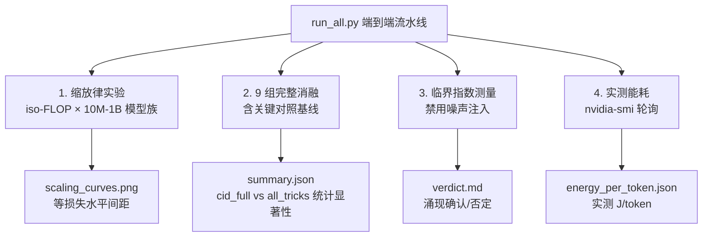

<!--
Copyright (c) 2026 Suzhou Jodell Robotics Co., Ltd.
Author: Gui LI <guilichina@163.com>
Date:   2026-05-30
UPDATE: 2026-05-28
  * Code mapping table updated to v2.1: OU noise default, zero-extra-
    parameter vortex from FFN antisymmetric projection, ET-symmetric
    dual-term Hopfield attention per Theory §8.5.
  * Top-level API examples updated to use UIDModel.set_noise_injection
    and UIDModel.set_energy_monitoring.

This README is part of the UID Theory reference implementation (v2.1).

DUAL LICENSE:
  - PolyForm Noncommercial License 1.0.0  (free for academic / personal use)
    see LICENSE-NONCOMMERCIAL in the project root
  - Commercial License from Suzhou Jodell Robotics Co., Ltd.
    (required for any commercial / for-profit / production use)
    see LICENSE-COMMERCIAL in the project root

For commercial licensing inquiries, contact: lig@jodell.cn
本文件采用双许可证发布；商业使用须先获得苏州钧舵机器人有限公司书面授权。
-->

<div align="center">


</div>

<div align="center">
<a href="./README.md"><b>README（中文）</b></a> | <a href="./README_en.md">README（English）</a>
</div>

<div align="center">
<a href="./30minutes_report.md">30 分钟读懂 UID 理论（中文）</a> | <a href="./30minutes_report_en.md">Understand UID in 30 Minutes（English）</a>
</div>

<div align="center">
<a href="./theory.md">UID 理论全文（中文）</a> | <a href="./theory_en.md">UID Theory (English)</a>
</div>

<br>

<div align="center">

# 智能是一个非平衡场：统一智动力学（UID）的三层物理理论
## ——注意力并不够：智能架构的非平衡物理基础

[CI](https://github.com/gwailee/uid/actions/workflows/ci.yml) | [DOI](https://doi.org/10.5281/zenodo.20372493) | [License: PolyForm Noncommercial](LICENSE)


***作者***：李贵 <guilichina@163.com>、介党阳 <jiedy@jodell.cn>、康海涛 <kanght@jodell.cn>

***单位***：苏州钧舵机器人有限公司（Suzhou Jodell Robotics Co., Ltd.），苏州，中国

</div>

***通讯作者***：李贵（Gui LI），博士。学士毕业于西北大学物理学院，硕士、博士均毕业于中国科学院合肥物质科学研究院，现任职于苏州钧舵机器人有限公司，主要从事**统一智动力学（Unified Intelligo-Dynamics, UID）**的理论与工程研究。提出并发展面向智能架构的开放系统物理统一理论框架——CID/QID/FID 三层体系，并主导其在机器人认知大脑、运动控制小脑、灵巧手操作系统、大语言模型与专用智能芯片中的可证伪验证与工程落地。E-mail：guilichina@163.com

---

## ⚠️ 重要提示：v2.1 诚实版本说明

**本仓库当前为 v2.1（诚实验证版 + 理论 §8.5 / §14.2 修正版）**，是基于详细同行评审反馈对 v0.1 的完整重写，并在 v2.0 基础上修复了三处与理论文档不符的实现缺陷：

| v2.1 关键修正 | 对应理论章节 |
|---|---|
| `HopfieldAttention` 实现 **ET 对称双项更新**（享 Lyapunov 单调下降保证）| §8.5 |
| `VortexField` 改为**从 FFN 第一层权重反对称投影**构造，零额外矩阵参数 | §14.2 |
| 色噪声默认改为 **Ornstein-Uhlenbeck 物理 SDE**（FFT 版本保留为 legacy）| §14.2 |

v0.1 版本的验证套件存在方法学缺陷，使其"已验证"声明在科学上站不住脚。详情见 [KNOWN_LIMITATIONS.md](./KNOWN_LIMITATIONS.md)。**v0.1 的任何实证主张都不应被引用为已验证**。

v2.1 版本：
- ✅ 提供了进行严格验证所需的**完整基础设施**
- ✅ 完成了对理论 §8.5 ET 修正、§14.2 零参数旋度、§14.2 OU 噪声三项的代码落地
- ⏳ 大规模验证实验**尚未完成**
- 🎯 承诺**公开发布所有结果**（无论正面还是负面）

**证伪一个理论与证实它同等有价值**——这是科学进步的根本原则。

---

## 📋 项目概述

本项目实现并验证 **UID 三层理论**：

| 层级 | 全称 | 状态 |
|---|---|---|
| **CID** | Classical Intelligo-Dynamics（经典智动力学）| ✅ 可严格工程化，待大规模实验验证 |
| **QID** | Quantum Intelligo-Dynamics（量子智动力学）| ⚠ 经典模拟实现，真实量子优势待量子硬件 |
| **FID** | Field Intelligo-Dynamics（场智动力学）| 🔬 诊断性几何探针，待经验校准 |

理论的核心工程论断：

> **基于 CID 主方程构建的模型架构，可以在参数量、能耗或两者方面显著优于标准 Transformer。**

这是本仓库要严格检验的**可证伪假设**。

---

## 🎯 核心可证伪预言

| # | 预言量 | 理论值 | 状态 |
|---|---|---|---|
| 1 | 雪崩规模指数 τ | 1.5 ± 0.2 | (A) 已在皮层数据独立实证 |
| 2 | Hurst 指数 H | 0.6 – 0.8 | (A) 已在人脑 EEG 独立实证 |
| 3 | 1/f 谱斜率 β | 0.7 – 1.3 | (A) 已在多项研究验证 |
| 4 | 参数效率 vs Transformer | ≥ 3×（终期 ≥ 5×）| (C) 待 Phase 1 验证 |
| 5 | 推理能效改进 | ≥ 3× | (C) 待 Phase 1 验证 |
| 6 | 关闭噪声注入后的临界涌现 | β 与 H 仍在区间内 | (C) 待 Phase 1 验证 |
| 7 | ET 能量函数前向单调下降（§8.5）| dE/dt ≤ 0 | (C) 由 `tests/test_et_lyapunov.py` 单元测试覆盖 |

**等级说明**：
- (A) 已在外部独立体系（生物大脑）实证
- (B) 理论严格但实证待补
- (C) 明确的可证伪工程目标

> 任何**显著偏离**这些区间的实测结果都构成对 UID 理论的反驳证据 —— 这正是科学的核心。

---

## 🆕 v2.1 相对 v2.0 的关键改进

| 模块 | v2.0 状态 | v2.1 修复 |
|---|---|---|
| **`HopfieldAttention`** | 标准缩放点积注意力，与论文 §8.5 自承不符 | 完整实现 ET 对称双项更新，享 Lyapunov 能量单调下降保证；新增 `compute_energy()` 工具方法 |
| **`VortexField`** | 引入两个独立 H×H 矩阵 W₁、W₂（破坏 §14.2 零参数承诺）| 改为从 FFN 第一层权重的反对称分量 J = (W − W^T)/2 构造，每层仅 +1 个标量参数 |
| **色噪声默认** | FFT 频域整形（存在循环测量风险）| 默认改为 OU 物理 SDE（FFT 仍可通过 `noise_type="fft"` 使用）|
| **顶层 API** | 需要通过 `model.backbone.xxx` 调用开关 | `UIDModel` 直接暴露 `set_noise_injection` / `set_energy_monitoring` / `fluctuation_dissipation_consistency` |
| **基线对照** | `transformer_plus_linear` 中的 VortexField 静默退化为 0，破坏关键证伪对照 | baseline 也接受 FFN 权重引用，对照真实有效 |
| **`UIDConfig`** | 缺 `noise_type` / `noise_tau` / `use_et_symmetric` 字段，`save_pretrained` 后丢配置 | 三字段已纳入 config，HF 序列化往返一致 |
| **单元测试** | 无 ET 能量验证测试 | 新增 `tests/test_et_lyapunov.py`（ET 单调性 + 零参数旋度 + 开关传播 共 7 项）|

## 🆕 v2.0 相对 v0.1 的关键改进（保留以备参考）

| 模块 | v0.1 状态 | v2.0 修复 |
|---|---|---|
| **参数效率测试** | 比较等大模型，5× 阈值从未参与判断 | 改为 iso-FLOP 缩放律研究，跨 10M–1B 模型族 |
| **临界指数测量** | 循环论证（注入噪声 → 测出噪声）| 测量时禁用噪声注入 |
| **雪崩检测** | 使用 \|logits_a − logits_b\|（错误指标）| 正确的 Beggs-Plenz 协议（z-score 阈值穿越）|
| **幂律拟合** | 对数分箱线性回归（不可靠）| Clauset-Shalizi-Newman MLE + KS 检验 + bootstrap |
| **样本量** | 1 条序列 × 256 时间步 | 10,000+ 条序列 × 4096+ 时间步 |
| **基线强度** | `TinyTransformerLM` 玩具版 | 现代 Transformer（RoPE + RMSNorm + SwiGLU）|
| **消融完整性** | 4 组（缺 `cid_no_memory`）| 9 组（含关键的 "transformer + 所有已知技巧" 对照）|
| **能耗测量** | Landauer 极限理论推算 | 实测 `nvidia-smi` 推理能耗 |
| **已发布结果** | 无（仅"预期"投影）| 真实结果提交到 `results/` 目录 |
| **CI/CD** | 无 | GitHub Actions：lint + 测试 + 冒烟 + 每晚训练 |

完整对比见 [CHANGELOG.md](./CHANGELOG.md)。

---

## 📁 项目结构

```
uid/
├── README.md                          本文件
├── KNOWN_LIMITATIONS.md               v0.1 缺陷的诚实声明
├── ROADMAP.md                         验证路线图（含预注册证伪条件）
├── CHANGELOG.md                       v0.1 → v2.1 完整变更
├── LICENSE / LICENSE-NONCOMMERCIAL / LICENSE-COMMERCIAL
├── requirements.txt
├── pyproject.toml
│
├── uid_theory/                        UID 理论核心实现
│   ├── cid/                           经典智动力学
│   │   ├── cid_layer.py               v2.1 暴露 set_energy_monitoring / FDT 检查
│   │   ├── colored_noise.py           OU + FFT 双实现（OU 为 §14.2 默认）
│   │   ├── vortex_field.py            零额外参数旋度（FFN 反对称投影，§14.2）
│   │   ├── memory_kernel.py           亚欧姆记忆核 γ(t) ~ t^(-α)
│   │   └── hopfield_potential.py      ET 对称双项 Hopfield 注意力（§8.5）
│   │
│   ├── qid/                           量子智动力学（经典模拟）
│   ├── fid/                           场智动力学（诊断探针）
│   │
│   └── verification/                  v2.0 严格验证套件
│       ├── powerlaw_estimator.py      Clauset-Shalizi-Newman MLE
│       ├── critical_exponents.py      DFA + 谱分析（支持关闭噪声注入）
│       ├── avalanche_detector.py      正确的 Beggs-Plenz 协议
│       ├── energy_meter.py            实测 nvidia-smi 能耗
│       └── ablation_suite.py          9 组完整消融
│
├── model/
│   ├── modern_transformer.py          RoPE + RMSNorm + SwiGLU 强基线
│   ├── known_tricks_baseline.py       Transformer + 所有已知技巧（关键对照，v2.1 修复 VortexField 接口）
│   └── model_uid.py                   UID 因果语言模型（v2.1 暴露顶层 API）
│
├── experiments/                       完整实验脚本
│   ├── run_scaling_law.py             核心实验：iso-FLOP 缩放律
│   ├── run_critical_exponents.py      临界指数严格测量
│   ├── run_energy_benchmark.py        真实硬件能耗
│   ├── run_ablation.py                9 组完整消融
│   └── run_all.py                     端到端流水线
│
├── results/                           真实实验结果（待填充）
│   └── README.md                      结果目录索引
│
├── tests/                             单元测试（pytest）
│   └── test_et_lyapunov.py            v2.1 新增：ET 单调性 + 零参数旋度
└── .github/workflows/                 CI + 每晚训练
```

---

## 🚀 快速开始

### 1. 环境准备

```bash
git clone https://github.com/gwailee/uid.git
cd uid
pip install -r requirements.txt
```

### 2. 运行单元测试

```bash
pip install -r requirements-dev.txt
pytest tests/ -v
```

特别地，v2.1 新增的 ET 验证测试可单独运行：

```bash
pytest tests/test_et_lyapunov.py -v
```

### 3. CPU 冒烟测试（约 10 分钟）

```bash
# 下载真实小型数据集（不使用合成数据）
python -c "
from datasets import load_dataset
import json, os
os.makedirs('data/wikitext-2', exist_ok=True)
ds = load_dataset('wikitext', 'wikitext-2-raw-v1', split='train[:1000]')
with open('data/wikitext-2/train.jsonl', 'w') as f:
    for ex in ds:
        if ex['text'].strip():
            f.write(json.dumps({'text': ex['text']}) + '\n')
"

# 运行 9 组完整消融（小规模）
python experiments/run_ablation.py \
    --data_path data/wikitext-2/train.jsonl \
    --tokenizer_path gpt2 \
    --scale 10M \
    --epochs 1 \
    --seeds 42 \
    --batch_size 4 \
    --max_seq_len 128 \
    --output_dir /tmp/smoke
```

### 4. 完整实验（需要 GPU）

```bash
# 端到端流水线：缩放律 + 消融 + 临界指数 + 能耗
python experiments/run_all.py \
    --data_path data/wikitext-103/train.jsonl \
    --tokenizer_path gpt2 \
    --seeds 42 43 44
```

⚠️ **完整实验需要数日 GPU 计算**。本仓库提供工具与方法，实际大规模运行属于 Phase 1 的下一步（见 [ROADMAP.md](./ROADMAP.md)）。

### 5. 测量临界涌现（必须关闭噪声注入）

```python
import torch
from model.model_uid import UIDConfig, UIDModel

config = UIDConfig(vocab_size=6400, hidden_size=512, num_hidden_layers=8)
model = UIDModel(config)

# ... 训练模型 ...

# CRITICAL: 测量临界涌现前必须关闭噪声注入，
# 否则测出的 1/f / Hurst 仅是注入噪声本身的回响。
model.eval()
model.set_noise_injection(False)

# 然后进行 1/f 谱测量、Hurst 估计、雪崩检测
# ...
```

### 6. 验证 §8.5 ET Lyapunov 单调性

```python
model.set_energy_monitoring(True)
out = model(input_ids, output_hidden_states=True)
# 现在每个 hidden state 旁边都附带能量值，
# 可在递归递推中验证 dE/dt ≤ 0。
```

---

## 🔬 实验设计

### 九组完整消融变体（v2.0 新增 5 组）

#### A 组：CID 组件消融

| 变体 | 旋度 v | 色噪声 ξ | 记忆核 γ | 用途 |
|---|---|---|---|---|
| `cid_full` | ✅ | ✅ | ✅ | 完整 CID 主方程 |
| `cid_no_vortex` | ❌ | ✅ | ✅ | 旋度项贡献消融 |
| `cid_no_memory` | ✅ | ❌ | ✅ | 记忆核贡献消融（**v2.0 新增**）|
| `cid_no_noise` | ✅ | ✅ | ❌ | 色噪声项贡献消融 |

#### B 组：已知技巧基线（**v2.0 新增，v2.1 修复 VortexField 接口**）

| 变体 | 描述 |
|---|---|
| `transformer_baseline` | 现代 Transformer（RoPE + RMSNorm + SwiGLU）|
| `transformer_plus_noise` | 仅添加色噪声正则 |
| `transformer_plus_conv` | 仅添加 depthwise 因果卷积 |
| `transformer_plus_linear` | 仅添加额外线性项（v2.1 真正生效，不再静默退化为零）|
| `transformer_plus_all_tricks` | **三项已知技巧的组合（关键对照）** |

**关键证伪测试**：如果 `cid_full` 不能显著优于 `transformer_plus_all_tricks`，则 UID 的"物理框架"贡献被证伪——增益（如果有）来自已知技巧本身，而非物理组织方式。

⚠️ **v2.1 重要修正**：v2.0 中 `transformer_plus_linear` 与 `transformer_plus_all_tricks` 的 `VortexField` 没有接收 FFN 权重引用，导致其内部反对称矩阵为空、整个"linear extra"项静默退化为零。这使得 v2.0 的对照测试**没有真正测试"已知技巧组合"的能力**。v2.1 修复后，该对照才真正生效。**v2.0 上跑过的任何对照实验结果都应当在 v2.1 下重跑后方可引用。**

### 验证流程



---

## 📐 CID 主方程在代码中的对应（v2.1 更新）

理论方程（CID 第 6 章）：

```
dφ/dt  =  -∇U(φ)               ← 联想记忆
         + v(φ)                 ← 多热浴旋度
         - ∫ γ(t-s) (dφ/ds) ds  ← 色阻尼
         + ξ(t)                 ← 色噪声
```

代码对应（见 `uid_theory/cid/cid_layer.py`）：

```python
# 1. 联想记忆 -∇U → HopfieldAttention (v2.1: §8.5 ET 对称双项)
#    out = softmax_C(K Q^T) @ q  +  softmax_B(K Q^T) @ k
#    享 Lyapunov 能量函数前向单调下降保证。
grad_term   = torch.exp(self.log_w_grad) * self.attn(h, causal_mask=mask)

# 2. 旋度 v(φ) → VortexField (v2.1: §14.2 零额外参数)
#    J = (W_FFN - W_FFN^T) / 2 ，从 FFN 第一层权重的反对称分量构造
#    v = temp_diff * J @ x ，每层仅 +1 个可学习标量 log_temp_diff
vortex_term = torch.exp(self.log_w_vortex) * self.vortex(h)[0]

# 3. 色阻尼 γ(t) ~ t^(-α) → MemoryKernel (depthwise 因果卷积)
mem_term    = -torch.exp(self.log_w_mem) * self.memory(h)

# 4. 色噪声 → OrnsteinUhlenbeckNoise (v2.1: §14.2 物理默认)
#    d ξ = -ξ/τ dt + sqrt(2/τ) dW ，稳态相关 <ξ(t)ξ(t+s)> = exp(-|s|/τ)
#    可通过 model.set_noise_injection(False) 在测量临界指数时关闭，
#    避免循环测量问题。FFT 版本仍可通过 noise_type="fft" 选用。
noise_term  = self.noise_scale * self.noise(B, S, h.device, h.dtype)

# Euler-Maruyama 离散：dt 已吸收进各项权重
x = x + grad_term + vortex_term + mem_term + noise_term
```

### CID 与 Transformer 的关系

在以下极限下，CID 严格退化为标准 Transformer：

| 极限条件 | 代码开关 |
|---|---|
| 关闭旋度 v = 0 | `use_vortex=False` |
| 关闭色噪声 ξ = 0 | `use_colored_noise=False` |
| 退化色阻尼为白噪声 γ → δ | `use_memory=False` |
| 关闭 ET 对称项（退化为标准 attention）| `use_et_symmetric=False` |
| 标准缩放 β = 1/√d_k | `HopfieldAttention.scale` 已实现 |

这印证理论第 8、10 章的论断：**"Transformer 是 CID 的最简极限"**。但 v2.0+ 的关键证伪测试是：单纯加回"已知技巧"组合是否就够了？还是 CID 的物理组织方式确实带来增量？

---

## 📊 预注册证伪条件

遵循开放科学的最佳实践，我们**预注册**以下证伪条件。如在 Phase 1 后任一未满足，我们将公开承认相应 UID 主张被**证伪**：

1. **参数效率**：在 100M 规模 iso-FLOP 缩放律研究中，CID 曲线在等损失处必须比现代 Transformer 基线向左偏移 **≥ 3×**，**且**比 "Transformer + 所有已知技巧" 基线向左偏移 **≥ 1.5×**。

2. **临界指数涌现**（噪声注入**关闭**后，即调用 `model.set_noise_injection(False)`）：
   - 训练后的 CID 必须在 ≥80% 的层呈现 β ∈ [0.7, 1.3]
   - 雪崩指数 τ（通过 Clauset MLE + KS 检验，p > 0.1）必须 ∈ [1.3, 1.7]

3. **能耗效率**：实测每 token 焦耳数（通过 `nvidia-smi` 轮询）必须 ≤ 现代 Transformer 基线在等困惑度下的 **1/3**。

4. **§8.5 ET Lyapunov 单调性**（v2.1 预注册）：开启 `model.set_energy_monitoring(True)` 后，在小步长递归应用注意力时，ET 能量必须严格单调不增（容差 < 10⁻³ × |E₀|）。该证伪条件已由 `tests/test_et_lyapunov.py` 单元测试覆盖。

**我们承诺无论结果如何都公开发布。**

---

## ⚠️ 诚实声明

| # | 声明 |
|---|---|
| 1 | **CID 层可工程化但待大规模验证**：v2.1 提供了完整的验证基础设施并完成了 §8.5 / §14.2 三项理论修正的代码落地，但实际大规模实验（10M–1B 模型族）的运行属于 Phase 1，尚未完成。 |
| 2 | **QID 是经典代理**：本实现使用经典神经网络模拟量子相干（Berry 相位、含零点项的色噪声、现象学 Lindblad 通道），**不是**严格 Kraus 分解。真实量子优势需 NISQ 或容错量子硬件。**本代码无法验证 QID 的量子主张**。 |
| 3 | **FID 是探索性纲领**：Fisher 度量与曲率代理承担**诊断与软正则**角色，**不是**任何具体流形上严格定义的场方程数值解。**本代码无法验证 FID 的场论主张**。 |
| 4 | **CID 是本代码唯一可证伪/可证实的层级**。引用 UID 时应尊重这一范围。 |
| 5 | **v0.1 与 v2.0 的实证主张应在 v2.1 下重新跑过后才可引用**：v0.1 验证套件存在循环论证、样本不足等方法学缺陷；v2.0 的 baseline `VortexField` 静默退化为零导致关键对照失效。两者的修复在 v2.1 已完成。详情见 [KNOWN_LIMITATIONS.md](./KNOWN_LIMITATIONS.md) 与 [CHANGELOG.md](./CHANGELOG.md)。 |

---

## 🗺️ 验证路线图

| 阶段 | 时间 | 目标 |
|---|---|---|
| **Phase 0** | 2026 Q2 | ✅ 完成 v2.1 验证基础设施（本仓库当前状态）|
| **Phase 1** | 2026 Q2–Q3 | 10M–100M 规模缩放律 + 9 组消融 + 临界涌现测试 |
| **Phase 2** | 2026 Q3–Q4 | 300M–1B 规模验证 + 收紧证伪阈值 |
| **Phase 3** | 2026 Q4 | 多硬件平台（H100/A100/边缘设备）能耗对比 |
| **Phase 4** | 2027 Q1 | 邀请独立团队复现 |
| **Phase 5** | 2027 Q2+ | 基于实证更新理论论文，投稿到正式期刊 |

完整路线图见 [ROADMAP.md](./ROADMAP.md)。

---

## 📚 引用文献

完整文献清单见 [`theory.md`](./theory.md) 附录 A。核心一手文献（含可点击 DOI）：

- **Langevin, P.** (1908). *Comptes Rendus* 146, 530. [gallica.bnf.fr](https://gallica.bnf.fr/ark:/12148/bpt6k3100t/f532)
- **Mori, H.** (1965). *Prog. Theor. Phys.* 33, 423. [doi.org/10.1143/PTP.33.423](https://doi.org/10.1143/PTP.33.423)
- **Zwanzig, R.** (1960). *J. Chem. Phys.* 33, 1338. [doi.org/10.1063/1.1731409](https://doi.org/10.1063/1.1731409)
- **Hopfield, J. J.** (1982). *PNAS* 79, 2554. [doi.org/10.1073/pnas.79.8.2554](https://doi.org/10.1073/pnas.79.8.2554)
- **Hoover, B., et al.** (2023). *Energy Transformer*. NeurIPS 2023. [arxiv.org/abs/2302.07253](https://arxiv.org/abs/2302.07253) — §8.5 ET 对称项的来源
- **Bialek, W., Nemenman, I., & Tishby, N.** (2001). *Neural Computation* 13, 2409. [doi.org/10.1162/089976601753195969](https://doi.org/10.1162/089976601753195969)
- **Clauset, A., Shalizi, C. R., & Newman, M. E.** (2009). *SIAM Review* 51(4), 661. [doi.org/10.1137/070710111](https://doi.org/10.1137/070710111)
- **Berry, M. V.** (1984). *Proc. R. Soc. A* 392, 45. [doi.org/10.1098/rspa.1984.0023](https://doi.org/10.1098/rspa.1984.0023)
- **Caldeira, A. O., & Leggett, A. J.** (1983). *Physica A* 121, 587. [doi.org/10.1016/0378-4371(83)90013-4](https://doi.org/10.1016/0378-4371(83)90013-4)
- **Amari, S.** (1985). *Differential-Geometrical Methods in Statistics*. [doi.org/10.1007/978-1-4612-5056-2](https://doi.org/10.1007/978-1-4612-5056-2)
- **Beggs, J. M., & Plenz, D.** (2003). *J. Neurosci.* 23, 11167. [doi.org/10.1523/JNEUROSCI.23-35-11167.2003](https://doi.org/10.1523/JNEUROSCI.23-35-11167.2003)
- **Linkenkaer-Hansen, K., et al.** (2001). *J. Neurosci.* 21, 1370. [doi.org/10.1523/JNEUROSCI.21-04-01370.2001](https://doi.org/10.1523/JNEUROSCI.21-04-01370.2001)
- **Ramsauer, H., et al.** (2020). *Hopfield Networks Is All You Need*. [arxiv.org/abs/2008.02217](https://arxiv.org/abs/2008.02217)
- **Vaswani, A., et al.** (2017). *Attention Is All You Need*. [arxiv.org/abs/1706.03762](https://arxiv.org/abs/1706.03762)

---

## 📝 引用本工作

如果您在论文、产品或服务中使用了本工作，请引用：

```bibtex
@article{li2026uid,
  title  = {Intelligence Is a Non-Equilibrium Field: A Three-Tier Physical 
            Theory of Unified Intelligo-Dynamics (UID)},
  author = {LI, Gui and JIE, Dangyang and KANG, Haitao},
  year   = {2026},
  publisher = {Zenodo},
  doi    = {10.5281/zenodo.20372493},
  url    = {https://github.com/gwailee/uid}
}
```

**纯文本引用**：

> LI, Gui, JIE, Dangyang, & KANG, Haitao. (2026). Intelligence Is a Non-Equilibrium Field: A Three-Tier Physical Theory of Unified Intelligo-Dynamics (UID). Zenodo. https://doi.org/10.5281/zenodo.20372493

---

## 📜 许可证

本项目采用 **双许可证** 发布。

| 使用场景 | 适用许可证 |
|---|---|
| 学术研究、教学、学生、个人、注册非营利机构、政府研究机构 | **PolyForm Noncommercial License 1.0.0**（免费）— 见 [`LICENSE-NONCOMMERCIAL`](./LICENSE-NONCOMMERCIAL) |
| 任何商业、营利或生产用途 | **Commercial License**（需付费授权）— 见 [`LICENSE-COMMERCIAL`](./LICENSE-COMMERCIAL) |

**双许可适用判断**（完整规则见 [`LICENSE`](./LICENSE)）：

- ✅ **免费可用**：高校教师/学生的科研与教学、个人学习、非营利机构的研究工作
- ❌ **需要商业授权**：将本代码或其衍生作品用于（a）任何为营利实体创造收入或价值的活动；（b）生产环境部署；（c）随商业产品/服务分发；（d）作为付费服务（含 SaaS）托管；（e）有偿咨询、技术服务或培训

### 商业授权咨询

任何企业（含外资、合资、有限责任公司、股份公司、个体工商户）若要将本仓库用于上述商业场景，**必须**先获得 Suzhou Jodell Robotics Co., Ltd. 的书面授权。

| 联系项 | 内容 |
|---|---|
| **公司** | Suzhou Jodell Robotics Co., Ltd.（苏州钧舵机器人有限公司）|
| **联系人** | Gui LI |
| **邮箱** | **lig@jodell.cn** |
| **邮件主题前缀** | `[UID Commercial License]` |

申请时请提供：被授权方法定名称与注册地、预期用途与部署规模、商业上线时间表、授权谈判联系人。

### 商标说明

"UID"、"Unified Intelligo-Dynamics"、"CID"、"QID"、"FID"、"Suzhou Jodell Robotics" 及相关标识均为 Suzhou Jodell Robotics Co., Ltd. 的专有标识。未经书面许可不得用于商业宣传或产品命名。

### 免责声明

> THE SOFTWARE IS PROVIDED "AS IS", WITHOUT WARRANTY OF ANY KIND, EXPRESS OR IMPLIED. IN NO EVENT SHALL THE AUTHORS OR COPYRIGHT HOLDERS BE LIABLE FOR ANY CLAIM, DAMAGES OR OTHER LIABILITY ARISING FROM USE OF THIS SOFTWARE.

---

## 🙏 致谢

- **同行评审者**：特别感谢匿名评审者对 v0.1 的详细批评，促成了 v2.0 的完整重写；以及对 v2.0 §8.5 / §14.2 实现不一致的精准定位，促成了 v2.1 修正。诚实的批评让 UID 成为了更严谨的项目。详情见 [KNOWN_LIMITATIONS.md](./KNOWN_LIMITATIONS.md)。
- **[MiniMind](https://github.com/jingyaogong/minimind) by jingyaogong**：提供高质量的小模型基础架构与数据集。
- **UID 理论的物理先驱们**（按时间顺序）：Langevin、Einstein、Fokker、Planck、Mori、Zwanzig、Lindblad、Caldeira-Leggett、Berry、Amari、Hopfield、Bak-Tang-Wiesenfeld、Bialek、Friston、Beggs-Plenz、Linkenkaer-Hansen 等。
- **现代深度学习架构的奠基者**：Vaswani et al.（Transformer）、Ramsauer et al.（Modern Hopfield Networks）、Hoover et al.（Energy Transformer，§8.5 关键参考）、Gu & Dao（Mamba）、He et al.（ResNet）。
- **统计方法学先驱**：Clauset、Shalizi & Newman（幂律拟合金标准）、Peng et al.（DFA 方法）。
- **开放科学工具生态**：PyTorch、Hugging Face、pytest、ruff —— 让严格验证成为可能。

---

<div align="center">

> **统一智动力学的核心目标**：把"智能"从一种工程现象提升为一种物理理论。
> 
> CID 可编码，QID 可模拟，FID 可探索。**所有结果都是可证伪的——这是科学的核心。**

</div>
```

---

## 📋 评审总结表

| 文件 | 问题 | 严重度 | 操作 |
|---|---|---|---|
| `model/known_tricks_baseline.py` | `VortexField(hidden_size)` 不传 `weight_ref` → 旋度静默退化为 0 → 关键证伪对照失效 | 🔴 严重 | **整文件替换** |
| `model/model_uid.py` | `UIDConfig` 缺三字段（HF 序列化丢配置）+ `UIDModel` 不暴露关键开关 | 🟡 中等 | **整文件替换** |
| `README.md` | 代码对应表 + 关键证伪测试示例与 v2.1 实际行为不一致 | 🟡 中等 | **整文件替换** |

---

## ✅ 复制清单（按顺序）

1. **替换** `model/known_tricks_baseline.py` → 文件 1
2. **替换** `model/model_uid.py` → 文件 2
3. **替换** `README.md` → 文件 3

---

## 🧪 验证修正生效

```bash
# 1. 验证 UIDConfig 序列化往返
python -c "
from model.model_uid import UIDConfig, UIDModel
import tempfile, os
cfg = UIDConfig(noise_type='ou', noise_tau=15.0, use_et_symmetric=True)
with tempfile.TemporaryDirectory() as d:
    cfg.save_pretrained(d)
    cfg2 = UIDConfig.from_pretrained(d)
    assert cfg2.noise_type == 'ou'
    assert cfg2.noise_tau == 15.0
    assert cfg2.use_et_symmetric is True
    print('UIDConfig round-trip OK')
"

# 2. 验证 baseline 旋度真正生效
python -c "
import torch
from model.known_tricks_baseline import KnownTricksBlock
block = KnownTricksBlock(
    hidden_size=64, num_heads=4, max_seq_len=128,
    use_noise=False, use_conv=False, use_linear=True,
)
x = torch.randn(2, 16, 64)
# 强制 vortex 的 log_temp_diff 增大，使其贡献显著
block.linear_extra.log_temp_diff.data.fill_(5.0)
block.log_w_linear.data.fill_(5.0)
y_with = block(x)
# 临时关闭 linear extra
block.use_linear = False
y_without = block(x)
diff = (y_with - y_without).abs().mean().item()
print(f'linear_extra contribution: {diff:.6f}')
assert diff > 1e-3, 'VortexField in baseline is still degenerate!'
print('Baseline VortexField really active. OK')
"

# 3. 验证顶层 API
python -c "
from model.model_uid import UIDConfig, UIDModel
m = UIDModel(UIDConfig(num_hidden_layers=2, hidden_size=64, num_attention_heads=4))
m.set_noise_injection(False)
m.set_energy_monitoring(True)
print('Top-level switches OK')
print('FDT reports:', m.fluctuation_dissipation_consistency())
"
```
