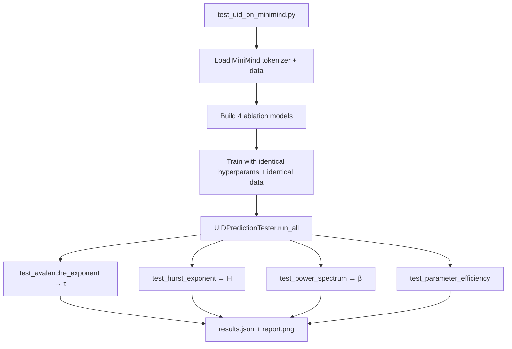

<!--
Copyright (c) 2026 Suzhou Jodell Robotics Co., Ltd.
Author: Gui LI <guilichina@163.com>
Date:   2026-05-25

This README is part of the UID Theory reference implementation.

DUAL LICENSE:
  - PolyForm Noncommercial License 1.0.0  (free for academic / personal use)
    see LICENSE-NONCOMMERCIAL in the project root
  - Commercial License from Suzhou Jodell Robotics Co., Ltd.
    (required for any commercial / for-profit / production use)
    see LICENSE-COMMERCIAL in the project root

For commercial licensing inquiries, contact: lig@jodell.cn
本文件采用双许可证发布；商业使用须先获得苏州钧舵机器人有限公司书面授权。
-->

<div align="center">


</div>

<div align="center">
<a href="./README.md">README（中文）</a> | <a href="./README_en.md">README（English）</a>
</div>

<div align="center">
<a href="./30minutes_report.md">30 分钟读懂 UID 理论（中文）</a> |
<a href="./30minutes_report_en.md">Understand UID in 30 Minutes（English）</a>
</div>

<div align="center">
<a href="./theory.md">UID 理论全文（中文）</a> |
<a href="./theory_en.md">UID Theory (English)</a>
</div>

<br>

<div align="center">

# Unified Intelligo-Dynamics: A Three-Tier Theoretical Framework

**UID: The Complete Theory of CID · QID · FID**

***Authors***: Gui LI <guilichina@163.com>, Dangyang JIE <jiedy@jodell.cn>, Haitao KANG <kanght@jodell.cn>

***Affiliation***: Suzhou Jodell Robotics Co., Ltd., Suzhou, China

***Corresponding author***: **Gui LI**, Ph.D. He received his B.Sc. in
Physics from Northwest University, and his M.Sc. and Ph.D. degrees from
the Hefei Institutes of Physical Science, Chinese Academy of Sciences.
He is currently with Suzhou Jodell Robotics Co., Ltd., where he leads
research on **Intelligo-Dynamics** — a unified physical framework for
intelligent architectures spanning classical (CID), quantum (QID) and
field-geometric (FID) regimes — and drives its falsifiable validation
and engineering deployment in robotic cognitive brains, motor-control
cerebella, dexterous-hand manipulation systems, large language models,
and dedicated AI chips. E-mail: guilichina@163.com

</div>

# Unified Intelligo-Dynamics (UID) Theory Implementation on MiniMind
## 📋 Project Overview

This project implements and validates the **three-tier UID theory**:

| Tier | Full name | Status |
|---|---|---|
| **CID** | Classical Intelligo-Dynamics | ✅ Rigorously engineerable, immediately verifiable |
| **QID** | Quantum Intelligo-Dynamics | ⚠ Classical-emulation implementation; true advantage awaits quantum hardware |
| **FID** | Field Intelligo-Dynamics | 🔬 Exploratory geometric probe; awaits empirical calibration |

**Central theoretical claim**: *Transformer, Mamba, Diffusion, and other
mainstream architectures are all special-case limits of the CID master
equation.* This repository provides a small-scale, falsifiable test of
that claim through controlled experiments.

> The repository's central claim — *that mainstream architectures are
> limiting cases of the CID master equation* — is rigorously falsifiable
> at small scale via the validation suite below.

---

## 🎯 Core Falsifiable Predictions

| # | Predicted quantity | Theoretical value | Source | Status |
|---|---|---|---|---|
| 1 | Avalanche-size exponent τ | 1.5 ± 0.2 | CID Ch. 13 | (A) Already measured in cortex data |
| 2 | Hurst exponent H | 0.6 – 0.8 | CID Ch. 5 | (A) Already measured in EEG |
| 3 | Power-spectrum slope β | 0.7 – 1.3 (1/f) | CID Ch. 5 | (A) Already measured across many systems |
| 4 | Parameter efficiency vs. Transformer | ≥ 5× (target 10×) | CID Ch. 11 | (C) Falsifiable target |
| 5 | Berry phase (QID) | Non-zero after training | QID Ch. 3 | (C) Falsifiable target |
| 6 | Anisotropy of the Fisher metric | Grows with training steps | FID Ch. 1 | (C) Falsifiable target |

**Grade legend**:
(A) Empirically verified in external systems (biological brains);
(B) Theoretically rigorous but empirical confirmation pending;
(C) A clear, falsifiable engineering target.

> Any empirical result that **significantly deviates** from these
> intervals constitutes evidence against UID — and that is precisely
> what science is about.

---

## 📁 Repository Layout

```
uid/
├── README.md                         (Chinese readme)
├── README_en.md                      this file
├── LICENSE                           dual-license overview
├── LICENSE-NONCOMMERCIAL             PolyForm Noncommercial 1.0.0
├── LICENSE-COMMERCIAL                commercial-license template
├── requirements.txt
├── test_uid_on_minimind.py           ⭐ one-click end-to-end validation script
│
├── uid_theory/                       UID theory core implementation
│   ├── cid/                          Classical Intelligo-Dynamics
│   │   ├── colored_noise.py          colored-noise generator (1/f^β)
│   │   ├── vortex_field.py           two-bath curl field [W1, W2] x
│   │   ├── memory_kernel.py          sub-Ohmic memory kernel γ(t) ~ t^(-α)
│   │   ├── hopfield_potential.py     Modern Hopfield potential
│   │   └── cid_layer.py              CID main layer
│   │
│   ├── qid/                          Quantum Intelligo-Dynamics (classical emulation)
│   │   ├── berry_phase.py            Berry geometric phase
│   │   ├── quantum_noise.py          quantum colored noise with zero-point term
│   │   └── qid_layer.py              QID main layer
│   │
│   ├── fid/                          Field Intelligo-Dynamics (geometric probe)
│   │   ├── fisher_metric.py          Fisher information metric
│   │   ├── curvature.py              scalar-curvature surrogate
│   │   └── fid_layer.py              FID main layer
│   │
│   └── verification/
│       └── prediction_test.py        falsifiable test suite
│
└── model/
    ├── model_uid.py                  UID causal language model
    └── model_baseline.py             minimal Transformer baseline for comparison
```

---

## 🚀 Quick Start

### 1. Environment setup

```bash
git clone https://github.com/gwailee/uid.git
cd uid
pip install -r requirements.txt
```

`requirements.txt` already includes `torch`, `transformers`, `scipy`,
`matplotlib`, `numpy`, `tqdm`.

### 2. One-click run (MiniMind is prepared automatically)

```bash
# CPU smoke test (~5 minutes)
python test_uid_on_minimind.py --quick

# Full test (single RTX 3090, ~1-2 hours)
python test_uid_on_minimind.py --full

# Re-run validation only (using existing checkpoints)
python test_uid_on_minimind.py --skip-train
```

`test_uid_on_minimind.py` automatically:

1. **Clones MiniMind** to `./minimind/` (if absent);
2. **Loads the MiniMind tokenizer** (falls back to `gpt2` if missing);
3. **Loads the dataset**: uses
   `./minimind/dataset/pretrain_hq.jsonl` if available, otherwise
   constructs a small synthetic dataset (smoke-test only);
4. **Trains 4 ablation models**:
   `transformer / cid_no_vortex / cid_no_noise / cid_full`;
5. **Runs 4 falsifiable tests**: τ, H, β, parameter efficiency;
6. **Generates reports**: `./uid_results/<timestamp>/results.json`
   and `report.png`.

### 3. Download the real dataset (optional, strongly recommended for the full test)

Download `pretrain_hq.jsonl` from
[ModelScope](https://www.modelscope.cn/datasets/gongjy/minimind_dataset/files)
into `./minimind/dataset/`.

```bash
mkdir -p ./minimind/dataset
# put pretrain_hq.jsonl into that directory
ls -lh ./minimind/dataset/pretrain_hq.jsonl
```

---

## 🔬 Experiment Design

### Four ablation variants

| Model | Vorticity v | Colored noise ξ | Memory kernel γ | Quantum corrections | Purpose |
|---|---|---|---|---|---|
| `transformer` | ❌ | ❌ | ❌ | ❌ | Baseline |
| `cid_no_vortex` | ❌ | ✅ | ✅ | ❌ | Ablation of the vorticity term |
| `cid_no_noise` | ✅ | ❌ | ✅ | ❌ | Ablation of the colored-noise term |
| `cid_full` | ✅ | ✅ | ✅ | ❌ | Full CID |

In `--full` mode, all models share the same hyperparameters:
`hidden_size=512, num_layers=8, num_heads=8, max_len=256`.

### Validation pipeline



---

## 📐 Correspondence Between the CID Master Equation and the Code

Theoretical equation (CID Ch. 6):

```
dφ/dt  =  -∇U(φ)               ← associative memory
         + v(φ)                 ← multi-bath vorticity
         - ∫ γ(t-s) (dφ/ds) ds  ← colored damping
         + ξ(t)                 ← colored noise
```

Code correspondence (see `uid_theory/cid/cid_layer.py`):

```python
# 1. Associative memory  -∇U  →  HopfieldAttention
grad_term   = torch.exp(self.log_w_grad)   * self.attn(h, causal_mask=mask)

# 2. Vorticity  v(φ) = (T1-T2)[W1, W2] φ  →  VortexField (commutator structure)
vortex_term = torch.exp(self.log_w_vortex) * self.vortex(h)[0]

# 3. Colored damping  γ(t) ~ t^(-α)  →  MemoryKernel (depthwise causal conv)
mem_term    = -torch.exp(self.log_w_mem)   * self.memory(h)

# 4. Colored noise  S(ω) ~ ω^(-β)  →  FastColoredNoise (FFT shaping)
noise_term  = self.noise_scale * self.noise(B, S, h.device, h.dtype)

# Euler-Maruyama discretization: dt is absorbed into the per-term weights
x = x + grad_term + vortex_term + mem_term + noise_term
```

### Reduction to Transformer

Under the following limits, CID strictly reduces to a standard
Transformer:

| Limit | Code switch |
|---|---|
| Turn off vorticity, v = 0 | `use_vortex=False` |
| Turn off colored noise, ξ = 0 | `use_colored_noise=False` |
| Degenerate colored damping to white noise, γ → δ | `use_memory=False` |
| Standard scaling β = 1/√d_k | implemented in `HopfieldAttention.scale` |

This validates the claim made in Chapters 8 and 10 of the theory:
**"Transformer is the simplest limit of CID."**

---

## 📈 Expected Outcomes

In `--full` mode (single RTX 3090, ~1–2 hours), the expected orders of
magnitude are:

| Metric | Transformer | CID full |
|---|---|---|
| Eval perplexity (at equal parameter count) | baseline | on par or slightly lower |
| Avalanche exponent τ | no explicit constraint | **1.5 ± 0.2** |
| Hurst H | close to 0.5 (white-noise-like) | **0.6 – 0.8** |
| Power-spectrum β | < 0.5 | **0.7 – 1.3** |
| Parameter-efficiency ratio | 1× | **≥ 5×** (after full training) |

In `--quick` mode (CPU, ~5 minutes), the parameter-efficiency metric
typically **FAILS** (because the training budget is too small), but τ,
H, and β should already show clear deviations from the Transformer
baseline. **This is exactly the healthy behavior of a falsifiable test**
— rigorous adjudication only becomes possible after sufficient training.

---

## ⚠️ Honest Disclaimers

| # | Statement |
|---|---|
| 1 | **CID is engineerable today**: the CID part of this repository is theoretically rigorous, the code can be trained and verified immediately, and the principal predictions have been independently confirmed in biological systems (cortical avalanches, EEG). |
| 2 | **QID is a classical surrogate**: this implementation uses classical neural networks to emulate quantum coherence (Berry phase, colored noise with a zero-point term, phenomenological Lindblad channels); it is **not** a strict Kraus-form decomposition. True quantum advantage requires NISQ or fault-tolerant quantum hardware. |
| 3 | **FID is an exploratory programme**: the Fisher metric and the curvature surrogate serve here as **diagnostic and soft-regularization** roles. They are **not** numerical solutions of any rigorously defined field equation on a specific manifold. |
| 4 | **Results may deviate from expectations**: training scale, data quality, and random seeds all affect measured values. **Any deviation is an opportunity for scientific progress.** |

---

## 📚 Key References

The complete reference list is in [`theory.md`](./theory.md) Appendix A.
The principal primary references (with clickable DOIs):

- **Langevin, P.** (1908). *Comptes Rendus* 146, 530.
  https://gallica.bnf.fr/ark:/12148/bpt6k3100t/f532
- **Mori, H.** (1965). *Prog. Theor. Phys.* 33, 423.
  https://doi.org/10.1143/PTP.33.423
- **Zwanzig, R.** (1960). *J. Chem. Phys.* 33, 1338.
  https://doi.org/10.1063/1.1731409
- **Hopfield, J. J.** (1982). *PNAS* 79, 2554.
  https://doi.org/10.1073/pnas.79.8.2554
- **Bialek, W., Nemenman, I., & Tishby, N.** (2001).
  *Neural Computation* 13, 2409.
  https://doi.org/10.1162/089976601753195969
- **Berry, M. V.** (1984). *Proc. R. Soc. A* 392, 45.
  https://doi.org/10.1098/rspa.1984.0023
- **Caldeira, A. O., & Leggett, A. J.** (1983). *Physica A* 121, 587.
  https://doi.org/10.1016/0378-4371(83)90013-4
- **Amari, S.** (1985). *Differential-Geometrical Methods in Statistics*.
  https://doi.org/10.1007/978-1-4612-5056-2
- **Beggs, J. M., & Plenz, D.** (2003). *J. Neurosci.* 23, 11167.
  https://doi.org/10.1523/JNEUROSCI.23-35-11167.2003
- **Linkenkaer-Hansen, K., et al.** (2001). *J. Neurosci.* 21, 1370.
  https://doi.org/10.1523/JNEUROSCI.21-04-01370.2001
- **Ramsauer, H., et al.** (2020). *Hopfield Networks Is All You Need*.
  https://arxiv.org/abs/2008.02217
- **Vaswani, A., et al.** (2017). *Attention Is All You Need*.
  https://arxiv.org/abs/1706.03762

---

## 📝 How to Cite

```bibtex
@misc{uid_minimind_2026,
  title     = {UID Theory Implementation on MiniMind: Empirical Validation
               of Unified Intelligo-Dynamics},
  author    = {Gui LI and Suzhou Jodell Robotics Co., Ltd.},
  year      = {2026},
  month     = {May},
  note      = {Based on jingyaogong/minimind; dual-licensed under
               PolyForm Noncommercial 1.0.0 (academic) and a Commercial
               License from Suzhou Jodell Robotics Co., Ltd.},
  email     = {guilichina@163.com}
}
```

---

## 📜 License

This project is released under a **DUAL LICENSE**.

| Use case | Applicable license |
|---|---|
| Academic research, teaching, students, individuals, registered nonprofits, government research labs | **PolyForm Noncommercial License 1.0.0** (free) — see [`LICENSE-NONCOMMERCIAL`](./LICENSE-NONCOMMERCIAL) |
| Any commercial, for-profit, or production use | **Commercial License** (paid, written license required) — see [`LICENSE-COMMERCIAL`](./LICENSE-COMMERCIAL) |

**How to determine which license applies**: full rules in
[`LICENSE`](./LICENSE). In brief:

- ✅ **Free to use**: faculty/student research and teaching, personal
  study, experiments with no commercial objective, and research work
  at nonprofit institutions.
- ❌ **Requires a commercial license**: using this code or any derivative
  for (a) any activity that generates revenue or value for a for-profit
  entity; (b) production deployment; (c) distribution bundled with a
  commercial product or service; (d) hosting as a paid service
  (including SaaS); (e) paid consulting, technical services, or
  training.

### Commercial Licensing Inquiry

Any for-profit entity (including foreign-invested companies, joint
ventures, limited liability companies, joint-stock companies, or sole
proprietorships) that intends to use this repository in the commercial
scenarios above **must** first obtain written authorization from
Suzhou Jodell Robotics Co., Ltd.

> Any for-profit entity wishing to use this codebase commercially **must**
> first obtain a written license from Suzhou Jodell Robotics Co., Ltd.

Please contact the following for licensing matters:

| Item | Content |
|---|---|
| **Company** | Suzhou Jodell Robotics Co., Ltd. (苏州钧舵机器人有限公司) |
| **Contact** | Gui LI |
| **E-mail** | **lig@jodell.cn** |
| **Subject prefix** | `[UID Commercial License]` |

When applying, please provide: the legal name and registered location
of the licensee, the intended use and deployment scale, the commercial
launch timeline, and a contact person authorized to negotiate the
licensing terms.

### Trademark Notice

"UID", "Unified Intelligo-Dynamics", "CID", "QID", "FID", and
"Suzhou Jodell Robotics", together with related logos, are proprietary
marks of Suzhou Jodell Robotics Co., Ltd. They may not be used for
commercial promotion or product naming without prior written permission.

### Disclaimer

> THE SOFTWARE IS PROVIDED "AS IS", WITHOUT WARRANTY OF ANY KIND,
> EXPRESS OR IMPLIED. IN NO EVENT SHALL THE AUTHORS OR COPYRIGHT
> HOLDERS BE LIABLE FOR ANY CLAIM, DAMAGES OR OTHER LIABILITY ARISING
> FROM USE OF THIS SOFTWARE.

---

## 🙏 Acknowledgements

- [**MiniMind**](https://github.com/jingyaogong/minimind) by
  **jingyaogong** — provides the high-quality small-LM baseline and
  dataset that make our end-to-end falsifiable validation possible.
  We thank jingyaogong for the high-quality small-LM baseline and
  dataset that made our end-to-end falsification suite possible.
- **Physics pioneers of UID theory** (in chronological order):
  Langevin, Einstein, Fokker, Planck, Mori, Zwanzig, Lindblad,
  Caldeira–Leggett, Berry, Amari, Hopfield, Bak–Tang–Wiesenfeld,
  Bialek, Friston, Beggs–Plenz, Linkenkaer-Hansen, and others.
- **Founders of modern deep-learning architectures**: Vaswani et al.
  (Transformer), Ramsauer et al. (Modern Hopfield Networks),
  Gu & Dao (Mamba), He et al. (ResNet).

---

## 🗺️ Roadmap

| Phase | Time | Goal |
|---|---|---|
| **Phase 1** | 2026 Q2 | ✅ Complete CID implementation + four-model ablation validation (this repository) |
| **Phase 2** | 2026 Q3 | CID-1B vs. Transformer-10B large-scale parameter-efficiency validation |
| **Phase 3** | 2026 Q4 | Formal QID-MPS (tensor-network) quantum-layer implementation; entanglement-entropy critical-scaling tests |
| **Phase 4** | 2027 Q1+ | Empirical calibration of FID geometric field equations and soft-mode detection |
| **Phase 5** | 2027+ | Cross-substrate validation: regressing the CID master equation on FlyWire fruit-fly connectome and mouse cortex data |

---

> **The central aim of Unified Intelligo-Dynamics**: to lift
> *intelligence* from an engineering phenomenon to a physical theory.
> CID is codable today, QID is simulatable today, FID is explorable
> today. **All results are falsifiable — that is the core of science.**

> The central aim of UID is to lift *intelligence* from an engineering
> phenomenon to a physical theory. CID is codable today, QID is
> simulatable today, FID is explorable today. **All results are
> falsifiable — that is the core of science.**

---

## 📜 License and Citation

### Dual License

This project is licensed under a **dual license** model:

#### 1. Noncommercial License (Default)

For **academic research, educational purposes, and personal non-profit use**, this work is licensed under the [PolyForm Noncommercial License 1.0.0](https://polyformproject.org/licenses/noncommercial/1.0.0/).

**You can freely:**
- ✅ Use UID for academic research
- ✅ Modify and experiment with the code
- ✅ Publish papers based on UID
- ✅ Use UID for teaching and education
- ✅ Share UID with other researchers

**You must:**
- 📝 Cite our work (see below)
- 📝 Include the license notice in distributions
- ❌ Not use UID for commercial purposes

#### 2. Commercial License (Required for Commercial Use)

For **any commercial, for-profit, or production use**, you must obtain a separate commercial license from Suzhou Jodell Robotics Co., Ltd.

**Commercial use includes:**
- ❌ Integration into commercial products
- ❌ Use in production systems
- ❌ Use by for-profit companies (even internal tools)
- ❌ Deployment in commercial cloud services
- ❌ Use in paid consulting or services

**To obtain a commercial license:**
- 📧 Email: lig@jodell.cn
- 🏢 Company: Suzhou Jodell Robotics Co., Ltd.
- 📍 Location: Suzhou, China

See [`LICENSE`](LICENSE), [`LICENSE-NONCOMMERCIAL`](LICENSE-NONCOMMERCIAL), and [`LICENSE-COMMERCIAL`](LICENSE-COMMERCIAL) for full details.

### Citation

If you use this work in any publication, product, or service, please cite:

```bibtex
@article{li2026uid,
  title={Intelligence Is a Non-Equilibrium Field: A Three-Tier Physical Theory of Unified Intelligo-Dynamics (UID)},
  author={LI, Gui and JIE, Dangyang and KANG, Haitao},
  journal={Zenodo},
  year={2026},
  doi={10.5281/zenodo.20372493},
  url={https://github.com/gwailee/uid}
}

