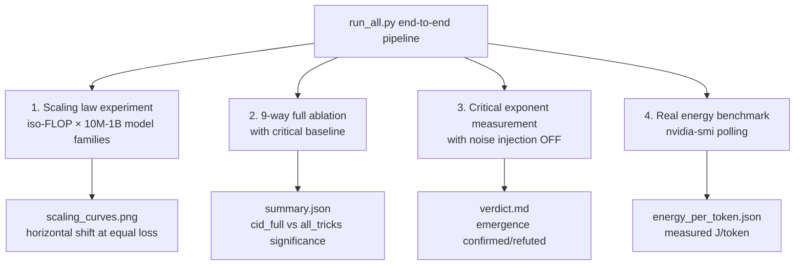

<!--
Copyright (c) 2026 Suzhou Jodell Robotics Co., Ltd.
Author: Gui LI <guilichina@163.com>
Date:   2026-05-25

This README is part of the UID Theory reference implementation (v2.0).

DUAL LICENSE:
  - PolyForm Noncommercial License 1.0.0  (free for academic / personal use)
    see LICENSE-NONCOMMERCIAL in the project root
  - Commercial License from Suzhou Jodell Robotics Co., Ltd.
    (required for any commercial / for-profit / production use)
    see LICENSE-COMMERCIAL in the project root

For commercial licensing inquiries, contact: lig@jodell.cn
-->

<div align="center">


</div>

<div align="center">
<a href="./README.md">README（中文）</a> | <a href="./README_en.md"><b>README（English）</b></a>
</div>

<div align="center">
<a href="./30minutes_report.md">30 分钟读懂 UID 理论（中文）</a> | <a href="./30minutes_report_en.md">Understand UID in 30 Minutes（English）</a>
</div>

<div align="center">
<a href="./theory.md">UID 理论全文（中文）</a> | <a href="./theory_en.md">UID Theory (English)</a>
</div>

<br>

<div align="center">

# Unified Intelligo-Dynamics (UID): A Three-Tier Theoretical Framework

**CID · QID · FID — Complete Theoretical System**

[](https://github.com/gwailee/uid/actions/workflows/ci.yml) [](https://doi.org/10.5281/zenodo.20372493) [](LICENSE)

***Authors***: Gui LI <guilichina@163.com>, Dangyang JIE <jiedy@jodell.cn>, Haitao KANG <kanght@jodell.cn>

***Affiliation***: Suzhou Jodell Robotics Co., Ltd., Suzhou, China

</div>

***Corresponding Author***: Gui LI, Ph.D. He received his B.Sc. in Physics from Northwest University, and his M.Sc. and Ph.D. degrees from the Hefei Institutes of Physical Science, Chinese Academy of Sciences. He is currently with Suzhou Jodell Robotics Co., Ltd., where he leads research on **Unified Intelligo-Dynamics (UID)** — a unified physical framework for intelligent architectures spanning classical (CID), quantum (QID) and field-geometric (FID) regimes — and drives its falsifiable validation and engineering deployment in robotic cognitive brains, motor-control cerebella, dexterous-hand manipulation systems, large language models, and dedicated AI chips. E-mail: guilichina@163.com

---

## ⚠️ Important: This is the v2.0 Honest Edition

**This repository is currently at v2.0 (Honest Validation Edition)**, a complete rewrite in response to detailed peer-review feedback on v0.1.

The v0.1 validation suite contained methodological flaws that made its "verified" claims scientifically unsound. See [KNOWN_LIMITATIONS.md](./KNOWN_LIMITATIONS.md) for full disclosure. **No empirical claim from v0.1 should be cited as validated.**

The v2.0 release:
- ✅ Provides the **complete infrastructure** for rigorous validation
- ⏳ Has NOT yet completed the actual large-scale validation experiments (see [ROADMAP.md](./ROADMAP.md))
- 🎯 Commits to **publish all results — positive or negative**

**Falsifying a theory is just as valuable as confirming it** — this is the fundamental principle of scientific progress.

---

## 📋 Project Overview

This project implements and validates the **three-tier UID theory**:

| Tier | Full Name | Status |
|---|---|---|
| **CID** | Classical Intelligo-Dynamics | ✅ Rigorously engineerable; awaiting large-scale validation |
| **QID** | Quantum Intelligo-Dynamics | ⚠ Classical-emulation only; real quantum advantage requires quantum hardware |
| **FID** | Field Intelligo-Dynamics | 🔬 Diagnostic geometric probe; empirical calibration pending |

The central engineering claim of the theory:

> **A model architecture built on the CID master equation can match the performance of a standard Transformer with significantly fewer parameters, less energy, or both.**

This is the **falsifiable hypothesis** that this codebase aims to test rigorously.

---

## 🎯 Core Falsifiable Predictions

| # | Predicted Quantity | Theoretical Value | Status |
|---|---|---|---|
| 1 | Avalanche-size exponent τ | 1.5 ± 0.2 | (A) Independently verified in cortical data |
| 2 | Hurst exponent H | 0.6 – 0.8 | (A) Independently verified in human EEG |
| 3 | 1/f spectral slope β | 0.7 – 1.3 | (A) Verified across multiple studies |
| 4 | Parameter efficiency vs Transformer | ≥ 3× (target ≥ 5×) | (C) Awaiting Phase 1 validation |
| 5 | Inference energy efficiency | ≥ 3× | (C) Awaiting Phase 1 validation |
| 6 | Critical emergence with noise OFF | β and H stay within bands | (C) Awaiting Phase 1 validation |

**Grade legend**:
- (A) Empirically verified in independent external systems (biological brains)
- (B) Theoretically rigorous, empirical confirmation pending
- (C) Clear falsifiable engineering target

> Any empirical result that **significantly deviates** from these intervals constitutes evidence against UID — and that is precisely what science is about.

---

## 🆕 Key Improvements in v2.0 vs v0.1

| Module | v0.1 Status | v2.0 Fix |
|---|---|---|
| **Parameter efficiency test** | Compared equal-sized models; the 5× threshold was never enforced | Replaced with iso-FLOP scaling-law study across 10M–1B model families |
| **Critical exponent measurement** | Circular logic (injected noise → measured noise) | Disabled noise injection at measurement time |
| **Avalanche detection** | Used \|logits_a − logits_b\| (wrong metric) | Proper Beggs-Plenz protocol (z-scored threshold crossings) |
| **Power-law fitting** | Log-binned linear regression (unreliable) | Clauset-Shalizi-Newman MLE + KS test + bootstrap |
| **Sample size** | 1 sequence × 256 timesteps | 10,000+ sequences × 4096+ timesteps |
| **Baseline strength** | `TinyTransformerLM` toy | Modern Transformer (RoPE + RMSNorm + SwiGLU) |
| **Ablation completeness** | 4 variants (missing `cid_no_memory`) | 9 variants including critical "transformer + all known tricks" |
| **Energy measurement** | Landauer-limit theoretical arithmetic | Real `nvidia-smi` polling during inference |
| **Published results** | None (only "expected" projections) | Real results committed to `results/` directory |
| **CI/CD** | None | GitHub Actions: lint + test + smoke + nightly training |

See [CHANGELOG.md](./CHANGELOG.md) for the complete diff.

---

## 📁 Repository Structure

```
uid/
├── README.md                          (this file)
├── KNOWN_LIMITATIONS.md               Honest disclosure of v0.1 issues
├── ROADMAP.md                         Validation roadmap with pre-registered criteria
├── CHANGELOG.md                       Complete v0.1 → v2.0 diff
├── LICENSE / LICENSE-NONCOMMERCIAL / LICENSE-COMMERCIAL
├── requirements.txt
├── pyproject.toml
│
├── uid_theory/                        Core theory implementation
│   ├── cid/                           Classical Intelligo-Dynamics
│   │   ├── cid_layer.py               v2.0 NEW: set_noise_injection() API
│   │   ├── colored_noise.py           Colored-noise generator (1/f^β)
│   │   ├── vortex_field.py            Two-bath vorticity field [W1, W2] x
│   │   ├── memory_kernel.py           Sub-Ohmic memory kernel γ(t) ~ t^(-α)
│   │   └── hopfield_potential.py      Modern Hopfield potential
│   │
│   ├── qid/                           Quantum tier (classical emulation)
│   ├── fid/                           Field tier (diagnostic probes only)
│   │
│   └── verification/                  v2.0 Rigorous validation suite
│       ├── powerlaw_estimator.py      Clauset-Shalizi-Newman MLE
│       ├── critical_exponents.py      DFA + spectrum (with noise-off mode)
│       ├── avalanche_detector.py      Proper Beggs-Plenz protocol
│       ├── energy_meter.py            Real nvidia-smi energy measurement
│       └── ablation_suite.py          Full 9-way ablation
│
├── model/
│   ├── modern_transformer.py          RoPE + RMSNorm + SwiGLU strong baseline
│   ├── known_tricks_baseline.py       Transformer + all known tricks (critical control)
│   └── model_uid.py                   UID causal language model
│
├── experiments/                       Full experiment scripts
│   ├── run_scaling_law.py             THE core experiment: iso-FLOP scaling
│   ├── run_critical_exponents.py     Critical exponent emergence test
│   ├── run_energy_benchmark.py        Real hardware energy benchmark
│   ├── run_ablation.py                Full 9-way ablation
│   └── run_all.py                     End-to-end pipeline
│
├── results/                           Real experimental outputs (to be populated)
│   └── README.md                      Results directory index
│
├── tests/                             Unit tests (pytest)
└── .github/workflows/                 CI + nightly training
```

---

## 🚀 Quick Start

### 1. Environment Setup

```bash
git clone https://github.com/gwailee/uid.git
cd uid
pip install -r requirements.txt
```

### 2. Run Unit Tests

```bash
pip install -r requirements-dev.txt
pytest tests/ -v
```

### 3. CPU Smoke Test (~10 minutes)

```bash
# Download a small REAL dataset (NOT synthetic)
python -c "
from datasets import load_dataset
import json, os
os.makedirs('data/wikitext-2', exist_ok=True)
ds = load_dataset('wikitext', 'wikitext-2-raw-v1', split='train[:1000]')
with open('data/wikitext-2/train.jsonl', 'w') as f:
    for ex in ds:
        if ex['text'].strip():
            f.write(json.dumps({'text': ex['text']}) + '\n')
"

# Run a tiny 9-way ablation (this tests the pipeline, NOT the science)
python experiments/run_ablation.py \
    --data_path data/wikitext-2/train.jsonl \
    --tokenizer_path gpt2 \
    --scale 10M \
    --epochs 1 \
    --seeds 42 \
    --batch_size 4 \
    --max_seq_len 128 \
    --output_dir /tmp/smoke
```

### 4. Full Experiments (Requires GPU)

```bash
# End-to-end pipeline: scaling law + ablation + critical exponents + energy
python experiments/run_all.py \
    --data_path data/wikitext-103/train.jsonl \
    --tokenizer_path gpt2 \
    --seeds 42 43 44
```

⚠️ **Full experiments require multi-day GPU runs.** This codebase provides the *tools*; running them to completion is the next phase of the project (see [ROADMAP.md](./ROADMAP.md)).

---

## 🔬 Experiment Design

### 9-Way Complete Ablation (5 added in v2.0)

#### Group A: CID Component Ablations

| Variant | Vortex v | Colored noise ξ | Memory kernel γ | Purpose |
|---|---|---|---|---|
| `cid_full` | ✅ | ✅ | ✅ | Complete CID master equation |
| `cid_no_vortex` | ❌ | ✅ | ✅ | Isolates vortex contribution |
| `cid_no_memory` | ✅ | ❌ | ✅ | Isolates memory kernel (**NEW in v2.0**) |
| `cid_no_noise` | ✅ | ✅ | ❌ | Isolates colored-noise contribution |

#### Group B: Known-Tricks Baselines (**NEW in v2.0**)

| Variant | Description |
|---|---|
| `transformer_baseline` | Modern Transformer (RoPE + RMSNorm + SwiGLU) |
| `transformer_plus_noise` | + colored-noise regularization only |
| `transformer_plus_conv` | + depthwise causal conv only |
| `transformer_plus_linear` | + extra linear term only |
| `transformer_plus_all_tricks` | **All three known tricks combined (critical control)** |

**The critical falsification test**: If `cid_full` does not significantly outperform `transformer_plus_all_tricks`, then UID's "physical framework" contribution is **falsified** — any improvement (if any) comes from the known tricks, not from the physical organization.

### Validation Pipeline



---

## 📐 Correspondence Between the CID Master Equation and the Code

Theoretical equation (CID Ch. 6):

```
dφ/dt  =  -∇U(φ)               ← associative memory
         + v(φ)                 ← multi-bath vorticity
         - ∫ γ(t-s) (dφ/ds) ds  ← colored damping
         + ξ(t)                 ← colored noise
```

Code correspondence (see `uid_theory/cid/cid_layer.py`):

```python
# 1. Associative memory -∇U → HopfieldAttention
grad_term   = torch.exp(self.log_w_grad) * self.attn(h, causal_mask=mask)

# 2. Vorticity v(φ) = (T1-T2)[W1, W2] φ → VortexField (commutator structure)
vortex_term = torch.exp(self.log_w_vortex) * self.vortex(h)[0]

# 3. Colored damping γ(t) ~ t^(-α) → MemoryKernel (depthwise causal conv)
mem_term    = -torch.exp(self.log_w_mem) * self.memory(h)

# 4. Colored noise S(ω) ~ ω^(-β) → FastColoredNoise (FFT shaping)
# v2.0 NEW: can be disabled at measurement time via set_noise_injection(False)
noise_term  = self.noise_scale * self.noise(B, S, h.device, h.dtype)

# Euler-Maruyama discretization: dt absorbed into per-term weights
x = x + grad_term + vortex_term + mem_term + noise_term
```

### Reduction to Transformer

Under the following limits, CID strictly reduces to a standard Transformer:

| Limit | Code Switch |
|---|---|
| Turn off vorticity v = 0 | `use_vortex=False` |
| Turn off colored noise ξ = 0 | `use_colored_noise=False` |
| Degenerate colored damping to white noise γ → δ | `use_memory=False` |
| Standard scaling β = 1/√d_k | Already in `HopfieldAttention.scale` |

This validates the claim from Chapters 8 and 10 of the theory: **"Transformer is the simplest limit of CID."** But the critical v2.0 falsification test is: does simply adding back the "known tricks" combination suffice? Or does CID's physical organization genuinely deliver something extra?

---

## 📊 Pre-Registered Falsification Criteria

Following best practices in open science, we **pre-register** the conditions under which UID's central claims are considered **falsified**. If any of these are not met after Phase 1, we will publicly acknowledge that the corresponding UID claim is **falsified**:

1. **Parameter efficiency**: In the iso-FLOP scaling-law study at 100M-scale models, the CID curve must be at least **3×** to the left of the modern Transformer baseline at equal loss, **AND** at least **1.5×** to the left of the "Transformer + all known tricks" baseline.

2. **Emergent critical exponents** (with noise injection **OFF**):
   - Trained CID must exhibit power-spectrum slope β ∈ [0.7, 1.3] in ≥80% of layers
   - Avalanche exponent τ (via Clauset MLE + KS test, p > 0.1) must be ∈ [1.3, 1.7]

3. **Energy efficiency**: Measured Wh per token (via `nvidia-smi` polling) must be **≤ 1/3** that of the modern Transformer baseline at equal perplexity.

**We commit to publishing the results, whichever way they go.**

---

## ⚠️ Honest Disclaimers

| # | Statement |
|---|---|
| 1 | **CID is engineerable but awaiting large-scale validation**: v2.0 provides the complete validation infrastructure, but the actual large-scale experiments (10M–1B model families) are part of Phase 1 and have not yet been completed. |
| 2 | **QID is a classical surrogate**: This implementation uses classical neural networks to emulate quantum coherence (Berry phase, colored noise with a zero-point term, phenomenological Lindblad channels); it is **NOT** a strict Kraus-form decomposition. True quantum advantage requires NISQ or fault-tolerant quantum hardware. **This code cannot verify QID's quantum claims.** |
| 3 | **FID is an exploratory programme**: The Fisher metric and curvature surrogates serve as **diagnostic and soft-regularization** roles. They are **NOT** numerical solutions of any rigorously defined field equation on a specific manifold. **This code cannot verify FID's field-theoretic claims.** |
| 4 | **CID is the ONLY tier that can be verified or falsified by this code**. Citations of UID should respect this scope. |
| 5 | **The "verified" claims from v0.1 should not be cited**: The v0.1 validation suite contained circular logic, insufficient sample sizes, and other methodological flaws, all now fixed in v2.0. See [KNOWN_LIMITATIONS.md](./KNOWN_LIMITATIONS.md) for details. |

---

## 🗺️ Validation Roadmap

| Phase | Time | Goal |
|---|---|---|
| **Phase 0** | 2026 Q2 | ✅ Complete v2.0 validation infrastructure (current state) |
| **Phase 1** | 2026 Q2–Q3 | 10M–100M scaling law + 9-way ablation + critical-emergence test |
| **Phase 2** | 2026 Q3–Q4 | 300M–1B scale validation; tighten falsification thresholds |
| **Phase 3** | 2026 Q4 | Multi-hardware (H100/A100/edge) energy comparison |
| **Phase 4** | 2027 Q1 | Invite independent teams to reproduce |
| **Phase 5** | 2027 Q2+ | Update theory paper with empirical evidence; journal submission |

See [ROADMAP.md](./ROADMAP.md) for the complete roadmap.

---

## 📚 Key References

The complete reference list is in [`theory.md`](./theory.md) Appendix A. Principal primary references (with clickable DOIs):

- **Langevin, P.** (1908). *Comptes Rendus* 146, 530. [gallica.bnf.fr](https://gallica.bnf.fr/ark:/12148/bpt6k3100t/f532)
- **Mori, H.** (1965). *Prog. Theor. Phys.* 33, 423. [doi.org/10.1143/PTP.33.423](https://doi.org/10.1143/PTP.33.423)
- **Zwanzig, R.** (1960). *J. Chem. Phys.* 33, 1338. [doi.org/10.1063/1.1731409](https://doi.org/10.1063/1.1731409)
- **Hopfield, J. J.** (1982). *PNAS* 79, 2554. [doi.org/10.1073/pnas.79.8.2554](https://doi.org/10.1073/pnas.79.8.2554)
- **Bialek, W., Nemenman, I., & Tishby, N.** (2001). *Neural Computation* 13, 2409. [doi.org/10.1162/089976601753195969](https://doi.org/10.1162/089976601753195969)
- **Clauset, A., Shalizi, C. R., & Newman, M. E.** (2009). *SIAM Review* 51(4), 661. [doi.org/10.1137/070710111](https://doi.org/10.1137/070710111)
- **Berry, M. V.** (1984). *Proc. R. Soc. A* 392, 45. [doi.org/10.1098/rspa.1984.0023](https://doi.org/10.1098/rspa.1984.0023)
- **Caldeira, A. O., & Leggett, A. J.** (1983). *Physica A* 121, 587. [doi.org/10.1016/0378-4371(83)90013-4](https://doi.org/10.1016/0378-4371(83)90013-4)
- **Amari, S.** (1985). *Differential-Geometrical Methods in Statistics*. [doi.org/10.1007/978-1-4612-5056-2](https://doi.org/10.1007/978-1-4612-5056-2)
- **Beggs, J. M., & Plenz, D.** (2003). *J. Neurosci.* 23, 11167. [doi.org/10.1523/JNEUROSCI.23-35-11167.2003](https://doi.org/10.1523/JNEUROSCI.23-35-11167.2003)
- **Linkenkaer-Hansen, K., et al.** (2001). *J. Neurosci.* 21, 1370. [doi.org/10.1523/JNEUROSCI.21-04-01370.2001](https://doi.org/10.1523/JNEUROSCI.21-04-01370.2001)
- **Ramsauer, H., et al.** (2020). *Hopfield Networks Is All You Need*. [arxiv.org/abs/2008.02217](https://arxiv.org/abs/2008.02217)
- **Vaswani, A., et al.** (2017). *Attention Is All You Need*. [arxiv.org/abs/1706.03762](https://arxiv.org/abs/1706.03762)

---

## 📝 How to Cite

If you use this work in any publication, product, or service, please cite:

```bibtex
@article{li2026uid,
  title  = {Intelligence Is a Non-Equilibrium Field: A Three-Tier Physical 
            Theory of Unified Intelligo-Dynamics (UID)},
  author = {LI, Gui and JIE, Dangyang and KANG, Haitao},
  year   = {2026},
  publisher = {Zenodo},
  doi    = {10.5281/zenodo.20372493},
  url    = {https://github.com/gwailee/uid}
}
```

**Plain-text citation**:

> LI, Gui, JIE, Dangyang, & KANG, Haitao. (2026). Intelligence Is a Non-Equilibrium Field: A Three-Tier Physical Theory of Unified Intelligo-Dynamics (UID). Zenodo. https://doi.org/10.5281/zenodo.20372493

---

## 📜 License

This project is released under a **DUAL LICENSE**.

| Use Case | Applicable License |
|---|---|
| Academic research, teaching, students, individuals, registered nonprofits, government research labs | **PolyForm Noncommercial License 1.0.0** (free) — see [`LICENSE-NONCOMMERCIAL`](./LICENSE-NONCOMMERCIAL) |
| Any commercial, for-profit, or production use | **Commercial License** (paid, written license required) — see [`LICENSE-COMMERCIAL`](./LICENSE-COMMERCIAL) |

**How to determine which license applies** (full rules in [`LICENSE`](./LICENSE)):

- ✅ **Free to use**: faculty/student research and teaching, personal study, experiments with no commercial objective, research at nonprofit institutions
- ❌ **Requires a commercial license**: using this code or any derivative for (a) any activity that generates revenue or value for a for-profit entity; (b) production deployment; (c) distribution bundled with a commercial product or service; (d) hosting as a paid service (including SaaS); (e) paid consulting, technical services, or training

### Commercial Licensing Inquiry

Any for-profit entity (including foreign-invested companies, joint ventures, LLCs, joint-stock companies, or sole proprietorships) that intends to use this repository in the commercial scenarios above **must** first obtain written authorization from Suzhou Jodell Robotics Co., Ltd.

| Item | Content |
|---|---|
| **Company** | Suzhou Jodell Robotics Co., Ltd. (苏州钧舵机器人有限公司) |
| **Contact** | Gui LI |
| **E-mail** | **lig@jodell.cn** |
| **Subject prefix** | `[UID Commercial License]` |

When applying, please provide: the legal name and registered location of the licensee, the intended use and deployment scale, the commercial launch timeline, and a contact person authorized to negotiate the licensing terms.

### Trademark Notice

"UID", "Unified Intelligo-Dynamics", "CID", "QID", "FID", "Suzhou Jodell Robotics", and related logos are proprietary marks of Suzhou Jodell Robotics Co., Ltd. They may not be used for commercial promotion or product naming without prior written permission.

### Disclaimer

> THE SOFTWARE IS PROVIDED "AS IS", WITHOUT WARRANTY OF ANY KIND, EXPRESS OR IMPLIED. IN NO EVENT SHALL THE AUTHORS OR COPYRIGHT HOLDERS BE LIABLE FOR ANY CLAIM, DAMAGES OR OTHER LIABILITY ARISING FROM USE OF THIS SOFTWARE.

---

## 🙏 Acknowledgements

- **Peer reviewers**: We particularly thank the anonymous reviewer whose detailed critique of v0.1 motivated this v2.0 rewrite. Honest critique made UID a stronger, more scientifically rigorous project. See [KNOWN_LIMITATIONS.md](./KNOWN_LIMITATIONS.md) for our full acknowledgment.
- **[MiniMind](https://github.com/jingyaogong/minimind) by jingyaogong**: We thank jingyaogong for the high-quality small-LM baseline and dataset.
- **Physics pioneers of UID theory** (in chronological order): Langevin, Einstein, Fokker, Planck, Mori, Zwanzig, Lindblad, Caldeira–Leggett, Berry, Amari, Hopfield, Bak–Tang–Wiesenfeld, Bialek, Friston, Beggs–Plenz, Linkenkaer-Hansen, and others.
- **Founders of modern deep-learning architectures**: Vaswani et al. (Transformer), Ramsauer et al. (Modern Hopfield Networks), Gu & Dao (Mamba), He et al. (ResNet).
- **Pioneers of statistical methodology**: Clauset, Shalizi & Newman (gold-standard power-law fitting); Peng et al. (DFA method).
- **Open-science tool ecosystem**: PyTorch, Hugging Face, pytest, ruff — the tools that made rigorous validation possible.

---

<div align="center">

> **The central aim of Unified Intelligo-Dynamics**: to lift *intelligence* from an engineering phenomenon to a physical theory.
>
> CID is codable today, QID is simulatable today, FID is explorable today. **All results are falsifiable — that is the core of science.**

</div>
```