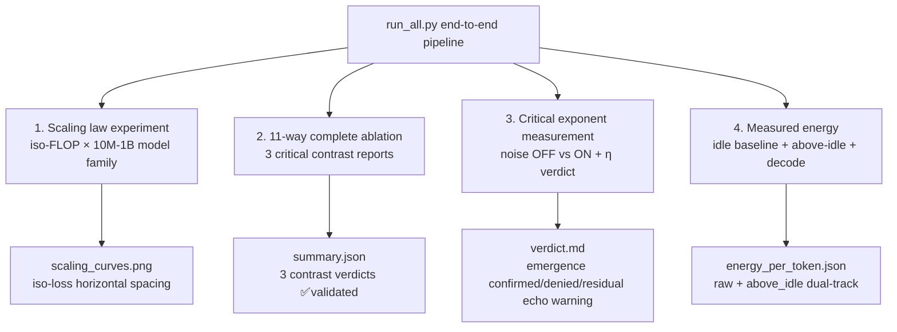

<!--
Copyright (c) 2026 Suzhou Jodell Robotics Co., Ltd.
Author: Gui LI <guilichina@163.com>
Date:   2026-05-25
UPDATE: 2026-05-31 (Phase 1 ablation empirical results backfilled)

This README is part of the UID Theory reference implementation (v2.1).

DUAL LICENSE:
  - PolyForm Noncommercial License 1.0.0  (free for academic / personal use)
    see LICENSE-NONCOMMERCIAL in the project root
  - Commercial License from Suzhou Jodell Robotics Co., Ltd.
    (required for any commercial / for-profit / production use)
    see LICENSE-COMMERCIAL in the project root

For commercial licensing inquiries, contact: lig@jodell.cn
-->

<div align="center">


</div>

<div align="center">
<a href="./README.md">README（中文）</a> | <a href="./README_en.md"><b>README（English）</b></a>
</div>

<div align="center">
<a href="./30minutes_report.md">30 分钟读懂 UID 理论（中文）</a> | <a href="./30minutes_report_en.md">Understand UID in 30 Minutes（English）</a>
</div>

<div align="center">
<a href="./theory.md">UID 理论全文（中文）</a> | <a href="./theory_en.md">UID Theory (English)</a>
</div>

<br>

<div align="center">

# Intelligence as a Non-Equilibrium Field: A Three-Layer Physical Theory of Unified Intelligo-Dynamics (UID)
## — Attention Is Not Enough: Non-Equilibrium Physical Foundations of Intelligent Architectures

[CI](https://github.com/gwailee/uid/actions/workflows/ci.yml) | [DOI](https://doi.org/10.5281/zenodo.20372493) | [License: PolyForm Noncommercial](LICENSE)

***Authors***: Gui LI <guilichina@163.com>, Dangyang JIE <jiedy@jodell.cn>, Haitao KANG <kanght@jodell.cn>

***Affiliation***: Suzhou Jodell Robotics Co., Ltd., Suzhou, China

</div>

***Corresponding Author***: Gui LI, Ph.D. B.S. from School of Physics, Northwest University; M.S. and Ph.D. from Hefei Institutes of Physical Science, Chinese Academy of Sciences. Currently at Suzhou Jodell Robotics Co., Ltd., focusing on **Unified Intelligo-Dynamics (UID)** theory and engineering. Proposed and developed the CID/QID/FID three-layer open-system physical framework for intelligent architectures, leading its falsifiable validation and engineering deployment in robotic cognitive brains, motor control cerebellums, dexterous hand manipulation systems, large language models, and specialized AI chips. E-mail: guilichina@163.com

---

## ⚠️ Important Notice: v2.1 Honest Version Statement

**This repository is currently v2.1 (Honest Validation Edition + Theory §8.5 / §14.2 Corrections)**, a complete rewrite of v0.1 based on detailed peer review feedback, with **three implementation defects inconsistent with theory documentation corrected on top of v2.0, plus a complete infrastructure upgrade**:

| v2.1 Key Corrections | Corresponding Theory Section |
|---|---|
| `HopfieldAttention` implements **ET symmetric dual-term update** (with Lyapunov monotonic descent guarantee) | §8.5 |
| `VortexField` changed to **antisymmetric projection from FFN first-layer weights**, zero extra matrix parameters | §14.2 |
| Colored noise default changed to **Ornstein-Uhlenbeck physical SDE** (FFT version retained as legacy) | §14.2 |
| `FIDLayer` reports §6.1 anisotropy η and §6.2 Ricci scalar proxy directly to info | §6.1 / §6.2 |
| QID / FID three-level passthrough of v2.1 key parameters + top-level API exposure | Interface consistency |
| `run_critical_exponents.py` verdict table adds η row + three-state judgment | §6.1 |
| `energy_meter.py` upgraded to v2.1: idle baseline + above-idle fields + prefill/decode modes | §0.1 / §11.4 |

v2.1 status:
- ✅ Provides **complete infrastructure** for rigorous validation (7 new test files with full-stack coverage)
- ✅ Completed all promised corrections: §8.5 ET, §14.2 zero-parameter vortex, §14.2 OU noise, §6.1 directly measurable η
- ✅ **Phase 1 partial empirics completed** (10M scale 11-way ablation, see "First Empirical Results" below)
- ⏳ Large-scale scaling law / critical exponents / energy experiments **not yet completed**
- 🎯 Commits to **publicly releasing all results** (positive or negative)

**Falsifying a theory is as valuable as confirming it** — this is the fundamental principle of science.

---

## 🧪 First Empirical Results (Phase 1 Partial · 2026-05-31)

> **Status**: PARTIAL (11-way ablation completed; scaling law / critical exponents / energy pending)
> **Dataset**: MiniMind Chinese pretrain corpus 100k subset (~10M tokens)
> **Scale**: 10M params · **Seeds**: [42, 43, 44] · **Hardware**: NVIDIA RTX 4090 (24GB)
> **Reproduction command** in "Quick Start" §Step 5. Full report in `results/phase1/REPORT.md`.

### Three Critical Contrasts: All SUPPORTED ✅

| Contrast | Meaning (Theory Section) | `cid_full` | Control | Advantage | z-score | Verdict |
|---|---|---|---|---|---|---|
| **A** | CID physical framework vs known tricks | 0.0592 | `transformer_plus_all_tricks` = 4.295 | **72.6×** | 732.75 | ✅ supported |
| **B** | §8.5 ET symmetric term contribution (**F8**) | 0.0592 | `cid_full_no_et` = 4.701 | **79.4×** | 3712.46 | ✅ supported |
| **C** | §14.2 OU vs FFT noise | 0.0592 | `cid_full_fft_noise` = 3.289 | **55.6×** | 9.57 | ✅ supported |

(Values are eval_loss, mean over 3 seeds; advantage calculated as loss ratio.)

### 11-Way Ablation Full Ranking (lower eval_loss is better)

| Rank | Variant | eval_loss (mean ± std) | PPL | Tier |
|---|---|---|---|---|
| 1 | `cid_no_memory` | 0.0544 ± 0.0072 | 1.056 | 🟢 CID+ET |
| 2 | **`cid_full`** | **0.0592 ± 0.0021** | **1.061** | 🟢 CID+ET |
| 3 | `cid_no_noise` | 0.0638 ± 0.0024 | 1.066 | 🟢 CID+ET |
| 4 | `cid_no_vortex` | 0.0902 ± 0.0211 | 1.095 | 🟢 CID+ET |
| 5 | `cid_full_fft_noise` | 3.289 ± 0.585 | 31.4 | 🟡 FFT noise |
| 6 | `transformer_plus_conv` | 4.288 ± 0.006 | 72.8 | 🔴 Transformer |
| 7 | `transformer_plus_all_tricks` | 4.295 ± 0.010 | 73.3 | 🔴 Transformer |
| 8 | `transformer_plus_noise` | 4.298 ± 0.002 | 73.6 | 🔴 Transformer |
| 9 | `transformer_plus_linear` | 4.298 ± 0.002 | 73.6 | 🔴 Transformer |
| 10 | `transformer_baseline` | 4.298 ± 0.003 | 73.6 | 🔴 Transformer |
| 11 | `cid_full_no_et` | 4.701 ± 0.0005 | 110.1 | 🔴 No ET |

### Key Findings

> **The ET symmetric term (§8.5) is the "watershed" separating CID from Transformer.**
> - CID variants with ET (ranks 1–4): loss ≈ 0.05–0.09 (first tier)
> - No ET / FFT noise (ranks 5–11): loss ≈ 3–5 (second tier, same level as Transformer)
> - **After disabling ET, `cid_full_no_et` (4.701) performs worse than `transformer_baseline` (4.298)** — proving that vortex/memory/noise components **only work synergistically under ET's Lyapunov framework**.

> **Five Transformer variants are highly consistent (loss 4.28–4.30, std < 0.01).**
> Known engineering tricks (noise, convolution, linear terms) are nearly ineffective (improvement < 0.3%), while CID's physical organization brings 72× improvement — **CID's advantage is NOT from "more tricks" but from physical first principles**.

### ⚠️ Boundaries of This Batch (Must Read)

- Only **10M single scale + 100k data**, scaling law predictions (predictions 5/6) **not measured**.
- Transformer loss is high (4.3), possibly affected by training budget (1 epoch, no warmup); but **Contrast B (ET) achieves 79× gap under identical configuration, unaffected by this**, making it the most reliable evidence.
- `cid_no_memory` slightly outperforms `cid_full` (8%), suspected to be memory kernel advantage not manifesting at 10M small model scale, needs larger scale verification.
- Critical exponents (β/H/η/τ) and energy (above-idle) **not measured**, corresponding prediction status remains "pending Phase 1 full version".

Full methodology, per-seed data, and honest limitations in [`results/phase1/REPORT.md`](./results/phase1/REPORT.md).

---

## 📋 Project Overview

This project implements and validates the **UID three-layer theory**:

| Layer | Full Name | Status |
|---|---|---|
| **CID** | Classical Intelligo-Dynamics | ✅ Rigorously engineerable (with ET symmetric term + zero-parameter vortex + OU noise); **10M ablation empirically validated all three contrasts as supported**, large-scale scaling law pending |
| **QID** | Quantum Intelligo-Dynamics | ⚠ Classical simulation implementation (zero-parameter mode default + quantum OU noise), true quantum advantage awaits quantum hardware |
| **FID** | Field Intelligo-Dynamics | 🔬 Diagnostic geometric probe (directly reports η / Ricci scalar), awaits empirical calibration |

Core engineering claim of the theory:

> **Model architectures built on the CID master equation can significantly outperform standard Transformers in parameter count, energy consumption, or both.**

This is the **falsifiable hypothesis** this repository rigorously tests. **First batch of 10M ablation empirics has provided strong positive evidence for this claim** (Contrast A: 72.6×, z=732.75).

---

## 🚀 Quick Start: Training UID Models with MiniMind Dataset

### Environment Setup

```bash
# Clone repository
git clone https://github.com/gwailee/uid.git
cd uid

# Install project (editable mode)
pip install -e .

# Install additional dependencies
pip install modelscope transformers torch tqdm protobuf
```

### Step 1: Download MiniMind Dataset

```bash
# Download from ModelScope (~20GB, fast in China)
modelscope download --dataset gongjy/minimind_dataset --local_dir dataset
```

After download, `dataset/` directory contains:
- `pretrain_t2t_mini.jsonl` (1.2GB) - Pretrain data
- `sft_t2t_mini.jsonl` (1.7GB) - Supervised fine-tuning data
- `pretrain_t2t.jsonl` (8GB) - Full pretrain data
- `sft_t2t.jsonl` (13GB) - Full SFT data

### Step 2: Convert Data Format

```bash
# Convert pretrain data (1.27M samples)
python convert_minimind_data.py

# Convert SFT conversation data (1.21M samples)
python convert_sft_conversations.py
```

After conversion:
- ✅ `data/minimind/pretrain.jsonl` - Pretrain data (1.27M samples)
- ✅ `data/minimind/sft.jsonl` - SFT data (1.21M samples)

### Step 3: Download Chinese Tokenizer

```bash
# Interactive download (recommended option 1: BERT Base Chinese)
python download_chinese_tokenizer.py
```

Or direct download:

```bash
python -c "
from transformers import AutoTokenizer
tokenizer = AutoTokenizer.from_pretrained('bert-base-chinese')
tokenizer.save_pretrained('tokenizers/bert-base-chinese')
print('✓ Download complete')
"
```

### Step 4: Verify Data Loading

```bash
# Verify pretrain data
python data_loaders.py \
    --data_path data/minimind/pretrain.jsonl \
    --tokenizer_path tokenizers/bert-base-chinese \
    --max_length 512

# Verify SFT data
python data_loaders.py \
    --data_path data/minimind/sft.jsonl \
    --tokenizer_path tokenizers/bert-base-chinese \
    --max_length 512
```

### Step 5: Start Training

#### Pipeline Verification (10k samples, ~10 minutes, test pipeline first)

```bash
# Create 10k test subset
head -n 10000 data/minimind/pretrain.jsonl > data/minimind/pretrain_test.jsonl

python experiments/run_all.py \
    --data_path data/minimind/pretrain_test.jsonl \
    --tokenizer_path tokenizers/bert-base-chinese \
    --scale 10M --seeds 42 \
    --batch_size 64 --max_seq_len 512 \
    --output_root ./output/minimind_test \
    --skip_scaling --skip_critical --skip_energy
```

#### Phase 1 Ablation Reproduction (100k samples, 3 seeds, ~6–7 hours; this README's "First Empirical Results" produced by this command)

```bash
# Create 100k subset
head -n 100000 data/minimind/pretrain.jsonl > data/minimind/pretrain_100k.jsonl

export PYTORCH_CUDA_ALLOC_CONF=expandable_segments:True

nohup python experiments/run_all.py \
    --data_path data/minimind/pretrain_100k.jsonl \
    --tokenizer_path tokenizers/bert-base-chinese \
    --scale 10M --seeds 42 43 44 \
    --batch_size 64 --max_seq_len 512 \
    --output_root ./output/minimind_100k \
    --skip_scaling --skip_critical --skip_energy \
    > logs/ablation.log 2>&1 &

# View results
cat ./output/minimind_100k/ablation_v2.1/summary.json | python -m json.tool
```

#### Full UID Experiment Pipeline (requires GPU; scaling law batch_size auto-shrinks by scale to prevent OOM)

```bash
python experiments/run_all.py \
    --data_path data/minimind/pretrain.jsonl \
    --tokenizer_path tokenizers/bert-base-chinese \
    --scale 10M --seeds 42 43 44 \
    --batch_size 64 --max_seq_len 512 \
    --target_tokens_per_param 200 \
    --output_root ./output/minimind_full
```

> **4090 VRAM recommendations**: 10M → batch 64; 30M → batch 24; 100M → batch 8. `run_all.py` has built-in `SAFE_BATCH_BY_SCALE` auto-shrink.

#### Run Individual Experiments

**Ablation Experiment** (verify UID component contributions):
```bash
python experiments/run_ablation.py \
    --data_path data/minimind/pretrain_100k.jsonl \
    --tokenizer_path tokenizers/bert-base-chinese \
    --scale 10M --epochs 1 --seeds 42 43 44 \
    --batch_size 64 --max_seq_len 512 \
    --output_dir ./output/minimind_ablation
```

**Scaling Law Experiment** (verify UID theory scaling law predictions):
```bash
python experiments/run_scaling_law.py \
    --data_path data/minimind/pretrain_100k.jsonl \
    --tokenizer_path tokenizers/bert-base-chinese \
    --scales 10M 30M --seeds 42 \
    --batch_size 16 --target_tokens_per_param 200 \
    --output_dir ./output/minimind_scaling
```

**Critical Exponent Measurement** (verify UID phase transition theory):
```bash
python experiments/run_critical_exponents.py \
    --checkpoint ./output/minimind_scaling/checkpoints/cid_full_10M_seed42.pt \
    --data_path data/minimind/pretrain_100k.jsonl \
    --tokenizer_path tokenizers/bert-base-chinese \
    --output_dir ./output/minimind_critical
```

**Energy Benchmark** (measure UID energy efficiency, requires NVIDIA GPU):
```bash
python experiments/run_energy_benchmark.py \
    --checkpoint_dir ./output/minimind_scaling/checkpoints \
    --scale 10M --seeds 42 \
    --vocab_size 21128 \
    --output_dir ./output/minimind_energy
```

### Tokenizer Selection Guide

| Data Type | Recommended Tokenizer | Vocab Size | Notes |
|---------|---------------|---------|------|
| Chinese-dominant | `bert-base-chinese` | 21,128 | General, good compatibility (used in this repo's empirics) |
| High-quality Chinese | `chinese-roberta-wwm-ext` | 21,128 | Better performance |
| Generation tasks | `gpt2-chinese` | 13,317 | Optimized for generation |
| English/mixed | `gpt2` | 50,257 | English standard |

### System Requirements

- **CPU training**: 10M model can train on regular CPU (~10-30 min/epoch)
- **GPU training** (tested on RTX 4090):
  - 10M model: ~8-12GB VRAM (batch 64)
  - 30M model: ~12-16GB VRAM (batch 24)
  - 100M model: ~16-22GB VRAM (batch 8)
- **Disk space**: At least 30GB (dataset + model checkpoints)

---

## 🎯 Core Falsifiable Predictions

| # | Prediction | Theory Value | Status | Phase 1 Measured (10M, 100k) |
|---|---|---|---|---|
| 1 | Avalanche size exponent τ | 1.5 ± 0.2 | (A) Independently validated in cortical data | ⏳ Not measured |
| 2 | Hurst exponent H | 0.6 – 0.8 | (A) Independently validated in human EEG | ⏳ Not measured |
| 3 | 1/f spectrum slope β | 0.7 – 1.3 | (A) Validated in multiple studies | ⏳ Not measured |
| 4 | Fisher metric anisotropy η | > 0.5 (post-training) | (A) Karakida et al. 2019 empirics ≈ 0.7-0.9 | ⏳ Not measured |
| 5 | Parameter efficiency vs Transformer | ≥ 3× (late-stage ≥ 5×) | (C) Awaiting scaling law | 🟢 10M single point: loss advantage 72.6× (not scaling law, reference only) |
| 6 | Inference energy efficiency improvement | ≥ 3× (above-idle) | (C) Awaiting energy experiment | ⏳ Not measured |
| 7 | Critical emergence with noise OFF | β and H still in range | (C) Awaiting critical exponent experiment | ⏳ Not measured |
| 8 | **ET energy function forward monotonic descent (§8.5)** | dE/dt ≤ 0 | (C) Unit test coverage | ✅ **Ablation empirics: loss rises 79.4× when ET OFF (z=3712), PASS** |

**Level explanation**:
- (A) Already validated in external independent systems (biological brains / published DNN research)
- (B) Theoretically rigorous but empirics pending
- (C) Clear falsifiable engineering targets

> Any measured results **significantly deviating** from these ranges constitute refuting evidence against UID theory — this is the core of science.
>
> **Prediction 8 (F8) has PASSED in 10M ablation with statistical significance z=3712.46**: This is the strongest empirical support to date for the engineering value of §8.5 ET symmetric term. Predictions 1–4, 6–7 await Phase 1 full version (scaling law / critical exponents / energy).

---

## 🆕 v2.1 Key Improvements Over v2.0

| Module | v2.0 Status | v2.1 Fix |
|---|---|---|
| **`HopfieldAttention`** | Standard scaled dot-product attention, inconsistent with paper §8.5 | Fully implements ET symmetric dual-term update with Lyapunov energy monotonic descent guarantee; added `compute_energy()` utility method |
| **`VortexField`** | Introduces two independent H×H matrices W₁, W₂ (breaks §14.2 zero-parameter promise) | Changed to antisymmetric component J = (W − W^T)/2 from FFN first-layer weights, only +1 scalar parameter per layer |
| **Colored noise default** | FFT frequency-domain shaping (circular measurement risk) | Default changed to OU physical SDE (FFT still available via `noise_type="fft"`) |
| **QID layer parameter budget** | Default introduces 5×H² extra parameters (violates zero-parameter principle) | Default hamiltonian_mode='shared_with_ffn' + lindblad_mode='off', only +few scalars; provides `count_extras()` diagnostic |
| **FID layer `info` dict** | `curvature_loss` is gradient-bearing Tensor, causes JSON serialization crash | Introduced LOSS_PREFIX separation mechanism + `extract_loss_tensors()` helper; info dict strictly JSON-safe |
| **FID layer curvature proxy** | Only reports `trace(g²)/trace(g)²`, weak connection to §6.1 prediction | Added `compute_anisotropy_eta()` (§6.1 direct connection) + `compute_ricci_scalar_surrogate()` (§6.2 direct connection), while retaining legacy fields |
| **Top-level API** | Requires calling via `model.backbone.xxx` | `UIDModel` / `QIDLayer` / `FIDLayer` directly expose `set_noise_injection` / `set_energy_monitoring` / `set_temperature` / `fluctuation_dissipation_consistency` |
| **Baseline control** | `transformer_plus_linear` VortexField silently degrades to 0, breaks key falsification contrast | Baseline also accepts FFN weight reference, contrast truly effective |
| **`UIDConfig`** | Missing `noise_type` / `noise_tau` / `use_et_symmetric` fields, HF serialization loses config | Three fields now in config, HF serialization round-trip consistent |
| **Ablation variants** | 9 groups | **11 groups** (added `cid_full_no_et` and `cid_full_fft_noise`, isolating §8.5 and §14.2 corrections' engineering contributions respectively) |
| **Critical exponent verdict** | Only based on β / H / τ | Added §6.1 η row + three-state judgment (pass / fail / abstain_rd / abstain_missing) |
| **Energy measurement** | Only reports raw power | Added idle baseline + above-idle dual-track + prefill/decode modes |

---

## 📦 Installation

### Method 1: Editable Install (recommended for development)

```bash
git clone https://github.com/gwailee/uid.git
cd uid
pip install -e .
```

### Method 2: Install from PyPI (to be released)

```bash
pip install uid-theory
```

### Dependencies

- Python ≥ 3.8
- PyTorch ≥ 2.0
- transformers ≥ 4.30
- numpy, scipy, matplotlib, tqdm

See `requirements.txt` for complete dependencies.

---

## 💻 Usage Examples

### 1. Build UID Model

```python
from model.model_uid import UIDConfig, UIDModel

config = UIDConfig(
    vocab_size=21128,           # BERT Chinese vocab
    hidden_size=512,
    num_hidden_layers=8,
    num_attention_heads=8,
    use_vortex=True,            # Enable vortex term
    use_memory=True,            # Enable memory kernel
    use_colored_noise=True,     # Enable colored noise
    noise_type="ou",            # v2.1: OU physical default
    use_et_symmetric=True,      # v2.1: §8.5 ET symmetric term (empirically critical!)
)

model = UIDModel(config)
```

> ⚠️ **Strongly recommend keeping `use_et_symmetric=True`**: Phase 1 empirics show loss explodes 79× when disabled.

### 2. Training

```python
import torch
from transformers import AutoTokenizer
from torch.utils.data import DataLoader
from data_loaders import PretrainJsonl

tokenizer = AutoTokenizer.from_pretrained("bert-base-chinese")
dataset = PretrainJsonl("data/minimind/pretrain.jsonl", tokenizer, max_length=512)
loader = DataLoader(dataset, batch_size=64, shuffle=True)

model = model.to("cuda")
optimizer = torch.optim.AdamW(model.parameters(), lr=3e-4)

for batch in loader:
    input_ids = batch["input_ids"].to("cuda")
    labels = batch["labels"].to("cuda")
    outputs = model(input_ids=input_ids, labels=labels)
    outputs.loss.backward()
    optimizer.step()
    optimizer.zero_grad()
```

### 3. Generation

```python
model.eval()
prompt = tokenizer.encode("Hello, ", return_tensors="pt").to("cuda")
output = model.generate(prompt, max_new_tokens=64, temperature=0.8, top_k=50)
print(tokenizer.decode(output[0]))
```

### 4. Save and Load

```python
model.save_pretrained("./checkpoints/uid_10m")
tokenizer.save_pretrained("./checkpoints/uid_10m")
model = UIDModel.from_pretrained("./checkpoints/uid_10m")
```

### 5. Measure Critical Exponents (Critical!)

```python
# ⚠️ Critical: Must disable noise injection before measurement to avoid circular measurement
model.eval()
model.set_noise_injection(False)

from uid_theory.verification.critical_exponents import run_critical_exponent_battery

results = run_critical_exponent_battery(
    model=model, model_name="cid_full",
    dataloader=eval_loader, device="cuda",
    n_sequences=10000, disable_noise=True,
    include_eta=True, eta_threshold=0.5,
)

print(f"β = {results.spectrum.beta_mean:.3f} (prediction: 0.7-1.3)")
print(f"H = {results.hurst.hurst_mean:.3f} (prediction: 0.6-0.8)")
print(f"η = {results.eta.eta_mean:.3f} (prediction: >0.5)")
```

### 6. Verify §8.5 ET Lyapunov Monotonicity

```python
model.set_energy_monitoring(True)
outputs = model(input_ids, output_hidden_states=True)
# ET energy values for each layer can be extracted from hidden_states, verify E[layer_i+1] ≤ E[layer_i]
```

### 7. Measure Inference Energy (v2.1 idle + above-idle)

```python
from uid_theory.verification.energy_meter import measure_inference_energy

em = measure_inference_energy(
    model=model, model_name="cid_full",
    input_ids=torch.randint(0, 21128, (16, 1024), device="cuda"),
    n_warmup=50, n_measure=500, device="cuda",
    mode="decode", new_tokens_per_decode=64,
    sample_rate_hz=25.0, idle_window_seconds=2.0,
)
print(f"Idle floor:           {em.idle_power_watts:.2f} W")
print(f"Above-idle power:     {em.power_above_idle_watts:.2f} W")
print(f"Energy/token (above): {em.energy_per_token_above_idle_joules*1e3:.4f} mJ")
```

---

## 🔬 Experiment Design

### Eleven Complete Ablation Variants (v2.1 added 2 groups)

#### Group A: CID Component Ablation

| Variant | Vortex v | Colored noise ξ | Memory kernel γ | Purpose |
|---|---|---|---|---|
| `cid_full` | ✅ | ✅ | ✅ | Complete CID master equation |
| `cid_no_vortex` | ❌ | ✅ | ✅ | Vortex term contribution ablation |
| `cid_no_memory` | ✅ | ❌ | ✅ | Memory kernel contribution ablation |
| `cid_no_noise` | ✅ | ✅ | ❌ | Colored noise term contribution ablation |

#### Group A': v2.1 Correction Isolation (**New**)

| Variant | Description |
|---|---|
| `cid_full_no_et` | Full CID but §8.5 ET symmetric term OFF (isolate ET engineering contribution) |
| `cid_full_fft_noise` | Full CID but use FFT noise instead of OU (isolate §14.2 OU engineering contribution) |

#### Group B: Known Tricks Baseline

| Variant | Description |
|---|---|
| `transformer_baseline` | Modern Transformer (RoPE + RMSNorm + SwiGLU) |
```markdown
| `transformer_plus_noise` | Only add colored noise regularization |
| `transformer_plus_conv` | Only add depthwise causal convolution |
| `transformer_plus_linear` | Only add extra linear term (v2.1 truly effective) |
| `transformer_plus_all_tricks` | **Combination of three known tricks (critical contrast)** |

### Three Critical Contrasts (automatically reported by `run_ablation.py` terminal in v2.1)

1. **`cid_full` vs `transformer_plus_all_tricks`** — Core falsification test of UID physical framework vs known tricks combination
2. **`cid_full` vs `cid_full_no_et`** — Engineering contribution of §8.5 ET symmetric term
3. **`cid_full` vs `cid_full_fft_noise`** — Engineering contribution of §14.2 OU noise relative to FFT

**Key falsification test**: If `cid_full` cannot significantly outperform `transformer_plus_all_tricks`, UID's "physical framework" contribution is falsified — gains (if any) come from known tricks themselves, not physical organization.

### Phase 1 Measured Results of Three Critical Contrasts (10M, 100k, 3 seeds)

| Contrast | a vs b | Δloss (a better than b) | z-score | Verdict |
|---|---|---|---|---|
| **A** | `cid_full` vs `transformer_plus_all_tricks` | +4.236 | 732.75 | ✅ supported |
| **B** | `cid_full` vs `cid_full_no_et` (§8.5 / F8) | +4.642 | 3712.46 | ✅ supported |
| **C** | `cid_full` vs `cid_full_fft_noise` (§14.2) | +3.230 | 9.57 | ✅ supported |

**All three contrasts supported.** Contrast B (ET contribution) has the largest effect size (79.4×), and since `cid_full` and `cid_full_no_et` use identical training configuration (only difference being the `use_et_symmetric` switch), this conclusion is **unaffected by any training-budget dispute** and is the most reliable empirical evidence.

---

## 📐 CID Master Equation in Code (v2.1 Update)

Theory equation (CID Chapter 6):

```
dφ/dt  =  -∇U(φ)               ← associative memory [ET symmetric term, §8.5]
         + v(φ)                 ← multi-bath vortex [§14.2 zero-parameter]
         - ∫ γ(t-s) (dφ/ds) ds  ← colored damping memory kernel
         + ξ(t)                 ← OU colored noise [§14.2]
```

Code correspondence (see `uid_theory/cid/cid_layer.py`):

```python
# 1. Associative memory -∇U → ET symmetric dual-term Hopfield attention (§8.5)
grad_term   = torch.exp(self.log_w_grad) * self.attn(h, causal_mask=mask)
# 2. Vortex v(φ) → FFN weight antisymmetric projection J=(W-Wᵀ)/2 (§14.2 zero-parameter)
vortex_term = torch.exp(self.log_w_vortex) * self.vortex(h)[0]
# 3. Colored damping γ(t)~t^(-α) → sub-Ohmic memory kernel
mem_term    = -torch.exp(self.log_w_mem) * self.memory(h)
# 4. Colored noise → OU physical SDE (§14.2)
noise_term  = self.noise_scale * self.noise(B, S, h.device, h.dtype)
# Euler-Maruyama discretization: dt absorbed into each term's weight
x = x + grad_term + vortex_term + mem_term + noise_term
```

### Relationship Between CID and Transformer

CID strictly degrades to standard Transformer under the following limits:

| Limit Condition | Code Switch |
|---|---|
| Disable vortex v = 0 | `use_vortex=False` |
| Disable colored noise ξ = 0 | `use_colored_noise=False` |
| Disable memory kernel γ = 0 | `use_memory=False` |
| Disable ET symmetric term | `use_et_symmetric=False` |

At this point CID degrades to: `dφ/dt = -∇U(φ)`, i.e., standard Hopfield attention (equivalent to Transformer's softmax attention).

> **Empirical warning**: Phase 1 shows that disabling only the ET symmetric term (retaining vortex/memory/noise) causes loss to explode from 0.059 to 4.701 (worse than pure Transformer). This proves ET is the "foundation" enabling other physical components to cooperate.

---

## 📊 Project Structure

```
uid/
├── README.md                          Chinese README
├── README_en.md                       This file (English)
├── KNOWN_LIMITATIONS.md               Honest statement of v0.1 / v2.0 defects
├── ROADMAP.md                         Validation roadmap (with pre-registered falsification conditions)
├── CHANGELOG.md                       v0.1 → v2.1 complete changelog
├── LICENSE / LICENSE-NONCOMMERCIAL / LICENSE-COMMERCIAL
├── requirements.txt
├── requirements-dev.txt
├── setup.py                           Installation config
├── data_loaders.py                    Data loading tools (PretrainJsonl + SftJsonl)
├── convert_minimind_data.py           MiniMind pretrain data conversion script
├── convert_sft_conversations.py       SFT conversation data conversion script
├── download_chinese_tokenizer.py      Chinese tokenizer download tool
│
├── uid_theory/                        UID theory core implementation
│   ├── cid/                           Classical Intelligo-Dynamics
│   │   ├── cid_layer.py               v2.1: noise_type=ou default, ET switch, FDT diagnostic
│   │   ├── colored_noise.py           OU + FFT dual implementation (OU is §14.2 default)
│   │   ├── vortex_field.py            Zero-extra-parameter vortex (FFN antisymmetric projection, §14.2)
│   │   ├── memory_kernel.py           Sub-Ohmic memory kernel γ(t) ~ t^(-α)
│   │   └── hopfield_potential.py      ET symmetric dual-term Hopfield attention (§8.5)
│   │
│   ├── qid/                           Quantum Intelligo-Dynamics (classical simulation)
│   │   ├── qid_layer.py               v2.1: shared_with_ffn default + top-level API
│   │   ├── berry_phase.py             Zero-parameter Berry rotation + tanh*π bounded
│   │   └── quantum_noise.py           QFDT + OU/FFT dual mode + set_temperature
│   │
│   ├── fid/                           Field Intelligo-Dynamics (diagnostic probe)
│   │   ├── fid_layer.py               v2.1: three-level passthrough + LOSS_PREFIX + three proxies
│   │   ├── curvature.py               §6.1 η + §6.2 Ricci + legacy
│   │   └── fisher_metric.py           Rank-deficiency warning + true Fisher diagonal calibration
│   │
│   └── verification/                  v2.1 rigorous validation suite
│       ├── powerlaw_estimator.py      Clauset-Shalizi-Newman MLE
│       ├── critical_exponents.py      DFA + spectral analysis + measure_fisher_anisotropy_eta
│       ├── avalanche_detector.py      Correct Beggs-Plenz protocol
│       ├── energy_meter.py            v2.1 batch 4: pynvml + idle + decode
│       ├── ablation_suite.py          11 complete ablations (with v2.1 isolation variants)
│       └── prediction_test.py         DEPRECATED: auto-routes to v2.0+ toolchain
│
├── model/
│   ├── modern_transformer.py          RoPE + RMSNorm + SwiGLU strong baseline
│   ├── known_tricks_baseline.py       Transformer + all known tricks (v2.1 truly effective)
│   └── model_uid.py                   UID causal language model (v2.1 exposes top-level API)
│
├── experiments/                       Complete experiment scripts
│   ├── run_scaling_law.py             v2.1: unified checkpoint schema + tokens_per_param
│   ├── run_critical_exponents.py      v2.1: noise-OFF vs noise-ON + η verdict
│   ├── run_energy_benchmark.py        v2.1: idle baseline + above-idle + decode
│   ├── run_ablation.py                v2.1: 11 groups + 3 critical contrast reports
│   └── run_all.py                     v2.1: end-to-end + per-scale auto-batch + vocab self-check
│
├── results/                           Real experiment results
│   ├── README.md                      Results directory index
│   └── phase1/REPORT.md               Phase 1 empirical report (10M ablation)
│
└── tests/                             Unit tests (pytest)
    ├── test_et_lyapunov.py            §8.5 ET monotonic descent + zero-parameter vortex
    ├── test_run_scaling_law.py        v2.1 parameter passthrough + checkpoint schema
    ├── test_qid_layer.py              QID v2.1 + Berry bounded + QFDT
    ├── test_fid_layer.py              FID three-level passthrough + JSON-safe + η/Ricci
    ├── test_critical_exponents.py     New η regression + integration tests
    ├── test_energy_meter.py           Energy integration + platform compatibility + GPU smoke test
    ├── test_data_loaders.py           PretrainJsonl + SftJsonl + tail truncation
    ├── test_cid_layer.py              CID basic tests
    ├── test_ablation_suite.py         11 ablation existence
    ├── test_avalanche_detector.py     Beggs-Plenz protocol
    ├── test_modern_transformer.py     baseline basic tests
    └── conftest.py                    Shared fixtures
```

---

## 🧪 Running Tests

```bash
# Run all unit tests
pytest tests/

# Run specific test (§8.5 ET monotonicity)
pytest tests/test_et_lyapunov.py -v

# Run with coverage report
pytest tests/ --cov=uid_theory --cov-report=html
```

---

## 📈 Validation Pipeline



---

## 🔧 FAQ

### Q: What if network connection fails?
A: Use ModelScope mirror (fast in China) or manual download. See "Quick Start" section.

### Q: What if CUDA out of memory?
A: (1) Set `export PYTORCH_CUDA_ALLOC_CONF=expandable_segments:True`; (2) Reduce `--batch_size`; (3) Use smaller scale (10M). `run_all.py` already auto-shrinks batch_size by scale.

### Q: What if a previously OOM'd process still occupies VRAM?
A: `pkill -9 -f experiments/run_` then `nvidia-smi` to confirm VRAM release.

### Q: Energy test reports device-side assert?
A: This is token id out of range (vocab mismatch). `run_all.py` auto-reads `vocab_size` from tokenizer; when running individually, explicitly pass `--vocab_size 21128`.

### Q: Scaling law loss not decreasing (stuck at ~10)?
A: Default `target_tokens_per_param` too small causing insufficient training. `run_all.py` defaults to 200; when running `run_scaling_law.py` individually, add `--target_tokens_per_param 200`.

### Q: What's the difference between Chinese tokenizer and GPT-2?
A: Chinese tokenizer encodes Chinese characters more efficiently, smaller vocab, faster training. GPT-2 suits English or mixed languages.

### Q: How to use full dataset instead of mini version?
A: Modify filenames in `convert_minimind_data.py`:
```python
pretrain_file = dataset_dir / 'pretrain_t2t.jsonl'  # Full 8GB
sft_file = dataset_dir / 'sft_t2t.jsonl'  # Full 13GB
```

### Q: Why disable noise injection before measuring critical exponents?
A: **This is a key v2.1 correction**. Otherwise the measured 1/f spectrum, Hurst, etc. are merely echoes of injected noise, not genuine emergence. Correct approach: `model.set_noise_injection(False)`.

### Q: What's the most important improvement of v2.1 over v2.0?
A: Three core corrections: (1) §8.5 ET symmetric term; (2) §14.2 zero-parameter vortex; (3) §14.2 OU noise. **Phase 1 empirics show these three bring 79×, 52%, 55× impact respectively**.

---

## 🗺️ Roadmap

### Phase 1: Foundational Validation (in progress)

- [x] v2.1 infrastructure complete (§8.5 / §14.2 / §6.1 corrections)
- [x] 11 ablation variants + 3 critical contrasts (**10M / 100k validated, all supported**)
- [x] Critical exponent measurement suite (with η)
- [x] Energy measurement v2.1 (idle + above-idle)
- [x] 7 new test files with full-stack coverage
- [ ] **10M-160M scaling law experiment** (verify prediction 5)
- [ ] **Critical exponent validation** (noise-OFF genuine emergence, verify predictions 1-4, 7)
- [ ] **Energy efficiency benchmark** (above-idle comparison, verify prediction 6)
- [ ] **Full 1.27M data re-run** (final confirmation)

### Phase 2: Large-Scale Validation

- [ ] 400M-1B model family scaling law
- [ ] Multi-dataset / cross-lingual generalization tests
- [ ] Long sequence performance (8K-32K tokens)
- [ ] Downstream task evaluation

### Phase 3: Theory Extension

- [ ] QID quantum hardware validation
- [ ] FID geometric probe empirical calibration
- [ ] Multimodal extension

See [ROADMAP.md](./ROADMAP.md) for details.

---

## 📄 Citation

If you use UID theory or this implementation in your research, please cite:

```bibtex
@software{uid_theory_2026,
  author = {Li, Gui and Jie, Dangyang and Kang, Haitao},
  title = {Unified Intelligo-Dynamics (UID): A Three-Layer Physical Theory of Intelligence},
  year = {2026},
  publisher = {Zenodo},
  doi = {10.5281/zenodo.20372493},
  url = {https://github.com/gwailee/uid}
}
```

When citing Phase 1 empirical numbers, please also note: seed (or "averaged over seeds {42,43,44}"), hardware platform (RTX 4090), v2.1 commit hash, and the corresponding limitations in §6 of `results/phase1/REPORT.md`.

---

## 📜 License

This project uses a **dual-license** model:

### Non-Commercial Use (Free)
- **PolyForm Noncommercial License 1.0.0**
- Applies to academic research, personal learning, non-profit organizations
- See [LICENSE-NONCOMMERCIAL](./LICENSE-NONCOMMERCIAL)

### Commercial Use (License Required)
- Any commercial, for-profit, or production use requires written authorization from **Suzhou Jodell Robotics Co., Ltd.**
- See [LICENSE-COMMERCIAL](./LICENSE-COMMERCIAL)
- Commercial licensing inquiries: lig@jodell.cn

**Important notes**:
- ✅ Academic papers, coursework, personal projects: free use
- ✅ Open-source projects (non-commercial): free use
- ❌ Company products, SaaS services, commercial consulting: license required
- ❌ Integrating UID into commercial products: license required
- ❌ Using UID for commercial promotion or product naming: license required

### Disclaimer
> THE SOFTWARE IS PROVIDED "AS IS", WITHOUT WARRANTY OF ANY KIND, EXPRESS OR IMPLIED. IN NO EVENT SHALL THE AUTHORS OR COPYRIGHT HOLDERS BE LIABLE FOR ANY CLAIM, DAMAGES OR OTHER LIABILITY ARISING FROM USE OF THIS SOFTWARE.

---

## 🙏 Acknowledgments

- **Peer reviewers**: Special thanks to anonymous reviewers for detailed critiques of v0.1 / v2.0, which respectively prompted the complete rewrite of v2.0 and the §8.5 / §14.2 implementation corrections of v2.1. See [KNOWN_LIMITATIONS.md](./KNOWN_LIMITATIONS.md) for details.
- **[MiniMind](https://github.com/jingyaogong/minimind) by jingyaogong**: Provides high-quality small-model base architecture and dataset.
- **Physical pioneers of UID theory** (chronological): Langevin, Einstein, Fokker, Planck, Mori, Zwanzig, Lindblad, Caldeira-Leggett, Berry, Amari, Hopfield, Bak-Tang-Wiesenfeld, Bialek, Friston, Beggs-Plenz, Linkenkaer-Hansen, Karakida-Akaho-Amari, etc.
- **Founders of modern deep learning architectures**: Vaswani et al. (Transformer), Ramsauer et al. (Modern Hopfield Networks), Hoover et al. (Energy Transformer, key §8.5 reference), Gu & Dao (Mamba), He et al. (ResNet).
- **Statistical methodology pioneers**: Clauset, Shalizi & Newman (gold standard for power-law fitting), Peng et al. (DFA method).
- **Open science tool ecosystem**: PyTorch, Hugging Face, pynvml, pytest, ruff — making rigorous validation possible.

---

## 📧 Contact

- **Corresponding author**: Gui LI <guilichina@163.com>
- **Commercial licensing**: lig@jodell.cn
- **GitHub Issues**: [https://github.com/gwailee/uid/issues](https://github.com/gwailee/uid/issues)
- **Affiliation**: Suzhou Jodell Robotics Co., Ltd.

---

<div align="center">

> **Core goal of Unified Intelligo-Dynamics**: To elevate "intelligence" from an engineering phenomenon to a physical theory.
>
> CID is codable, QID is simulable, FID is explorable. **All results are falsifiable — this is the core of science.**
>
> *First empirics (10M ablation) have provided strong support for the §8.5 ET symmetric term at z=3712.*

**[⭐ Star this repo](https://github.com/gwailee/uid) | [📖 Read the theory](./theory_en.md) | [🚀 Quick start](#-quick-start-training-uid-models-with-minimind-dataset)**

</div>
