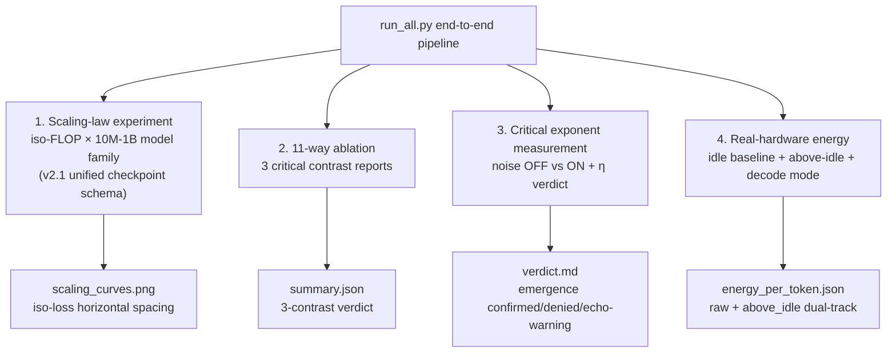

<!--
Copyright (c) 2026 Suzhou Jodell Robotics Co., Ltd.
Author: Gui LI <guilichina@163.com>
Date:   2026-05-30
UPDATE: 2026-05-28 (v2.1 full integration)
  * All three tiers (CID/QID/FID) completed v2.1 fixes:
      - HopfieldAttention implements §8.5 ET symmetric dual term
        (Lyapunov-guaranteed)
      - VortexField rebuilt from FFN antisymmetric projection
        (§14.2 zero extra parameters)
      - Default colored noise switched to OU physical SDE (§14.2;
        FFT retained as legacy)
      - QID/FID forward all v2.1 keys down to CIDLayer
      - FID info dict made JSON-safe via LOSS_PREFIX separation
      - FID adds §6.1 eta + §6.2 Ricci surrogates
  * Top-level APIs uniformly exposed:
      - UIDModel / QIDLayer / FIDLayer all expose
        set_noise_injection / set_energy_monitoring
      - Added fluctuation_dissipation_consistency diagnostic
  * Experiment pipelines wired through:
      - run_scaling_law.py saves unified v2.1 checkpoint schema
      - run_all.py fixes checkpoint-path gap
      - run_critical_exponents.py adds eta verdict with 3-state
        classification (pass / fail / abstain_rank_deficient /
        abstain_missing)
      - run_ablation.py reports the 11 ablations' 3 critical contrasts
      - run_energy_benchmark.py upgraded to energy_meter v2.1 batch 4
        (idle baseline + above-idle fields + prefill/decode modes)
  * Verification suite upgraded:
      - measure_fisher_anisotropy_eta() makes §6.1 prediction 4 truly
        measurable
      - energy_meter v2.1: pynvml high-frequency sampling +
        above-idle reporting
      - prediction_test.py demoted to deprecated wrapper that
        re-routes to the v2.0+ toolchain
  * Data-loader script normalised:
      - test_uid_on_minimind.py -> data_loaders.py rename
      - Provides PretrainJsonl + SftJsonl
      - SFT truncation preserves the prompt TAIL (instruction-tuning
        convention)
  * Test suite covers the full stack:
      - tests/test_et_lyapunov.py        (§8.5 ET monotonic descent)
      - tests/test_run_scaling_law.py    (v2.1 key propagation)
      - tests/test_qid_layer.py          (QID v2.1 + zero-extra-params)
      - tests/test_fid_layer.py          (FID 3-level propagation + JSON-safe)
      - tests/test_critical_exponents.py (new eta regressions + integration)
      - tests/test_energy_meter.py       (energy integration + portability)
      - tests/test_data_loaders.py       (with SFT tail truncation)

This README is part of the UID Theory reference implementation (v2.1).

DUAL LICENSE:
  - PolyForm Noncommercial License 1.0.0  (free for academic / personal use)
    see LICENSE-NONCOMMERCIAL in the project root
  - Commercial License from Suzhou Jodell Robotics Co., Ltd.
    (required for any commercial / for-profit / production use)
    see LICENSE-COMMERCIAL in the project root

For commercial licensing inquiries, contact: lig@jodell.cn
This file is released under a dual licence; commercial use requires
prior written authorisation from Suzhou Jodell Robotics Co., Ltd.
-->

<div align="center">


</div>

<div align="center">
<a href="./README.md">README（中文）</a> | <a href="./README_en.md"><b>README（English）</b></a>
</div>

<div align="center">
<a href="./30minutes_report.md">30 分钟读懂 UID 理论（中文）</a> | <a href="./30minutes_report_en.md">Understand UID in 30 Minutes（English）</a>
</div>

<div align="center">
<a href="./theory.md">UID 理论全文（中文）</a> | <a href="./theory_en.md">UID Theory (English)</a>
</div>

<br>

<div align="center">

# Intelligence Is a Non-Equilibrium Field:
## A Three-Tier Physical Theory of Unified Intelligo-Dynamics (UID)
### — Attention Is Not All You Need: A Non-Equilibrium Physical Theory of Intelligent Architectures

[CI](https://github.com/gwailee/uid/actions/workflows/ci.yml) | [DOI](https://doi.org/10.5281/zenodo.20372493) | [License: PolyForm Noncommercial](LICENSE)


***Authors***: Gui LI <guilichina@163.com>, Dangyang JIE <jiedy@jodell.cn>, Haitao KANG <kanght@jodell.cn>

***Affiliation***: Suzhou Jodell Robotics Co., Ltd., Suzhou, China

</div>

***Corresponding author***: Gui LI, Ph.D. He received his B.Sc. in Physics from Northwest University of China, and his M.Sc. and Ph.D. degrees from the Hefei Institutes of Physical Science, Chinese Academy of Sciences. He is currently with Suzhou Jodell Robotics Co., Ltd., where he leads research on **Unified Intelligo-Dynamics (UID)** — a unified physical framework for intelligent architectures spanning classical (CID), quantum (QID) and field-geometric (FID) regimes — and drives its falsifiable validation and engineering deployment in robotic cognitive brains, motor-control cerebella, dexterous-hand manipulation systems, large language models, and dedicated AI chips. E-mail: guilichina@163.com

---

## ⚠️ IMPORTANT: Notice on the Honest v2.1 Release

**This repository is currently at v2.1 (honest validation release + Theory §8.5 / §14.2 fixes)**, a complete rewrite of v0.1 informed by detailed peer-review feedback, with **three implementation gaps against the theory paper resolved on top of v2.0 plus a full infrastructure upgrade**:

| v2.1 key fix | Theory section |
|---|---|
| `HopfieldAttention` now implements the **ET symmetric dual-term update** (Lyapunov-guaranteed monotonic descent) | §8.5 |
| `VortexField` rebuilt from the **antisymmetric part of the FFN first-layer weight**, zero extra matrix parameters | §14.2 |
| Default colored noise switched to **Ornstein-Uhlenbeck physical SDE** (FFT version retained as legacy) | §14.2 |
| `FIDLayer` now directly reports §6.1 anisotropy η and §6.2 Ricci-scalar surrogate in `info` | §6.1 / §6.2 |
| QID / FID forward all v2.1 keys down to CIDLayer + expose the top-level API | Interface consistency |
| `run_critical_exponents.py` verdict table adds an η row + three-state classification | §6.1 |
| `energy_meter.py` upgraded to v2.1: idle baseline + above-idle fields + prefill/decode modes | §0.1 / §11.4 |

The v0.1 validation suite suffered from methodological defects that make its "validated" claims scientifically untenable. See [KNOWN_LIMITATIONS.md](./KNOWN_LIMITATIONS.md). **Empirical claims from v0.1 and v2.0 should be re-run under v2.1 before citation.**

v2.1 status:
- ✅ Provides the **complete infrastructure** required for rigorous validation (including 7 new test files giving full-stack coverage)
- ✅ Completes the Theory §8.5 ET fix, §14.2 zero-parameter vortex, §14.2 OU noise, §6.1 direct-η-measurement promises
- ⏳ Large-scale validation experiments are **not yet complete**
- 🎯 Commits to **publishing all results** (positive or negative)

**Falsifying a theory is as valuable as confirming it** — that is the very engine of scientific progress.

---

## 📋 Project Overview

This project implements and validates the **UID three-tier theory**:

| Tier | Full Name | Status |
|---|---|---|
| **CID** | Classical Intelligo-Dynamics | ✅ Rigorously engineerable (ET symmetric term + zero-extra-params vortex + OU noise), awaiting large-scale validation |
| **QID** | Quantum Intelligo-Dynamics | ⚠ Classical surrogate (zero-extra-params defaults + quantum OU noise); true quantum advantage requires quantum hardware |
| **FID** | Field Intelligo-Dynamics | 🔬 Diagnostic geometric probe (directly reports η / Ricci surrogate); empirical calibration pending |

The theory's core engineering claim:

> **A model architecture built from the CID master equation can significantly outperform a standard Transformer in parameter count, energy, or both.**

This is the **falsifiable hypothesis** this repository sets out to test rigorously.

---

## 🎯 Core Falsifiable Predictions

| # | Quantity | Theoretical Value | Status |
|---|---|---|---|
| 1 | Avalanche size exponent τ | 1.5 ± 0.2 | (A) Independently confirmed in cortical recordings |
| 2 | Hurst exponent H | 0.6 – 0.8 | (A) Independently confirmed in human-brain EEG |
| 3 | 1/f spectral slope β | 0.7 – 1.3 | (A) Confirmed across multiple studies |
| 4 | Fisher metric anisotropy η | > 0.5 (post-training) | (A) Karakida et al. 2019 report ≈ 0.7-0.9 in DNNs; directly measurable on the UID side via `measure_fisher_anisotropy_eta()` |
| 5 | Parameter efficiency vs Transformer | ≥ 3× (eventual ≥ 5×) | (C) Awaiting Phase 1 validation |
| 6 | Inference-energy improvement | ≥ 3× (above-idle) | (C) Awaiting Phase 1 validation (measured by v2.1 `energy_meter.py`) |
| 7 | Critical-exponent emergence with noise injection OFF | β and H remain in range | (C) Awaiting Phase 1 validation |
| 8 | ET energy monotonic descent in forward pass (§8.5) | dE/dt ≤ 0 | (C) Covered by `tests/test_et_lyapunov.py` |

**Legend**:
- (A) Independently confirmed in external systems (biological brains / published DNN studies)
- (B) Theoretically rigorous, empirical confirmation pending
- (C) Clearly defined falsifiable engineering target

> Any **significant deviation** from these ranges in measurement constitutes counter-evidence against the UID theory — which is the heart of science.

---

## 🆕 v2.1 Key Improvements Over v2.0

| Module | v2.0 status | v2.1 fix |
|---|---|---|
| **`HopfieldAttention`** | Standard scaled dot-product attention, inconsistent with the theory paper's own §8.5 | Implements the ET symmetric dual-term update, with Lyapunov-guaranteed monotonic energy descent; adds `compute_energy()` |
| **`VortexField`** | Introduced two independent H×H matrices W₁, W₂ (broke the §14.2 zero-extra-params promise) | Rebuilt from the antisymmetric part J = (W − W^T)/2 of the FFN first-layer weight; only +1 scalar parameter per layer |
| **Colored-noise default** | FFT spectral shaping (carries a circular-measurement risk) | Default switched to physical OU SDE (FFT still selectable via `noise_type="fft"`) |
| **QID layer parameter budget** | Default introduced 5×H² extra parameters (violated zero-extra-params principle) | Default `hamiltonian_mode='shared_with_ffn'` + `lindblad_mode='off'`, only a few scalars added; `count_extras()` diagnostic |
| **FID layer `info` dict** | `curvature_loss` was an autograd-bearing Tensor, crashing JSON serialisation | Introduces LOSS_PREFIX separation + `extract_loss_tensors()` helper; info dict is strictly JSON-safe |
| **FID curvature surrogate** | Only reported `trace(g²)/trace(g)²`, weakly tied to §6.1 prediction | Adds `compute_anisotropy_eta()` (direct match to §6.1) + `compute_ricci_scalar_surrogate()` (direct match to §6.2); legacy field retained |
| **Top-level APIs** | Required `model.backbone.xxx` to reach switches | `UIDModel` / `QIDLayer` / `FIDLayer` directly expose `set_noise_injection` / `set_energy_monitoring` / `set_temperature` / `fluctuation_dissipation_consistency` |
| **Baseline contrast** | `VortexField` in `transformer_plus_linear` silently degenerated to 0, breaking the key contrast | Baseline also accepts FFN weight reference; the contrast is now truly active |
| **`UIDConfig`** | Missing `noise_type` / `noise_tau` / `use_et_symmetric` fields, HF serialisation lost config | All three fields incorporated; HF round-trip preserves them |
| **Ablation variant count** | 9 | **11** (adds `cid_full_no_et` and `cid_full_fft_noise`, isolating the engineering contributions of §8.5 and §14.2) |
| **Critical-exponent verdict** | Based on noise-OFF single-point check only | Now contrasts noise-OFF vs noise-ON; adds "residual echo" warning; η participates in the verdict directly (three-state: pass/fail/abstain_rank_deficient) |
| **Energy measurement** | Only reported average power / total energy / energy per token | Adds idle baseline, above-idle power, above-idle energy, above-idle energy per token; distinguishes prefill / decode modes; pynvml high-frequency sampling defaults to 25 Hz |
| **Checkpoint pipeline** | `run_scaling_law.py` did not write checkpoints, causing downstream scripts to silently skip | Unified v2.1 schema (`{family}_{scale}_seed{seed}.pt`) + `run_all.py` checkpoint-path discovery fix |
| **Data-loader script** | `test_uid_on_minimind.py` (the `test_` prefix risked accidental pytest collection) | Renamed to `data_loaders.py`; adds `SftJsonl`; truncation preserves the prompt tail |
| **`prediction_test.py`** | v0.1 leftover (circular measurement + incorrect avalanche protocol) | Demoted to a deprecated wrapper that auto-routes to the v2.0+ toolchain |
| **Test coverage** | 5 ad-hoc tests | **7 v2.1 test files, ~200+ test cases**, covering every fix across all three tiers |

See [CHANGELOG.md](./CHANGELOG.md) for the full comparison.

---

## 📁 Project Layout

```
uid/
├── README.md                          Chinese README
├── README_en.md                       This file
├── KNOWN_LIMITATIONS.md               Honest declaration of v0.1 / v2.0 defects
├── ROADMAP.md                         Validation roadmap (with pre-registered falsification conditions)
├── CHANGELOG.md                       Full v0.1 -> v2.1 changes
├── LICENSE / LICENSE-NONCOMMERCIAL / LICENSE-COMMERCIAL
├── requirements.txt
├── requirements-dev.txt
├── pyproject.toml
├── data_loaders.py                    Data loading utilities (PretrainJsonl + SftJsonl)
│
├── uid_theory/                        Core UID theory implementation
│   ├── cid/                           Classical Intelligo-Dynamics
│   │   ├── cid_layer.py               v2.1: noise_type=ou default, ET toggle, FDT diagnostic
│   │   ├── colored_noise.py           OU + FFT dual implementations (OU is §14.2 default)
│   │   ├── vortex_field.py            Zero-extra-params vortex (FFN antisymmetric projection, §14.2)
│   │   ├── memory_kernel.py           Sub-Ohmic memory kernel γ(t) ~ t^(-α)
│   │   └── hopfield_potential.py      ET symmetric dual-term Hopfield attention (§8.5)
│   │
│   ├── qid/                           Quantum Intelligo-Dynamics (classical simulation)
│   │   ├── qid_layer.py               v2.1: shared_with_ffn default + top-level API
│   │   ├── berry_phase.py             Zero-params Berry rotation + tanh*π bounded
│   │   └── quantum_noise.py           QFDT + OU/FFT dual modes + set_temperature
│   │
│   ├── fid/                           Field Intelligo-Dynamics (diagnostic probe)
│   │   ├── fid_layer.py               v2.1: 3-level propagation + LOSS_PREFIX + three surrogates
│   │   ├── curvature.py               §6.1 eta + §6.2 Ricci + legacy
│   │   └── fisher_metric.py           Rank-deficient warning + true-Fisher-diagonal calibration
│   │
│   └── verification/                  v2.1 rigorous validation suite
│       ├── powerlaw_estimator.py      Clauset-Shalizi-Newman MLE
│       ├── critical_exponents.py      DFA + spectrum + measure_fisher_anisotropy_eta
│       ├── avalanche_detector.py      Correct Beggs-Plenz protocol
│       ├── energy_meter.py            v2.1 batch 4: pynvml + idle + decode
│       ├── ablation_suite.py          11-way complete ablation (incl. v2.1 isolation variants)
│       └── prediction_test.py         DEPRECATED: auto-routes to v2.0+ toolchain
│
├── model/
│   ├── modern_transformer.py          RoPE + RMSNorm + SwiGLU strong baseline
│   ├── known_tricks_baseline.py       Transformer + all known tricks (now truly active in v2.1)
│   └── model_uid.py                   UID causal LM (v2.1 exposes top-level API)
│
├── experiments/                       Full experiment scripts
│   ├── run_scaling_law.py             v2.1: unified checkpoint schema
│   ├── run_critical_exponents.py      v2.1: noise-OFF vs noise-ON + η verdict
│   ├── run_energy_benchmark.py        v2.1: idle baseline + above-idle + decode
│   ├── run_ablation.py                v2.1: 11-way + 3 critical contrasts
│   └── run_all.py                     v2.1: end-to-end pipeline + checkpoint-path fix
│
├── results/                           Real experimental results (to be filled in Phase 1)
│   └── README.md                      Results-directory index
│
├── tests/                             Unit tests (pytest)
│   ├── test_et_lyapunov.py            §8.5 ET monotonic descent + zero-extra-params vortex
│   ├── test_run_scaling_law.py        v2.1 param propagation + checkpoint schema
│   ├── test_qid_layer.py              QID v2.1 + bounded Berry + QFDT
│   ├── test_fid_layer.py              FID 3-level propagation + JSON-safe + η/Ricci
│   ├── test_critical_exponents.py     New η regressions + integration tests
│   ├── test_energy_meter.py           Energy integration + portability + GPU smoke
│   ├── test_data_loaders.py           PretrainJsonl + SftJsonl + tail truncation
│   ├── test_cid_layer.py              CID base tests
│   ├── test_ablation_suite.py         11-way ablation presence
│   ├── test_avalanche_detector.py     Beggs-Plenz protocol
│   ├── test_modern_transformer.py     Baseline base tests
│   └── conftest.py                    Shared fixtures
│
└── .github/workflows/                 CI + nightly training
```

---

## 🚀 Quick Start

### 1. Environment

```bash
git clone https://github.com/gwailee/uid.git
cd uid
pip install -r requirements.txt

# Strongly recommended for 25 Hz power sampling (vs nvidia-smi's 10 Hz cap)
pip install nvidia-ml-py
```

### 2. Run unit tests

```bash
pip install -r requirements-dev.txt

# All CPU-runnable tests (~200+ cases)
pytest tests/ -v -m "not gpu"

# Just the v2.1 key regression suite
pytest tests/test_et_lyapunov.py \
       tests/test_run_scaling_law.py \
       tests/test_qid_layer.py \
       tests/test_fid_layer.py \
       tests/test_critical_exponents.py \
       tests/test_energy_meter.py \
       tests/test_data_loaders.py -v

# With an NVIDIA GPU, also run GPU end-to-end
pytest tests/ -v
```

### 3. CPU smoke test (~10 minutes)

```bash
# Download a real small dataset (no synthetic data)
python -c "
from datasets import load_dataset
import json, os
os.makedirs('data/wikitext-2', exist_ok=True)
ds = load_dataset('wikitext', 'wikitext-2-raw-v1', split='train[:1000]')
with open('data/wikitext-2/train.jsonl', 'w') as f:
    for ex in ds:
        if ex['text'].strip():
            f.write(json.dumps({'text': ex['text']}) + '\n')
"

# Self-check the data-loader script
python data_loaders.py \
    --data_path data/wikitext-2/train.jsonl \
    --tokenizer_path gpt2 \
    --max_length 128

# Run the full 11-way ablation (small scale)
python experiments/run_ablation.py \
    --data_path data/wikitext-2/train.jsonl \
    --tokenizer_path gpt2 \
    --scale 10M \
    --epochs 1 \
    --seeds 42 \
    --batch_size 4 \
    --max_seq_len 128 \
    --output_dir /tmp/smoke
```

### 4. Full experiments (GPU required)

```bash
# End-to-end pipeline: scaling + ablation + critical exponents + energy
python experiments/run_all.py \
    --data_path data/wikitext-103/train.jsonl \
    --tokenizer_path gpt2 \
    --seeds 42 43 44
```

⚠️ **Full experiments take days of GPU compute.** This repository provides the tools and methodology; actually running them at scale is Phase 1 (see [ROADMAP.md](./ROADMAP.md)).

### 5. Measure critical emergence (noise injection MUST be off)

```python
import torch
from model.model_uid import UIDConfig, UIDModel

config = UIDConfig(vocab_size=6400, hidden_size=512, num_hidden_layers=8)
model = UIDModel(config)

# ... train the model ...

# CRITICAL: noise injection must be OFF before measuring emergence,
# otherwise the measured 1/f / Hurst / eta would just echo the
# injected noise pattern.
model.eval()
model.set_noise_injection(False)

# Then run 1/f spectrum, Hurst, avalanche, and eta measurements
from uid_theory.verification.critical_exponents import (
    run_critical_exponent_battery,
)
res = run_critical_exponent_battery(
    model=model, model_name="my_cid",
    dataloader=eval_loader, device="cuda",
    n_sequences=10000,
    disable_noise=True,           # turn noise injection OFF
    include_eta=True,             # measure §6.1 eta
    eta_threshold=0.5,            # README prediction 4 threshold
)
print(f"β = {res.spectrum.beta_mean:.3f}")
print(f"H = {res.hurst.hurst_mean:.3f}")
print(f"η = {res.eta.eta_mean:.3f} (in_range={res.eta.eta_in_range})")
```

### 6. Verify §8.5 ET Lyapunov monotonicity

```python
model.set_energy_monitoring(True)
out = model(input_ids, output_hidden_states=True)
# Each hidden state now carries its ET energy value, so recursive
# application can verify dE/dt ≤ 0 directly.
```

### 7. Measure real inference energy (v2.1 idle + above-idle)

```python
from uid_theory.verification.energy_meter import measure_inference_energy

em = measure_inference_energy(
    model=model, model_name="cid_full",
    input_ids=torch.randint(0, 50000, (16, 1024), device="cuda"),
    n_warmup=50, n_measure=500,
    device="cuda",
    mode="decode",                # or "prefill"
    new_tokens_per_decode=64,
    sample_rate_hz=25.0,
    idle_window_seconds=2.0,
)
print(f"Idle floor:           {em.idle_power_watts:.2f} W")
print(f"Above-idle power:     {em.power_above_idle_watts:.2f} W")
print(f"Energy/token (raw):   {em.energy_per_token_joules*1e3:.4f} mJ")
print(f"Energy/token (above): {em.energy_per_token_above_idle_joules*1e3:.4f} mJ")
```

---

## 🔬 Experimental Design

### Eleven-way complete ablation (2 new in v2.1)

#### Group A: CID component ablation

| Variant | Vortex v | Colored noise ξ | Memory kernel γ | Purpose |
|---|---|---|---|---|
| `cid_full` | ✅ | ✅ | ✅ | Full CID master equation |
| `cid_no_vortex` | ❌ | ✅ | ✅ | Isolates vortex contribution |
| `cid_no_memory` | ✅ | ❌ | ✅ | Isolates memory-kernel contribution (added in v2.0) |
| `cid_no_noise` | ✅ | ✅ | ❌ | Isolates colored-noise contribution |

#### Group A': v2.1 fix isolation (**new**)

| Variant | Description |
|---|---|
| `cid_full_no_et` | Full CID but with the §8.5 ET symmetric term OFF (isolates ET's engineering contribution) |
| `cid_full_fft_noise` | Full CID but with FFT noise instead of OU (isolates §14.2 OU's engineering contribution) |

#### Group B: Known-tricks baselines

| Variant | Description |
|---|---|
| `transformer_baseline` | Modern Transformer (RoPE + RMSNorm + SwiGLU) |
| `transformer_plus_noise` | + colored-noise regulariser only |
| `transformer_plus_conv` | + depthwise causal conv only |
| `transformer_plus_linear` | + extra linear term only (now truly active in v2.1, no longer a silent no-op) |
| `transformer_plus_all_tricks` | **All three known tricks combined (critical contrast)** |

### Three critical contrasts (v2.1 reported automatically by `run_ablation.py`)

1. **`cid_full` vs `transformer_plus_all_tricks`** — Central falsification test for UID's "physical framework" vs known tricks
2. **`cid_full` vs `cid_full_no_et`** — §8.5 ET symmetric term's engineering contribution
3. **`cid_full` vs `cid_full_fft_noise`** — §14.2 OU noise's engineering contribution over FFT

**Central falsification test**: If `cid_full` does not significantly outperform `transformer_plus_all_tricks`, then UID's "physical framework" claim is falsified — any gain (if any) came from the known tricks themselves, not the physical organisation.

⚠️ **Important v2.1 fix**: In v2.0, the `VortexField` inside `transformer_plus_linear` and `transformer_plus_all_tricks` did not receive an FFN weight reference, so its internal antisymmetric matrix was empty and the entire "linear extra" term silently degenerated to zero. This meant the v2.0 contrast **was not actually testing the "all known tricks combined" capability**. After the v2.1 fix, the contrast is genuinely active. **Any contrast results obtained on v2.0 should be re-run on v2.1 before citation.**

### Validation flow



---

## 📐 CID Master Equation Mapped Into Code (v2.1 update)

Theory equation (CID Chapter 6):

```
dφ/dt  =  -∇U(φ)                ← associative memory
         + v(φ)                  ← multi-bath vortex
         - ∫ γ(t-s) (dφ/ds) ds   ← colored damping
         + ξ(t)                  ← colored noise
```

Code mapping (`uid_theory/cid/cid_layer.py`):

```python
# 1. Associative memory -∇U → HopfieldAttention (v2.1: §8.5 ET symmetric dual term)
#    out = softmax_C(K Q^T) @ q  +  softmax_B(K Q^T) @ k
#    Lyapunov-guaranteed monotonic energy descent in the forward pass.
grad_term   = torch.exp(self.log_w_grad) * self.attn(h, causal_mask=mask)

# 2. Vortex v(φ) → VortexField (v2.1: §14.2 zero extra parameters)
#    J = (W_FFN - W_FFN^T) / 2, built from the antisymmetric part of the
#    FFN first-layer weight.
#    v = temp_diff * J @ x, only +1 learnable scalar log_temp_diff per layer.
vortex_term = torch.exp(self.log_w_vortex) * self.vortex(h)[0]

# 3. Colored damping γ(t) ~ t^(-α) → MemoryKernel (depthwise causal conv)
mem_term    = -torch.exp(self.log_w_mem) * self.memory(h)

# 4. Colored noise → OrnsteinUhlenbeckNoise (v2.1: §14.2 physical default)
#    d ξ = -ξ/τ dt + sqrt(2/τ) dW, steady-state <ξ(t)ξ(t+s)> = exp(-|s|/τ)
#    Can be turned off via model.set_noise_injection(False) when measuring
#    critical exponents, to avoid the circular-measurement problem.
#    The FFT version remains available via noise_type="fft".
noise_term  = self.noise_scale * self.noise(B, S, h.device, h.dtype)

# Euler-Maruyama discretisation: dt absorbed into the per-term weights.
x = x + grad_term + vortex_term + mem_term + noise_term
```

### Relationship to Transformer

Under the following limits, CID strictly degenerates to a standard Transformer:

| Limit | Code toggle |
|---|---|
| Turn off vortex v = 0 | `use_vortex=False` |
| Turn off colored noise ξ = 0 | `use_colored_noise=False` |
| Degenerate colored damping to white γ → δ | `use_memory=False` |
| Turn off ET symmetric term (revert to standard attention) | `use_et_symmetric=False` |
| Standard scaling β = 1/√d_k | implemented in `HopfieldAttention.scale` |

This confirms the Chapter 8 / 10 claim of the theory paper: **"Transformer is the simplest limit of CID."** But the central v2.0+ falsification test is whether merely adding back the "known tricks" suffices, or whether CID's physical organisation genuinely contributes an increment.

---

## 📊 Pre-Registered Falsification Conditions

Following open-science best practice, we **pre-register** the following falsification conditions. If any of them is not met after Phase 1, we will publicly acknowledge the corresponding UID claim as **falsified**:

1. **Parameter efficiency**: In the 100M-scale iso-FLOP scaling-law study, the CID curve must sit at least **3×** to the left of the modern Transformer baseline at iso-loss, **AND** at least **1.5×** to the left of the "Transformer + all known tricks" baseline.

2. **Critical-exponent emergence** (after noise injection is **off**, i.e. after `model.set_noise_injection(False)`):
   - The trained CID must show β ∈ [0.7, 1.3] in ≥80% of layers
   - The avalanche exponent τ (via Clauset MLE + KS test, p > 0.1) must be ∈ [1.3, 1.7]
   - **Fisher metric anisotropy η > 0.5** (§6.1 / README prediction 4; measured by `measure_fisher_anisotropy_eta()`, must exclude the rank-deficient case)

3. **Energy efficiency**: Measured Joules per token (v2.1 `energy_meter.py` above-idle) must be ≤ **1/3** of the modern Transformer baseline at iso-perplexity.

4. **§8.5 ET Lyapunov monotonicity**: With `model.set_energy_monitoring(True)`, recursive application of the attention with a small step size must yield strictly non-increasing ET energy (tolerance < 10⁻³ × |E₀|). This condition is covered by `tests/test_et_lyapunov.py`.

5. **The three critical ablation contrasts** (reported automatically by v2.1 `run_ablation.py`):
   - `cid_full` must significantly outperform `transformer_plus_all_tricks` (central falsification for UID's physical framework)
   - Turning off the ET symmetric term (`cid_full_no_et`) should noticeably degrade perplexity
   - Replacing OU with FFT noise (`cid_full_fft_noise`) should degrade the confidence of critical-exponent measurement (noise-OFF and noise-ON should become nearly indistinguishable)

**We commit to publishing all results regardless of outcome.**

---

## ⚠️ Honest Statement

| # | Statement |
|---|---|
| 1 | **CID is engineerable but awaits large-scale validation.** v2.1 supplies the complete validation infrastructure and implements the §8.5 / §14.2 fixes, but actual large-scale runs (10M–1B model family) belong to Phase 1 and are not yet complete. |
| 2 | **QID is a classical surrogate.** This implementation uses classical neural networks to emulate quantum coherence (Berry phase, colored noise with a zero-point branch, phenomenological Lindblad channels). It is **not** a strict Kraus decomposition. True quantum advantage requires NISQ or fault-tolerant quantum hardware. **This codebase cannot validate QID's quantum claims.** |
| 3 | **FID is an exploratory programme.** The Fisher metric and curvature surrogates serve a **diagnostic and soft-regulariser** role; they are **not** numerical solutions to any rigorously defined field equation on a specific manifold. The implementation uses a **hidden-state-space** empirical covariance as the Fisher surrogate (parameter-space true Fisher is provided by `FisherMetric.compute_true_fisher_diagonal()`, used only for small-batch calibration). |
| 4 | **CID is the only tier this codebase can falsify or confirm.** Citations of UID should respect this scope. |
| 5 | **Empirical claims from v0.1 and v2.0 should be re-run on v2.1 before citation.** The v0.1 validation suite suffered from circular reasoning and insufficient sample size; the v2.0 baseline `VortexField` silently degenerated to zero, invalidating the key contrast. Both have been fixed in v2.1. See [KNOWN_LIMITATIONS.md](./KNOWN_LIMITATIONS.md) and [CHANGELOG.md](./CHANGELOG.md). |
| 6 | **Energy comparisons should prefer the above-idle field.** Small models' idle floor (typically 30-80 W) dominates raw energy per token, making large models appear disproportionately efficient. v2.1 `energy_meter.py` reports both columns; README predictions 5 / 6 are evaluated against the **above-idle** numbers. |

---

## 🗺️ Validation Roadmap

| Phase | Time | Goal |
|---|---|---|
| **Phase 0** | 2026 Q2 | ✅ Complete v2.1 validation infrastructure (current state of this repository) |
| **Phase 1** | 2026 Q2–Q3 | 10M–100M scaling law + 11-way ablation + critical-exponent test (with η) |
| **Phase 2** | 2026 Q3–Q4 | 300M–1B validation + tightening falsification thresholds |
| **Phase 3** | 2026 Q4 | Multi-hardware (H100 / A100 / edge) energy comparison |
| **Phase 4** | 2027 Q1 | Invite independent teams to reproduce |
| **Phase 5** | 2027 Q2+ | Update the theory paper based on empirical results; submit to a peer-reviewed journal |

See [ROADMAP.md](./ROADMAP.md) for the full roadmap.

---

## 📚 References

The complete bibliography is in Appendix A of [`theory.md`](./theory.md). Key primary references (with clickable DOIs):

- **Langevin, P.** (1908). *Comptes Rendus* 146, 530. [gallica.bnf.fr](https://gallica.bnf.fr/ark:/12148/bpt6k3100t/f532)
- **Mori, H.** (1965). *Prog. Theor. Phys.* 33, 423. [doi.org/10.1143/PTP.33.423](https://doi.org/10.1143/PTP.33.423)
- **Zwanzig, R.** (1960). *J. Chem. Phys.* 33, 1338. [doi.org/10.1063/1.1731409](https://doi.org/10.1063/1.1731409)
- **Hopfield, J. J.** (1982). *PNAS* 79, 2554. [doi.org/10.1073/pnas.79.8.2554](https://doi.org/10.1073/pnas.79.8.2554)
- **Hoover, B., et al.** (2023). *Energy Transformer*. NeurIPS 2023. [arxiv.org/abs/2302.07253](https://arxiv.org/abs/2302.07253) — source of the §8.5 ET symmetric term
- **Bialek, W., Nemenman, I., & Tishby, N.** (2001). *Neural Computation* 13, 2409. [doi.org/10.1162/089976601753195969](https://doi.org/10.1162/089976601753195969)
- **Clauset, A., Shalizi, C. R., & Newman, M. E.** (2009). *SIAM Review* 51(4), 661. [doi.org/10.1137/070710111](https://doi.org/10.1137/070710111)
- **Berry, M. V.** (1984). *Proc. R. Soc. A* 392, 45. [doi.org/10.1098/rspa.1984.0023](https://doi.org/10.1098/rspa.1984.0023)
- **Caldeira, A. O., & Leggett, A. J.** (1983). *Physica A* 121, 587. [doi.org/10.1016/0378-4371(83)90013-4](https://doi.org/10.1016/0378-4371(83)90013-4)
- **Amari, S.** (1985). *Differential-Geometrical Methods in Statistics*. [doi.org/10.1007/978-1-4612-5056-2](https://doi.org/10.1007/978-1-4612-5056-2)
- **Karakida, R., Akaho, S., & Amari, S.** (2019). *Universal Statistics of Fisher Information in Deep Neural Networks*. AISTATS. [arxiv.org/abs/1806.01316](https://arxiv.org/abs/1806.01316) — empirical basis for §6.1 η in DNNs
- **Beggs, J. M., & Plenz, D.** (2003). *J. Neurosci.* 23, 11167. [doi.org/10.1523/JNEUROSCI.23-35-11167.2003](https://doi.org/10.1523/JNEUROSCI.23-35-11167.2003)
- **Linkenkaer-Hansen, K., et al.** (2001). *J. Neurosci.* 21, 1370. [doi.org/10.1523/JNEUROSCI.21-04-01370.2001](https://doi.org/10.1523/JNEUROSCI.21-04-01370.2001)
- **Peng, C.-K., et al.** (1994). *Mosaic organization of DNA nucleotides*. *Phys. Rev. E* 49, 1685. — DFA gold standard
- **Ramsauer, H., et al.** (2020). *Hopfield Networks Is All You Need*. [arxiv.org/abs/2008.02217](https://arxiv.org/abs/2008.02217)
- **Vaswani, A., et al.** (2017). *Attention Is All You Need*. [arxiv.org/abs/1706.03762](https://arxiv.org/abs/1706.03762)

---

## 📝 Citing this Work

If you use this work in a paper, product, or service, please cite:

```bibtex
@article{li2026uid,
  title  = {Intelligence Is a Non-Equilibrium Field: A Three-Tier Physical 
            Theory of Unified Intelligo-Dynamics (UID)},
  author = {LI, Gui and JIE, Dangyang and KANG, Haitao},
  year   = {2026},
  publisher = {Zenodo},
  doi    = {10.5281/zenodo.20372493},
  url    = {https://github.com/gwailee/uid}
}
```

Plain-text citation:

> LI, Gui, JIE, Dangyang, & KANG, Haitao. (2026). Intelligence Is a Non-Equilibrium Field: A Three-Tier Physical Theory of Unified Intelligo-Dynamics (UID). Zenodo. https://doi.org/10.5281/zenodo.20372493

---

## 📜 Licence

This project is released under a **dual licence**.

| Use case | Applicable licence |
|---|---|
| Academic research, teaching, students, individuals, registered non-profits, government research institutions | **PolyForm Noncommercial License 1.0.0** (free) — see [`LICENSE-NONCOMMERCIAL`](./LICENSE-NONCOMMERCIAL) |
| Any commercial, for-profit, or production use | **Commercial License** (paid) — see [`LICENSE-COMMERCIAL`](./LICENSE-COMMERCIAL) |

**Applicability quick reference** (full rules in [`LICENSE`](./LICENSE)):

- ✅ **Free**: Faculty / student research and teaching, individual learning, non-profit research work
- ❌ **Requires commercial licence**: Using this code or any derivative for (a) any activity that creates revenue or value for a for-profit entity; (b) production deployment; (c) distribution alongside a commercial product / service; (d) hosting as a paid service (including SaaS); (e) paid consulting, technical services, or training

### Commercial licensing enquiries

Any enterprise (foreign, joint-venture, limited liability, joint-stock, or sole proprietorship) wishing to use this repository for any of the commercial scenarios above **must** obtain prior written authorisation from Suzhou Jodell Robotics Co., Ltd.

| Item | Content |
|---|---|
| **Company** | Suzhou Jodell Robotics Co., Ltd. |
| **Contact** | Gui LI |
| **Email** | **lig@jodell.cn** |
| **Email subject prefix** | `[UID Commercial License]` |

Please include in your enquiry: licensee legal name and registration, intended use and deployment scale, commercial launch timeline, negotiation contact.

### Trademark notice

"UID", "Unified Intelligo-Dynamics", "CID", "QID", "FID", "Suzhou Jodell Robotics" and related marks are proprietary identifiers of Suzhou Jodell Robotics Co., Ltd. They may not be used in commercial advertising or product naming without written permission.

### Disclaimer

> THE SOFTWARE IS PROVIDED "AS IS", WITHOUT WARRANTY OF ANY KIND, EXPRESS OR IMPLIED. IN NO EVENT SHALL THE AUTHORS OR COPYRIGHT HOLDERS BE LIABLE FOR ANY CLAIM, DAMAGES OR OTHER LIABILITY ARISING FROM USE OF THIS SOFTWARE.

---

## 🙏 Acknowledgements

- **Peer reviewers**: special thanks to the anonymous reviewers whose detailed critiques of v0.1 and v2.0 motivated the v2.0 complete rewrite and the v2.1 §8.5 / §14.2 fixes respectively. Honest critique made UID a more rigorous project. See [KNOWN_LIMITATIONS.md](./KNOWN_LIMITATIONS.md).
- **[MiniMind](https://github.com/jingyaogong/minimind) by jingyaogong**: high-quality small-model architecture and datasets.
- **UID's physical predecessors** (in chronological order): Langevin, Einstein, Fokker, Planck, Mori, Zwanzig, Lindblad, Caldeira-Leggett, Berry, Amari, Hopfield, Bak-Tang-Wiesenfeld, Bialek, Friston, Beggs-Plenz, Linkenkaer-Hansen, Karakida-Akaho-Amari, and many others.
- **Founders of modern deep-learning architectures**: Vaswani et al. (Transformer), Ramsauer et al. (Modern Hopfield Networks), Hoover et al. (Energy Transformer, key §8.5 reference), Gu & Dao (Mamba), He et al. (ResNet).
- **Statistical-method pioneers**: Clauset, Shalizi & Newman (power-law fitting gold standard); Peng et al. (DFA method).
- **Open-science tool ecosystem**: PyTorch, Hugging Face, pynvml, pytest, ruff — they made rigorous validation possible.

---

<div align="center">

> **The central goal of Unified Intelligo-Dynamics** is to lift "intelligence" from an engineering phenomenon to a physical theory.
> 
> CID is codeable, QID is simulable, FID is explorable. **All results are falsifiable — which is the heart of science.**

</div>
```
