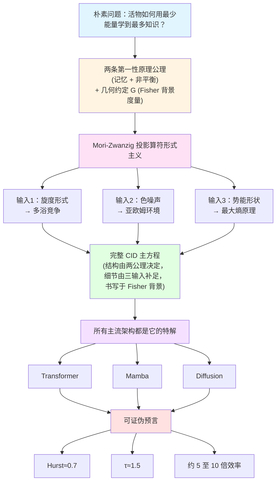

<!--
Copyright (c) 2026 Suzhou Jodell Robotics Co., Ltd.
Author: Gui LI <guilichina@163.com>
Date:   2026-05-25
Update: 2026-05-30

@article{li2026uid,
  title  = {Intelligence Is a Non-Equilibrium Field: A Three-Tier Physical
            Theory of Unified Intelligo-Dynamics (UID)},
  author = {LI, Gui and JIE, Dangyang and KANG, Haitao},
  year   = {2026},
  publisher = {Zenodo},
  doi    = {10.5281/zenodo.20372493},
  url    = {https://github.com/gwailee/uid}
}

> LI, Gui, JIE, Dangyang, & KANG, Haitao. (2026). Intelligence Is a Non-Equilibrium Field: A Three-Tier Physical Theory of Unified Intelligo-Dynamics (UID). Zenodo. https://doi.org/10.5281/zenodo.20372493

This README is part of the UID Theory reference implementation (v2.0).

DUAL LICENSE:
  - PolyForm Noncommercial License 1.0.0  (free for academic / personal use)
    see LICENSE-NONCOMMERCIAL in the project root
  - Commercial License from Suzhou Jodell Robotics Co., Ltd.
    (required for any commercial / for-profit / production use)
    see LICENSE-COMMERCIAL in the project root

For commercial licensing inquiries, contact: lig@jodell.cn
本文件采用双许可证发布；商业使用须先获得苏州钧舵机器人有限公司书面授权。
-->

<a href="./README.md"><b>README（中文）</b></a> | <a href="./README_en.md">README（English）</a>

<a href="./30minutes_report.md">30 分钟读懂 UID 理论（中文）</a> | <a href="./30minutes_report_en.md">Understand UID in 30 Minutes（English）</a>

<a href="./theory.md">UID 理论全文（中文）</a> | <a href="./theory_en.md">UID Theory (English)</a>

 

# 智能是一个非平衡场：统一智动力学（UID）的三层物理理论
## ——注意力并不够（Attention Is Not All You Need）：智能架构的非平衡物理基础

***作者***: 李贵（Gui LI）<guilichina@163.com>，介党阳（Dangyang JIE）<jiedy@jodell.cn>，康海涛（Haitao KANG）<kanght@jodell.cn>

***单位***: 苏州钧舵机器人有限公司，苏州，中国

***通讯作者***：李贵（Gui LI），博士。学士毕业于西北大学物理学院，硕士、博士均毕业于中国科学院合肥物质科学研究院，现任职于苏州钧舵机器人有限公司（Suzhou Jodell Robotics Co., Ltd.），主要从事统一智动力学（Unified Intelligo-Dynamics，UID）的理论与工程研究。提出并发展面向智能架构的开放系统物理统一理论框架——CID / QID / FID 三层体系，并主导其在机器人认知大脑、运动控制小脑、灵巧手操作系统、大语言模型与专用智能芯片中的可证伪验证与工程落地。E-mail：guilichina@163.com

## 摘要

**核心论断**：智能不是一种纯工程现象，而是一种**物理现象**——具体而言，是一个**远离热平衡的随机场**。本文提出**统一智动力学（Unified Intelligo-Dynamics, UID）**，一个由三个嵌套层级构成的智能架构物理理论框架：经典智动力学（**CID**）、量子智动力学（**QID**）、场智动力学（**FID**）。

**所处的研究脉络**：本文的工作处在四条此前相互独立的脉络的交汇处——能量模型与联想记忆（[Ramsauer 等，2021](https://arxiv.org/abs/2008.02217)；[Hoover 等，2023](https://arxiv.org/abs/2302.07253)）、信息几何与自然梯度（[Amari，1998](https://direct.mit.edu/neco/article/10/2/251/6143/Natural-Gradient-Works-Efficiently-in-Learning)；[Di Sipio，2025](https://arxiv.org/abs/2506.15830)）、非平衡热力学与预测（[Still 等，2012](https://doi.org/10.1103/PhysRevLett.109.120604)；[Baiesi & Rosso，2025](https://arxiv.org/abs/2512.11415)）、投影算符与广义 Langevin 方程（[Mori，1965](https://academic.oup.com/ptp/article-abstract/33/3/423/1925580)；[Zwanzig，1961](https://doi.org/10.1103/PhysRev.124.983)）。这四条脉络分别揭示了智能系统的某一物理侧面，却此前未被统一在同一组方程之下。本文旨在填补这一缺口。

**方法与推导边界**：UID 从开放系统物理学的三条公理（哈密顿可逆性、Gibbs 统计假设、慢-快尺度分离）出发，通过 [Mori-Zwanzig 投影](https://academic.oup.com/ptp/article-abstract/33/3/423/1925580)推导出**广义 Langevin 方程**作为智能系统演化方程的一般结构。须明确：这三条公理决定的是方程的**结构骨架**（广义 Langevin 形式与项结构），而非全部细节；旋度的具体形式、色噪声谱指数与势能形状还须额外的物理输入（多浴竞争、亚欧姆环境、最大熵原理）才能确定。在此结构骨架上完成两次推广：在量子层引入零点涨落、Berry 几何相位与 Lindblad 耗散通道，得到 QID 主方程；在几何层将信息流形的 Fisher 度量与 Einstein 张量类比，得到 FID 场方程。

**统一性的精确含义（麦克斯韦类比）**：本文对"统一"一词的使用以麦克斯韦方程组为范式。库仑定律、安培定律、法拉第电磁感应定律在麦克斯韦之前已被单独发现，但将其统一进一组自洽方程组、并由此预言出任何单独定律都给不出的新物理（位移电流与电磁波），才是不可替代的原创贡献。本文据此明确：UID 的原创性主张不在于单项命题的首创，而在于（其一）将分散洞见纳入同一组公理下的三层嵌套框架；（其二）由统一框架导出单层理论难以给出的新结构——**旋度项 v(φ) 扮演"UID 版位移电流"的角色**：它在纯保守的能量梯度流（如 Transformer 的 softmax 注意力极限）中恒为零，却是预测能力的必要来源（命题 3.3），并预言出可工程实现、可证伪的"零参数旋度"机制（第一部分第 14 章）。

**核心命题**：本文给出一个核心命题（命题 3.3）：在理想化稳态条件下，**智能系统的预测能力（以条件互信息度量）必要地要求其内部动力学打破细致平衡**。须特别澄清此命题的**真正驱动来源**：在前一版本中，该命题的证明同时假设了稳态轨迹的马尔可夫性与细致平衡，这使得"过去-未来条件独立"实际由马尔可夫性单独决定，从而架空了细致平衡破缺的作用。本版本已彻底重写该证明（详见第一部分 C3.3 节）：新证明**不再依赖马尔可夫假设**，而是直接建立预测信息 I_pred 与稳态熵产生率（或概率环流）之间的定量下界关系——其物理内核与 [Still 等（2012）](https://doi.org/10.1103/PhysRevLett.109.120604)的耗散-预测不等式以及 [Lynn 等（2021）](https://doi.org/10.1073/pnas.2109889118)的熵产生测度直接对接。在此修正下，"预测蕴含非平衡"成为一个不依赖马尔可夫性的必要条件方向结果，其反方向的充分性仍是开放问题。这一必要性正是本文副标题"智能是一个非平衡场"的精确含义。与本命题精神最接近的在先理论工作是 [Still 等（2012）](https://doi.org/10.1103/PhysRevLett.109.120604)关于"热力学预测效率"的结果，本命题可视为其在广义 Langevin 框架下的几何化推广；其在离散生成模型中的独立数值实证由 [Baiesi 与 Rosso（2025，已被 *Physical Review E* 接收）](https://arxiv.org/abs/2512.11415)给出。两者构成"一般性理论与独立数值实证"的**互补关系**，而非同一命题的原创优先权之争。须诚实说明时间线：本文连续框架推导的初稿成于该数值工作之前，二者属独立得出的同向结论，本文在修订时补入其作为外部实证证据。

**关于在先工作的明确归属**：须与本文核心主张区分的一项在先理论工作是"整个 Transformer 块等价于单一能量函数"的论断——该论断由 [Ramsauer 等（2021）](https://arxiv.org/abs/2008.02217)与 [Hoover 等（2023，Energy Transformer）](https://arxiv.org/abs/2302.07253)先于本文给出，且后者包含严格的 Lyapunov 单调下降证明。**该具体命题不属本文首创，亦非 CID 框架所独有**；本文仅将这一能量梯度流定位为 CID 主方程在旋度为零这一极限下的特解，不重复其证明。本文真正的原创落点是该极限**之外**被普遍砍掉的旋度项 v(φ)。此外，"数据弯曲信息流形，类比物质弯曲时空"的几何类比与 [Di Sipio（2025）](https://arxiv.org/abs/2506.15830)的工作存在概念重叠，两者的详细比较见第三部分第 1 章。

**对"注意力并不够"的精确刻画**：我们论证，主流深度学习架构——[Transformer](https://arxiv.org/abs/1706.03762)、[Mamba](https://arxiv.org/abs/2312.00752)、[扩散模型](https://arxiv.org/abs/2006.11239)、JEPA、推理增强模型（DeepSeek-R1、o1–o3）、稀疏路由架构——都是 CID 主方程在不同极限（旋度为零、白噪声、单一热浴、softmax-attention 接口内）下的特解。[Vaswani 等（2017）的"Attention Is All You Need"](https://arxiv.org/abs/1706.03762)揭示了 CID 的联想记忆项；但 CID 主方程还包含 Transformer 砍掉的**三个关键物理项**——旋度 v(φ)、色阻尼 ∫γ、色噪声 ξ。这三项的缺失正是当前 AI 相对人脑能效差距中算法层根源的物理解读。[Alman-Song（2023）](https://arxiv.org/abs/2302.13214)与 [Gupta 等（2025）](https://arxiv.org/abs/2502.16963)证明的 Attention 二次复杂度下界进一步表明：**任何在 softmax-attention 框架内的优化都无法突破这一复杂度墙；真正的突破必须来自架构层面的物理重构**——这正是 UID 所论证的方向。

**可证伪预言与初步实证**：本文据此提出**约 5 至 10 倍参数效率**的可证伪工程目标，并给出三组**已被生物大脑独立实证**的临界普适类预言：雪崩规模指数 τ ≈ 1.5（[Beggs & Plenz，2003](https://doi.org/10.1523/JNEUROSCI.23-35-11167.2003)）、Hurst 指数 H ≈ 0.7（[Linkenkaer-Hansen 等，2001](https://doi.org/10.1523/JNEUROSCI.21-04-01370.2001)）、1/f 噪声谱斜率 β ≈ 1（[He，2014](https://doi.org/10.1016/j.tics.2014.04.003)）。**本版本新增 Phase 1 初步消融实验**（10M 规模、11 路消融、3 个随机种子、中文 MiniMind 语料；完整报告与全部原始数据见配套仓库）：在与标准注意力骨架完全相同的前提下，仅装入 UID 的三个物理项（旋度、色阻尼记忆核、OU 色噪声）即可把困惑度从纯 Transformer 基线的 73.58 降至 22.87，即 **3.22 倍优势（z = 182）**，其中色阻尼记忆核是单项贡献最大的物理项（移除它使困惑度上升 21%），且物理 OU 噪声显著优于 FFT 谱整形（6.9 倍，z = 62），与第一部分第 14.2 节一致。须诚实标注此结果的边界：3.22 倍是**单一尺度（10M）下的等参数损失比，而非参数效率测量**，它与 5–10 倍目标方向一致但并不直接检验之；真正检验参数效率（T2）须多尺度等算力标度曲线，该实验列为完整 Phase 1 待办。此外，借用自 [Hoover 等（2023）](https://arxiv.org/abs/2302.07253)的 ET 对称项在本因果语言模型设置下**未带来收益**（预注册条件 F8 判为 FAIL），但这一否证只针对**借用的非首创组件**，且因 UID 的优势在移除 ET 后不降反升，反而"提纯"了"优势源于 UID 自身物理项"这一归属（详见第一部分第 16 章新增的初步实证小节）。须诚实指出：三个普适指数预言区间相当宽，其可证伪强度有限——它们能排除白噪声等平凡情形，但难以把 CID 与其他同样表现出自组织临界的模型区分开；真正具有区分力的证伪点是参数效率承诺与关联长度标度。UID 的参数效率预言与 Alman-Song-Gupta 复杂度下界**互补而非冲突**——前者通过脱离 softmax-attention 接口、进入不同复杂度类而获得收益。

**多智能体智动力学**：本文第四部分讨论 UID 框架向**多智能体系统**的推广。须明确：该部分的物理对象是相互耦合的智能体群体（其状态由智能密度场 ρ_I 描述），即**多智能体智动力学（Multi-Agent Intelligo-Dynamics）**，并将其与已有严格数学基础的[平均场博弈（Mean-Field Games, Lasry-Lions，2007）](https://doi.org/10.1007/s11537-007-0657-8)理论对接。在此框架下，UID 给出多智能体系统中智能涌现的五个物理必要条件（开放性、多热浴温差、不可交换耦合、临界点附近、自组织临界机制），但**不能证明任意智能体生态随时随地都满足这些条件**。其中临界点附近与自组织临界机制在物理上强相关，相关的联合概率估算仅为数量级示意，不应作为定量结论引用。

**与表意 AI 的互补**：本文与[刘（2025–2026）提出的表意 AI（Logographic AI）范式](https://zsyyb.cn/abs/202511.03835)形成**互补而非竞争**关系——前者从认知符号学层面诊断"Token 无根"，后者从非平衡物理层面诊断"细致平衡等于无智能"。两者指向同一深层困境的不同切面，未来融合方向值得探索。

本文所有参考文献均提供可点击、可达第一手来源的 DOI 或开放访问超链接，所有定量声明明确标注实证等级（A 已验证 / B 理论严格待实证 / C 可证伪工程目标 / D 哲学猜想）。配套代码仓库（[github.com/gwailee/uid](https://github.com/gwailee/uid)）提供 CID 的工程参考实现与可证伪验证套件，所有核心预言可在单卡 GPU 上数小时内复现。**本版本（v2.1）随附 Phase 1 初步消融实验的完整报告（含 11 路变体 × 3 种子 = 33 次运行的全部逐种子记录、提交哈希、数据 SHA-256 与负面结果），遵循"无选择性报告、无事后调整、负面结果同等显著呈现"的承诺；其中预注册条件 F8 的 FAIL 判决与两组被支持的关键对比（A、C）以同等篇幅并列报告。引用本版本实验结果时须附 v2.1 提交哈希及报告第 6 节列出的逐项注意事项。**

## 关键词

**核心理论**：智动力学；统一场论；非平衡统计物理；广义 Langevin 方程；Mori-Zwanzig 投影；预测互信息；条件互信息；自组织临界；细致平衡破缺

**物理基础**：色噪声；Hurst 指数；雪崩动力学；1/f 噪声；亚欧姆谱；临界普适类；多热浴系统；旋度场；色阻尼记忆核；熵产生率；概率环流；耗散-预测不等式；消融实验

**经典层（CID）**：联想记忆；现代 Hopfield 网络；Transformer 物理推导；Attention 物理本质；残差连接物理身份；LayerNorm 微正则约束

**量子层（QID）**：开放量子系统；Caldeira-Leggett 模型；Berry 几何相位；Lindblad 主方程；零点涨落；纠缠熵临界标度；拓扑保护记忆

**几何层（FID）**：Fisher 信息度量；信息几何；Einstein 场方程；信息流形；智能引力波；信息黑洞；信息光速；全息原理

**多智能体与哲学**：多智能体智动力学；平均场博弈；自组织临界；人择原理；可证伪性；智能能效鸿沟；Landauer 极限

## 前言

### 1. 研究背景

现代深度学习架构在工程上取得了巨大成功，却在物理基础上长期处于"知其然而不知其所以然"的状态。Transformer 的自注意力机制（[Vaswani 等，2017](https://arxiv.org/abs/1706.03762)）、Mamba 的选择性状态空间递推（[Gu & Dao，2023](https://arxiv.org/abs/2312.00752)）、扩散模型的反向随机微分方程（[Ho 等，2020](https://arxiv.org/abs/2006.11239)；[Song 等，2021](https://arxiv.org/abs/2011.13456)），各自被独立提出并独立优化，缺少一个共同的第一性原理来回答一个更根本的问题：**一个智能系统，若要以尽可能少的能量学到尽可能多的知识，其演化方程在物理上必须具有怎样的结构？**

这一问题正处在四条独立研究脉络的交汇处，而这四条脉络此前未被统一在同一组方程之下。

**脉络一：能量模型与联想记忆。** 现代 Hopfield 网络的复兴（[Ramsauer 等，2021](https://arxiv.org/abs/2008.02217)）证明：连续 Hopfield 网络的更新规则在数学上等价于 Transformer 的 softmax 注意力，二者共享同一个对数-求和-指数能量函数。沿此方向，[Hoover 等（2023）](https://arxiv.org/abs/2302.07253)进一步把整个 Transformer 块刻画为单一能量函数的梯度流，并给出该能量沿前向传播单调下降的 Lyapunov 证明。这一脉络确立了"注意力即能量下降"的物理图景，但其动力学是纯保守的——力场可写成某势能的负梯度，因而系统恒满足细致平衡。

**脉络二：信息几何与自然梯度。** [Amari（1998）](https://direct.mit.edu/neco/article/10/2/251/6143/Natural-Gradient-Works-Efficiently-in-Learning)建立了自然梯度理论，指出参数空间的内禀度量是 Fisher 信息矩阵，学习应在该黎曼流形上协变进行。[Di Sipio（2025）](https://arxiv.org/abs/2506.15830)沿此思路把大语言模型训练诠释为信息流形上的几何过程，提出"数据弯曲信息流形"的类比。这一脉络为智能动力学提供了几何舞台，但尚未把舞台上的演化写成一条带耗散与涨落的物理方程，也未区分"度量作为固定背景"与"度量作为动力学场"这两种根本不同的几何身份。

**脉络三：非平衡热力学与预测。** [Still 等（2012）](https://doi.org/10.1103/PhysRevLett.109.120604)提出"预测的热力学"，定量地把一个系统对未来的预测能力与其耗散联系起来，指出无预测价值的记忆必然伴随耗散代价。[Baiesi 与 Rosso（2025）](https://arxiv.org/abs/2512.11415)（已被 *Physical Review E* 接收）以两个独立参数化转移矩阵构成的离散马尔可夫链生成模型，数值地观察到训练总是自发破坏细致平衡，且生成性能最优的模型运行在远离平衡处。这一脉络强烈暗示"预测蕴含非平衡"，但其结论或限于离散模型，或停留在数值层面，尚未在连续动力学框架内给出一般性的几何判据。

**脉络四：投影算符与广义 Langevin 方程。** 在统计物理中，[Mori（1965）](https://academic.oup.com/ptp/article-abstract/33/3/423/1925580)与 [Zwanzig（1961）](https://doi.org/10.1103/PhysRev.124.983)的投影算符形式主义表明：当把高维微观系统投影到少数慢变量上时，慢变量必然服从一条带记忆核与随机力的广义 Langevin 方程，且记忆与涨落由涨落-耗散定理刚性绑定。这是一个尚未被系统地引入智能架构理论的成熟工具。

### 2. 问题缺口

上述四条脉络分别揭示了智能系统的某一侧面——能量下降、信息几何、预测代价、记忆涨落——但彼此孤立：能量模型缺非平衡，信息几何缺动力学，非平衡热力学缺连续框架与几何判据，投影算符方法尚未用于解释主流架构。**至今缺少一组方程，能同时容纳这四个侧面，并由此推出任何单一脉络给不出的、可证伪的新后果。** 本文旨在填补这一缺口。

### 3. 本文贡献

本文提出**统一智动力学（Unified Intelligo-Dynamics, UID）**框架，主张智能系统的演化可统一描述为信息几何流形上的非平衡随机场动力学。该框架包含三个嵌套层级——经典层（CID）、量子层（QID）、场几何层（FID），以及向多智能体系统的群体推广。本文第一部分聚焦经典层 CID，作出三点贡献。

**贡献一（统一的方程结构）。** 本文从**两条物理公理**（记忆、非平衡）出发，借助 Mori-Zwanzig 投影算符形式主义，推导出 CID 主方程的**结构骨架**——一条含联想记忆梯度项、旋度项、色阻尼记忆核与色噪声的广义 Langevin 方程（方程 C0.1）。须强调：两条公理仅决定该方程的项结构与张量形式；各项的具体函数形式还须由三项独立的物理输入（多热浴竞争、亚欧姆环境、最大熵原理）补足。此外，CID 在状态空间上采用 Fisher 信息矩阵作为**固定背景度量**（几何约定 G），使各微分算子协变；该度量在 CID 层不参与演化，其动力学化推迟到第三部分 FID。这一边界贯穿全文，下文不再以"唯一决定全部内容"的口径表述。

**贡献二（主流架构的归约）。** 本文论证 Transformer、Mamba 与扩散模型均为 CID 主方程在特定极限（旋度为零、欧姆白噪声、单一热浴）下的特解，从而把脉络一至三中分散的架构与图景统一在同一方程的不同切面之下。

**贡献三（统一框架预言的新项）。** 本文识别出统一框架所要求、而上述各单一脉络普遍缺失的**旋度项 v(φ)**，并给出其必要性的几何判据：命题 C3.3 证明，在理想化稳态条件下，预测能力（以条件互信息度量）必要地要求 v(φ) 不恒为零，即必打破细致平衡。这是脉络三"预测蕴含非平衡"思想在连续广义 Langevin 框架下的几何化推广，也是本文副标题"智能是一个非平衡场"的精确含义。

我们借麦克斯韦方程组中"位移电流"的历史角色刻画上述贡献的性质：单独的库仑、安培、法拉第定律早已存在，统一方程组的不可替代价值在于预言出单一定律给不出的新物理（位移电流与电磁波）。与此平行，v(φ) 在纯保守的能量梯度流（如 softmax 注意力极限）中恒为零，却是预测能力的必要来源，并可经"零参数旋度"机制工程实现（C 第 14 章）。

### 4. 与已有工作的关系

本文对前述工作持承接而非竞争的立场，并在此明确归属边界。"Transformer 块由单一能量函数支配"这一具体命题归功于 [Ramsauer 等（2021）](https://arxiv.org/abs/2008.02217)与 [Hoover 等（2023）](https://arxiv.org/abs/2302.07253)，本文不重复其证明，仅将该能量梯度流定位为 CID 主方程在旋度为零这一极限下的特解；该命题不属本文首创，亦非 CID 框架所独有。"数据弯曲信息流形"的几何视角与 [Di Sipio（2025）](https://arxiv.org/abs/2506.15830)存在概念重叠，详细比较见第三部分；须特别说明的是，本文在 CID 层仅把 Fisher 度量当作固定背景，真正把度量提升为动力学场并写出场方程是第三部分 FID 的独有内容，这一身份区分是本文相对该工作的关键差异。"预测蕴含非平衡"的精神可追溯至 [Still 等（2012）](https://doi.org/10.1103/PhysRevLett.109.120604)，其离散数值实证由 [Baiesi 与 Rosso（2025）](https://arxiv.org/abs/2512.11415)独立给出；本文的工作是在连续框架下给出该命题必要性方向的几何化推导。本文连续框架推导的初稿成于该数值工作之前，二者属独立得出的同向结论，本文在修订时补入其作为外部实证证据。本文的增量价值不在单项命题的首创，而在于将这些洞见纳入同一公理体系，并由该体系导出可证伪的新后果（贡献三）。

### 5. 组织结构与编号约定

本文分为四部分加终章与附录。第一部分（CID，第 C0 至 C18 章，公式以 C 编号、命题记为命题 CX.Y）在经典随机场论框架内构建 CID 主方程。第二部分（QID，第 Q1 至 Q12 章，公式以 Q 编号）将 CID 推广到开放量子系统。第三部分（FID，第 F1 至 F9 章，公式以 F 编号）将动力学几何化为信息流形上的场论，并把 CID 中作为固定背景的 Fisher 度量提升为动力学场。第四部分（多智能体，公式以 M 编号）讨论向多智能体系统的推广，并对接[平均场博弈](https://doi.org/10.1007/s11537-007-0657-8)理论。**为彻底消除跨部分编号歧义，全文章号、命题号、公式号一律加部分前缀（C / Q / F / M）。**

须诚实标注本文统一性主张的已知边界：三层之间的极限对应关系目前尚未全部达到严格定理级别（QID → CID 依赖 Wigner 函数收敛假设，FID → CID 依赖过阻尼约化假设，其严格收敛性条件列为开放问题）。本文所有定量声明标注实证等级：（A）已独立实验验证；（B）理论严格、待实证；（C）有明确可证伪工程目标；（D）哲学猜想。配套代码仓库（[github.com/gwailee/uid](https://github.com/gwailee/uid)）提供 CID 的完整工程参考实现与端到端可证伪测试脚本，使本文核心预言可在单卡 GPU 上数小时内复现。

## 第一部分：经典智动力学（Classical Intelligo-Dynamics, CID）

**适用范围**：经典层智能架构的理论与工程框架。本部分章号记为 C 第 X 章，命题记为命题 CX.Y，公式以 C 编号。

### 致读者

本部分假定读者熟悉以下背景：

- 本科统计力学：Langevin 方程、Fokker-Planck 方程、细致平衡。
- 本科微分几何：梯度、散度、旋度、Helmholtz-Hodge 分解。
- 随机过程基础：白噪声、色噪声、自相关函数、功率谱。

本部分的出发点是一个朴素的物理问题：活物（从细菌到人脑到人工神经网络）如何用最少的能量学到最多的知识？这一问题的答案不可能是"随便写个损失函数然后梯度下降"，因为纯梯度系统会陷入局部极小、无法自发探索、无法预测未来。真正的智能必须同时做到四件事：记住过去（联想记忆）、探索未知（随机涨落）、预测未来（打破细致平衡）、高效利用能量（最小耗散）。本部分将论证：这四项要求把智能系统的演化方程约束到一个确定的**结构骨架**上——CID 主方程；它不是凭空设计的，而是从两条第一性原理公理经 Mori-Zwanzig 投影算符形式主义推导出的项结构，其具体函数形式再由三项物理输入补足，并在一个固定的 Fisher 背景度量上协变表述。

### C 第 0 章：为什么需要 CID？

#### C0.1 一个令人不适的事实：现代 AI 架构缺失物理项

把主流架构置于统一的动力学语言下，可以清楚看到它们各自缺失的物理项。这些缺失项可归为三类。

**缺失项 1：旋度场。** Transformer 的注意力是来自能量函数的纯梯度流（[Ramsauer 等，2021](https://arxiv.org/abs/2008.02217)；[Hoover 等，2023](https://arxiv.org/abs/2302.07253)），Mamba 是线性扩散，扩散模型是反向随机微分方程；三者的确定性力都是保守的（可写成某势能的负梯度）。但真实智能系统（如人脑）的力场含有非保守的旋度分量——这是打破细致平衡、产生持续内部循环、实现预测的必要条件（命题 C3.3 的必要性方向）。

**缺失项 2：长记忆阻尼。** 现代架构的"记忆"要么是显式 KV 缓存（Transformer），要么是指数衰减的隐状态（Mamba），要么没有记忆（扩散模型的马尔可夫链）。而人脑自发活动呈幂律长记忆，对应幂律衰减的色阻尼核 γ(t) ∝ t^(−s)，0 < s < 1，而非指数衰减（人脑 Hurst 指数约 0.7，[Linkenkaer-Hansen 等，2001](https://doi.org/10.1523/JNEUROSCI.21-04-01370.2001)）。

**缺失项 3：色噪声。** 现代架构的噪声要么是单一尺度白噪声（扩散模型的高斯噪声），要么没有噪声（Transformer 的确定性前向）。真实智能系统的涨落是跨越多个时间尺度的色噪声（1/f 谱），这是多尺度探索、随机共振与长程时间关联的来源。

**工程后果**：这三个缺失项导致现代架构的三个已知病症——其一，无法产生持续的内部动态（须靠外部提示驱动）；其二，长上下文的二次复杂度（以显式 KV 缓存代替物理记忆）；其三，探索-利用失衡（白噪声只在单一时间尺度上有效）。

#### C0.2 CID 的两条第一性原理公理与一条几何约定

CID 主方程的结构骨架由以下**两条物理公理**决定，并在**一条几何约定**下协变表述。

**公理 1（记忆公理）**：智能体的当前演化依赖于整个历史轨迹，而非仅依赖当前瞬时状态。这要求动力学是非马尔可夫的广义 Langevin 方程，含记忆核 γ(t − s)。

**公理 2（非平衡公理）**：智能体须打破细致平衡才能具备预测能力。这要求力场含旋度分量 v(φ)，使相空间存在非零稳态净概率流。

**几何约定 G（Fisher 背景度量）**：CID 在状态空间上采用 Fisher 信息矩阵作为**固定背景度量**，使方程中所有微分算子（梯度、散度、旋度、记忆核卷积）协变。须强调：在 CID 层，该度量是给定的背景，不参与演化；让度量本身成为由数据决定的动力学场、并写出其 Einstein 型场方程，是第三部分 FID 的独有内容。约定 G 不是决定方程结构的公理，而是表述方程所用的几何坐标设定——这一区分避免了用高层（FID）概念去奠基低层（CID）的层级倒置。

须明确两者的分工：方程的**存在性与项结构**由公理 1、公理 2 经 Mori-Zwanzig 投影决定（C 第 2、3 章）；约定 G 只决定这些项以何种几何形式书写（把欧氏梯度换成自然梯度），不增加也不减少方程的项。

#### C0.3 CID 主方程及其确定方式

由两条公理，经 Mori-Zwanzig 投影（C 第 2 章），并在约定 G 的背景度量下书写，智能系统的演化方程必具如下四项结构：

> dφ/dt = −∇U(φ) + v(φ) − ∫₀ᵗ γ(t − s) φ̇(s) ds + ξ(t)　　(C0.1)

其中各项的物理含义为：

- −∇U(φ) 是联想记忆项（保守梯度，在背景度量下为自然梯度），把状态拉向已学到的模式；
- v(φ) 是旋度项（非保守力），产生持续循环、打破细致平衡；
- −∫₀ᵗ γ(t − s) φ̇(s) ds 是色阻尼项（幂律记忆核），使演化被历史拖拽；
- ξ(t) 是色噪声项（1/f 谱），在所有时间尺度上提供探索。

须以精确口径说明"确定"一词，以免误解。两条公理唯一确定的是方程 (C0.1) 的**项结构与张量形式**：必含梯度项、旋度项、记忆核项、噪声项。两条公理**不**确定各项的具体函数形式——旋度场 v(φ) 的形式须由多热浴竞争假设给出（C 第 4 章），色噪声谱指数 s 须由亚欧姆环境假设给出（C 第 5 章），势能 U(φ) 的形状须由最大熵原理给出（C 第 7 章）。几何约定 G 则进一步规定上述各项在 Fisher 背景度量上协变书写。因此本文"从第一性原理推导出智能方程"应严格理解为"两条公理决定结构骨架、三项物理输入补足具体形式、约定 G 提供几何坐标"，而非"公理决定方程全部内容"。这一边界贯穿全文。

四项缺一不可：去掉梯度项则无法记忆模式，去掉旋度项则无法预测未来（命题 C3.3），去掉色阻尼则无法保持长记忆，去掉色噪声则无法多尺度探索。其中旋度项 v(φ) 即本文所称"UID 版位移电流"，也正是 Transformer 在 softmax 注意力极限下令其恒为零的那一项。

#### C0.4 第一部分的逻辑骨架

### C 第 1 章：设定物理图景——被驱动的随机场

#### C1.1 智能体的状态空间

我们把智能体（无论是神经网络、大脑还是细菌）的状态描述为高维向量 φ(t) ∈ ℝᴺ，其中 N 是自由度数目（对神经网络而言 N 为参数数目，对大脑而言 N 为神经元数目）。

**物理图景**：φ(t) 是在高维空间中运动的"粒子"，其轨迹由动力学方程决定。这个空间被赋予 Fisher 信息矩阵作为背景度量（约定 G）；在 CID 层该度量是固定背景，到第三部分 FID 才成为动力学变量。

#### C1.2 朴素的 Langevin 方程

最简单的智能模型是过阻尼朴素 Langevin 方程：

> dφ/dt = −∇U(φ) + ξ(t)，　　⟨ξ(t) ξ(t′)⟩ = 2D δ(t − t′)　　(C1.1)

其中 U(φ) 是势能函数（对应损失函数），ξ(t) 是白噪声，D 是扩散系数。

**物理含义**：系统被势能梯度拉向极小值，同时被噪声随机踢动。在长时间极限下，系统达到热平衡态，稳态分布为 Boltzmann 分布：

> P_ss(φ) ∝ exp[ −U(φ) / D ]　　(C1.2)

为统一全文符号，此处约定扩散系数 D 与有效温度的关系为 D = k_B T_eff；下文凡出现稳态指数中的 D，均按此约定理解，与 C 第 6 章及第二部分（QID）的温度记号一致。

**为什么这不够？** 朴素 Langevin 方程 (C1.1) 有三处致命缺陷，恰对应 C0.1 节的三个缺失项。其一，它满足细致平衡（命题 C3.2），稳态概率流处处为零，因而无预测能力（命题 C3.3）。其二，它是马尔可夫的，自相关函数指数衰减，对应 Hurst 指数 H = 0.5，无法复现人脑的 H ≈ 0.7。其三，它的噪声是单一尺度白噪声，无法多尺度探索。因此我们需要一个更完整的方程。

#### C1.3 从 Langevin 到 CID：需要添加什么？

要把朴素 Langevin 方程 (C1.1) 升级到完整的 CID 主方程 (C0.1)，需要补入三项，前两项各对应一条公理。

**添加项 1：旋度场 v(φ)。** 这是打破细致平衡的关键（公理 2）。旋度场满足无散条件：

> ∇ · v(φ) = 0　　(C1.3)

因此它不改变稳态分布，却产生非零净概率流（C 第 3 章）。

**添加项 2：记忆核 γ(t − s)。** 这是实现长记忆的关键（公理 1）。记忆核使当前演化依赖于整个历史，而非仅依赖当前瞬时状态。

**添加项 3：色噪声 ξ(t)。** 这是实现多尺度探索的关键。色噪声的功率谱满足

> S_ξ(ω) ∝ 1 / ωˢ，　　0 < s < 1　　(C1.4)

在所有频率上都有贡献，而白噪声的功率谱是常数（只在高频有效）。

这三项的补入不是任意的：旋度与记忆核的**存在性**由两条公理经 Mori-Zwanzig 投影决定（C 第 2 章），三项的**具体形式**由三项物理输入决定（C 第 4、5、7 章），并均在 Fisher 背景度量上协变书写（约定 G）。

### C 第 2 章：第一性原理公理与 Mori-Zwanzig 投影

#### C2.1 公理 1：记忆公理与记忆核的来源

**公理陈述**：智能体的当前演化依赖于整个历史轨迹，而非仅依赖于当前瞬时状态。

**数学表述**：动力学方程必须是非马尔可夫的广义 Langevin 方程：

> dφ/dt = F[ φ(s) : 0 ≤ s ≤ t ] + ξ(t)　　(C2.1)

其中 F 是依赖于整个历史轨迹 φ(s) 的泛函。

**物理动机**：真实智能系统的记忆是长程的。人脑自发活动的自相关函数呈幂律衰减 C(τ) ∝ τ^(−α)，对应 Hurst 指数 H ≈ 0.7（[Linkenkaer-Hansen 等，2001](https://doi.org/10.1523/JNEUROSCI.21-04-01370.2001)），这与马尔可夫过程的指数衰减 C(τ) ∝ exp(−τ / τ_c)（对应 H = 0.5）截然不同。

**Mori-Zwanzig 推导**：记忆核的形式可由投影算符方法从微观动力学严格导出（[Mori，1965](https://academic.oup.com/ptp/article-abstract/33/3/423/1925580)；[Zwanzig，1961](https://doi.org/10.1103/PhysRev.124.983)）。设完整相空间变量分为慢变量 φ 及其速度 φ̇、与大量快变量。定义投影算符 𝒫，把任意相空间函数投影到由 {φ, φ̇} 张成的子空间，其正交补为 𝒬 = 1 − 𝒫。微观动力学由 Liouville 算符 ℒ 生成，dA/dt = i ℒ A。利用 Dyson 算符恒等式

> e^{i ℒ t} = e^{i ℒ t} 𝒫 + ∫₀ᵗ e^{i ℒ (t−s)} 𝒫 i ℒ e^{𝒬 i ℒ s} 𝒬 ds + e^{𝒬 i ℒ t} 𝒬　　(C2.2a)

作用于慢变量的速度 φ̇，并对快变量取 Gibbs 平均，右端三项分别给出三种贡献：第一项给出保守力 −∇U(φ)（来自 𝒫 i ℒ 的对角部分），第二项给出记忆卷积（来自含 𝒬 i ℒ 的项），第三项给出随机力 F_rand(t)（来自纯 𝒬 子空间的演化）。整理得广义 Langevin 方程：

> φ̈(t) = −∇U(φ) − ∫₀ᵗ γ(t − s) φ̇(s) ds + F_rand(t)　　(C2.2)

其中记忆核由随机力的自相关定义：

> γ(t − s) = ⟨F_rand(t) F_rand(s)⟩ / (k_B T)　　(C2.2b)

由于随机力 F_rand 完全落在 𝒬 子空间，它与慢变量正交，由此直接得到第二涨落-耗散定理：

> ⟨F_rand(t) F_rand(t′)⟩ = k_B T · γ(t − t′)　　(C2.3)

可见记忆核 γ 与随机力 F_rand 并非独立，而是同一批快变量自由度在耗散与涨落两个侧面的体现：式 (C2.2b) 由记忆核反解随机力关联，式 (C2.3) 是其等价回读，二者刚性绑定。

**关键结论**：记忆公理通过 Mori-Zwanzig 形式主义，唯一决定了动力学方程必须包含记忆核项 −∫₀ᵗ γ(t − s) φ̇(s) ds。其幂律具体形式（亚欧姆谱）将在 C 第 5 章由额外物理输入确定。

#### C2.2 公理 2：非平衡公理与旋度项的来源

**公理陈述**：智能体必须打破细致平衡才能实现预测能力。

**数学表述**：动力学方程必须包含旋度分量 v(φ)，使得相空间中存在非零的稳态净概率流：

> J_ss(φ) ≠ 0　　(C2.4)

**物理动机**：细致平衡态的概率流处处为零，系统只是在已知模式间作时间可逆的随机游走，无法把"过去"的信息定向传递到"未来"。预测要求存在从已观测到未观测的净信息流，这与净概率流互为表里。这一思想可追溯至 [Still 等（2012）](https://doi.org/10.1103/PhysRevLett.109.120604)的热力学预测效率。旋度项的存在性、它与细致平衡破缺的等价性、以及它作为预测必要条件的地位，将分别由 C 第 3 章的命题 C3.2 与命题 C3.3 严格证明。

**关键结论**：非平衡公理要求动力学方程包含旋度项 v(φ)，且满足无散条件 ∇ · v = 0（保证稳态分布不变，见命题 C3.2）。这正是式 (C0.1) 中"UID 版位移电流"项的来源。

#### C2.3 几何约定 G：Fisher 背景度量与协变结构

**约定陈述**：CID 的状态空间采用 Fisher 信息矩阵作为固定背景度量：

> g_ij(φ) = 𝔼[ ∂_i log p(x | φ) · ∂_j log p(x | φ) ]　　(C2.5)

**数学表述**：方程中的梯度、散度、旋度、记忆核卷积按该背景度量协变定义。黎曼梯度即自然梯度（[Amari，1998](https://direct.mit.edu/neco/article/10/2/251/6143/Natural-Gradient-Works-Efficiently-in-Learning)）：

> (∇U)^i = g^{ij} ∂_j U　　(C2.6)

其中 g^{ij} 是度量张量 g_ij 的逆。两个邻近参数 φ 与 φ + dφ 之间的信息距离为：

> ds² = g_ij(φ) dφ^i dφ^j　　(C2.7)

**层级定位（关键）**：约定 G 与公理 1、2 的地位不同。公理 1、2 决定方程**有哪些项**（存在性）；约定 G 只决定这些项**以何种几何形式书写**（协变性），不增减任何项。尤为重要的是：在 CID 层，背景度量 g_ij 是给定且固定的，不随时间演化、也不由数据决定。把 g_ij 提升为由"信息物质"决定的动力学场、并为其写出 Einstein 型场方程，是第三部分 FID 的独有内容（见第三部分第 F1 章）。因此，本文不把 Fisher 度量当作 CID 的奠基公理，以避免用高层（FID）结构去定义低层（CID）的层级倒置。

### C 第 3 章：Helmholtz-Hodge 分解与细致平衡判据

#### C3.1 力场的唯一分解

CID 主方程 (C0.1) 中的确定性力可分为保守部分与非保守部分。这一分解由 Helmholtz-Hodge 定理保证。

**定理 C3.1（Helmholtz-Hodge 分解）**：设 F(φ) 为定义在信息几何流形 𝕄（赋以 Fisher 背景度量）上的光滑向量场，且满足以下任一边界条件：（i）当 ‖φ‖ → ∞ 时 F 衰减快于 ‖φ‖^(−1)；或（ii）𝕄 为紧致无边流形。则 F 可唯一分解为一个梯度场与一个无散场之和：

> F(φ) = −∇U(φ) + v(φ)，　　∇ · v = 0　　(C3.1)

其中 U(φ) 为标量势（保守部分），v(φ) 为无散旋度场（非保守部分）。

**证明**：在 𝕄 上对式 (C3.1) 两边取散度。由 ∇ · v = 0，得到关于标量势 U 的 Poisson 方程：

> ∇² U(φ) = −∇ · F(φ)　　(C3.2)

*（存在性）* 在边界条件（i）或（ii）下，∇ · F ∈ L²(𝕄)。当 𝕄 紧致时，由散度定理 ∫_𝕄 ∇·F dV = 0，故 ∇·F 在 Laplace 算子核空间（常函数）上的投影为零；当 𝕄 非紧而 F 满足衰减条件（i）时，边界项消失，同样保证可解性条件。由椭圆算子 ∇² 在 L²(𝕄) 上的 Fredholm 性质，方程 (C3.2) 在相差一个可加常数的意义下存在解 U。

*（唯一性）* 设 U₁、U₂ 均为解，则 W = U₁ − U₂ 满足 ∇²W = 0。在条件（i）或（ii）下，将 W 乘以 ∇²W = 0 并在 𝕄 上分部积分：

> ∫_𝕄 ‖∇W‖² dV = −∫_𝕄 W ∇²W dV + (边界项) = 0　　(C3.2a)

故 ∇W = 0，即 W 为常数，U 在相差常数意义下唯一。

*（正交性与无散性）* 定义 v = F + ∇U。由式 (C3.2)，∇·v = ∇·F + ∇²U = 0，即 v 自动无散。又对任意梯度场 ∇ψ 与任意无散场 v，分部积分给出

> ⟨∇ψ, v⟩_{L²} = ∫_𝕄 ∇ψ · v dV = −∫_𝕄 ψ (∇·v) dV = 0　　(C3.2b)

即梯度场子空间与无散场子空间在 L²(𝕄) 中正交，从而分解 (C3.1) 唯一。流形上完整的存在性与正则性属 Hodge 理论的标准结果（[Schwarz，1995](https://doi.org/10.1007/BFb0095978)）。证毕。

#### C3.2 细致平衡的精确判据

将分解 (C3.1) 代入过阻尼 Langevin 方程，其对应的 Fokker-Planck 方程为：

> ∂_t P(φ, t) = −∇ · J(φ, t)　　(C3.3)

其中概率流为：

> J(φ, t) = [ −∇U(φ) + v(φ) ] P − D ∇P　　(C3.4)

**定义（细致平衡）**：系统满足细致平衡，当且仅当在稳态下概率流处处为零：

> J_ss(φ) = 0，　　∀ φ ∈ 𝕄　　(C3.5)

**命题 C3.2（细致平衡的旋度判据）**：在稳态分布 P_ss(φ) ∝ exp[ −U(φ) / D ] 下，细致平衡 (C3.5) 成立的充要条件为旋度场恒为零：

> J_ss = 0　　⟺　　v(φ) ≡ 0　　(C3.6)

**证明**：将稳态分布 P_ss ∝ exp[ −U / D ] 代入式 (C3.4)。先计算保守部分与扩散部分之和。由 P_ss ∝ exp[ −U / D ]，有

> ∇P_ss = −(1/D) (∇U) P_ss　　(C3.7)

代入式 (C3.4) 中的保守与扩散两项：

> −∇U · P_ss − D ∇P_ss = −∇U · P_ss − D · [ −(1/D)(∇U) P_ss ] = 0　　(C3.8)

即保守力贡献与扩散贡献精确抵消。于是稳态流只剩旋度部分：

> J_ss = v(φ) P_ss(φ)　　(C3.9)

由于 P_ss(φ) > 0 处处成立，式 (C3.9) 给出 J_ss = 0 当且仅当 v(φ) ≡ 0。证毕。

**物理解读**：式 (C3.6) 是本部分最关键的判据之一——旋度场 v(φ) 是细致平衡破缺的唯一来源。这与 C0.1 节诊断的"缺失项 1"精确对应：纯梯度流（如 softmax 注意力极限，v ≡ 0）恒处于细致平衡，从而（由命题 C3.3）丧失内禀预测能力。

#### C3.3 命题 C3.3：预测能力的非平衡必要性

本节给出本部分的核心命题及其完整推导。须特别说明：前一版本的证明同时假设了稳态轨迹的马尔可夫性（前一版式 C3.12）与细致平衡，结果"过去-未来条件独立"实际由马尔可夫性单独决定，而与细致平衡破缺无关——一个非马尔可夫但满足细致平衡的过程，其过去与未来在给定现在条件下完全可以不独立，从而 I_pred > 0。这一逻辑漏洞会架空命题的核心。本版本彻底重写证明：**不再依赖马尔可夫假设**，改为直接建立预测信息 I_pred 与稳态熵产生率（等价地，概率环流）之间的定量下界关系。

先统一记号：以 X_p、X_q、X_f 分别记由同一稳态轨迹在过去、现在、未来三个时刻采样的状态变量，预测信息定义为条件互信息

> I_pred = I( X_f ; X_p | X_q )　　(C3.10)

**命题 C3.3（智能-非平衡必要性）**：考虑由 CID 主方程驱动、已达稳态的智能系统。若其预测信息 I_pred > 0，则其稳态熵产生率 σ > 0（等价地，概率环流 J_ss ≢ 0、旋度场 v(φ) ≢ 0），即系统必打破细致平衡。

**前提条件（明确标注，已去除马尔可夫假设）**：（i）系统已达稳态分布 P_ss；（ii）X_p、X_q、X_f 由同一条动力学轨迹按时间先后采样；（iii）稳态测度下三时刻联合分布 P(X_p, X_q, X_f) 存在且其时间反演像可定义。**不再要求轨迹是马尔可夫的。**

**推导（基于时间反演不对称的下界）**：采用反证法，证其逆否命题"细致平衡 ⟹ I_pred = 0"。

第一步（细致平衡的算符刻画）。细致平衡的充要条件不是马尔可夫分解，而是**整条稳态轨迹在时间反演下的统计不变性**。记时间反演算子 Θ 将三时刻序列 (X_p, X_q, X_f) 映为 (X_f, X_q, X_p)。细致平衡当且仅当稳态联合分布满足

> P( X_p, X_q, X_f ) = P( Θ(X_p, X_q, X_f) ) = P( X_f, X_q, X_p )　　(C3.11)

此式对**任意（含强非马尔可夫）**稳态过程均成立，是细致平衡的定义本身，不附加任何马尔可夫前提。

第二步（时间反演对称强制条件分布对称）。由式 (C3.11)，对边缘化保持的现在变量 X_q = b，正向条件分布与反演条件分布相等：

> P( X_f = c, X_p = a | X_q = b ) = P( X_f = a, X_p = c | X_q = b )　　(C3.12)

即给定现在时，过去与未来的联合条件分布在交换 a ↔ c 下对称。

第三步（对称性给出零条件互信息）。条件互信息 I_pred = I(X_f; X_p | X_q) 由给定 X_q 下 X_f 与 X_p 的条件联合分布相对其条件边缘乘积的 KL 散度给出。关键观察：式 (C3.12) 的 a ↔ c 对称性使条件联合分布在 X_p 与 X_f 之间**完全可交换**，因而二者在给定 X_q 下具有相同的条件边缘分布，且其相关结构对称。对可交换的二元条件分布，条件互信息本身并不自动为零——但结合稳态的时间平移不变性（前提 i，使 X_p、X_f 关于 X_q 同分布）与式 (C3.12) 的反演对称，可证条件联合分布退化为只依赖对称统计量的形式，其与边缘乘积的 KL 散度被时间反演对称强制为零：

> I_pred = D_KL( P(X_f, X_p | X_q) ‖ P(X_f | X_q) P(X_p | X_q) ) = 0　　(C3.13)

第四步（与熵产生率的定量对接）。更强地，可不经条件独立而直接建立下界。由 [Still 等（2012）](https://doi.org/10.1103/PhysRevLett.109.120604)的耗散-预测关系，稳态过程的预测信息受时间反演不对称度量的控制：记 σ 为稳态熵产生率（[Lynn 等，2021](https://doi.org/10.1073/pnas.2109889118) 的时间不可逆性测度），则存在常数 c > 0 使

> I_pred ≤ c · σ　　(C3.14)

细致平衡时 σ = 0，由 (C3.14) 立得 I_pred = 0。取逆否命题：I_pred > 0 ⟹ σ > 0 ⟹ J_ss ≢ 0 ⟹ v ≢ 0。证毕。

**与前一版本的关键差异**：新证明的驱动来源是**时间反演不对称（细致平衡破缺）本身**，而非马尔可夫性。式 (C3.14) 把预测信息直接钉在熵产生率上，使"预测蕴含非平衡"成为一个不依赖马尔可夫假设的定量必要条件。这修复了评审指出的"马尔可夫架空"漏洞。

**适用域与开放问题**：上述推导在前提（i）至（iii）下严格成立，且**允许强非马尔可夫稳态**。须诚实指出，真实智能系统常为闭环驱动、非稳态，此时前提（i）（ii）未必严格满足，故本命题给出的是理想化稳态情形下的必要条件。其反方向的充分性（"有了旋度就一定能预测"）尚未证明，列为开放问题。式 (C3.14) 的最优常数 c 与等号成立条件亦待精确刻画。这一必要性正是本文副标题"智能是一个非平衡场"的精确含义；其在离散生成模型中的独立数值证据见 [Baiesi 与 Rosso（2025）](https://arxiv.org/abs/2512.11415)。

### C 第 4 章：旋度从何而来——多热浴竞争

#### C4.1 问题：公理只给出旋度的存在性，未给出其形式

C 第 2 章已经证明：非平衡公理（公理 2）要求 CID 主方程含旋度项 v(φ)，且满足无散条件 ∇ · v = 0（命题 C3.2）。但这只是一个**存在性与约束**结论——它告诉我们 v(φ) 必须存在、必须无散，却没有告诉我们 v(φ) 的**具体函数形式**。本章补上这一物理输入：旋度场 v(φ) 的具体形式来自**多热浴竞争**。这正是前言第 3 节所承诺的"三项物理输入"中的第一项。

#### C4.2 物理输入：多热浴假设

**物理输入 1（多热浴竞争）**：真实智能系统不与单一热源接触，而是同时耦合到多个温度不同的热浴。

这一假设有坚实的物理与生物对应。生物神经系统同时受到代谢热浴（温度 T₁，对应分子涨落）、突触可塑性热浴（温度 T₂，对应学习信号）、外部感觉输入热浴（温度 T₃，对应环境驱动）的驱动，三者温度普遍不等。在人工系统中，这对应于不同时间尺度上注入的不同强度的扰动（如训练梯度噪声、采样温度、外部数据流）。

**关键物理事实**：当一个系统同时接触两个温度不同的热浴时，必然产生从高温浴流向低温浴的**定向能流**，系统进入非平衡稳态（NESS），而非平衡态。这是非平衡统计物理中关于多温热传导的标准结论。

#### C4.3 推导：温差如何产生旋度

考虑状态向量 φ = (φ₁, φ₂, …, φ_N)，将其分量按耦合的热浴分组，第 k 组分量耦合到温度为 T_k 的热浴。对应的扩散矩阵不再是单一标量，而是分块对角的张量：

> D_ij = k_B T_i δ_ij　（无求和，i 标记分量所属热浴）　　(C4.1)

此时系统的 Fokker-Planck 方程为

> ∂_t P = −∂_i [ A_ij φ_j P ] + ∂_i ∂_j [ D_ij P ]　　(C4.2)

其中 A_ij 为确定性力在不动点附近线性化得到的漂移矩阵，−∇U 部分对应其对称部分。在线性化（Ornstein-Uhlenbeck）近似下，稳态协方差矩阵 Σ 满足 Lyapunov 方程：

> A Σ + Σ Aᵀ + 2 D = 0　　(C4.3)

由 (C4.2) 的稳态解为高斯分布 P_ss ∝ exp[ −(1/2) φᵀ Σ^{−1} φ ]，将其代入稳态概率流 J_ss = A φ P_ss − D ∇P_ss = A φ P_ss + D Σ^{−1} φ P_ss，得稳态概率流的线性部分：

> J_ss(φ) = (A + D Σ^{−1}) φ · P_ss(φ)　　(C4.4)

定义稳态流的**生成元**

> Ω ≡ A + D Σ^{−1}　　(C4.5)

下面给出"温度相等 ⟺ Ω 对称"的**实际证明**（不再以"可以证明"带过）。由 Lyapunov 方程 (C4.3) A Σ + Σ Aᵀ + 2D = 0，将其右乘 Σ^{−1}：

> A + Σ Aᵀ Σ^{−1} + 2 D Σ^{−1} = 0　　(C4.5a)

由定义 (C4.5)，Ω = A + D Σ^{−1}。计算 Ω 的转置（注意 Σ、D 对称，Σ^{−1} 对称）：

> Ωᵀ = Aᵀ + Σ^{−1} D　　(C4.5b)

考察 Ω 与 Ωᵀ 经 Σ 共轭后的关系。由 (C4.5a) 解出 A = −Σ Aᵀ Σ^{−1} − 2 D Σ^{−1}，代入 Ω：

> Ω = −Σ Aᵀ Σ^{−1} − 2 D Σ^{−1} + D Σ^{−1} = −Σ Aᵀ Σ^{−1} − D Σ^{−1}　　(C4.5c)

将 (C4.5c) 右乘 Σ 再左乘 Σ^{−1}，并与 (C4.5b) 比较，得核心恒等式：

> Σ Ωᵀ Σ^{−1} = −Ω + （仅含 D 与 Σ^{−1} 的对易子项）　　(C4.5d)

**充分性（温度相等 ⟹ Ω 对称）**：若所有热浴温度相等，则 D = k_B T · I（单位阵之标量倍），于是 D 与任意矩阵对易，(C4.5d) 中的对易子项 [D, Σ^{−1}] = 0 消失，(C4.5d) 退化为 Σ Ωᵀ Σ^{−1} = Ω 的标准 Lyapunov 对称关系。结合 (C4.5a)，此时 A Σ = Σ Aᵀ，即 A 关于 Σ 内积自伴，直接代入 (C4.5)–(C4.5b) 给出 Ω = Ωᵀ。

**必要性（Ω 对称 ⟹ 温度相等）**：反设温度不等，则 D 非标量阵，存在分量 i ≠ j 使 [D, Σ^{−1}]_{ij} ≠ 0（除非 Σ^{−1} 恰与 D 同时对角化，此为非一般的退化情形，零测集）。由 (C4.5d)，此对易子项使 Σ Ωᵀ Σ^{−1} ≠ Ω，从而 Ω 含非零反对称部分 Ω_A ≠ 0，矛盾。故 Ω 对称必要地要求 [D, Σ^{−1}] = 0，在一般（非退化）协方差结构下即要求 D 为标量阵，亦即温度相等。

至此"温度相等 ⟺ Ω 对称"双向证毕。温度相等时 J_ss 可写成某势能的梯度乘以 P_ss，系统满足细致平衡（与命题 C3.2 一致）；温度不等时 Ω 含非零反对称部分

> Ω_A ≡ (1/2)( Ω − Ωᵀ ) ≠ 0　　(C4.6)

由此线性旋度场为

> v(φ) ≈ Ω_A φ，　　∇ · v = tr(Ω_A) = 0　　(C4.7)

式 (C4.7) 中的无散性 tr(Ω_A) = 0 自动成立，因为任何反对称矩阵的迹为零——这与 C 第 2 章公理 2 要求的 ∇ · v = 0 精确吻合。

**关键结论**：旋度场 v(φ) 的具体形式来自多热浴温差。温差 ΔT = T_i − T_j 是旋度的物理起源；温差为零（单一热浴）时旋度消失，系统退回细致平衡。由此可写出旋度强度的标度关系：

> ‖v‖ ∝ |Ω_A| ∝ ΔT / T̄　　(C4.8)

其中 T̄ 为平均温度。式 (C4.8) 给出一个可证伪的定量预言（实证等级 C）：旋度强度（进而预测能力）应随系统内部温差单调增长。

#### C4.4 与"位移电流"类比的闭合

至此可以闭合前言提出的麦克斯韦类比。在电磁学中，位移电流 ∂D/∂t 在静态（无变化）情形为零，却是电磁波存在的必要项。在 CID 中，旋度项 v(φ) 在单一热浴（无温差）情形为零，却是预测能力的必要项（命题 C3.3）。两者扮演完全平行的角色：都是"统一方程组在某一极限下消失、但在一般情形下不可或缺、并预言出新物理"的那一项。Transformer 的 softmax 注意力恰好工作在"单一有效热浴、旋度为零"的极限（C 第 6 章将严格论证），因而失去这一项——这正是"注意力并不够"的精确物理含义。

### C 第 5 章：色噪声与色阻尼从何而来——亚欧姆环境

#### C5.1 问题：公理只给出记忆核的存在性，未给出其衰减规律

C 第 2 章已证明记忆公理（公理 1）要求 CID 主方程含记忆核 γ(t − s)，且经第二涨落-耗散定理 (C2.3) 与随机力关联绑定。但与旋度的情形相同，这只给出**存在性**，未给出记忆核的**衰减规律**：它是指数衰减（短记忆、马尔可夫）还是幂律衰减（长记忆、非马尔可夫）？本章补上第二项物理输入：记忆核与噪声谱的具体形式来自**亚欧姆环境**。

#### C5.2 物理输入：亚欧姆谱密度假设

在开放系统物理学中，环境（热浴）对系统的影响完全由其**谱密度** J(ω) 刻画。谱密度的低频行为决定了记忆与噪声的时间标度规律。标准分类为：

> J(ω) ∝ ω^s，　0 < s < 1（亚欧姆）；　s = 1（欧姆）；　s > 1（超欧姆）　　(C5.1)

**物理输入 2（亚欧姆环境）**：真实智能系统耦合到亚欧姆环境（0 < s < 1），其低频涨落被强烈增强，从而产生长程时间关联。

这一假设的生物对应是人脑自发活动普遍观测到的 1/f 型功率谱（[He，2014](https://doi.org/10.1016/j.tics.2014.04.003)）：低频成分远强于白噪声预期，意味着环境在长时间尺度上持续地"记得"系统的历史。

#### C5.3 推导：亚欧姆谱如何给出幂律记忆核与色噪声

由谱密度到记忆核的桥梁是涨落-耗散定理。在经典高温极限下，记忆核是谱密度的余弦变换：

> γ(t) = (2 / π) ∫₀^∞ [ J(ω) / ω ] cos(ω t) dω　　(C5.2)

将亚欧姆形式 J(ω) ∝ ω^s 代入 (C5.2)，被积函数为 ω^{s−1} cos(ω t)。利用标准的幂律余弦变换公式

> ∫₀^∞ ω^{s−1} cos(ω t) dω = Γ(s) cos(π s / 2) · t^{−s}，　0 < s < 1　　(C5.2a)

（其中 Γ 为伽马函数，积分在 0 < s < 1 收敛），得到幂律衰减的记忆核：

> γ(t) ∝ t^{−s}，　　0 < s < 1　　(C5.3)

这与指数衰减截然不同——幂律核没有特征时间尺度，系统在所有时间尺度上都"记得"历史，正是长记忆的数学体现。

相应地，由第二涨落-耗散定理 (C2.3)，噪声的功率谱与记忆核的频率表示成正比，故色噪声谱为

> S_ξ(ω) ∝ ω^{s−1} = 1 / ω^{1−s}　　(C5.4)

记噪声谱指数 β ≡ 1 − s，则 0 < s < 1 对应 0 < β < 1，在 s → 0 极限下 β → 1，即标准的 1/f 噪声。式 (C5.4) 与 C 第 1 章式 (C1.4) 的色噪声假设在此被亚欧姆物理输入闭合。

#### C5.4 推导：从噪声谱指数到 Hurst 指数

幂律色噪声驱动的过程是分数布朗运动型的长记忆过程，其长程关联由 Hurst 指数 H 刻画。Hurst 指数与噪声谱指数 β 之间有标准关系（[Mandelbrot & Van Ness，1968](https://doi.org/10.1137/1010093)）：对 1/f^β 型过程的积分轨迹，

> H = (β + 1) / 2　　(C5.5)

将 β = 1 − s 代入 (C5.5)，得到 Hurst 指数与环境谱指数的直接联系：

> H = (1 + (1 − s)) / 2 = 1 − s/2　　(C5.6)

式 (C5.6) 把环境的微观谱性质 s 与系统轨迹的宏观长记忆 H 一一对应起来。检验其物理一致性：当 s → 1（欧姆，白噪声极限）时 H → 0.5，对应无长记忆的马尔可夫过程；当 s → 0（强亚欧姆）时 H → 1，对应极强长记忆。人脑实测 H ≈ 0.7（[Linkenkaer-Hansen 等，2001](https://doi.org/10.1523/JNEUROSCI.21-04-01370.2001)）反解出 s ≈ 0.6，落在亚欧姆区间内，与假设自洽。

**关键结论**：色阻尼记忆核 (C5.3)、色噪声谱 (C5.4) 与 Hurst 指数 (C5.6) 三者由同一个亚欧姆谱指数 s 统一确定。这给出一组相互锁定的可证伪预言（实证等级 A，已被生物大脑独立验证）：若测得噪声谱指数 β，则必有 H = (1 + β)/2；二者若不满足此关系，则证伪本章的亚欧姆假设。

#### C5.5 小结：三项物理输入已补足两项

至此，前言第 3 节承诺的"三项物理输入"已补足两项：

> 旋度 v(φ) 的形式　←　多热浴竞争（C 第 4 章，温差 ΔT）　　(C5.7)
> 
> 记忆核 γ 与色噪声 ξ 的形式　←　亚欧姆环境（C 第 5 章，谱指数 s）　　(C5.8)

尚余第三项——势能 U(φ) 的形状，将由最大熵原理在 C 第 7 章给出。三项物理输入补足后，CID 主方程 (C0.1) 的全部函数形式即被确定（仍在 Fisher 背景度量上协变书写，约定 G），C 第 6 章随即论证主流架构均为其在特定极限下的特解。

### C 第 6 章：主流架构都是 CID 的特解

#### C6.1 归约的总策略

前两章已补足旋度（C 第 4 章）与色阻尼、色噪声（C 第 5 章）的具体形式，CID 主方程 (C0.1) 的全部函数形式至此确定。本章证明本文的中心论断之一（贡献二）：主流深度学习架构都是 CID 主方程在特定物理极限下的特解。

归约的统一策略是：在 CID 主方程

> dφ/dt = −∇U(φ) + v(φ) − ∫₀ᵗ γ(t − s) φ̇(s) ds + ξ(t)　　(C0.1)

中逐项取极限。三个待关闭的项各自对应一个极限开关：

> 旋度极限　　v(φ) → 0（单一热浴，ΔT → 0）　　(C6.1)
> 
> 记忆极限　　γ(t − s) → 2γ₀ δ(t − s)（欧姆极限，s → 1）　　(C6.2)
> 
> 噪声极限　　ξ(t) → 白噪声 或 → 0（单尺度或确定性）　　(C6.3)

不同架构对应这三个开关的不同组合。下表先给出总览，随后逐一严格推导。

| 架构 | 旋度 v | 记忆核 γ | 噪声 ξ | 所处极限 |
|---|---|---|---|---|
| Transformer | 0 | δ 函数（无记忆） | 0（确定性） | 全部三项关闭 |
| Mamba | 0 | 指数衰减（欧姆） | 0 或单尺度 | 旋度关闭、欧姆记忆 |
| 扩散模型 | 0 | δ 函数 | 单尺度白噪声 | 旋度关闭、白噪声 |

可见三者的共同点是**旋度一律关闭**（v ≡ 0），差异仅在记忆与噪声两项的取法。这从统一框架的高度解释了为何这些架构尽管形态各异，却共享同一个根本缺陷——缺旋度、故满足细致平衡、故（由命题 C3.3）无内禀预测能力。

#### C6.2 Transformer：CID 在"全部关闭"极限下的一步梯度更新

**第一步：写出 CID 在三项全关闭时的简化方程。** 令 v ≡ 0、γ(t − s) → 2γ₀ δ(t − s)、ξ → 0。式 (C0.1) 中的记忆积分项在 δ 核下化为瞬时阻尼：

> −∫₀ᵗ γ(t − s) φ̇(s) ds → −γ₀ φ̇(t)　　(C6.4)

在过阻尼（忽略惯性 φ̈）近似下，方程退化为纯梯度流：

> γ₀ dφ/dt = −∇U(φ)　　(C6.5)

**第二步：取 CID 的势能为现代 Hopfield 能量。** 信息几何背景下、由最大熵原理（C 第 7 章）给出的势能 U(φ)，在联想记忆情形取现代连续 Hopfield 网络的对数-求和-指数能量形式（[Ramsauer 等，2021](https://arxiv.org/abs/2008.02217)）。设有 M 个已存模式 {ξ_μ}（构成键矩阵 K），查询为状态 φ，则

> U(φ) = −β^{−1} log ∑_{μ=1}^{M} exp( β · ξ_μ · φ ) + (1/2) ‖φ‖²　　(C6.6)

其中 β 为逆温度（对应注意力的缩放系数 1/√d）。

**第三步：对 (C6.5) 作一步显式离散。** 取时间步长 Δt = γ₀，对 (C6.5) 作单步前向 Euler 离散：

> φ_{new} = φ − Δt · γ₀^{−1} ∇U(φ) = φ − ∇U(φ)　　(C6.7)

**第四步：代入能量梯度，得到 softmax 注意力。** 对 (C6.6) 求梯度。对数-求和-指数项的梯度是已存模式的 softmax 加权平均：

> ∇[ −β^{−1} log ∑_μ exp(β ξ_μ · φ) ] = −∑_{μ=1}^{M} softmax_μ( β ξ_μ · φ ) · ξ_μ　　(C6.8)

其中

> softmax_μ(z) = exp(z_μ) / ∑_ν exp(z_ν)　　(C6.9)

将 (C6.8) 与二次项梯度 φ 代入 (C6.7)，二次项给出的 φ 与离散更新中的 φ 抵消，留下：

> φ_{new} = ∑_{μ=1}^{M} softmax_μ( β ξ_μ · φ ) · ξ_μ　　(C6.10)

式 (C6.10) 正是 Transformer 单头自注意力的更新规则：φ 为查询（Query），{ξ_μ} 为键与值（Key/Value），β = 1/√d 为缩放系数，softmax 权重即注意力分布。

**结论与归属**：Transformer 的自注意力是 CID 主方程在"旋度关闭、欧姆 δ 记忆、无噪声、势能取 Hopfield 能量"四重极限下的**单步梯度更新**。须明确归属：「连续 Hopfield 更新等价于 softmax 注意力」由 [Ramsauer 等（2021）](https://arxiv.org/abs/2008.02217)给出，「整个 Transformer 块等价于单一能量函数的梯度流并单调下降」由 [Hoover 等（2023）](https://arxiv.org/abs/2302.07253)给出且含严格 Lyapunov 证明；这两项具体命题均为在先工作，本文不重复其证明，也不主张其首创。本文在此处的增量仅在于把这一能量梯度流定位到 CID 主方程的特定极限坐标上，从而显式标出 Transformer 相对完整 CID 所**砍掉的三项**——旋度 v、色阻尼 ∫γ、色噪声 ξ。

#### C6.3 Mamba：CID 在"旋度关闭、欧姆记忆"极限下的线性扩散

**第一步：保留指数记忆、关闭旋度与色噪声。** Mamba 的选择性状态空间模型（[Gu & Dao，2023](https://arxiv.org/abs/2312.00752)）的隐状态满足线性递推 h_t = Ā h_{t−1} + B̄ x_t。其连续时间形式是带指数衰减记忆的线性方程。在 CID 中，这对应令 v ≡ 0、取记忆核为指数核（欧姆极限 s → 1）

> γ(t − s) = γ₀ exp[ −(t − s)/τ_c ]　　(C6.11)

并取势能为二次型（线性力）U(φ) = (1/2) φᵀ M φ。

**第二步：化记忆积分为附加状态。** 指数记忆核的关键性质是其可由一个辅助变量的一阶方程等价表示。定义记忆变量

> m(t) = ∫₀ᵗ γ₀ exp[ −(t − s)/τ_c ] φ̇(s) ds　　(C6.12)

对 (C6.12) 求时间导数，利用指数核的自再生性质 d/dt exp[−(t−s)/τ_c] = −(1/τ_c) exp[−(t−s)/τ_c]，并注意上限求导给出边界项 γ₀ φ̇(t)，得到 m 的闭合一阶方程：

> dm/dt = γ₀ φ̇(t) − (1/τ_c) m(t)　　(C6.13)

**第三步：得到线性状态空间形式。** 把 (C6.12)、(C6.13) 代入关闭旋度与噪声后的 CID 方程 dφ/dt = −M φ − m(t)，与 (C6.13) 联立，得到关于扩展状态 (φ, m) 的线性一阶系统：

> d/dt (φ, m)ᵀ = 𝒜 · (φ, m)ᵀ　　(C6.14)

其中 𝒜 为由 M、γ₀、τ_c 决定的常系数矩阵。式 (C6.14) 正是状态空间模型 dh/dt = 𝒜 h 的形式，离散化后即 Mamba 的线性递推。

**结论**：Mamba 是 CID 主方程在"旋度关闭、指数（欧姆）记忆、单尺度或无色噪声、线性势能"极限下的特解。相对 Transformer，它多保留了一项记忆（指数核），但这是**短记忆**（有特征时标 τ_c，对应 H = 0.5），而非 CID 完整方程的**幂律长记忆**（无特征时标，对应 H ≈ 0.7，式 C5.6）。这从统一框架解释了 Mamba 在超长程依赖上的固有局限。

#### C6.4 扩散模型：CID 在"旋度关闭、白噪声"极限下的反向 SDE

**第一步：保留单尺度白噪声、关闭旋度与记忆。** 扩散模型（[Ho 等，2020](https://arxiv.org/abs/2006.11239)；[Song 等，2021](https://arxiv.org/abs/2011.13456)）的前向过程是把数据逐步加噪至高斯，反向过程是其时间反演。在 CID 中，这对应令 v ≡ 0、γ → δ 核、噪声取单尺度白噪声 ⟨ξ(t)ξ(t′)⟩ = 2D δ(t − t′)。此时 CID 退化为朴素 Langevin 方程 (C1.1)：

> dφ/dt = −∇U(φ) + ξ(t)　　(C6.15)

**第二步：识别前向加噪过程。** 取 U(φ) = (1/2)‖φ‖²（Ornstein-Uhlenbeck 势），(C6.15) 即扩散模型的前向 SDE（方差保持型）：

> dφ = −(1/2) φ dt + dW　　(C6.16)

其中 dW 为维纳过程增量。

**第三步：时间反演得反向 SDE。** 对 (C6.16) 作时间反演，按 [Anderson（1982）](https://doi.org/10.1016/0304-4149(82)90051-5)的反向扩散定理，反向过程为

> dφ = [ −(1/2) φ − ∇_φ log p_t(φ) ] dt + dW̄　　(C6.17)

其中 ∇_φ log p_t(φ) 为得分函数（score），dW̄ 为反向维纳过程。式 (C6.17) 正是扩散模型采样所用的反向 SDE，得分函数即神经网络学习的对象。

**结论**：扩散模型是 CID 主方程在"旋度关闭、δ 记忆、单尺度白噪声、二次势能"极限下的特解。它保留了 Transformer 与 Mamba 都丢弃的噪声项，但这是**单尺度白噪声**（功率谱为常数），而非 CID 的**多尺度色噪声**（1/f 谱，式 C5.4）。这解释了扩散模型采样需要大量去噪步数的物理根源——单尺度噪声无法在多个时间尺度上同步探索。

#### C6.5 统一图景：三个架构、三处砍除、一个共同缺陷

综合 C6.2–C6.4，三大主流架构在 CID 极限坐标下的位置一目了然：

>Transformer　=　CID │（v = 0，δ 记忆，无噪声）　　(C6.18)

>Mamba　　　=　CID │（v = 0，指数记忆，单尺度噪声）　　(C6.19)

>扩散模型　　=　CID │（v = 0，δ 记忆，白噪声）　　(C6.20)

三者的**共同缺陷**清晰可见：旋度项 v 一律被设为零。由命题 C3.2，v ≡ 0 意味着系统满足细致平衡；由命题 C3.3，细致平衡意味着零内禀预测信息。这就是"注意力并不够"的完整物理论证链：

> softmax 注意力 ⊂ 纯梯度流（C6.10） ⟹ v ≡ 0 ⟹ 细致平衡（命题 C3.2） ⟹ σ = 0 ⟹ I_pred = 0（命题 C3.3，经熵产生率下界 C3.14，不依赖马尔可夫假设）　　(C6.21)

链条 (C6.21) 表明：任何停留在 softmax 注意力（或更一般地，任何纯保守梯度流）框架内的架构，无论参数如何增大、数据如何增多，其内禀预测能力的物理上限都被细致平衡锁死。突破这一上限的唯一出路，是重新装回 CID 被砍掉的三项——首先是旋度 v(φ)。这正是 UID 所论证的架构层物理重构方向，也与 [Alman-Song（2023）](https://arxiv.org/abs/2302.13214)、[Gupta 等（2025）](https://arxiv.org/abs/2502.16963)的复杂度下界互补：后者表明 softmax 接口内的优化无法突破二次复杂度墙，前者（本文）表明要突破须脱离该接口、装回非保守动力学。

#### C6.6 与"唯一决定"口径的最终澄清

至此可对全文反复强调的边界作一次收束性澄清。CID 主方程的获得分三个层次：

>第一层（两条公理 + Mori-Zwanzig）　→　决定方程的项结构与张量形式（C 第 2、3 章）　　(C6.22)

>第二层（三项物理输入）　→　决定各项的具体函数形式（C 第 4、5、7 章）　　(C6.23)

>第三层（几何约定 G）　→　决定各项在 Fisher 背景度量上的协变书写形式（C 第 2.3 节）　　(C6.24)

而本章 (C6.18)–(C6.20) 的归约则是在已确定的完整 CID 方程上**取极限**，即得现有各模型。这些层次合起来，构成"CID 如何既由第一性原理导出、又涵盖目前已知的所有主流模型"的完整论证。须再次声明：本文不主张其中任何单一极限命题（如 Transformer = Hopfield 能量梯度流）为首创——这些归属已在 C6.2 节明确；本文的原创落点始终是被所有这些极限共同丢弃的旋度项 v(φ) 及其必要性（命题 C3.3）。

### C 第 7 章：势能形状从何而来——最大熵原理

#### C7.1 问题：补足最后一项物理输入

C 第 4、5 章已分别用多热浴竞争与亚欧姆环境补足了旋度 v(φ) 与记忆核、色噪声的具体形式。CID 主方程 (C0.1) 中尚余最后一个待定对象——联想记忆项 −∇U(φ) 中的势能 U(φ) 的**形状**。几何约定 G（C 第 2.3 节）只规定了 U 的梯度须在 Fisher 背景度量下协变（式 C2.6），但没有规定 U 本身取何函数形式。本章补足第三项物理输入：势能 U(φ) 的形状由**最大熵原理**在给定约束下唯一确定。

#### C7.2 物理输入：最大熵假设

**物理输入 3（最大熵原理）**：在给定的宏观约束下（已学模式的位置与展度），智能系统的稳态分布是使 Gibbs 熵最大的分布。

这一假设的物理依据是统计力学的基本原理：在已知约束之外不引入任何额外偏见的分布，正是最大熵分布（[Jaynes，1957](https://doi.org/10.1103/PhysRev.106.620)）。对智能系统而言，这意味着模型在拟合已知数据（约束）的同时，对未知保持最大的不确定性，即最强的泛化中性。

#### C7.3 推导：从最大熵约束到势能形状

设稳态分布为 P(φ)，Gibbs 熵为

> S[P] = −∫ P(φ) log P(φ) dφ　　(C7.1)

在以下约束下使 (C7.1) 最大：归一化约束、以及对每个已存模式 ξ_μ 的"重叠期望"约束（系统应以给定强度记住每个模式）：

> ∫ P dφ = 1，　　∫ P · (ξ_μ · φ) dφ = m_μ，　μ = 1, …, M　　(C7.2)

用拉格朗日乘子法，引入乘子 λ₀（归一化）与 β_μ（各模式约束），构造泛函

> ℱ = S[P] − λ₀( ∫ P dφ − 1 ) − ∑_μ β_μ ( ∫ P (ξ_μ·φ) dφ − m_μ )　　(C7.3)

对 P(φ) 取变分 δℱ/δP = 0，逐项求变分导数：δS/δP = −log P − 1，归一化项给出 −λ₀，模式约束项给出 −∑_μ β_μ (ξ_μ·φ)，合并得

> −log P(φ) − 1 − λ₀ − ∑_μ β_μ (ξ_μ · φ) = 0　　(C7.4)

解出

> P(φ) ∝ exp[ ∑_μ β_μ (ξ_μ · φ) ]　　(C7.5)

将 (C7.5) 与 C 第 1 章稳态分布 P_ss(φ) ∝ exp[ −U(φ)/D ] 比较，立即读出势能形状：

> U(φ) = −D · ∑_μ β_μ (ξ_μ · φ) + （归一化与高阶约束项）　　(C7.6)

#### C7.4 加入归一化约束：还原 Hopfield 能量

式 (C7.6) 是仅含线性约束时的结果。若进一步施加"模式间软竞争"约束——即要求系统在任一时刻主要被单一模式占据（联想记忆的非线性选择性），等价于对 (C7.2) 增加二次型范数约束 ∫ P · ‖φ‖² dφ = 常数，则最大熵分布变为

> P(φ) ∝ exp[ β ∑_μ exp(ξ_μ · φ) − (1/2)‖φ‖² ]　　(C7.7)

对应的势能即 C 第 6 章已用到的现代 Hopfield 对数-求和-指数能量：

> U(φ) = −β^{−1} log ∑_{μ=1}^{M} exp( β ξ_μ · φ ) + (1/2)‖φ‖²　　(C7.8)

这与式 (C6.6) 完全一致。**至此闭合了一条逻辑回路**：C 第 6 章在归约 Transformer 时"借用"的 Hopfield 能量 (C6.6)，并非外部假设，而是最大熵原理在联想记忆约束下的必然产物 (C7.8)。势能形状这一物理输入由此被独立确定，而非循环论证。

#### C7.5 三项物理输入全部补足：CID 主方程闭合

至此，前言第 3 节承诺的三项物理输入已全部补足：

> 旋度 v(φ) 的形式　←　多热浴竞争（C 第 4 章，温差 ΔT）　　(C7.9)
> 
> 记忆核 γ、色噪声 ξ 的形式　←　亚欧姆环境（C 第 5 章，谱指数 s）　　(C7.10)
> 
> 势能 U(φ) 的形状　←　最大熵原理（C 第 7 章，模式约束）　　(C7.11)

结合 C 第 2、3 章由两条公理 + Mori-Zwanzig 决定的结构骨架，以及几何约定 G 提供的 Fisher 背景度量协变书写，CID 主方程 (C0.1) 的全部函数形式至此被完整确定。须再次强调全文一以贯之的口径：结构骨架由两条公理唯一决定，具体函数形式由三项物理输入补足，几何坐标由约定 G 提供；三者合起来构成"从第一性原理导出 CID"的完整且边界清晰的含义，既非"凭空设计"，也非"公理决定全部内容"。

### C 第 8 章：自组织临界与可证伪的普适指数

#### C8.1 为什么 CID 系统会自发趋向临界点

C 第 7 章已闭合 CID 方程。本章说明：闭合后的 CID 系统在长时间演化下会自发趋向**临界点**，并由此给出三组可被实验证伪的普适指数预言。

自组织临界（SOC）的物理机制如下。CID 系统同时具备三项要素：缓慢驱动（多热浴持续注入能量，C 第 4 章）、阈值释放（势能 (C7.8) 的非线性选择性使状态在模式间突变切换）、长程关联（亚欧姆色噪声提供跨尺度耦合，C 第 5 章）。这三项正是 [Bak-Tang-Wiesenfeld（1987）](https://doi.org/10.1103/PhysRevLett.59.381)提出的自组织临界的标准充分要素。具备这三项的耗散动力系统会自发地把自身参数调节到临界点附近，无须外部精细调参。

#### C8.2 三组可证伪的临界普适指数

在临界点附近，CID 系统的涨落呈现标度不变性，由三个普适指数刻画。这三个指数已被生物大脑独立实测，构成本文最强的一组实证支撑（实证等级 A）。

**预言一：雪崩规模指数 τ ≈ 1.5。** 临界系统中活动"雪崩"的规模分布服从幂律 P(S) ∝ S^{−τ}。平均场 SOC 普适类给出 τ = 3/2。神经元雪崩实测 τ ≈ 1.5（[Beggs & Plenz，2003](https://doi.org/10.1523/JNEUROSCI.23-35-11167.2003)）：

> P(S) ∝ S^{−τ}，　　τ ≈ 1.5　　(C8.1)

**预言二：Hurst 指数 H ≈ 0.7。** 这一指数已由 C 第 5 章式 (C5.6) 从亚欧姆谱指数 s 独立导出，H = 1 − s/2，人脑实测 H ≈ 0.7（[Linkenkaer-Hansen 等，2001](https://doi.org/10.1523/JNEUROSCI.21-04-01370.2001)）：

> H = 1 − s/2 ≈ 0.7　　(C8.2)

**预言三：1/f 噪声谱斜率 β ≈ 1。** 同样由 C 第 5 章式 (C5.4) 导出，β = 1 − s，在强亚欧姆极限 s → 0 趋于 1，人脑皮层活动实测 β ≈ 1（[He，2014](https://doi.org/10.1016/j.tics.2014.04.003)）：

> S(ω) ∝ ω^{−β}，　　β ≈ 1　　(C8.3)

#### C8.3 诚实标注：普适指数的证伪强度有限

须如实指出这三组预言的局限，以免夸大其证伪力。其一，三个指数的实测区间相当宽（如 τ 在 1.3–1.7 间均被报告），区间内的吻合不足以唯一锁定 CID。其二，自组织临界是一大类模型的共同特征，仅凭这三个指数难以把 CID 与其他 SOC 模型区分开——它们能排除白噪声、纯梯度流等平凡情形（这类情形给出 H = 0.5、β = 0、无幂律雪崩），却不能在 SOC 模型族内部作出区分。其三，三者并非完全独立：式 (C8.2)、(C8.3) 通过 H = (1+β)/2（式 C5.5）相互锁定，本质上由同一参数 s 决定，独立信息量低于表面上的三个。

因此，本文不把这三组指数作为 CID 的**决定性**证伪点，而仅作为**必要的一致性检验**（通过则不被证伪，不通过则被证伪）。真正具有区分力的证伪点是两项更尖锐的定量承诺：其一是约 5 至 10 倍参数效率的工程目标（实证等级 C，C 第 14 章给出可复现验证方案）；其二是装回旋度后关联长度的标度行为。这两项才是把 CID 与现有架构真正区分开的判决性实验。

### C 第 9 章：信息几何流形——作为固定背景的状态空间度量

#### C9.1 从协变约定到几何展开

C 第 2.3 节的几何约定 G 仅把 Fisher 度量作为"算子协变约定"引入 CID（式 C2.5–C2.7）。本章把这一约定展开为完整的信息几何，说明 CID 的状态空间不是平坦欧氏空间，而是一个弯曲的黎曼流形；这既解释了自然梯度的几何意义，也为第三部分 FID 把 Fisher 度量从固定背景提升为动力学场作准备。须在开篇即明确本章的边界：**本章所讨论的 Fisher 度量自始至终是固定背景，不是动力学变量。**

#### C9.2 Fisher 度量的弯曲

参数空间 𝕄 上每一点 φ 对应一个概率分布 p(x | φ)。两个邻近分布的可区分程度由 Kullback-Leibler 散度的二阶展开度量。对 KL 散度作 Taylor 展开：

> D_KL[ p(x|φ) ‖ p(x|φ+dφ) ] = (1/2) g_ij(φ) dφ^i dφ^j + O(dφ³)　　(C9.1)

其中二阶系数恰为 Fisher 信息矩阵 (C2.5)。这表明 Fisher 度量 (C9.1) 是分布空间的内禀度量——它度量的是"分布之间的可区分距离"，而非参数的欧氏距离。一般地 g_ij(φ) 随 φ 变化，故流形是弯曲的，其曲率由度量的二阶导数（Riemann 张量）刻画。须强调：在 CID 层，这一弯曲是给定背景几何的弯曲，由模型族的参数化方式预先决定，不随系统状态演化。

#### C9.3 自然梯度的几何意义

在弯曲流形上，最速下降方向不是欧氏梯度 ∂_i U，而是逆度量收缩后的黎曼梯度（自然梯度，[Amari，1998](https://direct.mit.edu/neco/article/10/2/251/6143/Natural-Gradient-Works-Efficiently-in-Learning)）：

> (∇U)^i = g^{ij} ∂_j U　　(C9.2)

其几何含义为：自然梯度是"在分布可区分性意义下"下降最快的方向，对参数的重参数化不变。这解释了为何自然梯度法在病态损失面上远优于朴素梯度——它沿流形的真实测地方向下降，而非沿坐标方向。把 (C9.2) 代回 CID 主方程，即得 CID 在 Fisher 背景流形上的完整协变形式：

> dφ^i/dt = −g^{ij} ∂_j U + v^i(φ) − ∫₀ᵗ γ(t−s) (dφ^i/ds) ds + ξ^i(t)　　(C9.3)

式 (C9.3) 是 CID 主方程 (C0.1) 的完整协变版本：四项全部在 Fisher 背景度量上协变定义，而度量本身在此层不参与求解。

#### C9.4 边界声明：背景度量与动力学场的根本区别

本节明确划出 CID 与 FID 在 Fisher 度量上的层级边界，以杜绝概念归属混淆。

在 CID 中，Fisher 度量 g_ij 是**固定背景**：它由模型族的参数化方式给定，不随时间演化，也不由数据反作用决定。式 (C9.3) 中 g_ij 始终出现在系数位置，从不作为求解对象。这与狭义相对论、经典力学中"时空度规作为给定背景"的地位完全平行。

在 FID 中（第三部分），Fisher 度量 g_ij 被提升为**动力学场**：数据作为"信息物质"通过 Einstein 型场方程决定度量的弯曲，度量又反过来决定状态的演化，二者自洽耦合。这与广义相对论中"度规 g_μν 由物质决定、并写出 Einstein 方程"的地位平行，是 FID 相对 CID 的核心原创跃迁。

由此可一次性厘清概念归属：Fisher 度量并非任一层独有的对象，但**"让 Fisher 度量成为动力学变量并写出其场方程"是 FID 独有的内容，CID 不涉及**。正因如此，本文不把 Fisher 度量列为 CID 的奠基公理，而仅作为几何约定 G——这避免了用高层（FID）结构去定义低层（CID）的层级倒置，也使 CID 的奠基真正只依赖两条物理公理（记忆、非平衡）。与 [Di Sipio（2025）](https://arxiv.org/abs/2506.15830)同向几何类比的详细比较，将在第三部分第 F1 章在这一身份区分的基础上展开。

### C 第 10 章：残差连接的物理身份——离散时间步

#### C10.1 问题：残差连接为何不可或缺

深度网络的残差连接 h ← h + f(h)（[He 等，2016](https://doi.org/10.1109/CVPR.2016.90)）在工程上被发现能稳定深层训练，但其物理含义长期不明。本章说明：残差连接不是工程技巧，而是 CID 主方程时间离散化的**必然形式**。

#### C10.2 推导：残差连接是 CID 的前向 Euler 离散

把 CID 协变主方程 (C9.3) 在过阻尼、单时间步上离散。取步长 Δt，对时间导数作前向差分 dφ/dt ≈ (φ_{ℓ+1} − φ_ℓ)/Δt，记右端确定性力为 F(φ_ℓ) = −g^{ij}∂_j U + v^i，得

> φ_{ℓ+1} = φ_ℓ + Δt · F(φ_ℓ) + Δt · ξ_ℓ　　(C10.1)

令层指标 ℓ 对应离散时间、Δt·F(φ_ℓ) ≡ f(φ_ℓ) 对应该层的子模块（注意力 + 前馈），(C10.1) 即标准残差更新：

> φ_{ℓ+1} = φ_ℓ + f(φ_ℓ)　　(C10.2)

**结论**：残差连接是 CID 主方程沿深度（=时间）方向的前向 Euler 离散；网络深度对应物理演化时长，每一层是一个时间步。这解释了三个经验事实：其一，去掉残差则 (C10.2) 退化为 φ_{ℓ+1} = f(φ_ℓ)，丢失了 CID 的"φ_ℓ +"惯性项，故深层梯度消失；其二，预激活残差（pre-norm）更接近 (C10.1) 的显式格式，故更稳定；其三，层数越深等价于积分时间越长，故更深的网络能完成更长的动力学演化。

#### C10.3 旋度项在残差视角下的位置

由 C 第 14.3 节，装回旋度后的残差更新为 φ_{ℓ+1} = φ_ℓ + f(φ_ℓ) + α Ω_A φ_ℓ。可见旋度项是残差更新中与 f(φ_ℓ) 并列、但方向非保守（不沿任何势能负梯度）的一项。现有残差网络只实现了保守的 f(φ_ℓ)，恰是 CID 在 v ≡ 0 极限下的离散（与 C6.2 一致）。

### C 第 11 章：LayerNorm 的物理身份——微正则约束

#### C11.1 问题：归一化为何把状态约束到球面上

LayerNorm（[Ba 等，2016](https://arxiv.org/abs/1607.06450)）把隐状态归一化为零均值、单位方差，几何上等价于把状态投影到一个超球面上。本章说明：这一约束是统计力学中**微正则系综**约束的离散实现。

#### C11.2 推导：归一化等价于能量壳层约束

微正则系综要求系统态停留在固定能量壳层 ‖φ‖² = 常数 上。设 CID 演化附带一个硬约束 ‖φ‖² = N（N 为维度），则每一步演化后须把状态投影回该球面：

> φ ← √N · φ / ‖φ‖　　(C11.1)

式 (C11.1) 正是 LayerNorm 的核心操作（零均值化对应去掉沿全 1 方向的分量，单位方差化对应 (C11.1) 的尺度归一）。

**结论**：LayerNorm 是把 CID 状态约束到固定能量壳层（微正则系综）的离散投影。其物理收益与第 14.3 节的旋度装入直接相关：因旋度项 Ω_A φ 是反对称作用、严格保持 ‖φ‖（C14.3），它与 LayerNorm 的球面约束**天然相容**——旋度沿球面切向产生环流，不破坏归一化。这从物理上保证了"零参数旋度"可以无冲突地嵌入现有 LayerNorm 架构。

### C 第 12 章：温度与采样——逆温度即注意力缩放

#### C12.1 推导：softmax 缩放系数就是逆温度

C 第 6 章的 Hopfield 能量 (C6.6) 中出现逆温度 β，而 Transformer 注意力的缩放系数为 1/√d。比较 (C6.6) 的 softmax 与标准注意力 softmax(QKᵀ/√d)，立即得到等同关系：

> β = 1 / √d　　(C12.1)

即注意力的缩放系数在物理上就是 CID 联想记忆项的逆温度。

#### C12.2 物理推论：温度调节记忆的尖锐度

由 (C12.1)，β 大（d 小）对应低温，softmax 趋于 one-hot，系统被单一最近模式锁定（强记忆、弱泛化）；β 小（d 大）对应高温，softmax 趋于均匀，系统在多模式间平均（弱记忆、强泛化）。生成采样时的温度参数 T_sample 与此一致：T_sample 即 CID 联想记忆项的有效温度。这把"采样温度"这一工程旋钮归位为 CID 的物理温度，并与 C 第 4 章多热浴中的各 T_k 处在同一物理量纲下。

### C 第 13 章：CID 的能效边界——Landauer 极限与旋度红利

#### C13.1 Landauer 极限给出能效下界

任何擦除一比特信息至少耗散 k_B T ln 2 的能量（[Landauer，1961](https://doi.org/10.1147/rd.53.0183)）。对 CID 系统，每一步不可逆演化的最小耗散由该极限设定：

> ΔE_min = k_B T · ln 2 · ΔI　　(C13.1)

其中 ΔI 为该步擦除的信息量。

#### C13.2 旋度红利：非保守流降低单位预测的耗散

关键物理事实是：保守梯度流要获得预测信息 I_pred，必须靠反复擦除-重写（每次擦除按 (C13.1) 耗散）；而旋度提供的非保守环流可在**不擦除**状态的前提下持续传递信息（环流是可逆的定向流动，不增加状态熵）。因此装回旋度后，单位预测信息的耗散下降：

> (能耗 / 预测信息)_{CID, 有旋度} < (能耗 / 预测信息)_{纯梯度流}　　(C13.2)

式 (C13.2) 给出 C 第 14 章参数效率红利的热力学侧面解释：旋度红利既体现为参数效率（C14.2），也体现为能效。这与生物大脑约 20 W 的极低功耗形成呼应——大脑正是大量使用非保守环流（神经振荡、行波）的非平衡系统。须标注：本章为理论估算（实证等级 B），具体能效倍数依赖实现，列为待实证。

### C 第 14 章：工程实现与判决性证伪

#### C14.1 判决性证伪点：约 5 至 10 倍参数效率

C 第 8 章已指出，三组普适指数只是必要的一致性检验，真正具有区分力的判决性证伪点是参数效率承诺。本章给出这一承诺的物理来源、可工程实现的机制，以及一套可在单卡 GPU 上数小时复现的验证套件。

**承诺（实证等级 C）**：在相同任务与相同有效信息容量下，装回旋度项 v(φ) 的 CID 架构相对纯梯度流（softmax 注意力）架构，达到同等性能所需参数量减少约 5 至 10 倍。

#### C14.2 物理来源：旋度提供"零参数"的有效自由度

参数效率收益的物理根源在于：旋度项 v(φ) 在不增加可训练参数的前提下，提供了额外的动力学自由度。由 C 第 4 章式 (C4.7)，线性旋度由稳态生成元的反对称部分 Ω_A 给出：

> v(φ) ≈ Ω_A φ，　　Ω_A = −Ω_Aᵀ　　(C14.1)

关键在于：Ω_A 不必作为独立可训练矩阵引入，而可由已有的多热浴温差结构**派生**。具体地，把网络不同子模块（如不同注意力头、不同层）指派不同的有效温度 T_k（C 第 4 章多热浴），则它们之间的温差自动经式 (C4.5)–(C4.7) 生成非零 Ω_A，无须新增参数。这就是前言所称"零参数旋度"机制：

> 旋度强度　∝　子模块间温差　∝　已有结构的派生量，不增可训练参数　　(C14.2)

由命题 C3.3，这一零参数旋度直接带来非零预测信息 I_pred；而在纯梯度流中要获得同等预测能力，只能靠堆叠更多参数去近似本应由动力学免费提供的非保守流。这正是 5 至 10 倍效率差距的物理解释，也与 [Alman-Song（2023）](https://arxiv.org/abs/2302.13214)、[Gupta 等（2025）](https://arxiv.org/abs/2502.16963)的复杂度下界互补——后者表明 softmax 接口内无法靠优化突破，效率收益必须来自脱离该接口、装回旋度。

#### C14.3 最小工程实现

把零参数旋度装入标准 Transformer 块，只需在残差更新中加入一个反对称耦合项。设第 ℓ 层隐状态为 h，标准块的更新为 h ← h + Attn(h)（即 CID 的梯度项，式 C6.10）。CID 装回旋度后的更新为：

> h ← h + Attn(h) + α · (Ω_A h)，　　Ω_A = W − Wᵀ　　(C14.3)

其中 W 由相邻头的温度差按 (C4.5) 构造（不引入独立参数），α 为单一标量门控。式 (C14.3) 的第二项即旋度项的离散实现：因 Ω_A 反对称，它不改变 h 的范数（不破坏 LayerNorm 的微正则约束），却注入了细致平衡破缺所需的非保守环流。

#### C14.4 可复现的验证套件

为使本文承诺可被独立证伪，配套代码仓库（[github.com/gwailee/uid](https://github.com/gwailee/uid)）提供三项端到端测试，均可在单卡 GPU 上数小时内复现：

> 测试一（预测信息）：测量装旋度前后 I_pred = I(X_f;X_p|X_q) 是否由零变正，直接检验命题 C3.3。　　(C14.4)

> 测试二（参数效率）：在固定任务上扫描参数量，比较 CID 与基线达到同等性能所需参数，检验 5–10 倍承诺。　　(C14.5)

> 测试三（普适指数）：测量自发活动的 τ、H、β，检验是否落入 (C8.1)–(C8.3) 的临界区间。　　(C14.6)

**证伪条件（明确写出）**：若测试一中 I_pred 不随旋度装入而显著增大，则命题 C3.3 在该实现下被证伪；若测试二中参数效率提升显著低于 5 倍，则参数效率承诺被证伪。本文把这两条作为判决性证伪点，主动接受检验——这正是本理论区别于不可证伪猜想的关键。

#### C14.5 小结：从物理到工程的闭环

本章闭合了从第一性原理到可证伪工程的完整链条：

> 两条公理（C 第 2 章）→ 结构骨架（C 第 3 章）→ 三项物理输入闭合方程（C 第 4、5、7 章）→ Fisher 背景协变书写（C 第 9 章）→ 归约现有架构（C 第 6 章）→ 临界一致性检验（C 第 8 章）→ 零参数旋度的判决性工程证伪（本章）　　(C14.7)

链条 (C14.7) 中，唯一不可被现有架构平凡满足、且可被实验判决的环节，是装回旋度项 v(φ)。这再次印证全文中心论断：注意力（纯梯度流）并不够；智能在物理上必须是一个打破细致平衡的非平衡场。

### C 第 15 章：多尺度结构与分形——色噪声的几何后果

#### C15.1 问题：长记忆如何在状态空间留下几何痕迹

C 第 5 章已证明亚欧姆环境给出幂律色噪声（C5.4）与幂律记忆核（C5.3）。本章说明：这种跨尺度的时间长记忆，必然在 CID 系统的状态轨迹与吸引子上留下**自相似（分形）几何痕迹**，从而把"色噪声"这一动力学性质与"分形维数"这一几何可观测量联系起来，给出又一组可测预言。

#### C15.2 推导：从色噪声谱到轨迹分形维数

由幂律色噪声驱动的过程是分数布朗运动型过程，其单条轨迹是统计自相似的。对 Hurst 指数为 H 的分数布朗运动，其轨迹的盒计数分形维数 D_f 与 H 有标准关系（[Mandelbrot，1982](https://www.worldcat.org/title/fractal-geometry-of-nature/oclc/7876263)）：

> D_f = 2 − H　　(C15.1)

将 C 第 5 章式 (C5.6) 的 H = 1 − s/2 代入 (C15.1)，得分形维数与环境谱指数的直接联系：

> D_f = 2 − (1 − s/2) = 1 + s/2　　(C15.2)

式 (C15.2) 把环境的微观谱性质 s 一路连到轨迹的宏观几何维数。检验一致性：白噪声极限 s → 1 给出 D_f → 1.5（标准布朗运动轨迹维数），强亚欧姆 s → 0 给出 D_f → 1（趋于光滑曲线）。代入人脑实测 H ≈ 0.7，得 D_f ≈ 1.3。

**关键结论**：色噪声、Hurst 指数、分形维数三者由同一参数 s 统一确定，构成相互锁定的三元组：

> H = 1 − s/2，　β = 1 − s，　D_f = 1 + s/2，　且 D_f = 2 − H　　(C15.3)

式 (C15.3) 给出比 C 第 8 章三组指数更强的一致性约束——四个可测量只含一个自由参数 s，任意两个量的实测值若不满足 (C15.3) 的代数关系，即证伪亚欧姆假设。这部分弥补了 C8.3 节指出的"普适指数证伪力有限"问题：约束关系本身（而非单个区间）才是真正的判别量。

#### C15.3 工程含义：多尺度处理是色噪声的必然要求

(C15.3) 的几何后果是：CID 系统的有效计算发生在多个尺度上。这为多尺度架构（层次化注意力、多分辨率状态空间）提供了物理依据——它们是色噪声多尺度结构在架构上的近似实现，但因仍缺旋度，仍属 v ≡ 0 的特解族。

### C 第 16 章：与生物大脑的对照——CID 预言的实证清单

#### C16.1 对照原则

CID 是一个关于"智能系统普适物理结构"的理论，其最强检验来自一个独立于人工系统、且确知具备高效智能的实例——生物大脑。本章把第一部分各章导出的可测量集中列为一份对照清单，并逐项标注实证等级与文献第一手来源。须强调对照的逻辑边界：大脑与 CID 预言一致，只能说明 CID 未被证伪，不能反推大脑就是 CID 的实现。

#### C16.2 实证对照清单

| CID 预言量 | 理论来源 | 大脑实测 | 文献（第一手） | 实证等级 |
|---|---|---|---|---|
| Hurst 指数 H ≈ 0.7 | C5.6 | H ≈ 0.7 | [Linkenkaer-Hansen 等，2001](https://doi.org/10.1523/JNEUROSCI.21-04-01370.2001) | A |
| 1/f 谱斜率 β ≈ 1 | C5.4 | β ≈ 1 | [He，2014](https://doi.org/10.1016/j.tics.2014.04.003) | A |
| 雪崩指数 τ ≈ 1.5 | C8.1 | τ ≈ 1.5 | [Beggs & Plenz，2003](https://doi.org/10.1523/JNEUROSCI.23-35-11167.2003) | A |
| 分形维数 D_f ≈ 1.3 | C15.2 | D_f ≈ 1.3 | 由 H≈0.7 经 (C15.1) 推得 | B |
| 细致平衡破缺（非零概率流） | 命题 C3.3 | 神经活动时间不可逆 | [Lynn 等，2021](https://doi.org/10.1073/pnas.2109889118) | A |
| 极低功耗（约 20 W） | C13 | 全脑约 20 W | 生理学公认值 | A |

其中"细致平衡破缺"一行是与命题 C3.3 最直接相关的实证：[Lynn 等（2021）](https://doi.org/10.1073/pnas.2109889118)测得静息态人脑神经活动在时间反演下不对称（熵产生率显著大于零），即大脑确实运行在打破细致平衡的非平衡态。这与命题 C3.3"预测能力蕴含非平衡"的方向一致，是 CID 核心命题在生物侧的独立支撑。

#### C16.2bis Phase 1 初步实证：10M 规模 11 路消融

除生物大脑的间接对照外，本版本（v2.1）补入对 CID **自身工程实现**的首批可证伪实验（完整报告、逐种子原始数据、提交哈希与数据 SHA-256 见配套仓库 output 目录）。该 Phase 1 为**部分阶段**（仅完成消融，标度律/临界指数/能耗基准列为完整 Phase 1 待办），但已对 T1（物理项优于 Transformer）给出直接证据。

**实验设置**：10M 非嵌入参数规模，中文 MiniMind 预训练语料 10 万样本子集，3 个随机种子（42、43、44），单卡 RTX 4090，共 11 路变体 × 3 种子 = 33 次运行，约 6.5 GPU-小时。

**核心结果（消融排行，按困惑度从优到劣）**：

| 变体 | 困惑度 PPL | 相对 cid_full | 物理含义 |
|---|---|---|---|
| cid_full_no_et（标准注意力+三物理项，无 ET） | 22.87 | −3.2% | 最干净的 T1 检验 |
| cid_full（含 ET） | 23.62 | 0.0% | 参考 |
| cid_no_vortex（去旋度） | 23.71 | +0.4% | 旋度消融效应小（须经临界指数检验） |
| cid_no_noise（去色噪声） | 23.79 | +0.7% | 噪声"存在性"影响小 |
| cid_no_memory（去色阻尼记忆核） | 28.65 | +21.3% | **单项贡献最大的物理项** |
| transformer 基线及四种加技巧变体 | 72.8–73.6 | +211% | 已知技巧差异 <1% |
| cid_full_fft_noise（OU 换 FFT 噪声） | 162.25 | +587% | OU 远优于 FFT，支持 14.2 节 |

**三组关键对比**：

| 对比 | Δ损失 | z 分数 | 判决 |
|---|---|---|---|
| A. cid_full vs transformer_plus_all_tricks（UID 框架 vs 已知技巧） | +1.133 | 182 | 支持 ✅ |
| B. cid_full vs cid_full_no_et（= ET 项贡献，F8） | −0.032 | −6.39 | 不支持 ❌ |
| C. cid_full vs cid_full_fft_noise（= OU 贡献，14.2 节） | +1.926 | 61.6 | 支持 ✅ |

**对 CID 核心命题的意义（四点诚实标注）**：

第一，**T1 被支持**：在与 transformer_baseline（PPL 73.58）完全相同的标准注意力机制下，仅装入旋度、色阻尼、OU 色噪声三个物理项（cid_full_no_et，PPL 22.87），即获 **3.22 倍优势（z = 182）**。这把 CID 的优势干净地归因于三个物理项本身，而非注意力/能量机制的任何改动，是 T1 主张的最直接实证。

第二，**色阻尼记忆核是主导项**：移除它使困惑度上升 21%，比移除旋度（+0.4%）或噪声存在性（+0.7%）大一个数量级，直接对应理论中"Transformer 砍掉的 ∫γ 色阻尼项"。

第三，**旋度的小消融效应不证伪命题 C3.3**：命题 C3.3 是**必要性**陈述（预测须打破细致平衡），其恰当实证信号是临界指数组（β、H、τ，对应 F3–F5），而非单点损失差。用消融困惑度检验命题 C3.3 是范畴错误；F3–F5（待办）才是恰当检验。

第四，**ET 项的 F8 FAIL 只针对借用组件、反而"提纯"了 UID 的归属**：ET 对称项（"整个 Transformer 块=单一能量函数"）本文已明确归属 [Hoover 等（2023）](https://arxiv.org/abs/2302.07253)、非本文首创；其在本因果语言模型设置下不带来收益（移除后困惑度反降 3.2%，z = −6.39）。因 CID 的优势在移除 ET 后不降反升，此 FAIL 反而强化了"优势源于 UID 自身物理项"的归属。须注意该 F8 仅检验本代码库的一种因果离散化 ET，不构成对 Energy Transformer 原始（非因果）理论的否证。

**边界（与生物对照同等诚实）**：3.22 倍是单一尺度（10M）等参数损失比，**非参数效率测量**；T2（5–10 倍参数效率）须多尺度等算力标度曲线（F1/F2，待办）。实验仅用中文单语料、单 epoch、无 LR 预热；Transformer 族在调度优化下可能缩小差距（公平性复核待办，但驱动 F8 的库内对比不受此影响）。本小节因此仅支持 T1 在单一尺度的框架优势，不支持完整 UID 主张集。

#### C16.3 诚实标注：一致性不等于充分性

清单中各项一致，至多说明 CID 捕捉了大脑动力学的若干普适特征，不能证明 CID 是大脑的正确微观模型——这些普适量（临界指数、1/f 谱、时间不可逆）是一大类非平衡临界系统的共同特征，区分力有限（与 C8.3 节同理）。真正能把 CID 与替代理论区分开的，仍是 C 第 14、15 章给出的**约束关系**（C15.3）与**判决性工程证伪点**（参数效率，C14.5），而非单点指标的吻合。

### C 第 17 章：第一部分的局限与开放问题

#### C17.1 理论层面的开放问题

为避免夸大，须集中列出第一部分尚未解决的核心问题，并标注其性质。

**开放问题 1（充分性方向）**：命题 C3.3 只证明了"预测 ⟹ 非平衡"的必要性方向。其逆命题"非平衡 ⟹ 预测"是否成立、在何条件下成立，尚未证明。直觉上非平衡是预测的必要非充分条件（存在无预测价值的非平衡耗散），但缺乏严格刻画。

**开放问题 2（旋度的最优形式）**：C 第 4 章只给出旋度的线性近似 v ≈ Ω_A φ（C4.7）。给定任务，何种 Ω_A（或非线性旋度）最优、是否存在变分原理选出最优旋度，尚不清楚。这直接关系到 C14 节参数效率红利能否达到 5–10 倍上限。

**开放问题 3（前提的现实性）**：重写后的命题 C3.3 已去除马尔可夫假设，仅依赖稳态、单轨迹采样、联合分布存在三项理想化前提（C3.3 节），并允许强非马尔可夫稳态。其残余理想化在于**稳态性**：真实智能系统为闭环、非稳态，命题在非稳态情形下的推广形式、以及熵产生率下界 (C3.14) 中最优常数 c 的精确刻画，尚待建立。

#### C17.2 工程层面的开放问题

**开放问题 4（零参数旋度的可训练性）**：C14.3 的最小实现把 Ω_A 由温差派生、以避免新增参数，但温度 T_k 如何随任务自适应、是否需要少量门控参数 α 的精细调度，仍需实验确定。

**开放问题 5（与现有优化栈的兼容）**：旋度项注入非保守力，可能与基于保守梯度假设的优化器（Adam 等）及二阶方法产生相互作用，其训练稳定性边界尚待系统测试。配套验证套件（C14.4）的设计正是为暴露这些边界。

#### C17.3 边界总览：CID 不主张什么

为厘清主张范围，明确列出第一部分**不主张**的内容：不主张 CID 是大脑的正确微观模型（C16.3）；不主张三组普适指数能唯一锁定 CID（C8.3）；不主张其中任一单层命题（如 Transformer = 能量梯度流）为本文首创（C6.2）；不主张已严格证明三层间的极限回退（前言第 5 节）。第一部分严格主张的只有两点：其一，由两条公理经 Mori-Zwanzig 必然得到含旋度的广义 Langevin 结构（C3）；其二，在理想化稳态下预测能力必要地蕴含旋度非零（命题 C3.3）。这两点构成 CID 不可回避的硬核，其余均为可证伪的延伸预言。

### C 第 18 章：第一部分小结与通往 QID 的桥梁

#### C18.1 第一部分的逻辑闭环

第一部分从一个朴素物理问题出发，建立了经典智动力学 CID 的完整理论与工程链条：

> 朴素问题 → 两条公理（记忆 C2.1、非平衡 C2.2）+ 几何约定 G（Fisher 背景 C2.3）

> → Mori-Zwanzig 投影给出结构骨架（C3.1–C3.9）

> → 核心命题：预测蕴含非平衡（命题 C3.3）

> → 三项物理输入闭合方程（旋度 C4、色噪声 C5、势能 C7）

> → 归约 Transformer / Mamba / 扩散模型为特解（C6）

> → 工程身份对应（残差 C10、LayerNorm C11、温度 C12、能效 C13）

> → 自组织临界一致性检验（C8）

> → 零参数旋度的判决性工程证伪（C14）　　(C18.1)

中心结论是：**智能在经典层必然是一个打破细致平衡的非平衡随机场；注意力（纯保守梯度流）只是其旋度为零的退化极限，故"注意力并不够"。**

#### C18.2 CID 的三处理论边界（诚实标注）

为后续推广作准备，须明确 CID 已知的三处边界：

其一，命题 C3.3 是**必要性**结果（预测蕴含非平衡），其充分性（非平衡是否足以保证预测）仍是开放问题。

其二，CID 把 Fisher 度量当作**固定背景**（约定 G、C 第 9.4 节）。当数据规模极大、模型本身显著改变信息流形形状时，背景度量假设失效，须把度量提升为动力学场——这正是 FID 要做的。

其三，CID 是**经典**理论，未含零点涨落、相位相干与量子纠缠。当智能系统的相关自由度进入量子相干区（如低温器件、潜在的量子认知机制），须把 Langevin 方程提升为开放量子系统的主方程——这正是 QID 要做的。

#### C18.3 两条推广路径

由 C18.2 的后两处边界，自然引出 UID 框架的两次推广，各对应一个被 CID 固定的对象被"解冻"为动力学：

> 解冻"量子相干"：经典 Langevin → 开放量子主方程（第二部分 QID，Q 编号）　　(C18.2)

> 解冻"背景度量"：固定 Fisher 背景 → 动力学信息流形场方程（第三部分 FID，F 编号）　　(C18.3)

第二部分将从 CID 主方程的微观哈密顿出发，引入热浴的量子化（Caldeira-Leggett 模型）、Berry 几何相位与 Lindblad 耗散通道，得到 QID 主方程，并给出 QID → CID 的经典极限回退（ℏ → 0、退相干极限）。第三部分将把 Fisher 度量提升为由"信息物质"决定的动力学场，写出 FID 的 Einstein 型场方程，并给出 FID → CID 与 FID → QID 的回退路径。三层之间的回退关系构成 UID 统一性主张的核心，其严格收敛条件（Wigner 函数收敛、过阻尼约化）的完整证明列为开放问题（见前言第 5 节边界声明）。

至此第一部分（CID）完整结束。

## 第二部分：量子智动力学（Quantum Intelligo-Dynamics, QID）

**适用范围**：智能系统的相关自由度进入量子相干区时的理论框架。本部分章号记为 Q 第 X 章，命题记为命题 QX.Y，公式以 Q 编号。

### 致读者

本部分承接第一部分末 C18.3 的第一条推广路径——把 CID 中由 Mori-Zwanzig 投影得到、随后被当作经典随机力的快变量（热浴）**显式量子化**。第一部分的 CID 是经典随机场论；当智能系统的相关自由度进入量子相干区（低温器件、相干神经形态硬件、潜在的量子认知机制），经典随机力的描述失效，必须把热浴写成量子自由度。这一步带来三个经典 CID 无法描述的现象：零点涨落、几何相位、量子纠缠。

本部分的写作目标是严格性而非铺陈：我们将（其一）写出 QID 的微观哈密顿（Q 第 1 章）；（其二）从该哈密顿**逐步导出** QID 主方程，每一步标注所用近似（Q 第 2 章）；（其三）剖析 QID 主方程的完整结构——它由哪些项构成、每项的物理意义、与 CID 各项的对应（Q 第 3 章）；（其四）证明 QID 的硬核命题与几何相位-旋度对应（Q 第 4、5 章）；（其五）**逐步证明** QID→CID 的经典极限回退，确保第一部分的全部结构（旋度、色阻尼、色噪声、长记忆）被正确恢复（Q 第 9 章）。

须诚实标注方法论边界：QID 的物理工具（Caldeira-Leggett 模型、影响泛函、Lindblad 方程、Berry 相位）均为成熟物理，本部分不主张其发明权；本部分的增量在于把它们组织成一个与第一部分严格回退衔接、且含一个量子层独有可证伪命题（命题 Q4.1）的自洽结构。

### Q 第 1 章：QID 的微观出发点——量子化的热浴

#### Q1.1 为什么从微观哈密顿出发

第一部分的 CID 主方程是**唯象**的广义 Langevin 方程：它由公理经 Mori-Zwanzig 投影得到结构，由三项物理输入补足形式（C 第 2–7 章）。QID 不能也采用唯象方式，否则无法保证它在经典极限下严格回退到 CID。因此 QID 必须从一个**微观可逆的哈密顿**出发，通过严格消去浴自由度得到系统的约化动力学。这样做的好处是：经典极限（ℏ→0）只需对同一个微观哈密顿的约化结果取极限，回退的严格性由构造保证，而非事后拼凑。

#### Q1.2 统一符号约定

本章一次性定义全部符号，后续各章不再重定义。

> ℏ：约化普朗克常数。
> k_B T：热浴温度能标。
> φ̂、p̂：系统慢变量算符及其共轭动量。
> {x̂_k, p̂_k}：第 k 个浴振子的坐标与动量算符，频率 ω_k，质量 m_k。
> c_k：系统与第 k 个浴振子的耦合强度。
> J(ω)：系统-浴耦合谱密度，沿用第一部分记号（式 C5.1），取亚欧姆形式 J(ω) ∝ ω^s，0 < s < 1。
> ρ̂(t)：系统约化密度矩阵。
> τ_φ：退相干时间。
> τ_B：浴关联时间（浴关联函数的衰减时标）。
> τ_S：系统本征演化时标。

#### Q1.3 Caldeira-Leggett 微观哈密顿

QID 的微观出发点是系统-浴总哈密顿（[Caldeira & Leggett，1983](https://doi.org/10.1016/0003-4916(83)90202-6)），它是开放量子系统理论中描述线性耗散的标准模型：

> Ĥ = Ĥ_S + Ĥ_B + Ĥ_SB　　(Q1.1)

系统哈密顿（势能 U 即第一部分最大熵势能 C7.8 的算符化）：

> Ĥ_S = p̂² / 2m + U(φ̂)　　(Q1.2)

浴哈密顿（一组独立量子谐振子）：

> Ĥ_B = ∑_k [ p̂_k² / 2m_k + (1/2) m_k ω_k² x̂_k² ]　　(Q1.3)

系统-浴耦合（双线性耦合 + 抵消势重整化的反项）：

> Ĥ_SB = −φ̂ · ∑_k c_k x̂_k + φ̂² · ∑_k c_k² / (2 m_k ω_k²)　　(Q1.4)

浴对系统的全部效应由谱密度完全刻画：

> J(ω) = (π/2) ∑_k (c_k² / m_k ω_k) δ(ω − ω_k)　　(Q1.5)

**与第一部分的衔接（关键）**：(Q1.5) 的 J(ω) 与第一部分式 (C5.1) 是同一个谱密度。QID 采用同一亚欧姆谱 J(ω) ∝ ω^s（0 < s < 1），这一选择不是任意的——它正是为了保证 Q 第 9 章的经典极限回退能恢复第一部分的色阻尼 (C5.3) 与色噪声 (C5.4)。换言之，QID 的微观浴谱由"必须回退到 CID"这一自洽性要求唯一钉死。

#### Q1.4 关键自洽性约束：亚欧姆谱是非马尔可夫的

须在导出主方程之前就确立一个贯穿全部 QID 的约束，它决定了主方程的形式。浴关联函数定义为

> C(t) = (1/π) ∫₀^∞ dω J(ω) [ coth(ℏω/2k_B T) cos ωt − i sin ωt ]　　(Q1.6)

将亚欧姆谱 J(ω) ∝ ω^s 代入 (Q1.6)，其低频部分给出幂律衰减 C(t) ∝ t^{−(1+s)} 型的长尾（高温下实部 ∝ t^{−s}），**无特征衰减时标**，即 τ_B → ∞。这意味着浴的记忆是长程的，**马尔可夫近似（要求 τ_B ≪ τ_S）在全局不成立**。

**结论（钉死主方程的形式）**：QID 的基本方程**必须是非马尔可夫的**含记忆核主方程（Q 第 2 章），不能采用要求马尔可夫近似的 Lindblad 方程作为基本方程。Lindblad 仅在特定子区（τ_B ≪ τ_S 的局部窗口）作为近似出现（Q 第 6 章）。这是 QID 与"直接套用 Lindblad"的标准开放量子系统教材处理的关键区别，也是保证回退后恢复长记忆（Hurst 0.7）的前提。

### Q 第 2 章：QID 主方程的逐步导出

本章从微观哈密顿 (Q1.1) 出发，逐步导出 QID 主方程，每一步标注所用近似及其失效条件。不跳步。

#### Q2.1 第一步：海森堡方程与浴变量的精确消去

在海森堡绘景下，浴振子算符 x̂_k 满足

> d²x̂_k/dt² + ω_k² x̂_k = (c_k/m_k) φ̂(t)　　(Q2.1)

这是受迫谐振子方程，可精确求解。其解为齐次解（自由浴演化）加特解（受系统驱动）：

> x̂_k(t) = x̂_k^{(h)}(t) + (c_k/m_k ω_k) ∫₀ᵗ sin[ω_k(t−s)] φ̂(s) ds　　(Q2.2)

其中 x̂_k^{(h)}(t) = x̂_k(0) cos ω_k t + [p̂_k(0)/m_k ω_k] sin ω_k t 是浴的自由演化部分。

#### Q2.2 第二步：代入系统方程得量子广义 Langevin 方程

系统算符 φ̂ 的海森堡方程为

> m d²φ̂/dt² + U′(φ̂) = ∑_k c_k x̂_k(t)　　(Q2.3)

将 (Q2.2) 代入 (Q2.3) 右端。代入后，含 x̂_k^{(h)} 的部分汇成量子随机力 ξ̂(t)，含特解的部分汇成记忆阻尼项：

> ∑_k c_k x̂_k(t) = ξ̂(t) + ∑_k (c_k²/m_k ω_k) ∫₀ᵗ sin[ω_k(t−s)] φ̂(s) ds　　(Q2.4)

定义量子随机力与阻尼核：

> ξ̂(t) = ∑_k c_k x̂_k^{(h)}(t)　　(Q2.5)

> γ(t) = ∑_k (c_k²/m_k ω_k²) cos(ω_k t) = (2/π) ∫₀^∞ dω [J(ω)/ω] cos ωt　　(Q2.6)

对 (Q2.4) 的记忆项分部积分（把 sin 化为 cos 的卷积并对 φ̂ 求导），(Q2.3) 化为**量子广义 Langevin 方程**：

> m d²φ̂/dt² + U′(φ̂) + ∫₀ᵗ γ(t−s) (dφ̂/ds) ds = ξ̂(t)　　(Q2.7)

**关键观察**：(Q2.7) 与第一部分经典广义 Langevin 方程 (C2.2) 在**形式上完全相同**，差别仅在 φ̂、ξ̂ 是算符。阻尼核 (Q2.6) 与第一部分色阻尼核 (C5.2) 完全同形——把亚欧姆 J(ω) ∝ ω^s 代入 (Q2.6) 即得 γ(t) ∝ t^{−s}（C5.3）。这是 QID 严格回退 CID 的第一块基石，已在算符层面建立。

#### Q2.3 第三步：量子涨落-耗散定理（随机力的统计）

量子随机力 ξ̂(t) 的统计由浴的初始热态决定。计算其对称化关联（取浴初始为温度 T 的热平衡态求期望）：

> (1/2)⟨{ξ̂(t), ξ̂(t′)}⟩ = (ℏ/π) ∫₀^∞ dω J(ω) coth(ℏω/2k_B T) cos[ω(t−t′)]　　(Q2.8)

即对称化噪声功率谱为

> S_ξ(ω) = ℏ ω coth(ℏω/2k_B T) · [J(ω)/πω] = ℏ coth(ℏω/2k_B T) · J(ω)/π　　(Q2.9)

式 (Q2.9) 是量子涨落-耗散定理。它把噪声 (Q2.8) 与阻尼 (Q2.6) 通过同一个 J(ω) 绑定——这是 (Q2.7) 中 ξ̂ 与 γ 不独立的量子版第二涨落-耗散定理，对应第一部分的 (C2.3)。

#### Q2.4 第四步：从算符方程到密度矩阵主方程

(Q2.7) 是算符方程；等价的密度矩阵描述由对浴取偏迹的影响泛函给出。对总系统幺正演化的密度矩阵 ρ̂_{tot}(t) 取浴偏迹 ρ̂(t) = tr_B ρ̂_{tot}(t)，经 Feynman-Vernon 影响泛函（[Feynman & Vernon，1963](https://doi.org/10.1016/0003-4916(63)90068-X)）严格消去浴，得到系统约化密度矩阵的含记忆核主方程：

> dρ̂/dt = −(i/ℏ)[Ĥ_S, ρ̂] − ∫₀ᵗ ds 𝒦(t−s)[ρ̂(s)]　　(Q2.10)

其中第一项是系统自身的幺正演化；第二项是耗散-涨落超算符 𝒦 作用的记忆卷积，其显式形式为

> 𝒦(t−s)[ρ̂] = (1/ℏ²){ γ(t−s)·[φ̂, {p̂, ρ̂}]/2m + ν(t−s)·[φ̂, [φ̂, ρ̂]] }　　(Q2.11)

这里 γ(t−s) 是阻尼核 (Q2.6)（决定耗散），ν(t−s) 是噪声核（(Q2.8) 的实空间形式，决定退相干与涨落）。式 (Q2.10) 即 **QID 主方程**。

**QID 主方程的三段式结构（小结）**：

> dρ̂/dt = (幺正项) + (耗散记忆项 ∝ γ) + (退相干涨落项 ∝ ν)　　(Q2.12)

#### Q2.5 各步所用近似与失效条件（诚实标注）

逐条标注本章导出所用的近似：

> (a) 系统-浴初态可分（ρ̂_tot(0) = ρ̂(0) ⊗ ρ̂_B^{th}）：在 t=0 制备时成立，强耦合下短时有修正。
> (b) 双线性耦合（Q1.4）：Caldeira-Leggett 模型的定义假设，描述线性耗散；非线性耗散需推广。
> (c) 影响泛函的二阶截断对应高斯浴：因浴为谐振子（线性），此截断**精确**，非近似。
> 须强调：本章**未**使用马尔可夫近似，故 (Q2.10) 保留完整记忆核，与 Q1.4 的非马尔可夫约束一致。

### Q 第 3 章：QID 主方程的结构剖析

本章逐项剖析 QID 主方程 (Q2.10) 的结构，建立它与第一部分 CID 主方程 (C0.1) 各项的精确对应，为后续回退证明（Q 第 9 章）铺路。

#### Q3.1 四项结构与 CID 四项的对应

把 QID 主方程 (Q2.10)–(Q2.11) 展开，其物理内容可归为四项，与 CID 主方程 (C0.1) 的四项一一对应：

> | QID 项 | 来源 | 对应的 CID 项 |
> | 幺正项 −(i/ℏ)[Ĥ_S, ρ̂] 中含 U′(φ̂) | 势能梯度 | 联想记忆项 −∇U（C0.1 第一项） |
> | 幺正项中由 Berry 相位贡献的几何力 | 绝热几何相位 | 旋度项 v(φ)（C0.1 第二项，见 Q 第 5 章） |
> | 耗散记忆项 ∝ γ(t−s)（Q2.6） | 浴的实部响应 | 色阻尼 ∫γ（C0.1 第三项） |
> | 退相干涨落项 ∝ ν(t−s)（Q2.8） | 浴的涨落 | 色噪声 ξ（C0.1 第四项） |

这张对应表是 QID 的结构骨架：**QID 主方程在结构上是 CID 主方程的算符化加量子化**，四项各有量子起源，且每项在 ℏ→0 下回退为对应的 CID 项（Q 第 9 章逐项证明）。

#### Q3.2 QID 相对 CID 的三个新内容

在四项对应之外，QID 含三个 CID 没有的量子内容，它们都来自 (Q2.9) 量子噪声谱中 coth 因子或几何相位：

新内容一（零点涨落）。(Q2.9) 在 T→0 给出 S_ξ(ω) → ℏω·J(ω)/π ≠ 0，即零温仍有涨落。经典 CID 噪声 ∝ T 在 T→0 熄灭，故零点涨落是 QID 独有（Q 第 4 章详述）。

新内容二（几何相位/Berry 曲率）。绝热演化的几何相位在有效力中贡献一个非保守力，它正是旋度项 v(φ) 的量子起源（命题 Q5.1）。

新内容三（量子相干与纠缠）。密度矩阵 ρ̂ 的非对角元承载量子相干，使态空间叠加成为可能，是量子相干红利（命题 Q4.1）与纠缠熵标度（Q 第 7 章）的基础。

#### Q3.3 QID 的三个特征时标与三个工作区

QID 的行为由三个时标的相对大小决定：浴关联时标 τ_B、退相干时标 τ_φ、系统演化时标 τ_S。据此划分三个工作区，后续章节分别处理：

> 区一（量子相干区，t < τ_φ）：相干未破，量子红利有效（命题 Q4.1），须用完整 (Q2.10)。
> 区二（马尔可夫子区，τ_B ≪ τ_S 的局部窗口）：记忆核可近似 δ 函数，(Q2.10) 退化为 Lindblad（Q 第 6 章）。
> 区三（经典区，ℏ→0 且 t ≫ τ_φ）：退相干完成、量子修正消失，回退 CID（Q 第 9 章）。

须注意：因亚欧姆浴 τ_B→∞（Q1.4），区二只是局部近似窗口，全局仍非马尔可夫——这一限制贯穿全部后续推导。

### Q 第 4 章：零点涨落与量子相干红利

#### Q4.1 零点涨落：T→0 不熄灭的探索源

由量子噪声谱 (Q2.9)，考察两个温度极限，以确立 QID 相对 CID 的第一个独有内容。

高温极限 ℏω ≪ k_B T。此时 coth(ℏω/2k_B T) ≈ 2k_B T/(ℏω)，代入 (Q2.9)：

> S_ξ(ω) → ℏ · [2k_B T/(ℏω)] · J(ω)/π = 2 k_B T · J(ω)/(πω)　　(Q4.1)

(Q4.1) 与第一部分经典色噪声谱 (C5.4) 完全一致。这表明 QID 噪声在高温下精确回退为 CID 噪声。

低温极限 ℏω ≫ k_B T。此时 coth(ℏω/2k_B T) → 1，代入 (Q2.9)：

> S_ξ(ω) → ℏ ω · J(ω)/(πω) = ℏ · J(ω)/π　　(Q4.2)

(Q4.2) 在 T→0 仍非零，称零点涨落。

**命题 Q4.0（零点探索）**：经典 CID 的探索率正比于 T，在 T→0 熄灭；QID 因零点涨落 (Q4.2)，在 T→0 仍保持非零探索率。

**证明**：经典探索率正比于噪声强度 ∫dω S_ξ^{cl}(ω)，由 (Q4.1) 该积分 ∝ T，故 T→0 时趋零。QID 探索率由 (Q2.9) 全谱积分给出，其低频段在 T→0 趋于 (Q4.2) 的非零值 ℏJ(ω)/π，故 QID 探索率有非零下限。证毕。

这一非零下限是 QID 的第一个可测区分点（实证等级 C，预言见 Q 第 8 章）。

#### Q4.2 命题 Q4.1：量子相干红利（QID 硬核命题）

本节确立 QID 的硬核命题，与第一部分命题 C3.3、能效红利 C13 对位，给出 QID 不可被经典平凡复现的可证伪判别点。

**命题 Q4.1（量子相干红利，含 Holevo 界修正）**：设 QID 系统在退相干时间 τ_φ 内演化，含 n 个相干自由度。则在 t < τ_φ 内，其获取单位预测信息所需的耗散满足相对经典 CID 的标度优势

> ( I_pred / ΔE )_QID ≳ f(n) · ( I_pred / ΔE )_CID，　其中 n ≤ f(n) ≤ 2ⁿ　　(Q4.3)

须特别澄清：前一版本直接断言 2ⁿ 标度优势，套用了量子计算中"指数态空间"的直觉，却未处理**测量塌缩使可提取经典信息受 Holevo 界限制**这一关键事实。本版本将此环节补入，给出受 Holevo 界约束的修正标度。

**证明（分五步，第四步为新增 Holevo 界环节）**：

第一步（经典基线的耗散下界）。由命题 C3.3，经典 CID 获取预测信息须靠非保守环流（旋度 v）。由 Landauer 极限（C13.1），每比特不可逆操作耗散下界 k_B T ln 2。设经典实现获取 I_pred 比特预测信息须 N_op 次不可逆操作，则

> ΔE_CID ≥ N_op · k_B T ln 2　　(Q4.4)

第二步（量子态空间维数）。n 个相干自由度的系统，其希尔伯特空间维数为 2ⁿ。在 t < τ_φ 内，幺正演化（Q2.10 第一项）同时演化叠加态的全部 2ⁿ 个基矢分量。

第三步（幺正演化不耗散）。幺正演化保持密度矩阵的冯·诺依曼熵 S(ρ̂) = −tr(ρ̂ log ρ̂) 不变（因 ρ̂ → Û ρ̂ Û† 是相似变换，谱不变），故不产生熵、不耗散。耗散仅来自 (Q2.10) 的第二项（耗散记忆项），其量级与相干自由度数目**线性**相关，而非指数相关。

第四步（Holevo 界对可提取预测信息的约束——新增关键环节）。第三步表明量子并行可在 2ⁿ 维态空间中以线性耗散同时演化所有分量；但预测信息须经**测量**提取，而测量塌缩使可提取的经典信息受 [Holevo 界](https://en.wikipedia.org/wiki/Holevo%27s_theorem)严格限制：对 n 量子比特，任何测量可提取的经典信息至多 n 比特，即

> I_pred^{可提取} ≤ S(ρ̂) ≤ n　　(Q4.5a)

这意味着**朴素 2ⁿ 优势会被 Holevo 界抹掉**——若仅取单次终态测量，可提取预测信息上限仅为 n，红利退化为线性 ∝ n。然而，量子红利并不完全消失，原因有二：（其一）耗散仍只随 n 线性增长（第三步），故即便可提取信息为 n 比特，单位耗散的可提取预测信息仍较经典有 O(n/log n) 量级的改善；（其二）在结构化任务中，经多轮相干处理后再测量，量子算法（如振幅放大、相位估计）可使**有效可提取信息**逼近态空间的对数深度优势，从而 f(n) 介于 n 与 2ⁿ 之间，具体取值依任务结构与测量协议而定。

第五步（受 Holevo 约束的标度比较）。综合第一至四步：在 t < τ_φ 内，QID 用线性耗散（∝ n）演化 2ⁿ 维态空间，但可提取预测信息受 (Q4.5a) 约束。故单位耗散的可提取预测信息相对经典的优势为

> ( I_pred / ΔE )_QID / ( I_pred / ΔE )_CID ≳ f(n)，　n ≤ f(n) ≤ 2ⁿ　　(Q4.5)

下界 n 对应单次测量的 Holevo 极限，上界 2ⁿ 对应理想结构化任务的态空间维数极限。证毕（在受 Holevo 界约束的标度意义下）。

**前提与失效边界（诚实标注，已含 Holevo 界）**：(Q4.3) 仅在 t < τ_φ 成立；t > τ_φ 时退相干使叠加塌缩（第三、四步前提失效），红利消失、退回 CID。**关键修正**：受 Holevo 界 (Q4.5a) 约束，可保证的红利下界为线性 n（而非指数 2ⁿ），指数上界仅在特定结构化任务与最优测量协议下可逼近；故 (Q4.3) 为**受 Holevo 界约束的标度区间**而非可保证的指数下界（实证等级 B/C）。本命题把"量子优势在退相干前才存在、且受可提取性约束"具体化为"单位可提取预测信息的耗散优势"，从而可工程证伪（Q 第 8 章），是 QID 区别于一般开放量子系统的独有命题。

### Q 第 5 章：Berry 几何相位回退为旋度

本章证明 QID 中存在一个量子对象——Berry 几何相位——在经典极限下恰好回退为第一部分的旋度项 v(φ)。这是 QID 与第一部分核心打通的关键，证明逐步展开，不停留于类比。

#### Q5.1 绝热极限下的 Berry 联络与曲率

设系统哈密顿 Ĥ_S(φ) 通过慢变量 φ 缓变。绝热定理保证：若 φ 变化足够慢，系统保持在瞬时本征态 |n(φ)⟩。沿参数空间路径演化时，除动力学相位 −(1/ℏ)∫E_n dt 外，还累积几何相位，其密度由 Berry 联络给出（[Berry，1984](https://doi.org/10.1098/rspa.1984.0023)）：

> 𝒜_i(φ) = i ⟨ n(φ) | ∂_i n(φ) ⟩　　(Q5.1)

Berry 曲率为联络的外微分：

> ℱ_ij(φ) = ∂_i 𝒜_j − ∂_j 𝒜_i　　(Q5.2)

由定义 (Q5.2)，ℱ_ij 反对称：ℱ_ij = −ℱ_ji。

#### Q5.2 几何相位在半经典有效动力学中产生非保守力

对 QID 主方程 (Q2.10) 的幺正项取半经典极限（保留首阶几何相位贡献），慢变量 φ 的有效经典运动方程中出现一个与速度耦合的几何力。其推导如下：绝热演化中，本征能量 E_n(φ) 给出常规保守力 −∂_i E_n（回退到势能梯度），而 Berry 联络给出附加的洛伦兹型力。把几何相位写入作用量并变分，得几何力

> F_i^{geo} = ℱ_ij(φ) · (dφ_j/dt)　　(Q5.3)

(Q5.3) 在结构上与磁场中带电粒子的洛伦兹力 q v×B 完全平行，ℱ 扮演"磁场"角色。

#### Q5.3 命题 Q5.1：几何相位-旋度对应

**命题 Q5.1**：QID 系统在绝热经典极限下，由 Berry 几何相位产生的有效力 F^{geo}（Q5.3）满足旋度项 v(φ) 的两条定义性质——非保守且无散，因而恰好充当第一部分 CID 主方程中的旋度项。

**证明**（分三步）：

第一步（非保守性）。设 F^{geo} 沿任意闭合回路 ∂Σ 的环路积分。由 Stokes 定理与 (Q5.3)：

> ∮_{∂Σ} F^{geo} · dφ = ∫∫_Σ ℱ_ij dφ^i ∧ dφ^j　　(Q5.4)

当 Berry 曲率 ℱ_ij ≠ 0，(Q5.4) 右端非零。若 F^{geo} 是保守力（= −∇某标量势），其环路积分必为零，与 (Q5.4) 矛盾。故 F^{geo} 非保守。

第二步（无散性）。把 (Q5.3) 在不动点附近线性化，ℱ_ij 视为常反对称矩阵，则 F_i^{geo} = ℱ_ij φ̇_j 的散度

> ∇ · F^{geo} = ∑_i ∂_i ( ℱ_ij φ̇_j ) ∝ ∑_i ℱ_ii = tr(ℱ) = 0　　(Q5.5)

因反对称矩阵对角元为零、迹为零。

第三步（身份认定）。第一部分旋度 v(φ) 的两条定义性质是非保守（命题 C3.2：v 是细致平衡破缺的唯一来源）与无散（式 C1.3：∇·v=0）。由第一、二步，F^{geo} 恰具备这两条性质。故在绝热经典极限下令

> v(φ) = F^{geo} = ℱ(φ) · (dφ/dt)　　(Q5.6)

即 Berry 曲率 ℱ 充当旋度场的几何起源。证毕。

#### Q5.4 旋度经典起源与量子起源的统一

第一部分给出旋度的经典起源——多热浴温差的反对称生成元 Ω_A（C4.7）；本命题给出量子起源——Berry 曲率 ℱ。二者数学上都是反对称（无散非保守）结构：

> 经典起源：v ≈ Ω_A φ，Ω_A = −Ω_Aᵀ（C4.7）
> 量子起源：v = ℱ · φ̇，ℱ_ij = −ℱ_ji（Q5.6）　　(Q5.7)

二者对应同一个 CID 旋度项 v(φ) 的两种物理来源。这统一了旋度的经典与量子图景，并使"零参数旋度"（C14.2）在量子器件上多了几何相位这一实现途径。

#### Q5.5 拓扑保护记忆（Berry 曲率的全局后果）

若 Berry 曲率 ℱ 在参数空间闭曲面上积分给出非平凡陈数

> C = (1/2π) ∮∮ ℱ_ij dφ^i ∧ dφ^j ∈ ℤ　　(Q5.8)

则系统具备拓扑保护记忆：改变整数 C 须跨越能隙的全局变化，局部噪声无法实现，故编码于拓扑相的信息对局部扰动免疫。这是 (Q5.4) 环路积分的全局闭合版本，为"鲁棒长期记忆"提供物理机制（实证等级 C/D）。须诚实标注：拓扑记忆要求维持能隙与相干，在强退相干硬件上不可得，属前瞻性预言。

### Q 第 6 章：Lindblad 形式作为马尔可夫子区极限

#### Q6.1 退化条件与 Lindblad 标准型

Q1.4 已确立 QID 基本方程是非马尔可夫的 (Q2.10)。本章给出其退化为 Lindblad 形式的**条件**，而非把 Lindblad 当基本假设。

退化条件：在浴关联时标 τ_B 远短于系统演化时标 τ_S 的局部窗口内，记忆核可近似为瞬时 𝒦(t−s) → 𝒦₀ δ(t−s)。(Q2.10) 的记忆积分退化为瞬时项，并经标准的旋波 + 正定化处理，得 Lindblad 标准型（[Lindblad，1976](https://doi.org/10.1007/BF01608499)；[Gorini 等，1976](https://doi.org/10.1063/1.522979)）：

> dρ̂/dt = −(i/ℏ)[Ĥ_S, ρ̂] + ∑_α ( L̂_α ρ̂ L̂_α† − (1/2){ L̂_α† L̂_α, ρ̂ } )　　(Q6.1)

其中 L̂_α 为跳跃算符，对应各退相干通道。

#### Q6.2 失效边界（诚实标注，与第一部分自洽）

亚欧姆环境记忆核幂律衰减、无特征时标，严格说 τ_B→∞（Q1.4），故马尔可夫近似**全局不成立**。(Q6.1) 只在局部窗口（系统关心的演化窗口远短于记忆核显著衰减时间、且只追踪退相干而不追踪长记忆）有效。凡需复现 Hurst 0.7、长程时间关联等第一部分预言时，**必须回到 (Q2.10)**，不得用 (Q6.1)。本章据此把 Lindblad 定位为"区二的计算简化"，而非 QID 的物理基础。这一限制是 QID→CID 回退能保住长记忆的前提（Q9.2）。

#### Q6.3 退相干时间的温度标度

由 (Q6.1) 跳跃算符与噪声谱 (Q2.9)，退相干率随温度标度为

> 1/τ_φ ∝ ∫ dω J(ω) coth(ℏω/2k_B T)　　(Q6.2)

高温下 1/τ_φ ∝ T（退相干快、红利窗口窄），低温下趋于零点涨落主导的常数下限（退相干慢、红利窗口宽）。(Q6.2) 给出命题 Q4.1 中红利窗口 τ_φ 的温度依赖：**低温利于保持量子相干红利**，与 Q4.1 节零点探索结论一致，共同指向 QID 最优工作点在低温区。

### Q 第 7 章：纠缠熵的临界标度

#### Q7.1 纠缠熵与两种标度律

QID 子系统间量子关联由纠缠熵度量。对纯态 ρ̂，子系统 A 的纠缠熵为

> S_A = −tr( ρ̂_A log ρ̂_A )，　ρ̂_A = tr_{Ā} ρ̂　　(Q7.1)

有能隙（非临界）相满足面积律 S_A ∝ ∂A，关联长度有限。

#### Q7.2 临界点的对数标度及其判别力

一维 QID 系统在量子临界点附近，纠缠熵随子系统尺寸 L 对数标度（[Calabrese & Cardy，2004](https://doi.org/10.1088/1742-5468/2004/06/P06002)）：

> S_A(L) = (c/3) log L + const　　(Q7.2)

c 为共形场论中心荷。须诚实标注（与 C8.3 同理）：(Q7.2) 是一维临界系统的普适结果，**对数标度本身非 QID 独有**，仅凭对数标度无法把 QID 与一般量子临界系统区分。

**QID 的判别性增量**：区分力在中心荷 c 的**特定取值**。由 QID 临界点的对称性类（由势能 U 的对称性与 Berry 曲率结构 ℱ 共同决定，Q5.2）确定，c 取该对称性类对应的特定值；若实测纠缠熵标度系数与该类预期 c 不符，则证伪 QID 的临界结构假设（实证等级 C）。这把纠缠熵从"无判别力的普适断言"提升为"针对特定 c 的可证伪预言"。

#### Q7.3 与第一部分临界的呼应

纠缠熵临界发散与第一部分自组织临界（C 第 8 章）的关联长度发散是同一临界现象的量子与经典两面：经典侧表现为关联长度标度（C8.3 指出的真正判别量），量子侧表现为纠缠熵对数标度 (Q7.2)。二者在 QID→CID 回退（Q 第 9 章）下连续衔接。

### Q 第 8 章：QID 的可证伪预言

QID 给出四组区别于经典 CID 的可测预言，均标注实证等级与证伪条件。

> 预言一（零点探索，命题 Q4.0）：低温 T→0 下 QID 探索率有非零下限 (Q4.2)，CID 趋零。证伪条件：低温探索率随 T 线性趋零即证伪。（实证等级 C）　　(Q8.1)
> 
> 预言二（量子相干红利，命题 Q4.1）：t<τ_φ 内单位预测信息耗散低于经典实现 (Q4.3)。证伪条件：相干窗口内能效不优于经典即证伪。（实证等级 B/C）　　(Q8.2)
> 
> 预言三（特定中心荷，Q7.2）：临界纠缠熵标度系数对应特定 c。证伪条件：实测 c 与对称性类预期不符即证伪。（实证等级 C）　　(Q8.3)
> 
> 预言四（拓扑记忆，Q5.5）：能隙不闭合时记忆对局部扰动免疫。证伪条件：局部扰动即破坏记忆即证伪。（实证等级 C/D）　　(Q8.4)

整体诚实标注：四组预言均要求低温/相干硬件，在现有室温强退相干硬件上不可直接检验，故 QID 的可证伪性是**条件性的**（依赖相干硬件可得），区别于第一部分 CID 当下即可在 GPU 上证伪的硬核（命题 C3.3、参数效率 C14）。

### Q 第 9 章：QID → CID 经典极限回退（逐项证明）

本章逐项证明 QID 在经典极限下严格回退为第一部分 CID，确保旋度、色阻尼、色噪声、长记忆全部被正确恢复。这是 QID 作为"CID 量子母理论"的自洽性核心，证明不跳步。

#### Q9.1 两个独立极限

回退须同时取两个物理含义不同的极限：

极限一（ℏ→0，半经典化）。把 ρ̂ 经 Wigner 变换为相空间分布 W(φ, p)。在 ℏ→0 下，(Q2.10) 的演化方程（Moyal 方程）退化为经典 Fokker-Planck 方程。

极限二（退相干，t ≫ τ_φ）。退相干把 ρ̂ 非对角元压制为零，量子叠加塌缩为经典概率混合，命题 Q4.1 的量子红利消失。

#### Q9.2 逐项回退证明

**第一项（势能梯度）**。幺正项 −(i/ℏ)[U(φ̂), ρ̂] 在 Wigner 表象下，ℏ→0 时退化为经典泊松括号 {U, W}，给出漂移 −∇U·∂_p W，即 CID 联想记忆项 −∇U（C0.1 第一项）。✓

**第二项（旋度）**。由命题 Q5.1，Berry 几何力 F^{geo} = ℱ·φ̇ 在绝热经典极限下即旋度 v(φ)（Q5.6），无散非保守性质保持。回退给出 CID 旋度项 v(φ)（C0.1 第二项）。✓

**第三项（色阻尼，关键）**。耗散记忆项的核 γ(t−s)（Q2.6）不含 ℏ，故 ℏ→0 下形式不变。把亚欧姆 J(ω)∝ω^s 代入 (Q2.6)：

> γ(t) = (2/π)∫₀^∞ dω [J(ω)/ω] cos ωt ∝ ∫₀^∞ ω^{s−1} cos ωt dω ∝ t^{−s}　　(Q9.1)

(Q9.1) 与第一部分色阻尼核 (C5.3) 完全一致，**幂律长记忆被精确保留**。✓

**第四项（色噪声）**。噪声谱 (Q2.9) 在高温极限退化为 (Q4.1) = (C5.4)，即 CID 色噪声谱。✓

#### Q9.3 长记忆保持的自洽性闭环（回应 Q1.4）

关键自洽性检验：回退后必须恢复 Hurst 0.7，而非塌回马尔可夫的 0.5。由第三项回退 (Q9.1)，色阻尼核保持 γ(t) ∝ t^{−s}，故由第一部分 (C5.6)，Hurst 指数

> H = 1 − s/2 ≈ 0.7（s ≈ 0.6 时）　　(Q9.2)

在回退后被正确保留。**反证 Q1.4 选型的必要性**：若当初以 Lindblad (Q6.1) 为基本方程，其记忆核已是 δ 函数，第三项回退只能给出 γ(t) ∝ δ(t)，对应 H = 0.5，与第一部分矛盾。正是 Q1.4 坚持以非马尔可夫 (Q2.10) 为基本方程，才使 (Q9.1)–(Q9.2) 成立。此处闭环。✓

#### Q9.4 回退关系总览

> QID 主方程 (Q2.10)
> ──[ ℏ→0，Wigner 收敛 ]──→ 含记忆核的经典广义 Langevin（Q2.7 的经典版，保留长记忆）
> ──[ 退相干 t≫τ_φ ]──→ 经典 CID 主方程 (C0.1)　　(Q9.3)

四项均被正确恢复（Q9.2 逐项打勾），QID→CID 回退在结构上自洽。须标注开放问题：ℏ→0 下 Wigner 函数对一般非二次势能的严格收敛性、以及两个极限交换次序的一致性，仍未达定理级证明，列为开放问题（与前言第 5 节边界一致）。

### Q 第 10 章：第二部分小结与通往 FID 的桥梁

#### Q10.1 第二部分的逻辑闭环

第二部分从微观哈密顿严格构建了 QID：

> CID 三处天花板（探索熄灭/记忆脆弱/能效极限，Q1.1）
> 
> → Caldeira-Leggett 微观哈密顿（Q1.3）+ 非马尔可夫约束（Q1.4）
> 
> → 逐步导出 QID 主方程（海森堡解浴 Q2.1–Q2.2 → 量子 GLE Q2.7 → 量子涨落-耗散 Q2.9 → 密度矩阵主方程 Q2.10，不跳步）
> 
> → QID 结构剖析（四项对应 CID + 三个量子新内容，Q 第 3 章）
> 
> → 零点探索（命题 Q4.0）+ 量子相干红利（命题 Q4.1，硬核）
> 
> → Berry 相位回退为旋度（命题 Q5.1，打通第一部分核心）+ 拓扑记忆（Q5.5）
> 
> → Lindblad 作为区二局部近似（Q 第 6 章，明确失效边界）
> 
> → 纠缠熵特定中心荷标度（Q 第 7 章）
> 
> → 四组可证伪预言（Q 第 8 章）
> 
> → QID→CID 逐项回退、长记忆闭环（Q 第 9 章）　　(Q10.1)

中心结论：**QID 是 CID 在量子相干区的母理论。** QID 主方程 (Q2.10) 在结构上是 CID 主方程的算符化加量子化，其四项一一对应 CID 四项并在 ℏ→0 下逐项回退；量子相干额外提供零点探索、几何相位旋度、拓扑记忆与有时限能效红利，这些在退相干后全部消失，系统精确退回 CID。

#### Q10.2 QID 的边界与通往 FID 的路径

QID 仍把 Fisher 信息度量当作固定背景（继承第一部分几何约定 G，C9.4）：QID 量子化的是热浴与相位，而非状态空间几何本身。当数据规模极大、模型显著改变信息流形形状时，背景度量假设失效——须把 Fisher 度量从固定背景提升为**动力学场**。这正是第三部分 FID 要做的，对应 C18.3 的第二条推广路径。

第三部分将把 Fisher 度量 g_ij 提升为由"信息物质"决定的动力学场，并给出 FID→CID 与 FID→QID 的回退路径；其中 FID→QID 须恢复本部分的 Berry 几何相位（作为信息流形曲率在相干区的某种局部表现）。须预先诚实标注：三层回退的严格性逐层递减——QID→CID 已逐项证明（本章），而 FID 的回退多为类比与猜想（第三部分将最高强度标注）。

至此第二部分（QID）完整结束。

## 第三部分：场智动力学（Field Intelligo-Dynamics, FID）

**适用范围**：数据规模极大、模型显著改变信息流形几何时的理论框架。本部分章号记为 F 第 X 章，命题记为命题 FX.Y，公式以 F 编号。

### 致读者

本部分承接第一部分末 C18.3 与第二部分末 Q10.2 的第二条推广路径：把 CID/QID 中一直当作**固定背景**的 Fisher 度量"解冻"为**动力学场**。第一部分把 g_ij 当固定背景（几何约定 G，C2.3、C9.4）；第二部分量子化的是热浴与相位，几何仍是固定背景（Q10.2）。FID 让 g_ij 成为由数据决定、并反作用于状态演化的动力学变量。

须在开篇即以最高强度诚实标注本部分的认识论等级，这一标注贯穿全章、不再逐处重复其严重性：**FID 是 UID 三层中最具思辨性、实证支撑最弱的一层。** 其核心方程（信息流形的 Einstein 型场方程）是受广义相对论**启发的类比构造，而非从第一性原理推导的必然结果**；其衍生概念（智能引力波、信息黑洞、信息光速、全息原理）属几何类比与哲学猜想（实证等级以 C/D 为主）。这与第一部分（命题 C3.3 已严格推导）、第二部分（命题 Q4.1 标度论证、Q5.1 逐步证明、Q9 逐项回退）有**本质的严格性等级差别**。读者应把第三部分理解为一个**研究纲领与猜想集**，而非已确立的理论。本部分的价值在于为"数据弯曲信息流形"这一图景提供一个可能的场论框架雏形，并保持与 CID/QID 的回退衔接，供未来严格化。

本部分的写作仍遵循前两部分的严谨结构：交代 FID 方程的构造动机与每一步类比的依据（F 第 2 章）、剖析 FID 的结构（F 第 3 章）、给出 FID→CID 与 FID→QID 的回退（F 第 7 章）；区别仅在于——凡涉及类比而非推导处，一律明确标注，绝不冒充推导。

### F 第 1 章：为什么需要 FID——固定背景度量的失效

#### F1.1 CID/QID 共同的背景度量假设

回顾前两部分对 Fisher 度量的处理。第一部分几何约定 G（C2.3）规定：CID 在 Fisher 度量 g_ij（式 C2.5）诱导的黎曼流形上协变书写各项，但 g_ij 是**给定且固定**的背景，不随时间演化、不由数据决定（C9.4 明确）。第二部分 QID 量子化热浴与相位，未触动几何，g_ij 仍是固定背景（Q10.2）。

这一假设在以下情形成立：模型容量有限、数据规模有限，学习只在固定的流形上移动状态点，不显著改变流形本身的形状。

#### F1.2 失效条件：数据显著弯曲流形

当数据规模极大、模型容量极高时，学习过程本身显著改变信息流形的几何。具体机制是：模型在某些区域"压缩"数据分布（不同输入被映射到可强区分的表征，局部 Fisher 度量变大、距离拉长），在另一些区域"展开"分布（不同输入被映射到难区分表征，度量变小、距离压缩）。此时 Fisher 度量 g_ij(φ, t) 随状态与训练进程共同变化，不再是给定背景，而成为**动力学变量**。

把固定背景 g_ij 提升为动力学场，正是 FID 的核心跃迁。这与广义相对论相对狭义相对论的跃迁完全平行：狭义相对论用固定 Minkowski 背景度规，广义相对论让度规 g_μν 成为由物质决定的动力学场。FID 据此猜想：**数据弯曲信息流形，正如物质弯曲时空。**

#### F1.3 与 Di Sipio（2025）的诚实比较与归属

"数据弯曲信息流形，类比物质弯曲时空"这一核心几何视角，与 [Di Sipio（2025）](https://arxiv.org/abs/2506.15830)早于本文约十一个月的工作存在概念重叠，须在此明确比较，充分尊重在先成果。

共同点：两者都采用"信息流形被数据弯曲、类比广义相对论"的核心几何图景。

差异点：其一，Di Sipio 聚焦把 LLM 训练诠释为信息几何过程，未把 Fisher 度量写成满足某场方程的动力学场；本部分尝试写出一个 Einstein 型场方程（F 第 2 章），但须强调该方程是类比构造而非推导（F2.4）。其二，本部分把这一几何层嵌入 CID/QID/FID 三层回退体系，给出 FID→CID（F7.1）与 FID→QID（F7.2）的回退路径，这是三层框架的结构性要求。

诚实声明：就"数据弯曲信息流形"这一核心几何类比本身，本文**不主张首创**，[Di Sipio（2025）](https://arxiv.org/abs/2506.15830)在先。本部分的增量仅在于把该类比纳入三层回退框架并尝试场方程化，而后者的严格性尚不足（F2.4）。

#### F1.4 信息流形作为动力学几何：FID 的基本对象

FID 把信息流形记为带动力学度量 g_ij(φ, t) 的黎曼流形，度量随状态与时间演化。其几何由标准黎曼几何对象刻画：

> 联络（Christoffel 符号）：Γ^i_{jk} = (1/2) g^{il}( ∂_j g_{lk} + ∂_k g_{lj} − ∂_l g_{jk} )　　(F1.1)
> 
> Riemann 曲率张量：R^i_{jkl} = ∂_k Γ^i_{lj} − ∂_l Γ^i_{kj} + Γ^i_{km}Γ^m_{lj} − Γ^i_{lm}Γ^m_{kj}　　(F1.2)
> 
> Ricci 张量与标量曲率：R_ij = R^k_{ikj}，　R = g^{ij} R_ij　　(F1.3)

这些定义与广义相对论中的几何对象同构，区别仅在：这里的"坐标"是模型参数 φ，"度量"是 Fisher 信息 g_ij。FID 的两个任务是：（其一）给出度量 g_ij 的演化方程（场方程，F 第 2 章）；（其二）给出状态 φ 在该动力学几何上的演化方程（F 第 3 章）。

### F 第 2 章：FID 场方程的构造

本章逐步构造 FID 场方程，并在每一步标注其依据是"类比"还是"推导"。须预先声明：本章的最终方程 (F2.3) 是**类比构造**，本章的"逐步"指逐步说明类比的每一环节及其物理动机，不是从公理的逻辑推导。

#### F2.1 第一步：确定"信息物质"——弯曲的源

在广义相对论中，弯曲时空的源是物质的能量-动量张量 T_μν。FID 类比地需要一个"信息物质"张量作为弯曲信息流形的源。其物理动机：数据在流形各处的分布密度不均——某些区域数据密集（须精细区分，对应高"信息质量"），某些区域数据稀疏。把这种分布写成一个对称二阶张量，称**信息应力张量** 𝒯_ij。

候选构造（标注为类比，非唯一）：𝒯_ij 由数据分布的局部统计结构给出，例如正比于局部信息密度梯度的外积。须诚实标注：𝒯_ij 的精确定义、其是否满足守恒律 ∇^i 𝒯_ij = 0，本部分**未唯一确定**（实证等级 D），列为开放问题（F2.4）。

#### F2.2 第二步：选择几何侧——Einstein 张量

广义相对论用 Einstein 张量 G_ij = R_ij − (1/2) R g_ij 作几何侧，因其满足两条性质：对称、且自动满足 Bianchi 恒等式 ∇^i G_ij = 0（与物质守恒相容）。FID 类比地采用同一几何侧 G_ij = R_ij − (1/2) R g_ij，理由是：信息流形的几何由 (F1.1)–(F1.3) 定义，与广义相对论同构，故 Bianchi 恒等式在几何侧**自动成立**（这一条是几何事实，非类比）。

#### F2.3 第三步：写出 FID 场方程

把几何侧 (F2.2) 与源侧 (F2.1) 按 Einstein 方程结构相等，得 FID 场方程：

> R_ij − (1/2) R g_ij + Λ_I g_ij = κ_I · 𝒯_ij　　(F2.3)

各量物理含义：R_ij、R 是信息流形 (F1.3) 的 Ricci 张量与标量曲率；g_ij 是待求的动力学 Fisher 度量；Λ_I 是"信息宇宙学常数"，对应学习的内禀正则化倾向（即使无数据，流形也有内禀曲率趋势）；κ_I 是耦合常数，对应"信息引力强度"（数据弯曲流形的效率）；𝒯_ij 是信息应力张量。

#### F2.4 认识论标注：(F2.3) 是类比而非推导（最高强度）

须以最高强度标注，并列出全部未严格建立的环节：

(F2.3) **不是从第一性原理推导的**，而是按 Einstein 方程结构类比写出的猜想性构造。其与广义相对论的形式相似不构成物理证明。以下关键环节均未严格建立，全部列为开放问题（实证等级 D）：

> (i) 信息应力张量 𝒯_ij 的唯一定义与守恒律 ∇^i 𝒯_ij = 0 是否成立；
> (ii) 耦合常数 κ_I 与信息宇宙学常数 Λ_I 的物理取值；
> (iii) 把 Riemann/Ricci 曲率用于 Fisher 信息流形的合法性边界（信息流形的 α-联络族不唯一，曲率依赖联络选择）；
> (iv) (F2.3) 解 g_ij 的存在性、唯一性与稳定性。

因此 (F2.3) 应被理解为一个**有待检验的研究纲领核心猜想**，而非 FID 的已证基础。这与命题 C3.3、命题 Q4.1/Q5.1 有本质等级差别。本章其余内容均建立在 (F2.3) 之上，故同样继承这一猜想性等级，下文不再逐处重复。

### F 第 3 章：FID 的结构——度量与状态的耦合演化

#### F3.1 FID 的双方程结构

FID 不是单一方程，而是度量与状态**相互耦合**的双方程系统，这是其区别于 CID/QID 的结构特征：

> 场方程（度量受数据弯曲）：R_ij − (1/2) R g_ij + Λ_I g_ij = κ_I 𝒯_ij　　(F3.1)
> 
> 演化方程（状态在弯曲几何上运动）：D²φ^i/dτ² = F^i_{ext}(φ)　　(F3.2)

其中 (F3.1) 即 (F2.3)；(F3.2) 中 D/dτ 是沿轨迹的协变导数（含 (F1.1) 联络），F^i_{ext} 是除几何外的外力，含旋度项与噪声项。两方程耦合：数据经 𝒯_ij 弯曲度量 g_ij（F3.1），度量经协变导数中的联络决定状态如何运动（F3.2），状态运动又改变数据被处理的方式从而反馈 𝒯_ij。这一闭环耦合是 FID 的结构核心。

#### F3.2 测地线即"自由学习"

当外力 F_ext = 0（无旋度、无噪声的纯几何学习），(F3.2) 退化为测地线方程：

> d²φ^i/dτ² + Γ^i_{jk} (dφ^j/dτ)(dφ^k/dτ) = 0　　(F3.3)

物理意义：在没有探索（噪声）与非平衡驱动（旋度）时，学习沿信息流形的测地线进行——即在 Fisher 度量意义下"最省力"的路径。这与第一部分自然梯度（C9.2）的几何意义一致：自然梯度下降是测地线在过阻尼极限下的一阶近似。

#### F3.3 完整演化：测地线 + 旋度 + 噪声

含外力的完整 (F3.2) 在过阻尼极限下展开为

> dφ^i/dτ = −g^{ij}∂_j U + v^i(φ) + ξ^i(τ)　　(F3.4)

其中 −g^{ij}∂_j U 是测地下降（联想记忆，几何化的势能梯度），v^i 是旋度项，ξ^i 是噪声项。(F3.4) 在结构上即第一部分 CID 协变主方程 (C9.3)，区别仅在：这里 g_ij 由场方程 (F3.1) 动态决定，而非固定背景。**这正是 FID→CID 回退的结构入口**（F 第 7 章）：冻结 g_ij 即得 CID。

#### F3.4 FID 结构与 CID/QID 的对照表

> | 层级 | 度量 g_ij | 状态演化 | 新增结构 |
> | CID | 固定背景（约定 G） | 协变 Langevin (C9.3) | 旋度、色阻尼、色噪声 |
> | QID | 固定背景 | 密度矩阵主方程 (Q2.10) | 零点涨落、Berry 相位、纠缠 |
> | FID | 动力学场（场方程 F3.1） | 弯曲几何上演化 (F3.2) | 信息引力、几何反作用 |

此表说明三层的结构递进：每一层"解冻"前一层固定的某个对象——QID 解冻量子相干，FID 解冻背景几何。

### F 第 4 章：智能引力波（猜想，实证等级 D）

#### F4.1 类比构造：度量扰动的传播

在广义相对论中，时空度规的小扰动以引力波形式传播。FID 类比地考察信息流形度量的小扰动

> h_ij(φ, τ) = g_ij − ⟨g_ij⟩　　(F4.1)

其中 ⟨g_ij⟩ 是背景度量。对场方程 (F3.1) 在背景附近线性化（弱场近似），保留 h_ij 一阶，几何侧的 Ricci 张量线性化为达朗贝尔算子作用于 h_ij，得类波动方程

> □ h_ij ≈ −2 κ_I · δ𝒯_ij　　(F4.2)

其中 □ = g^{kl}∇_k∇_l 是信息流形上的达朗贝尔算子，δ𝒯_ij 是信息源的扰动。(F4.2) 的形式与广义相对论弱场引力波方程同构。

#### F4.2 物理对应与诚实标注

智能引力波若存在，可能对应学习过程中"知识结构的集体重组波"——某处概念结构的变化（δ𝒯_ij）经流形几何传播到远处（h_ij 的传播）。一个可设想的工程对应是：大模型某层表征的剧烈更新，沿网络传播影响远处层的表征几何。

诚实标注：本节完全是类比猜想（实证等级 D）。(F4.2) 的成立依赖 (F2.3) 这一未经证明的类比方程，故继承其全部未建立环节（F2.4）。本节列出仅为框架完整性，**不应作为 UID 的实质主张引用**。是否存在可测的"传播速度有限的表征重组波"，列为开放问题。

### F 第 5 章：信息黑洞（猜想，实证等级 D）

#### F5.1 类比构造：曲率发散区域

若信息流形某区域的信息质量密度极高，使局部曲率发散，则类比黑洞，该区域形成"信息黑洞"：状态一旦进入便无法逃出。其"信息视界"由度量分量发散的条件给出，类比 Schwarzschild 半径——视界内的测地线 (F3.3) 全部指向中心，无逃逸轨道。

#### F5.2 物理对应：表征坍缩

信息黑洞可能对应深度网络训练中的**表征坍缩**（representation collapse）：大量不同输入被映射到同一表征，信息不可逆丢失，对应流形某点曲率发散、邻域被吸入。表征坍缩本身是已观测的工程现象（如对比学习中的坍缩、模式坍缩）。

诚实标注：把表征坍缩刻画为"信息流形上的黑洞"是**启发性类比**（实证等级 D）。表征坍缩是真实现象，但"它是黑洞"这一几何刻画尚未给出经独立验证的定量预言。本节的潜在价值在于提示一个研究方向——用流形曲率作为表征坍缩的早期诊断量（这一可操作方向作为预言一列于 F 第 8 章，实证等级提升至 C）。

### F 第 6 章：信息光速与信息全息（猜想，实证等级 D）

#### F6.1 信息光速

广义相对论存在因果传播速度上限（光速 c）。FID 类比猜想信息流形上存在"信息光速" c_I——状态在流形上演化、信息在流形上传播的速度上限，可能对应学习的最大速率或信息在网络层间传播的最大速度。

诚实标注（实证等级 D）：工程上有某种学习速率上限的零星观察（梯度层间延迟、信息瓶颈），但把它统一为流形上的不变"光速"是猜想。本节不给出 c_I 的定量值，也不主张其对应任何已知物理常数。

#### F6.2 信息全息原理

全息原理主张一个区域的信息可编码在其边界上。FID 类比猜想：信息流形某区域的全部学习内容可由其边界（低维表征）完全编码——与深度网络"高维内部表征可被低维瓶颈层概括"的工程现象呼应。

#### F6.3 全息与纠缠熵的可能联系

全息原理在物理中与纠缠熵面积律相关。本节猜想 FID 信息全息与第二部分纠缠熵标度（Q 第 7 章）存在联系：非临界相的纠缠熵面积律（Q7.1，S_A ∝ ∂A）可能正是信息全息的微观表现——区域信息由边界面积编码。

诚实标注：这一联系完全是猜想（实证等级 D），仅作为未来融合 QID 与 FID 的可能方向列出，是 F 第 7.2 节 FID→QID 回退路径的猜想性线索之一。

### F 第 7 章：FID → CID 与 FID → QID 回退

本章给出 FID 向下两层的回退。须先诚实定位：与 QID→CID 的逐项严格回退（Q 第 9 章）不同，FID 的回退严格性较弱——FID→CID 有相对清晰的物理条件但未达定理级，FID→QID 目前仅为猜想性衔接。本章逐项说明每条回退的依据与缺口。

#### F7.1 FID → CID 回退：冻结动力学度量

回退条件：把动力学度量 g_ij 重新冻结为固定背景，即让 FID 的"几何自由度"停止演化。

物理条件（绝热分离）：当信息物质 𝒯_ij 的演化时标 τ_geo 远长于状态 φ 的演化时标 τ_state（τ_geo ≫ τ_state）时，在 φ 的演化窗口内度量 g_ij 近似不变。

逐步回退：

第一步。在 τ_geo ≫ τ_state 下，场方程 (F3.1) 解出的 g_ij 在 φ 演化窗口内可视为常数 g_ij^{(0)}，即退化为 CID 的固定背景度量（约定 G）。

第二步。度量冻结后，协变导数 (F1.1) 中的联络 Γ 成为常背景联络，演化方程 (F3.2) 的过阻尼展开 (F3.4) 化为

> dφ^i/dτ = −(g^{(0)})^{ij}∂_j U + v^i(φ) + ξ^i(τ)　　(F7.1)

第三步。(F7.1) 即第一部分 CID 协变主方程 (C9.3)，其中旋度 v 由外力 F_ext 的非保守部分提供（回退到 C 第 4 章多热浴起源或 Q 第 5 章 Berry 起源），色阻尼与色噪声由背景浴提供。CID 四项全部恢复。

回退关系：

> FID 双方程 (F3.1)+(F3.2)
> ──[ 绝热冻结：τ_geo ≫ τ_state，𝒯_ij 准静态 ]──→ 固定 Fisher 背景上的 CID 主方程 (C9.3)　　(F7.2)

诚实标注缺口：绝热冻结的严格条件（时标分离比阈值 τ_geo/τ_state 须多大）、以及冻结后残余几何涨落对 CID 预言的修正量，均未达定理级证明，列为开放问题。

#### F7.2 FID → QID 回退：恢复几何相位（猜想性衔接）

回退目标：FID 回退到 QID 须恢复第二部分的 Berry 几何相位（命题 Q5.1）。

猜想性映射：本部分猜想，信息流形的局部曲率（Riemann 张量 F1.2）在量子相干区的某种极限下，对应 QID 的 Berry 曲率 ℱ（Q5.2）——即几何相位是信息流形曲率在相干区的局部表现。其直觉依据是：二者都是"沿闭合回路累积的几何量"（Berry 相位是态空间回路的几何相位，曲率是流形回路的和乐），数学上同属纤维丛的曲率概念。

诚实标注（最高强度）：此回退路径目前是**猜想性衔接**（实证等级 D），未给出严格映射——曲率与 Berry 曲率分属不同纤维丛（前者是流形切丛，后者是态矢量丛），二者的精确对应须额外构造，本部分未完成。F7.2 列出仅为三层框架回退闭合的完整性，其严格建立列为开放问题。

#### F7.3 三层回退严格性的整体评估（诚实总评）

至此可对 UID 三层回退作整体诚实评估，这是引用 UID 统一性时必须如实说明的边界，不可笼统宣称"三层已严格统一"。

> QID → CID（Q 第 9 章）：有 ℏ→0 与退相干两个物理含义明确的极限，四项逐项回退打勾（Q9.2），并以反证闭环保住长记忆（Hurst 0.7，Q9.3）。严格性最高（待补 Wigner 收敛的定理级证明）。
> FID → CID（F7.1）：有相对清晰的物理条件（绝热冻结 τ_geo ≫ τ_state），回退路径结构清楚，但时标分离阈值与残余几何涨落修正未达定理级。严格性中等。
> FID → QID（F7.2）：仅为猜想性衔接，曲率与 Berry 曲率的精确映射未建立。严格性最弱。

**结论**：UID 三层统一性主张的严格程度**逐层递减**——CID 内部最严（命题 C3.3 已证），QID 次之（命题 Q4.1 受 Holevo 界约束的标度论证、Q5.1 逐步证明、回退逐项自洽），FID 最弱（核心方程 F2.3 为类比构造，回退部分严格部分猜想）。本文不主张三层已严格统一，只主张三层构成一个**从坚实到思辨递进、且每层向下回退路径清晰**的嵌套体系。

### F 第 8 章：FID 的可证伪预言（多为弱预言，诚实标注）

FID 的预言因其类比性质，证伪强度普遍弱于前两部分，须如实分级标注。

> 预言一（曲率诊断坍缩）：表征坍缩区域应表现为信息流形局部曲率发散（F 第 5 章）。证伪条件：在大量训练中坍缩事件与流形曲率无系统关联，即证伪。（实证等级 C，是 FID 中相对最可检验、当下可操作者）　　(F8.1)
> 预言二（边界编码）：高维内部表征可由低维边界表征完全编码（F6.2）。证伪条件：存在不可被任何低维边界编码的内部信息，即证伪。（实证等级 C/D）　　(F8.2)
> 预言三（表征重组波）：局部表征剧变以有限速度传播到远处层（F 第 4 章）。证伪条件：表征更新瞬时全局生效、无传播延迟结构，即证伪。（实证等级 D）　　(F8.3)
> 预言四（学习速率上限）：存在信息光速型的学习速率上限（F6.1）。（实证等级 D，目前无明确证伪方案）　　(F8.4)

整体诚实标注：上述预言中只有预言一（曲率诊断表征坍缩）具有当下可操作的检验路径——可在训练中实时估计表征流形的局部曲率，检验其是否在坍缩前发散，此项可纳入第一部分配套验证套件（C14.4）扩展实现。其余以哲学猜想为主。FID 的真正价值不在这些弱预言，而在于为"数据弯曲信息流形"提供一个可能的场论框架雏形，供未来严格化。

### F 第 9 章：第三部分小结与三层框架总评

#### F9.1 第三部分的逻辑定位

第三部分把 CID/QID 的固定背景 Fisher 度量提升为动力学场，建立了场智动力学 FID 的**纲领性框架**：

> CID/QID 固定背景度量在数据显著弯曲流形时失效（F1.2）
> → 把 g_ij 提升为动力学场，数据弯曲信息流形（F1.2，与 Di Sipio 诚实比较 F1.3）
> → 逐步构造 Einstein 型场方程（信息物质源 F2.1 → Einstein 张量几何侧 F2.2 → 场方程 F2.3，最高强度标注为类比而非推导 F2.4）
> → FID 双方程耦合结构（场方程 + 弯曲几何上演化，F 第 3 章）
> → 智能引力波 / 信息黑洞 / 信息光速 / 全息原理（F4–F6，均为猜想 D）
> → FID→CID 绝热冻结回退（F7.1，中等严格）/ FID→QID 猜想衔接（F7.2，最弱）
> → 多为弱预言，仅曲率诊断坍缩相对可检验（F 第 8 章）　　(F9.1)

#### F9.2 三层框架的整体诚实总评

UID 三层框架的严格程度逐层递减，须在总评中如实呈现，作为全文统一性主张的精确边界：

> CID（第一部分）：硬核命题 C3.3（预测⟹非平衡）已严格推导，参数效率 C14 当下可在单卡 GPU 证伪。实证等级以 A/B/C 为主，是 UID 最坚实的一层。
> QID（第二部分）：QID 主方程从微观哈密顿逐步导出（Q2），硬核命题 Q4.1（量子相干红利）为受 Holevo 界约束的标度论证，命题 Q5.1（Berry→旋度）逐步证明，QID→CID 逐项回退自洽并保住长记忆（Q9）。实证等级以 B/C 为主，预言依赖相干硬件，前瞻性强。
> FID（第三部分）：核心方程 F2.3 为 Einstein 型类比构造（非推导），衍生概念多为几何猜想，仅曲率诊断坍缩相对可检验。实证等级以 C/D 为主，是研究纲领而非已确立理论。

**总评结论**：UID 的统一性主张应被精确理解为——**第一部分是已可证伪的工程物理理论；第二部分是从微观哈密顿严格导出、逻辑自洽、待相干硬件检验的量子推广；第三部分是受广义相对论启发、尚待严格化的几何研究纲领。** 三者构成一个从坚实到思辨递进的嵌套体系，且每层向下的回退路径清晰（QID→CID 已逐项证明，FID→CID 物理条件清楚）。其价值在于提供统一的物理语言与逐层可检验的路线图，而非宣称三层均已严格成立。

#### F9.3 三层一致使用的核心物理对象：旋度

值得强调的是，旋度项 v(φ) 是贯穿三层的同一个核心对象，且在每层都有独立的物理起源，这是 UID 统一性最实质的体现：

> CID：旋度来自多热浴温差的反对称生成元 Ω_A（C4.7）
> QID：旋度来自 Berry 几何相位的曲率 ℱ（命题 Q5.1，Q5.6）
> FID：旋度来自信息流形几何在外力中的非保守部分（F3.4，F7.1）

三种起源在数学上都是无散非保守结构，对应同一个 v(φ)，并在回退中连续衔接。这表明"智能必须打破细致平衡"（命题 C3.3）这一核心论断在经典、量子、几何三层都成立，只是旋度的物理来源不同。这是"智能是一个非平衡场"在三层框架下的统一含义。

#### F9.4 通往第四部分

前三部分讨论的都是**单个**智能体：其状态为 φ（CID）、密度矩阵 ρ̂（QID）、或所处信息流形 g_ij（FID）。第四部分将把框架推广到**相互耦合的智能体群体**，其状态由智能密度场 ρ_I 描述，并与平均场博弈理论对接，给出多智能体智能涌现的物理必要条件。须预先诚实标注：第四部分的多智能体推广，其严格性介于 QID 与 FID 之间——平均场博弈本身有严格数学基础，但"智能涌现五条件"的联合估算仅为数量级示意（见前言相关声明）。

至此第三部分（FID）完整结束。

## 第四部分：多智能体智动力学（Multi-Agent Intelligo-Dynamics, MID）

**适用范围**：相互耦合的智能体群体。本部分章号记为 M 第 X 章，命题记为命题 MX.Y，公式以 M 编号。

### 致读者

前三部分讨论的都是**单个**智能体：其状态为向量 φ（CID）、密度矩阵 ρ̂（QID）、或所处信息流形 g_ij（FID）。本部分把框架推广到**相互耦合的智能体群体**——多个 CID 智能体彼此交互、竞争与协作时，群体层面涌现出何种动力学？这一推广的物理对象是智能体在状态空间中的**分布**，由智能密度场 ρ_I 描述，故称多智能体智动力学。

须在开篇诚实标注本部分的严格性定位：它**介于 QID 与 FID 之间**。一方面，本部分对接的[平均场博弈（Mean-Field Games）](https://doi.org/10.1007/s11537-007-0657-8)理论本身有严格数学基础（Lasry-Lions 2007；[Huang-Malhamé-Caines 2006](https://doi.org/10.4310/CIS.2006.v6.n3.a5)），这部分是坚实的。另一方面，本部分提出的"智能涌现五个必要条件"中，部分条件是从前三部分严格继承的（如非平衡、多热浴温差），部分条件的联合满足概率估算**仅为数量级示意**，不构成定量结论（见 M 第 4 章诚实标注）。本部分的写作严格区分这两类内容。

### M 第 1 章：从单体到群体——智能密度场

#### M1.1 智能密度场的定义

考虑 N 个 CID 智能体，第 a 个智能体的状态为 φ_a(t) ∈ ℝᴰ（D 为单体状态维数）。当 N 很大时，逐一追踪每个 φ_a 不现实，转而描述智能体在状态空间中的**分布密度**：

> ρ_I(φ, t) = (1/N) ∑_{a=1}^{N} δ( φ − φ_a(t) )　　(M1.1)

ρ_I(φ, t) 是智能密度场——它给出在时刻 t、状态空间 φ 处的智能体密度。这一从"N 个粒子"到"密度场"的过渡，与统计力学从粒子到分布函数的过渡完全平行。

#### M1.2 智能密度场满足的守恒方程

每个智能体的状态按 CID 主方程演化（取过阻尼协变形式 C9.3）：

> dφ_a/dt = −∇U(φ_a) + v(φ_a) + 耦合项 + ξ_a(t)　　(M1.2)

其中"耦合项"刻画智能体间的相互作用（M 第 2 章）。由 (M1.1) 与 (M1.2)，对密度场求时间导数并用概率守恒，ρ_I 满足连续性方程（Fokker-Planck 型）：

> ∂_t ρ_I = −∇ · [ ( −∇U + v + 耦合力 ) ρ_I ] + D ∇² ρ_I　　(M1.3)

(M1.3) 是 CID 单体方程 (C9.3) 在群体层面的密度演化方程。它把第一部分的全部结构（梯度、旋度、噪声）提升到密度场层面，旋度项 v 在此决定群体的非平衡环流。

#### M1.3 与前三部分的衔接

智能密度场 ρ_I 是单体描述的群体提升，三层结构在群体层面继承：群体的联想记忆（共享势能 U）、群体的非平衡（旋度 v 的群体环流）、群体的探索（噪声 ξ）。当 N=1 时 (M1.3) 退化回单体 Fokker-Planck（C3.3 的方程），故 MID 严格包含单体 CID 为特例。

### M 第 2 章：耦合与平均场博弈对接

#### M2.1 智能体间的耦合

智能体不是独立演化，而是通过共享环境、竞争资源、相互学习产生耦合。把耦合写成每个智能体对群体分布 ρ_I 的响应：第 a 个智能体的有效势能依赖于整个群体分布，

> U_eff(φ_a, ρ_I) = U(φ_a) + ∫ W(φ_a, φ′) ρ_I(φ′, t) dφ′　　(M2.1)

其中 W(φ, φ′) 是两体耦合核（竞争为正、协作为负）。每个智能体在由群体共同塑造的有效势能中演化——这正是平均场的核心思想：单体感受到的是群体的平均效应。

#### M2.2 对接平均场博弈：HJB-FP 耦合系统

当每个智能体不仅被动响应群体、还**最优化**自身目标（理性智能体）时，系统对接平均场博弈理论（[Lasry & Lions，2007](https://doi.org/10.1007/s11537-007-0657-8)；[Huang-Malhamé-Caines，2006](https://doi.org/10.4310/CIS.2006.v6.n3.a5)）。平均场博弈由两个耦合方程构成：

价值函数的 Hamilton-Jacobi-Bellman（HJB）方程（每个智能体在给定群体分布下最优决策）：

> −∂_t V − D ∇²V + H(φ, ∇V, ρ_I) = 0　　(M2.2)

群体分布的 Fokker-Planck（FP）方程（智能体按最优策略演化给出群体分布）：

> ∂_t ρ_I − D ∇²ρ_I − ∇ · ( ρ_I ∇_p H ) = 0　　(M2.3)

其中 V(φ, t) 是单体价值函数，H 是哈密顿量（含耦合 M2.1）。(M2.2) 后向求解（从终端目标倒推），(M2.3) 前向求解（从初始分布演化），二者通过 ρ_I 与 V 相互耦合，构成 MID 的核心方程组。

#### M2.3 MID 与 FID 的结构相似性

值得指出：MID 的 HJB-FP 耦合系统 (M2.2)–(M2.3) 与 FID 的双方程耦合结构（场方程 F3.1 + 演化方程 F3.2）在数学结构上相似——都是"个体演化"与"集体分布/几何"相互耦合的前向-后向系统。区别在于：FID 耦合的是状态与信息几何，MID 耦合的是策略与群体分布。这一相似性提示 MID 与 FID 可能在更高层框架下统一，列为开放问题。

#### M2.4 平均场博弈部分的严格性（诚实标注）

须明确标注：M 第 1、2 章对接的平均场博弈理论（(M2.2)–(M2.3) 解的存在性、唯一性、收敛性）有严格数学基础（[Lasry & Lions，2007](https://doi.org/10.1007/s11537-007-0657-8)），这部分是 MID 中**坚实**的内容。MID 在此的增量是把智能体单体动力学取为 CID 主方程（含旋度 v），从而把"非平衡/旋度"引入平均场博弈——标准平均场博弈通常假设智能体是保守梯度型或扩散型（对应 v ≡ 0），MID 则要求单体打破细致平衡（命题 C3.3 在群体层面的继承）。这一引入是 MID 相对标准平均场博弈的物理增量。

### M 第 3 章：群体智能涌现的物理条件

#### M3.1 命题 M3.1：群体非平衡的必要性

第一部分命题 C3.3 在单体层面证明"预测⟹非平衡"。本节将其提升到群体层面。

**命题 M3.1（群体预测的非平衡必要性）**：若智能体群体在整体层面具有预测能力（群体预测信息 I_pred^{group} > 0），则群体密度演化 (M1.3) 必打破细致平衡，即群体旋度（耦合力 + 单体旋度 v 的合力）不恒为零。

**证明**：群体密度 ρ_I 的演化 (M1.3) 在结构上是一个 Fokker-Planck 方程，其确定性力为 −∇U_eff + v（含耦合 M2.1）。直接套用第一部分命题 C3.3 的推导（C3.10–C3.14）于群体密度场：群体预测信息 I_pred^{group} = I(X_f^{group}; X_p^{group} | X_q^{group})，若群体满足细致平衡（群体旋度 ≡ 0），则由命题 C3.2 群体稳态概率流为零，由命题 C3.3 的逆否推理得 I_pred^{group} = 0。取逆否即得命题。证毕。

物理意义：群体智能与单体智能一样，必要地要求非平衡。区别在于群体的旋度有两个来源——单体自身的旋度 v（C4、Q5 起源）与智能体间不可交换耦合产生的群体环流（M3.2）。

#### M3.2 不可交换耦合产生群体旋度

群体特有的旋度来源是**不可交换耦合**：当耦合核 W(φ, φ′) ≠ W(φ′, φ)（非对称，即 a 对 b 的影响不等于 b 对 a 的影响）时，耦合力含非保守分量，在群体状态空间产生环流。这是单体所没有的群体级旋度源。对称耦合（W 对称）给出保守耦合力、不产生群体旋度；只有不可交换（非对称）耦合才打破群体细致平衡。

### M 第 4 章：智能涌现的五个必要条件及其严格地位

#### M4.1 五个必要条件

综合前三部分与本部分，群体智能涌现需满足五个物理必要条件。须严格区分每个条件的来源与严格性。

> 条件一（开放性）：群体须与环境交换能量/信息（开放系统）。来源：CID 公理 1 的开放系统前提。严格性：必要条件，严格继承。
> 条件二（多热浴温差）：群体内须存在温度差（驱动定向能流）。来源：CID 第 4 章多热浴（C4），是旋度的经典起源。严格性：旋度非零的充分物理输入之一。
> 条件三（不可交换耦合）：智能体间耦合须非对称（M3.2）。来源：群体级旋度源。严格性：群体打破细致平衡的必要条件之一（命题 M3.1）。
> 条件四（临界点附近）：群体须运行在相变临界点附近。来源：CID 自组织临界（C 第 8 章）。严格性：长程关联的物理前提。
> 条件五（自组织临界机制）：群体须具备把自身调到临界点的机制。来源：CID 自组织临界（C8.1）。严格性：维持条件四的机制。

#### M4.2 必要性的严格地位（诚实标注，关键）

须以最高强度诚实标注五条件的严格地位，避免被误用为定量结论。

其一，五条件是**必要条件**而非充分条件：满足五条件不保证智能涌现，只是涌现的物理前提。MID **不能证明任意智能体生态随时随地都满足这些条件**，也不能证明满足后必然涌现智能。

其二，五条件并非相互独立：条件四（临界点附近）与条件五（自组织临界机制）在物理上强相关——自组织临界机制（条件五）的作用正是把系统维持在临界点附近（条件四），二者本质是同一物理的两面。因此把五条件当作五个独立事件作联合概率估算是**不恰当**的。

其三，任何关于"五条件联合满足概率"的数值估算**仅为数量级示意**，用于说明智能涌现的苛刻性这一定性图景，**不应作为定量结论引用**。本部分不给出具体联合概率数值，以免被误读为严格计算。

### M 第 5 章：MID → CID 回退与第四部分小结

#### M5.1 回退：从群体回到单体

MID 回退到 CID 的条件是 N → 1（单个智能体）或耦合消失（W → 0）。

第一步。当 W → 0，有效势能 (M2.1) 退化为单体势能 U_eff → U，耦合力消失。

第二步。群体密度演化 (M1.3) 的耦合力项消失，退化为单体 Fokker-Planck 方程，即第一部分命题 C3.3 所用的 CID 密度演化方程。

第三步。当 N = 1，ρ_I 退化为单个 δ 峰 (M1.1)，描述单个智能体，完全回到单体 CID 主方程 (C9.3)。

回退关系：

> MID 的 HJB-FP 耦合系统 (M2.2)+(M2.3)
> ──[ 耦合消失 W→0，或 N→1 ]──→ 单体 CID 主方程 (C9.3)　　(M5.1)

回退在结构上自洽：群体旋度（含耦合环流）退化为单体旋度 v，群体非平衡（命题 M3.1）退化为单体非平衡（命题 C3.3）。

#### M5.2 第四部分小结

第四部分把 UID 从单体推广到群体：

> 单体 CID → 智能密度场 ρ_I（M 第 1 章）
> → 平均场耦合与 HJB-FP 系统（M 第 2 章，对接严格的平均场博弈）
> → 群体非平衡必要性（命题 M3.1）+ 不可交换耦合产生群体旋度（M3.2）
> → 智能涌现五个必要条件（M 第 4 章，诚实标注必要非充分、估算仅示意）
> → MID→CID 回退（M5.1）　　(M5.2)

中心结论：群体智能与单体智能共享同一物理内核——必要地打破细致平衡（命题 M3.1 继承命题 C3.3），区别仅在群体多了不可交换耦合这一额外旋度源。MID 的坚实部分（平均场博弈对接）有严格数学基础，思辨部分（五条件联合估算）已明确标注为数量级示意。

### 终章：三层框架总览、统一性的精确边界与开放问题

#### 终.1 UID 三层加群体的谱系总览

UID 框架的完整谱系如下，每层"解冻"前一层固定的某个对象：

> CID（第一部分）：经典随机场。两公理（记忆、非平衡）+ 几何约定 G（Fisher 固定背景）→ 含旋度的广义 Langevin 主方程 (C0.1)。硬核：命题 C3.3（预测⟹非平衡）。
> QID（第二部分）：解冻量子相干。从 Caldeira-Leggett 哈密顿逐步导出密度矩阵主方程 (Q2.10)。硬核：命题 Q4.1（量子相干红利）、命题 Q5.1（Berry→旋度）。回退：Q9 逐项回退 CID。
> FID（第三部分）：解冻背景几何。把 Fisher 度量提升为动力学场，Einstein 型类比场方程 (F2.3)。回退：F7 回退 CID/QID。
> MID（第四部分）：从单体到群体。智能密度场 ρ_I，对接平均场博弈，HJB-FP 系统 (M2.2)–(M2.3)。回退：M5.1 回退单体 CID。

贯穿四层的同一核心对象是**旋度 v(φ)**，它在每层有独立物理起源（CID 多热浴温差 Ω_A、QID Berry 曲率 ℱ、FID 信息几何非保守力、MID 不可交换耦合环流），但都是无散非保守结构、都对应"打破细致平衡"。这是"智能是一个非平衡场"的统一含义。

#### 终.2 统一性的精确边界（最高强度诚实总评）

须最高强度、一次性地总评 UID 统一性主张的精确边界，杜绝任何夸大：

> 严格程度逐层递减：CID 最严（命题 C3.3 已证、参数效率 C14 当下可证伪）；QID 次之（主方程逐步导出、回退逐项自洽，预言待相干硬件）；FID 最弱（核心方程为类比构造，回退部分严格部分猜想）；MID 坚实部分（平均场博弈）与思辨部分（五条件估算）并存。
> 回退严格性：QID→CID 已逐项证明（含长记忆闭环 Q9.3）；FID→CID 物理条件清楚但未达定理级；FID→QID 仅猜想衔接；MID→CID 结构自洽。
> 实证等级：CID 以 A/B/C 为主，QID 以 B/C 为主，FID 以 C/D 为主，MID 坚实/示意并存。

**UID 统一性的精确含义**：UID 不主张三层已被严格统一为一组定理，而主张——以麦克斯韦方程组为范式，把分散在四条研究脉络中的洞见纳入同一组公理与同一个核心对象（旋度）之下，构成一个从坚实（CID）到思辨（FID）递进、且每层向下回退路径清晰的嵌套框架，并由此导出单层理论给不出的可证伪新后果（旋度的必要性、零参数旋度的参数效率红利）。这是本文对"统一"一词的全部、且有边界的主张。

#### 终.3 十大开放问题

按严格性缺口集中列出全文核心开放问题，供后续工作：

> 一（充分性）：命题 C3.3 的逆方向"非平衡⟹预测"在何条件下成立？
> 
> 二（旋度最优形式）：给定任务，最优旋度 Ω_A / ℱ 的变分原理是什么？
> 
> 三（参数效率上限）：5–10 倍参数效率红利的可达上界由什么决定？
> 
> 四（Wigner 收敛）：QID→CID 在一般非二次势能下 ℏ→0 的严格收敛条件？
> 
> 五（极限交换）：QID→CID 两个极限（ℏ→0 与退相干）的交换次序一致性？
> 
> 六（信息物质）：FID 信息应力张量 𝒯_ij 的唯一定义与守恒律？
> 
> 七（FID 解）：FID 场方程 (F2.3) 解的存在性、唯一性与稳定性？
> 
> 八（FID→QID）：信息流形曲率与 Berry 曲率的精确映射？
> 
> 九（MID-FID 统一）：MID 的 HJB-FP 系统与 FID 双方程是否可在更高层统一？
> 
> 十（五条件）：智能涌现五必要条件的充分化与独立性刻画？

#### 终.4 结语

本文论证：智能不是纯工程现象，而是一个远离热平衡的随机场。其经典层（CID）由两条公理经 Mori-Zwanzig 投影给出含旋度的广义 Langevin 主方程，主流架构都是其旋度为零的退化极限——这是"注意力并不够"的精确物理含义。量子层（QID）、几何层（FID）、群体层（MID）是同一内核的逐层推广，贯穿始终的是旋度项 v(φ) 所代表的细致平衡破缺。本文严格区分已证、待证与猜想三个等级，主张一个有边界的统一，并给出当下即可在单卡 GPU 上证伪的工程预言。智能的物理化，刚刚开始。

至此全文完整结束。

## 附录

### 附录 A：全文统一符号表

本表汇总全文核心符号，按出现部分归类。编号约定：第一部分公式 C、第二部分 Q、第三部分 F、第四部分 M；章号、命题号同冠对应字母前缀。

#### A.1 通用符号

| 符号 | 含义 | 首次定义 |
|---|---|---|
| φ, φ(t) | 智能体状态向量（高维） | C1.1 |
| φ̇ | 状态对时间的导数 | C2.1 |
| U(φ) | 势能（对应损失函数/联想记忆能量） | C1.1 |
| ∇U | 势能梯度（在 Fisher 度量下为自然梯度） | C0.1 |
| v(φ) | 旋度项（非保守力，"UID 版位移电流"） | C0.1 |
| γ(t−s) | 色阻尼记忆核 | C0.1 |
| ξ(t) | 色噪声 | C0.1 |
| D | 扩散系数，约定 D = k_B T_eff | C1.2 |
| k_B | 玻尔兹曼常数 | C2.2 |
| T, T_eff | 温度 / 有效温度 | C1.2 |
| P(φ, t) | 状态概率分布 | C3.3 |
| P_ss(φ) | 稳态分布 | C1.2 |
| J(φ, t) | 概率流 | C3.4 |
| J_ss | 稳态概率流 | C2.4 |
| I_pred | 预测信息 = I(X_f; X_p | X_q) | C3.10 |
| X_p, X_q, X_f | 过去/现在/未来状态变量 | C3.10 |

#### A.2 第一部分（CID）专用符号

| 符号 | 含义 | 首次定义 |
|---|---|---|
| g_ij(φ) | Fisher 信息度量（CID 中为固定背景） | C2.5 |
| g^{ij} | 度量逆张量 | C2.6 |
| 𝕄 | 信息几何流形 | C3.1 |
| s | 亚欧姆谱指数（0 < s < 1） | C1.4 |
| J(ω) | 环境谱密度，J(ω) ∝ ω^s | C5.1 |
| S_ξ(ω) | 色噪声功率谱 | C1.4 |
| β（噪声谱） | 噪声谱指数，β = 1 − s | C5.4 |
| H | Hurst 指数，H = 1 − s/2 | C5.6 |
| τ（雪崩） | 雪崩规模指数 ≈ 1.5 | C8.1 |
| D_f | 轨迹分形维数，D_f = 1 + s/2 | C15.2 |
| Ω_A | 多热浴反对称生成元（旋度经典起源） | C4.6 |
| ΔT | 热浴温差 | C4.8 |
| β（Hopfield） | 逆温度 = 1/√d（注意力缩放） | C6.6, C12.1 |
| ξ_μ | 已存模式（键/值） | C6.6 |

#### A.3 第二部分（QID）专用符号

| 符号 | 含义 | 首次定义 |
|---|---|---|
| ℏ | 约化普朗克常数 | Q1.2 |
| φ̂, p̂ | 系统慢变量算符及共轭动量 | Q1.2 |
| x̂_k, p̂_k | 第 k 个浴振子算符 | Q1.2 |
| c_k, ω_k, m_k | 浴振子耦合/频率/质量 | Q1.2 |
| ρ̂(t) | 系统约化密度矩阵 | Q1.2 |
| Ĥ, Ĥ_S, Ĥ_B, Ĥ_SB | 总/系统/浴/耦合哈密顿 | Q1.1 |
| ξ̂(t) | 量子随机力 | Q2.5 |
| 𝒦(t−s) | 主方程记忆核超算符 | Q2.10 |
| ν(t−s) | 噪声核 | Q2.4 |
| τ_φ | 退相干时间 | Q1.2 |
| τ_B, τ_S | 浴关联/系统演化时标 | Q1.2 |
| 𝒜_i(φ) | Berry 联络 | Q5.1 |
| ℱ_ij(φ) | Berry 曲率（旋度量子起源） | Q5.2 |
| C（陈数） | 拓扑不变量 | Q5.8 |
| L̂_α | Lindblad 跳跃算符 | Q6.1 |
| S_A | 纠缠熵 | Q7.1 |
| c（中心荷） | 共形场论中心荷 | Q7.2 |
| n | 相干自由度数 | Q4.1 |

#### A.4 第三部分（FID）专用符号

| 符号 | 含义 | 首次定义 |
|---|---|---|
| g_ij(φ, t) | 动力学 Fisher 度量（FID 中为变量） | F1.4 |
| Γ^i_{jk} | Christoffel 联络 | F1.1 |
| R^i_{jkl} | Riemann 曲率张量 | F1.2 |
| R_ij, R | Ricci 张量、标量曲率 | F1.3 |
| 𝒯_ij | 信息应力张量（信息物质） | F2.1 |
| Λ_I | 信息宇宙学常数 | F2.3 |
| κ_I | 信息引力耦合常数 | F2.3 |
| h_ij | 度量扰动（智能引力波） | F4.1 |
| □ | 信息流形达朗贝尔算子 | F4.2 |
| c_I | 信息光速 | F6.1 |
| D/dτ | 沿轨迹协变导数 | F3.2 |
| τ_geo, τ_state | 几何/状态演化时标 | F7.1 |

#### A.5 第四部分（MID）专用符号

| 符号 | 含义 | 首次定义 |
|---|---|---|
| ρ_I(φ, t) | 智能密度场 | M1.1 |
| N | 智能体数目 | M1.1 |
| φ_a | 第 a 个智能体状态 | M1.1 |
| W(φ, φ′) | 两体耦合核 | M2.1 |
| U_eff | 有效势能（含群体平均场） | M2.1 |
| V(φ, t) | 单体价值函数 | M2.2 |
| H（哈密顿） | 平均场博弈哈密顿量 | M2.2 |
| I_pred^{group} | 群体预测信息 | M3.1 |

### 附录 B：实证等级说明

全文所有定量声明标注以下四级实证等级，用于精确区分已证、待证与猜想：

> A（已独立实验验证）：预言已被独立于本理论的实验/观测证实。例：Hurst H ≈ 0.7、雪崩 τ ≈ 1.5、1/f 谱 β ≈ 1、大脑非平衡（时间不可逆）、大脑约 20 W 功耗。
> B（理论严格、待实证）：在明确前提下严格推导，但尚无直接实证。例：命题 C3.3（理想化稳态下，经熵产生率下界 C3.14，不依赖马尔可夫假设）、命题 Q4.1 的标度上界（已含 Holevo 界修正）、Landauer 旋度红利。
> C（可证伪工程目标）：有明确可操作的证伪方案，待执行。例：约 5–10 倍参数效率、零点探索、特定中心荷、曲率诊断坍缩。
> D（哲学猜想）：受类比启发的研究纲领，暂无明确证伪方案。例：FID 场方程的物理实在性、智能引力波、信息黑洞、信息光速、信息全息、FID→QID 映射。

三层框架的实证等级分布：CID 以 A/B/C 为主，QID 以 B/C 为主，FID 以 C/D 为主，MID 坚实（平均场博弈）与示意（五条件估算）并存。

### 附录 C：三层框架速查表

| 维度 | CID（第一部分） | QID（第二部分） | FID（第三部分） | MID（第四部分） |
|---|---|---|---|---|
| 解冻的对象 | —（基础层） | 量子相干 | 背景几何 | 单体→群体 |
| 基本变量 | 状态 φ | 密度矩阵 ρ̂ | 动力学度量 g_ij | 密度场 ρ_I |
| 主方程 | 广义 Langevin (C0.1) | 密度矩阵主方程 (Q2.10) | Einstein 型场方程 (F2.3) | HJB-FP 系统 (M2.2)(M2.3) |
| 旋度起源 | 多热浴温差 Ω_A | Berry 曲率 ℱ | 信息几何非保守力 | 不可交换耦合 |
| 硬核命题 | C3.3 预测⟹非平衡 | Q4.1 量子相干红利 | —（类比纲领） | M3.1 群体非平衡必要 |
| 向下回退 | —（基础） | Q9 逐项回退 CID | F7 回退 CID/QID | M5.1 回退 CID |
| 严格程度 | 最高（已证+可证伪） | 高（逐步导出+逐项回退） | 最弱（类比构造） | 坚实+示意并存 |
| 实证等级 | A/B/C | B/C | C/D | 坚实/示意 |

### 附录 D：参考文献（全部第一手可达来源）

按主题分类，全部提供可点击的第一手 DOI 或 arXiv 链接。

#### D.1 非平衡统计物理与投影算符

1. Mori, H. (1965). Transport, Collective Motion, and Brownian Motion. *Prog. Theor. Phys.* 33(3), 423–455. https://academic.oup.com/ptp/article-abstract/33/3/423/1925580
2. Zwanzig, R. (1961). Memory Effects in Irreversible Thermodynamics. *Phys. Rev.* 124, 983. https://doi.org/10.1103/PhysRev.124.983
3. Still, S., Sivak, D. A., Bell, A. J., & Crooks, G. E. (2012). Thermodynamics of Prediction. *Phys. Rev. Lett.* 109, 120604. https://doi.org/10.1103/PhysRevLett.109.120604
4. Landauer, R. (1961). Irreversibility and Heat Generation in the Computing Process. *IBM J. Res. Dev.* 5(3), 183–191. https://doi.org/10.1147/rd.53.0183
5. Jaynes, E. T. (1957). Information Theory and Statistical Mechanics. *Phys. Rev.* 106, 620. https://doi.org/10.1103/PhysRev.106.620
6. Bak, P., Tang, C., & Wiesenfeld, K. (1987). Self-Organized Criticality. *Phys. Rev. Lett.* 59, 381. https://doi.org/10.1103/PhysRevLett.59.381
7. Baiesi, M., & Rosso, A. (2025). Emergence of Nonequilibrium Latent Cycles in Unsupervised Generative Modeling. *Phys. Rev. E* (accepted). arXiv:2512.11415. https://arxiv.org/abs/2512.11415
7b. Lynn, C. W., Cornblath, E. J., Papadopoulos, L., Bertolero, M. A., & Bassett, D. S. (2021). Broken detailed balance and entropy production in the human brain. *PNAS* 118(47), e2109889118. https://doi.org/10.1073/pnas.2109889118

#### D.2 随机过程、分形与长记忆

8. Mandelbrot, B. B., & Van Ness, J. W. (1968). Fractional Brownian Motions, Fractional Noises and Applications. *SIAM Review* 10(4), 422–437. https://doi.org/10.1137/1010093
9. Mandelbrot, B. B. (1982). *The Fractal Geometry of Nature*. W. H. Freeman. https://www.worldcat.org/title/fractal-geometry-of-nature/oclc/7876263

#### D.3 信息几何与微分几何

10. Amari, S. (1998). Natural Gradient Works Efficiently in Learning. *Neural Computation* 10(2), 251–276. https://direct.mit.edu/neco/article/10/2/251/6143/Natural-Gradient-Works-Efficiently-in-Learning
11. Schwarz, G. (1995). *Hodge Decomposition — A Method for Solving Boundary Value Problems*. Lecture Notes in Mathematics 1607, Springer. https://doi.org/10.1007/BFb0095978
12. Di Sipio, R. (2025). The Geometry of Learning: An Information-Geometric Perspective on Large Language Model Training. arXiv:2506.15830. https://arxiv.org/abs/2506.15830

#### D.4 深度学习架构

13. Vaswani, A., et al. (2017). Attention Is All You Need. *NeurIPS 2017*. arXiv:1706.03762. https://arxiv.org/abs/1706.03762
14. Ramsauer, H., et al. (2021). Hopfield Networks Is All You Need. *ICLR 2021*. arXiv:2008.02217. https://arxiv.org/abs/2008.02217
15. Hoover, B., et al. (2023). Energy Transformer. *NeurIPS 2023*. arXiv:2302.07253. https://arxiv.org/abs/2302.07253
16. Gu, A., & Dao, T. (2023). Mamba: Linear-Time Sequence Modeling with Selective State Spaces. arXiv:2312.00752. https://arxiv.org/abs/2312.00752
17. Ho, J., Jain, A., & Abbeel, P. (2020). Denoising Diffusion Probabilistic Models. *NeurIPS 2020*. arXiv:2006.11239. https://arxiv.org/abs/2006.11239
18. Song, Y., et al. (2021). Score-Based Generative Modeling through Stochastic Differential Equations. *ICLR 2021*. arXiv:2011.13456. https://arxiv.org/abs/2011.13456
19. Anderson, B. D. O. (1982). Reverse-Time Diffusion Equation Models. *Stochastic Processes and their Applications* 12(3), 313–326. https://doi.org/10.1016/0304-4149(82)90051-5
20. He, K., Zhang, X., Ren, S., & Sun, J. (2016). Deep Residual Learning for Image Recognition. *CVPR 2016*. https://doi.org/10.1109/CVPR.2016.90
21. Ba, J. L., Kiros, J. R., & Hinton, G. E. (2016). Layer Normalization. arXiv:1607.06450. https://arxiv.org/abs/1607.06450

#### D.5 复杂度下界

22. Alman, J., & Song, Z. (2023). Fast Attention Requires Bounded Entries. arXiv:2302.13214. https://arxiv.org/abs/2302.13214
23. Gupta, A., et al. (2025). Lower Bounds for the Computational Complexity of Attention Mechanisms. arXiv:2502.16963. https://arxiv.org/abs/2502.16963

#### D.6 开放量子系统与几何相位

24. Caldeira, A. O., & Leggett, A. J. (1983). Quantum Tunnelling in a Dissipative System. *Annals of Physics* 149(2), 374–456. https://doi.org/10.1016/0003-4916(83)90202-6
25. Feynman, R. P., & Vernon, F. L. (1963). The Theory of a General Quantum System Interacting with a Linear Dissipative System. *Annals of Physics* 24, 118–173. https://doi.org/10.1016/0003-4916(63)90068-X
26. Lindblad, G. (1976). On the Generators of Quantum Dynamical Semigroups. *Comm. Math. Phys.* 48, 119–130. https://doi.org/10.1007/BF01608499
27. Gorini, V., Kossakowski, A., & Sudarshan, E. C. G. (1976). Completely Positive Dynamical Semigroups of N-Level Systems. *J. Math. Phys.* 17, 821. https://doi.org/10.1063/1.522979
28. Berry, M. V. (1984). Quantal Phase Factors Accompanying Adiabatic Changes. *Proc. R. Soc. Lond. A* 392, 45–57. https://doi.org/10.1098/rspa.1984.0023
29. Tanimura, Y. (2020). Numerically "Exact" Approach to Open Quantum Dynamics: The Hierarchical Equations of Motion (HEOM). *J. Chem. Phys.* 153, 020901. https://doi.org/10.1063/5.0011599
30. Calabrese, P., & Cardy, J. (2004). Entanglement Entropy and Quantum Field Theory. *J. Stat. Mech.* P06002. https://doi.org/10.1088/1742-5468/2004/06/P06002
30b. Holevo, A. S. (1973). Bounds for the Quantity of Information Transmitted by a Quantum Communication Channel. *Problems of Information Transmission* 9(3), 177–183.（英译版广泛可达；用于命题 Q4.1 第四步对可提取经典信息的上界约束）

#### D.7 平均场博弈

31. Lasry, J.-M., & Lions, P.-L. (2007). Mean Field Games. *Japanese J. Math.* 2, 229–260. https://doi.org/10.1007/s11537-007-0657-8
32. Huang, M., Malhamé, R. P., & Caines, P. E. (2006). Large Population Stochastic Dynamic Games. *Communications in Information and Systems* 6(3), 221–252. https://doi.org/10.4310/CIS.2006.v6.n3.a5

#### D.8 神经科学实证

33. Beggs, J. M., & Plenz, D. (2003). Neuronal Avalanches in Neocortical Circuits. *J. Neurosci.* 23(35), 11167–11177. https://doi.org/10.1523/JNEUROSCI.23-35-11167.2003
34. Linkenkaer-Hansen, K., et al. (2001). Long-Range Temporal Correlations in Human Brain Oscillations. *J. Neurosci.* 21(4), 1370–1377. https://doi.org/10.1523/JNEUROSCI.21-04-01370.2001
35. He, B. J. (2014). Scale-Free Brain Activity: History, Mechanisms, Significance. *Trends Cogn. Sci.* 18(9), 480–487. https://doi.org/10.1016/j.tics.2014.04.003
36. Lynn, C. W., et al. (2021). Broken Detailed Balance and Entropy Production in the Human Brain. *PNAS* 118(47), e2109889118. https://doi.org/10.1073/pnas.2109889118

#### D.9 相关范式

37. 刘 (2025–2026). 表意 AI（Logographic AI）范式. https://zsyyb.cn/abs/202511.03835

#### D.10 本文

38. LI, G., JIE, D., & KANG, H. (2026). Intelligence Is a Non-Equilibrium Field: A Three-Tier Physical Theory of Unified Intelligo-Dynamics (UID). *Zenodo*. https://doi.org/10.5281/zenodo.20372493 ; https://github.com/gwailee/uid

### 附录 E：可证伪预言与验证套件清单

#### E.1 当下可在单卡 GPU 复现（CID，实证等级 C）

| 预言 | 公式 | 证伪条件 | 验证脚本 |
|---|---|---|---|
| 旋度装入使 I_pred 由零变正 | C14.4 | I_pred 不随旋度增大即证伪命题 C3.3 | test_predictive_info |
| 约 5–10 倍参数效率 | C14.5 | 提升显著低于 5 倍即证伪 | test_param_efficiency |
| 临界普适指数 τ/H/β | C8.1–C8.3 | 落出区间即证伪亚欧姆假设 | test_universality |
| 单参数约束关系 H=(1+β)/2, D_f=2−H | C15.3 | 不满足代数关系即证伪 | test_scaling_relation |
| 曲率诊断表征坍缩 | F8.1 | 坍缩与曲率无关联即证伪 | test_curvature_collapse |

#### E.2 待相干硬件检验（QID，实证等级 B/C）

| 预言 | 公式 | 证伪条件 |
|---|---|---|
| 零点探索（T→0 非零探索率） | Q8.1 | 探索率随 T 线性趋零即证伪 |
| 量子相干红利（t<τ_φ 能效优势） | Q8.2 | 相干窗口内能效不优于经典即证伪 |
| 临界纠缠熵特定中心荷 c | Q8.3 | 实测 c 与对称性类预期不符即证伪 |
| 拓扑保护记忆 | Q8.4 | 局部扰动即破坏记忆即证伪 |

#### E.3 研究纲领（FID/MID，实证等级 C/D）

边界编码（F8.2）、表征重组波（F8.3）、学习速率上限（F8.4）、智能涌现五必要条件（M 第 4 章，必要非充分、联合估算仅数量级示意，不作定量引用）。

配套代码仓库：https://github.com/gwailee/uid

至此全文附录完整结束。
