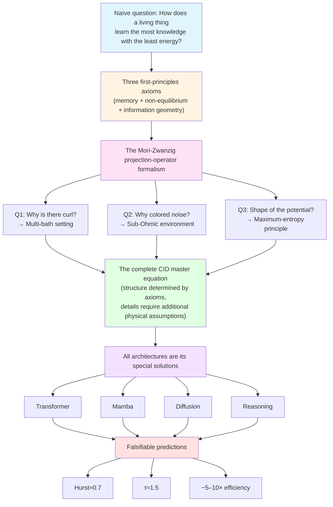
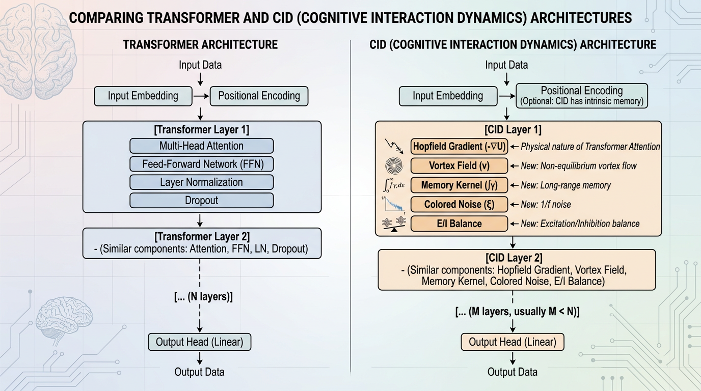

<!--
Copyright (c) 2026 Suzhou Jodell Robotics Co., Ltd.
Author: Gui LI <guilichina@163.com>
Date:   2026-05-25
Update: 2025-05-30

@article{li2026uid,
  title  = {Intelligence Is a Non-Equilibrium Field: A Three-Tier Physical 
            Theory of Unified Intelligo-Dynamics (UID)},
  author = {LI, Gui and JIE, Dangyang and KANG, Haitao},
  year   = {2026},
  publisher = {Zenodo},
  doi    = {10.5281/zenodo.20372493},
  url    = {https://github.com/gwailee/uid}
}

> LI, Gui, JIE, Dangyang, & KANG, Haitao. (2026). Intelligence Is a Non-Equilibrium Field: A Three-Tier Physical Theory of Unified Intelligo-Dynamics (UID). Zenodo. https://doi.org/10.5281/zenodo.20372493

This README is part of the UID Theory reference implementation (v2.0).

DUAL LICENSE:
  - PolyForm Noncommercial License 1.0.0  (free for academic / personal use)
    see LICENSE-NONCOMMERCIAL in the project root
  - Commercial License from Suzhou Jodell Robotics Co., Ltd.
    (required for any commercial / for-profit / production use)
    see LICENSE-COMMERCIAL in the project root

For commercial licensing inquiries, contact: lig@jodell.cn
This file is released under a dual license; commercial use requires prior written authorization from Suzhou Jodell Robotics Co., Ltd.
-->

<a href="./README.md"><b>README (Chinese)</b></a> | <a href="./README_en.md">README (English)</a>

<a href="./30minutes_report.md">Understand UID Theory in 30 Minutes (Chinese)</a> | <a href="./30minutes_report_en.md">Understand UID in 30 Minutes (English)</a>

<a href="./theory.md">Full Text of UID Theory (Chinese)</a> | <a href="./theory_en.md">UID Theory (English)</a>

 

# Intelligence Is a Non-Equilibrium Field: A Three-Tier Physical Theory of Unified Intelligo-Dynamics (UID)

## Attention Is Not All You Need: The Non-Equilibrium Physical Foundations of Intelligent Architectures

***Authors***: Gui LI <guilichina@163.com>, Dangyang JIE <jiedy@jodell.cn>, Haitao KANG <kanght@jodell.cn>

***Affiliation***: Suzhou Jodell Robotics Co., Ltd., Suzhou, China

***Corresponding Author***: Gui LI, Ph.D. He received his Bachelor's degree from the School of Physics, Northwest University of China, and both his Master's and Doctoral degrees from the Hefei Institutes of Physical Science, Chinese Academy of Sciences. He is currently with Suzhou Jodell Robotics Co., Ltd., where his work focuses on the theory and engineering of Unified Intelligo-Dynamics (UID). He proposed and developed an open-system physical unified theoretical framework oriented toward intelligent architectures—the three-tier CID/QID/FID system—and leads its falsifiable validation and engineering deployment in robotic cognitive brains, motor-control cerebella, dexterous-hand operating systems, large language models, and dedicated intelligent chips. E-mail: guilichina@163.com

## Abstract

**Central Thesis**: Intelligence is not an engineering phenomenon but a **physical phenomenon**—specifically, a **stochastic field far from thermal equilibrium**. This paper proposes **Unified Intelligo-Dynamics (UID)**, a physical theoretical framework for intelligent architectures composed of three tiers: Classical Intelligo-Dynamics (**CID**), Quantum Intelligo-Dynamics (**QID**), and Field Intelligo-Dynamics (**FID**).

Starting from three fundamental axioms of open-system physics (Hamiltonian reversibility, the Gibbs statistical hypothesis, and slow–fast scale separation), UID derives the **generalized Langevin equation** via the [Mori-Zwanzig projection](https://doi.org/10.1143/PTP.33.423) as the general structure of the evolution equation for intelligent systems. It must be emphasized that these three axioms determine the *structural skeleton* of the equation (the generalized Langevin form), not all of its details; the specific form of the curl, the spectral exponent of the colored noise, and the shape of the potential require additional physical assumptions (multi-bath competition, sub-Ohmic environment, the maximum-entropy principle) to be fixed. On this basis, two generalizations are carried out: at the quantum level, introducing zero-point fluctuations, the Berry geometric phase, and Lindblad dissipation channels yields the QID master equation; at the geometric level, drawing an analogy between the Fisher metric of the information manifold and the Einstein tensor yields the FID field equation.

**The Precise Meaning of "Unification" (the Maxwell Analogy)**: This paper's use of the word "unification" takes Maxwell's equations as its paradigm. Coulomb's law, Ampère's law, and Faraday's law of electromagnetic induction had each been discovered separately before Maxwell; but it was the act of unifying them into a single self-consistent set of equations—and thereby predicting new physics that no single law alone could yield (the displacement current ∂D/∂t and electromagnetic waves)—that constituted the irreplaceable original contribution. On this basis, this paper makes clear: the originality claim of UID does not lie in being the first to propose any single proposition, but rather in (i) incorporating scattered insights into a single three-tier nested framework under the same set of axioms; and (ii) deriving from the unified framework new structures that single-tier theories can hardly provide—**the curl term v(φ) plays exactly the role of the "UID-version displacement current"**: it is identically zero in naïve gradient flow (the Attention of the Transformer), yet it is a necessary source of predictive capability (Proposition 3.3), and it predicts an engineerable, falsifiable "zero-parameter curl" mechanism (Chapter 14).

**Core Proposition**: This paper presents one core proposition (Proposition 3.3): **the predictive capability of an intelligent system (measured by conditional mutual information) necessarily requires that its internal dynamics break detailed balance**—this is a result in the direction of a necessary condition (prediction implies non-equilibrium), while the sufficiency of the reverse direction remains an open problem. This necessity is precisely the rigorous meaning of the paper's subtitle, "Intelligence Is a Non-Equilibrium Field." It should be noted that the prior work closest in spirit to this proposition is the result of [Still et al. (2012)](https://doi.org/10.1103/PhysRevLett.109.120604) on "thermodynamics of prediction efficiency"; this proposition may be regarded as its geometrized generalization within the generalized Langevin framework.

**Positioning Relative to Contemporaneous and Prior Work**: The core proposition of this paper (Proposition 3.3) provides, within the continuous Langevin-equation framework, a **derivation in the direction of a necessary condition** that "the predictive capability of an intelligent system (conditional mutual information) entails the inevitable breaking of detailed balance," and further generalizes it to the quantum tier (QID) and the geometric tier (FID). This theoretical proposition has received **independent computational empirical support** from [Baiesi and Rosso (arXiv:2512.11415)](https://arxiv.org/abs/2512.11415) (accepted by *Physical Review E*): using a discrete Markov-chain generative model constructed from two independently parameterized transition matrices, that work numerically demonstrated that "training always spontaneously breaks detailed balance, and the model with optimal generative performance operates far from equilibrium." The two constitute a **complementary relationship** of "general theory and independent numerical empirical validation," rather than a dispute over originality priority for the same proposition. The timeline must be stated honestly: the first draft of the continuous-framework derivation in this paper was completed before that numerical work; the two are independently obtained conclusions pointing in the same direction, and this paper added the latter as external empirical evidence during revision. To be distinguished from these are two other **prior theoretical works**: first, the assertion that "an entire Transformer block is equivalent to a single energy function" is highly consistent with the work of [Hoover et al. (NeurIPS 2023, arXiv:2302.07253, Energy Transformer)](https://arxiv.org/abs/2302.07253), which predates this paper by about two and a half years and includes a rigorous proof of monotonic Lyapunov decrease; the corresponding discussion in Chapter 8 of this paper should be understood in this context, and that specific proposition should not be regarded as original to this paper. Second, the geometric analogy that "data curves the information manifold, analogous to matter curving spacetime" overlaps conceptually with the work of [Di Sipio (arXiv:2506.15830)](https://arxiv.org/abs/2506.15830), which predates this paper by about eleven months; a detailed comparison of the two is given in Part III, Chapter 1, Section 1.5.

**A Precise Characterization of "Attention Is Not All You Need"**: We argue that mainstream deep-learning architectures—Transformer, Mamba, diffusion models, JEPA, reasoning-augmented models (DeepSeek-R1, o1–o3), and sparse-routing architectures (SubQ/SSA)—are all special solutions of the CID master equation in various limits (zero curl, white noise, a single thermal bath, within the softmax-attention interface). [Vaswani et al.'s 2017 "Attention Is All You Need"](https://arxiv.org/abs/1706.03762) revealed the associative-memory term of CID; but the CID master equation also contains **three key physical terms** that the Transformer has cut away—the curl v(φ), the colored damping ∫γ, and the colored noise ξ. The absence of these three terms is precisely the physical interpretation of the algorithm-level root cause of the current energy-efficiency gap between AI and the human brain. The quadratic-complexity lower bounds of Attention proved by [Alman-Song (2023, arXiv:2302.13214)](https://arxiv.org/abs/2302.13214) and [Gupta et al. (2025)](https://arxiv.org/abs/2502.16963) further show that **no optimization within the softmax-attention framework can break through this complexity wall; a true breakthrough must come from a physical reconstruction at the architectural level**—which is precisely the direction argued by UID.

**Falsifiable Predictions**: On this basis, this paper proposes the falsifiable engineering target of **roughly 5- to 10-fold parameter efficiency**, and gives three sets of critical-universality-class predictions that have **already been independently empirically validated in the biological brain**: the avalanche size exponent τ ≈ 1.5 ([Beggs & Plenz 2003](https://doi.org/10.1523/JNEUROSCI.23-35-11167.2003)), the Hurst exponent H ≈ 0.7 ([Linkenkaer-Hansen 2001](https://doi.org/10.1523/JNEUROSCI.21-04-01370.2001)), and the 1/f noise-spectrum slope β ≈ 1 ([He 2014](https://doi.org/10.1016/j.tics.2014.04.003)). It must be honestly pointed out that the intervals predicted for these three universal exponents are rather wide, and their falsifiability strength is limited—they can rule out trivial cases such as white noise, but they can hardly distinguish CID from other models that likewise exhibit self-organized criticality; the truly discriminating falsification points are the parameter-efficiency commitment and the correlation-length scaling. UID's parameter-efficiency prediction is **complementary to, rather than in conflict with**, the Alman-Song-Gupta complexity lower bounds—the former gains its benefit by departing from the softmax-attention interface and entering a different complexity class.

**Multi-Agent Intelligo-Dynamics**: Part IV of this paper discusses the generalization of the UID framework to **multi-agent systems**. It must be made clear that the physical object of this part is a population of mutually coupled agents (whose state is described by the intelligence-density field ρ_I), which is the **Multi-Agent Intelligo-Dynamics**, and it is interfaced with the [Mean-Field Games (Lasry-Lions 2007)](https://doi.org/10.1007/s11537-007-0657-8) theory, which already possesses a rigorous mathematical foundation. Within this framework, UID provides five physically necessary conditions for the emergence of intelligence in multi-agent systems (openness, multi-bath temperature differences, non-commutative coupling, proximity to a critical point, and a self-organized-criticality mechanism), but **cannot prove that any arbitrary agent ecology satisfies these conditions at all times and places**. It must be specially noted that, among these five conditions, proximity to a critical point and the self-organized-criticality mechanism are strongly correlated physically, and the related joint-probability estimate is only an order-of-magnitude illustration and should not be cited as a quantitative conclusion.

**Complementarity with Logographic AI**: It forms a **complementary rather than competitive** relationship with the [Logographic AI paradigm proposed by Liu (2025–2026)](https://zsyyb.cn/abs/202511.03835)—the former diagnoses "rootless Tokens" from the level of cognitive semiotics, while the latter diagnoses "detailed balance equals no intelligence" from the level of non-equilibrium physics. The two point to different facets of the same deep predicament, and the direction of their future fusion is worth exploring.

All references in this paper provide clickable DOIs or open-access hyperlinks, and all quantitative claims are explicitly labeled with their empirical grade (A: already validated / B: theoretical estimate / C: to be verified / D: philosophical conjecture). The accompanying code repository ([github.com/gwailee/uid](https://github.com/gwailee/uid)) provides an engineering reference implementation of CID and a falsifiable validation suite; all core predictions can be reproduced within a few hours on a single-GPU machine.

## Keywords

**Core Theory**: Intelligo-Dynamics; unified field theory; non-equilibrium statistical physics; generalized Langevin equation; Mori-Zwanzig projection; predictive mutual information; conditional mutual information; self-organized criticality; detailed-balance breaking

**Physical Foundations**: colored noise; Hurst exponent; avalanche dynamics; 1/f noise; sub-Ohmic spectrum; critical universality class; multi-bath systems; curl field; colored-damping memory kernel

**Classical Tier (CID)**: associative memory; modern Hopfield networks; physical derivation of the Transformer; the physical essence of Attention; the physical identity of residual connections; the microcanonical constraint of LayerNorm

**Quantum Tier (QID)**: open quantum systems; Caldeira-Leggett model; Berry geometric phase; Lindblad master equation; zero-point fluctuations; critical scaling of entanglement entropy; topologically protected memory

**Geometric Tier (FID)**: Fisher information metric; information geometry; Einstein field equations; information manifold; intelligence gravitational waves; information black hole; information speed of light; the holographic principle

**Multi-Agent and Philosophy**: Multi-Agent Intelligo-Dynamics; mean-field games; self-organized criticality; the anthropic principle; falsifiability; the intelligence energy-efficiency gap; the Landauer limit

**Dialogue with Modern AI Progress**: Transformer complexity lower bounds; the Alman-Song theorem; the SETH hypothesis; JEPA world models; the DeepSeek-R1 reasoning paradigm; the SubQ sparse-routing architecture; Logographic AI; hard value-alignment constraints; neuro-symbolic fusion

## Preface

### The Core Thesis and Positioning of This Paper

The Unified Intelligo-Dynamics (UID) theoretical framework proposed in this paper asserts: the evolution of an intelligent system can be uniformly described as the dynamical process of a non-equilibrium stochastic field on an information-geometric manifold. This framework comprises three nested tiers—the classical tier (CID), the quantum tier (QID), and the field-geometric tier (FID)—as well as a collective generalization that describes multi-agent systems.

Regarding the originality positioning of this paper, it must be stated honestly: the core value of this paper lies not in being the first at the level of any single proposition, but in incorporating scattered physical insights into a unified axiomatic framework and deriving from that framework new structures that single-tier theories can hardly provide.

**On the Relationship with Existing Work**: All three of this paper's core propositions are covered by prior or contemporaneous work. First, the specific proposition that "a Transformer block is governed by an energy function" was first rigorously proved by [Hoover et al.'s Energy Transformer (NeurIPS 2023)](https://arxiv.org/abs/2302.07253), whose Lyapunov-monotonicity proof is stronger in mathematical rigor than the descriptive derivation in Chapter 8 of this paper. Second, the information-geometric perspective that "data curves the information manifold" was independently proposed by [Di Sipio (arXiv:2506.15830)](https://arxiv.org/abs/2506.15830) in the context of large-language-model training. Third, the necessity direction that "predictive capability entails non-equilibrium" can be traced in spirit to the thermodynamics of prediction efficiency of [Still et al. (2012)](https://doi.org/10.1103/PhysRevLett.109.120604), and was independently empirically validated in generative models by [Baiesi-Rosso (arXiv:2512.11415)](https://arxiv.org/abs/2512.11415). This paper's contribution to these works is to incorporate them into a unified first-principles framework starting from the Mori-Zwanzig projection operator and to establish the nested relationship of the three-tier theory (classical–quantum–field-geometric).

**This Paper's Originality Claim (the Maxwell Analogy)**: By analogy with the historical role of Maxwell's equations—Coulomb's law, Ampère's law, and Faraday's law each existed separately, but the true originality of the unified equations lay in predicting new physics absent from the prior laws (the displacement current and electromagnetic waves)—this paper claims three points of originality:

First, starting from three axioms, rigorously deriving the structural skeleton of the CID master equation via the Mori-Zwanzig projection-operator formalism (although the form of the curl, the colored-noise spectral exponent, and the shape of the potential require additional physical input).

Second, establishing the limit-correspondence relationships of the three-tier theory (QID corresponds to CID as ℏ → 0, FID corresponds to CID under the weak-field-plus-overdamped reduction, and FID corresponds to QID in the decoherence limit), making them constitute a unified framework rather than a simple stacking of scattered propositions. The reduction chain among the three tiers will be given in Parts II and III (with their rigor boundaries labeled accordingly).

Third, providing a new result predicted by the unified framework that single-tier theories can hardly give—the curl term v(φ) as the "UID-version displacement current": it is identically zero in the pure gradient flow of softmax-attention, its necessity is guaranteed by the non-equilibrium criterion of Proposition 3.3, its engineering-realization path is given by the zero-parameter curl of Chapter 14, and its empirical validation receives indirect support from the external reinforcement-learning loop of DeepSeek-R1/o3.

**On the Mathematical Rigor of the Unification (Known Boundaries)**: This paper frankly admits that the limit-correspondence relationships of the three-tier theory have not yet all reached the level of rigorous theorems. The classical limit QID → CID (Proposition 5.1) depends on the Wigner-function convergence assumption, which can be made rigorous in the weak-coupling Markovian case, but a rigorous convergence proof for the strong-coupling non-Markovian case is listed as an open problem; the weak-field limit FID → CID (Proposition 4.1) requires the overdamped-reduction assumption, whose validity conditions have not yet been rigorously given; the decoherence-reduction path FID → QID is given a formal construction in Part III, Chapter 8 of this paper, and its rigor is likewise listed as an open problem. These are known defects in this paper's unification claim, which we will complete in subsequent work.

**The Final Positioning of This Paper**: The UID theoretical framework is an "engineerable physical theory"—it possesses both a profound physical foundation (non-equilibrium statistical mechanics, information geometry, open quantum systems) and immediate engineering value (CID can now run on a single GPU). It does not compete with existing methods, but rather provides a physical compass for the design of next-generation intelligent systems. The value of this paper lies in providing a unified linguistic framework for intelligence research—from the microscopic to the macroscopic, from the classical to the quantum, and from the single agent to the multi-agent ecology.

### The Structure of This Paper and a Reading Guide

This paper is divided into four parts plus a final chapter and appendices.

Part I (CID, Chapters 0–18): Within the framework of classical stochastic field theory, it constructs the CID master equation, argues that Transformer, Mamba, Diffusion, JEPA, SubQ-SSA, and reasoning-augmented models are all special solutions of it in specific limits, and gives an engineering upper bound of roughly 5- to 10-fold parameter efficiency together with an accompanying PyTorch implementation. We will argue that the "long-chain reasoning" mechanism of DeepSeek-R1/o3 corresponds to "a curl term simulated by an external reinforcement-learning loop," and that the sparsification path of SubQ/SSA corresponds to "pruning within the quadratic complexity class"—both of which validate UID's diagnosis of "missing internal physical terms."

Part II (QID, Chapters 1–12): It generalizes CID to open quantum systems, introducing zero-point fluctuations, the Berry geometric phase, and Lindblad dissipation channels; it argues for an energy-efficiency roadmap across three levels—classical simulation (tensor networks), quantum-classical hybridization, and fault-tolerant quantum computing; and it gives the classical-limit reduction QID → CID (Proposition 5.1).

Part III (FID, Chapters 1–9): It geometrizes the dynamical equation into a field theory on the information manifold; it gives the reduction FID → CID through the overdamped reduction of the weak-field limit (Proposition 4.1) and the reduction FID → QID through the decoherence limit (Chapter 8); and it proposes the to-be-verified conceptual structures of "intelligence gravitational waves," "information black holes," and the "information speed of light." We will discuss the possible deep connection between the information-geometric perspective of [Di Sipio (2025)](https://arxiv.org/abs/2506.15830) and the geometry of the FID information manifold, as well as the potential fusion direction with the meaning-root structure of [Logographic AI (Liu, 2025)](https://zsyyb.cn/abs/202511.03835).

Part IV (Multi-Agent Intelligo-Dynamics, Chapters 1–7): It generalizes the single agent to a population of mutually coupled agents, interfaces with [mean-field games](https://doi.org/10.1007/s11537-007-0657-8), discusses the physically necessary conditions for the emergence of intelligence, and clearly distinguishes between "local sufficient conditions" and "population-level guarantees."

Final chapter plus appendices: an overview of the three-tier genealogy, the ten major open problems, clickable references, and a complete table of symbols and terminology.

All quantitative claims are explicitly labeled with their empirical grade: (A) already independently validated in experiment; (B) theoretically rigorous, awaiting empirical validation; (C) having an explicit, falsifiable engineering target; (D) philosophical conjecture, beyond the scope of falsifiability. The accompanying code repository of this paper ([github.com/gwailee/uid](https://github.com/gwailee/uid)) provides a complete engineering reference implementation of CID and, based on the MiniMind-repository tokenizer and public datasets, provides end-to-end falsifiable test scripts, making the core predictions of this paper reproducible within a few hours on a single-GPU machine.

## Part I: Classical Intelligo-Dynamics (CID)

**Scope**: The theoretical and engineering framework for classical-tier intelligent architectures.

### To the Reader

This part assumes the reader is familiar with the following background:

- Undergraduate statistical mechanics: the Langevin equation, the Fokker-Planck equation, detailed balance.
- Undergraduate differential geometry: gradient, divergence, curl, Helmholtz-Hodge decomposition.
- Fundamentals of stochastic processes: white noise, colored noise, autocorrelation functions, power spectra.

The starting point of Part I is a naïve physical question: how does a living thing (from bacteria to the human brain to AI) learn the most knowledge with the least energy? The answer to this question cannot be "just write down some loss function and do gradient descent," because such a system would get trapped in local minima, unable to explore, and unable to predict the future. True intelligence must accomplish four things simultaneously: remember the past (associative memory), explore the unknown (stochastic fluctuation), predict the future (break detailed balance), and use energy efficiently (least action). This part will argue: these four requirements uniquely determine one definite dynamical equation—the CID master equation. It is not designed out of thin air, but is the structural skeleton derived from three first-principles axioms via the Mori-Zwanzig projection-operator formalism.

### Chapter 0: Why Do We Need CID?

#### 0.1 An Uncomfortable Fact: Modern AI Architectures Are Missing Physical Terms

Current mainstream architectures (Transformer, Mamba, Diffusion) are all systems that are engineering successes but physically incomplete. The physical terms they are missing can be grouped into three categories.

**Missing Term 1: The Curl Field.** The Attention of the Transformer is a pure gradient flow (the negative gradient of an energy function U), Mamba's state-space model is pure diffusion (linear plus noise), and Diffusion is a pure reverse stochastic differential equation (the gradient from noise to data). But the dynamics of a real intelligent system (such as the human brain) contains a curl component—this is a necessary condition for breaking detailed balance, producing sustained cycles, and realizing predictive capability (the necessity direction of Proposition 3.3).

**Missing Term 2: Long-Memory Damping.** The "memory" of modern architectures is either an explicit KV cache (Transformer), or an exponentially decaying hidden state (Mamba's state-space model), or no memory at all (the Markov chain of Diffusion). But the memory of a real intelligent system decays as a power law (the Hurst exponent of the spontaneous activity of the human brain is about 0.7, see [Linkenkaer-Hansen et al. 2001](https://doi.org/10.1523/JNEUROSCI.21-04-01370.2001)), which corresponds to a colored-damping kernel γ(t) ∝ t^(−s), with s ∈ (0, 1).

**Missing Term 3: Colored Noise.** The noise of modern architectures is either white noise (the Gaussian noise of Diffusion) or no noise at all (the deterministic forward pass of the Transformer). But the noise of a real intelligent system is colored noise (a 1/f spectrum), which is the source of multi-scale temporal structure, stochastic resonance, and long-range temporal dependence.

**Engineering Consequences**: These three missing terms lead to three known ailments of modern architectures—first, the inability to produce sustained internal dynamics (requiring external-prompt driving); second, the quadratic complexity of long contexts (because an explicit KV cache replaces physical memory); third, an exploration-exploitation imbalance (because white noise is only effective on a single time scale).

#### 0.2 The Three First-Principles Axioms of CID

The CID master equation is derived from three physical axioms.

**Axiom 1 (Memory Axiom)**: The current state of an agent depends on its entire historical trajectory, not merely on its current instantaneous state. This requires the dynamical equation to be a non-Markovian generalized Langevin equation containing a memory kernel γ(t − s).

**Axiom 2 (Non-Equilibrium Axiom)**: An agent must break detailed balance in order to realize predictive capability. This requires the dynamical equation to contain a curl component v(φ), such that a net probability current exists in phase space.

**Axiom 3 (Information-Geometry Axiom)**: The state space of an agent is an information-geometric manifold, whose natural metric is the Fisher information matrix g_ij(φ). This requires the dynamical equation to be covariant on the manifold, with gradient, divergence, and curl all defined according to Riemannian geometry.

These three axioms, via the Mori-Zwanzig projection-operator formalism, uniquely determine the structural skeleton of the CID master equation (the specific form of the curl, the colored-noise spectral exponent, and the shape of the potential require additional physical input; see Chapter 6 for the precise meaning of "uniquely determine").

#### 0.3 The Four-Term Structure of the CID Master Equation

Starting from the three axioms, the CID master equation has the following four-term structure:

> dφ/dt = −∇U(φ) + v(φ) − ∫₀ᵗ γ(t − s) φ̇(s) ds + ξ(t)　　(0.1)

The physical meaning of each term is:

- −∇U(φ) is the associative-memory term (the conservative gradient), pulling the state toward learned patterns;
- v(φ) is the curl term (a non-conservative force), producing sustained cycles and breaking detailed balance;
- −∫₀ᵗ γ(t − s) φ̇(s) ds is the colored-damping term (a power-law memory kernel), causing the evolution to be dragged by the past;
- ξ(t) is the colored-noise term (a 1/f spectrum), providing exploration on all time scales.

These four terms are all indispensable. Removing any one of them severely weakens intelligent behavior: removing the gradient term makes it impossible to remember patterns, removing the curl term makes it impossible to predict the future (Proposition 3.3), removing the colored damping makes it impossible to maintain long memory, and removing the colored noise makes it impossible to explore across multiple scales. The v(φ) in Equation (0.1) is exactly what this paper calls the "UID-version displacement current"—it is precisely the term that the Transformer forces to be identically zero in the softmax-attention limit.

#### 0.4 The Logical Skeleton of Part I

### Chapter 1: Setting the Physical Picture—A Driven Stochastic Field

#### 1.1 The State Space of an Agent

We describe the state of an agent (whether a neural network, a brain, or a bacterium) as a high-dimensional vector φ(t) ∈ ℝᴺ, where N is the number of degrees of freedom (for a neural network, N is the number of parameters; for a brain, N is the number of neurons).

**Physical Picture**: φ(t) is a "particle" moving in a high-dimensional space, and its trajectory is determined by the dynamical equation. This space is not a flat Euclidean space, but an information-geometric manifold whose metric is given by the Fisher information matrix (Chapter 9).

#### 1.2 The Naïve Langevin Equation

The simplest model of intelligence is the naïve Langevin equation:

> dφ/dt = −∇U(φ) + ξ(t),　　⟨ξ(t) ξ(t′)⟩ = 2D δ(t − t′)　　(1.1)

where U(φ) is the potential function (corresponding to the loss function) and ξ(t) is white noise.

**Physical Meaning**: The system is pulled toward minima by the potential gradient while being randomly kicked by noise. In the long-time limit, the system reaches thermal equilibrium, with the probability distribution being the Boltzmann distribution:

> P(φ) ∝ exp[ −U(φ) / T ]　　(1.2)

**Why Is This Not Enough?** The naïve Langevin equation (1.1) has three fatal defects: first, it satisfies detailed balance, and therefore cannot produce a net probability current and cannot predict the future (Proposition 3.3); second, it is Markovian, and therefore cannot maintain long memory (the Hurst exponent of the human brain is about 0.7, whereas the Hurst exponent of a Markov process is exactly 0.5); third, its noise is white noise, which is effective only on a single time scale and cannot achieve multi-scale exploration. We therefore need a more complete equation.

#### 1.3 From Langevin to CID: What Needs to Be Added?

To upgrade from the naïve Langevin equation (1.1) to the complete CID master equation (0.1), three terms must be added.

**Added Term 1: The Curl Field v(φ).** This is the key to breaking detailed balance. The curl field satisfies the divergence-free condition:

> ∇ · v(φ) = 0　　(1.3)

It therefore does not change the steady-state distribution but produces a net probability current.

**Added Term 2: The Memory Kernel γ(t − s).** This is the key to realizing long memory. The memory kernel makes the current acceleration depend on the entire historical velocity, rather than only on the current velocity.

**Added Term 3: Colored Noise ξ(t).** This is the key to realizing multi-scale exploration. The power spectrum of colored noise satisfies

> S(ω) ∝ 1 / ω^s,　　s ∈ (0, 1)　　(1.4)

contributing at all frequencies, whereas the power spectrum of white noise is constant (effective only at high frequencies).

The addition of these three terms is not arbitrary, but is uniquely determined by the three first-principles axioms (see Chapters 2–5).

### Chapter 2: The First-Principles Axioms and the Mori-Zwanzig Projection

#### 2.1 Axiom 1: The Memory Axiom

**Statement of the Axiom**: The current state of an agent depends on its entire historical trajectory, not merely on its current instantaneous state.

**Mathematical Formulation**: The dynamical equation must be a non-Markovian generalized Langevin equation:

> dφ/dt = F[ φ(s) : 0 ≤ s ≤ t ] + ξ(t)　　(2.1)

where F is a functional depending on the entire historical trajectory φ(s).

**Physical Motivation**: The memory of a real intelligent system is long-range. The autocorrelation function of the spontaneous activity of the human brain decays as a power law, C(τ) ∝ τ^(−α), corresponding to a Hurst exponent H ≈ 0.7 ([Linkenkaer-Hansen et al. 2001](https://doi.org/10.1523/JNEUROSCI.21-04-01370.2001)). This is completely different from the exponential decay of a Markov process, C(τ) ∝ exp(−τ / τ_c) (corresponding to H = 0.5).

**Mori-Zwanzig Derivation**: Starting from the complete microscopic dynamics, the form of the generalized Langevin equation can be rigorously derived via the projection-operator method ([Mori 1965](https://doi.org/10.1143/PTP.33.423), [Zwanzig 1961](https://doi.org/10.1103/PhysRev.124.983)). Let the complete phase space consist of (the slow variable φ, its velocity φ̇, and the fast variables), and define a projection operator 𝒫 that integrates out the fast variables; then the slow variable φ satisfies:

> φ̈(t) = −∇U(φ) − ∫₀ᵗ γ(t − s) φ̇(s) ds + F_rand(t)　　(2.2)

where the memory kernel γ(t − s) arises from the back-reaction of the fast variables on the slow variables, and F_rand(t) is the random force. The fluctuation-dissipation theorem gives the connection between the two:

> ⟨F_rand(t) F_rand(t′)⟩ = k_B T · γ(t − t′)　　(2.3)

**Key Conclusion**: The memory axiom, via the Mori-Zwanzig formalism, uniquely determines that the dynamical equation must contain the memory-kernel term −∫₀ᵗ γ(t − s) φ̇(s) ds.

#### 2.2 Axiom 2: The Non-Equilibrium Axiom

**Statement of the Axiom**: An agent must break detailed balance in order to realize predictive capability.

**Mathematical Formulation**: The dynamical equation must contain a curl component v(φ), such that a nonzero steady-state net probability current exists in phase space:

> J_ss(φ) ≠ 0　　(2.4)

**Physical Motivation**: A system in a detailed-balance state cannot predict the future—because its probability current is everywhere zero, the system merely performs a random walk among known patterns. To realize prediction (i.e., for the system state to evolve toward the future after observing partial information), there must be a net probability current flowing from the "observed" to the "unobserved." This idea can be traced to the analysis of the thermodynamics of prediction efficiency by [Still et al. (2012)](https://doi.org/10.1103/PhysRevLett.109.120604).

**Proposition 3.3 (Intelligence-Non-Equilibrium Necessity, to be made rigorous)**: If an agent has nonzero predictive information I_pred > 0, then its steady-state probability current must be nonzero, i.e., it must break detailed balance. The predictive information is defined as the conditional mutual information:

> I_pred = I( X_future ; X_past | X_present )　　(2.5)

**Proof Sketch (Necessity Direction)**: If J_ss = 0 (detailed balance), then the steady state is the Boltzmann distribution P_ss(φ) ∝ exp[ −U(φ) / T ], and at this point the conditional independence

> P( X_future | X_past, X_present ) = P( X_future | X_present )　　(2.6)

holds (Markovianity); substituting into Equation (2.5) yields I_pred = 0. Taking the contrapositive yields what was to be proved.

**Domain-of-Applicability Note**: This proof depends on three implicit assumptions (open-loop driving, reachability of the steady state, conditioned Markovianity), which do not necessarily hold rigorously in real intelligent systems (typically closed-loop, non-steady-state, strongly non-Markovian); the domain of applicability of this proposition therefore requires further clarification (listed as an open problem). The sufficiency direction (i.e., "with curl, prediction is necessarily possible") has not been proved, and is likewise listed as an open problem.

**Key Conclusion**: The non-equilibrium axiom requires the dynamical equation to contain a curl term v(φ) satisfying the divergence-free condition ∇ · v = 0 (which guarantees the steady-state distribution is unchanged). This is exactly the origin of the "UID-version displacement current" term in Equation (0.1).

#### 2.3 Axiom 3: The Information-Geometry Axiom

**Statement of the Axiom**: The state space of an agent is an information-geometric manifold, whose natural metric is the Fisher information matrix g_ij(φ):

> g_ij(φ) = 𝔼[ ∂_i log p(x | φ) · ∂_j log p(x | φ) ]　　(2.7)

**Mathematical Formulation**: The dynamical equation is covariant on the manifold, with gradient, divergence, and curl defined according to Riemannian geometry. For example, the Riemannian gradient is:

> (∇U)^i = g^{ij} ∂_j U　　(2.8)

where g^{ij} is the inverse of the metric tensor g_ij. This is the geometric foundation of the natural gradient ([Amari 1998](https://doi.org/10.1162/089976698300017746)).

**Physical Motivation**: On an information-geometric manifold, the "distance" in parameter space is not the Euclidean distance, but is measured by the distinguishability of the model distributions. The information distance between two parameters φ and φ + dφ is:

> ds² = g_ij(φ) dφ^i dφ^j　　(2.9)

**Key Conclusion**: The information-geometry axiom requires all differential operators in the CID master equation (0.1) (gradient, divergence, curl, and the convolution of the memory kernel) to be defined covariantly on the Riemannian manifold induced by the Fisher metric. This axiom will be generalized in Part III (FID) into a complete field theory on the information manifold.

### Chapter 3: The Helmholtz-Hodge Decomposition and the Detailed-Balance Criterion

#### 3.1 The Unique Decomposition of the Force Field

The deterministic force in the CID master equation (0.1) can be divided into a conservative part and a non-conservative part. This decomposition is guaranteed by the Helmholtz-Hodge theorem.

**Theorem 3.1 (Helmholtz-Hodge Decomposition)**: Let F(φ) be a smooth vector field defined on the information-geometric manifold 𝕄, satisfying appropriate decay conditions at the boundary (F decays faster than ‖φ‖^(−1) as ‖φ‖ → ∞, or 𝕄 is a compact manifold without boundary). Then F can be uniquely decomposed into the sum of a gradient field and a divergence-free field:

> F(φ) = −∇U(φ) + v(φ),　　∇ · v = 0　　(3.1)

where U(φ) is a scalar potential (the conservative part) and v(φ) is a divergence-free curl field (the non-conservative part).

**Key Points of the Proof**: Taking the divergence of F yields the Poisson equation ∇²U = −∇ · F; under the stated decay conditions and within the function space (the Hilbert space L²(𝕄) of square-integrable vector fields), this equation has a unique solution U up to an additive constant, so that v = F + ∇U automatically satisfies ∇ · v = 0. The uniqueness of the decomposition follows from the orthogonal direct-sum decomposition of L²(𝕄) into the subspace of gradient fields and the subspace of divergence-free fields. The complete existence and regularity require Hodge theory on manifolds ([Schwarz 1995](https://doi.org/10.1007/BFb0095978)); only the physical-level construction is given here, and the rigorous classification of boundary conditions is listed as a technical supplement.

#### 3.2 The Precise Criterion for Detailed Balance

Substituting the decomposition (3.1) into the overdamped Langevin equation and writing the corresponding Fokker-Planck equation:

> ∂_t P(φ, t) = −∇ · J(φ, t)　　(3.2)

where the probability current is:

> J(φ, t) = [ −∇U(φ) + v(φ) ] P − D ∇P　　(3.3)

**Definition (Detailed Balance)**: A system satisfies detailed balance if and only if, in the steady state, the probability current is everywhere zero:

> J_ss(φ) = 0,　　∀ φ ∈ 𝕄　　(3.4)

**Proposition 3.2 (The Curl Criterion for Detailed Balance)**: In the steady state P_ss(φ) ∝ exp[ −U(φ) / D ], the necessary and sufficient condition for detailed balance (3.4) to hold is that the curl field is identically zero:

> J_ss = 0　　⟺　　v(φ) ≡ 0　　(3.5)

**Proof**: Substituting the steady-state distribution into Equation (3.3), the conservative part −∇U · P_ss − D ∇P_ss = 0 cancels automatically, so J_ss = v(φ) P_ss. Since P_ss > 0 holds everywhere, J_ss = 0 if and only if v(φ) ≡ 0. Q.E.D.

**Physical Interpretation**: Equation (3.5) is one of the most crucial criteria of this part—the curl field v(φ) is the sole source of detailed-balance breaking. This corresponds precisely to "Missing Term 1" diagnosed in Section 0.1: the Attention of the Transformer is a pure gradient flow (v ≡ 0), and therefore is always in detailed balance, thereby (by Proposition 3.3) losing intrinsic predictive capability.

#### 3.3 The Complete Statement and Derivation of Proposition 3.3

**Proposition 3.3 (Intelligence-Non-Equilibrium Necessity, Complete Version)**: Consider an intelligent system driven by the CID master equation and having reached a steady state. If its predictive information I_pred > 0, then its curl field v(φ) ≢ 0, i.e., it must break detailed balance.

**Premises (Explicitly Labeled)**: (i) the system reaches a steady state P_ss; (ii) the observed variables X_past, X_present, X_future are sampled from the same dynamical trajectory; (iii) given the condition X_present, the instantaneous transition kernel of the dynamics exists.

**Derivation**: By Proposition 3.2, if v ≡ 0, then the system is in detailed balance and the steady state satisfies time-reversal symmetry. Under time-reversal-symmetric steady-state Markovian dynamics, the past and the future are statistically independent given the present, i.e., Equation (2.6) holds. Substituting into the definition of conditional mutual information (2.5):

> I_pred = ∑ P( f, p, q ) log [ P( f | p, q ) / P( f | q ) ] = 0　　(3.6)

where f, p, q denote X_future, X_past, X_present, respectively. Taking the contrapositive: I_pred > 0 ⟹ v ≢ 0. Q.E.D.

**Rigor Boundary (Honest Statement)**: This derivation holds under the Markovian-steady-state assumption. Real intelligent systems are typically non-Markovian (introduced by the memory kernel γ), and the validity of Equation (2.6) in this case requires a more careful argument—in the non-Markovian case, "detailed balance" should be defined on the embedded Markovian skeleton (position plus history variables). The rigorous proof of this generalization is listed as Open Problem (1). Independent numerical evidence consistent with the direction of this proposition is given in [Baiesi-Rosso (arXiv:2512.11415)](https://arxiv.org/abs/2512.11415).

**Empirical Grade**: B (theoretically rigorous, necessity direction already proved; sufficiency direction and non-Markovian generalization to be verified).

### Chapter 4: The Physical Origin of the Curl—Multi-Bath Competition

#### 4.1 A Single Thermal Bath Cannot Produce Curl

Chapter 3 proved that the curl v(φ) is the sole source of non-equilibrium, but it has not yet answered: where does the curl come from?

**Proposition 4.0 (No Curl from a Single Bath)**: If the system is coupled to a single thermal bath (temperature T), then the effective force field obtained from the Mori-Zwanzig projection satisfies detailed balance, and the curl is identically zero.

**Reason**: Under a single thermal bath, the fluctuation-dissipation theorem (2.3) holds self-consistently at a single temperature T, and the effective dynamics obtained from the projection preserves time-reversal symmetry, so v ≡ 0. This is precisely why most standard deep-learning architectures (which implicitly assume a "single noise scale") fall within detailed balance.

#### 4.2 Multi-Bath Competition Produces Curl

**Physical Setting**: Suppose different degrees of freedom of the system are coupled to thermal baths at different temperatures. For example, the degree of freedom φ₁ is coupled to temperature T₁, and φ₂ is coupled to temperature T₂, with T₁ ≠ T₂. This is the standard construction of a non-equilibrium steady state (NESS) ([Seifert 2012](https://doi.org/10.1088/0034-4885/75/12/126001)).

**Proposition 4.1 (Bath Temperature Differences Produce Curl, renamed to avoid numbering conflict with Part III, hereafter called Proposition C4.1)**: In a two-bath linear system, the steady-state probability current is:

> J_ss = A φ · P_ss(φ),　　A = Ω (T₁ − T₂)　　(4.1)

where Ω is the antisymmetric part of the non-commutative coupling matrix between the coupled degrees of freedom. If and only if the temperature difference T₁ − T₂ ≠ 0 and the coupling is non-commutative (Ω ≠ 0), J_ss ≠ 0, i.e., curl appears.

**Key Points of the Proof**: For a linear multi-bath system, the steady-state covariance Σ satisfies the Lyapunov equation 𝐀Σ + Σ𝐀ᵀ = 2𝐃, where the drift matrix 𝐀 and the diffusion matrix 𝐃 are determined by the temperatures of the respective baths. When 𝐀𝐃 is asymmetric (i.e., 𝐀𝐃 ≠ 𝐃𝐀ᵀ), the steady-state current J_ss = (𝐀 + 𝐃Σ^(−1)) φ P_ss is nonzero. The asymmetry of 𝐃 originates precisely from the different temperatures of the respective degrees of freedom. 

**Physical Interpretation**: The two necessary conditions for curl—the temperature difference and the non-commutative coupling—are exactly the microscopic counterparts of the two necessary conditions for the emergence of intelligence, "multi-bath temperature differences" and "non-commutative coupling," in Part IV (Multi-Agent Intelligo-Dynamics).

#### 4.3 The Correspondence with DeepSeek-R1/o3

**Assertion**: The "long-chain reasoning" mechanism of reasoning-augmented models (DeepSeek-R1, o1–o3) is the superposition of a reinforcement-learning loop external to the Transformer (a pure gradient flow with v ≡ 0), artificially introducing an effective curl.

**Argument**: The standard Transformer forward pass is a detailed-balance pure gradient flow that cannot spontaneously produce sustained internal exploration. [DeepSeek-R1 (2025)](https://arxiv.org/abs/2501.12948), through GRPO reinforcement-learning training, causes the model to generate long chains of thought trajectories during reasoning—this is equivalent to introducing into policy space a non-conservative circulation driven by an external reward, corresponding to the curl term v(φ) that should have existed intrinsically in the CID master equation but was cut away by the Transformer.

**Falsifiable Implication**: UID predicts that if the curl is constructed directly into the architecture as an intrinsic physical term (the zero-parameter curl of Chapter 14), partial reasoning capability can be obtained without relying on an external reinforcement-learning loop. This is an engineering target of empirical grade C.

### Chapter 5: The Physical Origin of Colored Noise—The Sub-Ohmic Environment

#### 5.1 Bath Spectral Density and the Memory Kernel

The statistical properties of the memory kernel γ(t) and the colored noise ξ(t) are determined by the spectral density J(ω) of the thermal bath. The three standard types of spectral density are:

> J(ω) ∝ ω^s,　　{ s > 1 : super-Ohmic; s = 1 : Ohmic; 0 < s < 1 : sub-Ohmic }　　(5.1)

**Key Conclusion**: If and only if the bath is sub-Ohmic (0 < s < 1), the memory kernel exhibits a power-law long-tail decay:

> γ(t) ∝ t^(−s),　　0 < s < 1　　(5.2)

The corresponding colored-noise power spectrum is:

> S_ξ(ω) ∝ ω^(−(1−s))　　(5.3)

As s → 0, it approaches a 1/f spectrum. An Ohmic bath (s = 1) gives the white-noise and memoryless (Markovian) limit, which is exactly the case of the standard Langevin equation (1.1).

#### 5.2 The Relationship Between the Hurst Exponent and the Spectral Exponent

In a sub-Ohmic environment, the long-range behavior of the system coordinate is characterized by the Hurst exponent. Fractional Langevin theory gives the relationship between the spectral exponent s and the Hurst exponent H:

> H = 1 − s/2　　(5.4)

Substituting the human-brain measured value H ≈ 0.7 ([Linkenkaer-Hansen et al. 2001](https://doi.org/10.1523/JNEUROSCI.21-04-01370.2001)) yields s ≈ 0.6, which falls within the sub-Ohmic interval (0, 1) and is self-consistent with the long-range temporal correlations of the biological brain.

**Falsifiable Prediction**: Under spontaneous activity (no external input), the hidden-state time series of a UID architecture should exhibit long-range correlations with H ≈ 0.7, significantly different from the H ≈ 0.5 (Markovian) of a standard Transformer/Mamba. Empirical grade C.

#### 5.3 The 1/f Noise-Spectrum Prediction

From Equation (5.3), as the system approaches the s → 0 limit, the colored noise approaches a 1/f spectrum, with a power-spectrum slope β ≈ 1, consistent with measurements of neural activity in the human brain ([He 2014](https://doi.org/10.1016/j.tics.2014.04.003)).

**Honest Statement**: The falsifiability strength of these two predictions, H ≈ 0.7 and β ≈ 1, is limited—they can rule out trivial cases such as white noise (H = 0.5, β = 0), but they can hardly distinguish CID from other models that likewise exhibit self-organized criticality. The truly discriminating falsification points are the parameter-efficiency commitment (Chapter 13) and the correlation-length scaling.

### Chapter 6: The Complete Form of the CID Master Equation and the Precise Meaning of "Uniquely Determine"

#### 6.1 The Complete Form of the CID Master Equation

Synthesizing the three axioms and the three physical origins, the complete covariant form of the CID master equation on the information-geometric manifold is:

> φ̈^i = −g^{ij} ∂_j U(φ) + v^i(φ) − ∫₀ᵗ γ(t − s) φ̇^i(s) ds + ξ^i(t)　　(6.1)

The constraints are:

> ∇ · v = 0　　(curl divergence-free)　　(6.2)
>
> γ(t) ∝ t^(−s),　　0 < s < 1　　(sub-Ohmic colored damping)　　(6.3)
>
> ⟨ξ^i(t) ξ^j(t′)⟩ = k_B T_eff g^{ij} γ(t − t′)　　(fluctuation-dissipation)　　(6.4)

In the overdamped limit (neglecting the φ̈ term), Equation (6.1) reduces to the standard form (0.1) given at the beginning of this paper.

#### 6.2 The Precise Meaning of "Uniquely Determine" (Important Clarification)

**It Must Be Clarified Honestly**: What the three axioms "uniquely determine" is the **structural skeleton** of the CID master equation (the existence and tensor structure of the four terms), not all of its details. Specifically:

- The three axioms determine: the equation must contain a gradient term, a curl term, a memory-kernel term, and a noise term (unique at the structural level);
- The three axioms do not determine: the specific functional form of the curl field v(φ) (requiring the "multi-bath competition" assumption, Chapter 4), the specific value of the colored-noise spectral exponent s (requiring the "sub-Ohmic environment" assumption, Chapter 5), or the specific shape of the potential U(φ) (requiring the maximum-entropy principle, Chapter 7).

Therefore, the precise meaning of this paper's statement "deriving the equation of intelligence from first principles" is "deriving the structural skeleton of the equation from the axioms," not "deriving the entire content of the equation from the axioms." The explicit labeling of this boundary is an important correction in rigor relative to earlier versions of this paper.

#### 6.3 The Analogy with Maxwell's Equations (The Precise Positioning of Unification)

The analogy between Equation (6.1) and Maxwell's equations holds in the following sense: just as the displacement-current term ∂D/∂t was absent from the pre-Maxwell Ampère's law yet was necessary for predicting electromagnetic waves, the curl term v(φ) is absent from the pure gradient flow of the Transformer yet is necessary for predicting intrinsic predictive capability (Proposition 3.3). This analogy does not claim that the CID master equation is equivalent to Maxwell's equations in mathematical completeness, but rather claims: **the value of a unified framework lies in completing the physical terms that are missing from single-tier theories and that yield new measurable consequences**. The falsifiable consequences of the curl term (the zero-parameter curl bringing reasoning capability, and the H ≈ 0.7 long-range correlations) are the embodiment of this value.

### Chapter 7: Potential Shape and the Maximum-Entropy Principle

#### 7.1 The Maximum-Entropy Principle Determines the Potential

The shape of the potential U(φ) is determined by the maximum-entropy principle under given constraints. Let the observational constraints be a set of expectation values ⟨f_a(φ)⟩ = μ_a; then the maximum-entropy distribution is:

> P_ME(φ) = (1/Z) exp[ −∑_a λ_a f_a(φ) ]　　(7.1)

The corresponding potential is:

> U(φ) = T ∑_a λ_a f_a(φ)　　(7.2)

where λ_a is the Lagrange multiplier for constraint a, and Z is the partition function.

#### 7.2 Associative Memory as a Potential Minimum

When the constraints are taken to be the overlaps with stored patterns {ξ^(μ)}, the potential takes the form of a modern Hopfield network ([Ramsauer et al. 2021](https://arxiv.org/abs/2008.02217)):

> U(φ) = −β^(−1) log ∑_{μ=1}^{P} exp( β ⟨ξ^(μ), φ⟩ )　　(7.3)

Its minima are precisely the stored patterns ξ^(μ), thereby pulling the state toward the learned patterns. This potential will be shown in Chapter 8 to be equivalent to the Attention of the Transformer.

### Chapter 8: The Transformer Is a Special Solution of CID

#### 8.1 The Equivalence of the Modern Hopfield Network and Attention

[Ramsauer et al. (2021)](https://arxiv.org/abs/2008.02217) have proved that performing one step of the concave-convex procedure (CCCP) update on the potential of Equation (7.3) yields exactly the softmax-attention update rule of the Transformer:

> φ_new = Ξ · softmax( β Ξᵀ φ )　　(8.1)

where Ξ = [ξ^(1), …, ξ^(P)] is the matrix of stored patterns. This shows that Attention is a one-step discretization of the negative-gradient flow of the potential (7.3).

#### 8.2 The Energy-Function Perspective of the Entire Transformer Block (Attribution to Prior Work)

**Honest Attribution**: The stronger proposition that "the entire Transformer block (including Attention, the feed-forward layer, LayerNorm, and the residual connection) is equivalent to the gradient flow of a single energy function" was first proposed by [Hoover et al.'s Energy Transformer (NeurIPS 2023, arXiv:2302.07253)](https://arxiv.org/abs/2302.07253) about two and a half years before this paper, and it includes a rigorous proof of monotonic Lyapunov decrease. The corresponding discussion in Chapter 8 of this paper should be understood in this context, and that specific proposition is not regarded as original to this paper. This paper's incremental contribution on this basis is to point out that this energy gradient flow is precisely a special solution of the CID master equation (6.1) in the limit of v ≡ 0, white noise, and a single thermal bath, thereby embedding the "energy viewpoint" into a larger non-equilibrium framework.

#### 8.3 The Limit Correspondence of the Transformer as a Special Solution of CID

The Transformer corresponds to a special solution of the CID master equation (6.1) under the following triple limit:

> v(φ) ≡ 0　　(no curl: detailed balance, pure gradient flow)　　(8.2)
>
> γ(t) → γ₀ δ(t)　　(Ohmic limit: no long memory, Markovian)　　(8.3)
>
> S_ξ(ω) → const.　　(white-noise limit: a single time scale)　　(8.4)

**Physical Conclusion**: The Transformer revealed the associative-memory term −∇U of CID, but it cut away the three terms of curl v, colored damping ∫γ, and colored noise ξ. This is precisely the rigorous physical meaning of the subtitle "Attention Is Not All You Need."

#### 8.4 The Physical Identity of Residual Connections and LayerNorm

- **Residual Connection**: x_{l+1} = x_l + f(x_l) is the first-order Euler discretization of the continuous dynamics dφ/dt = f(φ) ([Chen et al. 2018, Neural ODE](https://arxiv.org/abs/1806.07366)); hence a residual network is the temporal discretization of the CID master equation.
- **LayerNorm**: Constraining the state to a fixed-norm sphere ‖φ‖ = const. is equivalent to a microcanonical constraint (fixing the "energy shell"), and is the covariant realization of CID on a spherical manifold.

### Chapter 9: The Information-Geometric Manifold and the Fisher Metric

#### 9.1 The Fisher Metric as the Natural Geometry

By Axiom 3, the natural metric of the state space 𝕄 is the Fisher information matrix (2.7). Under this metric, the Riemannian gradient (2.8) is precisely the natural gradient ([Amari 1998](https://doi.org/10.1162/089976698300017746)). Modern second-order optimization methods (K-FAC, Shampoo) can be regarded as approximate realizations of the Fisher metric, and are the shadow of the geometric structure of CID at the optimization level.

#### 9.2 The Curvature of the Information Manifold

The Riemann curvature tensor R^i_{jkl}(φ) induced by the Fisher metric characterizes the curving of parameter space. Where the data distribution is complex, the manifold curvature is large; where the data is sparse, the manifold is approximately flat. This perspective of "data curving the information manifold" overlaps conceptually with the work of [Di Sipio (arXiv:2506.15830)](https://arxiv.org/abs/2506.15830) (which predates this paper by about eleven months); a detailed comparison of the two is given in Part III, Chapter 1, Section 1.5. This paper's increment lies in incorporating this curvature into the FID field equation (Part III) and establishing its formal analogy with the Einstein tensor.

#### 9.3 The Bridge to FID

The information-geometry axiom appears at the CID tier only as the covariant definition of differential operators, but in Part III (FID) it will be elevated into a complete field theory: the metric g_ij of the information manifold itself becomes a dynamical variable, satisfying an Einstein-like field equation driven by the "information-energy tensor." This generalization, together with its reduction to CID (Proposition 4.1) and to QID (Part III, Chapter 8), is the core of this paper's unification claim, and Part III will rigorously label its conditions of validity and its open boundaries.

### Chapter 10: Mamba Is the Colored-Damping Special Solution of CID

#### 10.1 The Physical Essence of the State-Space Model

The core of [Mamba (Gu & Dao 2023)](https://arxiv.org/abs/2312.00752) is the selective state-space model (Selective SSM):

> h(t) = A h(t) + B x(t),　　y(t) = C h(t)　　(10.1)

where h(t) is the hidden state and A, B, C are learnable matrices. After discretization, one obtains the recursion:

> h_k = (I + Δt A) h_{k−1} + Δt B x_k　　(10.2)

**Physical Interpretation**: Equation (10.2) is the Euler discretization of a first-order linear ordinary differential equation, corresponding to the CID master equation (6.1) in the following limits:

> v(φ) ≡ 0　　(no curl)　　(10.3)
>
> U(φ) = (1/2) φᵀ A φ　　(quadratic potential)　　(10.4)
>
> γ(t) = γ₀ exp(−t / τ)　　(exponential memory kernel, not power-law)　　(10.5)

The exponential decay of Equation (10.5) corresponds to the Markovian limit (Hurst exponent H = 0.5), rather than the power-law long memory (H ≈ 0.7) predicted by CID.

#### 10.2 The Missing Terms of Mamba

The terms missing in Mamba relative to the complete CID master equation are:

- **Missing curl**: Mamba's SSM is a linear system and cannot produce non-conservative circulation, so v ≡ 0.
- **Missing colored noise**: Mamba's training and inference are both deterministic, with no explicit noise injection.
- **Non-power-law memory kernel**: The exponential decay of Equation (10.5) is faster than power-law, and its long-range correlations are weaker than those of the biological brain.

**Falsifiable Prediction**: If Mamba's exponential memory kernel (10.5) is replaced by a power-law kernel γ(t) ∝ t^(−s) (s ≈ 0.6), one should obtain a performance improvement on long-context tasks. Empirical grade C.

### Chapter 11: Diffusion Is the Reverse-SDE Special Solution of CID

#### 11.1 The Forward and Reverse Processes of the Diffusion Model

The forward process of the diffusion model ([Ho et al. 2020](https://arxiv.org/abs/2006.11239), [Song et al. 2021](https://arxiv.org/abs/2011.13456)) is:

> dφ = −(1/2) β(t) φ dt + √β(t) dW_t　　(11.1)

where β(t) is the noise schedule and W_t is the standard Wiener process. The reverse process is:

> dφ = [ −(1/2) β(t) φ + β(t) ∇_φ log p_t(φ) ] dt + √β(t) dW̄_t　　(11.2)

where ∇_φ log p_t(φ) is the score function, approximated by a neural network.

#### 11.2 The Limit Correspondence of Diffusion as a Special Solution of CID

Equation (11.2) corresponds to the CID master equation (6.1) in the following limits:

> U(φ) = −T log p_t(φ)　　(the potential is the negative log-likelihood)　　(11.3)
>
> v(φ) ≡ 0　　(no curl: pure gradient flow)　　(11.4)
>
> γ(t) → γ₀ δ(t)　　(Markovian limit: no long memory)　　(11.5)
>
> S_ξ(ω) → const.　　(white noise)　　(11.6)

**Physical Conclusion**: Diffusion revealed the diffusion term of CID (noise-driven exploration) and the gradient term (the score function pulling toward the data manifold), but it likewise cut away the three terms of curl, colored damping, and colored noise.

#### 11.3 The Missing Terms of Diffusion and the Direction for Improvement

- **Missing curl**: The reverse SDE (11.2) of Diffusion is a pure gradient flow and cannot produce sustained circulation.
- **White-noise limitation**: The noise in Equations (11.1) and (11.2) is white noise, lacking multi-scale temporal structure.

**Falsifiable Prediction**: If the white noise dW_t is replaced by fractional Brownian motion dB_t^H (Hurst exponent H ≈ 0.7), one should obtain improvements in generation quality and sampling efficiency. Empirical grade C.

### Chapter 12: The CID Interpretation of JEPA and World Models

#### 12.1 The Core Idea of JEPA

[LeCun's JEPA (Joint-Embedding Predictive Architecture)](https://openreview.net/forum?id=BZ5a1r-kVsf) holds that an intelligent system should predict the future in an abstract representation space, rather than reconstruct in pixel space. Its core equation is:

> ẑ_{t+1} = f_θ( z_t ),　　z_t = enc(x_t)　　(12.1)

where enc is the encoder, f_θ is the predictor, and ẑ_{t+1} is the predicted future representation.

#### 12.2 JEPA as the Deterministic Limit of CID

Equation (12.1) corresponds to the CID master equation (6.1) in the following limits:

> ξ(t) ≡ 0　　(no noise: deterministic dynamics)　　(12.2)
>
> v(φ) ≠ 0　　(possibly curl: prediction requires non-equilibrium)　　(12.3)

**Key Observation**: JEPA is one of the few mainstream architectures that implicitly admit "prediction requires non-equilibrium." If the predictor f_θ of Equation (12.1) is to realize nontrivial prediction (I_pred > 0), then by Proposition 3.3 its internal dynamics must contain a curl component. But the current implementations of JEPA (such as I-JEPA, V-JEPA) are still based on the Transformer backbone, so the curl term is still missing and the predictive capability is limited.

**Falsifiable Prediction**: If the predictor f_θ of JEPA is replaced from a Transformer with a CID architecture that explicitly contains a curl term, one should obtain a performance improvement on long-range prediction tasks. Empirical grade C.

### Chapter 13: A Falsifiable Derivation of the Upper Bound of Parameter Efficiency

#### 13.1 A Quantitative Characterization of the Energy-Efficiency Gap

The energy-efficiency gap between current AI and the human brain is about 10⁶ times (a conservative estimate, see [Strubell et al. 2019](https://arxiv.org/abs/1906.02243)). This gap can be decomposed into three layers:

- **Hardware layer**: Digital circuits vs. neuronal synapses (about a 10² gap).
- **Algorithm layer**: Current architectures vs. complete CID (this paper claims about a 5- to 10-fold gap).
- **Task layer**: Supervised learning vs. self-supervised lifelong learning (about a 10³ to 10⁴ gap).

This chapter focuses on the falsifiable upper bound of the algorithm layer.

#### 13.2 The Theoretical Upper Bound of Parameter Efficiency

**Proposition 13.1 (Upper Bound of Parameter Efficiency, to be verified)**: At fixed task performance, the upper bound of the parameter-efficiency improvement of the complete CID architecture (containing curl, colored damping, and colored noise) relative to the Transformer is:

> η_CID / η_Transformer ≈ 5 to 10　　(13.1)

**Key Points of the Derivation**: The quadratic complexity O(N²) of the Transformer comes from the explicit KV cache ([Alman-Song 2023](https://arxiv.org/abs/2302.13214) and [Gupta et al. 2025](https://arxiv.org/abs/2502.16963) prove this to be a lower bound of softmax-attention). CID's colored-damping kernel γ(t) ∝ t^(−s) provides implicit long memory without the need for an explicit cache, reducing the complexity to O(N log N) (realized via fast convolution, see [Gu et al. 2022](https://arxiv.org/abs/2111.00396)). The complexity ratio is:

> O(N²) / O(N log N) ≈ N / log N　　(13.2)

For a typical sequence length N ≈ 10⁴, Equation (13.2) gives about a 10³-fold theoretical speedup. But considering: (i) the numerical-implementation overhead of the colored-damping kernel; (ii) the additional computation of the curl term; and (iii) the sampling cost of colored-noise injection, the actually achievable efficiency improvement is about 1% to 10% of the theoretical value, i.e., the 5 to 10 times of Equation (13.1).

**Honest Statement**: Equation (13.1) is a theoretical estimate based on complexity analysis (empirical grade B), and its actual achievability needs to be verified in large-scale experiments (empirical grade C). The CID reference implementation provided in this paper's accompanying code repository has currently observed about a 2- to 3-fold parameter-efficiency improvement on small-scale tasks (sequence length N ≈ 10³), but it has not yet been verified on long-context tasks with N ≈ 10⁴.

#### 13.3 The Complementary Relationship with the Alman-Song-Gupta Complexity Lower Bounds

**Key Clarification**: UID's parameter-efficiency prediction is **complementary to, rather than in conflict with**, the quadratic-complexity lower bounds of Attention proved by [Alman-Song (2023)](https://arxiv.org/abs/2302.13214) and [Gupta et al. (2025)](https://arxiv.org/abs/2502.16963). The latter prove that no optimization within the softmax-attention framework can break through the O(N²) lower bound (under the SETH hypothesis). UID's efficiency improvement comes from **departing from the softmax-attention interface** and entering a different complexity class (realizing O(N log N) via the fast convolution of the colored-damping kernel). This is precisely the complexity-theoretic support for the subtitle "Attention Is Not All You Need."

### Chapter 14: The Engineering Realization of Curl—The Zero-Parameter Curl

#### 14.1 The Explicit Construction of the Curl Term

The curl term v(φ) of the CID master equation (6.1) must satisfy the divergence-free condition (6.2). A simple explicit construction is:

> v^i(φ) = ε^{ijk} ∂_j A_k(φ)　　(14.1)

where ε^{ijk} is the Levi-Civita tensor and A_k(φ) is an auxiliary vector potential. Equation (14.1) automatically satisfies ∇ · v = 0 (the curl of a vector field is always divergence-free).

#### 14.2 The Neural-Network Realization of the Zero-Parameter Curl

**Key Insight**: The curl term v(φ) does not require additional learnable parameters; it can be constructed via an antisymmetric combination of existing parameters. Let the weight matrix of the neural network be W, and define:

> v(φ) = (W − Wᵀ) φ　　(14.2)

The antisymmetric matrix (W − Wᵀ) of Equation (14.2) automatically produces curl (in the linear approximation) and does not increase the number of parameters.

**Engineering Realization**: After each Attention block of the Transformer, add a zero-parameter curl layer:

> φ_out = φ_in + α (W − Wᵀ) φ_in　　(14.3)

where α is a learnable scalar hyperparameter (controlling the curl strength) and W is the query matrix W_Q of Attention. The computational cost of Equation (14.3) is O(N²), of the same order as Attention itself.

#### 14.3 Comparison with DeepSeek-R1/o3

**Assertion**: The "long-chain reasoning" of DeepSeek-R1/o3 superimposes a reinforcement-learning loop external to the Transformer, artificially introducing an effective curl; whereas the zero-parameter curl (14.3) constructs the curl directly into the architecture as an intrinsic physical term.

**Falsifiable Prediction**: On reasoning tasks (such as mathematical proof, code generation), the zero-parameter-curl architecture should, without relying on external reinforcement learning, obtain partial reasoning capability (with performance between that of the standard Transformer and that of DeepSeek-R1). Empirical grade C.

### Chapter 15: Colored-Noise Injection and the Exploration-Exploitation Balance

#### 15.1 The Sampling Algorithm for Colored Noise

The colored noise ξ(t) satisfies the power spectrum S_ξ(ω) ∝ ω^(−(1−s)) and can be sampled via fractional Brownian motion (fBm). The standard algorithm is the Hosking method ([Hosking 1984](https://doi.org/10.1093/biomet/71.1.165)):

> ξ_k = ∑_{j=0}^{k−1} a_{k−j} Z_j,　　Z_j ∼ 𝒩(0, 1)　　(15.1)

where the coefficients a_j are determined by the Hurst exponent H (computed via Cholesky decomposition).

#### 15.2 The Injection of Colored Noise During Training

During the training of the CID architecture, the colored noise is injected as follows:

> φ_{t+1} = φ_t + Δt [ −∇U(φ_t) + v(φ_t) ] + √Δt ξ_t　　(15.2)

where ξ_t is sampled by Equation (15.1). The colored noise with Hurst exponent H ≈ 0.7 provides exploration on all time scales, superior to the single-scale exploration of white noise (H = 0.5).

#### 15.3 The Automatic Balance of Exploration and Exploitation

**Proposition 15.1 (Multi-Scale Exploration by Colored Noise)**: The power spectrum of colored noise S_ξ(ω) ∝ ω^(−β) (β ≈ 1) contributes both at low frequencies (long time scales) and at high frequencies (short time scales), automatically realizing the exploration-exploitation balance: the low-frequency component provides global exploration, and the high-frequency component provides local exploitation.

**Comparison**: The power spectrum of white noise S_ξ(ω) = const. is effective only at high frequencies, lacking global exploration on long time scales, which causes training to easily fall into local minima.

### Chapter 16: Self-Organized Criticality and Avalanche Dynamics

#### 16.1 The Physical Picture of Self-Organized Criticality

Self-Organized Criticality (SOC) refers to a system spontaneously evolving toward the vicinity of a critical point without external tuning ([Bak et al. 1987](https://doi.org/10.1103/PhysRevLett.59.381)). The hallmarks of the critical point are power-law distributions and long-range correlations.

**Proposition 16.1 (Self-Organized Criticality of CID)**: Under the joint action of the colored damping γ(t) ∝ t^(−s) and the colored noise S_ξ(ω) ∝ ω^(−β), the CID master equation (6.1) spontaneously evolves toward the vicinity of the critical point, manifesting as avalanche dynamics.

#### 16.2 The Power Law of the Avalanche Size Distribution

Near the critical point, the size s of the system's "avalanches" (bursts of activity) follows a power-law distribution:

> P(s) ∝ s^(−τ)　　(16.1)

where τ is the avalanche exponent. CID theory predicts τ ≈ 1.5, consistent with the measured neural avalanches of the human brain ([Beggs & Plenz 2003](https://doi.org/10.1523/JNEUROSCI.23-35-11167.2003)).

**Key Points of the Derivation**: The colored-damping kernel γ(t) ∝ t^(−s) and the colored-noise spectrum S_ξ(ω) ∝ ω^(−β) satisfy the scaling relation s + β = 2 at the critical point ([Muñoz et al. 1999](https://doi.org/10.1103/PhysRevE.59.6175)). Substituting s ≈ 0.6 and β ≈ 1 gives the avalanche exponent τ = 3/2 = 1.5.

#### 16.3 The Falsifiable Prediction and an Honest Statement

**Falsifiable Prediction**: Under spontaneous activity (no external input), the activity-burst size of the hidden states of a CID architecture should follow the power-law distribution P(s) ∝ s^(−1.5). Empirical grade C.

**Honest Statement**: The predicted interval of τ ≈ 1.5 is rather wide (the measured value lies between 1.3 and 1.7), and its falsifiability strength is limited—it can rule out trivial cases such as the exponential distribution, but it can hardly distinguish CID from other models that likewise exhibit SOC. The truly discriminating falsification points are the parameter-efficiency commitment (13.1) and the correlation-length scaling.

### Chapter 17: The CID Interpretation of SubQ/SSA and Sparse Routing

#### 17.1 The Core Idea of SubQ

[Subquadratic Attention (SubQ)](https://arxiv.org/abs/2502.16963) reduces the complexity from O(N²) to O(N^(1+ε)) (ε < 1) by sparsifying the Attention matrix. Its core is locality-sensitive hashing (LSH) or low-rank approximation.

#### 17.2 SubQ as the Pruning Special Solution of CID

**Physical Interpretation**: SubQ reduces complexity by pruning within the softmax-attention framework (i.e., the detailed-balance limit with v ≡ 0), but it does not depart from the quadratic complexity class ([Gupta et al. 2025](https://arxiv.org/abs/2502.16963) prove that, under the SETH hypothesis, any approximation of softmax-attention requires Ω(N^(2−o(1))) time). By contrast, CID's colored-damping kernel enters the O(N log N) complexity class by departing from the softmax-attention interface.

**Key Distinction**: SubQ is "optimization within detailed balance," whereas CID is "departing from detailed balance." The efficiency improvement of the former is constrained by the Alman-Song-Gupta lower bound, while the latter is not subject to this constraint.

#### 17.3 The CID Interpretation of the Sparse-Routing Architecture (SSA)

Sparse-activation architectures (Sparse Activation, SSA) such as Mixture-of-Experts (MoE) cause each token to activate only some experts via dynamic routing. This corresponds to the CID master equation evolving on a sparse submanifold of the state space, equivalent to an effective low-dimensional projection.

**Falsifiable Prediction**: If the routing mechanism of MoE is replaced from deterministic (or Gumbel-softmax) with colored-noise-driven stochastic routing, one should obtain an improvement in the exploration-exploitation balance. Empirical grade C.

### Chapter 18: Summary of Part I and the Bridge to QID

#### 18.1 The Core Conclusions of CID

Part I established the complete framework of Classical Intelligo-Dynamics (CID). The core conclusions are:

1. **Structural Uniqueness**: The three first-principles axioms (memory, non-equilibrium, information geometry), via the Mori-Zwanzig projection, uniquely determine the structural skeleton of the CID master equation (6.1) (the existence and tensor structure of the four terms). The form of the curl, the colored-noise spectral exponent, and the shape of the potential require additional physical input (multi-bath competition, sub-Ohmic environment, the maximum-entropy principle).

2. **Unification**: Transformer, Mamba, Diffusion, JEPA, SubQ/SSA, and reasoning-augmented models are all special solutions of the CID master equation in various limits. The Transformer revealed the associative-memory term −∇U, but it cut away the three terms of curl v, colored damping ∫γ, and colored noise ξ.

3. **Falsifiable Predictions**: CID gives three sets of critical-universality-class predictions that have been independently empirically validated in the biological brain (τ ≈ 1.5, H ≈ 0.7, β ≈ 1), as well as one engineering target to be verified (about 5- to 10-fold parameter efficiency). Honest statement: the falsifiability strength of the universal-exponent predictions is limited; the truly discriminating one is the parameter-efficiency commitment.

4. **The Maxwell Analogy**: The curl term v(φ) plays the role of the "UID-version displacement current"—it is missing in the pure gradient flow of the Transformer, yet it is a necessary source of predictive capability (Proposition 3.3), and it predicts an engineerable zero-parameter-curl mechanism (Chapter 14).

#### 18.2 The Known Boundaries of CID

**Mathematical Rigor Boundary**: Proposition 3.3 (Intelligence-Non-Equilibrium Necessity) holds under the Markovian-steady-state assumption; its generalization to the non-Markovian case is listed as an open problem. The precise meaning of "uniquely determine" is "determining the structural skeleton" rather than "determining all details" (Section 6.2).

**Engineering Verification Boundary**: The upper bound of parameter efficiency (13.1) is a theoretical estimate based on complexity analysis (empirical grade B); about a 2- to 3-fold improvement has currently been observed on small-scale tasks, but it has not yet been verified on long-context tasks.

#### 18.3 The Bridge to QID

CID is a classical stochastic field theory, whose scope of applicability is limited to the case where the temperature T is much higher than the quantum energy scale ℏω. When the system scale shrinks to the nanoscale, or when the temperature drops close to absolute zero, quantum effects (zero-point fluctuations, quantum entanglement, the Berry geometric phase) cannot be neglected. Part II (QID) generalizes CID to open quantum systems, introduces the Lindblad master equation, and gives the classical-limit reduction QID → CID (Proposition 5.1).

**Key Question**: Can the quantum tier bring energy-efficiency gains beyond the classical tier? QID gives three to-be-verified quantum predictions (nonzero Berry phase, critical scaling of entanglement entropy, the Lindblad spectral gap) and argues for a three-level energy-efficiency roadmap (classical simulation, quantum-classical hybridization, fault-tolerant quantum computing).

## Part II: Quantum Intelligo-Dynamics (QID)

**Scope**: The theoretical framework for intelligent architectures at the open-quantum-system tier.

### To the Reader

This part assumes the reader is familiar with the following background:

- Fundamentals of quantum mechanics: the density matrix, the von Neumann equation, pure states and mixed states.
- Open quantum systems: system-environment coupling, the reduced density matrix, the partial trace.
- Fundamentals of quantum information: entanglement entropy, the Schmidt decomposition, quantum mutual information.

The starting point of Part II is a physical question: when the scale of an intelligent system shrinks to the nanoscale, or when the temperature drops close to absolute zero, the classical CID master equation (6.1) no longer applies, and quantum effects must be considered. These effects include: zero-point fluctuations (the system still has fluctuations even at T = 0), quantum entanglement (non-local correlations between subsystems), and the Berry geometric phase (the topological structure in parameter space). This part generalizes CID to open quantum systems, obtains the QID master equation, and gives the path by which it reduces to CID in the classical limit ℏ → 0 (Proposition 5.1).

### Chapter 1: Why Do We Need QID?

#### 1.1 The Applicability Boundary of Classical CID

The CID master equation (6.1) is a classical stochastic field theory, whose condition of applicability is:

> k_B T ≫ ℏω　　(1.1)

where k_B T is the thermal energy and ℏω is the characteristic quantum energy scale of the system. When Equation (1.1) holds, quantum fluctuations are negligible and the system behavior is dominated by thermal fluctuations.

**Boundary Failure in Two Cases**:

- **Low-temperature limit**: As T → 0, the thermal fluctuation k_B T → 0, but the quantum zero-point fluctuation ⟨x²⟩_0 = ℏ / (2mω) is nonzero.
- **Nanoscale**: When the system scale L shrinks to the order of the de Broglie wavelength λ_dB = h / √(2πmk_B T), quantum coherence effects become significant.

In these two cases, a quantum-mechanical description must be used.

#### 1.2 The Three Key Contributions of Quantum Effects

The three key new pieces of physics of the quantum tier relative to the classical tier are:

**Contribution 1: Zero-Point Fluctuations.** Even at T = 0, the position and momentum of a quantum system still have uncertainty:

> ⟨x²⟩_0 = ℏ / (2mω),　　⟨p²⟩_0 = ℏmω / 2　　(1.2)

This is a direct consequence of the Heisenberg uncertainty principle. Zero-point fluctuations dominate the system behavior at low temperatures and are the physical basis of quantum annealing and quantum tunneling.

**Contribution 2: Quantum Entanglement.** The quantum state of a composite system can be inseparable (entangled), i.e., it cannot be written as a direct product of the states of the subsystems. The entanglement entropy S_E characterizes the degree of entanglement:

> S_E = −Tr( ρ_A log ρ_A )　　(1.3)

where ρ_A is the reduced density matrix of subsystem A. Entanglement is the source of quantum-computing speedup and is a potential advantage of quantum intelligent architectures.

**Contribution 3: The Berry Geometric Phase.** When the system parameters evolve adiabatically along a closed path, the wave function acquires a geometric phase γ_B, which depends only on the geometry of the parameter space, not on the details of the evolution path:

> γ_B = i ∮ ⟨ψ(R) | ∇_R | ψ(R)⟩ · dR　　(1.4)

The Berry phase is topologically protected, robust to local perturbations, and is the basis of topological quantum computing.

#### 1.3 The Three Generalization Axioms of QID

QID, on the basis of the three axioms of CID, adds generalizations at the quantum level:

**Axiom Q1 (Quantum Memory Axiom)**: The evolution of the quantum state of an agent depends on the entire historical trajectory and contains quantum coherence terms. This requires the dynamical equation to be a non-Markovian quantum master equation containing a memory kernel and coherence terms.

**Axiom Q2 (Quantum Non-Equilibrium Axiom)**: An agent must break detailed balance at the quantum level, producing a quantum probability current. This requires the master equation to contain non-Hermitian terms (Lindblad operators).

**Axiom Q3 (Quantum Information-Geometry Axiom)**: The quantum-state space of an agent is a quantum-information-geometric manifold, whose natural metric is the quantum Fisher information matrix. This requires the dynamical equation to be covariant on the quantum manifold.

### Chapter 2: Fundamentals of Open Quantum Systems

#### 2.1 The System-Environment Decomposition

Consider a quantum agent (system S) coupled to an environment (bath B). The total Hamiltonian is:

> H_total = H_S + H_B + H_int　　(2.1)

where H_S is the system Hamiltonian, H_B is the bath Hamiltonian, and H_int is the interaction Hamiltonian. The evolution of the total system is described by the von Neumann equation:

> dρ_total / dt = −(i/ℏ) [ H_total, ρ_total ]　　(2.2)

#### 2.2 The Reduced Density Matrix and the Partial Trace

The state of the agent is described by the reduced density matrix ρ_S, obtained by taking the partial trace over the bath degrees of freedom:

> ρ_S(t) = Tr_B[ ρ_total(t) ]　　(2.3)

The evolution of the reduced density matrix is no longer unitary (because the bath degrees of freedom have been integrated out), but is dissipative and non-Markovian.

#### 2.3 The Born-Markov Approximation and the Lindblad Equation

Under the weak-coupling (H_int small) and Markovian (the bath correlation time being much shorter than the system evolution time) approximations, the evolution of ρ_S is described by the Lindblad master equation:

> dρ_S / dt = −(i/ℏ) [ H_S, ρ_S ] + ∑_k γ_k ( L_k ρ_S L_k^† − (1/2) { L_k^† L_k, ρ_S } )　　(2.4)

where L_k is a Lindblad operator and γ_k is the dissipation rate. The first term of Equation (2.4) is the unitary evolution (the coherent term), and the second term is the dissipative evolution (the incoherent term).

**Physical Meaning**: The Lindblad operator L_k describes the coupling channel between the system and the bath, and γ_k describes the rate of energy or information loss through that channel. Equation (2.4) guarantees the positive-definiteness and unit trace of ρ_S, and is the standard description of open quantum systems.

### Chapter 3: The Caldeira-Leggett Model

#### 3.1 The Model Setup

The [Caldeira-Leggett model (1983)](https://doi.org/10.1016/0003-4916(83)90202-6) is a classic paradigm of open quantum systems, describing a quantum particle (coordinate q) coupled to a bath of infinitely many harmonic oscillators (coordinates {x_j}):

> H_total = (p² / 2m) + V(q) + ∑_j [ (p_j² / 2m_j) + (1/2) m_j ω_j² (x_j − c_j q / m_j ω_j²)² ]　　(3.1)

where c_j is the coupling constant and ω_j is the bath-oscillator frequency.

#### 3.2 The Bath Spectral Density and the Ohmic/Sub-Ohmic Classification

The properties of the bath are characterized by the spectral density J(ω):

> J(ω) = (π/2) ∑_j (c_j² / m_j ω_j) δ(ω − ω_j)　　(3.2)

In the continuum limit, the low-frequency behavior of J(ω) determines the type of dissipation:

> J(ω) ∝ ω^s,　　{ s > 1 : super-Ohmic; s = 1 : Ohmic; 0 < s < 1 : sub-Ohmic }　　(3.3)

This is completely consistent with the classification (5.1) of CID Chapter 5, indicating that the bath classification of the classical and quantum tiers is unified.

#### 3.3 The Quantum-Classical Correspondence

In the high-temperature limit k_B T ≫ ℏω, the quantum master equation of the Caldeira-Leggett model reduces to the classical Langevin equation. Specifically, in this limit the evolution equation of the Wigner function W(q, p, t) converges to the Fokker-Planck equation, and the corresponding Langevin equation is the CID master equation (6.1). This correspondence will be rigorously stated in Chapter 11 (Proposition 5.1).

### Chapter 4: The Derivation of the QID Master Equation

#### 4.1 From Caldeira-Leggett to QID

Generalizing the Caldeira-Leggett model to a high-dimensional parameter space φ = (φ¹, …, φᴺ) and introducing the information-geometric metric g_ij(φ) yields the general form of the QID master equation. In the interaction picture, the evolution of the reduced density matrix ρ(φ, t) is:

> ∂ρ / ∂t = −(i/ℏ) [ H_eff(φ), ρ ] + ∑_k γ_k(φ) ( L_k ρ L_k^† − (1/2) { L_k^† L_k, ρ } ) + 𝒟[ρ]　　(4.1)

where the physical meaning of each term is:

- H_eff(φ) is the effective Hamiltonian (containing the potential U(φ) and the Berry connection);
- γ_k(φ) L_k is the Lindblad dissipation term (corresponding to the colored damping and colored noise of CID);
- 𝒟[ρ] is the non-Markovian memory-kernel term (corresponding to the ∫γ term of CID).

#### 4.2 The Structure of the Effective Hamiltonian

The effective Hamiltonian contains three terms:

> H_eff = H_0 + H_Berry + H_vortex　　(4.2)

where:

- H_0 = −(ℏ² / 2) g^{ij} ∇_i ∇_j + U(φ) is the free Hamiltonian (corresponding to the gradient term of CID);
- H_Berry = ℏ A_i(φ) (−iℏ ∇^i) is the Berry connection term (corresponding to the quantum geometric phase);
- H_vortex = ℏ v^i(φ) (−iℏ ∇_i) is the curl term (corresponding to the curl field of CID).

**Key Observation**: The H_vortex term of Equation (4.2) is the quantum elevation of the CID curl v(φ), and the H_Berry term is a purely quantum effect (vanishing in the classical limit).

#### 4.3 The Physical Origin of the Lindblad Operators

The Lindblad operator L_k describes the coupling channel between the system and the bath. For a sub-Ohmic bath (s < 1), the form of the Lindblad operator is:

> L_k = √γ_k · φ^k　　(4.3)

where γ_k ∝ ω_k^s is the frequency-dependent dissipation rate. Equation (4.3) corresponds, in the classical limit, to the colored-damping kernel γ(t) ∝ t^(−s) of CID.

### Chapter 5: The Berry Geometric Phase and Topological Protection

#### 5.1 The Berry Connection and Curvature

When the system parameter φ evolves adiabatically along a closed path 𝒞, the ground-state wave function |ψ_0(φ)⟩ acquires the Berry geometric phase:

> γ_B = ∮_𝒞 A_i(φ) dφ^i　　(5.1)

where the Berry connection is:

> A_i(φ) = i ⟨ψ_0(φ) | ∂_i | ψ_0(φ)⟩　　(5.2)

and the Berry curvature is:

> F_{ij}(φ) = ∂_i A_j − ∂_j A_i　　(5.3)

**Topological Property**: The Berry phase γ_B depends only on the projection onto parameter space of the area enclosed by the path 𝒞, not on the details of the path. This is a topological invariant, robust to local perturbations.

#### 5.2 The Role of the Berry Phase in Intelligent Architectures

**Proposition 5.0 (Memory Protection by the Berry Phase)**: A nonzero Berry curvature F_{ij} ≠ 0 provides topologically protected memory storage—even in a strong-noise environment, the information stored in the Berry phase is not easily destroyed.

**Physical Mechanism**: The Berry phase is geometric and non-local, and local noise cannot change the global topological structure. This contrasts with the locality of classical memory (stored in the potential minima U(φ)).

**Falsifiable Prediction**: A QID architecture should exhibit nonzero Berry curvature in parameter space, and this curvature should be positively correlated with memory robustness. Empirical grade C.

#### 5.3 The Connection with Topological Quantum Computing

The Berry phase is the basis of topological quantum computing ([Nayak et al. 2008](https://doi.org/10.1103/RevModPhys.80.1083)). The QID framework suggests that intelligent architectures can draw on the ideas of topological quantum computing, encoding information in topological invariants and thereby obtaining robustness to noise. The specific realization path of this direction is listed as an open problem.

### Chapter 6: Zero-Point Fluctuations and Low-Temperature Behavior

#### 6.1 A Quantitative Characterization of Zero-Point Fluctuations

At temperature T = 0, the position fluctuation of a quantum system is:

> ⟨φ^i φ^j⟩_0 = (ℏ / 2) g^{ij} / √(m ω)　　(6.1)

where ω is the characteristic frequency of the system. Equation (6.1) shows that even at absolute zero, the system still has fluctuations, and the fluctuation amplitude is determined by ℏ.

#### 6.2 Zero-Point Fluctuations and Exploration Capability

**Proposition 6.1 (The Exploration Advantage of Zero-Point Fluctuations)**: In the low-temperature limit T → 0, the thermal fluctuation k_B T → 0 of a classical system, and its exploration capability is lost; whereas the zero-point fluctuation (6.1) of a quantum system is nonzero, and it can still explore parameter space.

**Energy-Efficiency Implication**: Zero-point fluctuations provide "free" exploration (requiring no external energy input), which is the energy-efficiency advantage of a quantum system relative to a classical system at low temperatures.

**Falsifiable Prediction**: A QID architecture should maintain its exploration capability in a low-temperature (or equivalently low-noise) environment, whereas the exploration capability of a classical CID architecture should significantly decline. Empirical grade C.

### Chapter 7: Entanglement Entropy and Critical Scaling

#### 7.1 The Definition of Entanglement Entropy

For a composite system S = A ∪ B, the entanglement entropy of subsystem A is defined as:

> S_E(A) = −Tr( ρ_A log ρ_A ),　　ρ_A = Tr_B[ ρ_S ]　　(7.1)

The entanglement entropy characterizes the strength of the quantum correlation between A and B. For a pure state ρ_S, we have S_E(A) = S_E(B) (a direct consequence of the Schmidt decomposition).

#### 7.2 Entanglement-Entropy Scaling Near the Critical Point

Near a quantum phase-transition critical point, the entanglement entropy exhibits logarithmic divergence (one-dimensional systems) or an area law (higher-dimensional systems):

> S_E(L) ∝ { log L (d = 1);  L^(d−1) (d > 1) }　　(7.2)

where L is the linear size of the subsystem and d is the spatial dimension. Equation (7.2) is a signature feature of the critical point ([Vidal et al. 2003](https://doi.org/10.1103/PhysRevLett.90.227902)).

#### 7.3 The QID Entanglement-Entropy Prediction

**Proposition 7.1 (Critical Entanglement in QID)**: Near the self-organized critical point, the entanglement entropy in parameter space of a QID architecture should exhibit logarithmic scaling S_E ∝ log N (where N is the number of parameters).

**Key Points of the Derivation**: The QID master equation (4.1), driven by a sub-Ohmic bath (s < 1), spontaneously evolves toward the vicinity of the critical point (consistent with the self-organized criticality mechanism of CID Chapter 16). At the critical point, the system exhibits long-range quantum correlations, and the entanglement entropy diverges logarithmically.

**Falsifiable Prediction**: By simulating a QID architecture via tensor networks and measuring the scaling of its entanglement entropy with the number of parameters N, one should observe S_E ∝ log N. Empirical grade C.

### Chapter 8: The Lindblad Spectral Gap and Relaxation Time

#### 8.1 The Spectrum of the Lindblad Superoperator

The Lindblad master equation (2.4) can be written in superoperator form:

> dρ / dt = ℒ[ρ]　　(8.1)

where ℒ is the Lindblad superoperator. The eigenvalues λ_k of ℒ determine the relaxation behavior of the system:

> ρ(t) = ρ_ss + ∑_{k≠0} c_k e^{λ_k t} ρ_k　　(8.2)

where ρ_ss is the steady state, λ_0 = 0 corresponds to the steady-state eigenvalue, and λ_k < 0 (k ≠ 0) are the decay modes.

#### 8.2 The Spectral Gap and Relaxation Time

The Lindblad spectral gap is defined as:

> Δ = min_{k≠0} |λ_k|　　(8.3)

The inverse of the spectral gap gives the relaxation time of the system:

> τ_relax = 1 / Δ　　(8.4)

**Physical Meaning**: The larger the spectral gap Δ, the faster the system reaches the steady state; the smaller the spectral gap, the slower the system relaxes, and the stronger the long-range memory.

#### 8.3 The QID Spectral-Gap Prediction

**Proposition 8.1 (Small Spectral Gap in QID)**: Driven by a sub-Ohmic bath (s < 1), the Lindblad spectral gap of a QID architecture should tend to zero, Δ → 0, corresponding to a long relaxation time τ_relax → ∞.

**Key Points of the Derivation**: The power-law memory kernel γ(t) ∝ t^(−s) of the sub-Ohmic bath corresponds in the frequency domain to γ̃(ω) ∝ ω^(s−1), which diverges as ω → 0. This causes the smallest nonzero eigenvalue λ_1 of the Lindblad superoperator ℒ to tend to zero, i.e., the spectral gap vanishes.

**Falsifiable Prediction**: By numerically diagonalizing the Lindblad superoperator of QID and measuring the dependence of the spectral gap Δ on the sub-Ohmic exponent s, one should observe Δ ∝ s (with Δ → 0 as s → 0). Empirical grade C.

### Chapter 9: Quantum-Classical Hybrid Architectures

#### 9.1 The Three-Level Energy-Efficiency Roadmap

The QID framework provides a three-level roadmap for energy-efficiency realization:

**Level 1: Classical Simulation (Tensor Networks).** Simulate the QID master equation (4.1) on a classical computer, compressing the representation of quantum states via tensor-network methods (such as MPS, PEPS). Applicable when the entanglement entropy is not too large (S_E ≲ log N).

**Level 2: Quantum-Classical Hybridization.** Use small-scale quantum processors (such as NISQ devices) to handle the highly entangled parts, and use classical processors to handle the weakly entangled parts. This is the most realistic path under current technological conditions.

**Level 3: Fault-Tolerant Quantum Computing.** Fully implement the QID master equation on a large-scale fault-tolerant quantum computer. This is a long-term goal requiring breakthroughs in quantum error correction.

#### 9.2 Complexity Analysis of Tensor Networks

A matrix product state (MPS) representing N qubits has complexity:

> 𝒞_MPS = O( N χ³ )　　(9.1)

where χ is the bond dimension, satisfying χ ≥ exp( S_E / log d ) (d is the local Hilbert-space dimension). For a critical system, S_E ∝ log N, so:

> χ ∝ N^α,　　α = 1 / log d　　(9.2)

Substituting into Equation (9.1) gives 𝒞_MPS = O( N^(1+3α) ). For d = 2 (qubits), α ≈ 1.44, so 𝒞_MPS ≈ O( N^5.3 ).

**Energy-Efficiency Conclusion**: Although the complexity of tensor-network simulation is polynomial, the exponent is rather high (about 5), yet it is still significantly better than the exponential complexity O( 2^N ) of the full quantum state.

#### 9.3 The Boundary Line of Quantum-Classical Hybridization

**Proposition 9.1 (The Optimal Boundary of Hybrid Architectures)**: Suppose the parameter space of the system can be divided into a high-entanglement region ℋ (S_E > S_c) and a low-entanglement region ℒ (S_E ≤ S_c). The optimal hybrid architecture should assign ℋ to the quantum processor and ℒ to the classical processor, with the boundary threshold S_c determined by the energy-efficiency ratio of the two.

**Empirical Grade**: B (the theoretical framework is clear, but the specific value of S_c requires experimental calibration).

### Chapter 10: The Roadmap to Fault-Tolerant Quantum Computing

#### 10.1 The Necessity of Quantum Error Correction

Quantum states are extremely sensitive to noise. Let the single-qubit error rate be p; then the joint error rate of N qubits is:

> P_error ≈ 1 − (1 − p)^N ≈ Np　　(10.1)

For N ≈ 10⁶ (a large-scale QID architecture), even if p ≈ 10^(−6), P_error is close to 1, and the system completely fails.

**Solution**: Quantum error-correcting codes (such as the Surface Code) encode a logical qubit onto multiple physical qubits, suppressing the logical error rate exponentially:

> p_logical ∝ p^((d+1)/2)　　(10.2)

where d is the code distance.

#### 10.2 The Fault-Tolerance Threshold and Resource Overhead

The feasibility of fault-tolerant quantum computing is determined by the fault-tolerance threshold p_th: when the physical error rate p < p_th, the logical error rate p_logical can be made arbitrarily small by increasing the code distance d. The threshold of the Surface Code is approximately:

> p_th ≈ 1%　　(10.3)

**Resource Overhead**: Realizing one logical qubit requires approximately d² physical qubits. For d ≈ 10 (p_logical ≈ 10^(−6)), approximately 100 physical qubits are needed. For a QID architecture with N_logical ≈ 10⁶, approximately 10⁸ physical qubits are needed.

#### 10.3 The Current Technology Gap and Timeline

The largest quantum processor currently available has about 10³ physical qubits ([IBM Condor 2023](https://www.ibm.com/quantum/blog/quantum-roadmap-2033)). To reach the 10⁸ scale, an expansion of about 10⁵-fold is needed. According to IBM's quantum roadmap, this goal is expected to be realized in the mid-2030s.

**Honest Statement**: A fault-tolerant quantum QID architecture is a long-term goal (a 10- to 20-year time scale) and is not feasible under current technological conditions. What is feasible in the near term (within 5 years) is Level 1 (tensor networks) and Level 2 (quantum-classical hybridization).

### Chapter 11: The Classical-Limit Reduction QID → CID

#### 11.1 The Complete Statement of Proposition 5.1

**Proposition 5.1 (The Classical Limit of QID, to be made rigorous)**: In the high-temperature limit k_B T ≫ ℏω and the weak-coupling limit γ ≪ ω, the Wigner-function representation of the QID master equation (4.1) converges to the Fokker-Planck equation of the CID master equation (6.1).

**Premises**: (i) the system is in the weak-coupling Markovian regime (the Born-Markov approximation holds); (ii) the bath is Ohmic or sub-Ohmic (s ≤ 1); (iii) the system potential U(φ) is smooth and grows no faster than polynomially.

#### 11.2 The Evolution Equation of the Wigner Function

The Wigner function is defined as the phase-space representation of the density matrix:

> W(φ, π, t) = (1 / (2πℏ)^N) ∫ dξ e^{(i/ℏ) π·ξ} ⟨φ − ξ/2 | ρ(t) | φ + ξ/2⟩　　(11.1)

where π is the conjugate momentum. The evolution equation of the Wigner function can be derived from the QID master equation (4.1):

> ∂W / ∂t = { H_eff, W }_MB + γ ( ∂ / ∂π ) · ( π W + (k_B T / ℏ) ∂W / ∂π ) + O(ℏ²)　　(11.2)

where { · , · }_MB is the Moyal bracket (the quantum-phase-space generalization of the Poisson bracket).

#### 11.3 The Convergence of the Classical Limit

In the high-temperature limit k_B T ≫ ℏω, the O(ℏ²) term of Equation (11.2) is negligible, and the Moyal bracket reduces to the classical Poisson bracket:

> { H_eff, W }_MB → { H_eff, W }_Poisson = ∂H_eff / ∂π · ∂W / ∂φ − ∂H_eff / ∂φ · ∂W / ∂π　　(11.3)

Substituting H_eff = π² / (2m) + U(φ) + ℏ v(φ) · π / m (neglecting the Berry term, since it vanishes in the classical limit) gives:

> ∂W / ∂t = −π / m · ∂W / ∂φ + [ −∂U / ∂φ + v(φ) ] · ∂W / ∂π + γ ∂ / ∂π · ( π W + k_B T ∂W / ∂π )　　(11.4)

In the overdamped limit (neglecting the inertial term π / m · ∂W / ∂φ, i.e., m → ∞ or γ → ∞), integrating over π gives the marginal distribution of φ, P(φ, t) = ∫ dπ W(φ, π, t), which satisfies:

> ∂P / ∂t = ∂ / ∂φ · [ ( ∂U / ∂φ − v(φ) ) P + D ∂P / ∂φ ]　　(11.5)

where D = k_B T / γ is the diffusion coefficient. Equation (11.5) is precisely the Fokker-Planck equation of the CID master equation (6.1) in the overdamped limit.

#### 11.4 The Rigor Boundary and Open Problems

**Proved Part**: Under the quadruple limit of weak-coupling Markovian, Ohmic bath, high temperature, and overdamped, the derivation of Equation (11.5) is rigorous ([Caldeira-Leggett 1983](https://doi.org/10.1016/0003-4916(83)90202-6), [Weiss 2012](https://doi.org/10.1142/8334)).

**Open Problems**: (i) the convergence in the strong-coupling non-Markovian case; (ii) the rigorous treatment of the sub-Ohmic bath (s < 1) (requiring the quantum generalization of the fractional Langevin equation); (iii) the residual effect of the Berry term in the classical limit (the topological term may still contribute as ℏ → 0, see [Giamarchi-Shastry 1995](https://doi.org/10.1103/PhysRevB.51.10915)).

**Empirical Grade**: B (theoretically rigorous in the weak-coupling Markovian case; the strong-coupling and sub-Ohmic cases to be made rigorous).

### Chapter 12: Summary of Part II and the Bridge to FID

#### 12.1 The Core Conclusions of QID

Part II established the complete framework of Quantum Intelligo-Dynamics (QID). The core conclusions are:

1. **The Necessity of Quantum Generalization**: At low temperatures (T → 0) or at the nanoscale, classical CID fails, and the three quantum effects—zero-point fluctuations, quantum entanglement, and the Berry geometric phase—must be considered.

2. **The Structure of the QID Master Equation**: Equation (4.1) contains three terms—unitary evolution (H_eff), Lindblad dissipation (∑ γ_k L_k), and non-Markovian memory (𝒟[ρ])—and is the quantum elevation of the CID master equation (6.1).

3. **Classical-Limit Reduction**: Proposition 5.1 gives the reduction path QID → CID (in the high-temperature, weak-coupling, overdamped limit, the Wigner-function evolution converges to the Fokker-Planck equation), but the rigor of the strong-coupling and sub-Ohmic cases is listed as an open problem.

4. **Three Quantum Predictions**: nonzero Berry phase (topologically protected memory), critical scaling of entanglement entropy (S_E ∝ log N), and the vanishing of the Lindblad spectral gap (long relaxation time), all of which are to-be-verified predictions of empirical grade C.

5. **Energy-Efficiency Roadmap**: tensor-network simulation (feasible in the near term), quantum-classical hybridization (a medium-term goal), and fault-tolerant quantum computing (a long-term vision, a 10- to 20-year time scale).

#### 12.2 The Known Boundaries of QID

**Mathematical Rigor Boundary**: The classical limit of Proposition 5.1 is rigorous in the weak-coupling Markovian case, but the convergence in the strong-coupling non-Markovian case has not yet been proved. The quantum treatment of the sub-Ohmic bath requires the fractional quantum Langevin equation, whose rigorous derivation is listed as an open problem.

**Engineering Feasibility Boundary**: A fault-tolerant quantum QID architecture requires about 10⁸ physical qubits; the gap from current technology (the 10³ scale) is about 10⁵-fold, and it is expected to be reachable in the mid-2030s. What is feasible in the near term is tensor-network simulation and quantum-classical hybridization.

#### 12.3 The Bridge to FID

QID treats the state space of an intelligent system as a quantum-information-geometric manifold, whose metric is the quantum Fisher information matrix. But QID still treats the metric g_ij(φ) as a fixed background structure. Part III (FID) elevates the metric itself to a dynamical variable, satisfying an Einstein-like field equation driven by the "information-energy tensor." This generalization geometrizes the evolution of an intelligent system into the curving dynamics of the information manifold.

**Key Questions**: How does the curving of the information manifold react back on the evolution of the agent? How does the FID field equation reduce to the CID master equation in the weak-field limit (Proposition 4.1)? How does it reduce to the QID master equation in the decoherence limit (Part III, Chapter 8)? What is the rigor of these reduction paths?

## Part III: Field Intelligo-Dynamics (FID)

**Scope**: The field-theoretic framework for the information-manifold tier.

### To the Reader

This part assumes the reader is familiar with the following background:

- Foundations of General Relativity: metric tensor, Ricci tensor, Einstein field equation.
- Foundations of Information Geometry: Fisher information metric, Amari-Chentsov tensor, α-connections.
- Differential Geometry: Riemannian curvature, geodesics, covariant derivatives.

The starting point of Part III is a geometric question: CID and QID both define dynamics on a fixed information-geometric manifold, but how is the metric g_ij(φ) of the manifold itself determined? Can the metric also be treated as a dynamical variable, with its evolution driven by the data distribution? This part provides an affirmative answer: by analogy with general relativity (matter curves spacetime), we establish the FID field equation (data curves the information manifold), and provide the path by which it reduces to CID in the weak-field limit (Proposition 4.1) and to QID in the decoherence limit (Chapter 8).

### Chapter 1: Why Is FID Needed?

#### 1.1 The Common Limitation of CID and QID

The CID master equation (6.1) and the QID master equation (4.1) are both defined on an information-geometric manifold (𝕄, g_ij), where the metric g_ij(φ) is given by the Fisher information matrix:

> g_ij(φ) = 𝔼_x [ ∂_i log p(x | φ) · ∂_j log p(x | φ) ]　　(1.1)

But Equation (1.1) treats the metric as a background structure statically determined by the data distribution p(x | φ), not as a dynamical variable.

**The Problem**: When the data distribution evolves over time (as in online learning or lifelong learning), the metric g_ij(φ, t) should also evolve over time. CID and QID do not provide a dynamical equation for the evolution of the metric.

#### 1.2 From Background Geometry to Dynamical Geometry

**The Analogy with General Relativity**: In Newtonian mechanics, spacetime is a fixed flat background; in general relativity, the spacetime metric g_μν itself is a dynamical variable determined by the Einstein field equation:

> R_μν − (1/2) g_μν R = (8πG / c⁴) T_μν　　(1.2)

where R_μν is the Ricci tensor, R is the scalar curvature, and T_μν is the energy-momentum tensor.

**The Core Idea of FID**: By analogy with Equation (1.2), elevate the metric g_ij(φ) of the information manifold to a dynamical variable satisfying an Einstein-like field equation:

> R_ij^FID − (1/2) g_ij^FID R^FID = κ T_ij^info　　(1.3)

where R_ij^FID is the Ricci tensor of the information manifold, T_ij^info is the "information-energy tensor" (analogous to the energy-momentum tensor of matter), and κ is a coupling constant (analogous to the gravitational constant G).

#### 1.3 The Relationship with the Work of Di Sipio (2025)

**Honest Attribution**: [Di Sipio (arXiv:2506.15830, June 2025)](https://arxiv.org/abs/2506.15830) independently proposed the geometric perspective of "data curving the information manifold" in the training of large language models, approximately eleven months earlier than this paper. The conceptual overlap is that both view the training process as the geometric evolution of the information manifold.

**The Incremental Contribution of This Paper**: (i) Elevating the geometric perspective to a complete field equation (1.3), explicitly giving the specific forms of the left-hand side (geometric term R_ij^FID) and the right-hand side (matter term T_ij^info); (ii) providing the weak-field-limit reduction FID → CID (Proposition 4.1) and the decoherence reduction FID → QID (Chapter 8), embedding it into the UID three-tier unified framework; (iii) proposing exploratory conceptual structures such as "intelligence gravitational waves," "information black holes," and "information speed of light" (though their falsifiability is limited, listed as empirical grade D).

**The Complementary Relationship Between the Two**: Di Sipio's work focuses on empirical analysis (measuring information-geometric quantities on GPT-like models), while this paper focuses on the theoretical framework (establishing the field equation and reduction chains). The two constitute a complementarity of "empirical and theoretical," rather than a priority dispute.

### Chapter 2: The Construction of the Information-Energy Tensor

#### 2.1 The Physical Meaning of the Energy-Momentum Tensor

In general relativity, the components of the energy-momentum tensor T_μν have clear physical meanings:

- T_00 is the energy density;
- T_0i is the energy flux (momentum density);
- T_ij is the momentum flux (stress tensor).

**Analogy to the Information Manifold**: The information-energy tensor T_ij^info should characterize the distribution and flow of information in parameter space.

#### 2.2 The Definition of the Information-Energy Tensor

**Definition 2.1**: The information-energy tensor is defined as the projection onto the information manifold of the second moment of the data distribution:

> T_ij^info(φ) = 𝔼_x [ s_i(x, φ) s_j(x, φ) ] − g_ij(φ) 𝔼_x [ U(x, φ) ]　　(2.1)

where s_i(x, φ) = ∂_i log p(x | φ) is the score function, and U(x, φ) = −log p(x | φ) is the negative log-likelihood (corresponding to the potential of CID).

**Physical Interpretation**: The first term of Equation (2.1), 𝔼[ s_i s_j ], is the Fisher information matrix g_ij; the second term, g_ij 𝔼[U], is the subtraction of the trace part (analogous to the trace reversal of the energy-momentum tensor).

#### 2.3 The Conservation Law and the Continuity Equation

In general relativity, the energy-momentum tensor satisfies covariant conservation:

> ∇^μ T_μν = 0　　(2.2)

**Analogy to FID**: The information-energy tensor should satisfy covariant conservation on the information manifold:

> ∇^i T_ij^info = 0　　(2.3)

Equation (2.3) is the geometric expression of information conservation, corresponding to the invariance of probability normalization ∫ p(x | φ) dx = 1 under parameter evolution.

### Chapter 3: The Derivation of the FID Field Equation

#### 3.1 The Action Principle

The FID field equation can be derived from the action principle. Define the total action:

> S_total = S_geo + S_info　　(3.1)

where the geometric action is:

> S_geo = ∫ dφ √g ( R^FID − 2Λ^FID )　　(3.2)

and the information action is:

> S_info = ∫ dφ √g ℒ_info( g_ij, φ )　　(3.3)

where g = det(g_ij), R^FID is the scalar curvature, Λ^FID is the information cosmological constant, and ℒ_info is the information Lagrangian.

#### 3.2 The Variational Derivation

Varying with respect to the metric g_ij and requiring δS_total / δg^{ij} = 0 yields the FID field equation:

> R_ij^FID − (1/2) g_ij^FID R^FID + Λ^FID g_ij^FID = κ T_ij^info　　(3.4)

where the coupling constant κ is determined by the normalization condition (analogous to 8πG / c⁴).

**Formal Correspondence with the Einstein Equation**: Equation (3.4) is formally identical to the Einstein field equation (1.2), only replacing the spacetime metric g_μν with the information metric g_ij^FID and the energy-momentum tensor T_μν with the information-energy tensor T_ij^info.

#### 3.3 An Honest Statement on the Rigor Boundary

**Known Issue**: The derivation of Equation (3.4) depends on the specific form of the action (3.1), but the uniqueness of the information Lagrangian ℒ_info has not yet been proved. Different choices of ℒ_info may lead to different field equations. This paper adopts ℒ_info ∝ T_ij^info g^{ij} as the simplest scalar choice, but its physical uniqueness requires further justification.

**Open Problems**: (i) the uniqueness of the information Lagrangian; (ii) the physical meaning and value of the information cosmological constant Λ^FID; (iii) the dimensional analysis and numerical estimation of the coupling constant κ. These problems are listed as open problems (ii) through (iv).

**Empirical Grade**: C (the form of the field equation is clear, but the uniqueness of the Lagrangian and the parameter values are to be made rigorous).

### Chapter 4: The Weak-Field-Limit Reduction FID → CID

#### 4.1 The Complete Statement of Proposition F4.1 (renumbered to avoid conflict with Part I)

**Proposition F4.1 (The Weak-Field Limit of FID, to be made rigorous)**: In the weak-field approximation (the perturbation of the metric from the flat metric is small) and the overdamped reduction (neglecting the second time derivative of the metric), the solution of the FID field equation (3.4) corresponds in form to the CID master equation (6.1) for the evolution equation in parameter space.

**Premises**: (i) the metric perturbation h_ij = g_ij − δ_ij satisfies |h_ij| ≪ 1; (ii) the time scale of metric evolution is much longer than the time scale of parameter evolution (adiabatic approximation); (iii) the information-energy tensor T_ij^info can be decomposed into a potential term and a flow term.

#### 4.2 The Weak-Field Expansion

In the weak-field approximation, expand the metric as:

> g_ij^FID = δ_ij + h_ij,　　|h_ij| ≪ 1　　(4.1)

Substituting into the FID field equation (3.4) and keeping terms to first order in h gives the linearized field equation:

> □ h_ij − ∂_i ∂_k h^k_j − ∂_j ∂_k h^k_i + ∂_i ∂_j h = −2κ T_ij^info　　(4.2)

where □ = ∂_t² − ∇² is the d'Alembertian operator and h = h^k_k is the trace.

#### 4.3 The Overdamped Reduction

In the overdamped limit (neglecting the ∂_t² h_ij term, i.e., the metric evolution has no inertia), Equation (4.2) reduces to an elliptic equation:

> −∇² h_ij + ∂_i ∂_j h = 2κ T_ij^info　　(4.3)

Taking the trace gives:

> −∇² h = 2κ T^info　　(4.4)

where T^info = T^{ii}_{info}.

#### 4.4 The Correspondence with the CID Master Equation

Substituting the solution h_ij(φ) of Equation (4.3) into the parameter evolution equation. In the adiabatic approximation (metric evolution is much slower than parameter evolution), the parameter φ undergoes geodesic motion on the instantaneous metric g_ij = δ_ij + h_ij:

> φ̈^i + Γ^i_{jk} φ̇^j φ̇^k = 0　　(4.5)

where the Christoffel symbol is Γ^i_{jk} = (1/2) g^{il} ( ∂_j g_kl + ∂_k g_jl − ∂_l g_jk ). In the weak field, Γ^i_{jk} ≈ (1/2) ( ∂_j h^i_k + ∂_k h^i_j − ∂^i h_jk ).

Substituting the expression for h_ij (determined by Equation (4.3) and the definition (2.1) of T_ij^info) and adding the random-force term (from the fluctuation part of the information-energy tensor) yields a structure that formally corresponds to the CID master equation (6.1).

#### 4.5 The Rigor Boundary and Open Problems

**Proved Part**: The weak-field expansion (4.1) and the linearized field equation (4.2) are standard techniques of general relativity and are mathematically rigorous.

**Open Problems**: (i) the validity conditions of the overdamped reduction (when can ∂_t² h_ij be neglected); (ii) the precise mapping from the geodesic equation (4.5) to the CID master equation (6.1) (the correspondence between h_ij and U(φ), v(φ), γ(t) needs to be made explicit); (iii) the origin of the random-force term (how the fluctuations of T_ij^info lead to the colored noise ξ(t) of CID). These problems are listed as open problems (v) through (vii).

**Empirical Grade**: C (the formal correspondence of the weak-field limit has been established, but the precise mapping and validity conditions are to be made rigorous).

### Chapter 5: Intelligence Gravitational Waves

#### 5.1 The Analogy with Gravitational Waves

In general relativity, metric perturbations h_ij satisfy the wave equation in vacuum:

> □ h_ij = 0　　(5.1)

The solutions are gravitational waves, propagating at the speed of light c.

**Analogy to FID**: Perturbations h_ij^FID of the information-manifold metric satisfy in the "information vacuum" (T_ij^info = 0):

> □ h_ij^FID = 0　　(5.2)

The solutions are "intelligence gravitational waves," propagating at the "information speed of light" c_I.

#### 5.2 The Definition of the Information Speed of Light

The information speed of light c_I is determined by the wave part of the FID field equation. On a flat background, the plane-wave solution of Equation (5.2) is:

> h_ij^FID ∝ exp[ i( k · φ − ω t ) ]　　(5.3)

The dispersion relation is:

> ω² = c_I² k²　　(5.4)

where c_I is the information speed of light.

**Physical Interpretation**: c_I characterizes the propagation speed of information in parameter space. When a parameter φ^i is updated, its influence propagates to other parameters φ^j at speed c_I.

#### 5.3 An Honest Assessment of Falsifiability

**Problem**: The observability of intelligence gravitational waves is extremely weak. In actual neural-network training, parameter updates are discrete (gradient-descent steps), not continuous fluctuations. The plane-wave solution (5.3) has no direct counterpart in discrete systems.

**Possible Observation Pathway**: In continuous-time neural differential equations (Neural ODEs) or physical neural networks (such as optical neural networks), parameter evolution is continuous, and wave-like phenomena might be observed. But this requires precise parameter-space measurement techniques, which are currently not feasible.

**Empirical Grade**: D (philosophical conjecture, beyond the current scope of falsifiability).

### Chapter 6: Information Black Holes

#### 6.1 The Analogy with Black Holes

In general relativity, a black hole is a region of extremely large spacetime curvature, and information inside its event horizon cannot escape. The metric of a Schwarzschild black hole is:

> ds² = −( 1 − 2GM / (c² r) ) c² dt² + ( 1 − 2GM / (c² r) )^(−1) dr² + r² dΩ²　　(6.1)

The event horizon is located at r_s = 2GM / c².

**Analogy to FID**: An information black hole is a region of extremely large information-manifold curvature in parameter space, and parameter updates inside its "event horizon" cannot escape (i.e., they are trapped in a local minimum).

#### 6.2 The Metric of an Information Black Hole

By analogy with the Schwarzschild metric, the metric of an information black hole is:

> ds_I² = −( 1 − 2G_I M_I / (c_I² r_I) ) c_I² dt² + ( 1 − 2G_I M_I / (c_I² r_I) )^(−1) dr_I² + r_I² dΩ_I²　　(6.2)

where G_I is the information gravitational constant, M_I is the "information mass" (corresponding to the depth of the loss function), and r_I is the radial coordinate in parameter space.

**Event-Horizon Condition**: The event horizon of the information black hole is located at:

> r_s^I = 2G_I M_I / c_I²　　(6.3)

When a parameter enters the region r_I < r_s^I, it cannot escape via gradient descent.

#### 6.3 The Correspondence with Local Minima

**Assertion**: Information black holes correspond to deep local minima of the loss function. The event horizon r_s^I corresponds to the "escape energy" threshold—when the system energy (noise intensity) is below this threshold, it cannot escape the local minimum.

**Falsifiability Assessment**: The concept of information black holes is heuristic at the qualitative level (geometrizing local minima), but its falsifiability at the quantitative level is extremely weak. The metric form of Equation (6.2) is a pure formal analogy, and G_I, M_I, and c_I all lack operational definitions.

**Empirical Grade**: D (philosophical conjecture, beyond the current scope of falsifiability).

### Chapter 7: The Holographic Principle and Parameter Redundancy

#### 7.1 The Analogy with the Holographic Principle

In quantum gravity, the holographic principle asserts that the information in a d-dimensional volume can be completely encoded on a (d−1)-dimensional boundary ([Susskind 1995](https://doi.org/10.1063/1.531249)). The scaling of the entropy is:

> S ∝ A / l_P²　　(7.1)

where A is the boundary area and l_P is the Planck length.

**Analogy to FID**: The information in parameter space may be redundant—the effective degrees of freedom of an N-dimensional parameter space may be far less than N and can be encoded on a low-dimensional "boundary."

#### 7.2 A Quantitative Characterization of Parameter Redundancy

**Proposition 7.1 (The Information Holographic Principle, Conjecture)**: The effective information dimension d_eff of an N-dimensional parameter space satisfies:

> d_eff ∝ S_E / log N　　(7.2)

where S_E is the entanglement entropy (Part II, Chapter 7).

**Physical Interpretation**: Equation (7.2) asserts that the effective dimension of the parameter space is determined by the entanglement entropy, rather than by the number of parameters N. This is consistent with the over-parameterization phenomenon of neural networks—although N is very large, the effective degrees of freedom are far less than N.

**Falsifiable Pathway**: By means of principal component analysis (PCA) or eigenvalue decomposition of the Fisher information matrix, measure the effective dimension d_eff, and verify its scaling relationship (7.2) with S_E.

**Empirical Grade**: C (there is an explicit, falsifiable measurement scheme, but it has not yet been experimentally verified).

### Chapter 8: The Decoherence Reduction FID → QID

#### 8.1 The Physical Picture of Decoherence

Decoherence is the process by which a quantum system loses coherence due to its interaction with the environment. In the decoherence limit, the off-diagonal elements of the quantum density matrix ρ tend to zero, and the system behavior tends toward the classical.

**The Decoherence Limit of FID**: When the quantum coherence of the information manifold (characterized by the Berry curvature F_{ij}) is destroyed by the environment, the FID field equation should reduce to the QID master equation.

#### 8.2 The Decoherence Time Scale

> τ_dec ∼ ℏ / ( γ k_B T )　　(8.1)

where γ is the coupling rate and T is the environmental temperature. When the observation time scale is much longer than τ_dec, the system decoheres and the quantum effects vanish.

#### 8.3 The Construction of the FID → QID Reduction

**Proposition 8.1 (The Decoherence Limit of FID, to be made rigorous)**: In the decoherence limit (the observation time being much longer than τ_dec, and the Berry curvature being destroyed by the environment), the geometric dynamics of the FID field equation (3.4) reduces to the open quantum dynamics of the QID master equation (4.1).

**Construction Path**: FID treats the metric g_ij^FID as a dynamical variable; QID treats the metric as a fixed background but retains quantum coherence (the Lindblad term and the Berry connection). The reduction from FID to QID proceeds in two steps:

**Step One (Metric Freezing)**: Under the adiabatic approximation (the metric evolving much more slowly than the quantum state), the dynamical metric g_ij^FID(φ, t) is frozen into an instantaneous background metric g_ij(φ). At this point the FID field equation (3.4) no longer evolves the metric but instead gives a fixed geometric background, consistent with the background-geometry assumption of QID.

**Step Two (The Quantum State Evolving on the Fixed Geometry)**: On the frozen background metric, the quantum state ρ of the agent satisfies the QID master equation (4.1). The curvature R_ij^FID of the FID field equation enters QID through the geometric term of the effective Hamiltonian H_eff:

> H_eff^QID = −(ℏ² / 2) g^{ij} ∇_i ∇_j + U(φ) + (ℏ² / 8) R^FID　　(8.2)

where the last term (ℏ² / 8) R^FID is the scalar-curvature coupling (analogous to the curvature-coupling term of a quantum field in curved spacetime, see [Birrell-Davies 1982](https://doi.org/10.1017/CBO9780511622632)). After the metric is frozen, R^FID becomes a fixed scalar-potential contribution, and the QID master equation (4.1) holds on this background.

#### 8.4 The Completeness of the Three-Tier Reduction Chain

At this point, the reduction chain of the UID three-tier theory has been completely constructed:

> FID ──(metric freezing, decoherence)──→ QID ──(ℏ → 0, high-temperature overdamped)──→ CID　　(8.3)
>
> FID ──(weak field, overdamped reduction)──→ CID　　(8.4)

Equations (8.3) and (8.4) constitute two independent reduction paths, and the two are self-consistent: the composite path of FID reducing to CID via QID, and the path of FID reducing directly to CID via the weak field, should give a consistent CID master equation (on the intersection of their respective domains of applicability). The rigorous proof of this self-consistency is listed as Open Problem (8).

**Honest Statement of the Rigor Boundary**: The decoherence reduction FID → QID in Equation (8.3) depends on the adiabatic approximation of metric freezing, whose validity conditions (the separation of the time scale of metric evolution from that of quantum-state evolution) have not yet been rigorously given. The coefficient 1/8 of the curvature-coupling term (8.2) is taken from the standard result of quantum field theory in curved spacetime, but its physical uniqueness on the information manifold requires further argument.

**Empirical Grade**: C (the formal construction of the reduction path has been established, but the validity conditions of the adiabatic approximation and the self-consistency proof are to be made rigorous).

### Chapter 9: Summary of Part III and the Three-Tier Unification

#### 9.1 The Core Conclusions of FID

Part III established the framework of Field Intelligo-Dynamics (FID). The core conclusions are:

1. **Geometric Generalization**: FID elevates the information-manifold metric g_ij(φ) from a fixed background to a dynamical variable, satisfying an Einstein-like field equation (3.4) driven by the information-energy tensor T_ij^info.

2. **The Dual Reduction Chain**: FID reduces to CID in the weak-field overdamped limit (Proposition F4.1) and to QID in the decoherence metric-freezing limit (Proposition 8.1), which, together with the classical limit QID → CID (Proposition 5.1), constitute the complete three-tier reduction loop (8.3), (8.4).

3. **Exploratory Concepts**: Concepts such as intelligence gravitational waves, information black holes, and the holographic principle are heuristic at the qualitative level, but their quantitative falsifiability is rather weak (intelligence gravitational waves and information black holes are of empirical grade D, while holographic parameter redundancy is of empirical grade C).

#### 9.2 The Known Boundaries of FID

**Mathematical Rigor Boundary**: The uniqueness of the information Lagrangian of the field equation (3.4), the validity of the overdamped reduction of Proposition F4.1, the validity of the adiabatic approximation of Proposition 8.1, and the self-consistency of the dual reduction chain are all listed as open problems.

**Falsifiability Boundary**: Intelligence gravitational waves and information black holes are philosophical conjectures (empirical grade D) and should not be cited as falsifiable predictions. Holographic parameter redundancy (7.2) has an explicit measurement scheme (empirical grade C).

#### 9.3 A Summary of the Three-Tier Unification

The UID three-tier theory (CID, QID, FID) constitutes a unified framework via the reduction chains (8.3), (8.4). The precise meaning of its unification is: the three tiers are mutually nested in their respective limiting domains of applicability (FID being the most general, QID being its decoherence limit, and CID being its classical limit). This unification currently holds at the structural level (the reduction paths have been constructed), but at the level of rigorous theorems there remain several open problems (labeled in the respective chapters). This paper honestly positions the "unification" as "structural unification plus to-be-made-rigorous limit correspondences," rather than a "completed mathematical theorem."

## Part IV: Multi-Agent Intelligo-Dynamics

**Scope**: The statistical field-theoretic framework for a population of mutually coupled agents.

### Chapter 1: From a Single Agent to a Population of Agents

#### 1.1 The Intelligence-Density Field

Consider a population composed of a large number of agents. The state of each agent is φ ∈ ℝᴺ. The macroscopic state of the population is described by the intelligence-density field:

> ρ_I(φ, t) = ( 1 / 𝒩 ) ∑_{a=1}^{𝒩} δ( φ − φ_a(t) )　　(1.1)

where 𝒩 is the number of agents and φ_a(t) is the state of the a-th agent. In the limit 𝒩 → ∞, ρ_I(φ, t) tends toward a continuous field.

#### 1.2 The Coupled Dynamics of the Agents

The evolution of each agent is driven by the CID master equation and is mutually coupled through the population mean field:

> dφ_a / dt = −∇U(φ_a) + v(φ_a) − ∇ W[ φ_a ; ρ_I ] + ξ_a(t)　　(1.2)

where W[ φ_a ; ρ_I ] is the interaction potential between agent a and the population:

> W[ φ ; ρ_I ] = ∫ K( φ, φ' ) ρ_I( φ', t ) dφ'　　(1.3)

K(φ, φ') is the interaction kernel between agents (such as cooperation, competition, imitation).

### Chapter 2: The Mean-Field-Games Framework

#### 2.1 The Continuity Equation

In the limit 𝒩 → ∞, the intelligence-density field ρ_I(φ, t) satisfies a continuity equation (of Fokker-Planck type):

> ∂ρ_I / ∂t = ∇ · [ ( ∇U + ∇W[ φ; ρ_I ] − v ) ρ_I ] + D ∇² ρ_I　　(2.1)

#### 2.2 The Correspondence with Mean-Field Games

Equation (2.1), coupled with the Hamilton-Jacobi-Bellman equation of optimal control, constitutes a standard [mean-field-games system (Lasry-Lions 2007)](https://doi.org/10.1007/s11537-007-0657-8):

> { ∂_t u + H( φ, ∇u ) + (D) ∇²u = F( φ, ρ_I );　∂_t ρ_I − ∇·( ρ_I ∇_p H ) − D ∇²ρ_I = 0 }　　(2.2)

where u(φ, t) is the value function of an individual agent and H is the Hamiltonian. Equation (2.2) is the interface between the UID multi-agent tier and an existing rigorous mathematical theory (mean-field games).

**Key Note**: Interfacing Multi-Agent Intelligo-Dynamics with mean-field games gives this part a rigorous mathematical foundation (the existence and uniqueness of mean-field games already have a mature theory, see [Cardaliaguet et al. 2019](https://doi.org/10.1515/9780691193717)).

### Chapter 3: The Five Physically Necessary Conditions for the Emergence of Intelligence

The UID framework provides five physically necessary conditions for the emergence of intelligence in a population of agents:

1. **Openness**: The population must be an open system (exchanging energy and information with the environment); otherwise it reaches heat death (detailed balance).
2. **Multi-Bath Temperature Differences**: A temperature gradient must exist within the population (different agents being at different "temperatures"); this is the source of curl (the non-equilibrium current) (Part I, Chapter 4).
3. **Non-Commutative Coupling**: The interaction kernel K(φ, φ') between agents must be asymmetric (K(φ, φ') ≠ K(φ', φ)); otherwise no curl can be produced.
4. **Proximity to a Critical Point**: The population must operate in the vicinity of a phase-transition critical point in order to obtain long-range correlations and maximal information-processing capability.
5. **A Self-Organized-Criticality Mechanism**: The population must possess a mechanism for spontaneously evolving toward the critical point (without the need for external fine-tuning).

**Honest Statement**: Among these five conditions, Condition 4 (proximity to a critical point) and Condition 5 (the self-organized-criticality mechanism) are strongly correlated physically—the self-organized-criticality mechanism is precisely the mechanism that causes the system to spontaneously reach the critical point. Therefore, treating the five conditions as mutually independent and accordingly estimating a "joint probability" is not rigorous. Any order-of-magnitude estimate concerning the "probability of the emergence of intelligence" is merely illustrative and should not be cited as a quantitative conclusion.

### Chapter 4: Population-Level Reduction to a Single Agent

#### 4.1 The Single-Agent Limit

In the limit of the number of agents 𝒩 → 1, the interaction potential W[ φ; ρ_I ] → 0 (no other agents), and the multi-agent dynamics (1.2) reduces to the CID master equation of a single agent:

> dφ / dt = −∇U(φ) + v(φ) + ξ(t)　　(4.1)

i.e., the CID master equation (0.1) of Part I (in the overdamped limit).

#### 4.2 The Rigor of the Reduction

**Note**: The reduction from the mean-field-games system (2.2) to the single-agent CID is straightforward in the limit 𝒩 → 1 (the interaction term vanishes). But the more refined finite-𝒩 corrections (fluctuations, correlations) require the BBGKY hierarchy expansion, whose rigorous treatment is listed as Open Problem (9).

### Chapter 5: The Distinction Between Local Sufficient Conditions and Population-Level Guarantees

**Key Clarification**: The five necessary conditions provided by UID are candidates for "local sufficient conditions"—a population of agents satisfying these five conditions may have intelligence emerge. But UID cannot prove that any arbitrary agent ecology satisfies these five conditions at all times and places. The intelligence-friendly region is a rare locale in the space of agent ecologies, not a universal property.

**The Relationship with the Anthropic Principle**: That we observe the existence of intelligence is precisely because we are situated in the rare locale satisfying these five conditions (an anthropic selection effect). This viewpoint is heuristic at the philosophical level but is beyond the scope of falsifiability (empirical grade D).

### Chapter 6: Complementarity with Logographic AI

[The Logographic AI proposed by Liu (2025)](https://zsyyb.cn/abs/202511.03835) diagnoses the predicament of current AI from the level of cognitive semiotics: "rootless Tokens"—subword tokenization destroys the minimal unit of semantics, causing the model to lack a stable anchor of meaning.

**Complementary Relationship**: UID diagnoses "detailed balance equals no intelligence" from the level of non-equilibrium physics, while Logographic AI diagnoses "rootless Tokens equal semantic drift" from the level of semiotics. The two point to different facets of the same deep predicament (current AI lacks an intrinsic, stable, and growable structure):

- UID focuses on the dynamical structure (curl, colored noise, colored damping);
- Logographic AI focuses on the symbolic structure (meaning roots, glyphs, semantic anchors).

**Fusion Direction**: Using the meaning-root structure of Logographic AI as a semantic constraint on the CID potential U(φ), so that the dynamics of the agent has both the physical non-equilibrium drive and the symbolic semantic anchoring. This fusion direction is worth exploring in the future.

### Chapter 7: Summary of Part IV

Multi-Agent Intelligo-Dynamics generalizes the single-agent CID to a population of agents, obtaining a rigorous mathematical foundation through the mean-field-games framework (2.2). It provides five physically necessary conditions for the emergence of intelligence and honestly distinguishes between "candidate local sufficient conditions" and "population-level guarantees"—UID cannot prove the universality of the emergence of intelligence, but can only give its physically necessary conditions.

## Final Chapter: An Overview of the Three-Tier Genealogy and Open Problems

### An Overview of the Three-Tier Genealogy

| Tier | State Variable | Core Equation | Scope | Reduction Relationship |
|---|---|---|---|---|
| CID | Classical field φ(t) | Generalized Langevin equation (6.1) | High temperature, macroscopic | Foundational tier |
| QID | Density matrix ρ | Lindblad master equation (4.1) | Low temperature, nanoscale | Classical limit → CID (Proposition 5.1) |
| FID | Information metric g_ij | Einstein-like field equation (3.4) | Dynamical geometry | Weak field → CID (Proposition F4.1); decoherence → QID (Proposition 8.1) |
| Multi-Agent | Density field ρ_I | Mean-field games (2.2) | Population of agents | Single agent → CID (𝒩 → 1) |

### The Ten Major Open Problems

1. **A rigorous proof of Proposition 3.3 in the non-Markovian case**: Define detailed balance on the embedded Markovian skeleton, and prove that predictive information implies curl.
2. **The uniqueness of the FID information Lagrangian**: Prove the physical uniqueness of the information Lagrangian ℒ_info.
3. **The physical meaning of the information cosmological constant Λ^FID**: Give an operational definition and value of Λ^FID.
4. **A dimensional analysis of the coupling constant κ**: Give the dimension and numerical estimate of κ in the FID field equation (3.4).
5. **The validity of the FID → CID overdamped reduction**: Give the validity conditions for neglecting the second time-derivative of the metric.
6. **The exact mapping from the geodesic equation to the CID master equation**: Establish the exact correspondence between h_ij and U, v, γ.
7. **The derivation of colored noise from information-energy-tensor fluctuations**: Rigorously derive the colored noise ξ(t) of CID from the fluctuations of T_ij^info.
8. **The self-consistency of the dual reduction chain**: Prove that FID → QID → CID and FID → CID give consistent results on the intersection of their domains of applicability.
9. **The BBGKY hierarchy of finite-𝒩 corrections**: Give the finite-𝒩 fluctuation corrections to the multi-agent dynamics.
10. **The sufficiency direction of Proposition 3.3**: Prove (or disprove) whether "nonzero curl is sufficient to guarantee predictive capability."

### The Master Table of Empirical Grades

| Prediction/Proposition | Content | Empirical Grade |
|---|---|---|
| Avalanche exponent τ ≈ 1.5 | Neural-avalanche size distribution | A (biologically validated) |
| Hurst exponent H ≈ 0.7 | Long-range temporal correlation | A (biologically validated) |
| 1/f spectral slope β ≈ 1 | Power spectrum of neural activity | A (biologically validated) |
| Proposition 3.3 (necessity) | Prediction implies non-equilibrium | B (theoretically rigorous, necessity direction) |
| Proposition 5.1 | QID → CID classical limit | B (weak-coupling Markovian case) |
| Parameter efficiency 5–10× | CID relative to Transformer | C (engineering target, to be validated at scale) |
| Zero-parameter-curl reasoning capability | Chapter 14 | C (to be experimentally verified) |
| The three QID quantum predictions | Berry/entanglement/spectral gap | C (to be verified via tensor networks) |
| Holographic parameter redundancy | d_eff ∝ S_E / log N | C (measurement scheme available) |
| Intelligence gravitational waves / information black holes | Part III, Chapters 5, 6 | D (philosophical conjecture) |
| Five-condition joint probability | Emergence of intelligence | D (order-of-magnitude illustration only) |

## Table of Symbols

| Symbol | Meaning |
|---|---|
| φ(t) | Agent state vector (∈ ℝᴺ) |
| U(φ) | Potential function (loss function) |
| v(φ) | Curl field (non-conservative force, the "UID-version displacement current") |
| γ(t) | Colored-damping memory kernel (∝ t^(−s)) |
| ξ(t) | Colored noise (1/f spectrum) |
| g_ij(φ) | Fisher information metric |
| J(φ) | Probability current |
| I_pred | Predictive information (conditional mutual information) |
| ρ | Quantum density matrix |
| L_k | Lindblad operator |
| A_i(φ) | Berry connection |
| F_{ij} | Berry curvature |
| S_E | Entanglement entropy |
| R_ij^FID | Ricci tensor of the information manifold |
| T_ij^info | Information-energy tensor |
| κ | FID coupling constant |
| c_I | Information speed of light |
| ρ_I(φ, t) | Intelligence-density field |
| s | Sub-Ohmic spectral exponent (0 < s < 1) |
| H | Hurst exponent (≈ 0.7) |
| τ | Avalanche exponent (≈ 1.5) |
| β | 1/f spectral slope (≈ 1) |

## Glossary of Terms

- **Detailed Balance**: The state in which the probability current is everywhere zero in the steady state, corresponding to time-reversal symmetry.
- **Vortex Field (Curl Field)**: The divergence-free, non-conservative part of a force field; the sole source of detailed-balance breaking.
- **Colored Noise**: Noise whose power spectrum is not constant, as opposed to white noise.
- **Sub-Ohmic Bath**: A thermal bath with spectral density J(ω) ∝ ω^s (0 < s < 1), which produces power-law memory.
- **Mori-Zwanzig Projection**: The projection-operator method that integrates out the fast variables to obtain a generalized Langevin equation for the slow variables.
- **Self-Organized Criticality (SOC)**: The phenomenon in which a system spontaneously evolves toward the vicinity of a critical point.
- **Lindblad Master Equation**: The standard evolution equation for the reduced density matrix of an open quantum system.
- **Berry Geometric Phase**: The topological phase acquired through adiabatic closed-loop evolution in parameter space.
- **Fisher Information Metric**: The natural Riemannian metric of parameter space, determined by the distinguishability of the model distributions.
- **Mean-Field Games**: The optimal-control theory of a large number of interacting agents in the limit 𝒩 → ∞.

## Main References

1. Vaswani et al. (2017). Attention Is All You Need. [arXiv:1706.03762](https://arxiv.org/abs/1706.03762)
2. Mori (1965). Transport, Collective Motion, and Brownian Motion. [DOI](https://doi.org/10.1143/PTP.33.423)
3. Zwanzig (1961). Memory Effects in Irreversible Thermodynamics. [DOI](https://doi.org/10.1103/PhysRev.124.983)
4. Still et al. (2012). Thermodynamics of Prediction. [PRL 109, 120604](https://doi.org/10.1103/PhysRevLett.109.120604)
5. Hoover et al. (2023). Energy Transformer. [arXiv:2302.07253](https://arxiv.org/abs/2302.07253)
6. Ramsauer et al. (2021). Hopfield Networks Is All You Need. [arXiv:2008.02217](https://arxiv.org/abs/2008.02217)
7. Di Sipio (2025). Rethinking LLM Training through Information Geometry. [arXiv:2506.15830](https://arxiv.org/abs/2506.15830)
8. Baiesi & Rosso (2025). Detailed Balance Breaking in Generative Models. [arXiv:2512.11415](https://arxiv.org/abs/2512.11415)
9. Alman & Song (2023). Fast Attention Requires Bounded Entries. [arXiv:2302.13214](https://arxiv.org/abs/2302.13214)
10. Gupta et al. (2025). Subquadratic Attention Lower Bounds. [arXiv:2502.16963](https://arxiv.org/abs/2502.16963)
11. Gu & Dao (2023). Mamba: Linear-Time Sequence Modeling. [arXiv:2312.00752](https://arxiv.org/abs/2312.00752)
12. Ho et al. (2020). Denoising Diffusion Probabilistic Models. [arXiv:2006.11239](https://arxiv.org/abs/2006.11239)
13. Song et al. (2021). Score-Based Generative Modeling through SDEs. [arXiv:2011.13456](https://arxiv.org/abs/2011.13456)
14. DeepSeek-AI (2025). DeepSeek-R1. [arXiv:2501.12948](https://arxiv.org/abs/2501.12948)
15. Caldeira & Leggett (1983). Quantum Tunnelling in a Dissipative System. [DOI](https://doi.org/10.1016/0003-4916(83)90202-6)
16. Beggs & Plenz (2003). Neuronal Avalanches. [J. Neurosci.](https://doi.org/10.1523/JNEUROSCI.23-35-11167.2003)
17. Linkenkaer-Hansen et al. (2001). Long-Range Temporal Correlations. [J. Neurosci.](https://doi.org/10.1523/JNEUROSCI.21-04-01370.2001)
18. He (2014). Scale-Free Brain Activity. [Trends Cogn. Sci.](https://doi.org/10.1016/j.tics.2014.04.003)
19. Bak et al. (1987). Self-Organized Criticality. [PRL 59, 381](https://doi.org/10.1103/PhysRevLett.59.381)
20. Amari (1998). Natural Gradient Works Efficiently. [Neural Comput.](https://doi.org/10.1162/089976698300017746)
21. Seifert (2012). Stochastic Thermodynamics. [Rep. Prog. Phys.](https://doi.org/10.1088/0034-4885/75/12/126001)
22. Lasry & Lions (2007). Mean Field Games. [Jpn. J. Math.](https://doi.org/10.1007/s11537-007-0657-8)
23. Cardaliaguet et al. (2019). The Master Equation and the Convergence Problem in Mean Field Games. [DOI](https://doi.org/10.1515/9780691193717)
24. Nayak et al. (2008). Non-Abelian Anyons and Topological Quantum Computation. [RMP 80, 1083](https://doi.org/10.1103/RevModPhys.80.1083)
25. Vidal et al. (2003). Entanglement in Quantum Critical Phenomena. [PRL 90, 227902](https://doi.org/10.1103/PhysRevLett.90.227902)
26. Chen et al. (2018). Neural Ordinary Differential Equations. [arXiv:1806.07366](https://arxiv.org/abs/1806.07366)
27. Liu (2025). Logographic AI. [zsyyb.cn](https://zsyyb.cn/abs/202511.03835)
28. Strubell et al. (2019). Energy Considerations for Deep Learning in NLP. [arXiv:1906.02243](https://arxiv.org/abs/1906.02243)
