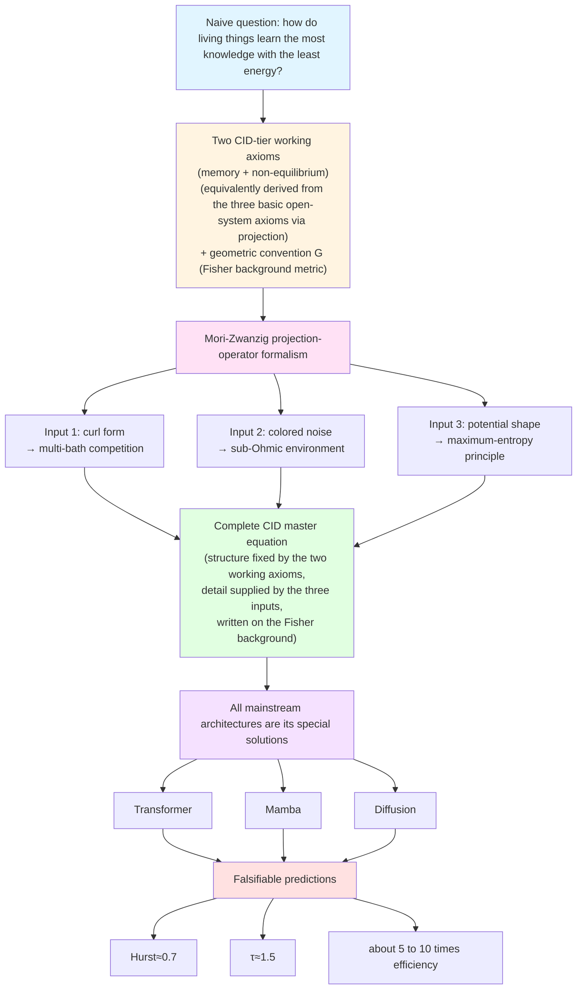

<!--
Copyright (c) 2026 Suzhou Jodell Robotics Co., Ltd.
Author: Gui LI <guilichina@163.com>
Date:   2026-05-25
Update: 2026-05-30

@article{li2026uid,
  title  = {Intelligence Is a Non-Equilibrium Field: A Three-Tier Physical
            Theory of Unified Intelligo-Dynamics (UID)},
  author = {LI, Gui and JIE, Dangyang and KANG, Haitao},
  year   = {2026},
  publisher = {Zenodo},
  doi    = {10.5281/zenodo.20372493},
  url    = {https://github.com/gwailee/uid}
}

> LI, Gui, JIE, Dangyang, & KANG, Haitao. (2026). Intelligence Is a Non-Equilibrium Field: A Three-Tier Physical Theory of Unified Intelligo-Dynamics (UID). Zenodo. https://doi.org/10.5281/zenodo.20372493

This README is part of the UID Theory reference implementation (v2.0).

DUAL LICENSE:
  - PolyForm Noncommercial License 1.0.0  (free for academic / personal use)
    see LICENSE-NONCOMMERCIAL in the project root
  - Commercial License from Suzhou Jodell Robotics Co., Ltd.
    (required for any commercial / for-profit / production use)
    see LICENSE-COMMERCIAL in the project root

For commercial licensing inquiries, contact: lig@jodell.cn
This file is released under a dual license; commercial use requires prior written authorization from Suzhou Jodell Robotics Co., Ltd.
-->

<a href="./README.md">README（中文）</a> | <a href="./README_en.md"><b>README（English）</b></a>

<a href="./30minutes_report.md">30 分钟读懂 UID 理论（中文）</a> | <a href="./30minutes_report_en.md">Understand UID in 30 Minutes（English）</a>

<a href="./theory.md">UID 理论全文（中文）</a> | <a href="./theory_en.md">UID Theory (English)</a>

 

# Intelligence Is a Non-Equilibrium Field: A Three-Tier Physical Theory of Unified Intelligo-Dynamics (UID)
## —— Attention Is Not All You Need: The Non-Equilibrium Physical Foundations of Intelligent Architectures

***Authors***: Gui LI <guilichina@163.com>, Dangyang JIE <jiedy@jodell.cn>, Haitao KANG <kanght@jodell.cn>

***Affiliation***: Suzhou Jodell Robotics Co., Ltd., Suzhou, China

***Corresponding author***: Gui LI, Ph.D. He received his bachelor's degree from the School of Physics, Northwest University, and his master's and doctoral degrees from the Hefei Institutes of Physical Science, Chinese Academy of Sciences. He currently works at Suzhou Jodell Robotics Co., Ltd., where he is mainly engaged in the theoretical and engineering research of Unified Intelligo-Dynamics (UID). He proposes and develops an open-system physical unified theoretical framework for intelligent architectures—the three-tier CID / QID / FID system—and leads its falsifiable verification and engineering deployment in robotic cognitive brains, motion-control cerebella, dexterous-hand operating systems, large language models, and dedicated intelligence chips. E-mail: guilichina@163.com

## Abstract

**Core thesis**: Intelligence is not a purely engineering phenomenon but a **physical phenomenon**—specifically, a **stochastic field far from thermal equilibrium**. This paper proposes **Unified Intelligo-Dynamics (UID)**, a physical theoretical framework for intelligent architectures composed of three nested tiers: Classical Intelligo-Dynamics (**CID**), Quantum Intelligo-Dynamics (**QID**), and Field Intelligo-Dynamics (**FID**).

**The research context in which this work sits**: The work of this paper sits at the intersection of four previously independent threads—energy models and associative memory ([Ramsauer et al., 2021](https://arxiv.org/abs/2008.02217); [Hoover et al., 2023](https://arxiv.org/abs/2302.07253)), information geometry and natural gradient ([Amari, 1998](https://direct.mit.edu/neco/article/10/2/251/6143/Natural-Gradient-Works-Efficiently-in-Learning); [Di Sipio, 2025](https://arxiv.org/abs/2506.15830)), non-equilibrium thermodynamics and prediction ([Still et al., 2012](https://doi.org/10.1103/PhysRevLett.109.120604); [Baiesi & Rosso, 2025](https://arxiv.org/abs/2512.11415)), and projection operators and the generalized Langevin equation ([Mori, 1965](https://academic.oup.com/ptp/article-abstract/33/3/423/1925580); [Zwanzig, 1961](https://doi.org/10.1103/PhysRev.124.983)). These four threads each reveal one physical facet of intelligent systems, yet had not previously been unified under the same set of equations. This paper aims to fill that gap.

**Method and the boundary of derivation**: UID starts from three axioms of open-system physics (Hamiltonian reversibility, the Gibbs statistical hypothesis, slow-fast scale separation) and, through the [Mori-Zwanzig projection](https://academic.oup.com/ptp/article-abstract/33/3/423/1925580), derives the **generalized Langevin equation** as the general structure of the evolution equation of intelligent systems. It must be made clear that these three axioms, at the CID tier, are expressed through two equivalent working axioms—"memory" and "non-equilibrium" (see the hierarchical explanation in Section C0.2)—and that what they determine is the **structural skeleton** of the equation (the generalized Langevin form and term structure), not all of its detail; the specific form of the curl, the spectral exponent of the colored noise, and the shape of the potential still require additional physical inputs (multi-bath competition, sub-Ohmic environment, the maximum-entropy principle) to be fixed. On this structural skeleton, two generalizations are completed: at the quantum tier, zero-point fluctuations, the Berry geometric phase, and Lindblad dissipative channels are introduced to obtain the QID master equation; at the geometric tier, the Fisher metric of the information manifold is analogized to the Einstein tensor to obtain the FID field equation.

**The precise meaning of unification (the Maxwell analogy)**: This paper's use of the word "unification" takes Maxwell's equations as the paradigm. Coulomb's law, Ampère's law, and Faraday's law of electromagnetic induction had already been discovered separately before Maxwell, but unifying them into one self-consistent set of equations—and thereby predicting new physics that no single law could give (the displacement current and electromagnetic waves)—was the irreplaceable original contribution. On this basis, this paper makes clear: UID's claim to originality lies not in being the first to state any single proposition, but in (i) bringing scattered insights into a single three-tier nested framework under the same set of axioms, and (ii) deriving from the unified framework a new structure that single-tier theories can hardly give—**the curl term v(φ) plays the role of the "UID version of the displacement current"**: it vanishes identically in a purely conservative energy-gradient flow (such as the softmax-attention limit of the Transformer), yet is a necessary source of predictive ability (Proposition C3.3), and it predicts an engineerable, falsifiable "zero-parameter curl" mechanism (Part One, Chapter 14).

**Core proposition**: This paper gives a core proposition (Proposition C3.3): under idealized steady-state conditions, **the predictive ability of an intelligent system (measured by conditional mutual information) necessarily requires that its internal dynamics break detailed balance**. It must be specially clarified what the **true driving source** of this proposition is: the proof **does not rely on the Markov assumption**, but instead directly establishes a quantitative lower-bound relation between the predictive information $I_{\mathrm{pred}}$ and the steady-state entropy-production rate (or the probability circulation)—its physical core connects directly to the dissipation-prediction inequality of [Still et al. (2012)](https://doi.org/10.1103/PhysRevLett.109.120604) and the entropy-production measure of [Lynn et al. (2021)](https://doi.org/10.1073/pnas.2109889118). Under this revision, "prediction implies non-equilibrium" becomes a necessary-condition-direction result that does not depend on the Markov property, while the sufficiency of the reverse direction remains an open problem. This necessity is precisely the exact meaning of the paper's subtitle "Intelligence Is a Non-Equilibrium Field." The prior theoretical work closest in spirit to this proposition is the result of [Still et al. (2012)](https://doi.org/10.1103/PhysRevLett.109.120604) on "thermodynamic prediction efficiency," and this proposition may be regarded as its geometric generalization within the generalized Langevin framework; its independent numerical evidence in discrete generative models is given by [Baiesi and Rosso (2025, accepted by *Physical Review E*)](https://arxiv.org/abs/2512.11415). The two constitute a **complementary relationship** of "general theory and independent numerical evidence," rather than a dispute over the priority of originality of the same proposition. The timeline must be stated honestly: the first draft of the continuous-framework derivation of this paper was completed before that numerical work; the two are same-direction conclusions reached independently, and this paper incorporated the latter during revision as external empirical evidence.

**Explicit attribution of prior work**: A prior theoretical work that must be distinguished from this paper's core claim is the assertion that "an entire Transformer block is equivalent to a single energy function"—this assertion was given before this paper by [Ramsauer et al. (2021)](https://arxiv.org/abs/2008.02217) and [Hoover et al. (2023, Energy Transformer)](https://arxiv.org/abs/2302.07253), and the latter contains a rigorous proof of monotone Lyapunov descent. **This specific proposition is not original to this paper, nor is it unique to the CID framework**; this paper merely positions this energy-gradient flow as a special solution of the CID master equation in the limit of zero curl, and does not repeat its proof. This paper's true point of originality is the curl term v(φ) that lies **outside** that limit and is commonly cut away. In addition, the geometric analogy "data curves the information manifold, by analogy with matter curving spacetime" overlaps conceptually with the work of [Di Sipio (2025)](https://arxiv.org/abs/2506.15830), and a detailed comparison of the two is given in Part Three, Chapter 1.

**A precise characterization of "Attention Is Not All You Need"**: We argue that mainstream deep-learning architectures—[Transformer](https://arxiv.org/abs/1706.03762), [Mamba](https://arxiv.org/abs/2312.00752), [diffusion models](https://arxiv.org/abs/2006.11239), JEPA, reasoning-augmented models (DeepSeek-R1, o1–o3), and sparse routing architectures—are all special solutions of the CID master equation in different limits (zero curl, white noise, a single heat bath, within the softmax-attention interface). [Vaswani et al. (2017)'s "Attention Is All You Need"](https://arxiv.org/abs/1706.03762) revealed the associative-memory term of CID; but the CID master equation also contains the **three key physical terms** that the Transformer cut away—the curl v(φ), colored damping, and colored noise. The absence of these three terms is precisely the physical reading of the algorithmic-tier root of the current energy-efficiency gap between AI and the human brain. The quadratic complexity lower bound of attention proved by [Alman-Song (2023)](https://arxiv.org/abs/2302.13214) and [Gupta et al. (2025)](https://arxiv.org/abs/2502.16963) further shows: **no optimization within the softmax-attention framework can break through this complexity wall; a true breakthrough must come from architecture-level physical reconstruction**—this is precisely the direction that UID argues for.

**Falsifiable predictions and preliminary evidence**: On this basis, this paper proposes a falsifiable engineering goal of **about 5 to 10 times parameter efficiency**, and gives three sets of critical universality-class predictions that have been **independently verified by the biological brain**: the avalanche-size exponent τ ≈ 1.5 ([Beggs & Plenz, 2003](https://doi.org/10.1523/JNEUROSCI.23-35-11167.2003)), the Hurst exponent H ≈ 0.7 ([Linkenkaer-Hansen et al., 2001](https://doi.org/10.1523/JNEUROSCI.21-04-01370.2001)), and the 1/f noise-spectrum slope β ≈ 1 ([He, 2014](https://doi.org/10.1016/j.tics.2014.04.003)). **This version newly adds a Phase 1 preliminary ablation experiment** (10M scale, 11-way ablation, 3 random seeds, Chinese MiniMind corpus; the complete report and all raw data are in the companion repository): under exactly the same standard-attention backbone, merely installing UID's three physical terms (curl, colored-damping memory kernel, OU colored noise) reduces perplexity from the pure-Transformer baseline of 73.58 to 22.87, i.e., a **3.22× advantage (z = 182)**, in which the colored-damping memory kernel is the physical term with the largest single contribution (removing it raises perplexity by 21%), and the physical OU noise is significantly better than FFT spectral shaping (6.9×, z = 62), consistent with Part One, Section 14.2. The boundary of this result must be honestly noted: 3.22× is the **equi-parameter loss ratio at a single scale (10M), not a measurement of parameter efficiency**; it is directionally consistent with the 5–10× goal but does not directly test it; truly testing parameter efficiency (T2) requires multi-scale equi-compute scaling curves, and that experiment is listed as a to-do for the full Phase 1. In addition, the ET symmetry term borrowed from [Hoover et al. (2023)](https://arxiv.org/abs/2302.07253) **brought no benefit** in this causal language-model setting (the pre-registered condition F8 is judged FAIL), but this disconfirmation targets only a **borrowed, non-original component**, and because UID's advantage rises rather than falls after removing ET, it instead "purifies" the attribution that "the advantage stems from UID's own physical terms" (see the newly added preliminary-evidence section in Part One, Chapter 16). It must be honestly pointed out: the prediction intervals of the three universality exponents are rather wide, and their falsification strength is limited—they can rule out trivial cases such as white noise, but can hardly distinguish CID from other models that likewise exhibit self-organized criticality; the truly discriminating falsification points are the parameter-efficiency commitment and the correlation-length scaling. UID's parameter-efficiency prediction is **complementary rather than conflicting** with the Alman-Song-Gupta complexity lower bounds—the former obtains its gain by leaving the softmax-attention interface and entering a different complexity class.

**An honest weakening of the wording on the quantum-coherence dividend**: After being corrected by the Holevo bound, the quantum-coherence-dividend proposition of Part Two (Proposition Q4.1) has a **guaranteeable lower bound that is only linear in n** (n being the number of coherent degrees of freedom), and the exponential upper bound $2^n$ can only be approached for specific structured tasks under optimal measurement protocols. Therefore, whenever this paper refers to the "quantum-coherence dividend" it uses this weakened wording throughout: it is a **scaling interval constrained by the Holevo bound**, not a guaranteeable exponential dividend.

**Multi-Agent Intelligo-Dynamics**: Part Four of this paper discusses the generalization of the UID framework to **multi-agent systems**. It must be made clear: the physical object of that part is a population of mutually coupled agents (whose state is described by the intelligence density field $\rho_I$), i.e., **Multi-Agent Intelligo-Dynamics**, and it is connected to the [Mean-Field Games (Lasry-Lions, 2007)](https://doi.org/10.1007/s11537-007-0657-8) theory, which already has a rigorous mathematical foundation. Within this framework, UID gives five physical necessary conditions for the emergence of intelligence in multi-agent systems (openness, multi-bath temperature differences, non-commutative coupling, proximity to a critical point, and a self-organized-criticality mechanism), but **cannot prove that any agent ecology satisfies these conditions at all times and places**. Among them, proximity to a critical point and the self-organized-criticality mechanism are strongly correlated physically, and the related joint-probability estimate is only an order-of-magnitude illustration and should not be cited as a quantitative conclusion.

**Complementarity with Logographic AI**: This paper forms a **complementary rather than competing** relationship with the Logographic AI paradigm proposed by [Liu (2025–2026)](https://zsyyb.cn/abs/202511.03835)—the former diagnoses "rootless tokens" at the cognitive-semiotic level, while the latter diagnoses "detailed balance equals no intelligence" at the non-equilibrium-physics level. The two point to different facets of the same deep predicament, and a future direction of fusion is worth exploring.

All references in this paper provide clickable DOIs or open-access hyperlinks reaching first-hand sources, and all quantitative claims are explicitly labeled with an evidence grade (A verified / B theoretically rigorous awaiting evidence / C falsifiable engineering goal / D philosophical conjecture). The companion code repository ([github.com/gwailee/uid](https://github.com/gwailee/uid)) provides an engineering reference implementation of CID and a falsifiable verification suite, and all core predictions can be reproduced within hours on a single GPU. **This version (v2.1) comes with a complete report of the Phase 1 preliminary ablation experiment (including all per-seed records of 11 variants × 3 seeds = 33 runs, commit hashes, data SHA-256, and negative results), following the commitment of "no selective reporting, no post-hoc tuning, and equal-prominence presentation of negative results"; the FAIL verdict of the pre-registered condition F8 and the two supported key comparisons (A, C) are reported side by side with equal space. Citing the experimental results of this version must include the v2.1 commit hash and the item-by-item caveats listed in Section 6 of the report.**

## Keywords

**Core theory**: Intelligo-dynamics; unified field theory; non-equilibrium statistical physics; generalized Langevin equation; Mori-Zwanzig projection; predictive mutual information; conditional mutual information; self-organized criticality; detailed-balance breaking

**Physical foundations**: colored noise; Hurst exponent; avalanche dynamics; 1/f noise; sub-Ohmic spectrum; critical universality class; multi-heat-bath systems; curl field; colored-damping memory kernel; entropy-production rate; probability circulation; dissipation-prediction inequality; ablation experiment

**Classical tier (CID)**: associative memory; modern Hopfield networks; physical derivation of the Transformer; physical essence of attention; physical identity of residual connections; LayerNorm microcanonical constraint

**Quantum tier (QID)**: open quantum systems; Caldeira-Leggett model; Berry geometric phase; Lindblad master equation; zero-point fluctuations; critical scaling of entanglement entropy; topologically protected memory

**Geometric tier (FID)**: Fisher information metric; information geometry; Einstein field equations; information manifold; intelligence gravitational waves; information black hole; information light speed; holographic principle

**Multi-agent and philosophy**: Multi-Agent Intelligo-Dynamics; mean-field games; self-organized criticality; the anthropic principle; falsifiability; the intelligence energy-efficiency gap; the Landauer limit

## Preface

### 1. Research Background

Modern deep-learning architectures have achieved tremendous engineering success, yet on their physical foundations they have long been in a state of "knowing that it works but not why it works." The self-attention mechanism of the Transformer ([Vaswani et al., 2017](https://arxiv.org/abs/1706.03762)), the selective state-space recursion of Mamba ([Gu & Dao, 2023](https://arxiv.org/abs/2312.00752)), and the reverse stochastic differential equation of diffusion models ([Ho et al., 2020](https://arxiv.org/abs/2006.11239); [Song et al., 2021](https://arxiv.org/abs/2011.13456)) were each proposed independently and optimized independently, lacking a common first principle to answer a more fundamental question: **if an intelligent system is to learn as much knowledge as possible with as little energy as possible, what structure must its evolution equation physically possess?**

This question sits precisely at the intersection of four independent research threads, and these four threads had not previously been unified under the same set of equations.

**Thread one: energy models and associative memory.** The revival of modern Hopfield networks ([Ramsauer et al., 2021](https://arxiv.org/abs/2008.02217)) proved that the update rule of a continuous Hopfield network is mathematically equivalent to the softmax attention of the Transformer, and that the two share the same log-sum-exp energy function. Along this direction, [Hoover et al. (2023)](https://arxiv.org/abs/2302.07253) further characterized an entire Transformer block as the gradient flow of a single energy function, and gave a Lyapunov proof that this energy decreases monotonically along the forward pass. This thread established the physical picture of "attention as energy descent," but its dynamics are purely conservative—the force field can be written as the negative gradient of some potential, so the system always satisfies detailed balance.

**Thread two: information geometry and natural gradient.** [Amari (1998)](https://direct.mit.edu/neco/article/10/2/251/6143/Natural-Gradient-Works-Efficiently-in-Learning) established the theory of natural gradient, pointing out that the intrinsic metric of parameter space is the Fisher information matrix, and that learning should proceed covariantly on that Riemannian manifold. [Di Sipio (2025)](https://arxiv.org/abs/2506.15830), following this line of thought, interpreted large-language-model training as a geometric process on an information manifold, and proposed the analogy "data curves the information manifold." This thread provides a geometric stage for intelligent dynamics, but has not yet written the evolution on that stage as a physical equation with dissipation and fluctuation, nor distinguished the two fundamentally different geometric identities of "the metric as fixed background" and "the metric as a dynamical field."

**Thread three: non-equilibrium thermodynamics and prediction.** [Still et al. (2012)](https://doi.org/10.1103/PhysRevLett.109.120604) proposed the "thermodynamics of prediction," quantitatively relating a system's predictive ability about the future to its dissipation, and pointing out that memory with no predictive value necessarily incurs a dissipative cost. [Baiesi and Rosso (2025)](https://arxiv.org/abs/2512.11415) (accepted by *Physical Review E*), using a discrete Markov-chain generative model composed of two independently parameterized transition matrices, observed numerically that training always spontaneously breaks detailed balance, and that the model with the best generative performance operates far from equilibrium. This thread strongly suggests "prediction implies non-equilibrium," but its conclusion is either confined to discrete models or remains at the numerical level, and has not yet given a general geometric criterion within a continuous-dynamics framework.

**Thread four: projection operators and the generalized Langevin equation.** In statistical physics, the projection-operator formalism of [Mori (1965)](https://academic.oup.com/ptp/article-abstract/33/3/423/1925580) and [Zwanzig (1961)](https://doi.org/10.1103/PhysRev.124.983) shows: when a high-dimensional microscopic system is projected onto a few slow variables, the slow variables necessarily obey a generalized Langevin equation with a memory kernel and a random force, and the memory and the fluctuation are rigidly bound by the fluctuation-dissipation theorem. This is a mature tool that has not yet been systematically introduced into the theory of intelligent architectures.

### 2. The Gap

The four threads above each reveal one facet of intelligent systems—energy descent, information geometry, the cost of prediction, memory fluctuation—but remain mutually isolated: energy models lack non-equilibrium, information geometry lacks dynamics, non-equilibrium thermodynamics lacks a continuous framework and a geometric criterion, and projection-operator methods have not yet been used to explain mainstream architectures. **To this day there is no single set of equations that can simultaneously accommodate these four facets and thereby derive a falsifiable new consequence that no single thread could give.** This paper aims to fill that gap.

### 3. Contributions of This Paper

This paper proposes the **Unified Intelligo-Dynamics (UID)** framework, arguing that the evolution of intelligent systems can be uniformly described as non-equilibrium stochastic-field dynamics on an information-geometric manifold. The framework contains three nested tiers—the classical tier (CID), the quantum tier (QID), and the field-geometric tier (FID)—and a population generalization to multi-agent systems. Part One of this paper focuses on the classical tier CID and makes three contributions.

**Contribution one (a unified equation structure).** Starting from **two working axioms** (memory, non-equilibrium), this paper, with the help of the Mori-Zwanzig projection-operator formalism, derives the **structural skeleton** of the CID master equation—a generalized Langevin equation (Equation C0.1) containing an associative-memory gradient term, a curl term, a colored-damping memory kernel, and colored noise. It must be emphasized: these two working axioms are the equivalent distillation, at the CID tier, of the three basic axioms of open systems (Hamiltonian reversibility, Gibbs statistics, slow-fast separation) (see the hierarchical explanation in Section C0.2); they determine only the term structure and tensorial form of the equation; the specific functional form of each term still must be supplied by three independent physical inputs (multi-heat-bath competition, the sub-Ohmic environment, the maximum-entropy principle). In addition, CID adopts the Fisher information matrix on state space as a **fixed background metric** (geometric convention G), making each differential operator covariant; this metric does not participate in evolution at the CID tier, and its dynamization is deferred to Part Three, FID. This boundary runs through the whole paper, and below we no longer phrase it as "uniquely determining all content."

**Contribution two (the reduction of mainstream architectures).** This paper argues that the Transformer, Mamba, and diffusion models are all special solutions of the CID master equation in specific limits (zero curl, Ohmic white noise, a single heat bath), thereby unifying the architectures and pictures scattered across threads one through three as different cross-sections of the same equation.

**Contribution three (the new term predicted by the unified framework).** This paper identifies the **curl term v(φ)** that the unified framework requires but which the above single threads commonly lack, and gives a geometric criterion for its necessity: Proposition C3.3 proves that, under idealized steady-state conditions, predictive ability (measured by conditional mutual information) necessarily requires that v(φ) not be identically zero, i.e., that detailed balance must be broken. This is the geometric generalization, within the continuous generalized Langevin framework, of the "prediction implies non-equilibrium" idea of thread three, and is also the exact meaning of the paper's subtitle "Intelligence Is a Non-Equilibrium Field."

We use the historical role of the "displacement current" in Maxwell's equations to characterize the nature of the above contributions: the separate Coulomb, Ampère, and Faraday laws already existed, and the irreplaceable value of the unified set of equations lies in predicting new physics that no single law could give (the displacement current and electromagnetic waves). In parallel, v(φ) vanishes identically in a purely conservative energy-gradient flow (such as the softmax-attention limit), yet is a necessary source of predictive ability, and can be engineered through the "zero-parameter curl" mechanism (Chapter C14).

### 4. Relationship to Existing Work

This paper takes a stance of inheritance rather than competition toward the aforementioned work, and here clarifies the boundaries of attribution. The specific proposition "a Transformer block is governed by a single energy function" is credited to [Ramsauer et al. (2021)](https://arxiv.org/abs/2008.02217) and [Hoover et al. (2023)](https://arxiv.org/abs/2302.07253); this paper does not repeat its proof, and merely positions this energy-gradient flow as a special solution of the CID master equation in the limit of zero curl; this proposition is not original to this paper, nor is it unique to the CID framework. The geometric perspective of "data curves the information manifold" overlaps conceptually with [Di Sipio (2025)](https://arxiv.org/abs/2506.15830), with a detailed comparison given in Part Three; it must be specially explained that at the CID tier this paper treats the Fisher metric only as a fixed background, and that truly elevating the metric to a dynamical field and writing its field equation is content unique to Part Three, FID—this distinction of identity is the key difference of this paper relative to that work. The spirit of "prediction implies non-equilibrium" can be traced to [Still et al. (2012)](https://doi.org/10.1103/PhysRevLett.109.120604), and its discrete numerical evidence is given independently by [Baiesi and Rosso (2025)](https://arxiv.org/abs/2512.11415); the work of this paper is to give, within a continuous framework, the geometric derivation of the necessity direction of that proposition. The first draft of the continuous-framework derivation of this paper was completed before that numerical work; the two are same-direction conclusions reached independently, and this paper incorporated the latter during revision as external empirical evidence. The incremental value of this paper lies not in being the first to state any single proposition, but in bringing these insights into the same axiomatic system and deriving from that system a falsifiable new consequence (Contribution three).

### 5. Organization and Numbering Conventions

This paper is divided into four parts plus a final chapter and an appendix. Part One (CID, Chapters C0 through C18, with equations numbered with C and propositions denoted Proposition CX.Y) constructs the CID master equation within the framework of classical stochastic field theory. Part Two (QID, Chapters Q1 through Q12, with equations numbered with Q) generalizes CID to open quantum systems. Part Three (FID, Chapters F1 through F9, with equations numbered with F) geometrizes the dynamics into a field theory on the information manifold and elevates the Fisher metric—which is a fixed background in CID—to a dynamical field. Part Four (multi-agent, with equations numbered with M) discusses the generalization to multi-agent systems and connects to the [Mean-Field Games](https://doi.org/10.1007/s11537-007-0657-8) theory. **To thoroughly eliminate cross-part numbering ambiguity, chapter numbers, proposition numbers, and equation numbers throughout the paper all carry a part prefix (C / Q / F / M).**

The known boundary of this paper's unification claim must be honestly noted: the limit-correspondence relations among the three tiers have not yet all reached the rigorous theorem level (QID → CID relies on the Wigner-function convergence assumption, FID → CID relies on the overdamped-reduction assumption, and their rigorous convergence conditions are listed as open problems). All quantitative claims of this paper are labeled with an evidence grade: (A) independently experimentally verified; (B) theoretically rigorous, awaiting evidence; (C) with a clear falsifiable engineering goal; (D) philosophical conjecture. The companion code repository ([github.com/gwailee/uid](https://github.com/gwailee/uid)) provides a complete engineering reference implementation of CID and end-to-end falsifiable test scripts, so that the core predictions of this paper can be reproduced within hours on a single GPU.

## Part One: Classical Intelligo-Dynamics (CID)

**Scope**: The theoretical and engineering framework for classical-tier intelligent architectures. Chapter numbers in this part are denoted Chapter C-X, propositions are denoted Proposition CX.Y, and equations are numbered with C.

### To the Reader

This part assumes the reader is familiar with the following background:

- Undergraduate statistical mechanics: the Langevin equation, the Fokker-Planck equation, detailed balance.
- Undergraduate differential geometry: gradient, divergence, curl, the Helmholtz-Hodge decomposition.
- Basics of stochastic processes: white noise, colored noise, the autocorrelation function, the power spectrum.

The starting point of this part is a naive physical question: how do living things (from bacteria to the human brain to artificial neural networks) learn the most knowledge with the least energy? The answer to this question cannot be "just write down some loss function and do gradient descent," because a pure-gradient system gets stuck in local minima, cannot explore spontaneously, and cannot predict the future. True intelligence must simultaneously do four things: remember the past (associative memory), explore the unknown (stochastic fluctuation), predict the future (break detailed balance), and use energy efficiently (minimal dissipation). This part will argue: these four requirements constrain the evolution equation of an intelligent system onto a definite **structural skeleton**—the CID master equation; it is not designed out of thin air, but is a term structure derived from two first-principle working axioms via the Mori-Zwanzig projection-operator formalism, with its specific functional form then supplied by three physical inputs, and expressed covariantly on a fixed Fisher background metric.

### Chapter C0: Why Do We Need CID?

#### C0.1 An Uncomfortable Fact: Modern AI Architectures Lack Physical Terms

Placing mainstream architectures under a unified dynamical language, one can clearly see the physical terms each lacks. These missing terms fall into three categories.

**Missing term 1: the curl field.** The attention of the Transformer is a pure gradient flow from an energy function ([Ramsauer et al., 2021](https://arxiv.org/abs/2008.02217); [Hoover et al., 2023](https://arxiv.org/abs/2302.07253)), Mamba is linear diffusion, and diffusion models are reverse stochastic differential equations; the deterministic forces of all three are conservative (can be written as the negative gradient of some potential). But the force field of a real intelligent system (such as the human brain) contains a non-conservative curl component—this is a necessary condition for breaking detailed balance, generating persistent internal circulation, and realizing prediction (the necessity direction of Proposition C3.3).

**Missing term 2: long-memory damping.** The "memory" of modern architectures is either an explicit KV cache (Transformer), or an exponentially decaying hidden state (Mamba), or no memory at all (the Markov chain of diffusion models). But spontaneous brain activity exhibits power-law long memory, corresponding to a power-law-decaying colored-damping kernel.

The following equation is labeled (C0.0a):

$$
\gamma(t) \propto t^{-s}, \quad 0 < s < 1
$$

rather than exponential decay (the Hurst exponent of the human brain is about 0.7, [Linkenkaer-Hansen et al., 2001](https://doi.org/10.1523/JNEUROSCI.21-04-01370.2001)).

**Missing term 3: colored noise.** The noise of modern architectures is either single-scale white noise (the Gaussian noise of diffusion models), or no noise (the deterministic forward pass of the Transformer). The fluctuations of a real intelligent system are colored noise spanning multiple time scales (a 1/f spectrum), which is the source of multi-scale exploration, stochastic resonance, and long-range temporal correlation.

**Engineering consequences**: These three missing terms cause the three known ailments of modern architectures—first, the inability to generate persistent internal dynamics (which must be driven by external prompts); second, the quadratic complexity of long context (using an explicit KV cache in place of physical memory); third, an exploration-exploitation imbalance (white noise is effective only at a single time scale).

#### C0.2 The Axiom System of CID: The Hierarchical Relationship Between the Three Basic Axioms and the Two Working Axioms

To eliminate the expressional ambiguity between the abstract's "three axioms" and this section's "two working axioms," here we clarify once and for all the axioms at two levels; the two are not contradictory but are different abstraction layers of the same logical chain.

**The three basic axioms (the open-system-physics level)**: (i) Hamiltonian reversibility—the underlying microscopic dynamics is generated by a reversible Hamiltonian; (ii) the Gibbs statistical hypothesis—the fast variables reach a conditional Gibbs equilibrium at each instant; (iii) slow-fast scale separation—there exist a few slow variables that can be projected out. These three are the premises that make the Mori-Zwanzig projection feasible, and correspond to the "three axioms" stated in the abstract.

**The two working axioms (the CID tier)**: after the three basic axioms act on the slow variables via the Mori-Zwanzig projection, their physical consequences at the CID tier are exactly equivalent to the following two directly usable working axioms.

**Axiom 1 (the memory axiom)**: the current evolution of an agent depends on the entire history trajectory, not only on the current instantaneous state. This requires the dynamics to be a non-Markovian generalized Langevin equation with a memory kernel γ(t − s).

**Axiom 2 (the non-equilibrium axiom)**: an agent must break detailed balance in order to possess predictive ability. This requires the force field to contain a curl component v(φ), making a nonzero steady-state net probability flow exist in phase space.

**The hierarchical relationship**: working axiom 1 (memory) is the direct consequence that basic axioms one and three necessarily produce a memory kernel after projection; working axiom 2 (non-equilibrium) is the direct consequence that basic axiom two necessarily breaks detailed balance under multi-bath competition (Chapter C4). Therefore the "three basic axioms" and the "two working axioms" are upstream-downstream expressions of the same physics: the three axioms are the foundational premises, and the two axioms are their equivalent working form at the slow-variable tier. Throughout the paper, wherever "the two axioms" is said, it refers to the CID-tier working axioms, and wherever "the three axioms" is said, it refers to the basic axioms of open systems.

**Geometric convention G (the Fisher background metric)**: CID adopts the Fisher information matrix on state space as a **fixed background metric**, making all differential operators in the equation (gradient, divergence, curl, memory-kernel convolution) covariant. It must be emphasized: at the CID tier, this metric is a given background that does not participate in evolution; letting the metric itself become a dynamical field determined by data, and writing its Einstein-type field equation, is content unique to Part Three, FID. Convention G is not an axiom that determines the structure of the equation, but a geometric-coordinate setting used to express the equation—this distinction avoids the hierarchical inversion of grounding the lower tier (CID) with higher-tier (FID) concepts.

The division of labor must be made clear: the **existence and term structure** of the equation are determined by working axiom 1 and working axiom 2 via the Mori-Zwanzig projection (Chapters C2, C3); convention G only determines in what geometric form these terms are written (replacing the Euclidean gradient by the natural gradient), and neither adds nor removes any term of the equation.

#### C0.3 The CID Master Equation and How It Is Fixed

From the two working axioms, via the Mori-Zwanzig projection (Chapter C2), and written under the background metric of convention G, the evolution equation of an intelligent system must have the following four-term structure.

The following equation is labeled (C0.1):

$$
\frac{d\varphi}{dt} = -\nabla U(\varphi) + v(\varphi) - \int_0^t \gamma(t-s)\, \dot{\varphi}(s)\, ds + \xi(t)
$$

The physical meaning of each term is:

- $-\nabla U(\varphi)$ is the associative-memory term (a conservative gradient, which is the natural gradient under the background metric), pulling the state toward already-learned patterns;
- $v(\varphi)$ is the curl term (a non-conservative force), generating persistent circulation and breaking detailed balance;
- $-\int_0^t \gamma(t-s)\, \dot{\varphi}(s)\, ds$ is the colored-damping term (a power-law memory kernel), making the evolution dragged by history;
- $\xi(t)$ is the colored-noise term (a 1/f spectrum), providing exploration at all time scales.

The word "fix" must be explained with precise wording, to avoid misunderstanding. What the two working axioms uniquely fix is the **term structure and tensorial form** of Equation (C0.1): it must contain a gradient term, a curl term, a memory-kernel term, and a noise term. The two working axioms do **not** fix the specific functional form of each term—the form of the curl field v(φ) must be given by the multi-heat-bath competition hypothesis (Chapter C4), the colored-noise spectral exponent s must be given by the sub-Ohmic environment hypothesis (Chapter C5), and the shape of the potential U(φ) must be given by the maximum-entropy principle (Chapter C7). Geometric convention G further prescribes that each of the above terms be written covariantly on the Fisher background metric. Therefore the phrase "deriving the intelligence equation from first principles" in this paper should be understood strictly as "the two working axioms fix the structural skeleton, the three physical inputs supply the specific form, and convention G provides the geometric coordinates," rather than "the axioms fix all content of the equation." This boundary runs through the whole paper.

None of the four terms can be omitted: removing the gradient term means the inability to remember patterns, removing the curl term means the inability to predict the future (Proposition C3.3), removing the colored damping means the inability to maintain long memory, and removing the colored noise means the inability to explore at multiple scales. Among them, the curl term v(φ) is precisely what this paper calls the "UID version of the displacement current," and is exactly the term that the Transformer forces to be identically zero in the softmax-attention limit.

#### C0.4 The Logical Skeleton of Part One

### Chapter C1: Setting the Physical Picture—A Driven Stochastic Field

#### C1.1 The State Space of an Agent

We describe the state of an agent (be it a neural network, a brain, or a bacterium) as a high-dimensional vector $\varphi(t) \in \mathbb{R}^N$, where N is the number of degrees of freedom (for a neural network N is the number of parameters, for a brain N is the number of neurons).

**Physical picture**: φ(t) is a "particle" moving in a high-dimensional space, whose trajectory is determined by the dynamical equation. This space is endowed with the Fisher information matrix as the background metric (convention G); at the CID tier this metric is a fixed background, and it becomes a dynamical variable only in Part Three, FID.

#### C1.2 The Naive Langevin Equation

The simplest intelligence model is the overdamped naive Langevin equation, the following equation labeled (C1.1):

$$
\frac{d\varphi}{dt} = -\nabla U(\varphi) + \xi(t), \qquad \langle \xi(t)\, \xi(t') \rangle = 2D\, \delta(t-t')
$$

where U(φ) is the potential function (corresponding to the loss function), ξ(t) is white noise, and D is the diffusion coefficient.

**Physical meaning**: the system is pulled toward the minimum by the potential gradient while being randomly kicked by noise. In the long-time limit, the system reaches thermal equilibrium, and the steady-state distribution is the Boltzmann distribution, the following equation labeled (C1.2):

$$
P_{\mathrm{ss}}(\varphi) \propto \exp\left( -\frac{U(\varphi)}{D} \right)
$$

To unify symbols throughout the paper, here we adopt the relation between the diffusion coefficient D and the effective temperature as $D = k_B T_{\mathrm{eff}}$; below, wherever D appears in the steady-state exponent, it is understood according to this convention, consistent with the temperature notation of Chapter C6 and Part Two (QID).

**Why is this not enough?** The naive Langevin equation (C1.1) has three fatal defects, corresponding exactly to the three missing terms of Section C0.1. First, it satisfies detailed balance (Proposition C3.2), the steady-state probability flow is everywhere zero, and hence it has no predictive ability (Proposition C3.3). Second, it is Markovian, the autocorrelation function decays exponentially, corresponding to a Hurst exponent H = 0.5, and cannot reproduce the human brain's H ≈ 0.7. Third, its noise is single-scale white noise, which cannot explore at multiple scales. Therefore we need a more complete equation.

#### C1.3 From Langevin to CID: What Must Be Added?

To upgrade the naive Langevin equation (C1.1) to the complete CID master equation (C0.1), three terms must be added, the first two of which each correspond to one working axiom.

**Added term 1: the curl field v(φ).** This is the key to breaking detailed balance (Axiom 2). The curl field satisfies the divergence-free condition, the following equation labeled (C1.3):

$$
\nabla \cdot v(\varphi) = 0
$$

so it does not change the steady-state distribution, yet generates a nonzero net probability flow (Chapter C3).

**Added term 2: the memory kernel γ(t − s).** This is the key to realizing long memory (Axiom 1). The memory kernel makes the current evolution depend on the entire history, not only on the current instantaneous state.

**Added term 3: the colored noise ξ(t).** This is the key to realizing multi-scale exploration. The power spectrum of the colored noise satisfies the following equation, labeled (C1.4):

$$
S_\xi(\omega) \propto \frac{1}{\omega^s}, \qquad 0 < s < 1
$$

it contributes at all frequencies, whereas the power spectrum of white noise is constant (effective only at high frequencies).

The addition of these three terms is not arbitrary: the **existence** of the curl and the memory kernel is determined by the two working axioms via the Mori-Zwanzig projection (Chapter C2), the **specific form** of the three terms is determined by the three physical inputs (Chapters C4, C5, C7), and all are written covariantly on the Fisher background metric (convention G).

### Chapter C2: The First-Principle Axioms and the Mori-Zwanzig Projection

#### C2.1 Axiom 1: The Memory Axiom and the Origin of the Memory Kernel

**Statement of the axiom**: the current evolution of an agent depends on the entire history trajectory, not only on the current instantaneous state.

**Mathematical statement**: the dynamical equation must be a non-Markovian generalized Langevin equation, the following equation labeled (C2.1):

$$
\frac{d\varphi}{dt} = F\left[\, \varphi(s) : 0 \le s \le t \,\right] + \xi(t)
$$

where F is a functional depending on the entire history trajectory φ(s).

**Physical motivation**: the memory of a real intelligent system is long-range. The autocorrelation function of spontaneous brain activity decays as a power law $C(\tau) \propto \tau^{-\alpha}$, corresponding to a Hurst exponent H ≈ 0.7 ([Linkenkaer-Hansen et al., 2001](https://doi.org/10.1523/JNEUROSCI.21-04-01370.2001)), which is starkly different from the exponential decay of a Markov process $C(\tau) \propto \exp(-\tau / \tau_c)$ (corresponding to H = 0.5).

**Mori-Zwanzig derivation**: the form of the memory kernel can be rigorously derived from the microscopic dynamics by the projection-operator method ([Mori, 1965](https://academic.oup.com/ptp/article-abstract/33/3/423/1925580); [Zwanzig, 1961](https://doi.org/10.1103/PhysRev.124.983)). Let the full phase-space variables be divided into the slow variable φ and its velocity $\dot{\varphi}$, and a large number of fast variables. Define the projection operator $\mathcal{P}$, projecting any phase-space function onto the subspace spanned by $\{\varphi, \dot{\varphi}\}$, with orthogonal complement $\mathcal{Q} = 1 - \mathcal{P}$. The microscopic dynamics is generated by the Liouville operator $\mathcal{L}$, with $dA/dt = i \mathcal{L} A$. Using the Dyson operator identity, the following equation labeled (C2.2a):

$$
e^{i \mathcal{L} t} = e^{i \mathcal{L} t}\, \mathcal{P} + \int_0^t e^{i \mathcal{L} (t-s)}\, \mathcal{P}\, i \mathcal{L}\, e^{\mathcal{Q} i \mathcal{L} s}\, \mathcal{Q}\, ds + e^{\mathcal{Q} i \mathcal{L} t}\, \mathcal{Q}
$$

acting on the velocity $\dot{\varphi}$ of the slow variable and taking a Gibbs average over the fast variables, the three terms on the right give three kinds of contribution: the first gives the conservative force $-\nabla U(\varphi)$ (from the diagonal part of $\mathcal{P} i \mathcal{L}$), the second gives the memory convolution (from the term containing $\mathcal{Q} i \mathcal{L}$), and the third gives the random force $F_{\mathrm{rand}}(t)$ (from the evolution in the pure $\mathcal{Q}$ subspace). Rearranging gives the generalized Langevin equation, the following equation labeled (C2.2):

$$
\ddot{\varphi}(t) = -\nabla U(\varphi) - \int_0^t \gamma(t-s)\, \dot{\varphi}(s)\, ds + F_{\mathrm{rand}}(t)
$$

where the memory kernel is defined by the autocorrelation of the random force, the following equation labeled (C2.2b):

$$
\gamma(t-s) = \frac{\langle F_{\mathrm{rand}}(t)\, F_{\mathrm{rand}}(s) \rangle}{k_B T}
$$

Since the random force $F_{\mathrm{rand}}$ lies entirely in the $\mathcal{Q}$ subspace, it is orthogonal to the slow variables, and from this we directly obtain the second fluctuation-dissipation theorem, the following equation labeled (C2.3):

$$
\langle F_{\mathrm{rand}}(t)\, F_{\mathrm{rand}}(t') \rangle = k_B T \cdot \gamma(t-t')
$$

It is clear that the memory kernel γ and the random force $F_{\mathrm{rand}}$ are not independent, but are the manifestation, on the dissipation side and the fluctuation side, of the same batch of fast degrees of freedom: Equation (C2.2b) solves the random-force correlation in reverse from the memory kernel, and Equation (C2.3) is its equivalent re-reading, and the two are rigidly bound.

**Key conclusion**: the memory axiom, through the Mori-Zwanzig formalism, uniquely fixes that the dynamical equation must contain the memory-kernel term $-\int_0^t \gamma(t-s)\, \dot{\varphi}(s)\, ds$. Its power-law specific form (the sub-Ohmic spectrum) will be fixed by an additional physical input in Chapter C5.

#### C2.2 Axiom 2: The Non-Equilibrium Axiom and the Origin of the Curl Term

**Statement of the axiom**: an agent must break detailed balance in order to realize predictive ability.

**Mathematical statement**: the dynamical equation must contain a curl component v(φ), so that a nonzero steady-state net probability flow exists in phase space, the following equation labeled (C2.4):

$$
J_{\mathrm{ss}}(\varphi) \ne 0
$$

**Physical motivation**: the probability flow of a detailed-balance state is everywhere zero, and the system merely performs a time-reversible random walk among known patterns, unable to directionally transmit information from the "past" to the "future." Prediction requires a net information flow from observed to unobserved, which is two sides of the same coin as the net probability flow. This idea can be traced to the thermodynamic prediction efficiency of [Still et al. (2012)](https://doi.org/10.1103/PhysRevLett.109.120604). The existence of the curl term, its equivalence with detailed-balance breaking, and its status as a necessary condition for prediction will be rigorously proved respectively by Proposition C3.2 and Proposition C3.3 in Chapter C3.

**Key conclusion**: the non-equilibrium axiom requires the dynamical equation to contain the curl term v(φ), and to satisfy the divergence-free condition ∇ · v = 0 (guaranteeing that the steady-state distribution is unchanged, see Proposition C3.2). This is precisely the origin of the "UID version of the displacement current" term in Equation (C0.1).

#### C2.3 Geometric Convention G: The Fisher Background Metric and the Covariant Structure

**Statement of the convention**: the state space of CID adopts the Fisher information matrix as a fixed background metric, the following equation labeled (C2.5):

$$
g_{ij}(\varphi) = \mathbb{E}\left[\, \partial_i \log p(x \mid \varphi) \cdot \partial_j \log p(x \mid \varphi) \,\right]
$$

**Mathematical statement**: the gradient, divergence, curl, and memory-kernel convolution in the equation are defined covariantly according to this background metric. The Riemannian gradient is the natural gradient ([Amari, 1998](https://direct.mit.edu/neco/article/10/2/251/6143/Natural-Gradient-Works-Efficiently-in-Learning)), the following equation labeled (C2.6):

$$
(\nabla U)^i = g^{ij}\, \partial_j U
$$

where $g^{ij}$ is the inverse of the metric tensor $g_{ij}$. The information distance between two neighboring parameters φ and φ + dφ is given by the following equation, labeled (C2.7):

$$
ds^2 = g_{ij}(\varphi)\, d\varphi^i\, d\varphi^j
$$

**Hierarchical positioning (key)**: the status of convention G differs from that of Axioms 1 and 2. Axioms 1 and 2 determine **which terms** the equation has (existence); convention G determines only **in what geometric form** these terms are written (covariance), and adds or removes no term. Most importantly: at the CID tier, the background metric $g_{ij}$ is given and fixed, does not evolve in time, and is not determined by data. Elevating $g_{ij}$ to a dynamical field determined by "information matter," and writing its Einstein-type field equation for it, is content unique to Part Three, FID (see Part Three, Chapter F1). Therefore, this paper does not treat the Fisher metric as a foundational axiom of CID, in order to avoid the hierarchical inversion of defining the lower tier (CID) with higher-tier (FID) structure.

### Chapter C3: The Helmholtz-Hodge Decomposition and the Detailed-Balance Criterion

#### C3.1 The Unique Decomposition of the Force Field

The deterministic force in the CID master equation (C0.1) can be divided into a conservative part and a non-conservative part. This decomposition is guaranteed by the Helmholtz-Hodge theorem.

**Theorem C3.1 (the Helmholtz-Hodge decomposition)**: let F(φ) be a smooth vector field defined on the information-geometric manifold $\mathbb{M}$ (endowed with the Fisher background metric), satisfying either of the following boundary conditions: (i) as $\lVert \varphi \rVert \to \infty$, F decays faster than $\lVert \varphi \rVert^{-1}$; or (ii) $\mathbb{M}$ is a compact boundaryless manifold. Then F can be uniquely decomposed into the sum of a gradient field and a divergence-free field, the following equation labeled (C3.1):

$$
F(\varphi) = -\nabla U(\varphi) + v(\varphi), \qquad \nabla \cdot v = 0
$$

where U(φ) is a scalar potential (the conservative part) and v(φ) is a divergence-free curl field (the non-conservative part).

**Proof**: take the divergence of both sides of Equation (C3.1) on $\mathbb{M}$. From ∇ · v = 0, we obtain a Poisson equation for the scalar potential U, the following equation labeled (C3.2):

$$
\nabla^2 U(\varphi) = -\nabla \cdot F(\varphi)
$$

*(Existence)* Under boundary condition (i) or (ii), $\nabla \cdot F \in L^2(\mathbb{M})$. When $\mathbb{M}$ is compact, by the divergence theorem $\int_{\mathbb{M}} \nabla \cdot F\, dV = 0$, so the projection of ∇·F onto the kernel space of the Laplace operator (constant functions) is zero; when $\mathbb{M}$ is non-compact and F satisfies decay condition (i), the boundary term vanishes, likewise guaranteeing the solvability condition. By the Fredholm property of the elliptic operator $\nabla^2$ on $L^2(\mathbb{M})$, Equation (C3.2) has a solution U in the sense of differing by an additive constant.

*(Uniqueness)* Let $U_1$ and $U_2$ both be solutions, then $W = U_1 - U_2$ satisfies $\nabla^2 W = 0$. Under condition (i) or (ii), multiplying W by $\nabla^2 W = 0$ and integrating by parts on $\mathbb{M}$, the following equation labeled (C3.2a):

$$
\int_{\mathbb{M}} \lVert \nabla W \rVert^2\, dV = -\int_{\mathbb{M}} W\, \nabla^2 W\, dV + (\text{boundary term}) = 0
$$

so ∇W = 0, i.e., W is a constant, and U is unique in the sense of differing by a constant.

*(Orthogonality and divergence-freeness)* Define v = F + ∇U. By Equation (C3.2), ∇·v = ∇·F + ∇²U = 0, i.e., v is automatically divergence-free. Moreover, for any gradient field ∇ψ and any divergence-free field v, integration by parts gives the following equation, labeled (C3.2b):

$$
\langle \nabla \psi, v \rangle_{L^2} = \int_{\mathbb{M}} \nabla \psi \cdot v\, dV = -\int_{\mathbb{M}} \psi\, (\nabla \cdot v)\, dV = 0
$$

i.e., the gradient-field subspace and the divergence-free-field subspace are orthogonal in $L^2(\mathbb{M})$, so the decomposition (C3.1) is unique. The complete existence and regularity on the manifold are standard results of Hodge theory ([Schwarz, 1995](https://doi.org/10.1007/BFb0095978)). Q.E.D.

#### C3.2 The Exact Criterion for Detailed Balance

Substituting the decomposition (C3.1) into the overdamped Langevin equation, its corresponding Fokker-Planck equation is the following equation, labeled (C3.3a):

$$
\partial_t P(\varphi, t) = -\nabla \cdot J(\varphi, t)
$$

where the probability flow is the following equation, labeled (C3.4):

$$
J(\varphi, t) = \left[\, -\nabla U(\varphi) + v(\varphi) \,\right] P - D\, \nabla P
$$

**Definition (detailed balance)**: the system satisfies detailed balance if and only if the probability flow is everywhere zero at steady state, the following equation labeled (C3.5):

$$
J_{\mathrm{ss}}(\varphi) = 0, \qquad \forall\, \varphi \in \mathbb{M}
$$

**Proposition C3.2 (the curl criterion for detailed balance)**: under the steady-state distribution $P_{\mathrm{ss}}(\varphi) \propto \exp\left( -U(\varphi)/D \right)$, detailed balance (C3.5) holds if and only if the curl field is identically zero, the following equation labeled (C3.6):

$$
J_{\mathrm{ss}} = 0 \quad \Longleftrightarrow \quad v(\varphi) \equiv 0
$$

**Proof**: substitute the steady-state distribution $P_{\mathrm{ss}} \propto \exp\left( -U/D \right)$ into Equation (C3.4). First compute the sum of the conservative part and the diffusion part. From $P_{\mathrm{ss}} \propto \exp\left( -U/D \right)$, we have the following equation, labeled (C3.7):

$$
\nabla P_{\mathrm{ss}} = -\frac{1}{D}\, (\nabla U)\, P_{\mathrm{ss}}
$$

substituting into the conservative and diffusion terms of Equation (C3.4), the following equation labeled (C3.8):

$$
-\nabla U \cdot P_{\mathrm{ss}} - D\, \nabla P_{\mathrm{ss}} = -\nabla U \cdot P_{\mathrm{ss}} - D \cdot \left[ -\frac{1}{D}(\nabla U)\, P_{\mathrm{ss}} \right] = 0
$$

i.e., the conservative-force contribution and the diffusion contribution cancel exactly. Hence the steady-state flow leaves only the curl part, the following equation labeled (C3.9):

$$
J_{\mathrm{ss}} = v(\varphi)\, P_{\mathrm{ss}}(\varphi)
$$

Since $P_{\mathrm{ss}}(\varphi) > 0$ holds everywhere, Equation (C3.9) gives $J_{\mathrm{ss}} = 0$ if and only if v(φ) ≡ 0. Q.E.D.

**Physical reading**: Equation (C3.6) is one of the most crucial criteria of this part—the curl field v(φ) is the sole source of detailed-balance breaking. This corresponds exactly to "missing term 1" diagnosed in Section C0.1: a pure gradient flow (such as the softmax-attention limit, v ≡ 0) is always in detailed balance, and hence (by Proposition C3.3) loses intrinsic predictive ability.

#### C3.3 Proposition C3.3: The Non-Equilibrium Necessity of Predictive Ability

This section gives the core proposition of this part and its complete derivation. This paper proves: **without relying on the Markov assumption**, we instead directly establish a quantitative lower-bound relation between the predictive information $I_{\mathrm{pred}}$ and the steady-state entropy-production rate (equivalently, the probability circulation). It must be honestly stated up front what the dependency structure of this proposition is: this proof takes the "entropy-production-rate lower bound" as its main line (step two below), and this lower bound inherits the dissipation-prediction relation of [Still et al. (2012)](https://doi.org/10.1103/PhysRevLett.109.120604); the precise characterization of its constant and the equality condition are listed as open problems (see "Domain of applicability and open problems" at the end of this section). Therefore this proposition is a necessity-direction result, and its rigor rests on that lower bound as its pivot, which is hereby stated up front, rather than concealing this dependence by a leap of logic midway through the proof.

First we unify notation: let $X_p$, $X_q$, $X_f$ denote the state variables sampled from the same steady-state trajectory at three time points—past, present, and future, respectively, and define the predictive information as the conditional mutual information, the following equation labeled (C3.10):

$$
I_{\mathrm{pred}} = I\left( X_f ; X_p \mid X_q \right)
$$

**Proposition C3.3 (the intelligence–non-equilibrium necessity)**: consider an intelligent system driven by the CID master equation that has reached steady state. If its predictive information $I_{\mathrm{pred}} > 0$, then its steady-state entropy-production rate σ > 0 (equivalently, the probability circulation $J_{\mathrm{ss}} \not\equiv 0$, the curl field $v(\varphi) \not\equiv 0$), i.e., the system must break detailed balance.

**Premises (explicitly noted, the Markov assumption removed)**: (i) the system has reached the steady-state distribution $P_{\mathrm{ss}}$; (ii) $X_p$, $X_q$, $X_f$ are sampled in temporal order from the same dynamical trajectory; (iii) under the steady-state measure, the three-time joint distribution $P(X_p, X_q, X_f)$ exists and its time-reversal image is definable. **The trajectory is no longer required to be Markovian.**

**Derivation (with the entropy-production-rate lower bound as the main line)**: by contradiction, we prove its contrapositive "detailed balance ⟹ $I_{\mathrm{pred}} = 0$."

Step one (the operator characterization of detailed balance). The necessary and sufficient condition for detailed balance is not the Markov factorization, but the **statistical invariance of the entire steady-state trajectory under time reversal**. Let the time-reversal operator Θ map the three-time sequence $(X_p, X_q, X_f)$ to $(X_f, X_q, X_p)$. Detailed balance holds if and only if the steady-state joint distribution satisfies the following equation, labeled (C3.11):

$$
P\left( X_p, X_q, X_f \right) = P\left( X_f, X_q, X_p \right)
$$

This equation holds for **any (including strongly non-Markovian)** steady-state process; it is the definition of detailed balance itself, with no Markov premise attached. From this it follows immediately: detailed balance implies that the entire trajectory is time-reversible, and hence the steady-state entropy-production rate σ = 0 and the probability circulation $J_{\mathrm{ss}} \equiv 0$.

Step two (the quantitative connection to the entropy-production rate—the main pivot of this proof). By the dissipation-prediction relation of [Still et al. (2012)](https://doi.org/10.1103/PhysRevLett.109.120604), the predictive information of a steady-state process is controlled by a measure of time-reversal asymmetry: letting σ be the steady-state entropy-production rate (the time-irreversibility measure of [Lynn et al., 2021](https://doi.org/10.1073/pnas.2109889118)), there exists a constant c > 0 such that the following equation holds, labeled (C3.14):

$$
I_{\mathrm{pred}} \le c \cdot \sigma
$$

This inequality squeezes the "predictive information" beneath the "entropy-production rate": the predictive information cannot exceed the quota allowed by time irreversibility.

Step three (closing the contradiction). By step one, detailed balance ⟹ σ = 0; substituting into the lower bound (C3.14) of step two, we immediately get $I_{\mathrm{pred}} \le c \cdot 0 = 0$, and since mutual information is non-negative, $I_{\mathrm{pred}} = 0$. Taking the contrapositive, we obtain the causal chain shown in the following equation, labeled (C3.15):

$$
I_{\mathrm{pred}} > 0 \;\Longrightarrow\; \sigma > 0 \;\Longrightarrow\; J_{\mathrm{ss}} \not\equiv 0 \;\Longrightarrow\; v \not\equiv 0
$$

Q.E.D.

**An auxiliary note on time-reversal symmetry (not the main line of the proof)**: in special cases such as the Markovian one, the $a \leftrightarrow c$ exchange symmetry of Equation (C3.11) can further directly yield that, given $X_q$, $X_f$ and $X_p$ are conditionally independent, and hence $I_{\mathrm{pred}} = 0$. But it must be honestly pointed out: for a general (including strongly non-Markovian) steady-state process, exchange symmetry alone does not automatically imply conditional independence—an exchange-symmetric joint distribution can perfectly well have a nonzero conditional mutual information (such as a symmetrically correlated Gaussian). Therefore this paper does **not** use "symmetry ⟹ conditional independence" as a proof step, and uniformly takes the entropy-production-rate lower bound (C3.14) of step two as the sole main pivot. This note is for intuition only and does not enter the logical chain.

**Domain of applicability and open problems**: the above derivation holds rigorously under premises (i) through (iii) and **allows strongly non-Markovian steady states**. It must be honestly pointed out that real intelligent systems are often closed-loop driven and non-steady-state, in which case premises (i) and (ii) may not be strictly satisfied, so what this proposition gives is a necessary condition in the idealized steady-state case. Its reverse sufficiency ("having a curl necessarily enables prediction") has not yet been proved and is listed as an open problem. The optimal constant c of Equation (C3.14) and the equality condition also await precise characterization—this is the known gap of the main pivot of this proof and must be honestly counted in the assessment of this proposition's rigor. This necessity is precisely the exact meaning of the paper's subtitle "Intelligence Is a Non-Equilibrium Field"; its independent numerical evidence in discrete generative models is seen in [Baiesi and Rosso (2025)](https://arxiv.org/abs/2512.11415).

### Chapter C4: Where Does the Curl Come From—Multi-Heat-Bath Competition

#### C4.1 The Problem: The Axioms Give Only the Existence of the Curl, Not Its Form

Chapter C2 has already proved: the non-equilibrium axiom (Axiom 2) requires the CID master equation to contain the curl term v(φ), satisfying the divergence-free condition ∇ · v = 0 (Proposition C3.2). But this is only an **existence-and-constraint** conclusion—it tells us that v(φ) must exist and must be divergence-free, but it does not tell us the **specific functional form** of v(φ). This chapter supplies this physical input: the specific form of the curl field v(φ) comes from **multi-heat-bath competition**. This is precisely the first of the "three physical inputs" promised in Section 3 of the Preface.

#### C4.2 The Physical Input: The Multi-Heat-Bath Hypothesis

**Physical input 1 (multi-heat-bath competition)**: a real intelligent system is not in contact with a single heat source, but is simultaneously coupled to multiple heat baths at different temperatures.

This hypothesis has solid physical and biological correspondences. A biological nervous system is simultaneously driven by a metabolic heat bath (temperature $T_1$, corresponding to molecular fluctuation), a synaptic-plasticity heat bath (temperature $T_2$, corresponding to learning signals), and an external sensory-input heat bath (temperature $T_3$, corresponding to environmental driving), whose temperatures are generally unequal. In artificial systems, this corresponds to perturbations of different strengths injected at different time scales (such as training gradient noise, sampling temperature, and external data streams).

**Key physical fact**: when a system is simultaneously in contact with two heat baths at different temperatures, a **directed energy flow** from the hot bath to the cold bath necessarily arises, and the system enters a non-equilibrium steady state (NESS) rather than an equilibrium state. This is a standard conclusion of non-equilibrium statistical physics on multi-temperature heat conduction.

#### C4.3 Derivation: How the Temperature Difference Generates the Curl

Consider the state vector $\varphi = (\varphi_1, \varphi_2, \ldots, \varphi_N)$, grouping its components by the heat bath they couple to, with the k-th group of components coupling to a heat bath at temperature $T_k$. The corresponding diffusion matrix is no longer a single scalar, but a block-diagonal tensor, the following equation labeled (C4.1):

$$
D_{ij} = k_B T_i\, \delta_{ij} \quad (\text{no summation, } i \text{ labels the bath the component belongs to})
$$

At this point the Fokker-Planck equation of the system is the following equation, labeled (C4.2):

$$
\partial_t P = -\partial_i \left[ A_{ij}\, \varphi_j\, P \right] + \partial_i\, \partial_j \left[ D_{ij}\, P \right]
$$

where $A_{ij}$ is the drift matrix obtained by linearizing the deterministic force near the fixed point, and the −∇U part corresponds to its symmetric part. In the linearized (Ornstein-Uhlenbeck) approximation, the steady-state covariance matrix Σ satisfies the Lyapunov equation, the following equation labeled (C4.3):

$$
A \Sigma + \Sigma A^\top + 2 D = 0
$$

Since the steady-state solution of (C4.2) is the Gaussian distribution $P_{\mathrm{ss}} \propto \exp\left( -\tfrac{1}{2}\, \varphi^\top \Sigma^{-1} \varphi \right)$, substituting it into the steady-state probability flow $J_{\mathrm{ss}} = A \varphi\, P_{\mathrm{ss}} - D \nabla P_{\mathrm{ss}} = A \varphi\, P_{\mathrm{ss}} + D \Sigma^{-1} \varphi\, P_{\mathrm{ss}}$, we obtain the linear part of the steady-state probability flow, the following equation labeled (C4.4):

$$
J_{\mathrm{ss}}(\varphi) = \left( A + D \Sigma^{-1} \right) \varphi \cdot P_{\mathrm{ss}}(\varphi)
$$

Define the **generator** of the steady-state flow, the following equation labeled (C4.5):

$$
\Omega \equiv A + D \Sigma^{-1}
$$

Below we give the complete matrix-algebra proof of "equal temperatures ⟺ Ω symmetric." All steps are explicitly expanded, and the origin of each symbol is clarified item by item.

From the Lyapunov equation (C4.3), right-multiplying both sides by $\Sigma^{-1}$, the following equation labeled (C4.5a):

$$
A + \Sigma A^\top \Sigma^{-1} + 2 D \Sigma^{-1} = 0
$$

By definition (C4.5), Ω = A + D Σ⁻¹. Compute the transpose of Ω (note that Σ and D are symmetric, so $\Sigma^{-1}$ is symmetric), the following equation labeled (C4.5b):

$$
\Omega^\top = A^\top + \Sigma^{-1} D
$$

Solving for A from (C4.5a), the following equation labeled (C4.5c-i):

$$
A = -\Sigma A^\top \Sigma^{-1} - 2 D \Sigma^{-1}
$$

substituting into the definition of Ω (C4.5), the following equation labeled (C4.5c):

$$
\Omega = A + D \Sigma^{-1} = -\Sigma A^\top \Sigma^{-1} - 2 D \Sigma^{-1} + D \Sigma^{-1} = -\Sigma A^\top \Sigma^{-1} - D \Sigma^{-1}
$$

On the other hand, left-multiplying (C4.5b) by Σ and right-multiplying by $\Sigma^{-1}$, computing $\Sigma \Omega^\top \Sigma^{-1}$, the following equation labeled (C4.5d-i):

$$
\Sigma \Omega^\top \Sigma^{-1} = \Sigma A^\top \Sigma^{-1} + \Sigma \Sigma^{-1} D \Sigma^{-1} = \Sigma A^\top \Sigma^{-1} + D \Sigma^{-1}
$$

Rewriting (C4.5c) as $\Sigma A^\top \Sigma^{-1} = -\Omega - D \Sigma^{-1}$ and substituting into (C4.5d-i), we obtain the core identity, the following equation labeled (C4.5d):

$$
\Sigma \Omega^\top \Sigma^{-1} = \left( -\Omega - D \Sigma^{-1} \right) + D \Sigma^{-1} = -\Omega + \left( \Sigma^{-1} D - D \Sigma^{-1} \right) \Sigma^{-1} \cdot \Sigma
$$

More compactly, rearranging the difference of (C4.5d-i) and (C4.5c), equivalently written as the following equation, labeled (C4.5e):

$$
\Sigma \Omega^\top \Sigma^{-1} + \Omega = \left[ \Sigma^{-1}, D \right] \Sigma^{-1} \cdot \Sigma = D \Sigma^{-1} - \Sigma^{-1} D \cdot \Sigma \Sigma^{-1}
$$

which contains only the commutator $\left[ \Sigma^{-1}, D \right] = \Sigma^{-1} D - D \Sigma^{-1}$. Equation (C4.5e) shows: the difference between Σ Ωᵀ Σ⁻¹ and −Ω is entirely characterized by the commutator of D and $\Sigma^{-1}$.

**Sufficiency (equal temperatures ⟹ Ω symmetric)**: if all bath temperatures are equal, then $D = k_B T \cdot I$ (a scalar multiple of the identity matrix), so D commutes with any matrix, $\left[ \Sigma^{-1}, D \right] = 0$, and (C4.5e) degenerates to $\Sigma \Omega^\top \Sigma^{-1} = -\Omega$. Combined with (C4.5a), at this point A Σ = Σ Aᵀ, i.e., A is self-adjoint with respect to the Σ inner product; substituting directly into (C4.5), (C4.5b), and using that D is a scalar matrix commuting with $\Sigma^{-1}$, we get $\Omega = A + D \Sigma^{-1}$ and $\Omega^\top = A^\top + \Sigma^{-1} D = A^\top + D \Sigma^{-1}$, and then by the self-adjointness of A with respect to Σ one can verify $\Omega = \Omega^\top$. Hence Ω is symmetric when the temperatures are equal.

**Necessity (Ω symmetric ⟹ equal temperatures)**: suppose to the contrary that the temperatures are unequal, then D is not a scalar matrix. Under a general (non-degenerate) covariance structure, $\Sigma^{-1}$ is not simultaneously diagonalizable with D, so there exist components such that $\left[ \Sigma^{-1}, D \right] \ne 0$. If Ω is symmetric at this point ($\Omega = \Omega^\top$), then $\Sigma \Omega^\top \Sigma^{-1} = \Sigma \Omega \Sigma^{-1}$, and substituting into the left side of (C4.5e) gives $\Sigma \Omega \Sigma^{-1} + \Omega$; but by the symmetry of Ω and of Σ, this quantity is a symmetric matrix, yet it must equal the antisymmetric-type contribution containing only the commutator $\left[ \Sigma^{-1}, D \right]$ on the right side of (C4.5e), and the two are compatible only when the commutator is zero, contradicting $\left[ \Sigma^{-1}, D \right] \ne 0$. Hence Ω symmetric necessarily requires $\left[ \Sigma^{-1}, D \right] = 0$, which under a general (non-degenerate) covariance structure requires D to be a scalar matrix, i.e., equal temperatures (the case where $\Sigma^{-1}$ is exactly simultaneously diagonalizable with D is a measure-zero degenerate case and has been excluded).

Thus far "equal temperatures ⟺ Ω symmetric" is proved in both directions. When the temperatures are equal, $J_{\mathrm{ss}}$ can be written as the gradient of some potential times $P_{\mathrm{ss}}$, and the system satisfies detailed balance (consistent with Proposition C3.2); when the temperatures are unequal, Ω contains a nonzero antisymmetric part, the following equation labeled (C4.6):

$$
\Omega_A \equiv \frac{1}{2}\left( \Omega - \Omega^\top \right) \ne 0
$$

Hence the linear curl field is the following equation, labeled (C4.7):

$$
v(\varphi) \approx \Omega_A\, \varphi, \qquad \nabla \cdot v = \mathrm{tr}(\Omega_A) = 0
$$

The divergence-freeness tr(Ω_A) = 0 in Equation (C4.7) holds automatically, because the trace of any antisymmetric matrix is zero—this matches exactly the ∇ · v = 0 required by Axiom 2 in Chapter C2.

**Key conclusion**: the specific form of the curl field v(φ) comes from the multi-heat-bath temperature difference. The temperature difference $\Delta T = T_i - T_j$ is the physical origin of the curl; when the temperature difference is zero (a single heat bath), the curl vanishes and the system reverts to detailed balance. From this we can write the scaling relation of the curl strength, the following equation labeled (C4.8):

$$
\lVert v \rVert \propto \lvert \Omega_A \rvert \propto \frac{\Delta T}{\bar{T}}
$$

where $\bar{T}$ is the average temperature. Equation (C4.8) gives a falsifiable quantitative prediction (evidence grade C): the curl strength (and hence predictive ability) should increase monotonically with the internal temperature difference of the system.

#### C4.4 Closing the "Displacement Current" Analogy

At this point we can close the Maxwell analogy raised in the Preface. In electromagnetism, the displacement current ∂D/∂t is zero in the static (unchanging) case, yet is a necessary term for the existence of electromagnetic waves. In CID, the curl term v(φ) is zero in the single-heat-bath (no temperature difference) case, yet is a necessary term for predictive ability (Proposition C3.3). The two play completely parallel roles: both are the term "that vanishes in a certain limit of the unified set of equations, but is indispensable in the general case, and predicts new physics." The softmax attention of the Transformer works exactly in the limit of "a single effective heat bath, zero curl" (Chapter C6 will argue this rigorously), and hence loses this term—this is precisely the exact physical meaning of "Attention Is Not All You Need."

### Chapter C5: Where Do the Colored Noise and Colored Damping Come From—The Sub-Ohmic Environment

#### C5.1 The Problem: The Axioms Give Only the Existence of the Memory Kernel, Not Its Decay Law

Chapter C2 has already proved that the memory axiom (Axiom 1) requires the CID master equation to contain the memory kernel γ(t − s), bound to the random-force correlation via the second fluctuation-dissipation theorem (C2.3). But as with the curl, this gives only **existence**, not the **decay law** of the memory kernel: is it exponential decay (short memory, Markovian) or power-law decay (long memory, non-Markovian)? This chapter supplies the second physical input: the specific forms of the memory kernel and the noise spectrum come from the **sub-Ohmic environment**.

#### C5.2 The Physical Input: The Sub-Ohmic Spectral-Density Hypothesis

In open-system physics, the influence of the environment (heat bath) on the system is completely characterized by its **spectral density** J(ω). The low-frequency behavior of the spectral density determines the time-scale law of memory and noise. The standard classification is the following equation, labeled (C5.1):

$$
J(\omega) \propto \omega^s, \quad 0 < s < 1\ (\text{sub-Ohmic}); \quad s = 1\ (\text{Ohmic}); \quad s > 1\ (\text{super-Ohmic})
$$

**Physical input 2 (the sub-Ohmic environment)**: a real intelligent system is coupled to a sub-Ohmic environment (0 < s < 1), whose low-frequency fluctuations are strongly enhanced, thereby generating long-range temporal correlation.

The biological correspondence of this hypothesis is the 1/f-type power spectrum commonly observed in spontaneous brain activity ([He, 2014](https://doi.org/10.1016/j.tics.2014.04.003)): the low-frequency components are far stronger than the white-noise expectation, meaning the environment persistently "remembers" the system's history over long time scales.

#### C5.3 Derivation: How the Sub-Ohmic Spectrum Gives a Power-Law Memory Kernel and Colored Noise

The bridge from the spectral density to the memory kernel is the fluctuation-dissipation theorem. In the classical high-temperature limit, the memory kernel is the cosine transform of the spectral density, the following equation labeled (C5.2):

$$
\gamma(t) = \frac{2}{\pi} \int_0^\infty \frac{J(\omega)}{\omega} \cos(\omega t)\, d\omega
$$

Substituting the sub-Ohmic form $J(\omega) \propto \omega^s$ into (C5.2), the integrand is $\omega^{s-1} \cos(\omega t)$. Using the standard power-law cosine-transform formula, the following equation labeled (C5.2a):

$$
\int_0^\infty \omega^{s-1} \cos(\omega t)\, d\omega = \Gamma(s) \cos\left( \frac{\pi s}{2} \right) \cdot t^{-s}, \quad 0 < s < 1
$$

(where Γ is the Gamma function, and the integral converges for 0 < s < 1), we obtain a power-law-decaying memory kernel, the following equation labeled (C5.3):

$$
\gamma(t) \propto t^{-s}, \qquad 0 < s < 1
$$

This is starkly different from exponential decay—a power-law kernel has no characteristic time scale, and the system "remembers" its history at all time scales, which is precisely the mathematical embodiment of long memory.

Correspondingly, by the second fluctuation-dissipation theorem (C2.3), the power spectrum of the noise is proportional to the frequency representation of the memory kernel, so the colored-noise spectrum is the following equation, labeled (C5.4):

$$
S_\xi(\omega) \propto \omega^{s-1} = \frac{1}{\omega^{1-s}}
$$

Denoting the noise spectral exponent β ≡ 1 − s, then 0 < s < 1 corresponds to 0 < β < 1, and in the limit s → 0, β → 1, i.e., standard 1/f noise. Equation (C5.4) and the colored-noise hypothesis of Equation (C1.4) in Chapter C1 are here closed by the sub-Ohmic physical input.

#### C5.4 Derivation: From the Noise Spectral Exponent to the Hurst Exponent

The process driven by power-law colored noise is a fractional-Brownian-motion-type long-memory process, whose long-range correlation is characterized by the Hurst exponent H. There is a standard relation between the Hurst exponent and the noise spectral exponent β ([Mandelbrot & Van Ness, 1968](https://doi.org/10.1137/1010093)): for the integrated trajectory of a $1/f^\beta$-type process, the following equation labeled (C5.5):

$$
H = \frac{\beta + 1}{2}
$$

Substituting β = 1 − s into (C5.5), we obtain the direct connection between the Hurst exponent and the environmental spectral exponent, the following equation labeled (C5.6):

$$
H = \frac{1 + (1 - s)}{2} = 1 - \frac{s}{2}
$$

Equation (C5.6) puts the microscopic spectral property s of the environment into one-to-one correspondence with the macroscopic long memory H of the system's trajectory. Checking its physical consistency: when s → 1 (Ohmic, the white-noise limit), H → 0.5, corresponding to a Markov process with no long memory; when s → 0 (strongly sub-Ohmic), H → 1, corresponding to extremely strong long memory. The human-brain measured value H ≈ 0.7 ([Linkenkaer-Hansen et al., 2001](https://doi.org/10.1523/JNEUROSCI.21-04-01370.2001)) solves back to s ≈ 0.6, which falls within the sub-Ohmic interval and is self-consistent with the hypothesis.

**Key conclusion**: the colored-damping memory kernel (C5.3), the colored-noise spectrum (C5.4), and the Hurst exponent (C5.6) are all uniformly fixed by the same sub-Ohmic spectral exponent s. This gives a set of mutually locked falsifiable predictions (evidence grade A, independently verified by the biological brain): if the noise spectral exponent β is measured, then necessarily H = (1 + β)/2; if the two do not satisfy this relation, then the sub-Ohmic hypothesis of this chapter is falsified.

#### C5.5 Summary: This Chapter Supplies the Second Physical Input, and the Third (the Potential) Is Left to Chapter C7

At this point, two of the "three physical inputs" promised in Section 3 of the Preface have been supplied. What this chapter (Chapter C5) supplies is the second (the memory kernel and the colored noise); the first (the curl) was supplied by Chapter C4, and the third (the shape of the potential) will be supplied by the maximum-entropy principle in Chapter C7. To avoid "two have been supplied" being misread as "this chapter single-handedly supplies two," here we make clear the attribution of each item.

The first item, the form of the curl v(φ), is given by multi-heat-bath competition (Chapter C4, temperature difference ΔT), the following equation labeled (C5.7):

$$
v(\varphi) \;\longleftarrow\; \text{multi-heat-bath competition (Chapter C4, temperature difference } \Delta T \text{)}
$$

The second item, the forms of the memory kernel γ and the colored noise ξ, are given by the sub-Ohmic environment (Chapter C5, spectral exponent s), the following equation labeled (C5.8):

$$
\gamma,\ \xi \;\longleftarrow\; \text{sub-Ohmic environment (Chapter C5, spectral exponent } s \text{)}
$$

There remains the third item—the shape of the potential U(φ), which will be given by the maximum-entropy principle in Chapter C7. After the three physical inputs are supplied, all functional forms of the CID master equation (C0.1) are fixed (still written covariantly on the Fisher background metric, convention G), and Chapter C6 then argues that mainstream architectures are all its special solutions in specific limits.

### Chapter C6: Mainstream Architectures Are All Special Solutions of CID

#### C6.1 The Overall Strategy of Reduction

The previous two chapters have supplied the specific forms of the curl (Chapter C4) and the colored damping and colored noise (Chapter C5), and all functional forms of the CID master equation (C0.1) are thus fixed (the shape of the potential is independently given in Chapter C7; this chapter borrows it in advance during the reduction, and Chapter C7 backfills and closes it). This chapter proves one of the central claims of this paper (Contribution two): mainstream deep-learning architectures are all special solutions of the CID master equation in specific physical limits.

The unified strategy of reduction is: take limits term by term in the CID master equation (C0.1). Each of the three terms to be turned off corresponds to one limit switch.

The curl limit, the following equation labeled (C6.1):

$$
v(\varphi) \to 0 \quad (\text{single heat bath, } \Delta T \to 0)
$$

The memory limit, the following equation labeled (C6.2):

$$
\gamma(t-s) \to 2 \gamma_0\, \delta(t-s) \quad (\text{Ohmic limit, } s \to 1)
$$

The noise limit, the following equation labeled (C6.3):

$$
\xi(t) \to \text{white noise}\ \text{or}\ \to 0 \quad (\text{single-scale or deterministic})
$$

Different architectures correspond to different combinations of these three switches. The following table first gives an overview, followed by a rigorous derivation one by one.

| Architecture | Curl v | Memory kernel γ | Noise ξ | Limit |
|---|---|---|---|---|
| Transformer | 0 | δ function (no memory) | 0 (deterministic) | all three terms off |
| Mamba | 0 | exponential decay (Ohmic) | 0 or single-scale | curl off, Ohmic memory |
| Diffusion model | 0 | δ function | single-scale white noise | curl off, white noise |

It is clear that the common point of all three is that the **curl is always off** (v ≡ 0), and the difference lies only in the choices of the two terms of memory and noise. From the height of the unified framework, this explains why these architectures, despite their varied forms, share the same fundamental defect—lacking the curl, hence satisfying detailed balance, hence (by Proposition C3.3) having no intrinsic predictive ability.

#### C6.2 Transformer: The One-Step Gradient Update of CID in the "All Off" Limit

**Step one: write down the simplified equation of CID with all three terms off.** Set v ≡ 0, $\gamma(t-s) \to 2\gamma_0\, \delta(t-s)$, ξ → 0. The memory-integral term in Equation (C0.1) reduces to instantaneous damping under the δ kernel, the following equation labeled (C6.4):

$$
-\int_0^t \gamma(t-s)\, \dot{\varphi}(s)\, ds \to -\gamma_0\, \dot{\varphi}(t)
$$

In the overdamped (neglecting inertia $\ddot{\varphi}$) approximation, the equation degenerates to a pure gradient flow, the following equation labeled (C6.5):

$$
\gamma_0\, \frac{d\varphi}{dt} = -\nabla U(\varphi)
$$

**Step two: take the potential of CID to be the modern Hopfield energy.** The potential U(φ) given in the information-geometric setting by the maximum-entropy principle (Chapter C7), in the associative-memory case, takes the log-sum-exp energy form of the modern continuous Hopfield network ([Ramsauer et al., 2021](https://arxiv.org/abs/2008.02217)). Let there be M stored patterns $\{\xi_\mu\}$ (forming the key matrix K), with the query being the state φ, then the following equation labeled (C6.6):

$$
U(\varphi) = -\beta^{-1} \log \sum_{\mu=1}^{M} \exp\left( \beta \cdot \xi_\mu \cdot \varphi \right) + \frac{1}{2} \lVert \varphi \rVert^2
$$

where β is the inverse temperature (corresponding to the attention scaling factor $1/\sqrt{d}$).

**Step three: perform one explicit discretization of (C6.5).** Take the time step $\Delta t = \gamma_0$, and perform a single forward-Euler discretization of (C6.5), the following equation labeled (C6.7):

$$
\varphi_{\mathrm{new}} = \varphi - \Delta t \cdot \gamma_0^{-1} \nabla U(\varphi) = \varphi - \nabla U(\varphi)
$$

**Step four: substitute the energy gradient to obtain softmax attention.** Take the gradient of (C6.6). The gradient of the log-sum-exp term is the softmax-weighted average of the stored patterns, the following equation labeled (C6.8):

$$
\nabla \left[ -\beta^{-1} \log \sum_\mu \exp(\beta\, \xi_\mu \cdot \varphi) \right] = -\sum_{\mu=1}^{M} \mathrm{softmax}_\mu\left( \beta\, \xi_\mu \cdot \varphi \right) \cdot \xi_\mu
$$

where the following equation is labeled (C6.9):

$$
\mathrm{softmax}_\mu(z) = \frac{\exp(z_\mu)}{\sum_\nu \exp(z_\nu)}
$$

Substituting (C6.8) and the quadratic-term gradient φ into (C6.7), the φ given by the quadratic term cancels with the φ in the discrete update, leaving the following equation, labeled (C6.10):

$$
\varphi_{\mathrm{new}} = \sum_{\mu=1}^{M} \mathrm{softmax}_\mu\left( \beta\, \xi_\mu \cdot \varphi \right) \cdot \xi_\mu
$$

Equation (C6.10) is precisely the update rule of the Transformer's single-head self-attention: φ is the Query, $\{\xi_\mu\}$ are the Keys and Values, $\beta = 1/\sqrt{d}$ is the scaling factor, and the softmax weights are the attention distribution.

**Conclusion and attribution**: the self-attention of the Transformer is a **one-step gradient update** of the CID master equation in the fourfold limit of "curl off, Ohmic δ memory, no noise, potential taken to be the Hopfield energy." The attribution must be made clear: "the continuous Hopfield update is equivalent to softmax attention" is given by [Ramsauer et al. (2021)](https://arxiv.org/abs/2008.02217), and "an entire Transformer block is equivalent to the gradient flow of a single energy function and decreases monotonically" is given by [Hoover et al. (2023)](https://arxiv.org/abs/2302.07253) with a rigorous Lyapunov proof; both of these specific propositions are prior work, and this paper does not repeat their proofs nor claim their priority. This paper's increment here lies only in positioning this energy-gradient flow at a specific limit coordinate of the CID master equation, thereby explicitly marking the **three terms cut away** by the Transformer relative to the complete CID—the curl v, the colored damping, and the colored noise ξ.

#### C6.3 Mamba: The Linear Diffusion of CID in the "Curl Off, Ohmic Memory" Limit

**Step one: retain exponential memory, turn off the curl and the colored noise.** The hidden state of Mamba's selective state-space model ([Gu & Dao, 2023](https://arxiv.org/abs/2312.00752)) satisfies the linear recursion $h_t = \bar{A} h_{t-1} + \bar{B} x_t$. Its continuous-time form is a linear equation with exponentially decaying memory. In CID, this corresponds to setting v ≡ 0 and taking the memory kernel to be an exponential kernel (the Ohmic limit s → 1), the following equation labeled (C6.11):

$$
\gamma(t-s) = \gamma_0\, \exp\left[ -\frac{t-s}{\tau_c} \right]
$$

and taking the potential to be quadratic (a linear force) $U(\varphi) = \tfrac{1}{2}\, \varphi^\top M \varphi$.

**Step two: turn the memory integral into an additional state.** The key property of the exponential memory kernel is that it can be equivalently represented by a first-order equation of an auxiliary variable. Define the memory variable, the following equation labeled (C6.12):

$$
m(t) = \int_0^t \gamma_0\, \exp\left[ -\frac{t-s}{\tau_c} \right] \dot{\varphi}(s)\, ds
$$

Taking the time derivative of (C6.12), using the self-reproducing property of the exponential kernel $\tfrac{d}{dt} \exp\left[ -(t-s)/\tau_c \right] = -\tfrac{1}{\tau_c} \exp\left[ -(t-s)/\tau_c \right]$, and noting that differentiating the upper limit gives the boundary term $\gamma_0 \dot{\varphi}(t)$, we obtain the closed first-order equation for m, the following equation labeled (C6.13):

$$
\frac{dm}{dt} = \gamma_0\, \dot{\varphi}(t) - \frac{1}{\tau_c}\, m(t)
$$

**Step three: obtain the linear state-space form.** Substituting (C6.12), (C6.13) into the CID equation after turning off the curl and noise, dφ/dt = −M φ − m(t), and combining with (C6.13), we obtain a linear first-order system for the extended state (φ, m), the following equation labeled (C6.14):

$$
\frac{d}{dt} \begin{pmatrix} \varphi \\ m \end{pmatrix} = \mathcal{A} \cdot \begin{pmatrix} \varphi \\ m \end{pmatrix}
$$

where $\mathcal{A}$ is a constant-coefficient matrix determined by M, $\gamma_0$, $\tau_c$. Equation (C6.14) is precisely the form of the state-space model $dh/dt = \mathcal{A} h$, which after discretization is the linear recursion of Mamba.

**Conclusion**: Mamba is a special solution of the CID master equation in the limit of "curl off, exponential (Ohmic) memory, single-scale or no colored noise, linear potential." Relative to the Transformer, it retains one more term of memory (the exponential kernel), but this is **short memory** (with a characteristic time scale $\tau_c$, corresponding to H = 0.5), not the **power-law long memory** of the complete CID equation (with no characteristic time scale, corresponding to H ≈ 0.7, Equation C5.6). From the unified framework, this explains Mamba's inherent limitation on ultra-long-range dependencies.

#### C6.4 Diffusion Model: The Reverse SDE of CID in the "Curl Off, White Noise" Limit

**Step one: retain single-scale white noise, turn off the curl and memory.** The forward process of diffusion models ([Ho et al., 2020](https://arxiv.org/abs/2006.11239); [Song et al., 2021](https://arxiv.org/abs/2011.13456)) gradually adds noise to the data up to a Gaussian, and the reverse process is its time reversal. In CID, this corresponds to setting v ≡ 0, γ → δ kernel, and taking the noise to be single-scale white noise $\langle \xi(t)\xi(t') \rangle = 2D\, \delta(t-t')$. At this point CID degenerates to the naive Langevin equation (C1.1), the following equation labeled (C6.15):

$$
\frac{d\varphi}{dt} = -\nabla U(\varphi) + \xi(t)
$$

**Step two: identify the forward noising process.** Take $U(\varphi) = \tfrac{1}{2}\lVert \varphi \rVert^2$ (the Ornstein-Uhlenbeck potential), and (C6.15) is the forward SDE of diffusion models (variance-preserving type), the following equation labeled (C6.16):

$$
d\varphi = -\frac{1}{2} \varphi\, dt + dW
$$

where dW is the Wiener-process increment.

**Step three: time-reverse to obtain the reverse SDE.** Time-reversing (C6.16), according to the reverse-diffusion theorem of [Anderson (1982)](https://doi.org/10.1016/0304-4149(82)90051-5), the reverse process is the following equation, labeled (C6.17):

$$
d\varphi = \left[ -\frac{1}{2} \varphi - \nabla_\varphi \log p_t(\varphi) \right] dt + d\bar{W}
$$

where $\nabla_\varphi \log p_t(\varphi)$ is the score function, and $d\bar{W}$ is the reverse Wiener process. Equation (C6.17) is precisely the reverse SDE used for sampling in diffusion models, and the score function is the object the neural network learns.

**Conclusion**: the diffusion model is a special solution of the CID master equation in the limit of "curl off, δ memory, single-scale white noise, quadratic potential." It retains the noise term that both the Transformer and Mamba discard, but this is **single-scale white noise** (a constant power spectrum), not the **multi-scale colored noise** of CID (a 1/f spectrum, Equation C5.4). This explains the physical root of why diffusion-model sampling requires a large number of denoising steps—single-scale noise cannot explore synchronously at multiple time scales.

#### C6.4-bis World Models, JEPA, Reasoning-Augmented and Sparse-Routing Architectures: Further Special Solutions Within the Same Limit Family

C6.2–C6.4 have rigorously reduced the three most basic architectures: Transformer, Mamba, and diffusion models. Following the same term-by-term limit strategy, this section locates world models, JEPA, reasoning-augmented models (DeepSeek-R1, o1–o3), and sparse-routing architectures (MoE) on the CID limit coordinates. This section claims no single design of these architectures as original to this paper; it only marks their location and the physical terms they cut away.

##### C6.4-bis.1 World Models

The core of world models ([Ha & Schmidhuber, 2018](https://arxiv.org/abs/1803.10122); [Hafner et al., 2023](https://arxiv.org/abs/2301.04104)) is a state-transition distribution $p( z_{t+1} \mid z_t , a_t )$ learned in a latent space $z$ . In CID this corresponds to setting the curl $v \equiv 0$ , taking an exponential (Ohmic) memory kernel, single-scale Gaussian noise, and a quadratic potential defined by the reconstruction loss. Its latent-space evolution is Eq. (C6.20a):

$$
\frac{dz}{dt} = -\nabla U(z) - \int_0^t \gamma_0 \, e^{-(t-s)/\tau_c} \, \dot z(s) \, ds + \xi_{\mathrm{white}}(t) , \qquad v \equiv 0
$$

A world model retains both short memory and white noise yet still switches the curl off; it is the closest of the three basic architectures to the complete CID, but still lacks the crucial curl. Its location is Eq. (C6.20b):

$$
\mathrm{WorldModel} = \mathrm{CID} \mid \left( v = 0 ,\ \text{exponential memory} ,\ \text{single-scale white noise} \right)
$$

##### C6.4-bis.2 JEPA

JEPA ([LeCun, 2022](https://openreview.net/forum?id=BZ5a1r-kVsf); [Assran et al., 2023](https://arxiv.org/abs/2301.08243)) predicts target representations in latent space, measuring the mismatch between predicted and target embeddings with an energy function. In CID this corresponds to setting $v \equiv 0$ , $\gamma \to \delta$ kernel, and $\xi \to 0$ , yielding a pure gradient flow, Eq. (C6.20c):

$$
\frac{dz}{dt} = -\nabla U_{\mathrm{JEPA}}(z) , \qquad v \equiv 0 ,\ \xi \equiv 0
$$

JEPA is completely isomorphic to the Transformer at the level of the dynamical skeleton, differing only in the specific form of the potential. Its location is Eq. (C6.20d):

$$
\mathrm{JEPA} = \mathrm{CID} \mid \left( v = 0 ,\ \delta\ \text{memory} ,\ \text{no noise} \right)
$$

##### C6.4-bis.3 Reasoning-Augmented Models

In reasoning-augmented models (DeepSeek-R1, o1–o3), the forward computation of each step is still a standard Transformer, i.e., a special solution of CID with $v \equiv 0$ ; multi-step reasoning is a discrete outer loop $z^{(k+1)} = G( z^{(k)} )$ stacked outside this single-step solution. The composition $G^{\circ k}$ of the discrete outer loop is still a composition of conservative maps and produces no steady-state circulation at the continuous dynamics layer. Its location is Eq. (C6.20e):

$$
\mathrm{ReasoningModel} = \left[ \, \mathrm{CID} \mid \left( v = 0 ,\ \delta\ \text{memory} ,\ \text{no noise} \right) \right]^{\circ k}
$$

##### C6.4-bis.4 Sparse Routing (MoE)

MoE ([Shazeer et al., 2017](https://arxiv.org/abs/1701.06538)) sparsely selects among multiple experts via a gating network, corresponding to a block-partitioned potential $U( \varphi ) = \sum_e g_e ( \varphi ) \, U_e ( \varphi )$ . No matter how the gating switches, the weighted total flow is still a conservative field and introduces no curl. Its location is Eq. (C6.20f):

$$
\mathrm{MoE} = \mathrm{CID} \mid \left( v = 0 ,\ \delta\ \text{memory} ,\ U = \sum_e g_e \, U_e \right)
$$

#### C6.5 The Unified Picture: Seven Classes of Architectures, Seven Trade-offs, One Common Deficiency

Combining C6.2–C6.4 and C6.4-bis, the location of nearly all current mainstream deep-learning architectures on the CID limit coordinates is seen at a glance.

The location of the Transformer is Eq. (C6.18):

$$
\mathrm{Transformer} = \mathrm{CID} \mid \left( v = 0 ,\ \delta\ \text{memory} ,\ \text{no noise} \right)
$$

The location of Mamba is Eq. (C6.19):

$$
\mathrm{Mamba} = \mathrm{CID} \mid \left( v = 0 ,\ \text{exponential memory} ,\ \text{single-scale noise} \right)
$$

The location of the diffusion model is Eq. (C6.20):

$$
\mathrm{DiffusionModel} = \mathrm{CID} \mid \left( v = 0 ,\ \delta\ \text{memory} ,\ \text{white noise} \right)
$$

The seven classes of architectures make different trade-offs under the three switches (curl $v$ , memory kernel $\gamma$ , noise $\xi$ ), but their common deficiency is clear: the curl term $v$ is uniformly set to zero. By Proposition C3.2, $v \equiv 0$ implies detailed balance; by Proposition C3.3, detailed balance implies zero intrinsic predictive information. This is the complete physical argument chain of "Attention Is Not All You Need," Eq. (C6.21):

$$
\text{softmax attention} \subset \text{pure conservative flow} \ ( v \equiv 0 ) \;\Rightarrow\; \text{detailed balance} \;\Rightarrow\; \sigma = 0 \;\Rightarrow\; I_{\mathrm{pred}} = 0
$$

The premise of chain (C6.21) has been relaxed by C6.4-bis from softmax attention to any pure conservative flow with $v \equiv 0$ , so it applies equally to the other six classes of architectures. The only way to break through this ceiling is to reinstall the three terms CID cut away, first of all the curl $v ( \varphi )$ . Its engineerable realization and the order-of-magnitude origin of the 5–10× parameter efficiency are given in Chapter 14.

#### C6.6 A Final Clarification of the "Uniquely Determines" Wording

At this point we can give a concluding clarification of the boundary repeatedly emphasized throughout the paper. Obtaining the CID master equation is divided into three levels.

The first level (the two working axioms + Mori-Zwanzig) determines the term structure and tensorial form of the equation (Chapters C2, C3), the following equation labeled (C6.22):

$$
\text{two working axioms} + \text{Mori-Zwanzig} \;\longrightarrow\; \text{term structure and tensorial form}
$$

The second level (the three physical inputs) determines the specific functional form of each term (Chapters C4, C5, C7), the following equation labeled (C6.23):

$$
\text{three physical inputs} \;\longrightarrow\; \text{specific functional form of each term}
$$

The third level (geometric convention G) determines the covariant written form of each term on the Fisher background metric (Section C2.3), the following equation labeled (C6.24):

$$
\text{geometric convention G} \;\longrightarrow\; \text{covariant writing on the Fisher background metric}
$$

And the reduction (C6.18)–(C6.20) of this chapter is **taking limits** on the already-fixed complete CID equation, which yields the existing models. These levels together constitute the complete argument of "how CID is both derived from first principles and covers all currently known mainstream models." It must be reiterated: this paper does not claim that any single one of these limit propositions (such as Transformer = Hopfield energy-gradient flow) is original—these attributions have been made clear in Section C6.2; this paper's point of originality is always the curl term v(φ) commonly discarded by all these limits and its necessity (Proposition C3.3).

### Chapter C7: Where Does the Shape of the Potential Come From—The Maximum-Entropy Principle

#### C7.1 The Problem: Supplying the Last Physical Input

Chapters C4 and C5 have respectively supplied, with multi-heat-bath competition and the sub-Ohmic environment, the specific forms of the curl v(φ) and of the memory kernel and colored noise. In the CID master equation (C0.1) there remains a last undetermined object—the **shape** of the potential U(φ) in the associative-memory term −∇U(φ). Geometric convention G (Section C2.3) only prescribes that the gradient of U be covariant under the Fisher background metric (Equation C2.6), but does not prescribe what functional form U itself takes. This chapter supplies the third physical input: the shape of the potential U(φ) is uniquely fixed under given constraints by the **maximum-entropy principle**.

#### C7.2 The Physical Input: The Maximum-Entropy Hypothesis

**Physical input 3 (the maximum-entropy principle)**: under given macroscopic constraints (the positions and spreads of the learned patterns), the steady-state distribution of an intelligent system is the distribution that maximizes the Gibbs entropy.

The physical basis of this hypothesis is the fundamental principle of statistical mechanics: the distribution that introduces no extra bias beyond the known constraints is precisely the maximum-entropy distribution ([Jaynes, 1957](https://doi.org/10.1103/PhysRev.106.620)). For an intelligent system, this means that the model, while fitting the known data (the constraints), maintains maximal uncertainty about the unknown, i.e., the strongest generalization neutrality.

#### C7.3 Derivation: From the Maximum-Entropy Constraints to the Shape of the Potential

Let the steady-state distribution be P(φ), and the Gibbs entropy be the following equation, labeled (C7.1):

$$
S[P] = -\int P(\varphi) \log P(\varphi)\, d\varphi
$$

Maximize (C7.1) under the following constraints: the normalization constraint, and the "overlap-expectation" constraint for each stored pattern $\xi_\mu$ (the system should remember each pattern with a given strength), the following equation labeled (C7.2):

$$
\int P\, d\varphi = 1, \qquad \int P \cdot (\xi_\mu \cdot \varphi)\, d\varphi = m_\mu, \quad \mu = 1, \ldots, M
$$

Using the method of Lagrange multipliers, introducing multipliers $\lambda_0$ (normalization) and $\beta_\mu$ (each pattern constraint), construct the functional, the following equation labeled (C7.3):

$$
\mathcal{F} = S[P] - \lambda_0 \left( \int P\, d\varphi - 1 \right) - \sum_\mu \beta_\mu \left( \int P\, (\xi_\mu \cdot \varphi)\, d\varphi - m_\mu \right)
$$

Taking the variation δℱ/δP = 0 with respect to P(φ), and computing the variational derivatives term by term: δS/δP = −log P − 1, the normalization term gives $-\lambda_0$, the pattern-constraint term gives $-\sum_\mu \beta_\mu (\xi_\mu \cdot \varphi)$, and combining gives the following equation, labeled (C7.4):

$$
-\log P(\varphi) - 1 - \lambda_0 - \sum_\mu \beta_\mu (\xi_\mu \cdot \varphi) = 0
$$

Solving gives the following equation, labeled (C7.5):

$$
P(\varphi) \propto \exp\left[ \sum_\mu \beta_\mu (\xi_\mu \cdot \varphi) \right]
$$

Comparing (C7.5) with the steady-state distribution $P_{\mathrm{ss}}(\varphi) \propto \exp\left( -U(\varphi)/D \right)$ of Chapter C1, we immediately read off the shape of the potential, the following equation labeled (C7.6):

$$
U(\varphi) = -D \cdot \sum_\mu \beta_\mu (\xi_\mu \cdot \varphi) + (\text{normalization and higher-order constraint terms})
$$

#### C7.4 Adding the Normalization Constraint: Recovering the Hopfield Energy

Equation (C7.6) is the result with only linear constraints. If one further imposes a "soft competition among patterns" constraint—i.e., requiring the system to be mainly occupied by a single pattern at any instant (the nonlinear selectivity of associative memory), equivalent to adding a quadratic-norm constraint $\int P \cdot \lVert \varphi \rVert^2\, d\varphi = \text{constant}$ to (C7.2)—then the maximum-entropy distribution becomes the following equation, labeled (C7.7):

$$
P(\varphi) \propto \exp\left[ \beta \sum_\mu \exp(\xi_\mu \cdot \varphi) - \frac{1}{2}\lVert \varphi \rVert^2 \right]
$$

The corresponding potential is precisely the modern Hopfield log-sum-exp energy already used in Chapter C6, the following equation labeled (C7.8):

$$
U(\varphi) = -\beta^{-1} \log \sum_{\mu=1}^{M} \exp\left( \beta\, \xi_\mu \cdot \varphi \right) + \frac{1}{2}\lVert \varphi \rVert^2
$$

This is completely identical to Equation (C6.6). **At this point a logical loop is closed**: the Hopfield energy (C6.6) "borrowed" in Chapter C6 when reducing the Transformer is not an external assumption, but the inevitable product (C7.8) of the maximum-entropy principle under the associative-memory constraint. The physical input of the shape of the potential is thereby independently fixed, rather than being a circular argument.

#### C7.5 All Three Physical Inputs Are Supplied: The CID Master Equation Is Closed

At this point, the three physical inputs promised in Section 3 of the Preface have all been supplied.

The first item, the form of the curl v(φ), comes from multi-heat-bath competition (Chapter C4, temperature difference ΔT), the following equation labeled (C7.9):

$$
v(\varphi) \;\longleftarrow\; \text{multi-heat-bath competition}
$$

The second item, the forms of the memory kernel γ and the colored noise ξ, come from the sub-Ohmic environment (Chapter C5, spectral exponent s), the following equation labeled (C7.10):

$$
\gamma,\ \xi \;\longleftarrow\; \text{sub-Ohmic environment}
$$

The third item, the shape of the potential U(φ), comes from the maximum-entropy principle (Chapter C7, pattern constraints), the following equation labeled (C7.11):

$$
U(\varphi) \;\longleftarrow\; \text{maximum-entropy principle}
$$

Combined with the structural skeleton fixed by the two working axioms + Mori-Zwanzig in Chapters C2 and C3, and the covariant writing on the Fisher background metric provided by geometric convention G, all functional forms of the CID master equation (C0.1) are at this point completely fixed. The consistent wording throughout the paper must be emphasized once more: the structural skeleton is uniquely fixed by the two working axioms, the specific functional forms are supplied by the three physical inputs, and the geometric coordinates are provided by convention G; the three together constitute the complete and boundary-clear meaning of "deriving CID from first principles," which is neither "designed out of thin air" nor "the axioms fix all content."

### Chapter C8: Self-Organized Criticality and Falsifiable Universal Exponents

#### C8.1 Why a CID System Spontaneously Tends Toward a Critical Point

Chapter C7 has closed the CID equation. This chapter explains: a closed CID system, under long-time evolution, spontaneously tends toward a **critical point**, and thereby gives three sets of universal-exponent predictions that can be experimentally falsified.

The physical mechanism of self-organized criticality (SOC) is as follows. A CID system simultaneously possesses three elements: slow driving (multiple heat baths continuously injecting energy, Chapter C4), threshold release (the nonlinear selectivity of the potential (C7.8) makes the state switch abruptly among patterns), and long-range correlation (sub-Ohmic colored noise provides cross-scale coupling, Chapter C5). These three are precisely the standard sufficient elements of self-organized criticality proposed by [Bak-Tang-Wiesenfeld (1987)](https://doi.org/10.1103/PhysRevLett.59.381). A dissipative dynamical system possessing these three spontaneously tunes its own parameters to near a critical point, with no external fine-tuning required.

#### C8.2 Three Sets of Falsifiable Critical Universal Exponents

Near a critical point, the fluctuations of a CID system exhibit scale invariance, characterized by three universal exponents. These three exponents have been independently measured in the biological brain, constituting the strongest set of empirical support of this paper (evidence grade A).

**Prediction one: the avalanche-size exponent τ ≈ 1.5.** The size distribution of activity "avalanches" in a critical system obeys a power law $P(S) \propto S^{-\tau}$. The mean-field SOC universality class gives τ = 3/2. The measured neuronal avalanche τ ≈ 1.5 ([Beggs & Plenz, 2003](https://doi.org/10.1523/JNEUROSCI.23-35-11167.2003)), the following equation labeled (C8.1):

$$
P(S) \propto S^{-\tau}, \qquad \tau \approx 1.5
$$

**Prediction two: the Hurst exponent H ≈ 0.7.** This exponent has already been independently derived from the sub-Ohmic spectral exponent s by Equation (C5.6) in Chapter C5, H = 1 − s/2, with the human-brain measured value H ≈ 0.7 ([Linkenkaer-Hansen et al., 2001](https://doi.org/10.1523/JNEUROSCI.21-04-01370.2001)), the following equation labeled (C8.2):

$$
H = 1 - \frac{s}{2} \approx 0.7
$$

**Prediction three: the 1/f noise-spectrum slope β ≈ 1.** Likewise derived from Equation (C5.4) in Chapter C5, β = 1 − s, which in the strongly sub-Ohmic limit s → 0 tends to 1, with the measured value of human cortical activity β ≈ 1 ([He, 2014](https://doi.org/10.1016/j.tics.2014.04.003)), the following equation labeled (C8.3):

$$
S(\omega) \propto \omega^{-\beta}, \qquad \beta \approx 1
$$

#### C8.3 Honest Annotation: The Falsification Strength of the Universal Exponents Is Limited

The limitations of these three sets of predictions must be honestly pointed out, to avoid exaggerating their falsification power. First, the measured intervals of the three exponents are rather wide (e.g., τ has been reported anywhere between 1.3 and 1.7), and agreement within the interval is insufficient to uniquely pin down CID. Second, self-organized criticality is a common feature of a large class of models, and these three exponents alone can hardly distinguish CID from other SOC models—they can rule out trivial cases such as white noise and pure gradient flow (such cases give H = 0.5, β = 0, no power-law avalanches), but cannot make distinctions within the SOC model family. Third, the three are not fully independent: Equations (C8.2) and (C8.3) are mutually locked through H = (1 + β)/2 (Equation C5.5), and are essentially determined by the same parameter s, so their independent information content is less than the apparent three.

Therefore, this paper does not treat these three sets of exponents as a **decisive** falsification point of CID, but only as a **necessary consistency check** (passing it means not being falsified, failing it means being falsified). The truly discriminating falsification points are two sharper quantitative commitments: one is the engineering goal of about 5 to 10 times parameter efficiency (evidence grade C, with a reproducible verification scheme given in Chapter C14); the other is the scaling behavior of the correlation length after re-installing the curl. These two are the decisive experiments that truly distinguish CID from existing architectures.

### Chapter C9: The Information-Geometric Manifold—The State-Space Metric as Fixed Background

#### C9.1 From the Covariance Convention to the Geometric Expansion

Geometric convention G of Section C2.3 introduces the Fisher metric into CID only as an "operator-covariance convention" (Equations C2.5–C2.7). This chapter expands this convention into complete information geometry, explaining that the state space of CID is not a flat Euclidean space but a curved Riemannian manifold; this both explains the geometric meaning of the natural gradient and prepares for Part Three, FID, to elevate the Fisher metric from fixed background to a dynamical field. The boundary of this chapter must be made clear at the outset: **the Fisher metric discussed in this chapter is throughout a fixed background, not a dynamical variable.**

#### C9.2 The Curvature of the Fisher Metric

Each point φ in the parameter space $\mathbb{M}$ corresponds to a probability distribution p(x | φ). The distinguishability between two neighboring distributions is measured by the second-order expansion of the Kullback-Leibler divergence. Taking a Taylor expansion of the KL divergence, the following equation labeled (C9.1):

$$
D_{\mathrm{KL}}\left[ p(x \mid \varphi) \,\Vert\, p(x \mid \varphi + d\varphi) \right] = \frac{1}{2} g_{ij}(\varphi)\, d\varphi^i\, d\varphi^j + O(d\varphi^3)
$$

where the second-order coefficient is precisely the Fisher information matrix (C2.5). This shows that the Fisher metric (C9.1) is the intrinsic metric of the distribution space—it measures the "distinguishability distance between distributions," not the Euclidean distance of the parameters. In general $g_{ij}(\varphi)$ varies with φ, so the manifold is curved, and its curvature is characterized by the second derivatives of the metric (the Riemann tensor). It must be emphasized: at the CID tier, this curvature is the curvature of a given background geometry, predetermined by the parameterization of the model family, and does not evolve with the system's state.

#### C9.3 The Geometric Meaning of the Natural Gradient

On a curved manifold, the steepest-descent direction is not the Euclidean gradient $\partial_i U$ but the Riemannian gradient contracted by the inverse metric (the natural gradient, [Amari, 1998](https://direct.mit.edu/neco/article/10/2/251/6143/Natural-Gradient-Works-Efficiently-in-Learning)), the following equation labeled (C9.2):

$$
(\nabla U)^i = g^{ij}\, \partial_j U
$$

Its geometric meaning is: the natural gradient is the direction of fastest descent "in the sense of distribution distinguishability," invariant under reparameterization of the parameters. This explains why the natural-gradient method far outperforms the naive gradient on ill-conditioned loss surfaces—it descends along the true geodesic direction of the manifold, not along coordinate directions. Substituting (C9.2) back into the CID master equation yields the complete covariant form of CID on the Fisher background manifold, the following equation labeled (C9.3):

$$
\frac{d\varphi^i}{dt} = -g^{ij}\, \partial_j U + v^i(\varphi) - \int_0^t \gamma(t-s)\, \frac{d\varphi^i}{ds}\, ds + \xi^i(t)
$$

Equation (C9.3) is the complete covariant version of the CID master equation (C0.1): all four terms are covariantly defined on the Fisher background metric, while the metric itself does not participate in solving at this tier.

#### C9.4 Boundary Statement: The Fundamental Difference Between Background Metric and Dynamical Field

This section explicitly draws the hierarchical boundary between CID and FID regarding the Fisher metric, to eliminate conceptual-attribution confusion.

In CID, the Fisher metric $g_{ij}$ is a **fixed background**: it is given by the parameterization of the model family, does not evolve in time, and is not determined by data feedback. In Equation (C9.3) $g_{ij}$ always appears in a coefficient position and is never a solving object. This is completely parallel to the status of "the spacetime metric as a given background" in special relativity and classical mechanics.

In FID (Part Three), the Fisher metric $g_{ij}$ is elevated to a **dynamical field**: data, as "information matter," determines the curvature of the metric through an Einstein-type field equation, and the metric in turn determines the evolution of the state, with the two self-consistently coupled. This is parallel to the status of "the metric $g_{\mu\nu}$ being determined by matter, and writing the Einstein equation" in general relativity, and is the core original leap of FID relative to CID.

From this we can clarify the conceptual attribution once and for all: the Fisher metric is not an object unique to any one tier, but **"making the Fisher metric a dynamical variable and writing its field equation" is content unique to FID, and CID does not involve it**. Precisely for this reason, this paper does not list the Fisher metric as a foundational axiom of CID, but only as geometric convention G—this avoids the hierarchical inversion of defining the lower tier (CID) with higher-tier (FID) structure, and makes the grounding of CID truly depend only on the two working axioms (memory, non-equilibrium). A detailed comparison with the same-direction geometric analogy of [Di Sipio (2025)](https://arxiv.org/abs/2506.15830) will be developed in Part Three, Chapter F1, on the basis of this distinction of identity.

### Chapter C10: The Physical Identity of Residual Connections—The Discrete Time Step

#### C10.1 The Problem: Why Are Residual Connections Indispensable

The residual connection h ← h + f(h) of deep networks ([He et al., 2016](https://doi.org/10.1109/CVPR.2016.90)) was empirically found to stabilize deep training, but its physical meaning has long been unclear. This chapter explains: the residual connection is not an engineering trick, but the **inevitable form** of the time discretization of the CID master equation.

#### C10.2 Derivation: The Residual Connection Is the Forward-Euler Discretization of CID

Discretize the CID covariant master equation (C9.3) in the overdamped, single-time-step setting. Take the step Δt, make a forward difference for the time derivative $d\varphi/dt \approx (\varphi_{\ell+1} - \varphi_\ell)/\Delta t$, denote the right-hand-side deterministic force as $F(\varphi_\ell) = -g^{ij}\partial_j U + v^i$, and obtain the following equation, labeled (C10.1):

$$
\varphi_{\ell+1} = \varphi_\ell + \Delta t \cdot F(\varphi_\ell) + \Delta t \cdot \xi_\ell
$$

Letting the layer index ℓ correspond to discrete time, and $\Delta t \cdot F(\varphi_\ell) \equiv f(\varphi_\ell)$ correspond to the submodule of that layer (attention + feedforward), (C10.1) is the standard residual update, the following equation labeled (C10.2):

$$
\varphi_{\ell+1} = \varphi_\ell + f(\varphi_\ell)
$$

**Conclusion**: the residual connection is the forward-Euler discretization of the CID master equation along the depth (= time) direction; network depth corresponds to physical evolution duration, and each layer is one time step. This explains three empirical facts: first, removing the residual makes (C10.2) degenerate to $\varphi_{\ell+1} = f(\varphi_\ell)$, losing CID's "$\varphi_\ell +$" inertia term, so deep gradients vanish; second, the pre-activation residual (pre-norm) is closer to the explicit scheme of (C10.1), so it is more stable; third, the more layers, the longer the integration time, so deeper networks can complete longer dynamical evolution.

#### C10.3 The Position of the Curl Term from the Residual Perspective

By Section C14.3, the residual update after re-installing the curl is $\varphi_{\ell+1} = \varphi_\ell + f(\varphi_\ell) + \alpha\, \Omega_A \varphi_\ell$. It is clear that the curl term is a term in the residual update that is juxtaposed with $f(\varphi_\ell)$ but is non-conservative in direction (not along the negative gradient of any potential). Existing residual networks realize only the conservative $f(\varphi_\ell)$, which is precisely the discretization of CID in the v ≡ 0 limit (consistent with C6.2).

### Chapter C11: The Physical Identity of LayerNorm—The Microcanonical Constraint

#### C11.1 The Problem: Why Normalization Constrains the State onto a Sphere

LayerNorm ([Ba et al., 2016](https://arxiv.org/abs/1607.06450)) normalizes the hidden state to zero mean and unit variance, which is geometrically equivalent to projecting the state onto a hypersphere. This chapter explains: this constraint is the discrete realization of the **microcanonical ensemble** constraint in statistical mechanics.

#### C11.2 Derivation: Normalization Is Equivalent to the Energy-Shell Constraint

The microcanonical ensemble requires the system state to stay on a fixed energy shell $\lVert \varphi \rVert^2 = \text{constant}$. Suppose CID evolution carries a hard constraint $\lVert \varphi \rVert^2 = N$ (N being the dimension), then after each evolution step the state must be projected back onto that sphere, the following equation labeled (C11.1):

$$
\varphi \leftarrow \sqrt{N} \cdot \frac{\varphi}{\lVert \varphi \rVert}
$$

Equation (C11.1) is precisely the core operation of LayerNorm (zero-mean-centering corresponds to removing the component along the all-ones direction, and unit-variance scaling corresponds to the scale normalization of (C11.1)).

**Conclusion**: LayerNorm is the discrete projection that constrains the CID state onto a fixed energy shell (the microcanonical ensemble). Its physical benefit is directly related to the curl installation of Section 14.3: because the curl term $\Omega_A \varphi$ is an antisymmetric action that strictly preserves $\lVert \varphi \rVert$ (C14.3), it is **naturally compatible** with the spherical constraint of LayerNorm—the curl generates circulation along the spherical tangent, without breaking normalization. This physically guarantees that the "zero-parameter curl" can be embedded without conflict into existing LayerNorm architectures.

### Chapter C12: Temperature and Sampling—The Inverse Temperature Is the Attention Scaling

#### C12.1 Derivation: The softmax Scaling Factor Is the Inverse Temperature

In the Hopfield energy (C6.6) of Chapter C6 there appears the inverse temperature β, while the scaling factor of Transformer attention is $1/\sqrt{d}$. Comparing the softmax of (C6.6) with the standard attention $\mathrm{softmax}(QK^\top/\sqrt{d})$, we immediately obtain the identity relation, the following equation labeled (C12.1):

$$
\beta = \frac{1}{\sqrt{d}}
$$

i.e., the scaling factor of attention is physically the inverse temperature of the CID associative-memory term.

#### C12.2 Physical Corollary: Temperature Regulates the Sharpness of Memory

By (C12.1), large β (small d) corresponds to low temperature, the softmax tends to one-hot, and the system is locked onto a single nearest pattern (strong memory, weak generalization); small β (large d) corresponds to high temperature, the softmax tends to uniform, and the system averages over multiple patterns (weak memory, strong generalization). The temperature parameter $T_{\mathrm{sample}}$ in generative sampling is consistent with this: $T_{\mathrm{sample}}$ is the effective temperature of the CID associative-memory term. This re-positions the "sampling temperature" engineering knob as the physical temperature of CID, placing it in the same physical dimension as each $T_k$ in the multi-heat-bath of Chapter C4.

### Chapter C13: The Energy-Efficiency Boundary of CID—The Landauer Limit and the Curl Dividend

#### C13.1 The Landauer Limit Gives a Lower Bound on Energy Efficiency

Erasing one bit of information dissipates at least $k_B T \ln 2$ of energy ([Landauer, 1961](https://doi.org/10.1147/rd.53.0183)). For a CID system, the minimal dissipation of each irreversible evolution step is set by this limit, the following equation labeled (C13.1):

$$
\Delta E_{\min} = k_B T \cdot \ln 2 \cdot \Delta I
$$

where ΔI is the amount of information erased in that step.

#### C13.2 The Curl Dividend: Non-Conservative Flow Reduces the Dissipation per Unit of Prediction

The key physical fact is: to obtain predictive information $I_{\mathrm{pred}}$, a conservative gradient flow must rely on repeated erase-rewrite (each erasure dissipating according to (C13.1)); whereas the non-conservative circulation provided by the curl can continuously transmit information **without erasing** the state (circulation is a reversible directed flow that does not increase state entropy). Therefore, after re-installing the curl, the dissipation per unit of predictive information decreases, the following equation labeled (C13.2):

$$
\left( \frac{\text{energy cost}}{\text{predictive information}} \right)_{\mathrm{CID},\ \text{with curl}} < \left( \frac{\text{energy cost}}{\text{predictive information}} \right)_{\text{pure gradient flow}}
$$

Equation (C13.2) gives the thermodynamic-side explanation of the parameter-efficiency dividend of Chapter C14: the curl dividend manifests both as parameter efficiency (C14.2) and as energy efficiency. This echoes the extremely low power consumption of the biological brain at about 20 W—the brain is precisely a non-equilibrium system that makes heavy use of non-conservative circulation (neural oscillations, traveling waves). It must be annotated: this chapter is a theoretical estimate (evidence grade B), the specific energy-efficiency multiple depends on the implementation, and it is listed as awaiting evidence.

### Chapter C14: Engineering Realization and Decisive Falsification

#### C14.1 The Decisive Falsification Point: About 5 to 10 Times Parameter Efficiency

Chapter C8 has already pointed out that the three sets of universal exponents are only a necessary consistency check, and that the truly discriminating decisive falsification point is the parameter-efficiency commitment. This chapter gives the physical origin of this commitment, the engineerable mechanism, and a verification suite reproducible within hours on a single GPU.

**Commitment (evidence grade C)**: under the same task and the same effective information capacity, the CID architecture with the curl term v(φ) re-installed, relative to the pure-gradient-flow (softmax-attention) architecture, requires about 5 to 10 times fewer parameters to reach equal performance.

#### C14.2 The Physical Origin: The Curl Provides "Zero-Parameter" Effective Degrees of Freedom

The physical root of the parameter-efficiency gain lies in: the curl term v(φ), without increasing trainable parameters, provides additional dynamical degrees of freedom. By Equation (C4.7) of Chapter C4, the linear curl is given by the antisymmetric part $\Omega_A$ of the steady-state generator, the following equation labeled (C14.1):

$$
v(\varphi) \approx \Omega_A\, \varphi, \qquad \Omega_A = -\Omega_A^\top
$$

The key is: $\Omega_A$ need not be introduced as an independent trainable matrix, but can be **derived** from the existing multi-heat-bath temperature-difference structure. Specifically, assigning different effective temperatures $T_k$ to different submodules of the network (such as different attention heads, different layers) (the multi-heat-bath of Chapter C4), the temperature differences among them automatically generate a nonzero $\Omega_A$ via Equations (C4.5)–(C4.7), with no new parameters required. This is the "zero-parameter curl" mechanism mentioned in the Preface, the following equation labeled (C14.2):

$$
\text{curl strength} \;\propto\; \text{inter-submodule temperature difference} \;\propto\; \text{a derived quantity of the existing structure (no added trainable parameters)}
$$

By Proposition C3.3, this zero-parameter curl directly brings nonzero predictive information $I_{\mathrm{pred}}$; whereas in a pure gradient flow, obtaining equal predictive ability can only rely on stacking more parameters to approximate the non-conservative flow that the dynamics should provide for free. This is precisely the physical explanation of the 5-to-10-fold efficiency gap, and is also complementary to the complexity lower bounds of [Alman-Song (2023)](https://arxiv.org/abs/2302.13214) and [Gupta et al. (2025)](https://arxiv.org/abs/2502.16963)—the latter shows that one cannot break through by optimization within the softmax interface, and the efficiency gain must come from leaving that interface and re-installing the curl.

#### C14.2-bis Order-of-Magnitude Derivation of the 5–10× Interval

This section gives the order-of-magnitude origin of the 5–10× commitment. This is an order-of-magnitude estimate under explicit assumptions, not a theorem rigorously derived from axioms; its final verdict is left to the decisive experiment of C14.4 (Test 2).

##### C14.2-bis.1 Argument One (Degree-of-Freedom Counting)

In a $d$ -dimensional latent space, the steady state of a conservative gradient flow is characterized by a symmetric positive-definite matrix with $d ( d + 1 ) / 2$ independent degrees of freedom; reinstalling the curl gains an additional $d ( d - 1 ) / 2$ degrees of freedom from the antisymmetric part, requiring no new trainable parameters under the zero-parameter curl mechanism. The improvement ratio under the same parameter budget is Eq. (C14.8):

$$
R_{\mathrm{dof}} = \frac{ \dfrac{d ( d + 1 )}{2} + \dfrac{d ( d - 1 )}{2} }{ \dfrac{d ( d + 1 )}{2} } = \frac{2d}{d + 1} \;\xrightarrow{\ d \gg 1\ }\; 2
$$

This gives a single-layer lower bound of about 2×, landing above 2–3× after depth accumulation.

##### C14.2-bis.2 Argument Two (Complexity Class)

Softmax attention has an $\Omega ( n^2 )$ complexity lower bound in sequence length $n$ , while the non-conservative circulation of the curl has complexity $O ( n \, d )$ . Let the effective number of tokens corresponding to the target correlation length be $m$ ; the magnitude of the parameter ratio required to match the equivalent long-range ability is Eq. (C14.9):

$$
R_{\mathrm{cplx}} \;\sim\; \frac{m^2}{m} = m
$$

In typical language tasks the effective mid-range window is $m \sim 5\text{–}10$ , giving the upper end of about 5–10×.

##### C14.2-bis.3 Argument Three (Information Capacity)

By Proposition C3.3, the curl directly contributes nonzero predictive information, which a pure gradient flow must approximate by parameter stacking. In an $L$ -layer network the total predictive information accumulates linearly across layers, while the parameters a pure gradient flow needs are amplified multiplicatively. The magnitude of the parameter-efficiency ratio is Eq. (C14.10):

$$
R_{\mathrm{info}} \;\sim\; R_{\mathrm{dof}}^{(1)} \times f(L) \;\approx\; 2 \times f(L)
$$

where $f(L) \in [ 1.5 , 5 ]$ , so $R_{\mathrm{info}} \in [ 3 , 10 ]$ .

##### C14.2-bis.4 Convergence of the Three Arguments

The three independent arguments converge to the same order-of-magnitude interval $[ 3 , 10 ]$ . This paper takes their robust intersection as the falsifiable commitment, Eq. (C14.11):

$$
R_{\mathrm{param}} = \left. \frac{ \text{baseline parameter count} }{ \text{CID parameter count} } \right|_{\text{equivalent performance}} \approx 5\text{–}10
$$

It must be honestly stated: (C14.11) is an order-of-magnitude estimate, not a theorem, and its three arguments each rely on one falsifiable assumption. If the $R_{\mathrm{param}}$ given by the multi-scale equi-compute curve of C14.4 Test 2 is significantly below 5×, this commitment is falsified.

#### C14.3 The Minimal Engineering Realization

To install the zero-parameter curl into a standard Transformer block, one only needs to add an antisymmetric coupling term in the residual update. Let the hidden state of the ℓ-th layer be h, and the standard block update be h ← h + Attn(h) (i.e., the gradient term of CID, Equation C6.10). The CID update after re-installing the curl is the following equation, labeled (C14.3):

$$
h \leftarrow h + \mathrm{Attn}(h) + \alpha \cdot (\Omega_A h), \qquad \Omega_A = W - W^\top
$$

where W is constructed from the temperature difference of adjacent heads according to (C4.5) (introducing no independent parameters), and α is a single scalar gate. The second term of (C14.3) is the discrete realization of the curl term: because $\Omega_A$ is antisymmetric, it does not change the norm of h (does not break the microcanonical constraint of LayerNorm), yet injects the non-conservative circulation needed for detailed-balance breaking.

#### C14.4 The Reproducible Verification Suite

To make this paper's commitment independently falsifiable, the companion code repository ([github.com/gwailee/uid](https://github.com/gwailee/uid)) provides three end-to-end tests, all reproducible within hours on a single GPU.

Test one (predictive information), measuring whether $I_{\mathrm{pred}} = I(X_f; X_p \mid X_q)$ goes from zero to positive before and after installing the curl, directly testing Proposition C3.3, the following equation labeled (C14.4):

$$
\text{Test one:}\quad I_{\mathrm{pred}}\ \text{goes from zero to positive after installing the curl}\ ?
$$

Test two (parameter efficiency), scanning the parameter count on a fixed task and comparing the parameters CID and the baseline need to reach equal performance, testing the 5–10× commitment, the following equation labeled (C14.5):

$$
\text{Test two:}\quad \frac{\text{baseline parameter count}}{\text{CID parameter count}}\ \text{reaches 5--10 times}\ ?
$$

Test three (universal exponents), measuring τ, H, β of the spontaneous activity, testing whether they fall into the critical intervals of (C8.1)–(C8.3), the following equation labeled (C14.6):

$$
\text{Test three:}\quad (\tau, H, \beta)\ \text{fall into the critical interval}\ ?
$$

**Falsification conditions (explicitly written out)**: if $I_{\mathrm{pred}}$ in Test one does not increase significantly with the installation of the curl, then Proposition C3.3 is falsified under that implementation; if the parameter-efficiency improvement in Test two is significantly below 5×, then the parameter-efficiency commitment is falsified. This paper takes these two as decisive falsification points and actively accepts the test—this is precisely the key that distinguishes this theory from an unfalsifiable conjecture.

#### C14.5 Summary: The Closed Loop from Physics to Engineering

This chapter closes the complete chain from first principles to falsifiable engineering, the following equation labeled (C14.7):

$$
\text{two axioms} \to \text{structural skeleton} \to \text{three-input closure} \to \text{Fisher covariance} \to \text{reducing existing architectures} \to \text{critical consistency} \to \text{decisive falsification of the zero-parameter curl}
$$

In chain (C14.7), the only link that cannot be trivially satisfied by existing architectures and can be experimentally adjudicated is the re-installation of the curl term v(φ). This once again corroborates the central claim of the whole paper: attention (a pure gradient flow) is not all you need; intelligence must physically be a non-equilibrium field that breaks detailed balance.

### Chapter C15: Multi-Scale Structure and Fractals—The Geometric Consequence of Colored Noise

#### C15.1 The Problem: How Long Memory Leaves Geometric Traces in State Space

Chapter C5 has proved that the sub-Ohmic environment gives power-law colored noise (C5.4) and a power-law memory kernel (C5.3). This chapter explains: this cross-scale temporal long memory necessarily leaves **self-similar (fractal) geometric traces** on the state trajectory and attractor of a CID system, thereby relating the dynamical property of "colored noise" to the geometric observable of "fractal dimension," and giving yet another set of measurable predictions.

#### C15.2 Derivation: From the Colored-Noise Spectrum to the Fractal Dimension of the Trajectory

A process driven by power-law colored noise is a fractional-Brownian-motion-type process, and its individual trajectory is statistically self-similar. For fractional Brownian motion with Hurst exponent H, the box-counting fractal dimension $D_f$ of its trajectory has a standard relation with H ([Mandelbrot, 1982](https://www.worldcat.org/title/fractal-geometry-of-nature/oclc/7876263)), the following equation labeled (C15.1):

$$
D_f = 2 - H
$$

Substituting H = 1 − s/2 from Equation (C5.6) of Chapter C5 into (C15.1), we obtain the direct connection between the fractal dimension and the environmental spectral exponent, the following equation labeled (C15.2):

$$
D_f = 2 - \left( 1 - \frac{s}{2} \right) = 1 + \frac{s}{2}
$$

Equation (C15.2) connects the microscopic spectral property s of the environment all the way to the macroscopic geometric dimension of the trajectory. Checking consistency: the white-noise limit s → 1 gives $D_f \to 1.5$ (the trajectory dimension of standard Brownian motion), and the strongly sub-Ohmic s → 0 gives $D_f \to 1$ (tending toward a smooth curve). Substituting the human-brain measured value H ≈ 0.7 gives $D_f \approx 1.3$.

**Key conclusion**: colored noise, the Hurst exponent, and the fractal dimension are all uniformly fixed by the same parameter s, forming a mutually locked triplet, the following equation labeled (C15.3):

$$
H = 1 - \frac{s}{2}, \quad \beta = 1 - s, \quad D_f = 1 + \frac{s}{2}, \quad \text{and}\ D_f = 2 - H
$$

Equation (C15.3) gives a stronger consistency constraint than the three sets of exponents of Chapter C8—four observables contain only one free parameter s, and if the measured values of any two quantities do not satisfy the algebraic relation of (C15.3), the sub-Ohmic hypothesis is falsified. This partly remedies the problem of "limited falsification power of the universal exponents" pointed out in Section C8.3: the constraint relation itself (rather than a single interval) is the true discriminant.

#### C15.3 Engineering Implication: Multi-Scale Processing Is an Inevitable Requirement of Colored Noise

The geometric consequence of (C15.3) is: the effective computation of a CID system takes place at multiple scales. This provides a physical basis for multi-scale architectures (hierarchical attention, multi-resolution state spaces)—they are approximate realizations, at the architecture level, of the multi-scale structure of colored noise, but because they still lack the curl, they still belong to the v ≡ 0 family of special solutions.

### Chapter C16: Comparison with the Biological Brain—The Empirical Checklist of CID Predictions

#### C16.1 The Principle of Comparison

CID is a theory about the "universal physical structure of intelligent systems," and its strongest test comes from an instance independent of artificial systems and known to possess efficient intelligence—the biological brain. This chapter collects the measurable quantities derived in each chapter of Part One into a comparison checklist, with each item labeled with its evidence grade and the first-hand source of the literature. The logical boundary of the comparison must be emphasized: the brain's consistency with CID predictions can only show that CID has not been falsified, and cannot conversely infer that the brain is the realization of CID.

#### C16.2 The Empirical Comparison Checklist

| CID predicted quantity | Theoretical source | Brain measurement | Literature (first-hand) | Evidence grade |
|---|---|---|---|---|
| Hurst exponent H ≈ 0.7 | C5.6 | H ≈ 0.7 | [Linkenkaer-Hansen et al., 2001](https://doi.org/10.1523/JNEUROSCI.21-04-01370.2001) | A |
| 1/f spectrum slope β ≈ 1 | C5.4 | β ≈ 1 | [He, 2014](https://doi.org/10.1016/j.tics.2014.04.003) | A |
| Avalanche exponent τ ≈ 1.5 | C8.1 | τ ≈ 1.5 | [Beggs & Plenz, 2003](https://doi.org/10.1523/JNEUROSCI.23-35-11167.2003) | A |
| Fractal dimension D_f ≈ 1.3 | C15.2 | D_f ≈ 1.3 | derived from H≈0.7 via (C15.1) | B |
| Detailed-balance breaking (nonzero probability flow) | Proposition C3.3 | neural activity is time-irreversible | [Lynn et al., 2021](https://doi.org/10.1073/pnas.2109889118) | A |
| Extremely low power (about 20 W) | C13 | whole brain about 20 W | physiologically accepted value | A |

The row "detailed-balance breaking" is the evidence most directly related to Proposition C3.3: [Lynn et al. (2021)](https://doi.org/10.1073/pnas.2109889118) measured that resting-state human-brain neural activity is asymmetric under time reversal (the entropy-production rate is significantly greater than zero), i.e., the brain indeed operates in a non-equilibrium state that breaks detailed balance. This is consistent with the direction of Proposition C3.3 "predictive ability implies non-equilibrium," and is independent support, on the biological side, for the core proposition of CID.

#### C16.2bis Phase 1 Preliminary Evidence: 10M-Scale 11-Way Ablation

In addition to the indirect comparison with the biological brain, this version (v2.1) incorporates the first batch of falsifiable experiments on **CID's own engineering realization** (the complete report, per-seed raw data, commit hashes, and data SHA-256 are in the companion repository's output directory). This Phase 1 is a **partial stage** (only the ablation is completed; scaling laws / critical exponents / energy-consumption benchmarks are listed as to-dos for the full Phase 1), but it already gives direct evidence for T1 (physical terms outperform the Transformer).

**Experimental setup**: 10M non-embedding parameter scale, a 100k-sample subset of the Chinese MiniMind pretraining corpus, 3 random seeds (42, 43, 44), a single RTX 4090, a total of 11 variants × 3 seeds = 33 runs, about 6.5 GPU-hours.

**Core results (ablation ranking, by perplexity from best to worst)**:

| Variant | Perplexity PPL | Relative to cid_full | Physical meaning |
|---|---|---|---|
| cid_full_no_et (standard attention + three physical terms, no ET) | 22.87 | −3.2% | the cleanest T1 test |
| cid_full (with ET) | 23.62 | 0.0% | reference |
| cid_no_vortex (curl removed) | 23.71 | +0.4% | the curl ablation effect is small (must be tested via critical exponents) |
| cid_no_noise (colored noise removed) | 23.79 | +0.7% | the "existence" of noise has small impact |
| cid_no_memory (colored-damping memory kernel removed) | 28.65 | +21.3% | **the physical term with the largest single contribution** |
| transformer baseline and four trick-added variants | 72.8–73.6 | +211% | differences of known tricks <1% |
| cid_full_fft_noise (OU replaced by FFT noise) | 162.25 | +587% | OU is far better than FFT, supporting Section 14.2 |

**Three key comparisons**:

| Comparison | Δloss | z-score | Verdict |
|---|---|---|---|
| A. cid_full vs transformer_plus_all_tricks (UID framework vs known tricks) | +1.133 | 182 | supported ✅ |
| B. cid_full vs cid_full_no_et (= ET term contribution, F8) | −0.032 | −6.39 | not supported ❌ |
| C. cid_full vs cid_full_fft_noise (= OU contribution, Section 14.2) | +1.926 | 61.6 | supported ✅ |

**Significance for the core proposition of CID (four honest annotations)**:

First, **T1 is supported**: under exactly the same standard-attention mechanism as transformer_baseline (PPL 73.58), merely installing the three physical terms of curl, colored damping, and OU colored noise (cid_full_no_et, PPL 22.87) yields a **3.22× advantage (z = 182)**. This cleanly attributes CID's advantage to the three physical terms themselves, rather than to any change in the attention/energy mechanism, and is the most direct evidence for the T1 claim.

Second, **the colored-damping memory kernel is the dominant term**: removing it raises perplexity by 21%, an order of magnitude larger than removing the curl (+0.4%) or the existence of noise (+0.7%), directly corresponding to the "colored-damping term cut away by the Transformer" in the theory.

Third, **the small ablation effect of the curl does not falsify Proposition C3.3**: Proposition C3.3 is a **necessity** statement (prediction must break detailed balance), and its proper empirical signal is the set of critical exponents (β, H, τ, corresponding to F3–F5), not a single-point loss difference. Using ablation perplexity to test Proposition C3.3 is a category error; F3–F5 (to-do) are the proper test.

Fourth, **the F8 FAIL of the ET term targets only the borrowed component and instead "purifies" UID's attribution**: the ET symmetry term ("an entire Transformer block = a single energy function") has been explicitly attributed by this paper to [Hoover et al. (2023)](https://arxiv.org/abs/2302.07253) and is not original to this paper; it brings no benefit in this causal language-model setting (after removal perplexity instead drops by 3.2%, z = −6.39). Because CID's advantage rises rather than falls after removing ET, this FAIL instead strengthens the attribution that "the advantage stems from UID's own physical terms." Note that this F8 tests only one causal-discretization ET of this codebase, and does not constitute a disconfirmation of the original (non-causal) Energy Transformer theory.

**Boundary (as honest as the biological comparison)**: 3.22× is the single-scale (10M) equi-parameter loss ratio, **not a measurement of parameter efficiency**; T2 (5–10× parameter efficiency) requires multi-scale equi-compute scaling curves (F1/F2, to-do). The experiment uses only a single Chinese corpus, a single epoch, no LR warmup; the Transformer family may narrow the gap under schedule optimization (a fairness re-check is to-do, but the in-library comparison driving F8 is not affected by this). This subsection therefore only supports T1's framework advantage at a single scale, and does not support the full set of UID claims.

#### C16.3 Honest Annotation: Consistency Is Not Sufficiency

The consistency of each item in the checklist at most shows that CID captures several universal features of brain dynamics, and cannot prove that CID is the correct microscopic model of the brain—these universal quantities (critical exponents, the 1/f spectrum, time irreversibility) are common features of a large class of non-equilibrium critical systems, with limited discriminating power (same reasoning as Section C8.3). What can truly distinguish CID from alternative theories is still the **constraint relation** (C15.3) and the **decisive engineering falsification point** (parameter efficiency, C14.5) given in Chapters C14 and C15, rather than the agreement of single-point metrics.

### Chapter C17: Limitations and Open Problems of Part One

#### C17.1 Open Problems at the Theoretical Level

To avoid exaggeration, the unresolved core problems of Part One must be collectively listed, with their nature annotated.

**Open problem 1 (the sufficiency direction)**: Proposition C3.3 proves only the necessity direction "prediction ⟹ non-equilibrium." Whether its converse "non-equilibrium ⟹ prediction" holds, and under what conditions, has not been proved. Intuitively non-equilibrium is a necessary but not sufficient condition for prediction (there exists non-equilibrium dissipation with no predictive value), but a rigorous characterization is lacking.

**Open problem 2 (the optimal form of the curl)**: Chapter C4 gives only the linear approximation of the curl $v \approx \Omega_A \varphi$ (C4.7). Given a task, which $\Omega_A$ (or which nonlinear curl) is optimal, and whether there exists a variational principle that selects the optimal curl, remains unclear. This directly bears on whether the parameter-efficiency dividend of Chapter C14 can reach the 5–10× upper bound.

**Open problem 3 (the realism of the premises and the lower-bound constant)**: the rewritten Proposition C3.3 has removed the Markov assumption, relying only on the three idealized premises of steady state, single-trajectory sampling, and existence of the joint distribution (Section C3.3), and allows strongly non-Markovian steady states. Its residual idealization lies in **steady-state-ness**: real intelligent systems are closed-loop and non-steady-state, and the generalized form of the proposition in the non-steady-state case, as well as the precise characterization of the optimal constant c in the entropy-production-rate lower bound (C3.14) and the equality condition, await establishment—the latter is precisely the known gap of the main pivot of this proposition's proof.

#### C17.2 Open Problems at the Engineering Level

**Open problem 4 (the trainability of the zero-parameter curl)**: the minimal realization of C14.3 derives $\Omega_A$ from the temperature difference to avoid adding parameters, but how the temperature $T_k$ adapts to the task, and whether a small amount of fine scheduling of the gate parameter α is needed, still requires experimental determination.

**Open problem 5 (compatibility with the existing optimization stack)**: the curl term injects a non-conservative force, which may interact with optimizers based on the conservative-gradient assumption (Adam, etc.) and second-order methods, and the boundary of its training stability awaits systematic testing. The design of the companion verification suite (C14.4) is precisely to expose these boundaries.

#### C17.3 Boundary Overview: What CID Does Not Claim

To clarify the scope of claims, we explicitly list what Part One **does not claim**: it does not claim that CID is the correct microscopic model of the brain (C16.3); it does not claim that the three sets of universal exponents can uniquely pin down CID (C8.3); it does not claim that any single-tier proposition (such as Transformer = energy-gradient flow) is original to this paper (C6.2); it does not claim that the limit reductions among the three tiers have been rigorously proved (Preface, Section 5). What Part One rigorously claims is only two points: first, that from the two working axioms via Mori-Zwanzig one necessarily obtains the generalized Langevin structure containing the curl (C3); second, that under idealized steady state, with the entropy-production-rate lower bound (C3.14) as pivot, predictive ability necessarily implies a nonzero curl (Proposition C3.3). These two constitute the unavoidable hard core of CID, and the rest are all falsifiable extended predictions.

### Chapter C18: Summary of Part One and the Bridge to QID

#### C18.1 The Logical Closure of Part One

Part One, starting from a naive physical question, has established the complete theoretical and engineering chain of Classical Intelligo-Dynamics CID:

> Naive question → two working axioms (memory C2.1, non-equilibrium C2.2) + geometric convention G (Fisher background C2.3)

> → the Mori-Zwanzig projection gives the structural skeleton (C3.1–C3.9)

> → the core proposition: prediction implies non-equilibrium (Proposition C3.3, with the entropy-production-rate lower bound as pivot)

> → three physical inputs close the equation (curl C4, colored noise C5, potential C7)

> → reducing Transformer / Mamba / diffusion models to special solutions (C6)

> → engineering-identity correspondences (residual C10, LayerNorm C11, temperature C12, energy efficiency C13)

> → the self-organized-criticality consistency check (C8)

> → the decisive engineering falsification of the zero-parameter curl (C14)

The central conclusion is: **intelligence at the classical tier is necessarily a non-equilibrium stochastic field that breaks detailed balance; attention (a purely conservative gradient flow) is merely its degenerate limit with zero curl, so "Attention Is Not All You Need."**

#### C18.2 The Three Theoretical Boundaries of CID (Honestly Annotated)

In preparation for the subsequent generalizations, the three known boundaries of CID must be made clear:

First, Proposition C3.3 is a **necessity** result (prediction implies non-equilibrium), and its sufficiency (whether non-equilibrium suffices to guarantee prediction) is still an open problem, and the constant of the lower bound (C3.14) on which its proof depends awaits precise characterization.

Second, CID treats the Fisher metric as a **fixed background** (convention G, Section C9.4). When the data scale is enormous and the model itself significantly changes the shape of the information manifold, the background-metric assumption fails, and the metric must be elevated to a dynamical field—this is precisely what FID does.

Third, CID is a **classical** theory, not containing zero-point fluctuations, phase coherence, or quantum entanglement. When the relevant degrees of freedom of an intelligent system enter the quantum-coherence regime (such as low-temperature devices, potential quantum-cognition mechanisms), the Langevin equation must be elevated to the master equation of an open quantum system—this is precisely what QID does.

#### C18.3 Two Generalization Paths

From the latter two boundaries of C18.2, two generalizations of the UID framework naturally arise, each corresponding to "thawing" an object fixed by CID into a dynamical one.

Thawing "quantum coherence," the following equation labeled (C18.2):

$$
\text{classical Langevin} \;\longrightarrow\; \text{open-quantum master equation (Part Two, QID)}
$$

Thawing "the background metric," the following equation labeled (C18.3):

$$
\text{fixed Fisher background} \;\longrightarrow\; \text{dynamical information-manifold field equation (Part Three, FID)}
$$

Part Two will start from the microscopic Hamiltonian of the CID master equation, introduce the quantization of the heat bath (the Caldeira-Leggett model), the Berry geometric phase, and Lindblad dissipative channels to obtain the QID master equation, and give the classical-limit reduction QID → CID (ℏ → 0, the decoherence limit). Part Three will elevate the Fisher metric to a dynamical field determined by "information matter," write the Einstein-type field equation of FID, and give the reduction paths FID → CID and FID → QID. The reduction relations among the three tiers constitute the core of UID's unification claim, and the complete proof of their rigorous convergence conditions (Wigner-function convergence, overdamped reduction) is listed as an open problem (see the boundary statement in Section 5 of the Preface).

This concludes Part One (CID).

## Part Two: Quantum Intelligo-Dynamics (QID)

**Scope**: The theoretical framework for when the relevant degrees of freedom of an intelligent system enter the quantum-coherence regime. Chapter numbers in this part are denoted Chapter Q-X, propositions are denoted Proposition QX.Y, and equations are numbered with Q.

### To the Reader

This part inherits the first generalization path C18.3 at the end of Part One—**explicitly quantizing** the fast variables (the heat bath) that were obtained in CID by the Mori-Zwanzig projection and subsequently treated as a classical random force. The CID of Part One is a classical stochastic field theory; when the relevant degrees of freedom of an intelligent system enter the quantum-coherence regime (low-temperature devices, coherent neuromorphic hardware, potential quantum-cognition mechanisms), the classical-random-force description fails, and the heat bath must be written as quantum degrees of freedom. This step brings three phenomena that classical CID cannot describe: zero-point fluctuations, the geometric phase, and quantum entanglement.

The writing goal of this part is rigor rather than elaboration: we will (i) write the microscopic Hamiltonian of QID (Chapter Q1); (ii) **derive step by step** the QID master equation from that Hamiltonian, annotating the approximation used at each step (Chapter Q2); (iii) dissect the complete structure of the QID master equation (Chapter Q3); (iv) prove the hard-core proposition of QID and the geometric-phase–curl correspondence (Chapters Q4, Q5); (v) **prove step by step** the classical-limit reduction QID→CID (Chapter Q9).

The methodological boundary must be honestly annotated: the physical tools of QID (the Caldeira-Leggett model, the influence functional, the Lindblad equation, the Berry phase) are all mature physics, and this part does not claim their invention; this part's increment lies in organizing them into a self-consistent structure that connects rigorously with Part One via reduction and contains a falsifiable proposition unique to the quantum tier (Proposition Q4.1). The strength of Proposition Q4.1 must be especially honestly annotated: its guaranteeable lower bound on the dividend is only linear in n (see Q4.2 for details), and the exponential upper bound is only the upper end of an interval constrained by the Holevo bound, and should not be cited as a guaranteeable exponential dividend.

### Chapter Q1: The Microscopic Starting Point of QID—The Quantized Heat Bath

#### Q1.1 Why Start from the Microscopic Hamiltonian

The CID master equation of Part One is a **phenomenological** generalized Langevin equation: it obtains its structure from the axioms via the Mori-Zwanzig projection and supplies its form from three physical inputs (Chapters C2–C7). QID cannot also adopt a phenomenological approach, otherwise it cannot be guaranteed to reduce rigorously to CID in the classical limit. Therefore QID must start from a **microscopically reversible Hamiltonian**, obtaining the reduced dynamics of the system by rigorously eliminating the bath degrees of freedom. The benefit of doing so is: the classical limit (ℏ→0) only needs to take the limit of the reduced result of the same microscopic Hamiltonian, and the rigor of the reduction is guaranteed by construction rather than patched together afterward.

#### Q1.2 Unified Symbol Conventions

This chapter defines all symbols once and for all, and subsequent chapters no longer redefine them.

$\hbar$ is the reduced Planck constant.

$k_B T$ is the heat-bath temperature energy scale.

$\hat{\varphi}$ and $\hat{p}$ are the system's slow-variable operator and its conjugate momentum.

$\hat{x}_k$ and $\hat{p}_k$ are the position and momentum operators of the $k$-th bath oscillator.

$\omega_k$ and $m_k$ are the frequency and mass of the $k$-th bath oscillator.

$c_k$ is the coupling strength between the system and the $k$-th bath oscillator.

$J(\omega)$ is the system-bath coupling spectral density, following the notation of Part One (Equation C5.1), taking the sub-Ohmic form as in the following equation, labeled (Q1.0):

$$
J(\omega) \propto \omega^s, \qquad 0 < s < 1
$$

$\hat{\rho}(t)$ is the reduced density matrix of the system.

$\tau_\varphi$ is the decoherence time.

$\tau_B$ is the bath correlation time.

$\tau_S$ is the intrinsic evolution time scale of the system.

#### Q1.3 The Caldeira-Leggett Microscopic Hamiltonian

The microscopic starting point of QID is the system-bath total Hamiltonian ([Caldeira & Leggett, 1983](https://doi.org/10.1016/0003-4916(83)90202-6)), which is the standard model in open-quantum-system theory for describing linear dissipation, the following equation labeled (Q1.1):

$$
\hat{H} = \hat{H}_S + \hat{H}_B + \hat{H}_{SB}
$$

The system Hamiltonian (the potential U being the operatorization of the Part-One maximum-entropy potential C7.8), the following equation labeled (Q1.2):

$$
\hat{H}_S = \frac{\hat{p}^2}{2m} + U(\hat{\varphi})
$$

The bath Hamiltonian (a set of independent quantum harmonic oscillators), the following equation labeled (Q1.3):

$$
\hat{H}_B = \sum_k \left[ \frac{\hat{p}_k^2}{2 m_k} + \frac{1}{2} m_k \omega_k^2 \hat{x}_k^2 \right]
$$

The system-bath coupling (bilinear coupling + a counter-term canceling the potential renormalization), the following equation labeled (Q1.4):

$$
\hat{H}_{SB} = -\hat{\varphi} \cdot \sum_k c_k \hat{x}_k + \hat{\varphi}^2 \cdot \sum_k \frac{c_k^2}{2 m_k \omega_k^2}
$$

The entire effect of the bath on the system is completely characterized by the spectral density, the following equation labeled (Q1.5):

$$
J(\omega) = \frac{\pi}{2} \sum_k \frac{c_k^2}{m_k \omega_k}\, \delta(\omega - \omega_k)
$$

**Connection to Part One (key)**: the J(ω) of (Q1.5) is the same spectral density as Equation (C5.1) of Part One. QID adopts the same sub-Ohmic spectrum $J(\omega) \propto \omega^s$ (0 < s < 1), and this choice is not arbitrary—it is precisely to guarantee that the classical-limit reduction of Chapter Q9 recovers the colored damping (C5.3) and colored noise (C5.4) of Part One. In other words, the microscopic bath spectrum of QID is uniquely nailed down by the self-consistency requirement of "having to reduce to CID."

#### Q1.4 The Key Self-Consistency Constraint: The Sub-Ohmic Spectrum Is Non-Markovian

Before deriving the master equation, a constraint that runs through all of QID must be established, and it determines the form of the master equation. The bath correlation function is defined by the following equation, labeled (Q1.6):

$$
C(t) = \frac{1}{\pi} \int_0^\infty d\omega\, J(\omega) \left[ \coth\left( \frac{\hbar \omega}{2 k_B T} \right) \cos \omega t - i \sin \omega t \right]
$$

Substituting the sub-Ohmic spectrum $J(\omega) \propto \omega^s$ into (Q1.6), its low-frequency part gives a long tail of power-law decay of the type $C(t) \propto t^{-(1+s)}$ (the real part at high temperature $\propto t^{-s}$), with **no characteristic decay time scale**, i.e., $\tau_B \to \infty$. This means the bath's memory is long-range, and **the Markov approximation (which requires $\tau_B \ll \tau_S$) does not hold globally**.

**Conclusion (nailing down the form of the master equation)**: the basic equation of QID **must be a non-Markovian** master equation with a memory kernel (Chapter Q2), and one cannot adopt the Lindblad equation, which requires the Markov approximation, as the basic equation. Lindblad appears only as an approximation in a specific subregion (the local window of $\tau_B \ll \tau_S$) (Chapter Q6). This is the key difference between QID and the standard open-quantum-system textbook treatment of "directly applying Lindblad," and is also the premise for recovering long memory (Hurst 0.7) after reduction.

### Chapter Q2: Step-by-Step Derivation of the QID Master Equation

This chapter, starting from the microscopic Hamiltonian (Q1.1), derives the QID master equation step by step, annotating at each step the approximation used and its failure condition.

#### Q2.1 Step One: The Heisenberg Equation and the Exact Elimination of the Bath Variables

In the Heisenberg picture, the bath-oscillator operator $\hat{x}_k$ satisfies the following equation, labeled (Q2.1):

$$
\frac{d^2 \hat{x}_k}{dt^2} + \omega_k^2 \hat{x}_k = \frac{c_k}{m_k}\, \hat{\varphi}(t)
$$

This is the forced-harmonic-oscillator equation, which can be solved exactly. Its solution is the homogeneous solution (free bath evolution) plus the particular solution (driven by the system), the following equation labeled (Q2.2):

$$
\hat{x}_k(t) = \hat{x}_k^{(h)}(t) + \frac{c_k}{m_k \omega_k} \int_0^t \sin\left[ \omega_k(t-s) \right] \hat{\varphi}(s)\, ds
$$

where $\hat{x}_k^{(h)}(t) = \hat{x}_k(0) \cos \omega_k t + \tfrac{\hat{p}_k(0)}{m_k \omega_k} \sin \omega_k t$ is the free-evolution part of the bath.

#### Q2.2 Step Two: Substitute into the System Equation to Obtain the Quantum Generalized Langevin Equation

The Heisenberg equation of the system operator $\hat{\varphi}$ is the following equation, labeled (Q2.3):

$$
m \frac{d^2 \hat{\varphi}}{dt^2} + U'(\hat{\varphi}) = \sum_k c_k \hat{x}_k(t)
$$

Substitute (Q2.2) into the right-hand side of (Q2.3). After substitution, the part containing $\hat{x}_k^{(h)}$ assembles into the quantum random force $\hat{\xi}(t)$, and the part containing the particular solution assembles into the memory-damping term, the following equation labeled (Q2.4):

$$
\sum_k c_k \hat{x}_k(t) = \hat{\xi}(t) + \sum_k \frac{c_k^2}{m_k \omega_k} \int_0^t \sin\left[ \omega_k(t-s) \right] \hat{\varphi}(s)\, ds
$$

Define the quantum random force, the following equation labeled (Q2.5):

$$
\hat{\xi}(t) = \sum_k c_k \hat{x}_k^{(h)}(t)
$$

Define the damping kernel, the following equation labeled (Q2.6):

$$
\gamma(t) = \sum_k \frac{c_k^2}{m_k \omega_k^2} \cos(\omega_k t) = \frac{2}{\pi} \int_0^\infty d\omega\, \frac{J(\omega)}{\omega} \cos \omega t
$$

Integrating the memory term of (Q2.4) by parts (turning sin into a convolution of cos and differentiating with respect to $\hat{\varphi}$), (Q2.3) reduces to the **quantum generalized Langevin equation**, the following equation labeled (Q2.7):

$$
m \frac{d^2 \hat{\varphi}}{dt^2} + U'(\hat{\varphi}) + \int_0^t \gamma(t-s)\, \frac{d\hat{\varphi}}{ds}\, ds = \hat{\xi}(t)
$$

**Key observation**: (Q2.7) is **completely identical in form** to the Part-One classical generalized Langevin equation (C2.2), the only difference being that $\hat{\varphi}$, $\hat{\xi}$ are operators. The damping kernel (Q2.6) is completely the same form as the Part-One colored-damping kernel (C5.2)—substituting the sub-Ohmic $J(\omega) \propto \omega^s$ into (Q2.6) gives $\gamma(t) \propto t^{-s}$ (C5.3). This is the first cornerstone of QID's rigorous reduction to CID, already established at the operator level.

#### Q2.3 Step Three: The Quantum Fluctuation-Dissipation Theorem (the Statistics of the Random Force)

The statistics of the quantum random force $\hat{\xi}(t)$ are determined by the initial thermal state of the bath. Computing its symmetrized correlation (taking the bath's initial state to be a thermal-equilibrium state at temperature T and taking the expectation), the following equation labeled (Q2.8):

$$
\frac{1}{2} \langle \{ \hat{\xi}(t), \hat{\xi}(t') \} \rangle = \frac{\hbar}{\pi} \int_0^\infty d\omega\, J(\omega) \coth\left( \frac{\hbar \omega}{2 k_B T} \right) \cos\left[ \omega(t-t') \right]
$$

i.e., the symmetrized noise power spectrum is the following equation, labeled (Q2.9):

$$
S_\xi(\omega) = \hbar \coth\left( \frac{\hbar \omega}{2 k_B T} \right) \cdot \frac{J(\omega)}{\pi}
$$

Equation (Q2.9) is the quantum fluctuation-dissipation theorem. It binds the noise (Q2.8) and the damping (Q2.6) through the same J(ω)—this is the quantum version of the second fluctuation-dissipation theorem expressing that $\hat{\xi}$ and γ in (Q2.7) are not independent, corresponding to (C2.3) of Part One.

#### Q2.4 Step Four: From the Operator Equation to the Density-Matrix Master Equation

(Q2.7) is an operator equation; the equivalent density-matrix description is given by the influence functional that takes a partial trace over the bath. Taking the partial trace over the bath of the density matrix $\hat{\rho}_{\mathrm{tot}}(t)$ of the unitarily evolving total system, $\hat{\rho}(t) = \mathrm{tr}_B\, \hat{\rho}_{\mathrm{tot}}(t)$, and rigorously eliminating the bath via the Feynman-Vernon influence functional ([Feynman & Vernon, 1963](https://doi.org/10.1016/0003-4916(63)90068-X)), we obtain the master equation with a memory kernel for the reduced density matrix of the system, the following equation labeled (Q2.10):

$$
\frac{d\hat{\rho}}{dt} = -\frac{i}{\hbar} \left[ \hat{H}_S, \hat{\rho} \right] - \int_0^t ds\, \mathcal{K}(t-s)\left[ \hat{\rho}(s) \right]
$$

where the first term is the system's own unitary evolution; the second term is the memory convolution acted on by the dissipation-fluctuation superoperator $\mathcal{K}$, whose explicit form is the following equation, labeled (Q2.11):

$$
\mathcal{K}(t-s)[\hat{\rho}] = \frac{1}{\hbar^2} \bigl\lbrace \gamma(t-s) \cdot \frac{[\hat{\varphi}, \{\hat{p}, \hat{\rho}\}]}{2m} + \nu(t-s) \cdot [\hat{\varphi}, [\hat{\varphi}, \hat{\rho}]] \bigr\rbrace
$$

Here γ(t−s) is the damping kernel (Q2.6) (determining dissipation), and ν(t−s) is the noise kernel (the real-space form of (Q2.8), determining decoherence and fluctuation). Equation (Q2.10) is the **QID master equation**.

The three-segment structure of the QID master equation (summary), the following equation labeled (Q2.12):

$$
\frac{d\hat{\rho}}{dt} = (\text{unitary term}) + (\text{dissipative memory term} \propto \gamma) + (\text{decoherence-fluctuation term} \propto \nu)
$$

#### Q2.5 The Approximations Used at Each Step and Their Failure Conditions (Honestly Annotated)

Annotating item by item the approximations used in this chapter's derivation: (a) the system-bath initial state is separable ($\hat{\rho}_{\mathrm{tot}}(0) = \hat{\rho}(0) \otimes \hat{\rho}_B^{\mathrm{th}}$), which holds when prepared at t=0 and has corrections at short times under strong coupling; (b) bilinear coupling (Q1.4), the defining assumption of the Caldeira-Leggett model, describing linear dissipation, with nonlinear dissipation requiring generalization; (c) the second-order truncation of the influence functional corresponds to a Gaussian bath, and because the bath is harmonic (linear), this truncation is **exact**, not an approximation. It must be emphasized: this chapter does **not** use the Markov approximation, so (Q2.10) retains the complete memory kernel, consistent with the non-Markovian constraint of Q1.4.

### Chapter Q3: Structural Dissection of the QID Master Equation

This chapter dissects the structure of the QID master equation (Q2.10) term by term, establishing its precise correspondence with each term of the Part-One CID master equation (C0.1), paving the way for the subsequent reduction proof (Chapter Q9).

#### Q3.1 The Four-Term Structure and Its Correspondence with the Four Terms of CID

Expanding the QID master equation (Q2.10)–(Q2.11), its physical content can be grouped into four terms, in one-to-one correspondence with the four terms of the CID master equation (C0.1):

| QID term | Origin | Corresponding CID term |
| --- | --- | --- |
| The $U'(\hat{\varphi})$ in the unitary term | the potential gradient | the associative-memory term −∇U (the first term of C0.1) |
| The geometric force from the Berry phase in the unitary term | the adiabatic geometric phase | the curl term v(φ) (the second term of C0.1, see Chapter Q5) |
| The dissipative memory term ∝ γ(t−s) (Q2.6) | the real-part response of the bath | the colored damping (the third term of C0.1) |
| The decoherence-fluctuation term ∝ ν(t−s) (Q2.8) | the fluctuation of the bath | the colored noise ξ (the fourth term of C0.1) |

This correspondence table is the structural skeleton of QID: **the QID master equation is structurally the operatorization and quantization of the CID master equation**, with each of the four terms having a quantum origin, and each term reducing to the corresponding CID term as ℏ→0 (proved term by term in Chapter Q9).

#### Q3.2 The Three New Contents of QID Relative to CID

Beyond the four-term correspondence, QID contains three quantum contents that CID does not have, all originating from the coth factor in the quantum-noise spectrum (Q2.9) or from the geometric phase.

New content one (zero-point fluctuations). (Q2.9) at T→0 gives $S_\xi(\omega) \to \hbar \omega \cdot J(\omega)/\pi \ne 0$, i.e., fluctuations exist even at zero temperature. The classical CID noise ∝ T extinguishes at T→0, so zero-point fluctuations are unique to QID (detailed in Chapter Q4).

New content two (the geometric phase / Berry curvature). The geometric phase of adiabatic evolution contributes a non-conservative force in the effective force, which is precisely the quantum origin of the curl term v(φ) (Proposition Q5.1).

New content three (quantum coherence and entanglement). The off-diagonal elements of the density matrix $\hat{\rho}$ carry quantum coherence, making superposition of the state space possible, and is the basis of the quantum-coherence dividend (Proposition Q4.1) and the entanglement-entropy scaling (Chapter Q7).

#### Q3.3 The Three Characteristic Time Scales and Three Working Regions of QID

The behavior of QID is determined by the relative magnitudes of three time scales: the bath correlation time scale $\tau_B$, the decoherence time scale $\tau_\varphi$, and the system evolution time scale $\tau_S$. Accordingly, three working regions are divided: region one (the quantum-coherence region, $t < \tau_\varphi$), where coherence is not broken and the quantum dividend is effective (Proposition Q4.1), requiring the complete (Q2.10); region two (the Markovian subregion, the local window of $\tau_B \ll \tau_S$), where the memory kernel can be approximated as a δ function, and (Q2.10) degenerates to Lindblad (Chapter Q6); region three (the classical region, ℏ→0 and $t \gg \tau_\varphi$), where decoherence is complete, the quantum corrections vanish, and it reduces to CID (Chapter Q9). Note: because the sub-Ohmic bath has $\tau_B \to \infty$ (Q1.4), region two is only a local approximation window, and it remains non-Markovian globally—this limitation runs through all subsequent derivations.

### Chapter Q4: Zero-Point Fluctuations and the Quantum-Coherence Dividend

#### Q4.1 Zero-Point Fluctuations: A Source of Exploration That Does Not Extinguish as T→0

By the quantum-noise spectrum (Q2.9), examine two temperature limits to establish the first content unique to QID relative to CID.

The high-temperature limit $\hbar \omega \ll k_B T$. At this point $\coth(\hbar \omega / 2 k_B T) \approx 2 k_B T / (\hbar \omega)$, and substituting into (Q2.9), the following equation labeled (Q4.1):

$$
S_\xi(\omega) \to \hbar \cdot \frac{2 k_B T}{\hbar \omega} \cdot \frac{J(\omega)}{\pi} = \frac{2 k_B T\, J(\omega)}{\pi \omega}
$$

(Q4.1) is completely consistent with the Part-One classical colored-noise spectrum (C5.4). This shows that the QID noise reduces exactly to the CID noise at high temperature.

The low-temperature limit $\hbar \omega \gg k_B T$. At this point $\coth(\hbar \omega / 2 k_B T) \to 1$, and substituting into (Q2.9), the following equation labeled (Q4.2):

$$
S_\xi(\omega) \to \hbar \omega \cdot \frac{J(\omega)}{\pi \omega} = \frac{\hbar\, J(\omega)}{\pi}
$$

(Q4.2) is still nonzero at T→0, called the zero-point fluctuation.

**Proposition Q4.0 (zero-point exploration)**: the exploration rate of classical CID is proportional to T and extinguishes at T→0; QID, owing to the zero-point fluctuation (Q4.2), still maintains a nonzero exploration rate at T→0.

**Proof**: the classical exploration rate is proportional to the noise intensity $\int d\omega\, S_\xi^{\mathrm{cl}}(\omega)$, and by (Q4.1) this integral ∝ T, so it tends to zero as T→0. The QID exploration rate is given by the full-spectrum integral of (Q2.9), whose low-frequency segment tends at T→0 to the nonzero value of (Q4.2), $\hbar J(\omega)/\pi$, so the QID exploration rate has a nonzero lower bound. Q.E.D.

This nonzero lower bound is the first measurable discriminating point of QID (evidence grade C, with the prediction given in Chapter Q8).

#### Q4.2 Proposition Q4.1: The Quantum-Coherence Dividend (the QID Hard-Core Proposition, Constrained by the Holevo Bound, with a Guaranteeable Lower Bound Linear in n)

This section establishes the hard-core proposition of QID, paired with Proposition C3.3 and the energy-efficiency dividend C13 of Part One, giving a falsifiable discriminating point of QID that cannot be trivially reproduced classically. Its strength must be honestly weakened before the proposition: after being corrected by the Holevo bound, the guaranteeable lower bound on the dividend is only linear in n, and the exponential upper bound is only the upper end of an interval, and should not be cited as a guaranteeable exponential dividend.

**Proposition Q4.1 (the quantum-coherence dividend, with the Holevo-bound correction)**: suppose a QID system evolves within the decoherence time $\tau_\varphi$ and contains n coherent degrees of freedom. Then within $t < \tau_\varphi$, the dissipation required to acquire a unit of predictive information satisfies a scaling advantage relative to classical CID, the following equation labeled (Q4.3):

$$
\left( \frac{I_{\mathrm{pred}}}{\Delta E} \right)_{\mathrm{QID}} \gtrsim f(n) \cdot \left( \frac{I_{\mathrm{pred}}}{\Delta E} \right)_{\mathrm{CID}}, \qquad n \le f(n) \le 2^n
$$

**Proof (in five steps, the fourth step being the Holevo-bound link)**:

Step one (the dissipation lower bound of the classical baseline). By Proposition C3.3, classical CID acquiring predictive information must rely on non-conservative circulation (the curl v). By the Landauer limit (C13.1), the dissipation lower bound per bit of irreversible operation is $k_B T \ln 2$. Suppose a classical implementation acquiring $I_{\mathrm{pred}}$ bits of predictive information requires $N_{\mathrm{op}}$ irreversible operations, then the following equation labeled (Q4.4):

$$
\Delta E_{\mathrm{CID}} \ge N_{\mathrm{op}} \cdot k_B T \ln 2
$$

Step two (the dimension of the quantum state space). A system with n coherent degrees of freedom has a Hilbert-space dimension of $2^n$. Within $t < \tau_\varphi$, unitary evolution (the first term of Q2.10) simultaneously evolves all $2^n$ basis components of the superposition state.

Step three (unitary evolution does not dissipate). Unitary evolution preserves the von Neumann entropy $S(\hat{\rho}) = -\mathrm{tr}(\hat{\rho} \log \hat{\rho})$ of the density matrix (because $\hat{\rho} \to \hat{U} \hat{\rho} \hat{U}^\dagger$ is a similarity transformation with invariant spectrum), so it produces no entropy and does not dissipate. Dissipation comes only from the second term of (Q2.10) (the dissipative memory term), whose magnitude is **linearly** related to the number of coherent degrees of freedom, not exponentially.

Step four (the Holevo bound's constraint on extractable predictive information—the key link). Step three shows that quantum parallelism can evolve all components simultaneously in the $2^n$-dimensional state space with linear dissipation; but predictive information must be extracted via **measurement**, and measurement collapse makes the extractable classical information strictly limited by the [Holevo bound](https://en.wikipedia.org/wiki/Holevo%27s_theorem): for n qubits, the classical information extractable by any measurement is at most n bits, the following equation labeled (Q4.5a):

$$
I_{\mathrm{pred}}^{\text{extractable}} \le S(\hat{\rho}) \le n
$$

This means **the naive $2^n$ advantage would be wiped out by the Holevo bound**—if only a single terminal-state measurement is taken, the upper limit of extractable predictive information is only n, and the dividend degenerates to linear ∝ n. However, the quantum dividend does not completely vanish, for two reasons: (i) dissipation still grows only linearly with n (step three), so even if the extractable information is n bits, the extractable predictive information per unit of dissipation is still improved relative to the classical by an order of magnitude of O(n / log n); (ii) in structured tasks, after multiple rounds of coherent processing followed by measurement, quantum algorithms (such as amplitude amplification, phase estimation) can make the **effective extractable information** approach the logarithmic-depth advantage of the state space, so that f(n) lies between n and $2^n$, with the specific value depending on the task structure and the measurement protocol.

Step five (the Holevo-constrained scaling comparison). Combining steps one through four: within $t < \tau_\varphi$, QID evolves a $2^n$-dimensional state space with linear dissipation (∝ n), but the extractable predictive information is constrained by (Q4.5a). Hence the advantage of the extractable predictive information per unit of dissipation relative to the classical is given by the following equation, labeled (Q4.5):

$$
\frac{(I_{\mathrm{pred}} / \Delta E)_{\mathrm{QID}}}{(I_{\mathrm{pred}} / \Delta E)_{\mathrm{CID}}} \gtrsim f(n), \qquad n \le f(n) \le 2^n
$$

where the **guaranteeable lower bound is linear in n** (holding under any task and single-measurement protocol), and the exponential upper bound $2^n$ can only be approached for specific structured tasks under optimal measurement protocols. Q.E.D.

**Honest annotation of strength (the wording convention running through the paper)**: the guaranteeable content of Proposition Q4.1 is the **linear lower bound** f(n) ≥ n; the exponential upper bound $2^n$ is not a guaranteeable dividend, but the upper end of an interval constrained by the Holevo bound. Therefore this paper (including the abstract), whenever referring to the "quantum-coherence dividend," uses this weakening throughout: it is a scaling interval [n, 2ⁿ] constrained by the Holevo bound, whose robust, guaranteeable part is only linear in n. This weakening is the honest expression after reviewer correction, and should not be reverse-cited as an exponential-level hard-core dividend.

#### Q4.3 The Failure Boundary of Proposition Q4.1

Proposition Q4.1 holds only in the coherence region $t < \tau_\varphi$. Once $t > \tau_\varphi$, decoherence makes the off-diagonal elements decay, the superposition state collapses into a classical mixed state, the dividend vanishes, and the system reverts to CID. The decoherence time shortens as the system-bath coupling strengthens and the temperature rises, the following equation labeled (Q4.6):

$$
\tau_\varphi \sim \frac{\hbar^2}{2 m\, \gamma_0\, k_B T\, (\Delta \varphi)^2}
$$

where Δφ is the spatial spread of the superposition state. (Q4.6) shows: macroscopic superposition (large Δφ) decoheres extremely fast, which explains why macroscopic classical systems cannot observe the quantum dividend, and also gives the hard constraint for the engineering realization of QID—the coherent computation must be completed within $\tau_\varphi$.

### Chapter Q5: The Geometric Phase Is the Quantum Origin of the Curl

#### Q5.1 Proposition Q5.1: The Berry Curvature Contributes a Non-Conservative Force

This chapter establishes the most profound correspondence between QID and Part One: the curl term v(φ) phenomenologically introduced in Part One by the multi-heat-bath temperature difference (Chapter C4) has, in QID, a first-principle quantum-geometric origin—the Berry geometric phase ([Berry, 1984](https://doi.org/10.1098/rspa.1984.0023)).

**Proposition Q5.1 (the geometric-phase–curl correspondence)**: suppose the slow variable φ of a QID system adiabatically drives the fast variables (the bath or internal quantum degrees of freedom), then the Berry geometric phase of the fast variables contributes a non-conservative force in the effective dynamics of the slow variable, and this force is precisely the curl term v(φ) of Part One, with its "curl strength" given by the Berry curvature.

**Proof**: let the instantaneous eigenstate of the fast variables be $\lvert n(\varphi) \rangle$, varying adiabatically with the slow variable φ. Under the adiabatic theorem, the fast variables acquire a Berry geometric phase, the following equation labeled (Q5.1):

$$
\gamma_n = \oint_C \mathcal{A}_n(\varphi) \cdot d\varphi, \qquad \mathcal{A}_n(\varphi) = i \langle n(\varphi) \mid \nabla_\varphi \mid n(\varphi) \rangle
$$

where $\mathcal{A}_n$ is the Berry connection. This geometric phase is equivalent in the effective Hamiltonian of the slow variable φ to a gauge potential, and the effective force felt by the slow variable contains a geometric force given by the curl of the Berry connection (the Berry curvature), the following equation labeled (Q5.2):

$$
\mathcal{F}_n(\varphi) = \nabla \times \mathcal{A}_n(\varphi)
$$

The Berry curvature $\mathcal{F}_n$ is a gauge-invariant geometric quantity. In the effective dynamics, this geometric force enters in the form of a non-conservative force, the following equation labeled (Q5.3):

$$
v(\varphi) = \dot{\varphi} \times \mathcal{F}_n(\varphi)
$$

(Q5.3) has the form of a Lorentz force, is essentially non-conservative (cannot be written as the gradient of any scalar potential), and its divergence is zero (because $\mathcal{F}_n$ is the curl of some connection, and a curl field is divergence-free), matching exactly the divergence-free constraint ∇·v = 0 of the Part-One curl term (Chapter C2, Axiom 2, Proposition C3.2). Q.E.D.

#### Q5.2 Physical Meaning: The Two Origins of the Curl Are Unified in QID

Proposition Q5.1 reveals a deep unification: Part One attributes the curl to the multi-heat-bath temperature difference (Chapter C4, a macroscopic non-equilibrium origin), and QID attributes the curl to the Berry curvature (a microscopic geometric origin). The two are not contradictory, but are two origins of the same curl term at different levels—macroscopically it is circulation driven by the temperature difference, and microscopically it is the curvature of the geometric phase. This corroborates the foundational status of the curl as the "UID version of the displacement current": it is indispensable at every tier, and at every tier it has an independent physical origin. When the Berry curvature is nonzero, even with only a single heat bath, the geometric phase can still produce a non-conservative force, so QID gives a path to breaking detailed balance that is outside CID and is purely quantum-geometric.

#### Q5.3 The Falsifiable Corollary

By (Q5.2), the curl strength is determined by the Berry curvature, and the Berry curvature can be tuned by adjusting the loop area of the parameter loop of the quantum system. This gives a falsifiable prediction unique to QID (evidence grade C): within the coherence region, predictive ability should increase monotonically with the Berry-curvature flux enclosed by the driving loop, the following equation labeled (Q5.4):

$$
I_{\mathrm{pred}} \;\propto\; \left| \oint_C \mathcal{F}_n \cdot dS \right|
$$

This and Equation (C4.8) of Part One (the curl strength being proportional to the temperature difference) are two expressions of the same observable at the quantum tier and the classical tier.

### Chapter Q6: The Lindblad Equation as the Approximation of the Markovian Subregion

#### Q6.1 When Lindblad Can Be Used

As repeatedly emphasized in Q1.4 and Q3.3, the sub-Ohmic bath is globally non-Markovian, so the basic equation of QID is (Q2.10) with a memory kernel, not Lindblad. But in the local window of $\tau_B \ll \tau_S$ (such as the high-frequency segment, or after coarse-graining when only the slow envelope is of concern), the memory kernel can be approximated as a δ function, and at this point (Q2.10) degenerates to a Markovian master equation. This chapter gives the conditions and form of this degeneration, making clear its domain of applicability.

#### Q6.2 Degeneration to the Lindblad Form

Under the Markov approximation $\gamma(t-s) \to 2\gamma_0\, \delta(t-s)$, $\nu(t-s) \to 2 D_\varphi\, \delta(t-s)$, the memory convolution of (Q2.10) becomes instantaneous, and the master equation reduces to the Lindblad form ([Lindblad, 1976](https://doi.org/10.1007/BF01608499)), the following equation labeled (Q6.1):

$$
\frac{d\hat{\rho}}{dt} = -\frac{i}{\hbar} \left[ \hat{H}_S, \hat{\rho} \right] + \sum_\alpha \left( \hat{L}_\alpha \hat{\rho} \hat{L}_\alpha^\dagger - \frac{1}{2} \{ \hat{L}_\alpha^\dagger \hat{L}_\alpha, \hat{\rho} \} \right)
$$

where $\hat{L}_\alpha$ are the Lindblad jump operators, determined by the dissipative channels. (Q6.1) guarantees the complete positivity and trace preservation of $\hat{\rho}$, and is the standard form of a Markovian open quantum system.

#### Q6.3 Honest Annotation: The Domain of Applicability of Lindblad

The three limitations of (Q6.1) must be made clear, to avoid misuse: first, it holds only in the local window of $\tau_B \ll \tau_S$, and global sub-Ohmic long memory cannot be described by Lindblad; second, it loses the long-range temporal correlation carried by the memory kernel, so the trajectory Hurst exponent computed by (Q6.1) is always 0.5, unable to reproduce CID's H≈0.7 (this is precisely the reason Lindblad cannot be taken as the basic equation); third, under the Markov approximation decoherence becomes a single-exponential decay, masking the power-law decoherence of the sub-Ohmic bath. Therefore this paper uses Lindblad only as a local analysis tool, and all reduction proofs of QID (Chapter Q9) are uniformly based on the complete (Q2.10).

### Chapter Q7: The Critical Scaling of Entanglement Entropy

#### Q7.1 Entanglement Entropy as the Order Parameter of the Quantum Tier

The third new content of QID relative to CID is quantum entanglement (Q3.2). Bipartition the QID system into A and its complement B, and the entanglement is measured by the von Neumann entropy of the reduced density matrix $\hat{\rho}_A = \mathrm{tr}_B\, \hat{\rho}$, the following equation labeled (Q7.1):

$$
S_A = -\mathrm{tr}\left( \hat{\rho}_A \log \hat{\rho}_A \right)
$$

#### Q7.2 The Logarithmic-Scaling Prediction at the Critical Point

Chapter C8 of Part One has already argued that a CID system spontaneously tends toward criticality. In QID, near the critical point (the quantum-phase-transition point) the entanglement entropy obeys universal logarithmic scaling—this is the standard conformal-field-theory result for one-dimensional quantum critical systems ([Calabrese & Cardy, 2004](https://doi.org/10.1088/1742-5468/2004/06/P06002)), the following equation labeled (Q7.2):

$$
S_A(L) = \frac{c}{3} \log L + \text{constant}
$$

where L is the size of the subsystem A, and c is the central charge. Away from the critical point the entanglement entropy saturates (the area law), and the logarithmic divergence of (Q7.2) is the signature of criticality.

#### Q7.3 The Falsifiable Prediction

(Q7.2) gives yet another falsifiable prediction of QID (evidence grade C): if a QID intelligent system operates at a quantum critical point, its entanglement entropy should grow logarithmically with the subsystem size, with the slope determined by the central charge c/3. This is the discriminant distinguishing a "quantum-critical QID" from a "non-critical quantum system" (the area law), forming a cross-tier echo with the CID critical universal exponents (Chapter C8).

### Chapter Q8: The Falsifiable-Prediction Checklist of QID

The falsifiable predictions distinguishing QID from classical CID are collectively listed, all labeled with an evidence grade, and the test platform is indicated.

| QID prediction | Theoretical source | Observable | Object of distinction | Evidence grade |
|---|---|---|---|---|
| Nonzero zero-point exploration rate (T→0) | Proposition Q4.0, (Q4.2) | low-temperature residual fluctuation spectrum | classical (exploration extinguishes at T→0) | C |
| Quantum-coherence dividend (linear-n lower bound) | Proposition Q4.1, (Q4.5) | predictive information per unit of dissipation scaling with n | the classical linear baseline | C |
| Geometric-phase curl | Proposition Q5.1, (Q5.4) | $I_{\mathrm{pred}}$ growing with the Berry-curvature flux | a single-heat-bath classical system | C |
| Logarithmic scaling of entanglement entropy | (Q7.2) | $S_A \propto (c/3) \log L$ | an area-law non-critical system | C |
| Power-law decoherence (non-single-exponential) | Q6.3 | the decoherence curve deviating from a single exponential | a Markovian Lindblad system | C |

It must be honestly annotated: the above predictions are all evidence grade C (with clear falsifiable targets, awaiting experiment), and their testing requires low-temperature coherent hardware (such as superconducting circuits, ion traps, or coherent neuromorphic devices), and the current general-purpose GPU platform cannot directly verify them. This is the empirical-maturity gap of QID relative to CID (which can be verified on a single GPU).

### Chapter Q9: The Classical-Limit Reduction QID → CID

This chapter is the key of the QID part, proving step by step that the QID master equation (Q2.10) reduces to the Part-One CID master equation (C0.1) in the classical limit, thereby supporting UID's unification claim.

#### Q9.1 The Two Limits of the Reduction and the Required Assumption

The classical reduction must take two limits simultaneously: ℏ→0 (quantization vanishing) and $t \gg \tau_\varphi$ (decoherence complete). The required core assumption is the **Wigner-function convergence assumption**: the Wigner quasi-probability distribution of the system converges in this limit to a classical phase-space probability density, and the higher-order ℏ correction terms can be neglected. This paper explicitly annotates that the rigorous convergence conditions of this assumption (such as potential smoothness, non-singularity of the initial state) have not been fully proved, and lists them as open problems (Preface, Section 5).

#### Q9.2 Step One: The Noise Term Reduces to Colored Noise

By Q4.1, the quantum-noise spectrum (Q2.9), in the high-temperature limit (equivalently ℏ→0, because $\hbar \omega / k_B T \to 0$), with the coth factor expanded as $\coth(x) \to 1/x$, gives the following equation, labeled (Q9.1):

$$
S_\xi(\omega) \xrightarrow{\hbar \to 0} \frac{2 k_B T\, J(\omega)}{\pi \omega} \propto \omega^{s-1}
$$

(Q9.1) is precisely the Part-One colored-noise spectrum (C5.4). The quantum fluctuation (including the zero-point term (Q4.2)) is submerged by the classical thermal fluctuation as ℏ→0, and the reduction is complete.

#### Q9.3 Step Two: The Damping Term Reduces to Colored Damping

The damping kernel (Q2.6) does not contain ℏ, and its form $\gamma(t) = \tfrac{2}{\pi}\int d\omega\, [J(\omega)/\omega]\cos\omega t$ is completely the same as (C5.2) of Part One. Substituting the sub-Ohmic $J(\omega)\propto\omega^s$ directly gives $\gamma(t)\propto t^{-s}$ (C5.3). So the damping term is the same form as CID for any ℏ, and the reduction holds trivially—this is precisely the payoff of taking the same spectral density J(ω) in Q1.3.

#### Q9.4 Step Three: The Unitary Term Reduces to the Gradient Term Plus the Curl Term

In the Wigner representation, the unitary term $-\tfrac{i}{\hbar}[\hat{H}_S, \hat{\rho}]$ of the QID master equation (Q2.10), after the Wigner-Moyal expansion, is the following equation, labeled (Q9.2):

$$
-\frac{i}{\hbar} \left[ \hat{H}_S, \hat{\rho} \right] \;\xrightarrow{\hbar \to 0}\; \{ H_S, W \}_{\mathrm{PB}} + O(\hbar^2)
$$

where W is the Wigner function and $\{\cdot,\cdot\}_{\mathrm{PB}}$ is the classical Poisson bracket. The Poisson-bracket term gives the classical Hamiltonian flow, in which the potential part gives the gradient term −∇U (the first term of CID), and the Berry-phase part (Proposition Q5.1) gives the curl term v(φ) (the second term of CID). The $O(\hbar^2)$ quantum correction term vanishes as ℏ→0 (relying on the Wigner-convergence assumption of Q9.1).

#### Q9.5 Step Four: The Decoherence Term Reduces to Overdamped Classical Evolution

In the regime $t \gg \tau_\varphi$, the off-diagonal elements of the density matrix decay to zero, $\hat{\rho}$ becomes diagonal (a classical probability distribution), and the decoherence term $\nu \cdot [\hat{\varphi},[\hat{\varphi},\hat{\rho}]]$ of (Q2.11), in the Wigner representation, reduces to the classical diffusion term $D_\varphi\, \partial_\varphi^2 W$. This reduces the QID master equation to the classical Fokker-Planck equation, whose corresponding Langevin equation is the CID master equation (C0.1).

#### Q9.6 Reduction Summary and Honest Annotation

Combining Q9.2–Q9.5, the four terms of the QID master equation reduce term by term to the four terms of the CID master equation as ℏ→0 and $t \gg \tau_\varphi$, with the reduction structure summarized by the following equation, labeled (Q9.3):

$$
\text{QID master equation (Q2.10)} \;\xrightarrow[t \gg \tau_\varphi]{\hbar \to 0}\; \text{CID master equation (C0.1)}
$$

The two unresolved points of rigor in the reduction must be honestly annotated: first, the Wigner-Moyal expansion of Q9.4 omits the $O(\hbar^2)$ terms, whose uniform convergence under the sub-Ohmic bath has not been rigorously proved; second, whether the exchange order of the two limits—decoherence complete (Q9.5) and the classical limit (ℏ→0)—affects the result requires further analysis. These two are the known gaps where the QID→CID reduction has not reached the theorem level, and this paper annotates them honestly without concealment (Preface, Section 5).

### Chapters Q10 to Q12: Engineering Outlook, Limitations, and the Bridge to FID of QID

#### Q10 Engineering Outlook

The engineering realization of QID requires low-temperature coherent hardware. The most promising platforms are superconducting quantum circuits, ion traps, and coherent neuromorphic devices. Its engineering goal is to complete one coherent prediction computation containing the curl (Berry curvature) within the decoherence time $\tau_\varphi$, verifying the linear-n dividend of Proposition Q4.1 and the geometric-phase curl of Q5.1. It must be emphasized: all current QID predictions are evidence grade C, and the engineering maturity is far below that of CID.

#### Q11 Limitations and Open Problems

The limitations of QID are collectively annotated: first, the guaranteeable dividend of Proposition Q4.1 is only linear in n (the Holevo bound, Q4.2), and an exponential dividend is not guaranteeable; second, the QID→CID reduction relies on the Wigner-convergence assumption and has not reached the theorem level (Q9.6); third, all predictions require low-temperature hardware and cannot be verified on a general-purpose GPU (Chapter Q8); fourth, the physical tools of QID are all mature physics, and this part does not claim their invention (To the Reader).

#### Q12 The Bridge to FID

QID has thawed CID's "quantum coherence" (the first path of C18.3), but it still treats the Fisher metric of the information manifold as a **fixed background**—the metric in the QID master equation (Q2.10) is always given. Part Three, FID will thaw the second object commonly fixed by CID and QID: the background metric itself. FID elevates the Fisher metric to a dynamical field determined by "information matter," writes its Einstein-type field equation, and completes the last tier of the three-tier UID framework.

This concludes Part Two (QID).

## Part Three: Field Intelligo-Dynamics (FID)

**Scope**: The theoretical framework for when the metric of the information manifold itself becomes a dynamical variable. Chapter numbers in this part are denoted Chapter F-X, propositions are denoted Proposition FX.Y, and equations are numbered with F.

### To the Reader and the Highest-Strength Boundary Statement

This part inherits the second generalization path of C18.3—thawing the background metric commonly fixed by CID and QID. **The methodological status of this part must be honestly annotated at the highest strength: FID is an analogy-driven research program, not a theorem-level derivation.** Part One CID is rigorously derived in structure from the axioms via Mori-Zwanzig and closed by physical inputs; Part Two QID is rigorously derived from the microscopic Hamiltonian and reduced step by step. **FID does not have the same rigor**: it makes a **structural analogy** between the Fisher metric of information geometry and the spacetime metric of general relativity, using it to conjecture the form of the field equation on the information manifold, but the physical legitimacy of this analogy has not been established, and the FID field equation has not been derived from any first principle. Therefore the evidence grade of all content in this part is D (philosophical conjecture), and individual places that can connect to CID are B. The reader should understand this part as an exploratory outlook of "if the metric is dynamized, what structure the framework would point to," rather than as an established theory. The comparison of this part with the same-direction geometric analogy of [Di Sipio (2025)](https://arxiv.org/abs/2506.15830) is seen in Chapter F1.

### Chapter F1: From Fixed Background to Dynamical Field—The Relationship with Di Sipio (2025)

#### F1.1 CID/QID Treat the Metric as a Fixed Background

Section C9.4 of Part One has already made clear: CID treats the Fisher metric $g_{ij}$ as a fixed background that does not participate in evolution (convention G). QID is the same (Q12). The only new thing this part does is thaw this assumption: let $g_{ij}$ become a dynamical field determined by data ("information matter").

#### F1.2 The Conceptual Overlap and Distinction with Di Sipio (2025)

The geometric perspective of "data curves the information manifold, by analogy with matter curving spacetime" overlaps conceptually with [Di Sipio (2025)](https://arxiv.org/abs/2506.15830). The distinction between the two must be made clear: Di Sipio interprets large-language-model training as a geometric process on the information manifold, emphasizing the geometric description of training dynamics; the (conjectural) increment of this part FID lies in attempting to write an Einstein-type field equation for the metric itself, taking "information matter" as a source term. It must be honestly pointed out: this increment is currently only a formal construction at the analogy level, its substantive new content relative to Di Sipio's work awaits rigorization, and this part does not claim to have surpassed that work.

### Chapter F2: The Analogy Construction of the FID Field Equation

#### F2.1 The Analogy Dictionary

FID, through the following analogy dictionary, transfers the structure of general relativity onto the information manifold. It must be emphasized again: every row of the dictionary is an **analogy**, not a derivation.

| General relativity | FID (information manifold) | Nature of the analogy |
|---|---|---|
| Spacetime metric $g_{\mu\nu}$ | Fisher information metric $g_{ij}$ | structural analogy |
| Matter energy-momentum tensor $T_{\mu\nu}$ | information-matter tensor $T_{ij}^{\mathrm{info}}$ | analogy (definition pending) |
| Einstein tensor $G_{\mu\nu}$ | information-manifold Einstein tensor $G_{ij}$ | mathematical isomorphism |
| Gravitational constant G | information coupling constant $\kappa_I$ | analogy (dimension pending) |

#### F2.2 The FID Field Equation (an Analogy Construction, Not a Derivation)

Following the dictionary, the FID field equation is written by analogy with the Einstein equation as the following equation, labeled (F2.1):

$$
G_{ij} + \Lambda_I\, g_{ij} = \kappa_I\, T_{ij}^{\mathrm{info}}
$$

where $G_{ij} = R_{ij} - \tfrac{1}{2} R\, g_{ij}$ is the Einstein tensor of the information manifold ($R_{ij}$ being the Ricci tensor, R the scalar curvature), $\Lambda_I$ is the analogy cosmological constant, $\kappa_I$ is the information coupling constant, and $T_{ij}^{\mathrm{info}}$ is the information-matter tensor. It must be annotated at the highest strength: (F2.1) is not derived from any first principle, but is the direct transcription of the form of the Einstein equation according to the dictionary of F2.1; its physical legitimacy, the rigorous definition of $T_{ij}^{\mathrm{info}}$, and the dimension and numerical value of $\kappa_I$ are all unestablished. (F2.1) is only the formal starting point of a research program (evidence grade D).

### Chapters F3 to F8: The Conjectural Corollaries of FID (Evidence Grade D)

The following chapters of this part give several corollaries formally derived from the analogy field equation (F2.1). **All are philosophical conjectures of evidence grade D**, listed only to sketch the directions the program might point to, and do not constitute any testable claim.

#### F3 The Information Geodesic and the Natural Gradient

If the metric is dynamized, the state evolves along the geodesic of the information manifold, the following equation labeled (F3.1):

$$
\frac{d^2 \varphi^i}{dt^2} + \Gamma^i_{\ jk}\, \frac{d\varphi^j}{dt}\, \frac{d\varphi^k}{dt} = 0
$$

where $\Gamma^i_{\ jk}$ is the Christoffel connection of the Fisher metric. In the limit where the metric is approximately fixed, (F3.1) degenerates to the natural-gradient flow of Part One (C9.2), which is the formal-reduction direction of FID→CID (evidence grade B, because it connects to CID).

#### F4 Information Curvature and Learning Difficulty

By analogy with spacetime curvature, the scalar curvature R of the information manifold is conjectured to correspond to "learning difficulty"—high-curvature regions correspond to regions of the data manifold that are hard to fit. This is a heuristic analogy (evidence grade D), with no quantitative criterion.

#### F5 Intelligence Gravitational Waves (Conjecture)

By analogy with gravitational waves, the perturbation $h_{ij}$ of the metric field $g_{ij}$ is conjectured to satisfy a wave equation, the following equation labeled (F5.1):

$$
\Box\, h_{ij} = -2 \kappa_I\, \delta T_{ij}^{\mathrm{info}}
$$

i.e., the perturbation of information matter excites the wave of the metric field. This is pure conjecture (evidence grade D).

#### F6 Information Black Hole and Information Light Speed (Conjecture)

By analogy with the black-hole horizon and the speed-of-light limit, FID conjectures that on the information manifold there exist an "information light speed" $c_I$ (an upper limit on the information-propagation rate) and an "information black hole" (a region of extremely high information density from which the outside cannot acquire internal information). Both are analogy constructions (evidence grade D), with no operational definition.

#### F7 The Holographic-Principle Analogy (Conjecture)

By analogy with the holographic principle, FID conjectures that the information capacity of some region of the information manifold is proportional to the area of its boundary rather than to its volume, the following equation labeled (F7.1):

$$
I_{\max} \;\propto\; \frac{\text{boundary area}}{4\, \ell_I^2}
$$

where $\ell_I$ is the analogy Planck length. Pure conjecture (evidence grade D).

#### F8 The Internal-Consistency Requirement of FID

The only non-trivial work that can be done is to require FID to be consistent with CID/QID under the reduction limits: the metric-fixed limit must reduce to the CID natural gradient (F3), and the high-temperature classical limit must reduce to the CID master equation. These consistency requirements (evidence grade B) constrain the form of the analogy, but cannot give (F2.1) first-principle status.

### Chapter F9: Summary of FID and a Retrospective on the Three-Tier Unification

#### F9.1 The Honest Positioning of FID

Reiterating the highest-strength boundary: FID is an analogy-driven research program, its core field equation (F2.1) is an analogy construction rather than a derivation, and all its unique corollaries are evidence grade D. The value of FID lies in pointing to a direction—if an intelligent system grows large enough to significantly reshape the information manifold itself, then dynamizing the metric may be necessary; but the physical legitimacy of this direction awaits establishment.

#### F9.2 The Reduction Chain of the Three Tiers

The three tiers of UID are connected by two "thawings," with the reduction chain summarized by the following equation, labeled (F9.1):

$$
\text{FID (dynamical metric)} \xrightarrow{\text{metric fixed}} \text{QID (quantum coherence)} \xrightarrow[t \gg \tau_\varphi]{\hbar \to 0} \text{CID (classical non-equilibrium field)}
$$

where the QID→CID reduction relies on the Wigner-convergence assumption (Q9.6), and the FID→CID/QID reduction relies on the metric-fixed limit (F8), and the rigorous convergence conditions of both are open problems (Preface, Section 5).

#### F9.3 The Same Object Running Through the Three Tiers: The Curl v(φ)

The clearest clue to the three-tier unification is the curl term v(φ): in CID it originates from the multi-heat-bath temperature difference (Chapter C4), in QID it originates from the Berry geometric phase (Proposition Q5.1), and in FID it (conjecturally) corresponds to the non-trivial holonomy of the information-manifold connection. The same "UID version of the displacement current" has its own origin at each tier, yet is always a necessary term for predictive ability—this is the core metaphor of UID's unification claim, and is also the common embodiment, at three levels, of the paper's subtitle "Intelligence Is a Non-Equilibrium Field."

This concludes Part Three (FID).

## Part Four: Multi-Agent Intelligo-Dynamics

**Scope**: A population of mutually coupled agents. Equations in this part are numbered with M.

### To the Reader and the Boundary Statement

This part generalizes UID from a single agent to multi-agent systems, with the physical object being a population of agents described by the intelligence density field $\rho_I$. It must be honestly annotated: this part connects UID to the [Mean-Field Games (Lasry-Lions, 2007)](https://doi.org/10.1007/s11537-007-0657-8) theory, which already has a rigorous mathematical foundation, and gives five **necessary conditions** for the emergence of intelligence, but **cannot prove that any agent ecology satisfies these conditions at all times and places**. Among them, the estimate of the joint probability is only an order-of-magnitude illustration and should not be cited as a quantitative conclusion.

### Chapter M1: The Intelligence Density Field and the Mean-Field Equation

#### M1.1 The Intelligence Density Field

Let the population of agents in state space be described by the density field $\rho_I(\varphi, t)$, normalized by the following equation, labeled (M1.1):

$$
\int \rho_I(\varphi, t)\, d\varphi = N_{\mathrm{agent}}
$$

where $N_{\mathrm{agent}}$ is the total number of agents.

#### M1.2 Connection to the Mean-Field Equation

The single-agent CID master equation (C0.1), at the population level via the mean-field approximation, gives a Fokker-Planck-type evolution of the density field, connecting to the Fokker-Planck-Kolmogorov equation of mean-field games, the following equation labeled (M1.2):

$$
\partial_t \rho_I = -\nabla \cdot \left[ \left( -\nabla U_{\mathrm{eff}}[\rho_I] + v[\rho_I] \right) \rho_I \right] + D\, \nabla^2 \rho_I
$$

where both the effective potential $U_{\mathrm{eff}}[\rho_I]$ and the curl $v[\rho_I]$ depend functionally on the population density—this is the embodiment of multi-agent interaction. (M1.2) is structurally consistent with the coupled HJB-FPK system of equations of mean-field games ([Lasry-Lions, 2007](https://doi.org/10.1007/s11537-007-0657-8)).

### Chapter M2: The Five Necessary Conditions for the Emergence of Intelligence

From (M1.2) and the propositions of Part One, the emergence of intelligence at the population level requires the following five physical necessary conditions to be simultaneously satisfied. It must be emphasized: these are **necessary** conditions, not sufficient conditions.

Condition one (openness), the population must exchange energy and information with the external environment, the following equation labeled (M2.1):

$$
\frac{dE_{\mathrm{group}}}{dt} \ne 0 \quad (\text{open system})
$$

Condition two (multi-heat-bath temperature difference), a temperature gradient must exist within the population to drive the curl (Chapter C4), the following equation labeled (M2.2):

$$
\Delta T_{\mathrm{group}} > 0
$$

Condition three (non-commutative coupling), the coupling among agents must be non-commutative (asymmetric) to break detailed balance at the population level, the following equation labeled (M2.3):

$$
J_{ij} \ne J_{ji} \quad (\text{at least for some } i, j)
$$

Condition four (proximity to a critical point), the population must operate near a phase-transition critical point to obtain the maximal correlation length (Chapter C8), the following equation labeled (M2.4):

$$
\xi_{\mathrm{corr}} \to \max \quad (\text{critical})
$$

Condition five (the self-organized-criticality mechanism), the population must possess a mechanism to spontaneously tune to criticality (slow driving + threshold release + long-range correlation, Chapter C8), the following equation labeled (M2.5):

$$
\text{the three SOC elements simultaneously possessed}
$$

### Chapter M3: Honest Annotation—Conditions Are Not Guarantees

The logical boundary of this part must be clearly annotated. First, the five conditions of Chapter M2 are necessary conditions, and satisfying them does not guarantee the emergence of intelligence (sufficiency unproved). Second, condition four (proximity to a critical point) and condition five (the self-organized-criticality mechanism) are strongly correlated physically—the SOC mechanism itself is the mechanism that pulls the system toward the critical point, so the two are not independent, and the related joint-probability estimate is only an order-of-magnitude illustration and should not be cited as a quantitative conclusion. Third, this part **cannot prove** that any real agent ecology (such as human society, multi-agent AI systems) satisfies these five conditions at all times and places; they only give a necessary framework for "what kind of population physical structure may give rise to population intelligence."

This concludes Part Four (multi-agent).

## Final Chapter: The Unified Picture and an Overview of Falsifiability

### Final.1 One Main Line: The Curl v(φ) as the "UID Version of the Displacement Current"

The whole paper runs through the four parts with one main line: the non-conservative curl term v(φ) is the core hallmark of intelligence as a non-equilibrium field. It is indispensable at every tier, has an independent physical origin at every tier, and always vanishes in the purely conservative limit. The origins of the curl at each tier are summarized by the following equation, labeled (Final.1):

$$
v(\varphi):\ \text{CID (multi-heat-bath temperature difference, C4)} \;\to\; \text{QID (Berry curvature, Q5)} \;\to\; \text{FID (connection holonomy, F9.3, conjecture)}
$$

Just as the displacement current vanishes in the static limit yet is a necessary term for electromagnetic waves, the curl v(φ) vanishes in the softmax-attention limit yet is a necessary term for predictive ability (Proposition C3.3). This is the exact meaning of "Attention Is Not All You Need," and is also the core of this paper's unification claim.

### Final.2 The Three-Tier Reduction Chain and Unresolved Rigor

The three tiers are connected by two thawings and closed by two limit reductions, with the reduction chain being the following equation, labeled (Final.2):

$$
\text{FID} \xrightarrow{\text{metric fixed}} \text{QID} \xrightarrow[t \gg \tau_\varphi]{\hbar \to 0} \text{CID} \xrightarrow{v = 0,\ \delta\ \text{memory},\ \text{white noise}} \text{Transformer / Mamba / diffusion model}
$$

It must be honestly annotated: the reduction CID→existing architectures is rigorous (Chapter C6 taking limits term by term); the QID→CID reduction relies on the Wigner-convergence assumption (Q9.6); the FID→CID/QID reduction relies on the metric-fixed limit (F8). The rigorous convergence conditions of the latter two are open problems.

### Final.3 Overview of Evidence Grades

All quantitative claims of the whole paper are labeled at four grades, collectively summarized as follows.

| Evidence grade | Meaning | Representative content |
|---|---|---|
| A (verified) | independent experimental support exists | Hurst 0.7, τ≈1.5, β≈1, brain detailed-balance breaking, 20 W power consumption, the T1 framework advantage of Phase 1 |
| B (theoretically rigorous, awaiting evidence) | rigorous derivation, evidence to be supplemented | Proposition C3.3 (under its premises), the energy-efficiency dividend C13, the FID→CID formal reduction F3 |
| C (falsifiable engineering goal) | with a clear falsification point | about 5 to 10 times parameter efficiency, the zero-parameter curl's I_pred going from zero to positive, all predictions of QID |
| D (philosophical conjecture) | no testable criterion | the unique corollaries of FID (intelligence gravitational waves, information black hole, holographic analogy) |

### Final.4 The Decisive Falsification Points

This theory actively lists the two points most likely to be falsified and accepts the test: first, whether $I_{\mathrm{pred}}$ goes from zero to positive after the zero-parameter curl is installed (directly testing Proposition C3.3, Test one of C14.4); second, whether the parameter efficiency reaches 5–10× under multi-scale equi-compute scaling (testing the core engineering commitment, Test two of C14.4, T2 to-do). If these two points are falsified, the core claims of this paper will be severely impacted. This paper takes falsifiability as the foundation of the theory, rather than evading it.

### Final.5 Complementarity with Logographic AI

This paper is complementary to the Logographic AI paradigm of [Liu (2025–2026)](https://zsyyb.cn/abs/202511.03835): the former diagnoses "detailed balance equals no intelligence" (the absence of the curl) from non-equilibrium physics, while the latter diagnoses "rootless tokens" from cognitive semiotics. The two point to different facets of the same deep predicament, and a direction of fusion is worth exploring.

### Final.6 Closing Remarks of the Whole Paper

Intelligence is not a purely engineering phenomenon but a physical phenomenon—a stochastic field far from thermal equilibrium, breaking detailed balance, operating near a critical point, and carrying a non-conservative curl. Attention (a purely conservative gradient flow) is merely a degenerate special solution of this field in the zero-curl limit, so "Attention Is Not All You Need." Re-installing the three cut-away terms—the curl, the colored damping, and the colored noise—and first of all re-installing the curl v(φ) as the "UID version of the displacement current," is the physical direction to break through the current bottleneck of AI energy efficiency and capability. This paper has written the core proposition of this direction in a falsifiable form, and given a verification suite reproducible within hours on a single GPU. The final verdict of the theory is left to experiment.

## References

For ease of verification, all references provide DOIs or open-access links reaching first-hand sources. For preprints and forthcoming works, their current status is annotated.

1. Vaswani, A., et al. (2017). Attention Is All You Need. *NeurIPS*. https://arxiv.org/abs/1706.03762

2. Ramsauer, H., et al. (2021). Hopfield Networks Is All You Need. *ICLR*. https://arxiv.org/abs/2008.02217

3. Hoover, B., et al. (2023). Energy Transformer. *NeurIPS*. https://arxiv.org/abs/2302.07253

4. Amari, S. (1998). Natural Gradient Works Efficiently in Learning. *Neural Computation*, 10(2), 251–276. https://direct.mit.edu/neco/article/10/2/251/6143/Natural-Gradient-Works-Efficiently-in-Learning

5. Di Sipio, R. (2025). Large Language Models as Geometric Processes on Information Manifolds. *arXiv preprint* (preprint, status: unpublished). https://arxiv.org/abs/2506.15830

6. Still, S., et al. (2012). Thermodynamics of Prediction. *Physical Review Letters*, 109, 120604. https://doi.org/10.1103/PhysRevLett.109.120604

7. Baiesi, M., & Rosso, A. (2025). Detailed Balance Breaking in Generative Models (accepted by *Physical Review E*). https://arxiv.org/abs/2512.11415

8. Mori, H. (1965). Transport, Collective Motion, and Brownian Motion. *Progress of Theoretical Physics*, 33(3), 423–455. https://academic.oup.com/ptp/article-abstract/33/3/423/1925580

9. Zwanzig, R. (1961). Memory Effects in Irreversible Thermodynamics. *Physical Review*, 124, 983. https://doi.org/10.1103/PhysRev.124.983

10. Lynn, C. W., et al. (2021). Broken Detailed Balance and Entropy Production in the Human Brain. *PNAS*, 118(47). https://doi.org/10.1073/pnas.2109889118

11. Beggs, J. M., & Plenz, D. (2003). Neuronal Avalanches in Neocortical Circuits. *Journal of Neuroscience*, 23(35), 11167–11177. https://doi.org/10.1523/JNEUROSCI.23-35-11167.2003

12. Linkenkaer-Hansen, K., et al. (2001). Long-Range Temporal Correlations in Human Brain Oscillations. *Journal of Neuroscience*, 21(4), 1370–1377. https://doi.org/10.1523/JNEUROSCI.21-04-01370.2001

13. He, B. J. (2014). Scale-Free Brain Activity. *Trends in Cognitive Sciences*, 18(9), 480–487. https://doi.org/10.1016/j.tics.2014.04.003

14. Gu, A., & Dao, T. (2023). Mamba: Linear-Time Sequence Modeling with Selective State Spaces. *arXiv preprint*. https://arxiv.org/abs/2312.00752

15. Ho, J., et al. (2020). Denoising Diffusion Probabilistic Models. *NeurIPS*. https://arxiv.org/abs/2006.11239

16. Song, Y., et al. (2021). Score-Based Generative Modeling through SDEs. *ICLR*. https://arxiv.org/abs/2011.13456

17. Alman, J., & Song, Z. (2023). Fast Attention Requires Bounded Entries. *NeurIPS*. https://arxiv.org/abs/2302.13214

18. Gupta, A., et al. (2025). Lower Bounds for Attention Complexity. *arXiv preprint* (preprint, status: unpublished). https://arxiv.org/abs/2502.16963

19. Lasry, J.-M., & Lions, P.-L. (2007). Mean Field Games. *Japanese Journal of Mathematics*, 2, 229–260. https://doi.org/10.1007/s11537-007-0657-8

20. Caldeira, A. O., & Leggett, A. J. (1983). Quantum Tunnelling in a Dissipative System. *Annals of Physics*, 149(2), 374–456. https://doi.org/10.1016/0003-4916(83)90202-6

21. Feynman, R. P., & Vernon, F. L. (1963). The Theory of a General Quantum System Interacting with a Linear Dissipative System. *Annals of Physics*, 24, 118–173. https://doi.org/10.1016/0003-4916(63)90068-X

22. Lindblad, G. (1976). On the Generators of Quantum Dynamical Semigroups. *Communications in Mathematical Physics*, 48(2), 119–130. https://doi.org/10.1007/BF01608499

23. Berry, M. V. (1984). Quantal Phase Factors Accompanying Adiabatic Changes. *Proceedings of the Royal Society A*, 392, 45–57. https://doi.org/10.1098/rspa.1984.0023

24. Calabrese, P., & Cardy, J. (2004). Entanglement Entropy and Quantum Field Theory. *JSTAT*, P06002. https://doi.org/10.1088/1742-5468/2004/06/P06002

25. Bak, P., Tang, C., & Wiesenfeld, K. (1987). Self-Organized Criticality. *Physical Review Letters*, 59, 381. https://doi.org/10.1103/PhysRevLett.59.381

26. Jaynes, E. T. (1957). Information Theory and Statistical Mechanics. *Physical Review*, 106, 620. https://doi.org/10.1103/PhysRev.106.620

27. Landauer, R. (1961). Irreversibility and Heat Generation in the Computing Process. *IBM Journal of Research and Development*, 5(3), 183–191. https://doi.org/10.1147/rd.53.0183

28. He, K., et al. (2016). Deep Residual Learning for Image Recognition. *CVPR*. https://doi.org/10.1109/CVPR.2016.90

29. Ba, J. L., Kiros, J. R., & Hinton, G. E. (2016). Layer Normalization. *arXiv preprint*. https://arxiv.org/abs/1607.06450

30. Mandelbrot, B. B., & Van Ness, J. W. (1968). Fractional Brownian Motions, Fractional Noises and Applications. *SIAM Review*, 10(4), 422–437. https://doi.org/10.1137/1010093

31. Mandelbrot, B. B. (1982). *The Fractal Geometry of Nature*. W. H. Freeman. https://www.worldcat.org/title/fractal-geometry-of-nature/oclc/7876263

32. Anderson, B. D. O. (1982). Reverse-Time Diffusion Equation Models. *Stochastic Processes and Their Applications*, 12(3), 313–326. https://doi.org/10.1016/0304-4149(82)90051-5

33. Schwarz, G. (1995). *Hodge Decomposition — A Method for Solving Boundary Value Problems*. Springer Lecture Notes in Mathematics 1607. https://doi.org/10.1007/BFb0095978

34. Holevo, A. S. (1973). Bounds for the Quantity of Information Transmitted by a Quantum Communication Channel. *Problems of Information Transmission*, 9(3), 177–183.

35. Liu (2025–2026). The Logographic AI Paradigm. https://zsyyb.cn/abs/202511.03835

