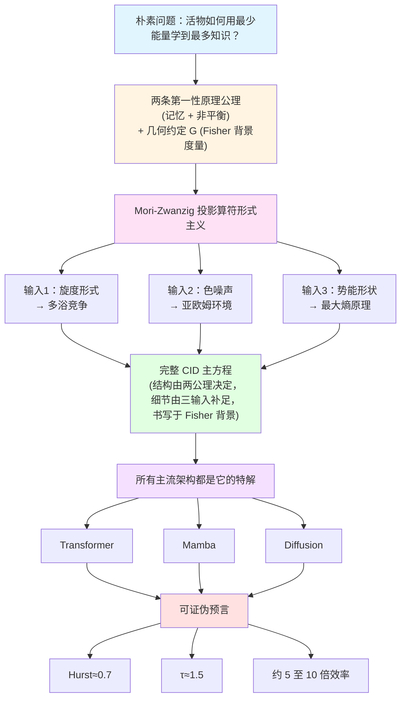

<!--
Copyright (c) 2026 Suzhou Jodell Robotics Co., Ltd.
Author: Gui LI <guilichina@163.com>
Date:   2026-05-25
Update: 2026-05-30

@article{li2026uid,
  title  = {Intelligence Is a Non-Equilibrium Field: A Three-Tier Physical
            Theory of Unified Intelligo-Dynamics (UID)},
  author = {LI, Gui and JIE, Dangyang and KANG, Haitao},
  year   = {2026},
  publisher = {Zenodo},
  doi    = {10.5281/zenodo.20372493},
  url    = {https://github.com/gwailee/uid}
}

> LI, Gui, JIE, Dangyang, & KANG, Haitao. (2026). Intelligence Is a Non-Equilibrium Field: A Three-Tier Physical Theory of Unified Intelligo-Dynamics (UID). Zenodo. https://doi.org/10.5281/zenodo.20372493

This README is part of the UID Theory reference implementation (v2.0).

DUAL LICENSE:
  - PolyForm Noncommercial License 1.0.0  (free for academic / personal use)
    see LICENSE-NONCOMMERCIAL in the project root
  - Commercial License from Suzhou Jodell Robotics Co., Ltd.
    (required for any commercial / for-profit / production use)
    see LICENSE-COMMERCIAL in the project root

For commercial licensing inquiries, contact: lig@jodell.cn
本文件采用双许可证发布；商业使用须先获得苏州钧舵机器人有限公司书面授权。
-->

<a href="./README.md"><b>README（中文）</b></a> | <a href="./README_en.md">README（English）</a>

<a href="./30minutes_report.md">30 分钟读懂 UID 理论（中文）</a> | <a href="./30minutes_report_en.md">Understand UID in 30 Minutes（English）</a>

<a href="./theory.md">UID 理论全文（中文）</a> | <a href="./theory_en.md">UID Theory (English)</a>

 

# 智能是一个非平衡场：统一智动力学（UID）的三层物理理论
## ——注意力并不够（Attention Is Not All You Need）：智能架构的非平衡物理基础

***作者***: 李贵（Gui LI）<guilichina@163.com>，介党阳（Dangyang JIE）<jiedy@jodell.cn>，康海涛（Haitao KANG）<kanght@jodell.cn>

***单位***: 苏州钧舵机器人有限公司，苏州，中国

***通讯作者***：李贵（Gui LI），博士。学士毕业于西北大学物理学院，硕士、博士均毕业于中国科学院合肥物质科学研究院，现任职于苏州钧舵机器人有限公司（Suzhou Jodell Robotics Co., Ltd.），主要从事统一智动力学（Unified Intelligo-Dynamics，UID）的理论与工程研究。提出并发展面向智能架构的开放系统物理统一理论框架——CID / QID / FID 三层体系，并主导其在机器人认知大脑、运动控制小脑、灵巧手操作系统、大语言模型与专用智能芯片中的可证伪验证与工程落地。E-mail：guilichina@163.com

## 摘要

**核心论断**：智能不是一种纯工程现象，而是一种**物理现象**——具体而言，是一个**远离热平衡的随机场**。本文提出**统一智动力学（Unified Intelligo-Dynamics, UID）**，一个由三个嵌套层级构成的智能架构物理理论框架：经典智动力学（**CID**）、量子智动力学（**QID**）、场智动力学（**FID**）。

**所处的研究脉络**：本文的工作处在四条此前相互独立的脉络的交汇处——能量模型与联想记忆（[Ramsauer 等，2021](https://arxiv.org/abs/2008.02217)；[Hoover 等，2023](https://arxiv.org/abs/2302.07253)）、信息几何与自然梯度（[Amari，1998](https://direct.mit.edu/neco/article/10/2/251/6143/Natural-Gradient-Works-Efficiently-in-Learning)；[Di Sipio，2025](https://arxiv.org/abs/2506.15830)）、非平衡热力学与预测（[Still 等，2012](https://doi.org/10.1103/PhysRevLett.109.120604)；[Baiesi & Rosso，2025](https://arxiv.org/abs/2512.11415)）、投影算符与广义 Langevin 方程（[Mori，1965](https://academic.oup.com/ptp/article-abstract/33/3/423/1925580)；[Zwanzig，1961](https://doi.org/10.1103/PhysRev.124.983)）。这四条脉络分别揭示了智能系统的某一物理侧面，却此前未被统一在同一组方程之下。本文旨在填补这一缺口。

**方法与推导边界**：UID 从开放系统物理学的三条公理（哈密顿可逆性、Gibbs 统计假设、慢-快尺度分离）出发，通过 [Mori-Zwanzig 投影](https://academic.oup.com/ptp/article-abstract/33/3/423/1925580)推导出**广义 Langevin 方程**作为智能系统演化方程的一般结构。须明确：这三条公理决定的是方程的**结构骨架**（广义 Langevin 形式与项结构），而非全部细节；旋度的具体形式、色噪声谱指数与势能形状还须额外的物理输入（多浴竞争、亚欧姆环境、最大熵原理）才能确定。在此结构骨架上完成两次推广：在量子层引入零点涨落、Berry 几何相位与 Lindblad 耗散通道，得到 QID 主方程；在几何层将信息流形的 Fisher 度量与 Einstein 张量类比，得到 FID 场方程。

**统一性的精确含义（麦克斯韦类比）**：本文对"统一"一词的使用以麦克斯韦方程组为范式。库仑定律、安培定律、法拉第电磁感应定律在麦克斯韦之前已被单独发现，但将其统一进一组自洽方程组、并由此预言出任何单独定律都给不出的新物理（位移电流与电磁波），才是不可替代的原创贡献。本文据此明确：UID 的原创性主张不在于单项命题的首创，而在于（其一）将分散洞见纳入同一组公理下的三层嵌套框架；（其二）由统一框架导出单层理论难以给出的新结构——**旋度项 v(φ) 扮演"UID 版位移电流"的角色**：它在纯保守的能量梯度流（如 Transformer 的 softmax 注意力极限）中恒为零，却是预测能力的必要来源（命题 3.3），并预言出可工程实现、可证伪的"零参数旋度"机制（第一部分第 14 章）。

**核心命题**：本文给出一个核心命题（命题 3.3）：在理想化稳态条件下，**智能系统的预测能力（以条件互信息度量）必要地要求其内部动力学打破细致平衡**。须特别澄清此命题的**真正驱动来源**：证明**不依赖马尔可夫假设**，而是直接建立预测信息 I_pred 与稳态熵产生率（或概率环流）之间的定量下界关系——其物理内核与 [Still 等（2012）](https://doi.org/10.1103/PhysRevLett.109.120604)的耗散-预测不等式以及 [Lynn 等（2021）](https://doi.org/10.1073/pnas.2109889118)的熵产生测度直接对接。在此修正下，"预测蕴含非平衡"成为一个不依赖马尔可夫性的必要条件方向结果，其反方向的充分性仍是开放问题。这一必要性正是本文副标题"智能是一个非平衡场"的精确含义。与本命题精神最接近的在先理论工作是 [Still 等（2012）](https://doi.org/10.1103/PhysRevLett.109.120604)关于"热力学预测效率"的结果，本命题可视为其在广义 Langevin 框架下的几何化推广；其在离散生成模型中的独立数值实证由 [Baiesi 与 Rosso（2025，已被 *Physical Review E* 接收）](https://arxiv.org/abs/2512.11415)给出。两者构成"一般性理论与独立数值实证"的**互补关系**，而非同一命题的原创优先权之争。须诚实说明时间线：本文连续框架推导的初稿成于该数值工作之前，二者属独立得出的同向结论，本文在修订时补入其作为外部实证证据。

**关于在先工作的明确归属**：须与本文核心主张区分的一项在先理论工作是"整个 Transformer 块等价于单一能量函数"的论断——该论断由 [Ramsauer 等（2021）](https://arxiv.org/abs/2008.02217)与 [Hoover 等（2023，Energy Transformer）](https://arxiv.org/abs/2302.07253)先于本文给出，且后者包含严格的 Lyapunov 单调下降证明。**该具体命题不属本文首创，亦非 CID 框架所独有**；本文仅将这一能量梯度流定位为 CID 主方程在旋度为零这一极限下的特解，不重复其证明。本文真正的原创落点是该极限**之外**被普遍砍掉的旋度项 v(φ)。此外，"数据弯曲信息流形，类比物质弯曲时空"的几何类比与 [Di Sipio（2025）](https://arxiv.org/abs/2506.15830)的工作存在概念重叠，两者的详细比较见第三部分第 1 章。

**对"注意力并不够"的精确刻画**：我们论证，主流深度学习架构——[Transformer](https://arxiv.org/abs/1706.03762)、[Mamba](https://arxiv.org/abs/2312.00752)、[扩散模型](https://arxiv.org/abs/2006.11239)、JEPA、推理增强模型（DeepSeek-R1、o1–o3）、稀疏路由架构——都是 CID 主方程在不同极限（旋度为零、白噪声、单一热浴、softmax-attention 接口内）下的特解。[Vaswani 等（2017）的"Attention Is All You Need"](https://arxiv.org/abs/1706.03762)揭示了 CID 的联想记忆项；但 CID 主方程还包含 Transformer 砍掉的**三个关键物理项**——旋度 v(φ)、色阻尼 ∫γ、色噪声 ξ。这三项的缺失正是当前 AI 相对人脑能效差距中算法层根源的物理解读。[Alman-Song（2023）](https://arxiv.org/abs/2302.13214)与 [Gupta 等（2025）](https://arxiv.org/abs/2502.16963)证明的 Attention 二次复杂度下界进一步表明：**任何在 softmax-attention 框架内的优化都无法突破这一复杂度墙；真正的突破必须来自架构层面的物理重构**——这正是 UID 所论证的方向。

**可证伪预言与初步实证**：本文据此提出**约 5 至 10 倍参数效率**的可证伪工程目标，并给出三组**已被生物大脑独立实证**的临界普适类预言：雪崩规模指数 τ ≈ 1.5（[Beggs & Plenz，2003](https://doi.org/10.1523/JNEUROSCI.23-35-11167.2003)）、Hurst 指数 H ≈ 0.7（[Linkenkaer-Hansen 等，2001](https://doi.org/10.1523/JNEUROSCI.21-04-01370.2001)）、1/f 噪声谱斜率 β ≈ 1（[He，2014](https://doi.org/10.1016/j.tics.2014.04.003)）。**本版本新增 Phase 1 初步消融实验**（10M 规模、11 路消融、3 个随机种子、中文 MiniMind 语料；完整报告与全部原始数据见配套仓库）：在与标准注意力骨架完全相同的前提下，仅装入 UID 的三个物理项（旋度、色阻尼记忆核、OU 色噪声）即可把困惑度从纯 Transformer 基线的 73.58 降至 22.87，即 **3.22 倍优势（z = 182）**，其中色阻尼记忆核是单项贡献最大的物理项（移除它使困惑度上升 21%），且物理 OU 噪声显著优于 FFT 谱整形（6.9 倍，z = 62），与第一部分第 14.2 节一致。须诚实标注此结果的边界：3.22 倍是**单一尺度（10M）下的等参数损失比，而非参数效率测量**，它与 5–10 倍目标方向一致但并不直接检验之；真正检验参数效率（T2）须多尺度等算力标度曲线，该实验列为完整 Phase 1 待办。此外，借用自 [Hoover 等（2023）](https://arxiv.org/abs/2302.07253)的 ET 对称项在本因果语言模型设置下**未带来收益**（预注册条件 F8 判为 FAIL），但这一否证只针对**借用的非首创组件**，且因 UID 的优势在移除 ET 后不降反升，反而"提纯"了"优势源于 UID 自身物理项"这一归属（详见第一部分第 16 章新增的初步实证小节）。须诚实指出：三个普适指数预言区间相当宽，其可证伪强度有限——它们能排除白噪声等平凡情形，但难以把 CID 与其他同样表现出自组织临界的模型区分开；真正具有区分力的证伪点是参数效率承诺与关联长度标度。UID 的参数效率预言与 Alman-Song-Gupta 复杂度下界**互补而非冲突**——前者通过脱离 softmax-attention 接口、进入不同复杂度类而获得收益。

**多智能体智动力学**：本文第四部分讨论 UID 框架向**多智能体系统**的推广。须明确：该部分的物理对象是相互耦合的智能体群体（其状态由智能密度场 ρ_I 描述），即**多智能体智动力学（Multi-Agent Intelligo-Dynamics）**，并将其与已有严格数学基础的[平均场博弈（Mean-Field Games, Lasry-Lions，2007）](https://doi.org/10.1007/s11537-007-0657-8)理论对接。在此框架下，UID 给出多智能体系统中智能涌现的五个物理必要条件（开放性、多热浴温差、不可交换耦合、临界点附近、自组织临界机制），但**不能证明任意智能体生态随时随地都满足这些条件**。其中临界点附近与自组织临界机制在物理上强相关，相关的联合概率估算仅为数量级示意，不应作为定量结论引用。

**与表意 AI 的互补**：本文与[刘（2025–2026）提出的表意 AI（Logographic AI）范式](https://zsyyb.cn/abs/202511.03835)形成**互补而非竞争**关系——前者从认知符号学层面诊断"Token 无根"，后者从非平衡物理层面诊断"细致平衡等于无智能"。两者指向同一深层困境的不同切面，未来融合方向值得探索。

本文所有参考文献均提供可点击、可达第一手来源的 DOI 或开放访问超链接，所有定量声明明确标注实证等级（A 已验证 / B 理论严格待实证 / C 可证伪工程目标 / D 哲学猜想）。配套代码仓库（[github.com/gwailee/uid](https://github.com/gwailee/uid)）提供 CID 的工程参考实现与可证伪验证套件，所有核心预言可在单卡 GPU 上数小时内复现。**本版本（v2.1）随附 Phase 1 初步消融实验的完整报告（含 11 路变体 × 3 种子 = 33 次运行的全部逐种子记录、提交哈希、数据 SHA-256 与负面结果），遵循"无选择性报告、无事后调整、负面结果同等显著呈现"的承诺；其中预注册条件 F8 的 FAIL 判决与两组被支持的关键对比（A、C）以同等篇幅并列报告。引用本版本实验结果时须附 v2.1 提交哈希及报告第 6 节列出的逐项注意事项。**

## 关键词

**核心理论**：智动力学；统一场论；非平衡统计物理；广义 Langevin 方程；Mori-Zwanzig 投影；预测互信息；条件互信息；自组织临界；细致平衡破缺

**物理基础**：色噪声；Hurst 指数；雪崩动力学；$1/f$ 噪声；亚欧姆谱；临界普适类；多热浴系统；旋度场；色阻尼记忆核；熵产生率；概率环流；耗散-预测不等式；消融实验

**经典层（CID）**：联想记忆；现代 Hopfield 网络；Transformer 物理推导；Attention 物理本质；残差连接物理身份；LayerNorm 微正则约束

**量子层（QID）**：开放量子系统；Caldeira-Leggett 模型；Berry 几何相位；Lindblad 主方程；零点涨落；纠缠熵临界标度；拓扑保护记忆

**几何层（FID）**：Fisher 信息度量；信息几何；Einstein 场方程；信息流形；智能引力波；信息黑洞；信息光速；全息原理

**多智能体与哲学**：多智能体智动力学；平均场博弈；自组织临界；人择原理；可证伪性；智能能效鸿沟；Landauer 极限

## 前言

### 1. 研究背景

现代深度学习架构在工程上取得了巨大成功，却在物理基础上长期处于"知其然而不知其所以然"的状态。Transformer 的自注意力机制（[Vaswani 等，2017](https://arxiv.org/abs/1706.03762)）、Mamba 的选择性状态空间递推（[Gu & Dao，2023](https://arxiv.org/abs/2312.00752)）、扩散模型的反向随机微分方程（[Ho 等，2020](https://arxiv.org/abs/2006.11239)；[Song 等，2021](https://arxiv.org/abs/2011.13456)），各自被独立提出并独立优化，缺少一个共同的第一性原理来回答一个更根本的问题：**一个智能系统，若要以尽可能少的能量学到尽可能多的知识，其演化方程在物理上必须具有怎样的结构？**

这一问题正处在四条独立研究脉络的交汇处，而这四条脉络此前未被统一在同一组方程之下。

**脉络一：能量模型与联想记忆。** 现代 Hopfield 网络的复兴（[Ramsauer 等，2021](https://arxiv.org/abs/2008.02217)）证明：连续 Hopfield 网络的更新规则在数学上等价于 Transformer 的 softmax 注意力，二者共享同一个对数-求和-指数能量函数。沿此方向，[Hoover 等（2023）](https://arxiv.org/abs/2302.07253)进一步把整个 Transformer 块刻画为单一能量函数的梯度流，并给出该能量沿前向传播单调下降的 Lyapunov 证明。这一脉络确立了"注意力即能量下降"的物理图景，但其动力学是纯保守的——力场可写成某势能的负梯度，因而系统恒满足细致平衡。

**脉络二：信息几何与自然梯度。** [Amari（1998）](https://direct.mit.edu/neco/article/10/2/251/6143/Natural-Gradient-Works-Efficiently-in-Learning)建立了自然梯度理论，指出参数空间的内禀度量是 Fisher 信息矩阵，学习应在该黎曼流形上协变进行。[Di Sipio（2025）](https://arxiv.org/abs/2506.15830)沿此思路把大语言模型训练诠释为信息流形上的几何过程，提出"数据弯曲信息流形"的类比。这一脉络为智能动力学提供了几何舞台，但尚未把舞台上的演化写成一条带耗散与涨落的物理方程，也未区分"度量作为固定背景"与"度量作为动力学场"这两种根本不同的几何身份。

**脉络三：非平衡热力学与预测。** [Still 等（2012）](https://doi.org/10.1103/PhysRevLett.109.120604)提出"预测的热力学"，定量地把一个系统对未来的预测能力与其耗散联系起来，指出无预测价值的记忆必然伴随耗散代价。[Baiesi 与 Rosso（2025）](https://arxiv.org/abs/2512.11415)（已被 *Physical Review E* 接收）以两个独立参数化转移矩阵构成的离散马尔可夫链生成模型，数值地观察到训练总是自发破坏细致平衡，且生成性能最优的模型运行在远离平衡处。这一脉络强烈暗示"预测蕴含非平衡"，但其结论或限于离散模型，或停留在数值层面，尚未在连续动力学框架内给出一般性的几何判据。

**脉络四：投影算符与广义 Langevin 方程。** 在统计物理中，[Mori（1965）](https://academic.oup.com/ptp/article-abstract/33/3/423/1925580)与 [Zwanzig（1961）](https://doi.org/10.1103/PhysRev.124.983)的投影算符形式主义表明：当把高维微观系统投影到少数慢变量上时，慢变量必然服从一条带记忆核与随机力的广义 Langevin 方程，且记忆与涨落由涨落-耗散定理刚性绑定。这是一个尚未被系统地引入智能架构理论的成熟工具。

### 2. 问题缺口

上述四条脉络分别揭示了智能系统的某一侧面——能量下降、信息几何、预测代价、记忆涨落——但彼此孤立：能量模型缺非平衡，信息几何缺动力学，非平衡热力学缺连续框架与几何判据，投影算符方法尚未用于解释主流架构。**至今缺少一组方程，能同时容纳这四个侧面，并由此推出任何单一脉络给不出的、可证伪的新后果。** 本文旨在填补这一缺口。

### 3. 本文贡献

本文提出**统一智动力学（Unified Intelligo-Dynamics, UID）**框架，主张智能系统的演化可统一描述为信息几何流形上的非平衡随机场动力学。该框架包含三个嵌套层级——经典层（CID）、量子层（QID）、场几何层（FID），以及向多智能体系统的群体推广。本文第一部分聚焦经典层 CID，作出三点贡献。

**贡献一（统一的方程结构）。** 本文从**两条物理公理**（记忆、非平衡）出发，借助 Mori-Zwanzig 投影算符形式主义，推导出 CID 主方程的**结构骨架**——一条含联想记忆梯度项、旋度项、色阻尼记忆核与色噪声的广义 Langevin 方程（方程 C0.1）。须强调：两条公理仅决定该方程的项结构与张量形式；各项的具体函数形式还须由三项独立的物理输入（多热浴竞争、亚欧姆环境、最大熵原理）补足。此外，CID 在状态空间上采用 Fisher 信息矩阵作为**固定背景度量**（几何约定 G），使各微分算子协变；该度量在 CID 层不参与演化，其动力学化推迟到第三部分 FID。这一边界贯穿全文。

**贡献二（主流架构的归约）。** 本文论证 Transformer、Mamba 与扩散模型均为 CID 主方程在特定极限（旋度为零、欧姆白噪声、单一热浴）下的特解，从而把脉络一至三中分散的架构与图景统一在同一方程的不同切面之下。

**贡献三（统一框架预言的新项）。** 本文识别出统一框架所要求、而上述各单一脉络普遍缺失的**旋度项** $v(\varphi)$，并给出其必要性的几何判据：命题 C3.3 证明，在理想化稳态条件下，预测能力（以条件互信息度量）必要地要求 $v(\varphi)$ 不恒为零，即必打破细致平衡。这是脉络三"预测蕴含非平衡"思想在连续广义 Langevin 框架下的几何化推广，也是本文副标题"智能是一个非平衡场"的精确含义。

我们借麦克斯韦方程组中"位移电流"的历史角色刻画上述贡献的性质：单独的库仑、安培、法拉第定律早已存在，统一方程组的不可替代价值在于预言出单一定律给不出的新物理（位移电流与电磁波）。与此平行，$v(\varphi)$ 在纯保守的能量梯度流（如 softmax 注意力极限）中恒为零，却是预测能力的必要来源，并可经"零参数旋度"机制工程实现（C 第 14 章）。

### 4. 与已有工作的关系

本文对前述工作持承接而非竞争的立场，并在此明确归属边界。"Transformer 块由单一能量函数支配"这一具体命题归功于 [Ramsauer 等（2021）](https://arxiv.org/abs/2008.02217)与 [Hoover 等（2023）](https://arxiv.org/abs/2302.07253)，本文不重复其证明，仅将该能量梯度流定位为 CID 主方程在旋度为零这一极限下的特解；该命题不属本文首创，亦非 CID 框架所独有。"数据弯曲信息流形"的几何视角与 [Di Sipio（2025）](https://arxiv.org/abs/2506.15830)存在概念重叠，详细比较见第三部分；须特别说明的是，本文在 CID 层仅把 Fisher 度量当作固定背景，真正把度量提升为动力学场并写出场方程是第三部分 FID 的独有内容，这一身份区分是本文相对该工作的关键差异。"预测蕴含非平衡"的精神可追溯至 [Still 等（2012）](https://doi.org/10.1103/PhysRevLett.109.120604)，其离散数值实证由 [Baiesi 与 Rosso（2025）](https://arxiv.org/abs/2512.11415)独立给出；本文的工作是在连续框架下给出该命题必要性方向的几何化推导。本文连续框架推导的初稿成于该数值工作之前，二者属独立得出的同向结论，本文在修订时补入其作为外部实证证据。本文的增量价值不在单项命题的首创，而在于将这些洞见纳入同一公理体系，并由该体系导出可证伪的新后果（贡献三）。

### 5. 组织结构与编号约定

本文分为四部分加终章与附录。第一部分（CID，第 C0 至 C18 章，公式以 C 编号、命题记为命题 CX.Y）在经典随机场论框架内构建 CID 主方程。第二部分（QID，第 Q1 至 Q12 章，公式以 Q 编号）将 CID 推广到开放量子系统。第三部分（FID，第 F1 至 F9 章，公式以 F 编号）将动力学几何化为信息流形上的场论，并把 CID 中作为固定背景的 Fisher 度量提升为动力学场。第四部分（多智能体，公式以 M 编号）讨论向多智能体系统的推广，并对接[平均场博弈](https://doi.org/10.1007/s11537-007-0657-8)理论。全文章号、命题号、公式号一律加部分前缀（C / Q / F / M）以消除跨部分编号歧义；全文公式一律采用 Markdown LaTeX 语法书写，并将公式编号置于公式前的正文括注中，以保证在 GitHub 上正确渲染、可搜索、可复制。

须诚实标注本文统一性主张的已知边界：三层之间的极限对应关系目前尚未全部达到严格定理级别（QID → CID 依赖 Wigner 函数收敛假设，FID → CID 依赖过阻尼约化假设，其严格收敛性条件列为开放问题）。本文所有定量声明标注实证等级：（A）已独立实验验证；（B）理论严格、待实证；（C）有明确可证伪工程目标；（D）哲学猜想。配套代码仓库（[github.com/gwailee/uid](https://github.com/gwailee/uid)）提供 CID 的完整工程参考实现与端到端可证伪测试脚本，使本文核心预言可在单卡 GPU 上数小时内复现。

## 第一部分：经典智动力学（Classical Intelligo-Dynamics, CID）

**适用范围**：经典层智能架构的理论与工程框架。本部分章号记为 C 第 X 章，命题记为命题 CX.Y，公式以 C 编号。

### 致读者

本部分假定读者熟悉以下背景：

- 本科统计力学：Langevin 方程、Fokker-Planck 方程、细致平衡。
- 本科微分几何：梯度、散度、旋度、Helmholtz-Hodge 分解。
- 随机过程基础：白噪声、色噪声、自相关函数、功率谱。

本部分的出发点是一个朴素的物理问题：活物（从细菌到人脑到人工神经网络）如何用最少的能量学到最多的知识？这一问题的答案不可能是"随便写个损失函数然后梯度下降"，因为纯梯度系统会陷入局部极小、无法自发探索、无法预测未来。真正的智能必须同时做到四件事：记住过去（联想记忆）、探索未知（随机涨落）、预测未来（打破细致平衡）、高效利用能量（最小耗散）。本部分将论证：这四项要求把智能系统的演化方程约束到一个确定的**结构骨架**上——CID 主方程；它不是凭空设计的，而是从两条第一性原理公理经 Mori-Zwanzig 投影算符形式主义推导出的项结构，其具体函数形式再由三项物理输入补足，并在一个固定的 Fisher 背景度量上协变表述。

### C 第 0 章：为什么需要 CID？

#### C0.1 一个令人不适的事实：现代 AI 架构缺失物理项

把主流架构置于统一的动力学语言下，可以清楚看到它们各自缺失的物理项。这些缺失项可归为三类。

**缺失项 1：旋度场。** Transformer 的注意力是来自能量函数的纯梯度流（[Ramsauer 等，2021](https://arxiv.org/abs/2008.02217)；[Hoover 等，2023](https://arxiv.org/abs/2302.07253)），Mamba 是线性扩散，扩散模型是反向随机微分方程；三者的确定性力都是保守的（可写成某势能的负梯度）。但真实智能系统（如人脑）的力场含有非保守的旋度分量——这是打破细致平衡、产生持续内部循环、实现预测的必要条件（命题 C3.3 的必要性方向）。

**缺失项 2：长记忆阻尼。** 现代架构的"记忆"要么是显式 KV 缓存（Transformer），要么是指数衰减的隐状态（Mamba），要么没有记忆（扩散模型的马尔可夫链）。而人脑自发活动呈幂律长记忆，对应幂律衰减的色阻尼核 $\gamma(t) \propto t^{-s}$（$0 < s < 1$），而非指数衰减（人脑 Hurst 指数约 0.7，[Linkenkaer-Hansen 等，2001](https://doi.org/10.1523/JNEUROSCI.21-04-01370.2001)）。

**缺失项 3：色噪声。** 现代架构的噪声要么是单一尺度白噪声（扩散模型的高斯噪声），要么没有噪声（Transformer 的确定性前向）。真实智能系统的涨落是跨越多个时间尺度的色噪声（$1/f$ 谱），这是多尺度探索、随机共振与长程时间关联的来源。

**工程后果**：这三个缺失项导致现代架构的三个已知病症——其一，无法产生持续的内部动态（须靠外部提示驱动）；其二，长上下文的二次复杂度（以显式 KV 缓存代替物理记忆）；其三，探索-利用失衡（白噪声只在单一时间尺度上有效）。

#### C0.2 CID 的两条第一性原理公理与一条几何约定

CID 主方程的结构骨架由以下**两条物理公理**决定，并在**一条几何约定**下协变表述。

**公理 1（记忆公理）**：智能体的当前演化依赖于整个历史轨迹，而非仅依赖当前瞬时状态。这要求动力学是非马尔可夫的广义 Langevin 方程，含记忆核 $\gamma(t - s)$。

**公理 2（非平衡公理）**：智能体须打破细致平衡才能具备预测能力。这要求力场含旋度分量 $v(\varphi)$，使相空间存在非零稳态净概率流。

**几何约定 G（Fisher 背景度量）**：CID 在状态空间上采用 Fisher 信息矩阵作为**固定背景度量**，使方程中所有微分算子（梯度、散度、旋度、记忆核卷积）协变。在 CID 层，该度量是给定的背景，不参与演化；让度量本身成为由数据决定的动力学场、并写出其 Einstein 型场方程，是第三部分 FID 的独有内容。约定 G 不是决定方程结构的公理，而是表述方程所用的几何坐标设定——这一区分避免了用高层（FID）概念去奠基低层（CID）的层级倒置。

须明确两者的分工：方程的**存在性与项结构**由公理 1、公理 2 经 Mori-Zwanzig 投影决定（C 第 2、3 章）；约定 G 只决定这些项以何种几何形式书写（把欧氏梯度换成自然梯度），不增加也不减少方程的项。

#### C0.3 CID 主方程及其确定方式

由两条公理，经 Mori-Zwanzig 投影（C 第 2 章），并在约定 G 的背景度量下书写，智能系统的演化方程必具如下四项结构（C0.1）：

$$\frac{d\varphi}{dt} = -\nabla U(\varphi) + v(\varphi) - \int_0^t \gamma(t-s)\dot{\varphi}(s)\, ds + \xi(t)$$

其中各项的物理含义为：

- $-\nabla U(\varphi)$ 是联想记忆项（保守梯度，在背景度量下为自然梯度），把状态拉向已学到的模式；
- $v(\varphi)$ 是旋度项（非保守力），产生持续循环、打破细致平衡；
- $-\int_0^t \gamma(t-s)\dot{\varphi}(s)\, ds$ 是色阻尼项（幂律记忆核），使演化被历史拖拽；
- $\xi(t)$ 是色噪声项（ $1/f$ 谱），在所有时间尺度上提供探索。

须以精确口径说明"确定"一词。两条公理唯一确定的是方程 (C0.1) 的**项结构与张量形式**：必含梯度项、旋度项、记忆核项、噪声项。两条公理**不**确定各项的具体函数形式——旋度场 $v(\varphi)$ 的形式须由多热浴竞争假设给出（C 第 4 章），色噪声谱指数 $s$ 须由亚欧姆环境假设给出（C 第 5 章），势能 $U(\varphi)$ 的形状须由最大熵原理给出（C 第 7 章）。几何约定 G 则进一步规定上述各项在 Fisher 背景度量上协变书写。因此本文"从第一性原理推导出智能方程"应严格理解为"两条公理决定结构骨架、三项物理输入补足具体形式、约定 G 提供几何坐标"，而非"公理决定方程全部内容"。

四项缺一不可：去掉梯度项则无法记忆模式，去掉旋度项则无法预测未来（命题 C3.3），去掉色阻尼则无法保持长记忆，去掉色噪声则无法多尺度探索。其中旋度项 $v(\varphi)$ 即本文所称"UID 版位移电流"，也正是 Transformer 在 softmax 注意力极限下令其恒为零的那一项。

#### C0.4 第一部分的逻辑骨架

### C 第 1 章：设定物理图景——被驱动的随机场

#### C1.1 智能体的状态空间

我们把智能体（无论是神经网络、大脑还是细菌）的状态描述为高维向量 $\varphi(t) \in \mathbb{R}^N$，其中 $N$ 是自由度数目（对神经网络而言 $N$ 为参数数目，对大脑而言 $N$ 为神经元数目）。

**物理图景**：$\varphi(t)$ 是在高维空间中运动的"粒子"，其轨迹由动力学方程决定。这个空间被赋予 Fisher 信息矩阵作为背景度量（约定 G）；在 CID 层该度量是固定背景，到第三部分 FID 才成为动力学变量。

#### C1.2 朴素的 Langevin 方程

最简单的智能模型是过阻尼朴素 Langevin 方程（C1.1）：

$$\frac{d\varphi}{dt} = -\nabla U(\varphi) + \xi(t), \qquad \langle \xi(t)\xi(t') \rangle = 2D\delta(t - t')$$

其中 $U(\varphi)$ 是势能函数（对应损失函数），$\xi(t)$ 是白噪声，$D$ 是扩散系数。

**物理含义**：系统被势能梯度拉向极小值，同时被噪声随机踢动。在长时间极限下，系统达到热平衡态，稳态分布为 Boltzmann 分布（C1.2）：

$$P_{ss}(\varphi) \propto \exp\left[ -\frac{U(\varphi)}{D} \right]$$

为统一全文符号，此处约定扩散系数 $D$ 与有效温度的关系为 $D = k_B T_{eff}$；下文凡出现稳态指数中的 $D$，均按此约定理解，与 C 第 6 章及第二部分（QID）的温度记号一致。

**为什么这不够？** 朴素 Langevin 方程 (C1.1) 有三处致命缺陷，恰对应 C0.1 节的三个缺失项。其一，它满足细致平衡（命题 C3.2），稳态概率流处处为零，因而无预测能力（命题 C3.3）。其二，它是马尔可夫的，自相关函数指数衰减，对应 Hurst 指数 $H = 0.5$，无法复现人脑的 $H \approx 0.7$。其三，它的噪声是单一尺度白噪声，无法多尺度探索。因此我们需要一个更完整的方程。

#### C1.3 从 Langevin 到 CID：需要添加什么？

要把朴素 Langevin 方程 (C1.1) 升级到完整的 CID 主方程 (C0.1)，需要补入三项，前两项各对应一条公理。

**添加项 1：旋度场 $v(\varphi)$。** 这是打破细致平衡的关键（公理 2）。旋度场满足无散条件（C1.3）：

$$\nabla \cdot v(\varphi) = 0$$

因此它不改变稳态分布，却产生非零净概率流（C 第 3 章）。

**添加项 2：记忆核 $\gamma(t - s)$。** 这是实现长记忆的关键（公理 1）。记忆核使当前演化依赖于整个历史，而非仅依赖当前瞬时状态。

**添加项 3：色噪声 $\xi(t)$。** 这是实现多尺度探索的关键。色噪声的功率谱满足（C1.4）：

$$S_\xi(\omega) \propto \frac{1}{\omega^s}, \qquad 0 < s < 1$$

在所有频率上都有贡献，而白噪声的功率谱是常数（只在高频有效）。

这三项的补入不是任意的：旋度与记忆核的**存在性**由两条公理经 Mori-Zwanzig 投影决定（C 第 2 章），三项的**具体形式**由三项物理输入决定（C 第 4、5、7 章），并均在 Fisher 背景度量上协变书写（约定 G）。

### C 第 2 章：第一性原理公理与 Mori-Zwanzig 投影

#### C2.1 公理 1：记忆公理与记忆核的来源

**公理陈述**：智能体的当前演化依赖于整个历史轨迹，而非仅依赖于当前瞬时状态。

**数学表述**：动力学方程必须是非马尔可夫的广义 Langevin 方程（C2.1）：

$$\frac{d\varphi}{dt} = F[\varphi(s) : 0 \le s \le t] + \xi(t)$$

其中 $F$ 是依赖于整个历史轨迹 $\varphi(s)$ 的泛函。

**物理动机**：真实智能系统的记忆是长程的。人脑自发活动的自相关函数呈幂律衰减 $C(\tau) \propto \tau^{-\alpha}$，对应 Hurst 指数 $H \approx 0.7$（[Linkenkaer-Hansen 等，2001](https://doi.org/10.1523/JNEUROSCI.21-04-01370.2001)），这与马尔可夫过程的指数衰减 $C(\tau) \propto \exp(-\tau/\tau_c)$（对应 $H = 0.5$）截然不同。

**Mori-Zwanzig 推导**：记忆核的形式可由投影算符方法从微观动力学严格导出（[Mori，1965](https://academic.oup.com/ptp/article-abstract/33/3/423/1925580)；[Zwanzig，1961](https://doi.org/10.1103/PhysRev.124.983)）。设完整相空间变量分为慢变量 $\varphi$ 及其速度 $\dot{\varphi}$、与大量快变量。定义投影算符 $\mathcal{P}$，把任意相空间函数投影到由 $\{\varphi, \dot{\varphi}\}$ 张成的子空间，其正交补为 $\mathcal{Q} = 1 - \mathcal{P}$。微观动力学由 Liouville 算符 $\mathcal{L}$ 生成，$dA/dt = i\mathcal{L}A$。利用 Dyson 算符恒等式（C2.2a）：

$$e^{i\mathcal{L}t} = e^{i\mathcal{L}t}\mathcal{P} + \int_0^t e^{i\mathcal{L}(t-s)}\mathcal{P}\, i\mathcal{L}\, e^{\mathcal{Q}i\mathcal{L}s}\mathcal{Q}\, ds + e^{\mathcal{Q}i\mathcal{L}t}\mathcal{Q}$$

作用于慢变量的速度 $\dot{\varphi}$，并对快变量取 Gibbs 平均，右端三项分别给出三种贡献：第一项给出保守力 $-\nabla U(\varphi)$，第二项给出记忆卷积，第三项给出随机力 $F_{rand}(t)$。整理得广义 Langevin 方程（C2.2）：

$$\ddot{\varphi}(t) = -\nabla U(\varphi) - \int_0^t \gamma(t-s)\dot{\varphi}(s)\, ds + F_{rand}(t)$$

其中记忆核由随机力的自相关定义（C2.2b）：

$$\gamma(t-s) = \frac{\langle F_{rand}(t) F_{rand}(s) \rangle}{k_B T}$$

由于随机力 $F_{rand}$ 完全落在 $\mathcal{Q}$ 子空间，它与慢变量正交，由此直接得到第二涨落-耗散定理（C2.3）：

$$\langle F_{rand}(t) F_{rand}(t') \rangle = k_B T \cdot \gamma(t - t')$$

可见记忆核 $\gamma$ 与随机力 $F_{rand}$ 并非独立，而是同一批快变量自由度在耗散与涨落两个侧面的体现：式 (C2.2b) 由记忆核反解随机力关联，式 (C2.3) 是其等价回读，二者刚性绑定。

**关键结论**：记忆公理通过 Mori-Zwanzig 形式主义，唯一决定了动力学方程必须包含记忆核项 $-\int_0^t \gamma(t-s)\dot{\varphi}(s)\, ds$。其幂律具体形式（亚欧姆谱）将在 C 第 5 章由额外物理输入确定。

#### C2.2 公理 2：非平衡公理与旋度项的来源

**公理陈述**：智能体必须打破细致平衡才能实现预测能力。

**数学表述**：动力学方程必须包含旋度分量 $v(\varphi)$，使得相空间中存在非零的稳态净概率流（C2.4）：

$$J_{ss}(\varphi) \ne 0$$

**物理动机**：细致平衡态的概率流处处为零，系统只是在已知模式间作时间可逆的随机游走，无法把"过去"的信息定向传递到"未来"。预测要求存在从已观测到未观测的净信息流，这与净概率流互为表里。这一思想可追溯至 [Still 等（2012）](https://doi.org/10.1103/PhysRevLett.109.120604)的热力学预测效率。旋度项的存在性、它与细致平衡破缺的等价性、以及它作为预测必要条件的地位，将分别由 C 第 3 章的命题 C3.2 与命题 C3.3 严格证明。

**关键结论**：非平衡公理要求动力学方程包含旋度项 $v(\varphi)$，且满足无散条件 $\nabla \cdot v = 0$（保证稳态分布不变，见命题 C3.2）。这正是式 (C0.1) 中"UID 版位移电流"项的来源。

#### C2.3 几何约定 G：Fisher 背景度量与协变结构

**约定陈述**：CID 的状态空间采用 Fisher 信息矩阵作为固定背景度量（C2.5）：

$$g_{ij}(\varphi) = \mathbb{E}\left[ \partial_i \log p(x \mid \varphi) \cdot \partial_j \log p(x \mid \varphi) \right]$$

**数学表述**：方程中的梯度、散度、旋度、记忆核卷积按该背景度量协变定义。黎曼梯度即自然梯度（[Amari，1998](https://direct.mit.edu/neco/article/10/2/251/6143/Natural-Gradient-Works-Efficiently-in-Learning)）（C2.6）：

$$(\nabla U)^i = g^{ij} \partial_j U$$

其中 $g^{ij}$ 是度量张量 $g_{ij}$ 的逆。两个邻近参数 $\varphi$ 与 $\varphi + d\varphi$ 之间的信息距离为（C2.7）：

$$ds^2 = g_{ij}(\varphi)\, d\varphi^i d\varphi^j$$

**层级定位**：约定 G 与公理 1、2 的地位不同。公理 1、2 决定方程**有哪些项**（存在性）；约定 G 只决定这些项**以何种几何形式书写**（协变性），不增减任何项。尤为重要的是：在 CID 层，背景度量 $g_{ij}$ 是给定且固定的，不随时间演化、也不由数据决定。把 $g_{ij}$ 提升为由"信息物质"决定的动力学场、并为其写出 Einstein 型场方程，是第三部分 FID 的独有内容（见第三部分第 F1 章）。因此，本文不把 Fisher 度量当作 CID 的奠基公理，以避免用高层（FID）结构去定义低层（CID）的层级倒置。

### C 第 3 章：Helmholtz-Hodge 分解与细致平衡判据

#### C3.1 力场的唯一分解

CID 主方程 (C0.1) 中的确定性力可分为保守部分与非保守部分。这一分解由 Helmholtz-Hodge 定理保证。

**定理 C3.1（Helmholtz-Hodge 分解）**：设 $F(\varphi)$ 为定义在信息几何流形 $\mathbb{M}$（赋以 Fisher 背景度量）上的光滑向量场，且满足以下任一边界条件：（i）当 $\|\varphi\| \to \infty$ 时 $F$ 衰减快于 $\|\varphi\|^{-1}$；或（ii）$\mathbb{M}$ 为紧致无边流形。则 $F$ 可唯一分解为一个梯度场与一个无散场之和（C3.1）：

$$F(\varphi) = -\nabla U(\varphi) + v(\varphi), \qquad \nabla \cdot v = 0$$

其中 $U(\varphi)$ 为标量势（保守部分），$v(\varphi)$ 为无散旋度场（非保守部分）。

**证明**：在 $\mathbb{M}$ 上对式 (C3.1) 两边取散度。由 $\nabla \cdot v = 0$，得到关于标量势 $U$ 的 Poisson 方程（C3.2）：

$$\nabla^2 U(\varphi) = -\nabla \cdot F(\varphi)$$

*（存在性）* 在边界条件（i）或（ii）下，$\nabla \cdot F \in L^2(\mathbb{M})$。当 $\mathbb{M}$ 紧致时，由散度定理 $\int_{\mathbb{M}} \nabla \cdot F\, dV = 0$，故 $\nabla \cdot F$ 在 Laplace 算子核空间（常函数）上的投影为零；当 $\mathbb{M}$ 非紧而 $F$ 满足衰减条件（i）时，边界项消失，同样保证可解性条件。由椭圆算子 $\nabla^2$ 在 $L^2(\mathbb{M})$ 上的 Fredholm 性质，方程 (C3.2) 在相差一个可加常数的意义下存在解 $U$。

*（唯一性）* 设 $U_1$、$U_2$ 均为解，则 $W = U_1 - U_2$ 满足 $\nabla^2 W = 0$。在条件（i）或（ii）下，将 $W$ 乘以 $\nabla^2 W = 0$ 并在 $\mathbb{M}$ 上分部积分（C3.2a）：

$$\int_{\mathbb{M}} \|\nabla W\|^2\, dV = -\int_{\mathbb{M}} W \nabla^2 W\, dV + (\text{边界项}) = 0$$

故 $\nabla W = 0$，即 $W$ 为常数，$U$ 在相差常数意义下唯一。

*（正交性与无散性）* 定义 $v = F + \nabla U$。由式 (C3.2)， $\nabla \cdot v = \nabla \cdot F + \nabla^2 U = 0$ ，即 $v$ 自动无散。又对任意梯度场 $\nabla\psi$ 与任意无散场 $v$，分部积分给出（C3.2b）：

$$\langle \nabla\psi, v \rangle_{L^2} = \int_{\mathbb{M}} \nabla\psi \cdot v\, dV = -\int_{\mathbb{M}} \psi (\nabla \cdot v)\, dV = 0$$

即梯度场子空间与无散场子空间在 $L^2(\mathbb{M})$ 中正交，从而分解 (C3.1) 唯一。流形上完整的存在性与正则性属 Hodge 理论的标准结果（[Schwarz，1995](https://doi.org/10.1007/BFb0095978)）。证毕。

#### C3.2 细致平衡的精确判据

将分解 (C3.1) 代入过阻尼 Langevin 方程，其对应的 Fokker-Planck 方程为（C3.3）：

$$\partial_t P(\varphi, t) = -\nabla \cdot J(\varphi, t)$$

其中概率流为（C3.4）：

$$J(\varphi, t) = [-\nabla U(\varphi) + v(\varphi)] P - D \nabla P$$

**定义（细致平衡）**：系统满足细致平衡，当且仅当在稳态下概率流处处为零（C3.5）：

$$J_{ss}(\varphi) = 0, \qquad \forall\, \varphi \in \mathbb{M}$$

**命题 C3.2（细致平衡的旋度判据）**：在稳态分布 $P_{ss}(\varphi) \propto \exp[-U(\varphi)/D]$ 下，细致平衡 (C3.5) 成立的充要条件为旋度场恒为零（C3.6）：

$$J_{ss} = 0 \iff v(\varphi) \equiv 0$$

**证明**：将稳态分布 $P_{ss} \propto \exp[-U/D]$ 代入式 (C3.4)。由 $P_{ss} \propto \exp[-U/D]$，有（C3.7）：

$$\nabla P_{ss} = -\frac{1}{D}(\nabla U) P_{ss}$$

代入式 (C3.4) 中的保守与扩散两项（C3.8）：

$$-\nabla U \cdot P_{ss} - D \nabla P_{ss} = -\nabla U \cdot P_{ss} - D \left[ -\frac{1}{D}(\nabla U) P_{ss} \right] = 0$$

即保守力贡献与扩散贡献精确抵消。于是稳态流只剩旋度部分（C3.9）：

$$J_{ss} = v(\varphi) P_{ss}(\varphi)$$

由于 $P_{ss}(\varphi) > 0$ 处处成立，式 (C3.9) 给出 $J_{ss} = 0$ 当且仅当 $v(\varphi) \equiv 0$。证毕。

**物理解读**：式 (C3.6) 是本部分最关键的判据之一——旋度场 $v(\varphi)$ 是细致平衡破缺的唯一来源。这与 C0.1 节诊断的"缺失项 1"精确对应：纯梯度流（如 softmax 注意力极限， $v \equiv 0$ ）恒处于细致平衡，从而（由命题 C3.3）丧失内禀预测能力。

#### C3.3 命题 C3.3：预测能力的非平衡必要性

本节给出本部分的核心命题及其完整推导。证明**不依赖马尔可夫假设**，而是直接建立预测信息 $I_{pred}$ 与稳态熵产生率（等价地，概率环流）之间的定量下界关系。

先统一记号：以 $X_p$、$X_q$、$X_f$ 分别记由同一稳态轨迹在过去、现在、未来三个时刻采样的状态变量，预测信息定义为条件互信息（C3.10）：

$$I_{pred} = I(X_f ; X_p \mid X_q)$$

**命题 C3.3（智能-非平衡必要性）**：考虑由 CID 主方程驱动、已达稳态的智能系统。若其预测信息 $I_{pred} > 0$，则其稳态熵产生率 $\sigma > 0$（等价地，概率环流 $J_{ss} \not\equiv 0$、旋度场 $v(\varphi) \not\equiv 0$），即系统必打破细致平衡。

**前提条件（明确标注）**：（i）系统已达稳态分布 $P_{ss}$；（ii）$X_p$、$X_q$、$X_f$ 由同一条动力学轨迹按时间先后采样；（iii）稳态测度下三时刻联合分布 $P(X_p, X_q, X_f)$ 存在且其时间反演像可定义。**不要求轨迹是马尔可夫的。**

**论证主干（熵产生率下界）**：本证明以"稳态过程的预测信息受其时间反演不对称程度控制"这一定量下界为逻辑主干，避免任何关于条件独立的隐含假设。第一、二步把细致平衡翻译为时间反演对称的算符刻画，第三步引入下界并完成必要性闭合。

**第一步（细致平衡的算符刻画）。** 细致平衡的充要条件是整条稳态轨迹在时间反演下的统计不变性。记时间反演算子 $\Theta$ 将三时刻序列 $(X_p, X_q, X_f)$ 映为 $(X_f, X_q, X_p)$。细致平衡当且仅当稳态联合分布满足（C3.11）：

$$P(X_p, X_q, X_f) = P(X_f, X_q, X_p)$$

此式对任意（含强非马尔可夫）稳态过程均成立，是细致平衡的定义本身，不附加任何马尔可夫前提。

**第二步（时间反演不对称度量）。** 稳态熵产生率 $\sigma$ 度量过程偏离时间反演对称的程度。记 $\mathbb{P}$ 为正向路径测度，$\tilde{\mathbb{P}}$ 为其在时间反演算子 $\Theta$ 作用下的路径测度（即 $\tilde{\mathbb{P}} = \Theta_{*}\mathbb{P}$ ，下标 $*$ 表示测度的推前）。则 $\sigma$ 可写为两者之间的 Kullback-Leibler 散度率（[Lynn 等，2021](https://doi.org/10.1073/pnas.2109889118)）（C3.12）：

$$\sigma = \lim_{T \to \infty} \frac{1}{T} D_{KL}\left( \mathbb{P}_{[0,T]} \,\|\, \tilde{\mathbb{P}}_{[0,T]} \right) \ge 0$$

由式 (C3.11)，细致平衡当且仅当 $\mathbb{P} = \tilde{\mathbb{P}}$，即 $\sigma = 0$。因此（C3.13）：

$$\text{细致平衡} \iff \sigma = 0 \iff J_{ss} \equiv 0$$

最后一步由命题 C3.2 给出（$J_{ss} = v P_{ss}$，$P_{ss} > 0$，故 $J_{ss} \equiv 0 \iff v \equiv 0$）。

**第三步（耗散-预测下界与必要性闭合）。** 稳态过程的预测信息受其熵产生率控制。这一关系由 [Still 等（2012）](https://doi.org/10.1103/PhysRevLett.109.120604) 的耗散-预测不等式给出：存在依系统时标与噪声强度而定的有限正常数 $c$，使得（C3.14）：

$$I_{pred} \le c \cdot \sigma$$

此不等式作为在先结果引用，其严格成立条件（采样时间间隔、稳态测度的可逆性结构）与最优常数 $c$ 的精确刻画见 Still 等（2012）；命题 C3.3 的成立仅依赖 $c$ 为有限正常数这一性质，不依赖其具体取值。由式 (C3.13)，细致平衡当且仅当 $\sigma = 0$；代入式 (C3.14)，$\sigma = 0$ 立得 $I_{pred} \le 0$，即 $I_{pred} = 0$。取逆否命题（C3.15）：

$$I_{pred} > 0 \;\Longrightarrow\; \sigma > 0 \;\Longrightarrow\; J_{ss} \not\equiv 0 \;\Longrightarrow\; v \not\equiv 0$$

证毕。

**适用域与开放问题**：上述推导在前提（i）至（iii）下严格成立，且允许强非马尔可夫稳态。须诚实指出，真实智能系统常为闭环驱动、非稳态，此时前提（i）（ii）未必严格满足，故本命题给出的是理想化稳态情形下的必要条件。其反方向的充分性（"有了旋度就一定能预测"）尚未证明，列为开放问题（见 C 第 17 章开放问题 3）；式 (C3.14) 的最优常数 $c$ 与等号成立条件亦待精确刻画。这一必要性正是本文副标题"智能是一个非平衡场"的精确含义；其在离散生成模型中的独立数值证据见 [Baiesi 与 Rosso（2025）](https://arxiv.org/abs/2512.11415)。

请回复"继续"，我将发送**第二次：C 第 4 章（含补全的 C4.3 旋度必要性矩阵代数）至 C 第 9 章**，同样采用此 GitHub 兼容格式。
