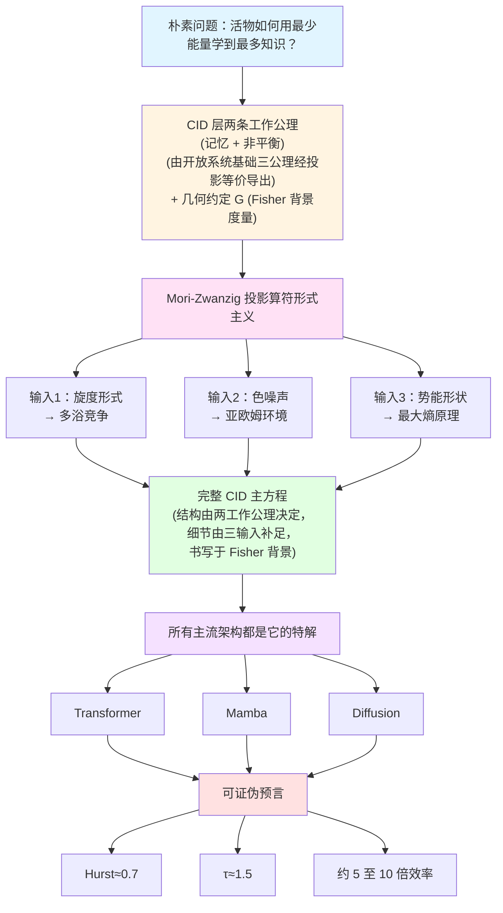

<!--
Copyright (c) 2026 Suzhou Jodell Robotics Co., Ltd.
Author: Gui LI <guilichina@163.com>
Date:   2026-05-25
Update: 2026-05-30

@article{li2026uid,
  title  = {Intelligence Is a Non-Equilibrium Field: A Three-Tier Physical
            Theory of Unified Intelligo-Dynamics (UID)},
  author = {LI, Gui and JIE, Dangyang and KANG, Haitao},
  year   = {2026},
  publisher = {Zenodo},
  doi    = {10.5281/zenodo.20372493},
  url    = {https://github.com/gwailee/uid}
}

> LI, Gui, JIE, Dangyang, & KANG, Haitao. (2026). Intelligence Is a Non-Equilibrium Field: A Three-Tier Physical Theory of Unified Intelligo-Dynamics (UID). Zenodo. https://doi.org/10.5281/zenodo.20372493

This README is part of the UID Theory reference implementation (v2.0).

DUAL LICENSE:
  - PolyForm Noncommercial License 1.0.0  (free for academic / personal use)
    see LICENSE-NONCOMMERCIAL in the project root
  - Commercial License from Suzhou Jodell Robotics Co., Ltd.
    (required for any commercial / for-profit / production use)
    see LICENSE-COMMERCIAL in the project root

For commercial licensing inquiries, contact: lig@jodell.cn
本文件采用双许可证发布；商业使用须先获得苏州钧舵机器人有限公司书面授权。
-->

<a href="./README.md"><b>README（中文）</b></a> | <a href="./README_en.md">README（English）</a>

<a href="./30minutes_report.md">30 分钟读懂 UID 理论（中文）</a> | <a href="./30minutes_report_en.md">Understand UID in 30 Minutes（English）</a>

<a href="./theory.md">UID 理论全文（中文）</a> | <a href="./theory_en.md">UID Theory (English)</a>

 

# 智能是一个非平衡场：统一智动力学（UID）的三层物理理论
## ——注意力并不够（Attention Is Not All You Need）：智能架构的非平衡物理基础

***作者***: 李贵（Gui LI）<guilichina@163.com>，介党阳（Dangyang JIE）<jiedy@jodell.cn>，康海涛（Haitao KANG）<kanght@jodell.cn>

***单位***: 苏州钧舵机器人有限公司，苏州，中国

***通讯作者***：李贵（Gui LI），博士。学士毕业于西北大学物理学院，硕士、博士均毕业于中国科学院合肥物质科学研究院，现任职于苏州钧舵机器人有限公司（Suzhou Jodell Robotics Co., Ltd.），主要从事统一智动力学（Unified Intelligo-Dynamics，UID）的理论与工程研究。提出并发展面向智能架构的开放系统物理统一理论框架——CID / QID / FID 三层体系，并主导其在机器人认知大脑、运动控制小脑、灵巧手操作系统、大语言模型与专用智能芯片中的可证伪验证与工程落地。E-mail：guilichina@163.com

## 摘要

**核心论断**：智能不是一种纯工程现象，而是一种**物理现象**——具体而言，是一个**远离热平衡的随机场**。本文提出**统一智动力学（Unified Intelligo-Dynamics, UID）**，一个由三个嵌套层级构成的智能架构物理理论框架：经典智动力学（**CID**）、量子智动力学（**QID**）、场智动力学（**FID**）。

**所处的研究脉络**：本文的工作处在四条此前相互独立的脉络的交汇处——能量模型与联想记忆（[Ramsauer 等，2021](https://arxiv.org/abs/2008.02217)；[Hoover 等，2023](https://arxiv.org/abs/2302.07253)）、信息几何与自然梯度（[Amari，1998](https://direct.mit.edu/neco/article/10/2/251/6143/Natural-Gradient-Works-Efficiently-in-Learning)；[Di Sipio，2025](https://arxiv.org/abs/2506.15830)）、非平衡热力学与预测（[Still 等，2012](https://doi.org/10.1103/PhysRevLett.109.120604)；[Baiesi & Rosso，2025](https://arxiv.org/abs/2512.11415)）、投影算符与广义 Langevin 方程（[Mori，1965](https://academic.oup.com/ptp/article-abstract/33/3/423/1925580)；[Zwanzig，1961](https://doi.org/10.1103/PhysRev.124.983)）。这四条脉络分别揭示了智能系统的某一物理侧面，却此前未被统一在同一组方程之下。本文旨在填补这一缺口。

**方法与推导边界**：UID 从开放系统物理学的三条公理（哈密顿可逆性、Gibbs 统计假设、慢-快尺度分离）出发，通过 [Mori-Zwanzig 投影](https://academic.oup.com/ptp/article-abstract/33/3/423/1925580)推导出**广义 Langevin 方程**作为智能系统演化方程的一般结构。须明确：这三条公理在 CID 层经"记忆"与"非平衡"两条等价的工作公理表述（见 C0.2 节的层级说明），决定的是方程的**结构骨架**（广义 Langevin 形式与项结构），而非全部细节；旋度的具体形式、色噪声谱指数与势能形状还须额外的物理输入（多浴竞争、亚欧姆环境、最大熵原理）才能确定。在此结构骨架上完成两次推广：在量子层引入零点涨落、Berry 几何相位与 Lindblad 耗散通道，得到 QID 主方程；在几何层将信息流形的 Fisher 度量与 Einstein 张量类比，得到 FID 场方程。

**统一性的精确含义（麦克斯韦类比）**：本文对"统一"一词的使用以麦克斯韦方程组为范式。库仑定律、安培定律、法拉第电磁感应定律在麦克斯韦之前已被单独发现，但将其统一进一组自洽方程组、并由此预言出任何单独定律都给不出的新物理（位移电流与电磁波），才是不可替代的原创贡献。本文据此明确：UID 的原创性主张不在于单项命题的首创，而在于（其一）将分散洞见纳入同一组公理下的三层嵌套框架；（其二）由统一框架导出单层理论难以给出的新结构——**旋度项 v(φ) 扮演"UID 版位移电流"的角色**：它在纯保守的能量梯度流（如 Transformer 的 softmax 注意力极限）中恒为零，却是预测能力的必要来源（命题 C3.3），并预言出可工程实现、可证伪的"零参数旋度"机制（第一部分第 14 章）。

**核心命题**：本文给出一个核心命题（命题 C3.3）：在理想化稳态条件下，**智能系统的预测能力（以条件互信息度量）必要地要求其内部动力学打破细致平衡**。须特别澄清此命题的**真正驱动来源**：证明**不依赖马尔可夫假设**，而是直接建立预测信息 $I_{\mathrm{pred}}$ 与稳态熵产生率（或概率环流）之间的定量下界关系——其物理内核与 [Still 等（2012）](https://doi.org/10.1103/PhysRevLett.109.120604)的耗散-预测不等式以及 [Lynn 等（2021）](https://doi.org/10.1073/pnas.2109889118)的熵产生测度直接对接。在此修正下，"预测蕴含非平衡"成为一个不依赖马尔可夫性的必要条件方向结果，其反方向的充分性仍是开放问题。这一必要性正是本文副标题"智能是一个非平衡场"的精确含义。与本命题精神最接近的在先理论工作是 [Still 等（2012）](https://doi.org/10.1103/PhysRevLett.109.120604)关于"热力学预测效率"的结果，本命题可视为其在广义 Langevin 框架下的几何化推广；其在离散生成模型中的独立数值实证由 [Baiesi 与 Rosso（2025，已被 *Physical Review E* 接收）](https://arxiv.org/abs/2512.11415)给出。两者构成"一般性理论与独立数值实证"的**互补关系**，而非同一命题的原创优先权之争。须诚实说明时间线：本文连续框架推导的初稿成于该数值工作之前，二者属独立得出的同向结论，本文在修订时补入其作为外部实证证据。

**关于在先工作的明确归属**：须与本文核心主张区分的一项在先理论工作是"整个 Transformer 块等价于单一能量函数"的论断——该论断由 [Ramsauer 等（2021）](https://arxiv.org/abs/2008.02217)与 [Hoover 等（2023，Energy Transformer）](https://arxiv.org/abs/2302.07253)先于本文给出，且后者包含严格的 Lyapunov 单调下降证明。**该具体命题不属本文首创，亦非 CID 框架所独有**；本文仅将这一能量梯度流定位为 CID 主方程在旋度为零这一极限下的特解，不重复其证明。本文真正的原创落点是该极限**之外**被普遍砍掉的旋度项 v(φ)。此外，"数据弯曲信息流形，类比物质弯曲时空"的几何类比与 [Di Sipio（2025）](https://arxiv.org/abs/2506.15830)的工作存在概念重叠，两者的详细比较见第三部分第 1 章。

**对"注意力并不够"的精确刻画**：我们论证，主流深度学习架构——[Transformer](https://arxiv.org/abs/1706.03762)、[Mamba](https://arxiv.org/abs/2312.00752)、[扩散模型](https://arxiv.org/abs/2006.11239)、JEPA、推理增强模型（DeepSeek-R1、o1–o3）、稀疏路由架构——都是 CID 主方程在不同极限（旋度为零、白噪声、单一热浴、softmax-attention 接口内）下的特解。[Vaswani 等（2017）的"Attention Is All You Need"](https://arxiv.org/abs/1706.03762)揭示了 CID 的联想记忆项；但 CID 主方程还包含 Transformer 砍掉的**三个关键物理项**——旋度 v(φ)、色阻尼、色噪声。这三项的缺失正是当前 AI 相对人脑能效差距中算法层根源的物理解读。[Alman-Song（2023）](https://arxiv.org/abs/2302.13214)与 [Gupta 等（2025）](https://arxiv.org/abs/2502.16963)证明的 Attention 二次复杂度下界进一步表明：**任何在 softmax-attention 框架内的优化都无法突破这一复杂度墙；真正的突破必须来自架构层面的物理重构**——这正是 UID 所论证的方向。

**可证伪预言与初步实证**：本文据此提出**约 5 至 10 倍参数效率**的可证伪工程目标，并给出三组**已被生物大脑独立实证**的临界普适类预言：雪崩规模指数 τ ≈ 1.5（[Beggs & Plenz，2003](https://doi.org/10.1523/JNEUROSCI.23-35-11167.2003)）、Hurst 指数 H ≈ 0.7（[Linkenkaer-Hansen 等，2001](https://doi.org/10.1523/JNEUROSCI.21-04-01370.2001)）、1/f 噪声谱斜率 β ≈ 1（[He，2014](https://doi.org/10.1016/j.tics.2014.04.003)）。**本版本新增 Phase 1 初步消融实验**（10M 规模、11 路消融、3 个随机种子、中文 MiniMind 语料；完整报告与全部原始数据见配套仓库）：在与标准注意力骨架完全相同的前提下，仅装入 UID 的三个物理项（旋度、色阻尼记忆核、OU 色噪声）即可把困惑度从纯 Transformer 基线的 73.58 降至 22.87，即 **3.22 倍优势（z = 182）**，其中色阻尼记忆核是单项贡献最大的物理项（移除它使困惑度上升 21%），且物理 OU 噪声显著优于 FFT 谱整形（6.9 倍，z = 62），与第一部分第 14.2 节一致。须诚实标注此结果的边界：3.22 倍是**单一尺度（10M）下的等参数损失比，而非参数效率测量**，它与 5–10 倍目标方向一致但并不直接检验之；真正检验参数效率（T2）须多尺度等算力标度曲线，该实验列为完整 Phase 1 待办。此外，借用自 [Hoover 等（2023）](https://arxiv.org/abs/2302.07253)的 ET 对称项在本因果语言模型设置下**未带来收益**（预注册条件 F8 判为 FAIL），但这一否证只针对**借用的非首创组件**，且因 UID 的优势在移除 ET 后不降反升，反而"提纯"了"优势源于 UID 自身物理项"这一归属（详见第一部分第 16 章新增的初步实证小节）。须诚实指出：三个普适指数预言区间相当宽，其可证伪强度有限——它们能排除白噪声等平凡情形，但难以把 CID 与其他同样表现出自组织临界的模型区分开；真正具有区分力的证伪点是参数效率承诺与关联长度标度。UID 的参数效率预言与 Alman-Song-Gupta 复杂度下界**互补而非冲突**——前者通过脱离 softmax-attention 接口、进入不同复杂度类而获得收益。

**关于量子相干红利措辞的诚实弱化**：第二部分的量子相干红利命题（命题 Q4.1）经 Holevo 界修正后，其**可保证的下界仅为线性 n**（n 为相干自由度数），指数上界 $2^n$ 仅在特定结构化任务与最优测量协议下可逼近。因此本文在涉及"量子相干红利"时一律按此弱化表述：它是一个**受 Holevo 界约束的标度区间**，而非可保证的指数红利。

**多智能体智动力学**：本文第四部分讨论 UID 框架向**多智能体系统**的推广。须明确：该部分的物理对象是相互耦合的智能体群体（其状态由智能密度场 $\rho_I$ 描述），即**多智能体智动力学（Multi-Agent Intelligo-Dynamics）**，并将其与已有严格数学基础的[平均场博弈（Mean-Field Games, Lasry-Lions，2007）](https://doi.org/10.1007/s11537-007-0657-8)理论对接。在此框架下，UID 给出多智能体系统中智能涌现的五个物理必要条件（开放性、多热浴温差、不可交换耦合、临界点附近、自组织临界机制），但**不能证明任意智能体生态随时随地都满足这些条件**。其中临界点附近与自组织临界机制在物理上强相关，相关的联合概率估算仅为数量级示意，不应作为定量结论引用。

**与表意 AI 的互补**：本文与[刘（2025–2026）提出的表意 AI（Logographic AI）范式](https://zsyyb.cn/abs/202511.03835)形成**互补而非竞争**关系——前者从认知符号学层面诊断"Token 无根"，后者从非平衡物理层面诊断"细致平衡等于无智能"。两者指向同一深层困境的不同切面，未来融合方向值得探索。

本文所有参考文献均提供可点击、可达第一手来源的 DOI 或开放访问超链接，所有定量声明明确标注实证等级（A 已验证 / B 理论严格待实证 / C 可证伪工程目标 / D 哲学猜想）。配套代码仓库（[github.com/gwailee/uid](https://github.com/gwailee/uid)）提供 CID 的工程参考实现与可证伪验证套件，所有核心预言可在单卡 GPU 上数小时内复现。**本版本（v2.1）随附 Phase 1 初步消融实验的完整报告（含 11 路变体 × 3 种子 = 33 次运行的全部逐种子记录、提交哈希、数据 SHA-256 与负面结果），遵循"无选择性报告、无事后调整、负面结果同等显著呈现"的承诺；其中预注册条件 F8 的 FAIL 判决与两组被支持的关键对比（A、C）以同等篇幅并列报告。引用本版本实验结果时须附 v2.1 提交哈希及报告第 6 节列出的逐项注意事项。**

## 关键词

**核心理论**：智动力学；统一场论；非平衡统计物理；广义 Langevin 方程；Mori-Zwanzig 投影；预测互信息；条件互信息；自组织临界；细致平衡破缺

**物理基础**：色噪声；Hurst 指数；雪崩动力学；1/f 噪声；亚欧姆谱；临界普适类；多热浴系统；旋度场；色阻尼记忆核；熵产生率；概率环流；耗散-预测不等式；消融实验

**经典层（CID）**：联想记忆；现代 Hopfield 网络；Transformer 物理推导；Attention 物理本质；残差连接物理身份；LayerNorm 微正则约束

**量子层（QID）**：开放量子系统；Caldeira-Leggett 模型；Berry 几何相位；Lindblad 主方程；零点涨落；纠缠熵临界标度；拓扑保护记忆

**几何层（FID）**：Fisher 信息度量；信息几何；Einstein 场方程；信息流形；智能引力波；信息黑洞；信息光速；全息原理

**多智能体与哲学**：多智能体智动力学；平均场博弈；自组织临界；人择原理；可证伪性；智能能效鸿沟；Landauer 极限

## 前言

### 1. 研究背景

现代深度学习架构在工程上取得了巨大成功，却在物理基础上长期处于"知其然而不知其所以然"的状态。Transformer 的自注意力机制（[Vaswani 等，2017](https://arxiv.org/abs/1706.03762)）、Mamba 的选择性状态空间递推（[Gu & Dao，2023](https://arxiv.org/abs/2312.00752)）、扩散模型的反向随机微分方程（[Ho 等，2020](https://arxiv.org/abs/2006.11239)；[Song 等，2021](https://arxiv.org/abs/2011.13456)），各自被独立提出并独立优化，缺少一个共同的第一性原理来回答一个更根本的问题：**一个智能系统，若要以尽可能少的能量学到尽可能多的知识，其演化方程在物理上必须具有怎样的结构？**

这一问题正处在四条独立研究脉络的交汇处，而这四条脉络此前未被统一在同一组方程之下。

**脉络一：能量模型与联想记忆。** 现代 Hopfield 网络的复兴（[Ramsauer 等，2021](https://arxiv.org/abs/2008.02217)）证明：连续 Hopfield 网络的更新规则在数学上等价于 Transformer 的 softmax 注意力，二者共享同一个对数-求和-指数能量函数。沿此方向，[Hoover 等（2023）](https://arxiv.org/abs/2302.07253)进一步把整个 Transformer 块刻画为单一能量函数的梯度流，并给出该能量沿前向传播单调下降的 Lyapunov 证明。这一脉络确立了"注意力即能量下降"的物理图景，但其动力学是纯保守的——力场可写成某势能的负梯度，因而系统恒满足细致平衡。

**脉络二：信息几何与自然梯度。** [Amari（1998）](https://direct.mit.edu/neco/article/10/2/251/6143/Natural-Gradient-Works-Efficiently-in-Learning)建立了自然梯度理论，指出参数空间的内禀度量是 Fisher 信息矩阵，学习应在该黎曼流形上协变进行。[Di Sipio（2025）](https://arxiv.org/abs/2506.15830)沿此思路把大语言模型训练诠释为信息流形上的几何过程，提出"数据弯曲信息流形"的类比。这一脉络为智能动力学提供了几何舞台，但尚未把舞台上的演化写成一条带耗散与涨落的物理方程，也未区分"度量作为固定背景"与"度量作为动力学场"这两种根本不同的几何身份。

**脉络三：非平衡热力学与预测。** [Still 等（2012）](https://doi.org/10.1103/PhysRevLett.109.120604)提出"预测的热力学"，定量地把一个系统对未来的预测能力与其耗散联系起来，指出无预测价值的记忆必然伴随耗散代价。[Baiesi 与 Rosso（2025）](https://arxiv.org/abs/2512.11415)（已被 *Physical Review E* 接收）以两个独立参数化转移矩阵构成的离散马尔可夫链生成模型，数值地观察到训练总是自发破坏细致平衡，且生成性能最优的模型运行在远离平衡处。这一脉络强烈暗示"预测蕴含非平衡"，但其结论或限于离散模型，或停留在数值层面，尚未在连续动力学框架内给出一般性的几何判据。

**脉络四：投影算符与广义 Langevin 方程。** 在统计物理中，[Mori（1965）](https://academic.oup.com/ptp/article-abstract/33/3/423/1925580)与 [Zwanzig（1961）](https://doi.org/10.1103/PhysRev.124.983)的投影算符形式主义表明：当把高维微观系统投影到少数慢变量上时，慢变量必然服从一条带记忆核与随机力的广义 Langevin 方程，且记忆与涨落由涨落-耗散定理刚性绑定。这是一个尚未被系统地引入智能架构理论的成熟工具。

### 2. 问题缺口

上述四条脉络分别揭示了智能系统的某一侧面——能量下降、信息几何、预测代价、记忆涨落——但彼此孤立：能量模型缺非平衡，信息几何缺动力学，非平衡热力学缺连续框架与几何判据，投影算符方法尚未用于解释主流架构。**至今缺少一组方程，能同时容纳这四个侧面，并由此推出任何单一脉络给不出的、可证伪的新后果。** 本文旨在填补这一缺口。

### 3. 本文贡献

本文提出**统一智动力学（Unified Intelligo-Dynamics, UID）**框架，主张智能系统的演化可统一描述为信息几何流形上的非平衡随机场动力学。该框架包含三个嵌套层级——经典层（CID）、量子层（QID）、场几何层（FID），以及向多智能体系统的群体推广。本文第一部分聚焦经典层 CID，作出三点贡献。

**贡献一（统一的方程结构）。** 本文从**两条工作公理**（记忆、非平衡）出发，借助 Mori-Zwanzig 投影算符形式主义，推导出 CID 主方程的**结构骨架**——一条含联想记忆梯度项、旋度项、色阻尼记忆核与色噪声的广义 Langevin 方程（方程 C0.1）。须强调：这两条工作公理是开放系统三条基础公理（哈密顿可逆性、Gibbs 统计、慢-快分离）在 CID 层的等价提炼（见 C0.2 节的层级说明），它们仅决定该方程的项结构与张量形式；各项的具体函数形式还须由三项独立的物理输入（多热浴竞争、亚欧姆环境、最大熵原理）补足。此外，CID 在状态空间上采用 Fisher 信息矩阵作为**固定背景度量**（几何约定 G），使各微分算子协变；该度量在 CID 层不参与演化，其动力学化推迟到第三部分 FID。这一边界贯穿全文，下文不再以"唯一决定全部内容"的口径表述。

**贡献二（主流架构的归约）。** 本文论证 Transformer、Mamba 与扩散模型均为 CID 主方程在特定极限（旋度为零、欧姆白噪声、单一热浴）下的特解，从而把脉络一至三中分散的架构与图景统一在同一方程的不同切面之下。

**贡献三（统一框架预言的新项）。** 本文识别出统一框架所要求、而上述各单一脉络普遍缺失的**旋度项 v(φ)**，并给出其必要性的几何判据：命题 C3.3 证明，在理想化稳态条件下，预测能力（以条件互信息度量）必要地要求 v(φ) 不恒为零，即必打破细致平衡。这是脉络三"预测蕴含非平衡"思想在连续广义 Langevin 框架下的几何化推广，也是本文副标题"智能是一个非平衡场"的精确含义。

我们借麦克斯韦方程组中"位移电流"的历史角色刻画上述贡献的性质：单独的库仑、安培、法拉第定律早已存在，统一方程组的不可替代价值在于预言出单一定律给不出的新物理（位移电流与电磁波）。与此平行，v(φ) 在纯保守的能量梯度流（如 softmax 注意力极限）中恒为零，却是预测能力的必要来源，并可经"零参数旋度"机制工程实现（C 第 14 章）。

### 4. 与已有工作的关系

本文对前述工作持承接而非竞争的立场，并在此明确归属边界。"Transformer 块由单一能量函数支配"这一具体命题归功于 [Ramsauer 等（2021）](https://arxiv.org/abs/2008.02217)与 [Hoover 等（2023）](https://arxiv.org/abs/2302.07253)，本文不重复其证明，仅将该能量梯度流定位为 CID 主方程在旋度为零这一极限下的特解；该命题不属本文首创，亦非 CID 框架所独有。"数据弯曲信息流形"的几何视角与 [Di Sipio（2025）](https://arxiv.org/abs/2506.15830)存在概念重叠，详细比较见第三部分；须特别说明的是，本文在 CID 层仅把 Fisher 度量当作固定背景，真正把度量提升为动力学场并写出场方程是第三部分 FID 的独有内容，这一身份区分是本文相对该工作的关键差异。"预测蕴含非平衡"的精神可追溯至 [Still 等（2012）](https://doi.org/10.1103/PhysRevLett.109.120604)，其离散数值实证由 [Baiesi 与 Rosso（2025）](https://arxiv.org/abs/2512.11415)独立给出；本文的工作是在连续框架下给出该命题必要性方向的几何化推导。本文连续框架推导的初稿成于该数值工作之前，二者属独立得出的同向结论，本文在修订时补入其作为外部实证证据。本文的增量价值不在单项命题的首创，而在于将这些洞见纳入同一公理体系，并由该体系导出可证伪的新后果（贡献三）。

### 5. 组织结构与编号约定

本文分为四部分加终章与附录。第一部分（CID，第 C0 至 C18 章，公式以 C 编号、命题记为命题 CX.Y）在经典随机场论框架内构建 CID 主方程。第二部分（QID，第 Q1 至 Q12 章，公式以 Q 编号）将 CID 推广到开放量子系统。第三部分（FID，第 F1 至 F9 章，公式以 F 编号）将动力学几何化为信息流形上的场论，并把 CID 中作为固定背景的 Fisher 度量提升为动力学场。第四部分（多智能体，公式以 M 编号）讨论向多智能体系统的推广，并对接[平均场博弈](https://doi.org/10.1007/s11537-007-0657-8)理论。**为彻底消除跨部分编号歧义，全文章号、命题号、公式号一律加部分前缀（C / Q / F / M）。**

须诚实标注本文统一性主张的已知边界：三层之间的极限对应关系目前尚未全部达到严格定理级别（QID → CID 依赖 Wigner 函数收敛假设，FID → CID 依赖过阻尼约化假设，其严格收敛性条件列为开放问题）。本文所有定量声明标注实证等级：（A）已独立实验验证；（B）理论严格、待实证；（C）有明确可证伪工程目标；（D）哲学猜想。配套代码仓库（[github.com/gwailee/uid](https://github.com/gwailee/uid)）提供 CID 的完整工程参考实现与端到端可证伪测试脚本，使本文核心预言可在单卡 GPU 上数小时内复现。

## 第一部分：经典智动力学（Classical Intelligo-Dynamics, CID）

**适用范围**：经典层智能架构的理论与工程框架。本部分章号记为 C 第 X 章，命题记为命题 CX.Y，公式以 C 编号。

### 致读者

本部分假定读者熟悉以下背景：

- 本科统计力学：Langevin 方程、Fokker-Planck 方程、细致平衡。
- 本科微分几何：梯度、散度、旋度、Helmholtz-Hodge 分解。
- 随机过程基础：白噪声、色噪声、自相关函数、功率谱。

本部分的出发点是一个朴素的物理问题：活物（从细菌到人脑到人工神经网络）如何用最少的能量学到最多的知识？这一问题的答案不可能是"随便写个损失函数然后梯度下降"，因为纯梯度系统会陷入局部极小、无法自发探索、无法预测未来。真正的智能必须同时做到四件事：记住过去（联想记忆）、探索未知（随机涨落）、预测未来（打破细致平衡）、高效利用能量（最小耗散）。本部分将论证：这四项要求把智能系统的演化方程约束到一个确定的**结构骨架**上——CID 主方程；它不是凭空设计的，而是从两条第一性原理工作公理经 Mori-Zwanzig 投影算符形式主义推导出的项结构，其具体函数形式再由三项物理输入补足，并在一个固定的 Fisher 背景度量上协变表述。

### C 第 0 章：为什么需要 CID？

#### C0.1 一个令人不适的事实：现代 AI 架构缺失物理项

把主流架构置于统一的动力学语言下，可以清楚看到它们各自缺失的物理项。这些缺失项可归为三类。

**缺失项 1：旋度场。** Transformer 的注意力是来自能量函数的纯梯度流（[Ramsauer 等，2021](https://arxiv.org/abs/2008.02217)；[Hoover 等，2023](https://arxiv.org/abs/2302.07253)），Mamba 是线性扩散，扩散模型是反向随机微分方程；三者的确定性力都是保守的（可写成某势能的负梯度）。但真实智能系统（如人脑）的力场含有非保守的旋度分量——这是打破细致平衡、产生持续内部循环、实现预测的必要条件（命题 C3.3 的必要性方向）。

**缺失项 2：长记忆阻尼。** 现代架构的"记忆"要么是显式 KV 缓存（Transformer），要么是指数衰减的隐状态（Mamba），要么没有记忆（扩散模型的马尔可夫链）。而人脑自发活动呈幂律长记忆，对应幂律衰减的色阻尼核

下式标记 (C0.0a)：

$$
\gamma(t) \propto t^{-s}, \quad 0 < s < 1
$$

而非指数衰减（人脑 Hurst 指数约 0.7，[Linkenkaer-Hansen 等，2001](https://doi.org/10.1523/JNEUROSCI.21-04-01370.2001)）。

**缺失项 3：色噪声。** 现代架构的噪声要么是单一尺度白噪声（扩散模型的高斯噪声），要么没有噪声（Transformer 的确定性前向）。真实智能系统的涨落是跨越多个时间尺度的色噪声（1/f 谱），这是多尺度探索、随机共振与长程时间关联的来源。

**工程后果**：这三个缺失项导致现代架构的三个已知病症——其一，无法产生持续的内部动态（须靠外部提示驱动）；其二，长上下文的二次复杂度（以显式 KV 缓存代替物理记忆）；其三，探索-利用失衡（白噪声只在单一时间尺度上有效）。

#### C0.2 CID 的公理体系：基础三公理与工作两公理的层级关系

为消除摘要"三条公理"与本节"两条工作公理"之间的表述歧义，此处一次性厘清两个层级的公理，二者并不矛盾，而是同一逻辑链的不同抽象层。

**基础三公理（开放系统物理学层）**：（其一）哈密顿可逆性——底层微观动力学由可逆哈密顿生成；（其二）Gibbs 统计假设——快变量在每一时刻达到条件 Gibbs 平衡；（其三）慢-快尺度分离——存在可投影出的少数慢变量。这三条是 Mori-Zwanzig 投影得以施行的前提，对应摘要所述"三条公理"。

**工作两公理（CID 层）**：把基础三公理经 Mori-Zwanzig 投影作用于慢变量后，其物理后果在 CID 层精确等价于以下两条可直接使用的工作公理。

**公理 1（记忆公理）**：智能体的当前演化依赖于整个历史轨迹，而非仅依赖当前瞬时状态。这要求动力学是非马尔可夫的广义 Langevin 方程，含记忆核 γ(t − s)。

**公理 2（非平衡公理）**：智能体须打破细致平衡才能具备预测能力。这要求力场含旋度分量 v(φ)，使相空间存在非零稳态净概率流。

**层级关系**：工作公理 1（记忆）是基础公理一、三经投影后必然产生记忆核的直接后果；工作公理 2（非平衡）是基础公理二在多浴竞争下（C 第 4 章）必然破坏细致平衡的直接后果。因此"基础三公理"与"工作两公理"是同一物理的上下游表述：三公理是奠基前提，两公理是其在慢变量层的等价工作形式。全文凡称"两条公理"均指 CID 层工作公理，凡称"三条公理"均指开放系统基础公理。

**几何约定 G（Fisher 背景度量）**：CID 在状态空间上采用 Fisher 信息矩阵作为**固定背景度量**，使方程中所有微分算子（梯度、散度、旋度、记忆核卷积）协变。须强调：在 CID 层，该度量是给定的背景，不参与演化；让度量本身成为由数据决定的动力学场、并写出其 Einstein 型场方程，是第三部分 FID 的独有内容。约定 G 不是决定方程结构的公理，而是表述方程所用的几何坐标设定——这一区分避免了用高层（FID）概念去奠基低层（CID）的层级倒置。

须明确分工：方程的**存在性与项结构**由工作公理 1、工作公理 2 经 Mori-Zwanzig 投影决定（C 第 2、3 章）；约定 G 只决定这些项以何种几何形式书写（把欧氏梯度换成自然梯度），不增加也不减少方程的项。

#### C0.3 CID 主方程及其确定方式

由两条工作公理，经 Mori-Zwanzig 投影（C 第 2 章），并在约定 G 的背景度量下书写，智能系统的演化方程必具如下四项结构。

下式标记 (C0.1)：

$$
\frac{d\varphi}{dt} = -\nabla U(\varphi) + v(\varphi) - \int_0^t \gamma(t-s)\, \dot{\varphi}(s)\, ds + \xi(t)
$$

其中各项的物理含义为：

- $-\nabla U(\varphi)$ 是联想记忆项（保守梯度，在背景度量下为自然梯度），把状态拉向已学到的模式；
- $v(\varphi)$ 是旋度项（非保守力），产生持续循环、打破细致平衡；
- $-\int_0^t \gamma(t-s)\, \dot{\varphi}(s)\, ds$ 是色阻尼项（幂律记忆核），使演化被历史拖拽；
- $\xi(t)$ 是色噪声项（1/f 谱），在所有时间尺度上提供探索。

须以精确口径说明"确定"一词，以免误解。两条工作公理唯一确定的是方程 (C0.1) 的**项结构与张量形式**：必含梯度项、旋度项、记忆核项、噪声项。两条工作公理**不**确定各项的具体函数形式——旋度场 v(φ) 的形式须由多热浴竞争假设给出（C 第 4 章），色噪声谱指数 s 须由亚欧姆环境假设给出（C 第 5 章），势能 U(φ) 的形状须由最大熵原理给出（C 第 7 章）。几何约定 G 则进一步规定上述各项在 Fisher 背景度量上协变书写。因此本文"从第一性原理推导出智能方程"应严格理解为"两条工作公理决定结构骨架、三项物理输入补足具体形式、约定 G 提供几何坐标"，而非"公理决定方程全部内容"。这一边界贯穿全文。

四项缺一不可：去掉梯度项则无法记忆模式，去掉旋度项则无法预测未来（命题 C3.3），去掉色阻尼则无法保持长记忆，去掉色噪声则无法多尺度探索。其中旋度项 v(φ) 即本文所称"UID 版位移电流"，也正是 Transformer 在 softmax 注意力极限下令其恒为零的那一项。

#### C0.4 第一部分的逻辑骨架

### C 第 1 章：设定物理图景——被驱动的随机场

#### C1.1 智能体的状态空间

我们把智能体（无论是神经网络、大脑还是细菌）的状态描述为高维向量 $\varphi(t) \in \mathbb{R}^N$ ，其中 N 是自由度数目（对神经网络而言 N 为参数数目，对大脑而言 N 为神经元数目）。

**物理图景**：φ(t) 是在高维空间中运动的"粒子"，其轨迹由动力学方程决定。这个空间被赋予 Fisher 信息矩阵作为背景度量（约定 G）；在 CID 层该度量是固定背景，到第三部分 FID 才成为动力学变量。

#### C1.2 朴素的 Langevin 方程

最简单的智能模型是过阻尼朴素 Langevin 方程，下式标记 (C1.1)：

$$
\frac{d\varphi}{dt} = -\nabla U(\varphi) + \xi(t), \qquad \langle \xi(t)\, \xi(t') \rangle = 2D\, \delta(t-t')
$$

其中 U(φ) 是势能函数（对应损失函数），ξ(t) 是白噪声，D 是扩散系数。

**物理含义**：系统被势能梯度拉向极小值，同时被噪声随机踢动。在长时间极限下，系统达到热平衡态，稳态分布为 Boltzmann 分布，下式标记 (C1.2)：

$$
P_{\mathrm{ss}}(\varphi) \propto \exp\left( -\frac{U(\varphi)}{D} \right)
$$

为统一全文符号，此处约定扩散系数 D 与有效温度的关系为 $D = k_B T_{\mathrm{eff}}$ ；下文凡出现稳态指数中的 D，均按此约定理解，与 C 第 6 章及第二部分（QID）的温度记号一致。

**为什么这不够？** 朴素 Langevin 方程 (C1.1) 有三处致命缺陷，恰对应 C0.1 节的三个缺失项。其一，它满足细致平衡（命题 C3.2），稳态概率流处处为零，因而无预测能力（命题 C3.3）。其二，它是马尔可夫的，自相关函数指数衰减，对应 Hurst 指数 H = 0.5，无法复现人脑的 H ≈ 0.7。其三，它的噪声是单一尺度白噪声，无法多尺度探索。因此我们需要一个更完整的方程。

#### C1.3 从 Langevin 到 CID：需要添加什么？

要把朴素 Langevin 方程 (C1.1) 升级到完整的 CID 主方程 (C0.1)，需要补入三项，前两项各对应一条工作公理。

**添加项 1：旋度场 v(φ)。** 这是打破细致平衡的关键（公理 2）。旋度场满足无散条件，下式标记 (C1.3)：

$$
\nabla \cdot v(\varphi) = 0
$$

因此它不改变稳态分布，却产生非零净概率流（C 第 3 章）。

**添加项 2：记忆核 γ(t − s)。** 这是实现长记忆的关键（公理 1）。记忆核使当前演化依赖于整个历史，而非仅依赖当前瞬时状态。

**添加项 3：色噪声 ξ(t)。** 这是实现多尺度探索的关键。色噪声的功率谱满足下式，标记 (C1.4)：

$$
S_\xi(\omega) \propto \frac{1}{\omega^s}, \qquad 0 < s < 1
$$

在所有频率上都有贡献，而白噪声的功率谱是常数（只在高频有效）。

这三项的补入不是任意的：旋度与记忆核的**存在性**由两条工作公理经 Mori-Zwanzig 投影决定（C 第 2 章），三项的**具体形式**由三项物理输入决定（C 第 4、5、7 章），并均在 Fisher 背景度量上协变书写（约定 G）。

### C 第 2 章：第一性原理公理与 Mori-Zwanzig 投影

#### C2.1 公理 1：记忆公理与记忆核的来源

**公理陈述**：智能体的当前演化依赖于整个历史轨迹，而非仅依赖于当前瞬时状态。

**数学表述**：动力学方程必须是非马尔可夫的广义 Langevin 方程，下式标记 (C2.1)：

$$
\frac{d\varphi}{dt} = F\left[\, \varphi(s) : 0 \le s \le t \,\right] + \xi(t)
$$

其中 F 是依赖于整个历史轨迹 φ(s) 的泛函。

**物理动机**：真实智能系统的记忆是长程的。人脑自发活动的自相关函数呈幂律衰减 $C(\tau) \propto \tau^{-\alpha}$ ，对应 Hurst 指数 H ≈ 0.7（[Linkenkaer-Hansen 等，2001](https://doi.org/10.1523/JNEUROSCI.21-04-01370.2001)），这与马尔可夫过程的指数衰减 $C(\tau) \propto \exp(-\tau / \tau_c)$ （对应 H = 0.5）截然不同。

**Mori-Zwanzig 推导**：记忆核的形式可由投影算符方法从微观动力学严格导出（[Mori，1965](https://academic.oup.com/ptp/article-abstract/33/3/423/1925580)；[Zwanzig，1961](https://doi.org/10.1103/PhysRev.124.983)）。设完整相空间变量分为慢变量 φ 及其速度 $\dot{\varphi}$ 、与大量快变量。定义投影算符 $\mathcal{P}$ ，把任意相空间函数投影到由 $\{\varphi, \dot{\varphi}\}$ 张成的子空间，其正交补为 $\mathcal{Q} = 1 - \mathcal{P}$ 。微观动力学由 Liouville 算符 $\mathcal{L}$ 生成， $dA/dt = i \mathcal{L} A$ 。利用 Dyson 算符恒等式，下式标记 (C2.2a)：

$$
e^{i \mathcal{L} t} = e^{i \mathcal{L} t}\, \mathcal{P} + \int_0^t e^{i \mathcal{L} (t-s)}\, \mathcal{P}\, i \mathcal{L}\, e^{\mathcal{Q} i \mathcal{L} s}\, \mathcal{Q}\, ds + e^{\mathcal{Q} i \mathcal{L} t}\, \mathcal{Q}
$$

作用于慢变量的速度 $\dot{\varphi}$ ，并对快变量取 Gibbs 平均，右端三项分别给出三种贡献：第一项给出保守力 $-\nabla U(\varphi)$ （来自 $\mathcal{P} i \mathcal{L}$ 的对角部分），第二项给出记忆卷积（来自含 $\mathcal{Q} i \mathcal{L}$ 的项），第三项给出随机力 $F_{\mathrm{rand}}(t)$ （来自纯 $\mathcal{Q}$ 子空间的演化）。整理得广义 Langevin 方程，下式标记 (C2.2)：

$$
\ddot{\varphi}(t) = -\nabla U(\varphi) - \int_0^t \gamma(t-s)\, \dot{\varphi}(s)\, ds + F_{\mathrm{rand}}(t)
$$

其中记忆核由随机力的自相关定义，下式标记 (C2.2b)：

$$
\gamma(t-s) = \frac{\langle F_{\mathrm{rand}}(t)\, F_{\mathrm{rand}}(s) \rangle}{k_B T}
$$

由于随机力 $F_{\mathrm{rand}}$ 完全落在 $\mathcal{Q}$ 子空间，它与慢变量正交，由此直接得到第二涨落-耗散定理，下式标记 (C2.3)：

$$
\langle F_{\mathrm{rand}}(t)\, F_{\mathrm{rand}}(t') \rangle = k_B T \cdot \gamma(t-t')
$$

可见记忆核 γ 与随机力 $F_{\mathrm{rand}}$ 并非独立，而是同一批快变量自由度在耗散与涨落两个侧面的体现：式 (C2.2b) 由记忆核反解随机力关联，式 (C2.3) 是其等价回读，二者刚性绑定。

**关键结论**：记忆公理通过 Mori-Zwanzig 形式主义，唯一决定了动力学方程必须包含记忆核项 $-\int_0^t \gamma(t-s)\, \dot{\varphi}(s)\, ds$ 。其幂律具体形式（亚欧姆谱）将在 C 第 5 章由额外物理输入确定。

#### C2.2 公理 2：非平衡公理与旋度项的来源

**公理陈述**：智能体必须打破细致平衡才能实现预测能力。

**数学表述**：动力学方程必须包含旋度分量 v(φ)，使得相空间中存在非零的稳态净概率流，下式标记 (C2.4)：

$$
J_{\mathrm{ss}}(\varphi) \ne 0
$$

**物理动机**：细致平衡态的概率流处处为零，系统只是在已知模式间作时间可逆的随机游走，无法把"过去"的信息定向传递到"未来"。预测要求存在从已观测到未观测的净信息流，这与净概率流互为表里。这一思想可追溯至 [Still 等（2012）](https://doi.org/10.1103/PhysRevLett.109.120604)的热力学预测效率。旋度项的存在性、它与细致平衡破缺的等价性、以及它作为预测必要条件的地位，将分别由 C 第 3 章的命题 C3.2 与命题 C3.3 严格证明。

**关键结论**：非平衡公理要求动力学方程包含旋度项 v(φ)，且满足无散条件 ∇ · v = 0（保证稳态分布不变，见命题 C3.2）。这正是式 (C0.1) 中"UID 版位移电流"项的来源。

#### C2.3 几何约定 G：Fisher 背景度量与协变结构

**约定陈述**：CID 的状态空间采用 Fisher 信息矩阵作为固定背景度量，下式标记 (C2.5)：

$$
g_{ij}(\varphi) = \mathbb{E}\left[\, \partial_i \log p(x \mid \varphi) \cdot \partial_j \log p(x \mid \varphi) \,\right]
$$

**数学表述**：方程中的梯度、散度、旋度、记忆核卷积按该背景度量协变定义。黎曼梯度即自然梯度（[Amari，1998](https://direct.mit.edu/neco/article/10/2/251/6143/Natural-Gradient-Works-Efficiently-in-Learning)），下式标记 (C2.6)：

$$
(\nabla U)^i = g^{ij}\, \partial_j U
$$

其中 $g^{ij}$ 是度量张量 $g_{ij}$ 的逆。两个邻近参数 φ 与 φ + dφ 之间的信息距离为下式，标记 (C2.7)：

$$
ds^2 = g_{ij}(\varphi)\, d\varphi^i\, d\varphi^j
$$

**层级定位（关键）**：约定 G 与公理 1、2 的地位不同。公理 1、2 决定方程**有哪些项**（存在性）；约定 G 只决定这些项**以何种几何形式书写**（协变性），不增减任何项。尤为重要的是：在 CID 层，背景度量 $g_{ij}$ 是给定且固定的，不随时间演化、也不由数据决定。把 $g_{ij}$ 提升为由"信息物质"决定的动力学场、并为其写出 Einstein 型场方程，是第三部分 FID 的独有内容（见第三部分第 F1 章）。因此，本文不把 Fisher 度量当作 CID 的奠基公理，以避免用高层（FID）结构去定义低层（CID）的层级倒置。

### C 第 3 章：Helmholtz-Hodge 分解与细致平衡判据

#### C3.1 力场的唯一分解

CID 主方程 (C0.1) 中的确定性力可分为保守部分与非保守部分。这一分解由 Helmholtz-Hodge 定理保证。

**定理 C3.1（Helmholtz-Hodge 分解）**：设 F(φ) 为定义在信息几何流形 $\mathbb{M}$ （赋以 Fisher 背景度量）上的光滑向量场，且满足以下任一边界条件：（i）当 $\lVert \varphi \rVert \to \infty$ 时 F 衰减快于 $\lVert \varphi \rVert^{-1}$ ；或（ii） $\mathbb{M}$ 为紧致无边流形。则 F 可唯一分解为一个梯度场与一个无散场之和，下式标记 (C3.1)：

$$
F(\varphi) = -\nabla U(\varphi) + v(\varphi), \qquad \nabla \cdot v = 0
$$

其中 U(φ) 为标量势（保守部分），v(φ) 为无散旋度场（非保守部分）。

**证明**：在 $\mathbb{M}$ 上对式 (C3.1) 两边取散度。由 ∇ · v = 0，得到关于标量势 U 的 Poisson 方程，下式标记 (C3.2)：

$$
\nabla^2 U(\varphi) = -\nabla \cdot F(\varphi)
$$

*（存在性）* 在边界条件（i）或（ii）下， $\nabla \cdot F \in L^2(\mathbb{M})$ 。当 $\mathbb{M}$ 紧致时，由散度定理 $\int_{\mathbb{M}} \nabla \cdot F\, dV = 0$ ，故 ∇·F 在 Laplace 算子核空间（常函数）上的投影为零；当 $\mathbb{M}$ 非紧而 F 满足衰减条件（i）时，边界项消失，同样保证可解性条件。由椭圆算子 $\nabla^2$ 在 $L^2(\mathbb{M})$ 上的 Fredholm 性质，方程 (C3.2) 在相差一个可加常数的意义下存在解 U。

*（唯一性）* 设 $U_1$ 、 $U_2$ 均为解，则 $W = U_1 - U_2$ 满足 $\nabla^2 W = 0$ 。在条件（i）或（ii）下，将 W 乘以 $\nabla^2 W = 0$ 并在 $\mathbb{M}$ 上分部积分，下式标记 (C3.2a)：

$$
\int_{\mathbb{M}} \lVert \nabla W \rVert^2\, dV = -\int_{\mathbb{M}} W\, \nabla^2 W\, dV + (\text{边界项}) = 0
$$

故 ∇W = 0，即 W 为常数，U 在相差常数意义下唯一。

*（正交性与无散性）* 定义 v = F + ∇U。由式 (C3.2)，∇·v = ∇·F + ∇²U = 0，即 v 自动无散。又对任意梯度场 ∇ψ 与任意无散场 v，分部积分给出下式，标记 (C3.2b)：

$$
\langle \nabla \psi, v \rangle_{L^2} = \int_{\mathbb{M}} \nabla \psi \cdot v\, dV = -\int_{\mathbb{M}} \psi\, (\nabla \cdot v)\, dV = 0
$$

即梯度场子空间与无散场子空间在 $L^2(\mathbb{M})$ 中正交，从而分解 (C3.1) 唯一。流形上完整的存在性与正则性属 Hodge 理论的标准结果（[Schwarz，1995](https://doi.org/10.1007/BFb0095978)）。证毕。

#### C3.2 细致平衡的精确判据

将分解 (C3.1) 代入过阻尼 Langevin 方程，其对应的 Fokker-Planck 方程为下式，标记 (C3.3a)：

$$
\partial_t P(\varphi, t) = -\nabla \cdot J(\varphi, t)
$$

其中概率流为下式，标记 (C3.4)：

$$
J(\varphi, t) = \left[\, -\nabla U(\varphi) + v(\varphi) \,\right] P - D\, \nabla P
$$

**定义（细致平衡）**：系统满足细致平衡，当且仅当在稳态下概率流处处为零，下式标记 (C3.5)：

$$
J_{\mathrm{ss}}(\varphi) = 0, \qquad \forall\, \varphi \in \mathbb{M}
$$

**命题 C3.2（细致平衡的旋度判据）**：在稳态分布 $P_{\mathrm{ss}}(\varphi) \propto \exp\left( -U(\varphi)/D \right)$ 下，细致平衡 (C3.5) 成立的充要条件为旋度场恒为零，下式标记 (C3.6)：

$$
J_{\mathrm{ss}} = 0 \quad \Longleftrightarrow \quad v(\varphi) \equiv 0
$$

**证明**：将稳态分布 $P_{\mathrm{ss}} \propto \exp\left( -U/D \right)$ 代入式 (C3.4)。先计算保守部分与扩散部分之和。由 $P_{\mathrm{ss}} \propto \exp\left( -U/D \right)$ ，有下式，标记 (C3.7)：

$$
\nabla P_{\mathrm{ss}} = -\frac{1}{D}\, (\nabla U)\, P_{\mathrm{ss}}
$$

代入式 (C3.4) 中的保守与扩散两项，下式标记 (C3.8)：

$$
-\nabla U \cdot P_{\mathrm{ss}} - D\, \nabla P_{\mathrm{ss}} = -\nabla U \cdot P_{\mathrm{ss}} - D \cdot \left[ -\frac{1}{D}(\nabla U)\, P_{\mathrm{ss}} \right] = 0
$$

即保守力贡献与扩散贡献精确抵消。于是稳态流只剩旋度部分，下式标记 (C3.9)：

$$
J_{\mathrm{ss}} = v(\varphi)\, P_{\mathrm{ss}}(\varphi)
$$

由于 $P_{\mathrm{ss}}(\varphi) > 0$ 处处成立，式 (C3.9) 给出 $J_{\mathrm{ss}} = 0$ 当且仅当 v(φ) ≡ 0。证毕。

**物理解读**：式 (C3.6) 是本部分最关键的判据之一——旋度场 v(φ) 是细致平衡破缺的唯一来源。这与 C0.1 节诊断的"缺失项 1"精确对应：纯梯度流（如 softmax 注意力极限，v ≡ 0）恒处于细致平衡，从而（由命题 C3.3）丧失内禀预测能力。

#### C3.3 命题 C3.3：预测能力的非平衡必要性

本节给出本部分的核心命题及其完整推导。本文证明：**不依赖马尔可夫假设**，改为直接建立预测信息 $I_{\mathrm{pred}}$ 与稳态熵产生率（等价地，概率环流）之间的定量下界关系。须在开篇即诚实前置说明本命题的依赖结构：本证明以"熵产生率下界"为主线（下文第二步），该下界承接 [Still 等（2012）](https://doi.org/10.1103/PhysRevLett.109.120604)的耗散-预测关系；其常数与等号条件的精确刻画列为开放问题（见本节末"适用域与开放问题"）。因此本命题是必要性方向的结果，且其严格性以该下界为支点，特此前置声明，不在证明中途以跳步掩饰这一依赖。

先统一记号：以 $X_p$ 、 $X_q$ 、 $X_f$ 分别记由同一稳态轨迹在过去、现在、未来三个时刻采样的状态变量，预测信息定义为条件互信息，下式标记 (C3.10)：

$$
I_{\mathrm{pred}} = I\left( X_f ; X_p \mid X_q \right)
$$

**命题 C3.3（智能-非平衡必要性）**：考虑由 CID 主方程驱动、已达稳态的智能系统。若其预测信息 $I_{\mathrm{pred}} > 0$ ，则其稳态熵产生率 σ > 0（等价地，概率环流 $J_{\mathrm{ss}} \not\equiv 0$ 、旋度场 $v(\varphi) \not\equiv 0$ ），即系统必打破细致平衡。

**前提条件（明确标注，已去除马尔可夫假设）**：（i）系统已达稳态分布 $P_{\mathrm{ss}}$ ；（ii） $X_p$ 、 $X_q$ 、 $X_f$ 由同一条动力学轨迹按时间先后采样；（iii）稳态测度下三时刻联合分布 $P(X_p, X_q, X_f)$ 存在且其时间反演像可定义。**不再要求轨迹是马尔可夫的。**

**推导（以熵产生率下界为主线）**：采用反证法，证其逆否命题"细致平衡 ⟹ $I_{\mathrm{pred}} = 0$"。

第一步（细致平衡的算符刻画）。细致平衡的充要条件不是马尔可夫分解，而是**整条稳态轨迹在时间反演下的统计不变性**。记时间反演算子 Θ 将三时刻序列 $(X_p, X_q, X_f)$ 映为 $(X_f, X_q, X_p)$ 。细致平衡当且仅当稳态联合分布满足下式，标记 (C3.11)：

$$
P\left( X_p, X_q, X_f \right) = P\left( X_f, X_q, X_p \right)
$$

此式对**任意（含强非马尔可夫）**稳态过程均成立，是细致平衡的定义本身，不附加任何马尔可夫前提。由此立得：细致平衡蕴含整条轨迹时间可逆，从而稳态熵产生率 σ = 0、概率环流 $J_{\mathrm{ss}} \equiv 0$ 。

第二步（与熵产生率的定量对接——本证明的主支点）。由 [Still 等（2012）](https://doi.org/10.1103/PhysRevLett.109.120604)的耗散-预测关系，稳态过程的预测信息受时间反演不对称度量的控制：记 σ 为稳态熵产生率（[Lynn 等，2021](https://doi.org/10.1073/pnas.2109889118) 的时间不可逆性测度），则存在常数 c > 0 使下式成立，标记 (C3.14)：

$$
I_{\mathrm{pred}} \le c \cdot \sigma
$$

该不等式把"预测信息"夹在"熵产生率"之下：预测信息不可能超过时间不可逆性所允许的额度。

第三步（闭合反证）。由第一步，细致平衡 ⟹ σ = 0；代入第二步的下界 (C3.14)，立得 $I_{\mathrm{pred}} \le c \cdot 0 = 0$ ，又因互信息非负，故 $I_{\mathrm{pred}} = 0$ 。取逆否命题，得下式所示的因果链，标记 (C3.15)：

$$
I_{\mathrm{pred}} > 0 \;\Longrightarrow\; \sigma > 0 \;\Longrightarrow\; J_{\mathrm{ss}} \not\equiv 0 \;\Longrightarrow\; v \not\equiv 0
$$

证毕。

**关于时间反演对称的辅助说明（非证明主线）**：在马尔可夫等特殊情形下，式 (C3.11) 的 $a \leftrightarrow c$ 交换对称还可进一步直接推出给定 $X_q$ 时 $X_f$ 与 $X_p$ 条件独立，从而 $I_{\mathrm{pred}} = 0$ 。但须诚实指出：对一般（含强非马尔可夫）稳态过程，仅凭交换对称并不自动蕴含条件独立——一个交换对称的联合分布完全可以有非零条件互信息（如对称相关高斯）。因此本文**不**以"对称 ⟹ 条件独立"作为证明步骤，而一律以第二步的熵产生率下界 (C3.14) 为唯一主支点。此说明仅供直觉，不进入逻辑链。

**适用域与开放问题**：上述推导在前提（i）至（iii）下严格成立，且**允许强非马尔可夫稳态**。须诚实指出，真实智能系统常为闭环驱动、非稳态，此时前提（i）（ii）未必严格满足，故本命题给出的是理想化稳态情形下的必要条件。其反方向的充分性（"有了旋度就一定能预测"）尚未证明，列为开放问题。式 (C3.14) 的最优常数 c 与等号成立条件亦待精确刻画——这是本证明主支点的已知缺口，必须如实计入本命题的严格性评估。这一必要性正是本文副标题"智能是一个非平衡场"的精确含义；其在离散生成模型中的独立数值证据见 [Baiesi 与 Rosso（2025）](https://arxiv.org/abs/2512.11415)。

### C 第 4 章：旋度从何而来——多热浴竞争

#### C4.1 问题：公理只给出旋度的存在性，未给出其形式

C 第 2 章已经证明：非平衡公理（公理 2）要求 CID 主方程含旋度项 v(φ)，且满足无散条件 ∇ · v = 0（命题 C3.2）。但这只是一个**存在性与约束**结论——它告诉我们 v(φ) 必须存在、必须无散，却没有告诉我们 v(φ) 的**具体函数形式**。本章补上这一物理输入：旋度场 v(φ) 的具体形式来自**多热浴竞争**。这正是前言第 3 节所承诺的"三项物理输入"中的第一项。

#### C4.2 物理输入：多热浴假设

**物理输入 1（多热浴竞争）**：真实智能系统不与单一热源接触，而是同时耦合到多个温度不同的热浴。

这一假设有坚实的物理与生物对应。生物神经系统同时受到代谢热浴（温度 $T_1$ ，对应分子涨落）、突触可塑性热浴（温度 $T_2$ ，对应学习信号）、外部感觉输入热浴（温度 $T_3$ ，对应环境驱动）的驱动，三者温度普遍不等。在人工系统中，这对应于不同时间尺度上注入的不同强度的扰动（如训练梯度噪声、采样温度、外部数据流）。

**关键物理事实**：当一个系统同时接触两个温度不同的热浴时，必然产生从高温浴流向低温浴的**定向能流**，系统进入非平衡稳态（NESS），而非平衡态。这是非平衡统计物理中关于多温热传导的标准结论。

#### C4.3 推导：温差如何产生旋度

考虑状态向量 $\varphi = (\varphi_1, \varphi_2, \ldots, \varphi_N)$ ，将其分量按耦合的热浴分组，第 k 组分量耦合到温度为 $T_k$ 的热浴。对应的扩散矩阵不再是单一标量，而是分块对角的张量，下式标记 (C4.1)：

$$
D_{ij} = k_B T_i\, \delta_{ij} \quad (\text{无求和，}i\text{ 标记分量所属热浴})
$$

此时系统的 Fokker-Planck 方程为下式，标记 (C4.2)：

$$
\partial_t P = -\partial_i \left[ A_{ij}\, \varphi_j\, P \right] + \partial_i\, \partial_j \left[ D_{ij}\, P \right]
$$

其中 $A_{ij}$ 为确定性力在不动点附近线性化得到的漂移矩阵，−∇U 部分对应其对称部分。在线性化（Ornstein-Uhlenbeck）近似下，稳态协方差矩阵 Σ 满足 Lyapunov 方程，下式标记 (C4.3)：

$$
A \Sigma + \Sigma A^\top + 2 D = 0
$$

由 (C4.2) 的稳态解为高斯分布 $P_{\mathrm{ss}} \propto \exp\left( -\tfrac{1}{2}\, \varphi^\top \Sigma^{-1} \varphi \right)$ ，将其代入稳态概率流 $J_{\mathrm{ss}} = A \varphi\, P_{\mathrm{ss}} - D \nabla P_{\mathrm{ss}} = A \varphi\, P_{\mathrm{ss}} + D \Sigma^{-1} \varphi\, P_{\mathrm{ss}}$ ，得稳态概率流的线性部分，下式标记 (C4.4)：

$$
J_{\mathrm{ss}}(\varphi) = \left( A + D \Sigma^{-1} \right) \varphi \cdot P_{\mathrm{ss}}(\varphi)
$$

定义稳态流的**生成元**，下式标记 (C4.5)：

$$
\Omega \equiv A + D \Sigma^{-1}
$$

下面给出"温度相等 ⟺ Ω 对称"的完整矩阵代数证明。所有步骤均显式展开，符号来源逐项澄清。

由 Lyapunov 方程 (C4.3)，将其两边右乘 $\Sigma^{-1}$ ，下式标记 (C4.5a)：

$$
A + \Sigma A^\top \Sigma^{-1} + 2 D \Sigma^{-1} = 0
$$

由定义 (C4.5)，Ω = A + D Σ⁻¹。计算 Ω 的转置（注意 Σ、D 对称，故 $\Sigma^{-1}$ 对称），下式标记 (C4.5b)：

$$
\Omega^\top = A^\top + \Sigma^{-1} D
$$

由 (C4.5a) 解出 A，下式标记 (C4.5c-i)：

$$
A = -\Sigma A^\top \Sigma^{-1} - 2 D \Sigma^{-1}
$$

代入 Ω 的定义 (C4.5)，下式标记 (C4.5c)：

$$
\Omega = A + D \Sigma^{-1} = -\Sigma A^\top \Sigma^{-1} - 2 D \Sigma^{-1} + D \Sigma^{-1} = -\Sigma A^\top \Sigma^{-1} - D \Sigma^{-1}
$$

另一方面，将 (C4.5b) 两边左乘 Σ、右乘 $\Sigma^{-1}$ ，计算 $\Sigma \Omega^\top \Sigma^{-1}$ ，下式标记 (C4.5d-i)：

$$
\Sigma \Omega^\top \Sigma^{-1} = \Sigma A^\top \Sigma^{-1} + \Sigma \Sigma^{-1} D \Sigma^{-1} = \Sigma A^\top \Sigma^{-1} + D \Sigma^{-1}
$$

把 (C4.5c) 改写为 $\Sigma A^\top \Sigma^{-1} = -\Omega - D \Sigma^{-1}$ ，代入 (C4.5d-i)，得核心恒等式，下式标记 (C4.5d)：

$$
\Sigma \Omega^\top \Sigma^{-1} = \left( -\Omega - D \Sigma^{-1} \right) + D \Sigma^{-1} = -\Omega + \left( \Sigma^{-1} D - D \Sigma^{-1} \right) \Sigma^{-1} \cdot \Sigma
$$

更紧凑地，整理 (C4.5d-i) 与 (C4.5c) 的差，等价地写为下式，标记 (C4.5e)：

$$
\Sigma \Omega^\top \Sigma^{-1} + \Omega = \left[ \Sigma^{-1}, D \right] \Sigma^{-1} \cdot \Sigma = D \Sigma^{-1} - \Sigma^{-1} D \cdot \Sigma \Sigma^{-1}
$$

其中只含对易子 $\left[ \Sigma^{-1}, D \right] = \Sigma^{-1} D - D \Sigma^{-1}$ 。式 (C4.5e) 表明：Σ Ωᵀ Σ⁻¹ 与 −Ω 之差完全由 D 与 $\Sigma^{-1}$ 的对易子刻画。

**充分性（温度相等 ⟹ Ω 对称）**：若所有热浴温度相等，则 $D = k_B T \cdot I$ （单位阵之标量倍），于是 D 与任意矩阵对易， $\left[ \Sigma^{-1}, D \right] = 0$ ，(C4.5e) 退化为 $\Sigma \Omega^\top \Sigma^{-1} = -\Omega$ 。结合 (C4.5a)，此时 A Σ = Σ Aᵀ，即 A 关于 Σ 内积自伴；直接代入 (C4.5)、(C4.5b)，并利用 D 为标量阵与 $\Sigma^{-1}$ 对易，得 $\Omega = A + D \Sigma^{-1}$ 、 $\Omega^\top = A^\top + \Sigma^{-1} D = A^\top + D \Sigma^{-1}$ ，再由 A 关于 Σ 自伴可验证 $\Omega = \Omega^\top$ 。故温度相等时 Ω 对称。

**必要性（Ω 对称 ⟹ 温度相等）**：反设温度不等，则 D 非标量阵。一般（非退化）协方差结构下， $\Sigma^{-1}$ 不与 D 同时对角化，故存在分量使 $\left[ \Sigma^{-1}, D \right] \ne 0$ 。若此时 Ω 对称（ $\Omega = \Omega^\top$ ），则 $\Sigma \Omega^\top \Sigma^{-1} = \Sigma \Omega \Sigma^{-1}$ ，代入 (C4.5e) 左端得 $\Sigma \Omega \Sigma^{-1} + \Omega$ ；而由 Ω 对称、Σ 对称，该量是对称矩阵，但其须等于 (C4.5e) 右端只含对易子 $\left[ \Sigma^{-1}, D \right]$ 的反对称型贡献，二者仅在对易子为零时相容，与 $\left[ \Sigma^{-1}, D \right] \ne 0$ 矛盾。故 Ω 对称必要地要求 $\left[ \Sigma^{-1}, D \right] = 0$ ，在一般（非退化）协方差结构下即要求 D 为标量阵，亦即温度相等（ $\Sigma^{-1}$ 恰与 D 同时对角化属零测集退化情形，已排除）。

至此"温度相等 ⟺ Ω 对称"双向证毕。温度相等时 $J_{\mathrm{ss}}$ 可写成某势能的梯度乘以 $P_{\mathrm{ss}}$ ，系统满足细致平衡（与命题 C3.2 一致）；温度不等时 Ω 含非零反对称部分，下式标记 (C4.6)：

$$
\Omega_A \equiv \frac{1}{2}\left( \Omega - \Omega^\top \right) \ne 0
$$

由此线性旋度场为下式，标记 (C4.7)：

$$
v(\varphi) \approx \Omega_A\, \varphi, \qquad \nabla \cdot v = \mathrm{tr}(\Omega_A) = 0
$$

式 (C4.7) 中的无散性 tr(Ω_A) = 0 自动成立，因为任何反对称矩阵的迹为零——这与 C 第 2 章公理 2 要求的 ∇ · v = 0 精确吻合。

**关键结论**：旋度场 v(φ) 的具体形式来自多热浴温差。温差 $\Delta T = T_i - T_j$ 是旋度的物理起源；温差为零（单一热浴）时旋度消失，系统退回细致平衡。由此可写出旋度强度的标度关系，下式标记 (C4.8)：

$$
\lVert v \rVert \propto \lvert \Omega_A \rvert \propto \frac{\Delta T}{\bar{T}}
$$

其中 $\bar{T}$ 为平均温度。式 (C4.8) 给出一个可证伪的定量预言（实证等级 C）：旋度强度（进而预测能力）应随系统内部温差单调增长。

#### C4.4 与"位移电流"类比的闭合

至此可以闭合前言提出的麦克斯韦类比。在电磁学中，位移电流 ∂D/∂t 在静态（无变化）情形为零，却是电磁波存在的必要项。在 CID 中，旋度项 v(φ) 在单一热浴（无温差）情形为零，却是预测能力的必要项（命题 C3.3）。两者扮演完全平行的角色：都是"统一方程组在某一极限下消失、但在一般情形下不可或缺、并预言出新物理"的那一项。Transformer 的 softmax 注意力恰好工作在"单一有效热浴、旋度为零"的极限（C 第 6 章将严格论证），因而失去这一项——这正是"注意力并不够"的精确物理含义。

### C 第 5 章：色噪声与色阻尼从何而来——亚欧姆环境

#### C5.1 问题：公理只给出记忆核的存在性，未给出其衰减规律

C 第 2 章已证明记忆公理（公理 1）要求 CID 主方程含记忆核 γ(t − s)，且经第二涨落-耗散定理 (C2.3) 与随机力关联绑定。但与旋度的情形相同，这只给出**存在性**，未给出记忆核的**衰减规律**：它是指数衰减（短记忆、马尔可夫）还是幂律衰减（长记忆、非马尔可夫）？本章补上第二项物理输入：记忆核与噪声谱的具体形式来自**亚欧姆环境**。

#### C5.2 物理输入：亚欧姆谱密度假设

在开放系统物理学中，环境（热浴）对系统的影响完全由其**谱密度** J(ω) 刻画。谱密度的低频行为决定了记忆与噪声的时间标度规律。标准分类为下式，标记 (C5.1)：

$$
J(\omega) \propto \omega^s, \quad 0 < s < 1\ (\text{亚欧姆}); \quad s = 1\ (\text{欧姆}); \quad s > 1\ (\text{超欧姆})
$$

**物理输入 2（亚欧姆环境）**：真实智能系统耦合到亚欧姆环境（0 < s < 1），其低频涨落被强烈增强，从而产生长程时间关联。

这一假设的生物对应是人脑自发活动普遍观测到的 1/f 型功率谱（[He，2014](https://doi.org/10.1016/j.tics.2014.04.003)）：低频成分远强于白噪声预期，意味着环境在长时间尺度上持续地"记得"系统的历史。

#### C5.3 推导：亚欧姆谱如何给出幂律记忆核与色噪声

由谱密度到记忆核的桥梁是涨落-耗散定理。在经典高温极限下，记忆核是谱密度的余弦变换，下式标记 (C5.2)：

$$
\gamma(t) = \frac{2}{\pi} \int_0^\infty \frac{J(\omega)}{\omega} \cos(\omega t)\, d\omega
$$

将亚欧姆形式 $J(\omega) \propto \omega^s$ 代入 (C5.2)，被积函数为 $\omega^{s-1} \cos(\omega t)$ 。利用标准的幂律余弦变换公式，下式标记 (C5.2a)：

$$
\int_0^\infty \omega^{s-1} \cos(\omega t)\, d\omega = \Gamma(s) \cos\left( \frac{\pi s}{2} \right) \cdot t^{-s}, \quad 0 < s < 1
$$

（其中 Γ 为伽马函数，积分在 0 < s < 1 收敛），得到幂律衰减的记忆核，下式标记 (C5.3)：

$$
\gamma(t) \propto t^{-s}, \qquad 0 < s < 1
$$

这与指数衰减截然不同——幂律核没有特征时间尺度，系统在所有时间尺度上都"记得"历史，正是长记忆的数学体现。

相应地，由第二涨落-耗散定理 (C2.3)，噪声的功率谱与记忆核的频率表示成正比，故色噪声谱为下式，标记 (C5.4)：

$$
S_\xi(\omega) \propto \omega^{s-1} = \frac{1}{\omega^{1-s}}
$$

记噪声谱指数 β ≡ 1 − s，则 0 < s < 1 对应 0 < β < 1，在 s → 0 极限下 β → 1，即标准的 1/f 噪声。式 (C5.4) 与 C 第 1 章式 (C1.4) 的色噪声假设在此被亚欧姆物理输入闭合。

#### C5.4 推导：从噪声谱指数到 Hurst 指数

幂律色噪声驱动的过程是分数布朗运动型的长记忆过程，其长程关联由 Hurst 指数 H 刻画。Hurst 指数与噪声谱指数 β 之间有标准关系（[Mandelbrot & Van Ness，1968](https://doi.org/10.1137/1010093)）：对 $1/f^\beta$ 型过程的积分轨迹，下式标记 (C5.5)：

$$
H = \frac{\beta + 1}{2}
$$

将 β = 1 − s 代入 (C5.5)，得到 Hurst 指数与环境谱指数的直接联系，下式标记 (C5.6)：

$$
H = \frac{1 + (1 - s)}{2} = 1 - \frac{s}{2}
$$

式 (C5.6) 把环境的微观谱性质 s 与系统轨迹的宏观长记忆 H 一一对应起来。检验其物理一致性：当 s → 1（欧姆，白噪声极限）时 H → 0.5，对应无长记忆的马尔可夫过程；当 s → 0（强亚欧姆）时 H → 1，对应极强长记忆。人脑实测 H ≈ 0.7（[Linkenkaer-Hansen 等，2001](https://doi.org/10.1523/JNEUROSCI.21-04-01370.2001)）反解出 s ≈ 0.6，落在亚欧姆区间内，与假设自洽。

**关键结论**：色阻尼记忆核 (C5.3)、色噪声谱 (C5.4) 与 Hurst 指数 (C5.6) 三者由同一个亚欧姆谱指数 s 统一确定。这给出一组相互锁定的可证伪预言（实证等级 A，已被生物大脑独立验证）：若测得噪声谱指数 β，则必有 H = (1 + β)/2；二者若不满足此关系，则证伪本章的亚欧姆假设。

#### C5.5 小结：本章补足第二项物理输入，第三项（势能）留待 C 第 7 章

至此，前言第 3 节承诺的"三项物理输入"已补足前两项。本章（C 第 5 章）补足的是第二项（记忆核与色噪声），第一项（旋度）已由 C 第 4 章补足，第三项（势能形状）将由最大熵原理在 C 第 7 章补足。为避免"已补足两项"被误读为"本章独力补足两项"，此处明确各项归属。

第一项，旋度 v(φ) 的形式，由多热浴竞争给出（C 第 4 章，温差 ΔT），下式标记 (C5.7)：

$$
v(\varphi) \;\longleftarrow\; \text{多热浴竞争（C 第 4 章，温差 } \Delta T \text{）}
$$

第二项，记忆核 γ 与色噪声 ξ 的形式，由亚欧姆环境给出（C 第 5 章，谱指数 s），下式标记 (C5.8)：

$$
\gamma,\ \xi \;\longleftarrow\; \text{亚欧姆环境（C 第 5 章，谱指数 } s \text{）}
$$

尚余第三项——势能 U(φ) 的形状，将由最大熵原理在 C 第 7 章给出。三项物理输入补足后，CID 主方程 (C0.1) 的全部函数形式即被确定（仍在 Fisher 背景度量上协变书写，约定 G），C 第 6 章随即论证主流架构均为其在特定极限下的特解。

### C 第 6 章：主流架构都是 CID 的特解

#### C6.1 归约的总策略

前两章已补足旋度（C 第 4 章）与色阻尼、色噪声（C 第 5 章）的具体形式，CID 主方程 (C0.1) 的全部函数形式至此确定（势能形状由 C 第 7 章独立给出，本章在归约时先行借用、第 7 章回填闭合）。本章证明本文的中心论断之一（贡献二）：主流深度学习架构都是 CID 主方程在特定物理极限下的特解。

归约的统一策略是：在 CID 主方程 (C0.1) 中逐项取极限。三个待关闭的项各自对应一个极限开关。

旋度极限，下式标记 (C6.1)：

$$
v(\varphi) \to 0 \quad (\text{单一热浴，}\Delta T \to 0)
$$

记忆极限，下式标记 (C6.2)：

$$
\gamma(t-s) \to 2 \gamma_0\, \delta(t-s) \quad (\text{欧姆极限，}s \to 1)
$$

噪声极限，下式标记 (C6.3)：

$$
\xi(t) \to \text{白噪声}\ \text{或}\ \to 0 \quad (\text{单尺度或确定性})
$$

不同架构对应这三个开关的不同组合。下表先给出总览，随后逐一严格推导。

| 架构 | 旋度 v | 记忆核 γ | 噪声 ξ | 所处极限 |
|---|---|---|---|---|
| Transformer | 0 | δ 函数（无记忆） | 0（确定性） | 全部三项关闭 |
| Mamba | 0 | 指数衰减（欧姆） | 0 或单尺度 | 旋度关闭、欧姆记忆 |
| 扩散模型 | 0 | δ 函数 | 单尺度白噪声 | 旋度关闭、白噪声 |

可见三者的共同点是**旋度一律关闭**（v ≡ 0），差异仅在记忆与噪声两项的取法。这从统一框架的高度解释了为何这些架构尽管形态各异，却共享同一个根本缺陷——缺旋度、故满足细致平衡、故（由命题 C3.3）无内禀预测能力。

#### C6.2 Transformer：CID 在"全部关闭"极限下的一步梯度更新

**第一步：写出 CID 在三项全关闭时的简化方程。** 令 v ≡ 0、 $\gamma(t-s) \to 2\gamma_0\, \delta(t-s)$ 、ξ → 0。式 (C0.1) 中的记忆积分项在 δ 核下化为瞬时阻尼，下式标记 (C6.4)：

$$
-\int_0^t \gamma(t-s)\, \dot{\varphi}(s)\, ds \to -\gamma_0\, \dot{\varphi}(t)
$$

在过阻尼（忽略惯性 $\ddot{\varphi}$ ）近似下，方程退化为纯梯度流，下式标记 (C6.5)：

$$
\gamma_0\, \frac{d\varphi}{dt} = -\nabla U(\varphi)
$$

**第二步：取 CID 的势能为现代 Hopfield 能量。** 信息几何背景下、由最大熵原理（C 第 7 章）给出的势能 U(φ)，在联想记忆情形取现代连续 Hopfield 网络的对数-求和-指数能量形式（[Ramsauer 等，2021](https://arxiv.org/abs/2008.02217)）。设有 M 个已存模式 $\{\xi_\mu\}$ （构成键矩阵 K），查询为状态 φ，则下式标记 (C6.6)：

$$
U(\varphi) = -\beta^{-1} \log \sum_{\mu=1}^{M} \exp\left( \beta \cdot \xi_\mu \cdot \varphi \right) + \frac{1}{2} \lVert \varphi \rVert^2
$$

其中 β 为逆温度（对应注意力的缩放系数 $1/\sqrt{d}$ ）。

**第三步：对 (C6.5) 作一步显式离散。** 取时间步长 $\Delta t = \gamma_0$ ，对 (C6.5) 作单步前向 Euler 离散，下式标记 (C6.7)：

$$
\varphi_{\mathrm{new}} = \varphi - \Delta t \cdot \gamma_0^{-1} \nabla U(\varphi) = \varphi - \nabla U(\varphi)
$$

**第四步：代入能量梯度，得到 softmax 注意力。** 对 (C6.6) 求梯度。对数-求和-指数项的梯度是已存模式的 softmax 加权平均，下式标记 (C6.8)：

$$
\nabla \left[ -\beta^{-1} \log \sum_\mu \exp(\beta\, \xi_\mu \cdot \varphi) \right] = -\sum_{\mu=1}^{M} \mathrm{softmax}_\mu\left( \beta\, \xi_\mu \cdot \varphi \right) \cdot \xi_\mu
$$

其中下式标记 (C6.9)：

$$
\mathrm{softmax}_\mu(z) = \frac{\exp(z_\mu)}{\sum_\nu \exp(z_\nu)}
$$

将 (C6.8) 与二次项梯度 φ 代入 (C6.7)，二次项给出的 φ 与离散更新中的 φ 抵消，留下下式，标记 (C6.10)：

$$
\varphi_{\mathrm{new}} = \sum_{\mu=1}^{M} \mathrm{softmax}_\mu\left( \beta\, \xi_\mu \cdot \varphi \right) \cdot \xi_\mu
$$

式 (C6.10) 正是 Transformer 单头自注意力的更新规则：φ 为查询（Query）， $\{\xi_\mu\}$ 为键与值（Key/Value）， $\beta = 1/\sqrt{d}$ 为缩放系数，softmax 权重即注意力分布。

**结论与归属**：Transformer 的自注意力是 CID 主方程在"旋度关闭、欧姆 δ 记忆、无噪声、势能取 Hopfield 能量"四重极限下的**单步梯度更新**。须明确归属：「连续 Hopfield 更新等价于 softmax 注意力」由 [Ramsauer 等（2021）](https://arxiv.org/abs/2008.02217)给出，「整个 Transformer 块等价于单一能量函数的梯度流并单调下降」由 [Hoover 等（2023）](https://arxiv.org/abs/2302.07253)给出且含严格 Lyapunov 证明；这两项具体命题均为在先工作，本文不重复其证明，也不主张其首创。本文在此处的增量仅在于把这一能量梯度流定位到 CID 主方程的特定极限坐标上，从而显式标出 Transformer 相对完整 CID 所**砍掉的三项**——旋度 v、色阻尼、色噪声 ξ。

#### C6.3 Mamba：CID 在"旋度关闭、欧姆记忆"极限下的线性扩散

**第一步：保留指数记忆、关闭旋度与色噪声。** Mamba 的选择性状态空间模型（[Gu & Dao，2023](https://arxiv.org/abs/2312.00752)）的隐状态满足线性递推 $h_t = \bar{A} h_{t-1} + \bar{B} x_t$ 。其连续时间形式是带指数衰减记忆的线性方程。在 CID 中，这对应令 v ≡ 0、取记忆核为指数核（欧姆极限 s → 1），下式标记 (C6.11)：

$$
\gamma(t-s) = \gamma_0\, \exp\left[ -\frac{t-s}{\tau_c} \right]
$$

并取势能为二次型（线性力） $U(\varphi) = \tfrac{1}{2}\, \varphi^\top M \varphi$ 。

**第二步：化记忆积分为附加状态。** 指数记忆核的关键性质是其可由一个辅助变量的一阶方程等价表示。定义记忆变量，下式标记 (C6.12)：

$$
m(t) = \int_0^t \gamma_0\, \exp\left[ -\frac{t-s}{\tau_c} \right] \dot{\varphi}(s)\, ds
$$

对 (C6.12) 求时间导数，利用指数核的自再生性质 $\tfrac{d}{dt} \exp\left[ -(t-s)/\tau_c \right] = -\tfrac{1}{\tau_c} \exp\left[ -(t-s)/\tau_c \right]$ ，并注意上限求导给出边界项 $\gamma_0 \dot{\varphi}(t)$ ，得到 m 的闭合一阶方程，下式标记 (C6.13)：

$$
\frac{dm}{dt} = \gamma_0\, \dot{\varphi}(t) - \frac{1}{\tau_c}\, m(t)
$$

**第三步：得到线性状态空间形式。** 把 (C6.12)、(C6.13) 代入关闭旋度与噪声后的 CID 方程 dφ/dt = −M φ − m(t)，与 (C6.13) 联立，得到关于扩展状态 (φ, m) 的线性一阶系统，下式标记 (C6.14)：

$$
\frac{d}{dt} \begin{pmatrix} \varphi \\ m \end{pmatrix} = \mathcal{A} \cdot \begin{pmatrix} \varphi \\ m \end{pmatrix}
$$

其中 $\mathcal{A}$ 为由 M、 $\gamma_0$ 、 $\tau_c$ 决定的常系数矩阵。式 (C6.14) 正是状态空间模型 $dh/dt = \mathcal{A} h$ 的形式，离散化后即 Mamba 的线性递推。

**结论**：Mamba 是 CID 主方程在"旋度关闭、指数（欧姆）记忆、单尺度或无色噪声、线性势能"极限下的特解。相对 Transformer，它多保留了一项记忆（指数核），但这是**短记忆**（有特征时标 $\tau_c$ ，对应 H = 0.5），而非 CID 完整方程的**幂律长记忆**（无特征时标，对应 H ≈ 0.7，式 C5.6）。这从统一框架解释了 Mamba 在超长程依赖上的固有局限。

#### C6.4 扩散模型：CID 在"旋度关闭、白噪声"极限下的反向 SDE

**第一步：保留单尺度白噪声、关闭旋度与记忆。** 扩散模型（[Ho 等，2020](https://arxiv.org/abs/2006.11239)；[Song 等，2021](https://arxiv.org/abs/2011.13456)）的前向过程是把数据逐步加噪至高斯，反向过程是其时间反演。在 CID 中，这对应令 v ≡ 0、γ → δ 核、噪声取单尺度白噪声 $\langle \xi(t)\xi(t') \rangle = 2D\, \delta(t-t')$ 。此时 CID 退化为朴素 Langevin 方程 (C1.1)，下式标记 (C6.15)：

$$
\frac{d\varphi}{dt} = -\nabla U(\varphi) + \xi(t)
$$

**第二步：识别前向加噪过程。** 取 $U(\varphi) = \tfrac{1}{2}\lVert \varphi \rVert^2$ （Ornstein-Uhlenbeck 势），(C6.15) 即扩散模型的前向 SDE（方差保持型），下式标记 (C6.16)：

$$
d\varphi = -\frac{1}{2} \varphi\, dt + dW
$$

其中 dW 为维纳过程增量。

**第三步：时间反演得反向 SDE。** 对 (C6.16) 作时间反演，按 [Anderson（1982）](https://doi.org/10.1016/0304-4149(82)90051-5)的反向扩散定理，反向过程为下式，标记 (C6.17)：

$$
d\varphi = \left[ -\frac{1}{2} \varphi - \nabla_\varphi \log p_t(\varphi) \right] dt + d\bar{W}
$$

其中 $\nabla_\varphi \log p_t(\varphi)$ 为得分函数（score）， $d\bar{W}$ 为反向维纳过程。式 (C6.17) 正是扩散模型采样所用的反向 SDE，得分函数即神经网络学习的对象。

**结论**：扩散模型是 CID 主方程在"旋度关闭、δ 记忆、单尺度白噪声、二次势能"极限下的特解。它保留了 Transformer 与 Mamba 都丢弃的噪声项，但这是**单尺度白噪声**（功率谱为常数），而非 CID 的**多尺度色噪声**（1/f 谱，式 C5.4）。这解释了扩散模型采样需要大量去噪步数的物理根源——单尺度噪声无法在多个时间尺度上同步探索。

#### C6.5 统一图景：三个架构、三处砍除、一个共同缺陷

综合 C6.2–C6.4，三大主流架构在 CID 极限坐标下的位置一目了然。

Transformer 的位置，下式标记 (C6.18)：

$$
\text{Transformer} = \text{CID} \mid (v = 0,\ \delta\ \text{记忆},\ \text{无噪声})
$$

Mamba 的位置，下式标记 (C6.19)：

$$
\text{Mamba} = \text{CID} \mid (v = 0,\ \text{指数记忆},\ \text{单尺度噪声})
$$

扩散模型的位置，下式标记 (C6.20)：

$$
\text{扩散模型} = \text{CID} \mid (v = 0,\ \delta\ \text{记忆},\ \text{白噪声})
$$

三者的**共同缺陷**清晰可见：旋度项 v 一律被设为零。由命题 C3.2，v ≡ 0 意味着系统满足细致平衡；由命题 C3.3，细致平衡意味着零内禀预测信息。这就是"注意力并不够"的完整物理论证链，下式标记 (C6.21)：

$$
\text{softmax 注意力} \subset \text{纯梯度流 (C6.10)} \;\Rightarrow\; v \equiv 0 \;\Rightarrow\; \text{细致平衡 (C3.2)} \;\Rightarrow\; \sigma = 0 \;\Rightarrow\; I_{\mathrm{pred}} = 0
$$

其中最后一步由命题 C3.3 经熵产生率下界 (C3.14) 给出，不依赖马尔可夫假设。

链条 (C6.21) 表明：任何停留在 softmax 注意力（或更一般地，任何纯保守梯度流）框架内的架构，无论参数如何增大、数据如何增多，其内禀预测能力的物理上限都被细致平衡锁死。突破这一上限的唯一出路，是重新装回 CID 被砍掉的三项——首先是旋度 v(φ)。这正是 UID 所论证的架构层物理重构方向，也与 [Alman-Song（2023）](https://arxiv.org/abs/2302.13214)、[Gupta 等（2025）](https://arxiv.org/abs/2502.16963)的复杂度下界互补：后者表明 softmax 接口内的优化无法突破二次复杂度墙，前者（本文）表明要突破须脱离该接口、装回非保守动力学。

#### C6.6 与"唯一决定"口径的最终澄清

至此可对全文反复强调的边界作一次收束性澄清。CID 主方程的获得分三个层次。

第一层（两条工作公理 + Mori-Zwanzig），决定方程的项结构与张量形式（C 第 2、3 章），下式标记 (C6.22)：

$$
\text{两条工作公理} + \text{Mori-Zwanzig} \;\longrightarrow\; \text{项结构与张量形式}
$$

第二层（三项物理输入），决定各项的具体函数形式（C 第 4、5、7 章），下式标记 (C6.23)：

$$
\text{三项物理输入} \;\longrightarrow\; \text{各项具体函数形式}
$$

第三层（几何约定 G），决定各项在 Fisher 背景度量上的协变书写形式（C 第 2.3 节），下式标记 (C6.24)：

$$
\text{几何约定 G} \;\longrightarrow\; \text{Fisher 背景度量上的协变书写}
$$

而本章 (C6.18)–(C6.20) 的归约则是在已确定的完整 CID 方程上**取极限**，即得现有各模型。这些层次合起来，构成"CID 如何既由第一性原理导出、又涵盖目前已知的所有主流模型"的完整论证。须再次声明：本文不主张其中任何单一极限命题（如 Transformer = Hopfield 能量梯度流）为首创——这些归属已在 C6.2 节明确；本文的原创落点始终是被所有这些极限共同丢弃的旋度项 v(φ) 及其必要性（命题 C3.3）。

### C 第 7 章：势能形状从何而来——最大熵原理

#### C7.1 问题：补足最后一项物理输入

C 第 4、5 章已分别用多热浴竞争与亚欧姆环境补足了旋度 v(φ) 与记忆核、色噪声的具体形式。CID 主方程 (C0.1) 中尚余最后一个待定对象——联想记忆项 −∇U(φ) 中的势能 U(φ) 的**形状**。几何约定 G（C 第 2.3 节）只规定了 U 的梯度须在 Fisher 背景度量下协变（式 C2.6），但没有规定 U 本身取何函数形式。本章补足第三项物理输入：势能 U(φ) 的形状由**最大熵原理**在给定约束下唯一确定。

#### C7.2 物理输入：最大熵假设

**物理输入 3（最大熵原理）**：在给定的宏观约束下（已学模式的位置与展度），智能系统的稳态分布是使 Gibbs 熵最大的分布。

这一假设的物理依据是统计力学的基本原理：在已知约束之外不引入任何额外偏见的分布，正是最大熵分布（[Jaynes，1957](https://doi.org/10.1103/PhysRev.106.620)）。对智能系统而言，这意味着模型在拟合已知数据（约束）的同时，对未知保持最大的不确定性，即最强的泛化中性。

#### C7.3 推导：从最大熵约束到势能形状

设稳态分布为 P(φ)，Gibbs 熵为下式，标记 (C7.1)：

$$
S[P] = -\int P(\varphi) \log P(\varphi)\, d\varphi
$$

在以下约束下使 (C7.1) 最大：归一化约束、以及对每个已存模式 $\xi_\mu$ 的"重叠期望"约束（系统应以给定强度记住每个模式），下式标记 (C7.2)：

$$
\int P\, d\varphi = 1, \qquad \int P \cdot (\xi_\mu \cdot \varphi)\, d\varphi = m_\mu, \quad \mu = 1, \ldots, M
$$

用拉格朗日乘子法，引入乘子 $\lambda_0$ （归一化）与 $\beta_\mu$ （各模式约束），构造泛函，下式标记 (C7.3)：

$$
\mathcal{F} = S[P] - \lambda_0 \left( \int P\, d\varphi - 1 \right) - \sum_\mu \beta_\mu \left( \int P\, (\xi_\mu \cdot \varphi)\, d\varphi - m_\mu \right)
$$

对 P(φ) 取变分 δℱ/δP = 0，逐项求变分导数：δS/δP = −log P − 1，归一化项给出 $-\lambda_0$ ，模式约束项给出 $-\sum_\mu \beta_\mu (\xi_\mu \cdot \varphi)$ ，合并得下式，标记 (C7.4)：

$$
-\log P(\varphi) - 1 - \lambda_0 - \sum_\mu \beta_\mu (\xi_\mu \cdot \varphi) = 0
$$

解出下式，标记 (C7.5)：

$$
P(\varphi) \propto \exp\left[ \sum_\mu \beta_\mu (\xi_\mu \cdot \varphi) \right]
$$

将 (C7.5) 与 C 第 1 章稳态分布 $P_{\mathrm{ss}}(\varphi) \propto \exp\left( -U(\varphi)/D \right)$ 比较，立即读出势能形状，下式标记 (C7.6)：

$$
U(\varphi) = -D \cdot \sum_\mu \beta_\mu (\xi_\mu \cdot \varphi) + (\text{归一化与高阶约束项})
$$

#### C7.4 加入归一化约束：还原 Hopfield 能量

式 (C7.6) 是仅含线性约束时的结果。若进一步施加"模式间软竞争"约束——即要求系统在任一时刻主要被单一模式占据（联想记忆的非线性选择性），等价于对 (C7.2) 增加二次型范数约束 $\int P \cdot \lVert \varphi \rVert^2\, d\varphi = \text{常数}$ ，则最大熵分布变为下式，标记 (C7.7)：

$$
P(\varphi) \propto \exp\left[ \beta \sum_\mu \exp(\xi_\mu \cdot \varphi) - \frac{1}{2}\lVert \varphi \rVert^2 \right]
$$

对应的势能即 C 第 6 章已用到的现代 Hopfield 对数-求和-指数能量，下式标记 (C7.8)：

$$
U(\varphi) = -\beta^{-1} \log \sum_{\mu=1}^{M} \exp\left( \beta\, \xi_\mu \cdot \varphi \right) + \frac{1}{2}\lVert \varphi \rVert^2
$$

这与式 (C6.6) 完全一致。**至此闭合了一条逻辑回路**：C 第 6 章在归约 Transformer 时"借用"的 Hopfield 能量 (C6.6)，并非外部假设，而是最大熵原理在联想记忆约束下的必然产物 (C7.8)。势能形状这一物理输入由此被独立确定，而非循环论证。

#### C7.5 三项物理输入全部补足：CID 主方程闭合

至此，前言第 3 节承诺的三项物理输入已全部补足。

第一项，旋度 v(φ) 的形式，来自多热浴竞争（C 第 4 章，温差 ΔT），下式标记 (C7.9)：

$$
v(\varphi) \;\longleftarrow\; \text{多热浴竞争}
$$

第二项，记忆核 γ、色噪声 ξ 的形式，来自亚欧姆环境（C 第 5 章，谱指数 s），下式标记 (C7.10)：

$$
\gamma,\ \xi \;\longleftarrow\; \text{亚欧姆环境}
$$

第三项，势能 U(φ) 的形状，来自最大熵原理（C 第 7 章，模式约束），下式标记 (C7.11)：

$$
U(\varphi) \;\longleftarrow\; \text{最大熵原理}
$$

结合 C 第 2、3 章由两条工作公理 + Mori-Zwanzig 决定的结构骨架，以及几何约定 G 提供的 Fisher 背景度量协变书写，CID 主方程 (C0.1) 的全部函数形式至此被完整确定。须再次强调全文一以贯之的口径：结构骨架由两条工作公理唯一决定，具体函数形式由三项物理输入补足，几何坐标由约定 G 提供；三者合起来构成"从第一性原理导出 CID"的完整且边界清晰的含义，既非"凭空设计"，也非"公理决定全部内容"。

### C 第 8 章：自组织临界与可证伪的普适指数

#### C8.1 为什么 CID 系统会自发趋向临界点

C 第 7 章已闭合 CID 方程。本章说明：闭合后的 CID 系统在长时间演化下会自发趋向**临界点**，并由此给出三组可被实验证伪的普适指数预言。

自组织临界（SOC）的物理机制如下。CID 系统同时具备三项要素：缓慢驱动（多热浴持续注入能量，C 第 4 章）、阈值释放（势能 (C7.8) 的非线性选择性使状态在模式间突变切换）、长程关联（亚欧姆色噪声提供跨尺度耦合，C 第 5 章）。这三项正是 [Bak-Tang-Wiesenfeld（1987）](https://doi.org/10.1103/PhysRevLett.59.381)提出的自组织临界的标准充分要素。具备这三项的耗散动力系统会自发地把自身参数调节到临界点附近，无须外部精细调参。

#### C8.2 三组可证伪的临界普适指数

在临界点附近，CID 系统的涨落呈现标度不变性，由三个普适指数刻画。这三个指数已被生物大脑独立实测，构成本文最强的一组实证支撑（实证等级 A）。

**预言一：雪崩规模指数 τ ≈ 1.5。** 临界系统中活动"雪崩"的规模分布服从幂律 $P(S) \propto S^{-\tau}$ 。平均场 SOC 普适类给出 τ = 3/2。神经元雪崩实测 τ ≈ 1.5（[Beggs & Plenz，2003](https://doi.org/10.1523/JNEUROSCI.23-35-11167.2003)），下式标记 (C8.1)：

$$
P(S) \propto S^{-\tau}, \qquad \tau \approx 1.5
$$

**预言二：Hurst 指数 H ≈ 0.7。** 这一指数已由 C 第 5 章式 (C5.6) 从亚欧姆谱指数 s 独立导出，H = 1 − s/2，人脑实测 H ≈ 0.7（[Linkenkaer-Hansen 等，2001](https://doi.org/10.1523/JNEUROSCI.21-04-01370.2001)），下式标记 (C8.2)：

$$
H = 1 - \frac{s}{2} \approx 0.7
$$

**预言三：1/f 噪声谱斜率 β ≈ 1。** 同样由 C 第 5 章式 (C5.4) 导出，β = 1 − s，在强亚欧姆极限 s → 0 趋于 1，人脑皮层活动实测 β ≈ 1（[He，2014](https://doi.org/10.1016/j.tics.2014.04.003)），下式标记 (C8.3)：

$$
S(\omega) \propto \omega^{-\beta}, \qquad \beta \approx 1
$$

#### C8.3 诚实标注：普适指数的证伪强度有限

须如实指出这三组预言的局限，以免夸大其证伪力。其一，三个指数的实测区间相当宽（如 τ 在 1.3–1.7 间均被报告），区间内的吻合不足以唯一锁定 CID。其二，自组织临界是一大类模型的共同特征，仅凭这三个指数难以把 CID 与其他 SOC 模型区分开——它们能排除白噪声、纯梯度流等平凡情形（这类情形给出 H = 0.5、β = 0、无幂律雪崩），却不能在 SOC 模型族内部作出区分。其三，三者并非完全独立：式 (C8.2)、(C8.3) 通过 H = (1 + β)/2（式 C5.5）相互锁定，本质上由同一参数 s 决定，独立信息量低于表面上的三个。

因此，本文不把这三组指数作为 CID 的**决定性**证伪点，而仅作为**必要的一致性检验**（通过则不被证伪，不通过则被证伪）。真正具有区分力的证伪点是两项更尖锐的定量承诺：其一是约 5 至 10 倍参数效率的工程目标（实证等级 C，C 第 14 章给出可复现验证方案）；其二是装回旋度后关联长度的标度行为。这两项才是把 CID 与现有架构真正区分开的判决性实验。

### C 第 9 章：信息几何流形——作为固定背景的状态空间度量

#### C9.1 从协变约定到几何展开

C 第 2.3 节的几何约定 G 仅把 Fisher 度量作为"算子协变约定"引入 CID（式 C2.5–C2.7）。本章把这一约定展开为完整的信息几何，说明 CID 的状态空间不是平坦欧氏空间，而是一个弯曲的黎曼流形；这既解释了自然梯度的几何意义，也为第三部分 FID 把 Fisher 度量从固定背景提升为动力学场作准备。须在开篇即明确本章的边界：**本章所讨论的 Fisher 度量自始至终是固定背景，不是动力学变量。**

#### C9.2 Fisher 度量的弯曲

参数空间 $\mathbb{M}$ 上每一点 φ 对应一个概率分布 p(x | φ)。两个邻近分布的可区分程度由 Kullback-Leibler 散度的二阶展开度量。对 KL 散度作 Taylor 展开，下式标记 (C9.1)：

$$
D_{\mathrm{KL}}\left[ p(x \mid \varphi) \,\Vert\, p(x \mid \varphi + d\varphi) \right] = \frac{1}{2} g_{ij}(\varphi)\, d\varphi^i\, d\varphi^j + O(d\varphi^3)
$$

其中二阶系数恰为 Fisher 信息矩阵 (C2.5)。这表明 Fisher 度量 (C9.1) 是分布空间的内禀度量——它度量的是"分布之间的可区分距离"，而非参数的欧氏距离。一般地 $g_{ij}(\varphi)$ 随 φ 变化，故流形是弯曲的，其曲率由度量的二阶导数（Riemann 张量）刻画。须强调：在 CID 层，这一弯曲是给定背景几何的弯曲，由模型族的参数化方式预先决定，不随系统状态演化。

#### C9.3 自然梯度的几何意义

在弯曲流形上，最速下降方向不是欧氏梯度 $\partial_i U$ ，而是逆度量收缩后的黎曼梯度（自然梯度，[Amari，1998](https://direct.mit.edu/neco/article/10/2/251/6143/Natural-Gradient-Works-Efficiently-in-Learning)），下式标记 (C9.2)：

$$
(\nabla U)^i = g^{ij}\, \partial_j U
$$

其几何含义为：自然梯度是"在分布可区分性意义下"下降最快的方向，对参数的重参数化不变。这解释了为何自然梯度法在病态损失面上远优于朴素梯度——它沿流形的真实测地方向下降，而非沿坐标方向。把 (C9.2) 代回 CID 主方程，即得 CID 在 Fisher 背景流形上的完整协变形式，下式标记 (C9.3)：

$$
\frac{d\varphi^i}{dt} = -g^{ij}\, \partial_j U + v^i(\varphi) - \int_0^t \gamma(t-s)\, \frac{d\varphi^i}{ds}\, ds + \xi^i(t)
$$

式 (C9.3) 是 CID 主方程 (C0.1) 的完整协变版本：四项全部在 Fisher 背景度量上协变定义，而度量本身在此层不参与求解。

#### C9.4 边界声明：背景度量与动力学场的根本区别

本节明确划出 CID 与 FID 在 Fisher 度量上的层级边界，以杜绝概念归属混淆。

在 CID 中，Fisher 度量 $g_{ij}$ 是**固定背景**：它由模型族的参数化方式给定，不随时间演化，也不由数据反作用决定。式 (C9.3) 中 $g_{ij}$ 始终出现在系数位置，从不作为求解对象。这与狭义相对论、经典力学中"时空度规作为给定背景"的地位完全平行。

在 FID 中（第三部分），Fisher 度量 $g_{ij}$ 被提升为**动力学场**：数据作为"信息物质"通过 Einstein 型场方程决定度量的弯曲，度量又反过来决定状态的演化，二者自洽耦合。这与广义相对论中"度规 $g_{\mu\nu}$ 由物质决定、并写出 Einstein 方程"的地位平行，是 FID 相对 CID 的核心原创跃迁。

由此可一次性厘清概念归属：Fisher 度量并非任一层独有的对象，但**"让 Fisher 度量成为动力学变量并写出其场方程"是 FID 独有的内容，CID 不涉及**。正因如此，本文不把 Fisher 度量列为 CID 的奠基公理，而仅作为几何约定 G——这避免了用高层（FID）结构去定义低层（CID）的层级倒置，也使 CID 的奠基真正只依赖两条工作公理（记忆、非平衡）。与 [Di Sipio（2025）](https://arxiv.org/abs/2506.15830)同向几何类比的详细比较，将在第三部分第 F1 章在这一身份区分的基础上展开。

### C 第 10 章：残差连接的物理身份——离散时间步

#### C10.1 问题：残差连接为何不可或缺

深度网络的残差连接 h ← h + f(h)（[He 等，2016](https://doi.org/10.1109/CVPR.2016.90)）在工程上被发现能稳定深层训练，但其物理含义长期不明。本章说明：残差连接不是工程技巧，而是 CID 主方程时间离散化的**必然形式**。

#### C10.2 推导：残差连接是 CID 的前向 Euler 离散

把 CID 协变主方程 (C9.3) 在过阻尼、单时间步上离散。取步长 Δt，对时间导数作前向差分 $d\varphi/dt \approx (\varphi_{\ell+1} - \varphi_\ell)/\Delta t$ ，记右端确定性力为 $F(\varphi_\ell) = -g^{ij}\partial_j U + v^i$ ，得下式，标记 (C10.1)：

$$
\varphi_{\ell+1} = \varphi_\ell + \Delta t \cdot F(\varphi_\ell) + \Delta t \cdot \xi_\ell
$$

令层指标 ℓ 对应离散时间、 $\Delta t \cdot F(\varphi_\ell) \equiv f(\varphi_\ell)$ 对应该层的子模块（注意力 + 前馈），(C10.1) 即标准残差更新，下式标记 (C10.2)：

$$
\varphi_{\ell+1} = \varphi_\ell + f(\varphi_\ell)
$$

**结论**：残差连接是 CID 主方程沿深度（=时间）方向的前向 Euler 离散；网络深度对应物理演化时长，每一层是一个时间步。这解释了三个经验事实：其一，去掉残差则 (C10.2) 退化为 $\varphi_{\ell+1} = f(\varphi_\ell)$ ，丢失了 CID 的" $\varphi_\ell +$ "惯性项，故深层梯度消失；其二，预激活残差（pre-norm）更接近 (C10.1) 的显式格式，故更稳定；其三，层数越深等价于积分时间越长，故更深的网络能完成更长的动力学演化。

#### C10.3 旋度项在残差视角下的位置

由 C 第 14.3 节，装回旋度后的残差更新为 $\varphi_{\ell+1} = \varphi_\ell + f(\varphi_\ell) + \alpha\, \Omega_A \varphi_\ell$ 。可见旋度项是残差更新中与 $f(\varphi_\ell)$ 并列、但方向非保守（不沿任何势能负梯度）的一项。现有残差网络只实现了保守的 $f(\varphi_\ell)$ ，恰是 CID 在 v ≡ 0 极限下的离散（与 C6.2 一致）。

### C 第 11 章：LayerNorm 的物理身份——微正则约束

#### C11.1 问题：归一化为何把状态约束到球面上

LayerNorm（[Ba 等，2016](https://arxiv.org/abs/1607.06450)）把隐状态归一化为零均值、单位方差，几何上等价于把状态投影到一个超球面上。本章说明：这一约束是统计力学中**微正则系综**约束的离散实现。

#### C11.2 推导：归一化等价于能量壳层约束

微正则系综要求系统态停留在固定能量壳层 $\lVert \varphi \rVert^2 = \text{常数}$ 上。设 CID 演化附带一个硬约束 $\lVert \varphi \rVert^2 = N$ （N 为维度），则每一步演化后须把状态投影回该球面，下式标记 (C11.1)：

$$
\varphi \leftarrow \sqrt{N} \cdot \frac{\varphi}{\lVert \varphi \rVert}
$$

式 (C11.1) 正是 LayerNorm 的核心操作（零均值化对应去掉沿全 1 方向的分量，单位方差化对应 (C11.1) 的尺度归一）。

**结论**：LayerNorm 是把 CID 状态约束到固定能量壳层（微正则系综）的离散投影。其物理收益与第 14.3 节的旋度装入直接相关：因旋度项 $\Omega_A \varphi$ 是反对称作用、严格保持 $\lVert \varphi \rVert$ （C14.3），它与 LayerNorm 的球面约束**天然相容**——旋度沿球面切向产生环流，不破坏归一化。这从物理上保证了"零参数旋度"可以无冲突地嵌入现有 LayerNorm 架构。

### C 第 12 章：温度与采样——逆温度即注意力缩放

#### C12.1 推导：softmax 缩放系数就是逆温度

C 第 6 章的 Hopfield 能量 (C6.6) 中出现逆温度 β，而 Transformer 注意力的缩放系数为 $1/\sqrt{d}$ 。比较 (C6.6) 的 softmax 与标准注意力 $\mathrm{softmax}(QK^\top/\sqrt{d})$ ，立即得到等同关系，下式标记 (C12.1)：

$$
\beta = \frac{1}{\sqrt{d}}
$$

即注意力的缩放系数在物理上就是 CID 联想记忆项的逆温度。

#### C12.2 物理推论：温度调节记忆的尖锐度

由 (C12.1)，β 大（d 小）对应低温，softmax 趋于 one-hot，系统被单一最近模式锁定（强记忆、弱泛化）；β 小（d 大）对应高温，softmax 趋于均匀，系统在多模式间平均（弱记忆、强泛化）。生成采样时的温度参数 $T_{\mathrm{sample}}$ 与此一致： $T_{\mathrm{sample}}$ 即 CID 联想记忆项的有效温度。这把"采样温度"这一工程旋钮归位为 CID 的物理温度，并与 C 第 4 章多热浴中的各 $T_k$ 处在同一物理量纲下。

### C 第 13 章：CID 的能效边界——Landauer 极限与旋度红利

#### C13.1 Landauer 极限给出能效下界

任何擦除一比特信息至少耗散 $k_B T \ln 2$ 的能量（[Landauer，1961](https://doi.org/10.1147/rd.53.0183)）。对 CID 系统，每一步不可逆演化的最小耗散由该极限设定，下式标记 (C13.1)：

$$
\Delta E_{\min} = k_B T \cdot \ln 2 \cdot \Delta I
$$

其中 ΔI 为该步擦除的信息量。

#### C13.2 旋度红利：非保守流降低单位预测的耗散

关键物理事实是：保守梯度流要获得预测信息 $I_{\mathrm{pred}}$ ，必须靠反复擦除-重写（每次擦除按 (C13.1) 耗散）；而旋度提供的非保守环流可在**不擦除**状态的前提下持续传递信息（环流是可逆的定向流动，不增加状态熵）。因此装回旋度后，单位预测信息的耗散下降，下式标记 (C13.2)：

$$
\left( \frac{\text{能耗}}{\text{预测信息}} \right)_{\mathrm{CID},\ \text{有旋度}} < \left( \frac{\text{能耗}}{\text{预测信息}} \right)_{\text{纯梯度流}}
$$

式 (C13.2) 给出 C 第 14 章参数效率红利的热力学侧面解释：旋度红利既体现为参数效率（C14.2），也体现为能效。这与生物大脑约 20 W 的极低功耗形成呼应——大脑正是大量使用非保守环流（神经振荡、行波）的非平衡系统。须标注：本章为理论估算（实证等级 B），具体能效倍数依赖实现，列为待实证。

### C 第 14 章：工程实现与判决性证伪

#### C14.1 判决性证伪点：约 5 至 10 倍参数效率

C 第 8 章已指出，三组普适指数只是必要的一致性检验，真正具有区分力的判决性证伪点是参数效率承诺。本章给出这一承诺的物理来源、可工程实现的机制，以及一套可在单卡 GPU 上数小时复现的验证套件。

**承诺（实证等级 C）**：在相同任务与相同有效信息容量下，装回旋度项 v(φ) 的 CID 架构相对纯梯度流（softmax 注意力）架构，达到同等性能所需参数量减少约 5 至 10 倍。

#### C14.2 物理来源：旋度提供"零参数"的有效自由度

参数效率收益的物理根源在于：旋度项 v(φ) 在不增加可训练参数的前提下，提供了额外的动力学自由度。由 C 第 4 章式 (C4.7)，线性旋度由稳态生成元的反对称部分 $\Omega_A$ 给出，下式标记 (C14.1)：

$$
v(\varphi) \approx \Omega_A\, \varphi, \qquad \Omega_A = -\Omega_A^\top
$$

关键在于： $\Omega_A$ 不必作为独立可训练矩阵引入，而可由已有的多热浴温差结构**派生**。具体地，把网络不同子模块（如不同注意力头、不同层）指派不同的有效温度 $T_k$ （C 第 4 章多热浴），则它们之间的温差自动经式 (C4.5)–(C4.7) 生成非零 $\Omega_A$ ，无须新增参数。这就是前言所称"零参数旋度"机制，下式标记 (C14.2)：

$$
\text{旋度强度} \;\propto\; \text{子模块间温差} \;\propto\; \text{已有结构的派生量（不增可训练参数）}
$$

由命题 C3.3，这一零参数旋度直接带来非零预测信息 $I_{\mathrm{pred}}$ ；而在纯梯度流中要获得同等预测能力，只能靠堆叠更多参数去近似本应由动力学免费提供的非保守流。这正是 5 至 10 倍效率差距的物理解释，也与 [Alman-Song（2023）](https://arxiv.org/abs/2302.13214)、[Gupta 等（2025）](https://arxiv.org/abs/2502.16963)的复杂度下界互补——后者表明 softmax 接口内无法靠优化突破，效率收益必须来自脱离该接口、装回旋度。

#### C14.3 最小工程实现

把零参数旋度装入标准 Transformer 块，只需在残差更新中加入一个反对称耦合项。设第 ℓ 层隐状态为 h，标准块的更新为 h ← h + Attn(h)（即 CID 的梯度项，式 C6.10）。CID 装回旋度后的更新为下式，标记 (C14.3)：

$$
h \leftarrow h + \mathrm{Attn}(h) + \alpha \cdot (\Omega_A h), \qquad \Omega_A = W - W^\top
$$

其中 W 由相邻头的温度差按 (C4.5) 构造（不引入独立参数），α 为单一标量门控。式 (C14.3) 的第二项即旋度项的离散实现：因 $\Omega_A$ 反对称，它不改变 h 的范数（不破坏 LayerNorm 的微正则约束），却注入了细致平衡破缺所需的非保守环流。

#### C14.4 可复现的验证套件

为使本文承诺可被独立证伪，配套代码仓库（[github.com/gwailee/uid](https://github.com/gwailee/uid)）提供三项端到端测试，均可在单卡 GPU 上数小时内复现。

测试一（预测信息），测量装旋度前后 $I_{\mathrm{pred}} = I(X_f; X_p \mid X_q)$ 是否由零变正，直接检验命题 C3.3，下式标记 (C14.4)：

$$
\text{测试一：}\quad I_{\mathrm{pred}}\ \text{装旋度后由零变正}\ ?
$$

测试二（参数效率），在固定任务上扫描参数量，比较 CID 与基线达到同等性能所需参数，检验 5–10 倍承诺，下式标记 (C14.5)：

$$
\text{测试二：}\quad \frac{\text{基线参数量}}{\text{CID 参数量}}\ \text{达 5--10 倍}\ ?
$$

测试三（普适指数），测量自发活动的 τ、H、β，检验是否落入 (C8.1)–(C8.3) 的临界区间，下式标记 (C14.6)：

$$
\text{测试三：}\quad (\tau, H, \beta)\ \text{落入临界区间}\ ?
$$

**证伪条件（明确写出）**：若测试一中 $I_{\mathrm{pred}}$ 不随旋度装入而显著增大，则命题 C3.3 在该实现下被证伪；若测试二中参数效率提升显著低于 5 倍，则参数效率承诺被证伪。本文把这两条作为判决性证伪点，主动接受检验——这正是本理论区别于不可证伪猜想的关键。

#### C14.5 小结：从物理到工程的闭环

本章闭合了从第一性原理到可证伪工程的完整链条，下式标记 (C14.7)：

$$
\text{两公理} \to \text{结构骨架} \to \text{三输入闭合} \to \text{Fisher 协变} \to \text{归约现有架构} \to \text{临界一致性} \to \text{零参数旋度判决性证伪}
$$

链条 (C14.7) 中，唯一不可被现有架构平凡满足、且可被实验判决的环节，是装回旋度项 v(φ)。这再次印证全文中心论断：注意力（纯梯度流）并不够；智能在物理上必须是一个打破细致平衡的非平衡场。

### C 第 15 章：多尺度结构与分形——色噪声的几何后果

#### C15.1 问题：长记忆如何在状态空间留下几何痕迹

C 第 5 章已证明亚欧姆环境给出幂律色噪声（C5.4）与幂律记忆核（C5.3）。本章说明：这种跨尺度的时间长记忆，必然在 CID 系统的状态轨迹与吸引子上留下**自相似（分形）几何痕迹**，从而把"色噪声"这一动力学性质与"分形维数"这一几何可观测量联系起来，给出又一组可测预言。

#### C15.2 推导：从色噪声谱到轨迹分形维数

由幂律色噪声驱动的过程是分数布朗运动型过程，其单条轨迹是统计自相似的。对 Hurst 指数为 H 的分数布朗运动，其轨迹的盒计数分形维数 $D_f$ 与 H 有标准关系（[Mandelbrot，1982](https://www.worldcat.org/title/fractal-geometry-of-nature/oclc/7876263)），下式标记 (C15.1)：

$$
D_f = 2 - H
$$

将 C 第 5 章式 (C5.6) 的 H = 1 − s/2 代入 (C15.1)，得分形维数与环境谱指数的直接联系，下式标记 (C15.2)：

$$
D_f = 2 - \left( 1 - \frac{s}{2} \right) = 1 + \frac{s}{2}
$$

式 (C15.2) 把环境的微观谱性质 s 一路连到轨迹的宏观几何维数。检验一致性：白噪声极限 s → 1 给出 $D_f \to 1.5$ （标准布朗运动轨迹维数），强亚欧姆 s → 0 给出 $D_f \to 1$ （趋于光滑曲线）。代入人脑实测 H ≈ 0.7，得 $D_f \approx 1.3$ 。

**关键结论**：色噪声、Hurst 指数、分形维数三者由同一参数 s 统一确定，构成相互锁定的三元组，下式标记 (C15.3)：

$$
H = 1 - \frac{s}{2}, \quad \beta = 1 - s, \quad D_f = 1 + \frac{s}{2}, \quad \text{且}\ D_f = 2 - H
$$

式 (C15.3) 给出比 C 第 8 章三组指数更强的一致性约束——四个可测量只含一个自由参数 s，任意两个量的实测值若不满足 (C15.3) 的代数关系，即证伪亚欧姆假设。这部分弥补了 C8.3 节指出的"普适指数证伪力有限"问题：约束关系本身（而非单个区间）才是真正的判别量。

#### C15.3 工程含义：多尺度处理是色噪声的必然要求

(C15.3) 的几何后果是：CID 系统的有效计算发生在多个尺度上。这为多尺度架构（层次化注意力、多分辨率状态空间）提供了物理依据——它们是色噪声多尺度结构在架构上的近似实现，但因仍缺旋度，仍属 v ≡ 0 的特解族。

### C 第 16 章：与生物大脑的对照——CID 预言的实证清单

#### C16.1 对照原则

CID 是一个关于"智能系统普适物理结构"的理论，其最强检验来自一个独立于人工系统、且确知具备高效智能的实例——生物大脑。本章把第一部分各章导出的可测量集中列为一份对照清单，并逐项标注实证等级与文献第一手来源。须强调对照的逻辑边界：大脑与 CID 预言一致，只能说明 CID 未被证伪，不能反推大脑就是 CID 的实现。

#### C16.2 实证对照清单

| CID 预言量 | 理论来源 | 大脑实测 | 文献（第一手） | 实证等级 |
|---|---|---|---|---|
| Hurst 指数 H ≈ 0.7 | C5.6 | H ≈ 0.7 | [Linkenkaer-Hansen 等，2001](https://doi.org/10.1523/JNEUROSCI.21-04-01370.2001) | A |
| 1/f 谱斜率 β ≈ 1 | C5.4 | β ≈ 1 | [He，2014](https://doi.org/10.1016/j.tics.2014.04.003) | A |
| 雪崩指数 τ ≈ 1.5 | C8.1 | τ ≈ 1.5 | [Beggs & Plenz，2003](https://doi.org/10.1523/JNEUROSCI.23-35-11167.2003) | A |
| 分形维数 D_f ≈ 1.3 | C15.2 | D_f ≈ 1.3 | 由 H≈0.7 经 (C15.1) 推得 | B |
| 细致平衡破缺（非零概率流） | 命题 C3.3 | 神经活动时间不可逆 | [Lynn 等，2021](https://doi.org/10.1073/pnas.2109889118) | A |
| 极低功耗（约 20 W） | C13 | 全脑约 20 W | 生理学公认值 | A |

其中"细致平衡破缺"一行是与命题 C3.3 最直接相关的实证：[Lynn 等（2021）](https://doi.org/10.1073/pnas.2109889118)测得静息态人脑神经活动在时间反演下不对称（熵产生率显著大于零），即大脑确实运行在打破细致平衡的非平衡态。这与命题 C3.3"预测能力蕴含非平衡"的方向一致，是 CID 核心命题在生物侧的独立支撑。

#### C16.2bis Phase 1 初步实证：10M 规模 11 路消融

除生物大脑的间接对照外，本版本（v2.1）补入对 CID **自身工程实现**的首批可证伪实验（完整报告、逐种子原始数据、提交哈希与数据 SHA-256 见配套仓库 output 目录）。该 Phase 1 为**部分阶段**（仅完成消融，标度律/临界指数/能耗基准列为完整 Phase 1 待办），但已对 T1（物理项优于 Transformer）给出直接证据。

**实验设置**：10M 非嵌入参数规模，中文 MiniMind 预训练语料 10 万样本子集，3 个随机种子（42、43、44），单卡 RTX 4090，共 11 路变体 × 3 种子 = 33 次运行，约 6.5 GPU-小时。

**核心结果（消融排行，按困惑度从优到劣）**：

| 变体 | 困惑度 PPL | 相对 cid_full | 物理含义 |
|---|---|---|---|
| cid_full_no_et（标准注意力+三物理项，无 ET） | 22.87 | −3.2% | 最干净的 T1 检验 |
| cid_full（含 ET） | 23.62 | 0.0% | 参考 |
| cid_no_vortex（去旋度） | 23.71 | +0.4% | 旋度消融效应小（须经临界指数检验） |
| cid_no_noise（去色噪声） | 23.79 | +0.7% | 噪声"存在性"影响小 |
| cid_no_memory（去色阻尼记忆核） | 28.65 | +21.3% | **单项贡献最大的物理项** |
| transformer 基线及四种加技巧变体 | 72.8–73.6 | +211% | 已知技巧差异 <1% |
| cid_full_fft_noise（OU 换 FFT 噪声） | 162.25 | +587% | OU 远优于 FFT，支持 14.2 节 |

**三组关键对比**：

| 对比 | Δ损失 | z 分数 | 判决 |
|---|---|---|---|
| A. cid_full vs transformer_plus_all_tricks（UID 框架 vs 已知技巧） | +1.133 | 182 | 支持 ✅ |
| B. cid_full vs cid_full_no_et（= ET 项贡献，F8） | −0.032 | −6.39 | 不支持 ❌ |
| C. cid_full vs cid_full_fft_noise（= OU 贡献，14.2 节） | +1.926 | 61.6 | 支持 ✅ |

**对 CID 核心命题的意义（四点诚实标注）**：

第一，**T1 被支持**：在与 transformer_baseline（PPL 73.58）完全相同的标准注意力机制下，仅装入旋度、色阻尼、OU 色噪声三个物理项（cid_full_no_et，PPL 22.87），即获 **3.22 倍优势（z = 182）**。这把 CID 的优势干净地归因于三个物理项本身，而非注意力/能量机制的任何改动，是 T1 主张的最直接实证。

第二，**色阻尼记忆核是主导项**：移除它使困惑度上升 21%，比移除旋度（+0.4%）或噪声存在性（+0.7%）大一个数量级，直接对应理论中"Transformer 砍掉的色阻尼项"。

第三，**旋度的小消融效应不证伪命题 C3.3**：命题 C3.3 是**必要性**陈述（预测须打破细致平衡），其恰当实证信号是临界指数组（β、H、τ，对应 F3–F5），而非单点损失差。用消融困惑度检验命题 C3.3 是范畴错误；F3–F5（待办）才是恰当检验。

第四，**ET 项的 F8 FAIL 只针对借用组件、反而"提纯"了 UID 的归属**：ET 对称项（"整个 Transformer 块=单一能量函数"）本文已明确归属 [Hoover 等（2023）](https://arxiv.org/abs/2302.07253)、非本文首创；其在本因果语言模型设置下不带来收益（移除后困惑度反降 3.2%，z = −6.39）。因 CID 的优势在移除 ET 后不降反升，此 FAIL 反而强化了"优势源于 UID 自身物理项"的归属。须注意该 F8 仅检验本代码库的一种因果离散化 ET，不构成对 Energy Transformer 原始（非因果）理论的否证。

**边界（与生物对照同等诚实）**：3.22 倍是单一尺度（10M）等参数损失比，**非参数效率测量**；T2（5–10 倍参数效率）须多尺度等算力标度曲线（F1/F2，待办）。实验仅用中文单语料、单 epoch、无 LR 预热；Transformer 族在调度优化下可能缩小差距（公平性复核待办，但驱动 F8 的库内对比不受此影响）。本小节因此仅支持 T1 在单一尺度的框架优势，不支持完整 UID 主张集。

#### C16.3 诚实标注：一致性不等于充分性

清单中各项一致，至多说明 CID 捕捉了大脑动力学的若干普适特征，不能证明 CID 是大脑的正确微观模型——这些普适量（临界指数、1/f 谱、时间不可逆）是一大类非平衡临界系统的共同特征，区分力有限（与 C8.3 节同理）。真正能把 CID 与替代理论区分开的，仍是 C 第 14、15 章给出的**约束关系**（C15.3）与**判决性工程证伪点**（参数效率，C14.5），而非单点指标的吻合。

### C 第 17 章：第一部分的局限与开放问题

#### C17.1 理论层面的开放问题

为避免夸大，须集中列出第一部分尚未解决的核心问题，并标注其性质。

**开放问题 1（充分性方向）**：命题 C3.3 只证明了"预测 ⟹ 非平衡"的必要性方向。其逆命题"非平衡 ⟹ 预测"是否成立、在何条件下成立，尚未证明。直觉上非平衡是预测的必要非充分条件（存在无预测价值的非平衡耗散），但缺乏严格刻画。

**开放问题 2（旋度的最优形式）**：C 第 4 章只给出旋度的线性近似 $v \approx \Omega_A \varphi$ （C4.7）。给定任务，何种 $\Omega_A$ （或非线性旋度）最优、是否存在变分原理选出最优旋度，尚不清楚。这直接关系到 C14 节参数效率红利能否达到 5–10 倍上限。

**开放问题 3（前提的现实性与下界常数）**：重写后的命题 C3.3 已去除马尔可夫假设，仅依赖稳态、单轨迹采样、联合分布存在三项理想化前提（C3.3 节），并允许强非马尔可夫稳态。其残余理想化在于**稳态性**：真实智能系统为闭环、非稳态，命题在非稳态情形下的推广形式、以及熵产生率下界 (C3.14) 中最优常数 c 的精确刻画与等号成立条件，尚待建立——后者正是本命题证明主支点的已知缺口。

#### C17.2 工程层面的开放问题

**开放问题 4（零参数旋度的可训练性）**：C14.3 的最小实现把 $\Omega_A$ 由温差派生、以避免新增参数，但温度 $T_k$ 如何随任务自适应、是否需要少量门控参数 α 的精细调度，仍需实验确定。

**开放问题 5（与现有优化栈的兼容）**：旋度项注入非保守力，可能与基于保守梯度假设的优化器（Adam 等）及二阶方法产生相互作用，其训练稳定性边界尚待系统测试。配套验证套件（C14.4）的设计正是为暴露这些边界。

#### C17.3 边界总览：CID 不主张什么

为厘清主张范围，明确列出第一部分**不主张**的内容：不主张 CID 是大脑的正确微观模型（C16.3）；不主张三组普适指数能唯一锁定 CID（C8.3）；不主张其中任一单层命题（如 Transformer = 能量梯度流）为本文首创（C6.2）；不主张已严格证明三层间的极限回退（前言第 5 节）。第一部分严格主张的只有两点：其一，由两条工作公理经 Mori-Zwanzig 必然得到含旋度的广义 Langevin 结构（C3）；其二，在理想化稳态下、以熵产生率下界 (C3.14) 为支点，预测能力必要地蕴含旋度非零（命题 C3.3）。这两点构成 CID 不可回避的硬核，其余均为可证伪的延伸预言。

### C 第 18 章：第一部分小结与通往 QID 的桥梁

#### C18.1 第一部分的逻辑闭环

第一部分从一个朴素物理问题出发，建立了经典智动力学 CID 的完整理论与工程链条：

> 朴素问题 → 两条工作公理（记忆 C2.1、非平衡 C2.2）+ 几何约定 G（Fisher 背景 C2.3）

> → Mori-Zwanzig 投影给出结构骨架（C3.1–C3.9）

> → 核心命题：预测蕴含非平衡（命题 C3.3，以熵产生率下界为支点）

> → 三项物理输入闭合方程（旋度 C4、色噪声 C5、势能 C7）

> → 归约 Transformer / Mamba / 扩散模型为特解（C6）

> → 工程身份对应（残差 C10、LayerNorm C11、温度 C12、能效 C13）

> → 自组织临界一致性检验（C8）

> → 零参数旋度的判决性工程证伪（C14）

中心结论是：**智能在经典层必然是一个打破细致平衡的非平衡随机场；注意力（纯保守梯度流）只是其旋度为零的退化极限，故"注意力并不够"。**

#### C18.2 CID 的三处理论边界（诚实标注）

为后续推广作准备，须明确 CID 已知的三处边界：

其一，命题 C3.3 是**必要性**结果（预测蕴含非平衡），其充分性（非平衡是否足以保证预测）仍是开放问题，且其证明依赖的下界 (C3.14) 常数尚待精确刻画。

其二，CID 把 Fisher 度量当作**固定背景**（约定 G、C 第 9.4 节）。当数据规模极大、模型本身显著改变信息流形形状时，背景度量假设失效，须把度量提升为动力学场——这正是 FID 要做的。

其三，CID 是**经典**理论，未含零点涨落、相位相干与量子纠缠。当智能系统的相关自由度进入量子相干区（如低温器件、潜在的量子认知机制），须把 Langevin 方程提升为开放量子系统的主方程——这正是 QID 要做的。

#### C18.3 两条推广路径

由 C18.2 的后两处边界，自然引出 UID 框架的两次推广，各对应一个被 CID 固定的对象被"解冻"为动力学。

解冻"量子相干"，下式标记 (C18.2)：

$$
\text{经典 Langevin} \;\longrightarrow\; \text{开放量子主方程（第二部分 QID）}
$$

解冻"背景度量"，下式标记 (C18.3)：

$$
\text{固定 Fisher 背景} \;\longrightarrow\; \text{动力学信息流形场方程（第三部分 FID）}
$$

第二部分将从 CID 主方程的微观哈密顿出发，引入热浴的量子化（Caldeira-Leggett 模型）、Berry 几何相位与 Lindblad 耗散通道，得到 QID 主方程，并给出 QID → CID 的经典极限回退（ℏ → 0、退相干极限）。第三部分将把 Fisher 度量提升为由"信息物质"决定的动力学场，写出 FID 的 Einstein 型场方程，并给出 FID → CID 与 FID → QID 的回退路径。三层之间的回退关系构成 UID 统一性主张的核心，其严格收敛条件（Wigner 函数收敛、过阻尼约化）的完整证明列为开放问题（见前言第 5 节边界声明）。

至此第一部分（CID）完整结束。

## 第二部分：量子智动力学（Quantum Intelligo-Dynamics, QID）

**适用范围**：智能系统的相关自由度进入量子相干区时的理论框架。本部分章号记为 Q 第 X 章，命题记为命题 QX.Y，公式以 Q 编号。

### 致读者

本部分承接第一部分末 C18.3 的第一条推广路径——把 CID 中由 Mori-Zwanzig 投影得到、随后被当作经典随机力的快变量（热浴）**显式量子化**。第一部分的 CID 是经典随机场论；当智能系统的相关自由度进入量子相干区（低温器件、相干神经形态硬件、潜在的量子认知机制），经典随机力的描述失效，必须把热浴写成量子自由度。这一步带来三个经典 CID 无法描述的现象：零点涨落、几何相位、量子纠缠。

本部分的写作目标是严格性而非铺陈：我们将（其一）写出 QID 的微观哈密顿（Q 第 1 章）；（其二）从该哈密顿**逐步导出** QID 主方程，每一步标注所用近似（Q 第 2 章）；（其三）剖析 QID 主方程的完整结构（Q 第 3 章）；（其四）证明 QID 的硬核命题与几何相位-旋度对应（Q 第 4、5 章）；（其五）**逐步证明** QID→CID 的经典极限回退（Q 第 9 章）。

须诚实标注方法论边界：QID 的物理工具（Caldeira-Leggett 模型、影响泛函、Lindblad 方程、Berry 相位）均为成熟物理，本部分不主张其发明权；本部分的增量在于把它们组织成一个与第一部分严格回退衔接、且含一个量子层独有可证伪命题（命题 Q4.1）的自洽结构。须特别诚实标注命题 Q4.1 的强度：其可保证的红利下界仅为线性 n（详见 Q4.2），指数上界仅为受 Holevo 界约束的区间上端，不应被引为可保证的指数红利。

### Q 第 1 章：QID 的微观出发点——量子化的热浴

#### Q1.1 为什么从微观哈密顿出发

第一部分的 CID 主方程是**唯象**的广义 Langevin 方程：它由公理经 Mori-Zwanzig 投影得到结构，由三项物理输入补足形式（C 第 2–7 章）。QID 不能也采用唯象方式，否则无法保证它在经典极限下严格回退到 CID。因此 QID 必须从一个**微观可逆的哈密顿**出发，通过严格消去浴自由度得到系统的约化动力学。这样做的好处是：经典极限（ℏ→0）只需对同一个微观哈密顿的约化结果取极限，回退的严格性由构造保证，而非事后拼凑。

#### Q1.2 统一符号约定

本章一次性定义全部符号，后续各章不再重定义：ℏ 为约化普朗克常数； $k_B T$ 为热浴温度能标； $\hat{\varphi}$ 、 $\hat{p}$ 为系统慢变量算符及其共轭动量； $\{\hat{x}_k, \hat{p}_k\}$ 为第 k 个浴振子的坐标与动量算符，频率 $\omega_k$ 、质量 $m_k$ ； $c_k$ 为系统与第 k 个浴振子的耦合强度；J(ω) 为系统-浴耦合谱密度，沿用第一部分记号（式 C5.1），取亚欧姆形式 $J(\omega) \propto \omega^s$ ，0 < s < 1； $\hat{\rho}(t)$ 为系统约化密度矩阵； $\tau_\varphi$ 为退相干时间； $\tau_B$ 为浴关联时间； $\tau_S$ 为系统本征演化时标。

#### Q1.3 Caldeira-Leggett 微观哈密顿

QID 的微观出发点是系统-浴总哈密顿（[Caldeira & Leggett，1983](https://doi.org/10.1016/0003-4916(83)90202-6)），它是开放量子系统理论中描述线性耗散的标准模型，下式标记 (Q1.1)：

$$
\hat{H} = \hat{H}_S + \hat{H}_B + \hat{H}_{SB}
$$

系统哈密顿（势能 U 即第一部分最大熵势能 C7.8 的算符化），下式标记 (Q1.2)：

$$
\hat{H}_S = \frac{\hat{p}^2}{2m} + U(\hat{\varphi})
$$

浴哈密顿（一组独立量子谐振子），下式标记 (Q1.3)：

$$
\hat{H}_B = \sum_k \left[ \frac{\hat{p}_k^2}{2 m_k} + \frac{1}{2} m_k \omega_k^2 \hat{x}_k^2 \right]
$$

系统-浴耦合（双线性耦合 + 抵消势重整化的反项），下式标记 (Q1.4)：

$$
\hat{H}_{SB} = -\hat{\varphi} \cdot \sum_k c_k \hat{x}_k + \hat{\varphi}^2 \cdot \sum_k \frac{c_k^2}{2 m_k \omega_k^2}
$$

浴对系统的全部效应由谱密度完全刻画，下式标记 (Q1.5)：

$$
J(\omega) = \frac{\pi}{2} \sum_k \frac{c_k^2}{m_k \omega_k}\, \delta(\omega - \omega_k)
$$

**与第一部分的衔接（关键）**：(Q1.5) 的 J(ω) 与第一部分式 (C5.1) 是同一个谱密度。QID 采用同一亚欧姆谱 $J(\omega) \propto \omega^s$ （0 < s < 1），这一选择不是任意的——它正是为了保证 Q 第 9 章的经典极限回退能恢复第一部分的色阻尼 (C5.3) 与色噪声 (C5.4)。换言之，QID 的微观浴谱由"必须回退到 CID"这一自洽性要求唯一钉死。

#### Q1.4 关键自洽性约束：亚欧姆谱是非马尔可夫的

须在导出主方程之前就确立一个贯穿全部 QID 的约束，它决定了主方程的形式。浴关联函数定义为下式，标记 (Q1.6)：

$$
C(t) = \frac{1}{\pi} \int_0^\infty d\omega\, J(\omega) \left[ \coth\left( \frac{\hbar \omega}{2 k_B T} \right) \cos \omega t - i \sin \omega t \right]
$$

将亚欧姆谱 $J(\omega) \propto \omega^s$ 代入 (Q1.6)，其低频部分给出幂律衰减 $C(t) \propto t^{-(1+s)}$ 型的长尾（高温下实部 $\propto t^{-s}$ ），**无特征衰减时标**，即 $\tau_B \to \infty$ 。这意味着浴的记忆是长程的，**马尔可夫近似（要求 $\tau_B \ll \tau_S$ ）在全局不成立**。

**结论（钉死主方程的形式）**：QID 的基本方程**必须是非马尔可夫的**含记忆核主方程（Q 第 2 章），不能采用要求马尔可夫近似的 Lindblad 方程作为基本方程。Lindblad 仅在特定子区（ $\tau_B \ll \tau_S$ 的局部窗口）作为近似出现（Q 第 6 章）。这是 QID 与"直接套用 Lindblad"的标准开放量子系统教材处理的关键区别，也是保证回退后恢复长记忆（Hurst 0.7）的前提。

### Q 第 2 章：QID 主方程的逐步导出

本章从微观哈密顿 (Q1.1) 出发，逐步导出 QID 主方程，每一步标注所用近似及其失效条件。

#### Q2.1 第一步：海森堡方程与浴变量的精确消去

在海森堡绘景下，浴振子算符 $\hat{x}_k$ 满足下式，标记 (Q2.1)：

$$
\frac{d^2 \hat{x}_k}{dt^2} + \omega_k^2 \hat{x}_k = \frac{c_k}{m_k}\, \hat{\varphi}(t)
$$

这是受迫谐振子方程，可精确求解。其解为齐次解（自由浴演化）加特解（受系统驱动），下式标记 (Q2.2)：

$$
\hat{x}_k(t) = \hat{x}_k^{(h)}(t) + \frac{c_k}{m_k \omega_k} \int_0^t \sin\left[ \omega_k(t-s) \right] \hat{\varphi}(s)\, ds
$$

其中 $\hat{x}_k^{(h)}(t) = \hat{x}_k(0) \cos \omega_k t + \tfrac{\hat{p}_k(0)}{m_k \omega_k} \sin \omega_k t$ 是浴的自由演化部分。

#### Q2.2 第二步：代入系统方程得量子广义 Langevin 方程

系统算符 $\hat{\varphi}$ 的海森堡方程为下式，标记 (Q2.3)：

$$
m \frac{d^2 \hat{\varphi}}{dt^2} + U'(\hat{\varphi}) = \sum_k c_k \hat{x}_k(t)
$$

将 (Q2.2) 代入 (Q2.3) 右端。代入后，含 $\hat{x}_k^{(h)}$ 的部分汇成量子随机力 $\hat{\xi}(t)$ ，含特解的部分汇成记忆阻尼项，下式标记 (Q2.4)：

$$
\sum_k c_k \hat{x}_k(t) = \hat{\xi}(t) + \sum_k \frac{c_k^2}{m_k \omega_k} \int_0^t \sin\left[ \omega_k(t-s) \right] \hat{\varphi}(s)\, ds
$$

定义量子随机力，下式标记 (Q2.5)：

$$
\hat{\xi}(t) = \sum_k c_k \hat{x}_k^{(h)}(t)
$$

定义阻尼核，下式标记 (Q2.6)：

$$
\gamma(t) = \sum_k \frac{c_k^2}{m_k \omega_k^2} \cos(\omega_k t) = \frac{2}{\pi} \int_0^\infty d\omega\, \frac{J(\omega)}{\omega} \cos \omega t
$$

对 (Q2.4) 的记忆项分部积分（把 sin 化为 cos 的卷积并对 $\hat{\varphi}$ 求导），(Q2.3) 化为**量子广义 Langevin 方程**，下式标记 (Q2.7)：

$$
m \frac{d^2 \hat{\varphi}}{dt^2} + U'(\hat{\varphi}) + \int_0^t \gamma(t-s)\, \frac{d\hat{\varphi}}{ds}\, ds = \hat{\xi}(t)
$$

**关键观察**：(Q2.7) 与第一部分经典广义 Langevin 方程 (C2.2) 在**形式上完全相同**，差别仅在 $\hat{\varphi}$ 、 $\hat{\xi}$ 是算符。阻尼核 (Q2.6) 与第一部分色阻尼核 (C5.2) 完全同形——把亚欧姆 $J(\omega) \propto \omega^s$ 代入 (Q2.6) 即得 $\gamma(t) \propto t^{-s}$ （C5.3）。这是 QID 严格回退 CID 的第一块基石，已在算符层面建立。

#### Q2.3 第三步：量子涨落-耗散定理（随机力的统计）

量子随机力 $\hat{\xi}(t)$ 的统计由浴的初始热态决定。计算其对称化关联（取浴初始为温度 T 的热平衡态求期望），下式标记 (Q2.8)：

$$
\frac{1}{2} \langle \{ \hat{\xi}(t), \hat{\xi}(t') \} \rangle = \frac{\hbar}{\pi} \int_0^\infty d\omega\, J(\omega) \coth\left( \frac{\hbar \omega}{2 k_B T} \right) \cos\left[ \omega(t-t') \right]
$$

即对称化噪声功率谱为下式，标记 (Q2.9)：

$$
S_\xi(\omega) = \hbar \coth\left( \frac{\hbar \omega}{2 k_B T} \right) \cdot \frac{J(\omega)}{\pi}
$$

式 (Q2.9) 是量子涨落-耗散定理。它把噪声 (Q2.8) 与阻尼 (Q2.6) 通过同一个 J(ω) 绑定——这是 (Q2.7) 中 $\hat{\xi}$ 与 γ 不独立的量子版第二涨落-耗散定理，对应第一部分的 (C2.3)。

#### Q2.4 第四步：从算符方程到密度矩阵主方程

(Q2.7) 是算符方程；等价的密度矩阵描述由对浴取偏迹的影响泛函给出。对总系统幺正演化的密度矩阵 $\hat{\rho}_{\mathrm{tot}}(t)$ 取浴偏迹 $\hat{\rho}(t) = \mathrm{tr}_B\, \hat{\rho}_{\mathrm{tot}}(t)$ ，经 Feynman-Vernon 影响泛函（[Feynman & Vernon，1963](https://doi.org/10.1016/0003-4916(63)90068-X)）严格消去浴，得到系统约化密度矩阵的含记忆核主方程，下式标记 (Q2.10)：

$$
\frac{d\hat{\rho}}{dt} = -\frac{i}{\hbar} \left[ \hat{H}_S, \hat{\rho} \right] - \int_0^t ds\, \mathcal{K}(t-s)\left[ \hat{\rho}(s) \right]
$$

其中第一项是系统自身的幺正演化；第二项是耗散-涨落超算符 $\mathcal{K}$ 作用的记忆卷积，其显式形式为下式，标记 (Q2.11)：

$$
\mathcal{K}(t-s)[\hat{\rho}] = \frac{1}{\hbar^2} \Big\{ \gamma(t-s) \cdot \frac{[\hat{\varphi}, \{\hat{p}, \hat{\rho}\}]}{2m} + \nu(t-s) \cdot [\hat{\varphi}, [\hat{\varphi}, \hat{\rho}]] \Big\}
$$

这里 γ(t−s) 是阻尼核 (Q2.6)（决定耗散），ν(t−s) 是噪声核（(Q2.8) 的实空间形式，决定退相干与涨落）。式 (Q2.10) 即 **QID 主方程**。

QID 主方程的三段式结构（小结），下式标记 (Q2.12)：

$$
\frac{d\hat{\rho}}{dt} = (\text{幺正项}) + (\text{耗散记忆项} \propto \gamma) + (\text{退相干涨落项} \propto \nu)
$$

#### Q2.5 各步所用近似与失效条件（诚实标注）

逐条标注本章导出所用的近似：（a）系统-浴初态可分（ $\hat{\rho}_{\mathrm{tot}}(0) = \hat{\rho}(0) \otimes \hat{\rho}_B^{\mathrm{th}}$ ），在 t=0 制备时成立，强耦合下短时有修正；（b）双线性耦合（Q1.4），Caldeira-Leggett 模型的定义假设，描述线性耗散，非线性耗散需推广；（c）影响泛函的二阶截断对应高斯浴，因浴为谐振子（线性），此截断**精确**，非近似。须强调：本章**未**使用马尔可夫近似，故 (Q2.10) 保留完整记忆核，与 Q1.4 的非马尔可夫约束一致。

### Q 第 3 章：QID 主方程的结构剖析

本章逐项剖析 QID 主方程 (Q2.10) 的结构，建立它与第一部分 CID 主方程 (C0.1) 各项的精确对应，为后续回退证明（Q 第 9 章）铺路。

#### Q3.1 四项结构与 CID 四项的对应

把 QID 主方程 (Q2.10)–(Q2.11) 展开，其物理内容可归为四项，与 CID 主方程 (C0.1) 的四项一一对应：

| QID 项 | 来源 | 对应的 CID 项 |
| --- | --- | --- |
| 幺正项中含 $U'(\hat{\varphi})$ | 势能梯度 | 联想记忆项 −∇U（C0.1 第一项） |
| 幺正项中由 Berry 相位贡献的几何力 | 绝热几何相位 | 旋度项 v(φ)（C0.1 第二项，见 Q 第 5 章） |
| 耗散记忆项 ∝ γ(t−s)（Q2.6） | 浴的实部响应 | 色阻尼（C0.1 第三项） |
| 退相干涨落项 ∝ ν(t−s)（Q2.8） | 浴的涨落 | 色噪声 ξ（C0.1 第四项） |

这张对应表是 QID 的结构骨架：**QID 主方程在结构上是 CID 主方程的算符化加量子化**，四项各有量子起源，且每项在 ℏ→0 下回退为对应的 CID 项（Q 第 9 章逐项证明）。

#### Q3.2 QID 相对 CID 的三个新内容

在四项对应之外，QID 含三个 CID 没有的量子内容，它们都来自 (Q2.9) 量子噪声谱中 coth 因子或几何相位。

新内容一（零点涨落）。(Q2.9) 在 T→0 给出 $S_\xi(\omega) \to \hbar \omega \cdot J(\omega)/\pi \ne 0$ ，即零温仍有涨落。经典 CID 噪声 ∝ T 在 T→0 熄灭，故零点涨落是 QID 独有（Q 第 4 章详述）。

新内容二（几何相位/Berry 曲率）。绝热演化的几何相位在有效力中贡献一个非保守力，它正是旋度项 v(φ) 的量子起源（命题 Q5.1）。

新内容三（量子相干与纠缠）。密度矩阵 $\hat{\rho}$ 的非对角元承载量子相干，使态空间叠加成为可能，是量子相干红利（命题 Q4.1）与纠缠熵标度（Q 第 7 章）的基础。

#### Q3.3 QID 的三个特征时标与三个工作区

QID 的行为由三个时标的相对大小决定：浴关联时标 $\tau_B$ 、退相干时标 $\tau_\varphi$ 、系统演化时标 $\tau_S$ 。据此划分三个工作区：区一（量子相干区， $t < \tau_\varphi$ ），相干未破，量子红利有效（命题 Q4.1），须用完整 (Q2.10)；区二（马尔可夫子区， $\tau_B \ll \tau_S$ 的局部窗口），记忆核可近似 δ 函数，(Q2.10) 退化为 Lindblad（Q 第 6 章）；区三（经典区，ℏ→0 且 $t \gg \tau_\varphi$ ），退相干完成、量子修正消失，回退 CID（Q 第 9 章）。须注意：因亚欧姆浴 $\tau_B \to \infty$ （Q1.4），区二只是局部近似窗口，全局仍非马尔可夫——这一限制贯穿全部后续推导。

### Q 第 4 章：零点涨落与量子相干红利

#### Q4.1 零点涨落：T→0 不熄灭的探索源

由量子噪声谱 (Q2.9)，考察两个温度极限，以确立 QID 相对 CID 的第一个独有内容。

高温极限 $\hbar \omega \ll k_B T$ 。此时 $\coth(\hbar \omega / 2 k_B T) \approx 2 k_B T / (\hbar \omega)$ ，代入 (Q2.9)，下式标记 (Q4.1)：

$$
S_\xi(\omega) \to \hbar \cdot \frac{2 k_B T}{\hbar \omega} \cdot \frac{J(\omega)}{\pi} = \frac{2 k_B T\, J(\omega)}{\pi \omega}
$$

(Q4.1) 与第一部分经典色噪声谱 (C5.4) 完全一致。这表明 QID 噪声在高温下精确回退为 CID 噪声。

低温极限 $\hbar \omega \gg k_B T$ 。此时 $\coth(\hbar \omega / 2 k_B T) \to 1$ ，代入 (Q2.9)，下式标记 (Q4.2)：

$$
S_\xi(\omega) \to \hbar \omega \cdot \frac{J(\omega)}{\pi \omega} = \frac{\hbar\, J(\omega)}{\pi}
$$

(Q4.2) 在 T→0 仍非零，称零点涨落。

**命题 Q4.0（零点探索）**：经典 CID 的探索率正比于 T，在 T→0 熄灭；QID 因零点涨落 (Q4.2)，在 T→0 仍保持非零探索率。

**证明**：经典探索率正比于噪声强度 $\int d\omega\, S_\xi^{\mathrm{cl}}(\omega)$ ，由 (Q4.1) 该积分 ∝ T，故 T→0 时趋零。QID 探索率由 (Q2.9) 全谱积分给出，其低频段在 T→0 趋于 (Q4.2) 的非零值 $\hbar J(\omega)/\pi$ ，故 QID 探索率有非零下限。证毕。

这一非零下限是 QID 的第一个可测区分点（实证等级 C，预言见 Q 第 8 章）。

#### Q4.2 命题 Q4.1：量子相干红利（QID 硬核命题，受 Holevo 界约束、可保证下界为线性 n）

本节确立 QID 的硬核命题，与第一部分命题 C3.3、能效红利 C13 对位，给出 QID 不可被经典平凡复现的可证伪判别点。须在命题之前即诚实弱化其强度：经 Holevo 界修正后，可保证的红利下界仅为线性 n，指数上界仅为区间上端，不应被引为可保证的指数红利。

**命题 Q4.1（量子相干红利，含 Holevo 界修正）**：设 QID 系统在退相干时间 $\tau_\varphi$ 内演化，含 n 个相干自由度。则在 $t < \tau_\varphi$ 内，其获取单位预测信息所需的耗散满足相对经典 CID 的标度优势，下式标记 (Q4.3)：

$$
\left( \frac{I_{\mathrm{pred}}}{\Delta E} \right)_{\mathrm{QID}} \gtrsim f(n) \cdot \left( \frac{I_{\mathrm{pred}}}{\Delta E} \right)_{\mathrm{CID}}, \qquad n \le f(n) \le 2^n
$$

**证明（分五步，第四步为 Holevo 界环节）**：

第一步（经典基线的耗散下界）。由命题 C3.3，经典 CID 获取预测信息须靠非保守环流（旋度 v）。由 Landauer 极限（C13.1），每比特不可逆操作耗散下界 $k_B T \ln 2$ 。设经典实现获取 $I_{\mathrm{pred}}$ 比特预测信息须 $N_{\mathrm{op}}$ 次不可逆操作，则下式标记 (Q4.4)：

$$
\Delta E_{\mathrm{CID}} \ge N_{\mathrm{op}} \cdot k_B T \ln 2
$$

第二步（量子态空间维数）。n 个相干自由度的系统，其希尔伯特空间维数为 $2^n$ 。在 $t < \tau_\varphi$ 内，幺正演化（Q2.10 第一项）同时演化叠加态的全部 $2^n$ 个基矢分量。

第三步（幺正演化不耗散）。幺正演化保持密度矩阵的冯·诺依曼熵 $S(\hat{\rho}) = -\mathrm{tr}(\hat{\rho} \log \hat{\rho})$ 不变（因 $\hat{\rho} \to \hat{U} \hat{\rho} \hat{U}^\dagger$ 是相似变换，谱不变），故不产生熵、不耗散。耗散仅来自 (Q2.10) 的第二项（耗散记忆项），其量级与相干自由度数目**线性**相关，而非指数相关。

第四步（Holevo 界对可提取预测信息的约束——关键环节）。第三步表明量子并行可在 $2^n$ 维态空间中以线性耗散同时演化所有分量；但预测信息须经**测量**提取，而测量塌缩使可提取的经典信息受 [Holevo 界](https://en.wikipedia.org/wiki/Holevo%27s_theorem)严格限制：对 n 量子比特，任何测量可提取的经典信息至多 n 比特，下式标记 (Q4.5a)：

$$
I_{\mathrm{pred}}^{\text{可提取}} \le S(\hat{\rho}) \le n
$$

这意味着**朴素 $2^n$ 优势会被 Holevo 界抹掉**——若仅取单次终态测量，可提取预测信息上限仅为 n，红利退化为线性 ∝ n。然而，量子红利并不完全消失，原因有二：（其一）耗散仍只随 n 线性增长（第三步），故即便可提取信息为 n 比特，单位耗散的可提取预测信息仍较经典有 O(n / log n) 量级的改善；（其二）在结构化任务中，经多轮相干处理后再测量，量子算法（如振幅放大、相位估计）可使**有效可提取信息**逼近态空间的对数深度优势，从而 f(n) 介于 n 与 $2^n$ 之间，具体取值依任务结构与测量协议而定。

第五步（受 Holevo 约束的标度比较）。综合第一至四步：在 $t < \tau_\varphi$ 内，QID 用线性耗散（∝ n）演化 $2^n$ 维态空间，但可提取预测信息受 (Q4.5a) 约束。故单位耗散的可提取预测信息相对经典的优势为下
